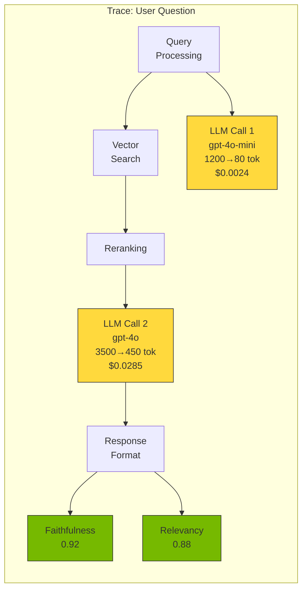
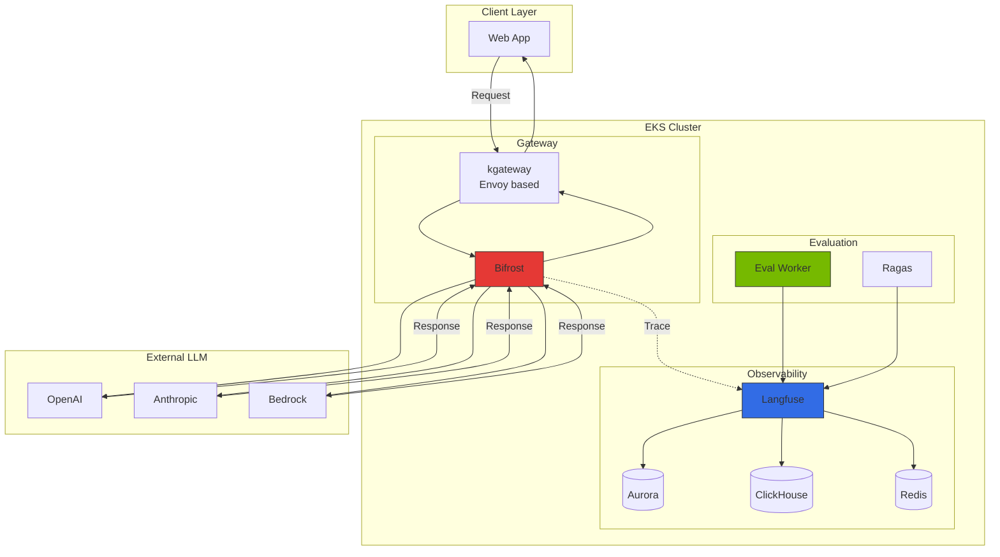
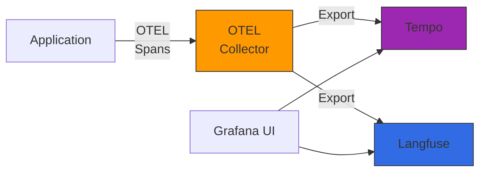

# LLMOps Observability Comparison Guide

## 1. Overview

### 1.1 Why Traditional APM Falls Short for LLM Workloads

Traditional Application Performance Monitoring (APM) tools fail to meet the special requirements of LLM-based applications:

- **Unable to Track Token Costs**: Existing APM only measures CPU/memory usage and fails to track input/output token counts and provider-specific pricing, which are the actual costs of LLM API calls
- **Absence of Prompt Quality Assessment**: While HTTP request/response bodies are logged, there is no prompt template version management, A/B testing, or quality evaluation metrics
- **Chain Tracing Limitations**: Complex chains and agent workflows in frameworks like LangChain/LlamaIndex are difficult to gain visibility into with simple HTTP traces
- **Lack of Semantic Context**: Only measures simple latency/throughput, unable to evaluate semantic quality such as "Is the answer accurate?" or "Did hallucination occur?"

### 1.2 Four Core Areas of LLMOps Observability

1. **Tracing**: Track entire request lifecycle (prompt -> LLM -> response), visibility into nested chain/agent steps
2. **Evaluation**: Measure response quality through automated/manual assessment (accuracy, faithfulness, relevance, toxicity, etc.)
3. **Prompt Management**: Prompt template version control, A/B testing, production deployment pipeline
4. **Cost Tracking**: Real-time aggregation of token costs by provider/model, team/project budget management

:::info Practical Deployment Guide
For practical configuration including Langfuse Helm deployment, Redis/ClickHouse setup, kgateway sub-path routing, and Bifrost OTel integration, refer to [Monitoring Stack Configuration Guide](../reference-architecture/monitoring-observability-setup.md).
:::

---

## 2. Core Concepts

### 2.1 Trace Structure

### 2.2 Key Concept Definitions

| Concept | Description |
|------|------|
| **Trace** | Top-level unit representing entire request lifecycle. User question -> multiple LLM calls -> final response |
| **Span** | Individual step composing a trace (LLM call, tool call, vector search, post-processing) |
| **Generation** | LLM API call details: input/output tokens, model name, parameters, latency, cost |
| **Score** | Response quality evaluation metrics: automated (LLM-as-Judge), manual (human feedback) |
| **Session** | Context grouping multiple traces in conversational applications |

---

## 3. Solution Comparison

### 3.1 Langfuse

**Open-source LLMOps Observability platform** (MIT license, full self-hosted support)

**Core Features**:
- **Tracing**: Native integration with LangChain, LlamaIndex, OpenAI SDK, complete visibility into nested chain/agent
- **Prompt Management**: Prompt template version management, A/B testing, production/staging environment separation
- **Evaluation**: LLM-as-Judge, rule-based automated evaluation, annotation queue manual evaluation, dataset management
- **Architecture**: PostgreSQL (metadata) + ClickHouse (analytics) + Redis (cache)

**Advantages**: Complete data ownership, unlimited scaling, robust evaluation pipeline, cost efficiency (self-hosted)

**Disadvantages**: Operational overhead (PG+CH+Redis management), initial configuration complexity

### 3.2 LangSmith

**Cloud-based Observability platform provided by LangChain AI**

**Core Features**:
- Zero-code integration with LangChain/LangGraph
- Hub (Prompt marketplace): Community sharing, version management, fork/share
- Evaluator library: Pre-defined evaluators, comparison mode
- Annotation queue: Team collaboration, RLHF data source

**Advantages**: Deep LangChain integration, managed service, integration within 5 minutes

**Disadvantages**: LangChain dependency, cloud-only (enterprise only for self-hosted), per-trace billing

### 3.3 Helicone

**Rust-based high-performance LLM Gateway + Observability integrated solution**

**Core Features**:
- Zero-code integration: Automatic tracking with just OpenAI endpoint URL change
- Built-in gateway features: Rate limiting, caching, retries, load balancing
- Real-time cost dashboard

**Advantages**: Ultra-fast integration (URL change only), high performance (Rust, &lt;10ms latency), built-in gateway features

**Disadvantages**: Lack of prompt management/evaluation pipeline, limited nested span tracking

### 3.4 Solution Comparison Table

| Feature | Langfuse | LangSmith | Helicone |
|------|----------|-----------|----------|
| **License** | MIT (open-source) | Proprietary | Proprietary (self-hosted available) |
| **Self-hosted** | Full support | Enterprise only | Supported |
| **Tracing** | ★★★★★ | ★★★★★ | ★★★ |
| **Prompt Management** | ★★★★★ (Version, A/B) | ★★★★ (Hub) | ★★ (Simple storage) |
| **Evaluation** | ★★★★★ (Pipeline) | ★★★★★ | ★ (None) |
| **Cost Tracking** | ★★★★★ | ★★★★ | ★★★★ |
| **LangChain Integration** | ★★★★ | ★★★★★ | ★★★ |
| **Framework Neutrality** | ★★★★★ | ★★★ | ★★★★★ |
| **Gateway Features** | None | None | ★★★★★ |
| **Scale Limits** | Unlimited (self-hosted) | Plan limits | Plan limits |
| **Data Sovereignty** | ★★★★★ | ★★ | ★★★★ |

---

## 4. Hybrid Architecture Recommendation

### 4.1 Why Single Solution Is Insufficient

Enterprise environments have complex requirements:

1. **Gateway Separation Needed**: Rate limiting, caching, failover managed independently from observability
2. **Multi-Framework Support**: Mix of LangChain, LlamaIndex, and custom code
3. **Data Sovereignty and Cost**: Cannot send sensitive data to cloud, billing spikes with large-scale traffic
4. **Advanced evaluation pipeline**: Ragas Integration with specialized frameworks like Ragas, CI/CD regression test automation

### 4.2 Recommended Combination: kgateway + Bifrost (Gateway) + Langfuse (Observability)

**Benefits**:
- **Gateway responsibility separation**: kgateway (Envoy based)handles traffic management, authentication, rate limiting; Bifrost handles provider routing and caching
- **Observability specialization**: Langfuse handles tracing, evaluation, and prompt management
- **Complete self-hosted**: All components run on EKS
- **Scalability**: Scale each layer independently

### 4.3 Helicone Standalone vs Bifrost+Langfuse Comparison

| Aspect | Helicone Standalone | Bifrost + Langfuse |
|------|---------------|---------------------|
| **Integration complexity** | Very low (URL change only) | Medium (SDK integration needed) |
| **Prompt Management** | Limited (storage only) | Strong (Version, A/B testing) |
| **Evaluation pipeline** | None | Full support (Ragas integration) |
| **Chain Tracking** | limited | Perfect (nested span) |
| **Scalability** | Gateway/Observability Combined | Independent scaling |
| **Suitable scenario** | MVP, Simple API calls | enterprise, Complex chain |

---

## 5. OpenTelemetry Integration Architecture

### 5.1 Why Integrate OpenTelemetry

Langfuse provides LLM-specific observability, but overall application context is managed by existing APM. Using OpenTelemetry:

- **Unified dashboard**: LLM Trace + existing APM trace on one screen
- **Correlation analytics**: entire flow: HTTP request -> DB query -> LLM call
- **Single instrumentation SDK**: send to both Langfuse and existing APM using only OpenTelemetry

### 5.2 OTel Semantic Conventions Mapping

| OTEL Attribute | Langfuse Field | Description |
|-----------|---------------|------|
| `llm.model` | `model` | Model name (gpt-4o, claude-3-opus)" |
| `llm.input_tokens` | `usage.input` | Input token count |
| `llm.output_tokens` | `usage.output` | Output token count |
| `llm.temperature` | `modelParameters.temperature` | Temperature Parameter |
| `llm.request.prompt` | `input` | Prompt |
| `llm.response.completion` | `output` | Response text |
| `llm.total_cost` | `calculatedTotalCost` | Calculated cost |

### 5.3 Grafana Tempo + Langfuse Combination

---

## 6. Evaluation pipeline Concept

### 6.1 Evaluation Methods

Langfuse evaluation supports three methods:

1. **LLM-as-Judge**: Evaluate response quality using separate LLM (Faithfulness, Relevancy)"
2. **Rule-based**: Custom evaluation logic with Python functions (Regex matching, keyword checks)
3. **Manual evaluation**: Human evaluation directly in annotation queue (RLHF Data collection)

### 6.2 Evaluation Metrics

| Metric | Range | Description | Evaluation Method |
|--------|------|------|-----------|
| **Faithfulness** | 0-1 | Is response faithful to provided context? | LLM-as-Judge |
| **Answer Relevancy** | 0-1 | Is response relevant to question? | Ragas (Embedding similarity) |
| **Context Precision** | 0-1 | Is retrieved context relevant to question? | Ragas |
| **Context Recall** | 0-1 | Is ground truth included in retrieved context? | Ragas |
| **Toxicity** | 0-1 | Does response contain harmful content? | Detoxify Library |
| **Latency** | ms | Response generation latency time | Auto-collected |
| **Cost** | USD | Cost per request | Auto-calculated |

### 6.3 Ragas Integration

Ragas is a RAG system-specific evaluation framework that integrates with Langfuse to provide more sophisticated evaluation. For details, refer to [RAG Evaluation with Ragas](./ragas-evaluation.md) document.

---

## 7. Recommendations by Scenario

| Scenario | Recommended Solution | Reason |
|----------|-------------|------|
| **LangChain/LangGraph Centric development** | LangSmith | Native LangChain integration, full chain tracking with one line of code |
| **Data sovereignty required (finance/healthcare)** | Langfuse (self-hosted) | Store all data in own infrastructure, GDPR/HIPAA Compliance |
| **Quick start (MVP/PoC)** | Helicone | Immediate tracking with URL change only, built-in gateway features |
| **Prompt engineering team operations** | Langfuse | Prompt Version Management, A/B testing, dataset + automated evaluation |
| **Enterprise hybrid** | Bifrost + Langfuse | Gateway/Observability Responsibility separation, independent scaling |
| **Full-stack GenAI platform** | kgateway + Bifrost + Langfuse + Ragas | API management + LLM routing + tracking + quality evaluation |
| **Large-scale traffic (10M+ traces per month)** | Langfuse + ClickHouse Cluster | Horizontal scaling possible, cost efficiency |

---

## 8. Summary

1. **LLMOps observability is essential**: Traditional APM does not support token cost, prompt quality, and chain tracking for LLM workloads.
2. **Three major solutions**: Langfuse(Open-source, self-hosted, Evaluation pipeline), LangSmith(LangChain Optimized, Managed), Helicone(Proxy-based, Gateway+Observability integration)
3. **Hybrid architecture recommendation**: Bifrost(Gateway) + Langfuse(Observability) combination is optimal for enterprise environments
4. **OpenTelemetry integration**: Connect existing APM and LLMOps observability with unified dashboard
5. **Evaluation pipeline**: LLM-as-Judge, Ragas, Annotation Queuefor automated/manual quality evaluation

---

## References

### Official Documentation
- [Langfuse Documentation](https://langfuse.com/docs)
- [LangSmith Documentation](https://docs.smith.langchain.com)
- [Helicone Documentation](https://docs.helicone.ai)
- [OpenTelemetry LLM Semantic Conventions](https://opentelemetry.io/docs/specs/semconv/gen-ai/)
- [Ragas Documentation](https://docs.ragas.io)

### Related Documentation
- [Monitoring Stack Configuration Guide](../reference-architecture/monitoring-observability-setup.md) - Langfuse Deployment, Bifrost OTel integration, kgateway routing practical configuration
- [Bifrost Gateway Configuration Guide](../reference-architecture/inference-gateway-routing.md)
- [RAG Evaluation with Ragas](./ragas-evaluation.md)
- [Agent Monitoring & Operations](./agent-monitoring.md)
