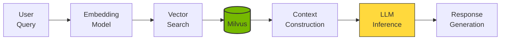
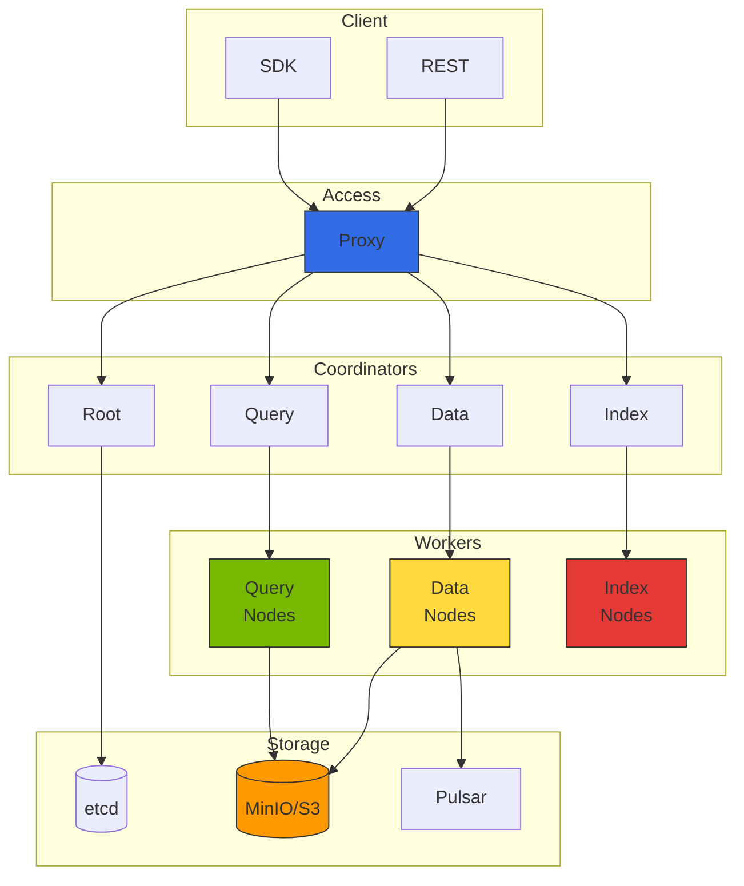

import {
  ComponentRolesTable,
  IndexComparisonTable,
  MonitoringMetricsTable,
  GPUInstanceTable,
  GPUIndexingPerformanceTable,
  StorageCostComparisonTable
} from '@site/src/components/MilvusTables';

# Milvus Vector Database Integration

> **Written**: 2026-02-13 | **Updated**: 2026-02-14 | **Reading time**: ~4 min

Milvus v2.4.x is an open-source vector database for large-scale vector similarity search. It serves as a core component of RAG (Retrieval-Augmented Generation) pipelines in the Agentic AI Platform.

## Overview

### Why Milvus Is Needed

In Agentic AI systems, vector databases serve the following roles:

- **Knowledge store**: Store documents, FAQs, product information as embedding vectors
- **Semantic search**: Search based on semantic similarity rather than keywords
- **Context provision**: Provide relevant information to LLMs to reduce hallucination
- **Long-term memory**: Store agent conversation history and learned content



## Milvus Cluster Architecture

### Distributed Architecture Components



### Component Roles

<ComponentRolesTable />

## EKS Deployment Guide

### Deployment Overview

Milvus can be deployed on EKS via Helm charts. For production environments, consider:

- **Cluster Mode**: Distributed architecture for high availability
- **etcd**: Metadata storage (minimum 3 replicas recommended)
- **Storage**: MinIO or Amazon S3/S3 Express One Zone
- **Message Queue**: Pulsar (event streaming)
- **Query/Data/Index Nodes**: Scale based on workload

**Recommended resource configuration:**
- Proxy: 2+ replicas, 1-2 CPU, 2-4Gi memory
- Query Node: 3+ replicas, 2-4 CPU, 8-16Gi memory
- Data Node: 2+ replicas, 1-2 CPU, 4-8Gi memory
- Index Node: 2+ replicas, 2-4 CPU, 8-16Gi memory

### Amazon S3 Integration

Using Amazon S3 directly instead of MinIO reduces operational burden. S3 Express One Zone provides faster performance and lower latency.

:::tip S3 Express One Zone Benefits
- **10x faster performance**: 10x faster data access vs standard S3
- **Consistent millisecond latency**: Single-digit millisecond latency
- **Cost efficiency**: 50% request cost reduction
- **Single AZ**: Optimal when used with compute resources in the same AZ
:::

:::info Detailed Deployment Guide
For Milvus deployment procedures, Helm values configuration, and S3 IAM policy examples, see [Milvus Official Helm Chart Documentation](https://milvus.io/docs/install_cluster-helm.md).
:::

## Index Type Selection Guide

### Major Index Type Comparison

<IndexComparisonTable />

### SCANN Index (Milvus 2.4+)

Google's Scalable Nearest Neighbors (SCANN) index is a high-performance index added in Milvus 2.4:

```python
# Create SCANN index
index_params = {
    "metric_type": "COSINE",
    "index_type": "SCANN",
    "params": {
        "nlist": 1024,  # Number of clusters
        "with_raw_data": True,  # Store raw data
    }
}

collection.create_index(field_name="embedding", index_params=index_params)
collection.load()
```

**SCANN advantages:**
- Search speed similar to HNSW
- Higher accuracy than IVF family
- Lower memory usage than HNSW
- Excellent performance on large datasets

## LangChain/LlamaIndex Integration

### LangChain Integration Example

```python
from langchain_community.vectorstores import Milvus
from langchain_openai import OpenAIEmbeddings
from langchain.text_splitter import RecursiveCharacterTextSplitter
from langchain_community.document_loaders import DirectoryLoader

# Load and split documents
loader = DirectoryLoader("./documents", glob="**/*.md")
documents = loader.load()

text_splitter = RecursiveCharacterTextSplitter(
    chunk_size=1000,
    chunk_overlap=200,
    length_function=len,
)
splits = text_splitter.split_documents(documents)

# Configure embedding model
embeddings = OpenAIEmbeddings(model="text-embedding-3-small")

# Create Milvus vector store
vectorstore = Milvus.from_documents(
    documents=splits,
    embedding=embeddings,
    connection_args={
        "host": "milvus-proxy.ai-data.svc.cluster.local",
        "port": "19530",
    },
    collection_name="langchain_docs",
    drop_old=True,
)

# Similarity search
query = "How to schedule GPUs in Kubernetes"
docs = vectorstore.similarity_search(query, k=5)
```

### RAG Pipeline Full Configuration

```python
from langchain_openai import ChatOpenAI
from langchain.chains import RetrievalQA
from langchain.prompts import PromptTemplate

llm = ChatOpenAI(model="gpt-4o", temperature=0)

prompt_template = """Use the following context to answer the question.
If the answer is not in the context, say "No information available."

Context:
{context}

Question: {question}

Answer:"""

PROMPT = PromptTemplate(
    template=prompt_template,
    input_variables=["context", "question"]
)

qa_chain = RetrievalQA.from_chain_type(
    llm=llm,
    chain_type="stuff",
    retriever=vectorstore.as_retriever(
        search_type="mmr",
        search_kwargs={"k": 5, "fetch_k": 10}
    ),
    chain_type_kwargs={"prompt": PROMPT},
    return_source_documents=True,
)

result = qa_chain.invoke({"query": "How to manage GPU resources?"})
```

## Query Optimization

### Hybrid Search (Vector + Keyword)

```python
from pymilvus import AnnSearchRequest, RRFRanker

vector_search = AnnSearchRequest(
    data=[query_embedding],
    anns_field="embedding",
    param={"metric_type": "COSINE", "params": {"ef": 64}},
    limit=20
)

# RRF (Reciprocal Rank Fusion) for result merging
results = collection.hybrid_search(
    reqs=[vector_search],
    ranker=RRFRanker(k=60),
    limit=10,
    output_fields=["text", "metadata"]
)
```

## High Availability and Backup

### Data Backup Strategy

Milvus provides an official backup tool (`milvus-backup`) for backing up and restoring collection data.

**Backup considerations:**
- Backup target: Export collection data to MinIO/S3 bucket
- Backup frequency: Daily or weekly backup recommended
- Restore strategy: Restore to same or different cluster

### Disaster Recovery

**DR strategy:**
- **Cross-region S3 replication**: Automatically replicate backup data to another AWS region
- **RTO**: S3 replication delay + Milvus cluster provisioning time
- **RPO**: Determined by backup frequency (typically 6-24 hours)

## Monitoring and Metrics

### Key Monitoring Metrics

<MonitoringMetricsTable />

### GPU Accelerated Indexing

Assigning GPUs to Index Nodes can significantly improve index build speed.

**Recommended GPU instances:**

<GPUInstanceTable />

**GPU Indexing Performance Comparison:**

<GPUIndexingPerformanceTable />

### Storage Cost Comparison

<StorageCostComparisonTable />

**Recommendations:**
- **Dev/Test**: MinIO (simple setup)
- **Production (general)**: S3 Standard (cost efficient)
- **Production (high-perf)**: S3 Express One Zone (10x faster performance)

---

## Related Documents

- [Agentic AI Platform Architecture](../design-architecture/agentic-platform-architecture.md)
- [Agentic AI Technical Challenges](../design-architecture/agentic-ai-challenges.md)
- [Ragas RAG Evaluation Framework](../operations-mlops/ragas-evaluation.md)
- [Agent Monitoring](../operations-mlops/agent-monitoring.md)

:::info Recommendations

- Operate at least 3 Query Nodes in production environments
- Consider DISKANN index for large datasets (100M+ vectors)
- Using S3 as storage significantly reduces operational complexity
- S3 Express One Zone provides 10x faster performance and 50% cheaper request costs
- GPU-accelerated indexing can significantly reduce build times (g5.xlarge recommended)
- Milvus v2.4.x provides advanced features including SCANN index, hybrid search, scalar filtering, and dynamic schema
- Use Helm chart version 4.1.x to deploy Milvus 2.4.x
:::

:::warning Cautions

- Index builds are CPU/memory intensive; perform during off-peak hours
- Collection deletion permanently removes data; verify backups first
- GPU Index Nodes are costly; enable only when needed
- S3 Express One Zone is limited to a single AZ; consider HA requirements
:::
