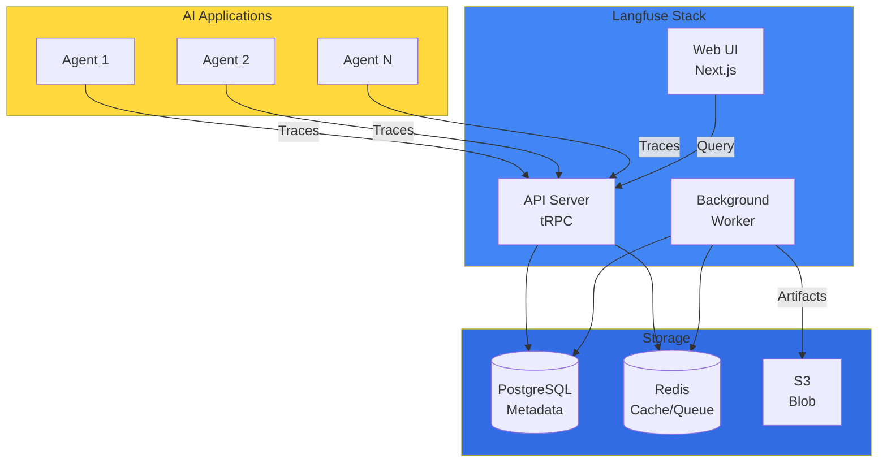
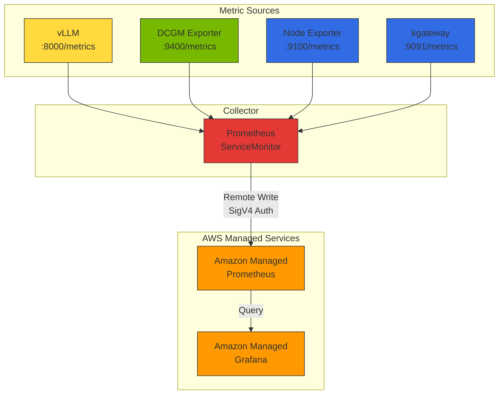
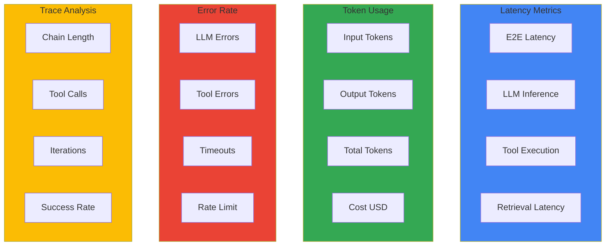

import {
  LangFuseVsLangSmithTable,
  LatencyMetricsTable,
  TokenUsageMetricsTable,
  ErrorRateMetricsTable,
  DailyChecksTable,
  WeeklyChecksTable,
  MaturityModelTable
} from '@site/src/components/AgentMonitoringTables';

# AI Agent Monitoring and Operations

This document covers the monitoring architecture, key metric design, and alerting strategy for Agentic AI applications at a conceptual level.

:::info Production Deployment Guide
For Langfuse Helm deployment, AMP/AMG configuration, ServiceMonitor YAML, and Grafana dashboard JSON, see the [Monitoring Stack Setup Guide](../../reference-architecture/integrations/monitoring-observability-setup.md).
:::

## 1. Overview

Agentic AI applications perform complex reasoning chains and various tool calls, making it difficult to achieve sufficient visibility with traditional APM (Application Performance Monitoring) tools alone. LLM-specialized observability tools like Langfuse and LangSmith provide the following core capabilities:

- **Trace tracking**: Full flow tracking of LLM calls, tool execution, and agent reasoning processes
- **Token usage analysis**: Input/output token counts and cost calculation
- **Quality evaluation**: Response quality scoring and feedback collection
- **Debugging**: Problem diagnosis through prompt and response content review

:::info Target Audience
This document is intended for platform operators, MLOps engineers, and AI developers. Basic understanding of Kubernetes and Python is required.
:::

---

## 2. Monitoring Architecture

### Langfuse Architecture Overview

Langfuse v3.162.0+ consists of the following components:



### AMP/AMG Integrated Data Flow



### Monitoring Data Layers

| Layer | Collection Tool | Metric Pattern | Visible Items |
|-------|----------------|---------------|---------------|
| **LLM Inference** | Langfuse | trace, generation | Token usage, cost, TTFT, per-user patterns |
| **Model Server** | vLLM Prometheus | `vllm_*` | Request count, batch size, KV cache utilization, TPS |
| **GPU** | DCGM Exporter | `DCGM_FI_DEV_*` | GPU utilization, temperature, power, memory usage |
| **Infrastructure** | Node Exporter | `node_*` | CPU, memory, network, disk I/O |
| **Gateway** | kgateway | `envoy_*` | Request count, latency, error rate, upstream status |

---

## 3. Langfuse vs LangSmith Comparison

<LangFuseVsLangSmithTable />

:::tip Selection Guide

- **Langfuse**: When data sovereignty is important or cost optimization is needed
- **LangSmith**: When LangChain-based development is the focus and quick start is needed
:::

### AWS Native Observability: CloudWatch Generative AI Observability

Amazon CloudWatch Generative AI Observability is an AWS-native solution for LLM and AI agent monitoring:

- **Infrastructure-agnostic monitoring**: Supports AI workloads across Bedrock, EKS, ECS, on-premises, and more
- **Agent/tool tracking**: Built-in views for agents, knowledge bases, and tool calls
- **End-to-end tracing**: Tracking across the entire AI stack
- **Framework compatibility**: Support for external frameworks like LangChain, LangGraph, CrewAI

Using Langfuse v3.x (self-hosted data sovereignty) together with CloudWatch Gen AI Observability (AWS-native integration) provides the most comprehensive observability.

---

## 4. Key Monitoring Metrics

Defines the key metrics to track in Agentic AI applications.

### Metric Categories



### Latency Metrics

<LatencyMetricsTable />

### Token Usage Metrics

<TokenUsageMetricsTable />

### Error Rate Metrics

<ErrorRateMetricsTable />

---

## 5. PromQL Query Reference

### GPU Metrics

```prometheus
# Overall GPU average utilization
avg(DCGM_FI_DEV_GPU_UTIL)

# Per-node GPU utilization
avg(DCGM_FI_DEV_GPU_UTIL) by (Hostname)

# GPU memory utilization
avg(DCGM_FI_DEV_FB_USED / DCGM_FI_DEV_FB_FREE * 100) by (gpu)
```

### vLLM Metrics

```prometheus
# Overall TPS (tokens generated per second)
rate(vllm_generation_tokens_total[5m])

# Per-model TPS
sum(rate(vllm_generation_tokens_total[5m])) by (model)

# TTFT P99 (Time to First Token)
histogram_quantile(0.99, rate(vllm_time_to_first_token_seconds_bucket[5m]))

# TTFT P95
histogram_quantile(0.95, rate(vllm_time_to_first_token_seconds_bucket[5m]))

# E2E Latency P99
histogram_quantile(0.99, rate(vllm_e2e_request_latency_seconds_bucket[5m]))

# Average batch size
avg(vllm_num_requests_running)
```

### Gateway Metrics

```prometheus
# 5xx error rate (%)
rate(envoy_http_downstream_rq_xx{envoy_response_code_class="5"}[5m]) 
/ 
rate(envoy_http_downstream_rq_total[5m]) * 100

# Upstream health check failure rate
sum(rate(envoy_cluster_upstream_cx_connect_fail[5m])) by (envoy_cluster_name)
```

### Cost Metrics

```prometheus
# Daily total cost
sum(increase(llm_cost_dollars_total[24h]))

# Per-tenant daily cost
sum(increase(llm_cost_dollars_total[24h])) by (tenant_id)

# Per-model cost ratio
sum(increase(llm_cost_dollars_total[24h])) by (model)
/ ignoring(model) group_left
sum(increase(llm_cost_dollars_total[24h]))

# Budget utilization (monthly)
sum(increase(llm_cost_dollars_total[30d])) by (tenant_id)
/ on(tenant_id) group_left
tenant_monthly_budget_usd
```

---

## 6. Alerting Strategy

### Alert Threshold Design

| Alert | Condition | Severity | Duration |
|-------|----------|----------|----------|
| **Agent High Latency** | P99 latency > 10s | Warning | 5 min |
| **Agent High Error Rate** | Error rate > 5% | Critical | 5 min |
| **LLM Rate Limit** | Rate limit errors > 10/5min | Warning | 2 min |
| **Daily Cost Budget** | Daily cost > $100 | Warning | Immediate |
| **GPU High Temperature** | GPU temp > 85C | Warning | 5 min |
| **GPU Memory Full** | GPU memory > 95% | Critical | 3 min |
| **vLLM High Latency** | P99 E2E latency > 30s | Warning | 5 min |

### Alert Hierarchy

1. **Infrastructure layer**: GPU temperature, memory, power anomalies
2. **Model server layer**: vLLM latency increase, KV cache shortage
3. **Application layer**: Agent error rate, Rate limit
4. **Business layer**: Cost overrun, SLA violations

:::tip Monitoring Best Practices

1. **Cross-layer metric correlation**: Analyze correlations — LLM request increase -> GPU utilization rise -> infrastructure load increase
2. **Anomaly detection**: When P99 latency suddenly increases, simultaneously check GPU temperature and memory usage
3. **Capacity planning**: Consider provisioning additional GPU nodes when average GPU utilization exceeds 70%
4. **Cost optimization**: Prioritize models with lower TTFT to improve user experience + increase throughput
:::

---

## 7. Cost Tracking

### Cost Tracking Concepts

Track LLM usage costs by the following criteria:

- **Per-model**: Total cost and request count per model, identifying the most expensive models
- **Per-tenant**: Per-tenant/team daily token usage and budget utilization
- **Per-time**: Peak time analysis, cost trends

### Per-Model Cost Reference (2026-04 baseline)[^1]

| Tier | Model | Input ($/1M tok) | Output ($/1M tok) | Features |
|------|-------|----------------|----------------|----------|
| **Frontier** | Claude Opus 4.7 | $15 | $75 | Highest quality reasoning |
| **Frontier** | GPT-4.1 / o3 | $10 | $30 | Complex reasoning |
| **Frontier** | Gemini 2.5 Pro | $1.25 | $5 | Enhanced multimodal |
| **Balanced** | Claude Sonnet 4.6 | $3 | $15 | Quality-cost balance |
| **Balanced** | GPT-4.1 mini | $0.40 | $1.60 | Fast inference |
| **Balanced** | Gemini 2.5 Flash | $0.10 | $0.40 | High throughput |
| **Fast/Cheap** | Claude Haiku 4.5 | $0.80 | $4 | Simple tasks |
| **Fast/Cheap** | GPT-4.1 nano / o4-mini | $0.15 | $0.60 | Ultra-low cost |
| **Fast/Cheap** | Gemini 2.5 Flash-Lite | $0.05 | $0.20 | Minimal latency |
| **Open-weight** | DeepSeek V3.1 | Self-hosted | Self-hosted | Open license |
| **Open-weight** | Llama 4 Scout | Self-hosted | Self-hosted | Meta official |
| **Open-weight** | Qwen3-72B | Self-hosted | Self-hosted | Alibaba Cloud |

[^1]: As of 2026-04-17. For latest pricing, see official pricing pages: [OpenAI Pricing](https://openai.com/api/pricing/), [Anthropic Pricing](https://www.anthropic.com/pricing), [Google AI Pricing](https://ai.google.dev/pricing)

:::tip Cost Optimization Tips

1. **Model selection optimization**: Use cheaper models (GPT-4.1 nano, Haiku 4.5, Gemini 2.5 Flash-Lite) for simple tasks
2. **Prompt optimization**: Reduce input tokens by removing unnecessary context
3. **Caching**: Cache responses for repetitive queries (Prompt Caching, Semantic Caching)
4. **Cascade Routing**: Try low-cost model first, fallback to high-performance model on failure — 66% cost savings possible
5. **Open-weight models**: Convert to fixed costs with DeepSeek V3.1, Llama 4, Qwen3 when self-hosting
:::

---

## 8. Operations Checklist

### Daily Checks

<DailyChecksTable />

### Weekly Checks

<WeeklyChecksTable />

---

## 9. Monitoring Maturity Model

<MaturityModelTable />

---

## 10. Next Steps

- [Monitoring Stack Setup Guide](../../reference-architecture/integrations/monitoring-observability-setup.md) - AMP/AMG deployment, Langfuse Helm installation, ServiceMonitor, Grafana dashboard production setup
- [LLMOps Observability Comparison Guide](./llmops-observability.md) - In-depth comparison of Langfuse vs LangSmith vs Helicone
- [Agentic AI Platform Architecture](../../design-architecture/foundations/agentic-platform-architecture.md) - Overall platform design
- [RAG Evaluation Framework](../governance/ragas-evaluation.md) - Quality evaluation with Ragas

## References

- [Langfuse Documentation](https://langfuse.com/docs)
- [LangSmith Documentation](https://docs.smith.langchain.com/)
- [CloudWatch Generative AI Observability](https://aws.amazon.com/blogs/mt/launching-amazon-cloudwatch-generative-ai-observability-preview/)
- [OpenTelemetry Documentation](https://opentelemetry.io/docs/)
- [Prometheus Monitoring](https://prometheus.io/docs/)
