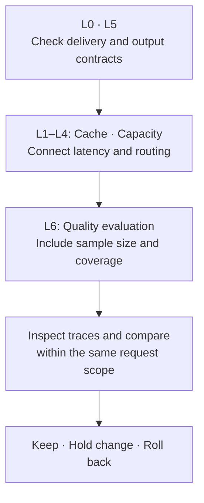

## 1. Overview {#overview}

This guide connects cache, capacity, latency, and routing metrics to narrow the investigation of vLLM inference pools. HTTP success, completed delivery, output contract compliance, and content accuracy are separate outcomes. The intended readers are platform teams operating inference engines, gateways, metrics, and traces. Infrastructure metrics do not replace quality scores, and simultaneous changes do not establish a cause.

| Document | Scope | Relationship |
|---|---|---|
| [Agent Monitoring and Operations](./agent-monitoring.md) | Trace and score storage and operations | Collection foundation |
| [LLMOps Observability](./llmops-observability.md) | Tool comparison and evaluation pipelines | Tool selection |
| [Cache Hit Strategy](../../model-serving/inference-optimization/cache-hit-strategy.md) | Cache layers and measurement | Background for workload-specific targets |
| [Cache Tuning and Accuracy Correlation](./prefix-cache-tuning-accuracy-correlation.md) | Data contracts, correlation, and quality gates | Tuning validation procedure |

**Verification scope:** Engine definitions refer to pinned vLLM `v0.26.0` source. EPP metric examples refer to llm-d-router `v0.10.0`. For another image, first compare its `/metrics` HELP, TYPE, labels, and configuration with that release. Every numerical example and threshold is illustrative, not a production measurement or guarantee. Account for external KV transfer separately from local caching.

## 2. Background {#background}

HTTP 200 does not guarantee completed delivery, particularly for streaming. Errors or disconnections can occur after response headers. The vLLM OpenAI-compatible stream can send `[DONE]` after an error payload, so the terminal marker alone does not establish success either. Record error events, each choice's finish reason, protocol termination, and cancellation at the client or gateway ([serving source](https://github.com/vllm-project/vllm/blob/v0.26.0/vllm/entrypoints/openai/chat_completion/serving.py)).

Prefix caching reuses KV associated with identical token prefixes and cache keys to reduce prefill computation. A cache miss does not mean a lower quality score. However, preserving outputs by design is not a guarantee of bitwise equality across executions. vLLM does not guarantee reproducibility by default: batch composition, kernels, hardware, and engine versions can affect results. Collision risks from non-cryptographic cache hashes require separate consideration ([cache design](https://github.com/vllm-project/vllm/blob/v0.26.0/docs/design/prefix_caching.md), [reproducibility](https://github.com/vllm-project/vllm/blob/v0.26.0/docs/usage/reproducibility.md)).

Preemption returns a running request to a waiting state for later resumption. It signals capacity pressure, additional work, or latency; its count does not measure accuracy. Use request traces to establish whether additional latency preceded cancellation or incomplete delivery. Content quality requires separate evaluation through reference answers, human review, verifiable tool outcomes, or LLM-as-a-Judge. Judge scores are estimates with errors and biases.

## 3. Seven Semantic Metric Layers {#metric-layers}

| Layer | Question | Main signals | Limits |
|---|---|---|---|
| L0 Contract and availability | Did the request and stream complete? | HTTP status, protocol completion, errors, cancellation, `up` | Does not measure content accuracy |
| L1 Cache efficiency | How much prefix computation was reused? | `vllm:prefix_cache_hits_total`, `vllm:prefix_cache_queries_total`, request cached tokens | Causes of a low ratio require investigation |
| L2 Capacity | Can the engine accommodate execution demand? | `vllm:kv_cache_usage_perc`, `vllm:num_preemptions_total`, running and waiting requests | Utilization alone does not establish eviction or quality loss |
| L3 Latency | How long did the user wait? | TTFT, ITL, per-request TPOT, queue and e2e latency | Percentiles from different populations cannot be directly subtracted |
| L4 Routing | Which endpoint was selected? | EPP attempts, failures, latency, endpoint queues and request distribution | Scorer execution does not prove a suitable selection |
| L5 Output proxies | Is an output contract violation possible? | `finished_reason`, output length, retries, loop steps | Short output and `length` do not always mean failure |
| L6 Quality evaluation | Did the output satisfy the task? | Contract checks, reference evaluation, human or judge scores, coverage | Depends on rubric, sample, and evaluator |

TTFT means Time to First Token, ITL means Inter-Token Latency, and TPOT means Time per Output Token. An inter-token histogram and a histogram of mean TPOT per request have different weighting. Do not mix them under an identical dashboard label.

The arrows below show an analysis sequence, not causal relationships between layers.



## 4. Decomposing Cache Hit Ratio {#cache-analysis}

### 4.1 Four Dimensions {#cache-breakdown}

- **Pool and model:** Divide the sum of hit rates by the sum of query rates over the same scope. An unweighted average of Pod ratios ignores traffic volume. Separate pools sharing a `model_name` with a pool identifier.
- **Pod and engine:** Local cache belongs to an engine replica, not a node-wide shared cache. Compare low hit ratios with Pod creation, request distribution, model revisions, and prefix similarity. Unequal distribution alone does not establish a routing defect.
- **Tenant:** Compare the cached and total input tokens actually captured by the gateway. Distinguish missing usage from zero hits. Fill sparse counters with zero only when their exporter contract explicitly defines absence as zero.
- **Template and version:** Inspect prefix token IDs, chat templates, LoRA, multimodal keys, and cache salts. Changing a version string alone does not invalidate cached KV. Reuse changes when tokens or relevant keys change.

The engine's native labels are `model_name` and `engine`. The following PromQL assumes collection adds `cluster`, `namespace`, and `pod` as target labels, with one engine metrics source per `(cluster, namespace, pod, engine)`. Deduplicate HA collection; add an identity such as `instance` when multiple servers share a Pod. A `cluster` label present only as a remote-write external label might not exist in local queries.

```promql
# Token-weighted hit ratio; no traffic remains undefined, not zero.
(
  sum by (cluster, namespace, pod, model_name, engine) (
    rate(vllm:prefix_cache_hits_total[5m])
  )
  /
  sum by (cluster, namespace, pod, model_name, engine) (
    rate(vllm:prefix_cache_queries_total[5m])
  )
)
and on (cluster, namespace, pod, model_name, engine)
(
  sum by (cluster, namespace, pod, model_name, engine) (
    rate(vllm:prefix_cache_queries_total[5m])
  ) > 0
)
```

Apply `rate()` before aggregation so individual counter resets can be handled. In `v0.26.0`, prefix counters count **tokens**, not requests or blocks. Queries for resumed, previously preempted requests are accumulated in separate statistics fields; this ratio is not the proportion of all recomputation work ([statistics source](https://github.com/vllm-project/vllm/blob/v0.26.0/vllm/v1/metrics/stats.py)).

### 4.2 Disabled, Missing, and Structural Misses {#cache-eligibility}

`vllm:cache_config_info` is a gauge with value 1 and configuration encoded as labels. It has `engine` but no `model_name`, so join on `(cluster, namespace, pod, engine)` under the collection contract above. `enable_prefix_caching="False"` establishes that caching is disabled. A missing configuration series means **unknown**, including possible collection failure or version differences, rather than disabled.

A structural miss can occur when the reusable shared prefix of a request does not reach the matching boundary. Do not classify an entire pool from mean or p50 prompt length and physical `block_size` alone. In a **synthetic example**, an engine supporting only full-block matching with a 32-token unit cannot reuse a complete block from a 20-token shared prefix. The problem remains even if the entire prompt contains 200 tokens.

Engine-specific features qualify the general full-block description. In `v0.26.0`, `prefix_match_unit` can define a matching boundary finer than the physical block, but does not change how frequently states are stored. Check hybrid attention group constraints as well. Do not suppress alerts using a string regex on `block_size` or a large-block flag ([CacheConfig](https://github.com/vllm-project/vllm/blob/v0.26.0/vllm/config/cache.py)).

### 4.3 Cached Prefill and Multi-turn Requests {#saved-prefill}

For the same set of finished requests, the following difference aggregates cached prefill tokens per second. Pinned source records `prompt_tokens - max(cached_tokens, 0)` in the per-request prefill-computed histogram. This is not a measurement of actual GPU work, total preemption recomputation, or monetary savings. External KV transfer can also make its population differ from local prefix counters.

```promql
sum by (cluster, namespace, model_name) (
  rate(vllm:request_prompt_tokens_sum[5m])
)
-
sum by (cluster, namespace, model_name) (
  rate(vllm:request_prefill_kv_computed_tokens_sum[5m])
)
```

Investigate negative values for missing collection, version differences, or mismatched aggregation rather than silently clamping to zero. Evaluate economic effects with absolute cached tokens, TTFT, throughput, resources consumed, and the applicable billing scope. Self-hosted GPU costs and a provider's cached-token discount are separate contracts.

Append-only multi-turn input can increase reuse opportunities, but hit ratio need not increase monotonically with turn depth. Replica selection, eviction, chat-template serialization, tool messages, context truncation, and cache salts all matter. Inspect final token prefixes and relevant keys rather than textual similarity alone.

### 4.4 Classification Order {#cache-classification}

1. **unknown:** Targets, required series, or configuration are missing or stale.
2. **disabled:** Configuration confirms that prefix caching is off.
3. **idle:** Query volume is below the evaluation threshold.
4. **within-target:** The workload's efficiency target is met. Quality acceptance is separate.
5. **structural-miss hypothesis:** Check shared request prefixes and actual matching constraints.
6. **capacity / prompt / routing / reset hypotheses:** Investigate KV, queues, deployments, and request composition together. Causes can coexist.

### 4.5 Request Gaps and Block Residency {#cache-residency}

Local prefix caching uses free-queue eviction rather than a fixed TTL. In `v0.26.0`, enable the following metrics with `--kv-cache-metrics` and select the sampling rate with `--kv-cache-metrics-sample`. Defaults are disabled and 0.01, respectively. They require log stats, so `--disable-log-stats` must not be set ([ObservabilityConfig](https://github.com/vllm-project/vllm/blob/v0.26.0/vllm/config/observability.py)).

| Histogram | Measurement | Limitation |
|---|---|---|
| `vllm:kv_block_idle_before_evict_seconds` | Last touch to eviction | Not a residency guarantee for the next request |
| `vllm:kv_block_reuse_gap_seconds` | Gaps between sampled block touches | Only recent gaps are retained in a ring buffer |
| `vllm:kv_block_lifetime_seconds` | Allocation to eviction | Not the lifetime distribution of currently resident blocks |

All three distributions receive observations **through eviction events for sampled blocks**. Long-lived blocks may not yet appear within the observation window, and never-reused blocks have no reuse gap. Comparing p95 and p50 from different populations is exploratory, not a session-level hit/miss rule. Long lifetime and short idle also do not uniquely identify long decoding as the cause ([collection source](https://github.com/vllm-project/vllm/blob/v0.26.0/vllm/v1/metrics/loggers.py)).

In traces, distinguish user-turn gaps from internal tool-call gaps. A start-to-start gap includes the previous response time; also record the idle gap from previous completion to next start. A cached-ratio versus gap scatterplot shows association, but routing, load, and input changes can produce a boundary that is not a TTL.

## 5. Combining Capacity, Latency, and Routing {#capacity-latency-routing}

### 5.1 Capacity and Latency {#capacity-latency}

High KV utilization together with preemption and growing queues strengthens a capacity-pressure hypothesis. Low utilization does not rule out earlier eviction or short saturation bursts. Illustrative values of 0.85 and 0.60 are not universal boundaries. Adding replicas does not enlarge an individual engine's KV store and can reduce locality depending on routing. Compare `gpu_memory_utilization`, concurrency limits, KV dtype, and similar controls one at a time; include quality evaluation for FP8 changes.

When TTFT rises as hit ratio falls, investigate prefill, queues, input length, and scaling events. A flat hit ratio does not prove that queueing caused the latency. Tokenization, networking, and model execution changes are other candidates. Engine and gateway timers start at different points; subtracting their p95 values does not measure per-layer cost.

### 5.2 Routing {#routing}

The EPP (Endpoint Picker) selects endpoints within a pool. Distinguish this from model selection in an LLM API Gateway. Check the current project split and the metric contract of the deployed image. The following names are from llm-d-router `v0.10.0`. Adding their legacy `inference_pool_*`, `inference_extension_*`, or `inference_objective_*` aliases would double-count values ([official catalog](https://github.com/llm-d/llm-d-router/blob/v0.10.0/docs/metrics.md)).

| Metric | Purpose | Additional checks |
|---|---|---|
| `llm_d_epp_ready_endpoints` | Ready endpoints | Not necessarily the Pod count |
| `llm_d_epp_average_kv_cache_utilization` | Pool mean KV use | Engine-level variation and collection time |
| `llm_d_epp_per_endpoint_queue_size` | Endpoint queue depth | `name`, `model_server_endpoint`, and traffic distribution |
| `llm_d_epp_scheduler_attempts_total` | Scheduling attempts and status | Failure causes and candidate endpoints |
| `llm_d_epp_scheduler_e2e_duration_seconds` | Scheduling latency | Gateway and engine traces |
| `llm_d_epp_plugin_duration_seconds` | Plugin execution time | `extension_point`, `plugin_type`, `plugin_name` |

An observed plugin series is evidence that the plugin executed. Absence can mean no configuration, no traffic, missing collection, or an unexercised path. Inspect active configuration, execution paths, cache-index freshness, and actual endpoint choices together. Session affinity can concentrate load; validate the cache scorer's tradeoffs as well.

## 6. Output Quality Proxies {#output-proxies}

Despite its name, `vllm:request_success_total` counts finished requests by reason. The `v0.26.0` enum includes `stop`, `length`, `abort`, `error`, and `repetition`. Distinguish engine `finished_reason` from API `finish_reason`; for example, do not expect the API's `tool_calls` value among engine labels ([finish-reason source](https://github.com/vllm-project/vllm/blob/v0.26.0/vllm/v1/engine/__init__.py)).

```promql
# Share of each engine finish reason among finished requests.
(
  sum by (cluster, namespace, model_name, finished_reason) (
    rate(vllm:request_success_total[5m])
  )
  / on (cluster, namespace, model_name) group_left
  sum by (cluster, namespace, model_name) (
    rate(vllm:request_success_total[5m])
  )
)
and on (cluster, namespace, model_name)
(
  sum by (cluster, namespace, model_name) (
    rate(vllm:request_success_total[5m])
  ) > 0
)
```

| Proxy | Investigation | Unsupported conclusion |
|---|---|---|
| Rising `length` | `max_tokens`, model length limits, load-generator settings | Every `length` response failed its task |
| Short output or empty body | Refusal, reasoning-only output, valid tool calls, concise answers | Fewer than five tokens always means an empty answer |
| Rising `abort` | Cancellation, deadlines, disconnections | Attribution exclusively to latency or a client defect |
| Backend failures and retries | Attempt counts versus logical requests, retry and fallback traces | Failure rate equals hidden retry rate |
| Gateway errors without engine errors | Authentication, network, routing, and engine telemetry | Missing or zero engine errors prove engine health |
| Increasing Agent steps | Repeated tool calls, progress, time and token budgets | Engine `vllm:iteration_tokens_total` measures Agent steps |

Although its name contains `total`, `vllm:iteration_tokens_total` is a **histogram** of tokens per engine step, not an Agent-loop counter. Define whether output token counts include content, reasoning, and tool arguments.

## 7. Quality Gates {#quality-gates}

### 7.1 Score Schema {#score-schema}

These are proposed application scores, not built-in Langfuse scores or vLLM metrics. Keep `unknown`, `skipped`, and evaluator errors separate from failure 0. Store eligible, evaluated, and missing counts alongside scores.

| Score | Value | Contract |
|---|---|---|
| `answer_present` | 0/1 | Task-required content or a valid tool call exists; separate final answers from intermediate tool calls |
| `not_truncated` | 0/1 or unevaluated | 1 only with confirmed completed delivery and a normal finish reason; 0 for `length`, errors, or interruption; unevaluated when evidence is missing |
| `format_valid` | 0/1 | Validate types, required keys, and constraints against the agreed JSON Schema or equivalent |
| `contains_expected` | 0/1 | Explicit keyword check; does not guarantee semantic correctness or exclude negation and hallucination |
| `judge_accuracy`, `judge_helpfulness` | 0–1 | Judge estimates under a versioned rubric and defined evaluation inputs |
| `judge_accepted` | 0/1 | Example: accuracy ≥ 0.7 and helpfulness ≥ 0.5; validate thresholds for the task |

Reaching `max_tokens` is not sufficient evidence of truncation. Apply preprocessing such as removing JSON fences only when the contract permits it. Arbitrarily removing `<...>` can corrupt valid user output.

Langfuse supports NUMERIC, BOOLEAN, and CATEGORICAL scores. Its current Metrics API v2 includes `scores-boolean`; consult the compatibility matrix for APIs available on self-hosted v3. NUMERIC 0/1 is a possible schema choice, not a universal workaround for unsupported BOOLEAN aggregation. Verify filter operators against the selected endpoint version ([Metrics API](https://langfuse.com/docs/metrics/features/metrics-api)).

Attach scores to the correct trace and observation. Reuse a score ID for retries, but include evaluator version, rubric, and evaluation-repeat ID in its identity. Reusing that ID for a different evaluation version overwrites audit history. Apply access, retention, and de-identification policies to content and rationales ([Scores API](https://langfuse.com/docs/evaluation/evaluation-methods/scores-via-sdk)).

### 7.2 Sampling and Budget {#sampling}

Apply deterministic checks to all eligible requests where feasible and sample judge evaluations within budget. An illustrative 2% rate combined with a per-template hard cap produces inclusion probabilities that vary with time and load. Record selection rules and inclusion probabilities, then use stratified comparisons or appropriate weights. Evaluated requests are not automatically a random sample of all traffic.

Measure evaluation calls, tokens, cost, errors, and latency; exclude evaluator traffic from ordinary user evaluation. Polling observation lists requires an ingestion watermark, overlapping retrieval windows, and idempotent writes. Display last-processed time and coverage to distinguish high scores from absent data. Keep untrusted evaluation inputs separate from the judge's rubric so they are not treated as instructions.

### 7.3 Delivered versus Accepted {#delivered-accepted}

Do not subtract a sampled judge pass rate from the overall HTTP success rate before aligning their denominators.

| Rate | Denominator | Meaning |
|---|---|---|
| HTTP success | All eligible logical requests | Status-code result |
| Delivered | All eligible logical requests | Successful completion of response or stream delivery |
| Evaluation coverage | Eligible Delivered requests | Fraction with valid evaluation results |
| Accepted among evaluated | Requests with all required valid evaluations | Fraction passing the specified contract and quality criteria |

Join delivery, contract, and quality outcomes within the same evaluation cohort, or report estimates and confidence intervals appropriate to the sampling design. Even multiplying rates to estimate overall acceptance requires explicit assumptions such as sample representativeness. An unscored response is not an automatic pass.

### 7.4 Cache Tuning and the Accuracy Gate {#tuning-quality-gate}

Routing and capacity controls intend to preserve model inputs, but numerical nondeterminism, timeouts, and traffic allocation can still affect outcomes. FP8 KV, prompt reordering, serialization changes, context truncation, and model or tier changes can alter output. A higher hit ratio alone is insufficient for promotion.

Before changing configuration, define acceptable quality degradation, evaluation unit, sample size, comparison window, and rollback criteria. Concurrent canaries reduce temporal differences but do not automatically provide random assignment or comparable populations. Require confidence bounds and coverage that exclude the unacceptable degradation, not merely a statistically nonsignificant difference. See the [quality validation guide](./prefix-cache-tuning-accuracy-correlation.md#comparison-design).

## 8. Decision Matrix {#decision-matrix}

These combinations prioritize investigation rather than establish causes. Adapt illustrative thresholds to the workload.

| Observed combination | Hypothesis | Next check or action |
|---|---|---|
| Required series absent | Collection failure, unsupported feature, configuration difference | Check scraping and version |
| Enabled cache, low hits, short shared prefix | Matching-boundary constraint | Inspect token prefixes and group-specific matching |
| Low hits, high KV, preemption, queues | Capacity pressure | Check request length and concurrency; compare one control at a time |
| Low hits with a new Pod or prefix | Cold cache or changed key | Inspect lifecycle, warm-up, and load distribution |
| Tenant A loses hits as B's load rises | Shared-resource contention | Confirm common engine placement, eviction, and load |
| Endpoint hit and queue variation | Locality, imbalance, request-mix differences | Check scorer, traces, and model revisions |
| TTFT rises | Queue, prefill, tokenization, network | Inspect request phases and load changes |
| `length`, `abort`, or `repetition` rises | Possible output-contract regression | Check finish cause, task, and client records |
| More backend attempts with normal HTTP success | Retry or fallback | Link logical requests to backend attempts |
| Quality falls after a template change | Possible prompt regression | Evaluate comparable cohorts, then hold or roll back |
| Agent steps and cost rise | Possible failure to converge | Bound steps, time, tokens, and tool permissions |
| Long idle gaps with low cached ratio | Eviction, different replica, changed input | Inspect session, target engine, and final input together |

## 9. Implementation Roadmap {#implementation-roadmap}

1. **Data contract:** Define image revisions, labels, units, usage mappings, and request, attempt, and session IDs.
2. **Engine and delivery view:** Connect cache ratio and query volume with KV, queues, latency, finish reasons, and stream completion.
3. **Routing view:** Connect endpoint selection, plugin execution, and index freshness.
4. **Evaluation view:** Display scores, evaluator version, coverage, and processing lag together. Langfuse is one storage option; another evaluation store can serve the same role.
5. **Rule validation:** Test counter resets, idle traffic, missing series, disabled caching, and multiple namespaces using synthetic fixtures before choosing operational thresholds.

Deployment manifests and Prometheus Operator configuration belong in the [Monitoring Stack Setup Guide](../../reference-architecture/integrations/monitoring-observability-setup.md). PromQL here illustrates interpretation; it is not a ready-to-apply deployment configuration.

## 10. Alerts and Recording Rules {#alerts}

Store query volume alongside each ratio. Suppose the hit ratio above is recorded as `llm:prefix_cache_hit_ratio:rate5m`, and its query rate with matching dimensions as `llm:prefix_cache_queries:rate5m`. The following condition detects a **sustained low hit ratio**. It does not calculate a drop from a previous baseline, so it is not named a cliff.

```promql
(
  llm:prefix_cache_hit_ratio:rate5m < 0.5
)
and on (cluster, namespace, pod, model_name, engine)
(
  llm:prefix_cache_queries:rate5m > 1
)
and on (cluster, namespace, pod, engine)
(
  max by (cluster, namespace, pod, engine) (
    vllm:cache_config_info{enable_prefix_caching="True"}
  ) == 1
)
```

The ratio 0.5, one queried token per second, and a ten-minute hold period are illustrative. Missing series will not trigger this condition; add separate checks for missing scraping and configuration telemetry.

| Alert candidate | Required evidence | Limitation |
|---|---|---|
| PrefixCacheLow | Enabled cache, sufficient queries, persistently low hits | Does not establish an incident or insufficient capacity |
| KvPressure | KV, preemption, queue, and latency combination | Requires workload-specific criteria |
| CacheResetActivity | Process restarts plus Pod creation and replacement history | `changes(kube_pod_start_time[1h])` cannot count replacement series with new names or UIDs |
| RoutingImbalance | Endpoint load, latency, and request distribution | Queue differences alone do not establish incorrect routing |
| OutputContractRegression | Rising task-specific failures with sufficient samples | Separate synthetic load from user traffic |
| EvaluationCoverageLow | Falling coverage, backlog, watermark lag | Distinguish missing scores from poor quality |
| QualityRegression | Predefined degradation criterion | Requires judge version, sample information, and confidence bounds |

For container restarts within a Pod, consult increases in `kube_pod_container_status_restarts_total`. Track Pod replacement through creation, UID, and Deployment event history. Keep residency-percentile crossings in exploratory panels, not universal eviction alerts.

## 11. Summary {#summary}

The seven-layer model connects efficiency, delivery, and quality over a consistent request scope. Cache hit ratio and preemption do not measure accuracy; causal diagnosis requires traces and controlled comparisons. Quality gates include coverage, missing data, and uncertainty as well as scores. Promote tuning only when it improves efficiency and satisfies the predefined quality constraints.

## References {#references}

### Official Documentation and Pinned Source

- [vLLM v0.26.0 metrics logger](https://github.com/vllm-project/vllm/blob/v0.26.0/vllm/v1/metrics/loggers.py) — Names, labels, types, finished-request accounting, and eviction observations
- [vLLM prefix caching](https://github.com/vllm-project/vllm/blob/v0.26.0/docs/design/prefix_caching.md) — Cache keys, eviction, and isolation
- [vLLM CacheConfig](https://github.com/vllm-project/vllm/blob/v0.26.0/vllm/config/cache.py) — Matching granularity, hashes, and KV settings
- [vLLM reproducibility](https://github.com/vllm-project/vllm/blob/v0.26.0/docs/usage/reproducibility.md) — Reproducibility conditions and limits
- [llm-d-router v0.10.0 metrics](https://github.com/llm-d/llm-d-router/blob/v0.10.0/docs/metrics.md) — Current EPP names and legacy aliases
- [Langfuse token usage contract](https://langfuse.com/docs/observability/features/token-and-cost-tracking) — Exclusive usage buckets and normalization
- [Langfuse Metrics API](https://langfuse.com/docs/metrics/features/metrics-api) — v2 aggregation views and self-hosted compatibility
- [Langfuse scores](https://langfuse.com/docs/evaluation/evaluation-methods/scores-via-sdk) — Types, observation links, and idempotent IDs
- [Prometheus functions](https://github.com/prometheus/prometheus/blob/v3.5.0/docs/querying/functions.md) — Pinned definitions for rate and histogram aggregation
- [Prometheus operators](https://github.com/prometheus/prometheus/blob/v3.5.0/docs/querying/operators.md) — Pinned definitions for vector matching, comparisons, and set operations
- [kube-state-metrics Pod metrics](https://github.com/kubernetes/kube-state-metrics/blob/v2.15.0/docs/metrics/workload/pod-metrics.md) — Start time, UID, and container restart definitions

### Research and Methods

- [Judging LLM-as-a-Judge](https://arxiv.org/abs/2306.05685) — Position, verbosity, and self-preference biases, with human evaluation comparison
- [Equivalence testing](https://lakens.github.io/statistical_inferences/09-equivalencetest.html) — Nonsignificant differences versus evidence of equivalence

### Related Documents

- [Cache Tuning and Accuracy Correlation](./prefix-cache-tuning-accuracy-correlation.md) — Quality gates and data contracts
- [Agent Monitoring and Operations](./agent-monitoring.md) — Observability storage and operations
- [Routing Strategy](../../model-serving/inference-routing/routing-strategy.md) — Endpoint selection versus model selection
- [Monitoring Stack Setup Guide](../../reference-architecture/integrations/monitoring-observability-setup.md) — Stack configuration and deployment
