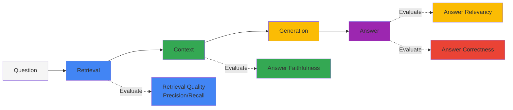
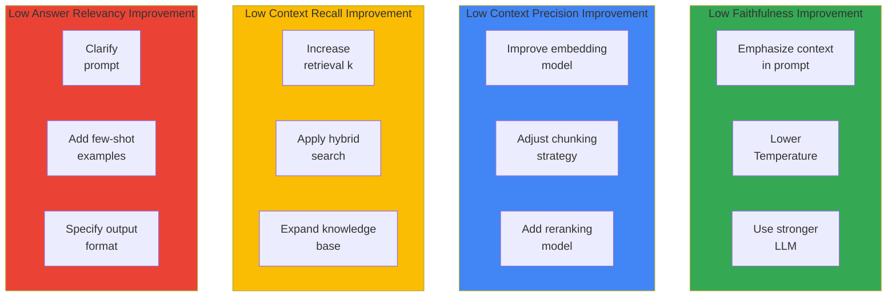

import { RagasVsBedrockComparison, RagasMetrics, CostOptimizationStrategies, CostComparison, ImprovementChecklist } from '@site/src/components/RagasTables';

# Ragas RAG Evaluation Framework

> **Written**: 2026-02-13 | **Updated**: 2026-02-14 | **Reading time**: ~3 min

Ragas (RAG Assessment) is an open-source framework for objectively evaluating the quality of RAG (Retrieval-Augmented Generation) pipelines. It is essential for measuring and continuously improving RAG system performance in Agentic AI platforms.

## Overview

### Why RAG Evaluation Is Needed

RAG systems consist of multiple components (retrieval, generation, context processing), making it difficult to measure overall quality:



### Ragas vs AWS Bedrock RAG Evaluation

:::tip AWS Bedrock RAG Evaluation GA
AWS Bedrock RAG Evaluation became **GA in March 2025**. With Bedrock native integration, RAG evaluation can be performed without additional setup.
:::

<RagasVsBedrockComparison />

**AWS Bedrock RAG Evaluation Metrics:**

- **Context Relevance**: Whether retrieved context is relevant to the question
- **Coverage**: Whether the answer covers all aspects of the question
- **Correctness**: Whether the answer is accurate (compared to ground truth)
- **Faithfulness**: Whether the answer is faithful to the context

### Ragas Core Metrics

<RagasMetrics />

:::note Ragas 0.2+ API Changes
In Ragas 0.2+, the `context_relevancy` metric has been removed. Use a combination of `context_precision` and `context_recall` for context quality evaluation.
:::

## Installation and Basic Setup

### Python Environment Setup

```bash
# Install Ragas (0.2+ recommended)
pip install "ragas>=0.2" langchain-openai datasets

# Additional dependencies
pip install pandas numpy
```

### Basic Evaluation Code

```python
from ragas import evaluate
from ragas.metrics import (
    faithfulness,
    answer_relevancy,
    context_precision,
    context_recall,
)
from datasets import Dataset

# Prepare evaluation dataset
eval_data = {
    "question": [
        "How is GPU scheduling done in Kubernetes?",
        "What are Karpenter's key features?",
    ],
    "answer": [
        "GPU scheduling in Kubernetes is performed through the NVIDIA Device Plugin...",
        "Karpenter provides automatic node provisioning, consolidation, and drift detection...",
    ],
    "contexts": [
        ["GPU scheduling is done through Device Plugin...", "NVIDIA GPU Operator..."],
        ["Karpenter is a Kubernetes node auto-scaler...", "Through NodePool CRD..."],
    ],
    "ground_truth": [
        "GPU resources are scheduled using NVIDIA Device Plugin and GPU Operator.",
        "Karpenter provides automatic node provisioning, consolidation, drift detection, and disruption handling.",
    ],
}

dataset = Dataset.from_dict(eval_data)

# Run evaluation (with error handling)
try:
    results = evaluate(
        dataset,
        metrics=[
            faithfulness,
            answer_relevancy,
            context_precision,
            context_recall,
        ],
    )
    print(results)
except Exception as e:
    print(f"Error during evaluation: {e}")
    # Logging or retry logic
```

## Core Metric Details

### 1. Faithfulness

Measures how faithful the answer is to the provided context. A key metric for detecting hallucination.

```python
from ragas.metrics import faithfulness

# Faithfulness calculation process:
# 1. Decompose answer into individual claims
# 2. Verify each claim is inferable from context
# 3. Verified claims / Total claims = Faithfulness score

# Score interpretation:
# 1.0: All claims supported by context
# 0.5: Only half of claims supported by context
# 0.0: No claims supported by context (severe hallucination)
```

### 2. Answer Relevancy

Measures how relevant the answer is to the question.

### 3. Context Precision

Measures the proportion of actually useful information among retrieved contexts.

### 4. Context Recall

Measures whether the information needed to generate the correct answer is included in the retrieved context.

## Comprehensive Evaluation Pipeline

### Full RAG System Evaluation

```python
import os
from ragas import evaluate
from ragas.metrics import (
    faithfulness,
    answer_relevancy,
    context_precision,
    context_recall,
    answer_correctness,
)
from datasets import Dataset
from langchain_openai import ChatOpenAI, OpenAIEmbeddings

os.environ["OPENAI_API_KEY"] = "your-api-key"

def evaluate_rag_pipeline(questions, rag_chain, ground_truths):
    """Comprehensive RAG pipeline evaluation"""
    
    answers = []
    contexts = []
    
    for question in questions:
        result = rag_chain.invoke({"query": question})
        answers.append(result["result"])
        contexts.append([doc.page_content for doc in result["source_documents"]])
    
    eval_dataset = Dataset.from_dict({
        "question": questions,
        "answer": answers,
        "contexts": contexts,
        "ground_truth": ground_truths,
    })
    
    results = evaluate(
        eval_dataset,
        metrics=[
            faithfulness,
            answer_relevancy,
            context_precision,
            context_recall,
            answer_correctness,
        ],
    )
    
    return results
```

## CI/CD Pipeline Integration

### GitHub Actions Workflow

```yaml
# .github/workflows/rag-evaluation.yml
name: RAG Pipeline Evaluation

on:
  push:
    paths:
      - 'src/rag/**'
      - 'data/knowledge_base/**'
  pull_request:
    paths:
      - 'src/rag/**'
  schedule:
    - cron: '0 0 * * *'  # Daily at midnight

jobs:
  evaluate:
    runs-on: ubuntu-latest
    
    steps:
    - uses: actions/checkout@v4
    
    - name: Set up Python
      uses: actions/setup-python@v5
      with:
        python-version: '3.11'
    
    - name: Install dependencies
      run: |
        pip install ragas langchain-openai datasets pandas
    
    - name: Run RAG Evaluation
      env:
        OPENAI_API_KEY: ${{ secrets.OPENAI_API_KEY }}
      run: |
        python scripts/evaluate_rag.py --output results/evaluation.json
    
    - name: Check Quality Gates
      run: |
        python scripts/check_quality_gates.py results/evaluation.json
```

### Quality Gate Script

```python
# scripts/check_quality_gates.py
import json
import sys

QUALITY_GATES = {
    "faithfulness": 0.8,
    "answer_relevancy": 0.75,
    "context_precision": 0.7,
    "context_recall": 0.7,
}

def check_quality_gates(results_file):
    with open(results_file) as f:
        results = json.load(f)
    
    failed_gates = []
    
    for metric, threshold in QUALITY_GATES.items():
        score = results["metrics"].get(metric, 0)
        if score < threshold:
            failed_gates.append({
                "metric": metric,
                "score": score,
                "threshold": threshold,
            })
    
    if failed_gates:
        print("Quality gates failed:")
        for gate in failed_gates:
            print(f"  - {gate['metric']}: {gate['score']:.2f} < {gate['threshold']}")
        sys.exit(1)
    else:
        print("All quality gates passed!")
        sys.exit(0)

if __name__ == "__main__":
    check_quality_gates(sys.argv[1])
```

## Evaluation Result Interpretation and Improvement Guide

### Cost Optimization Strategies

RAG evaluation requires LLM API calls, so costs are incurred. Optimize costs with the following strategies:

<CostOptimizationStrategies />

### AWS Bedrock RAG Evaluation Usage

AWS Bedrock RAG Evaluation provides simpler evaluation with Bedrock native integration:

```python
import boto3

bedrock = boto3.client('bedrock-agent-runtime')

response = bedrock.evaluate_rag(
    evaluationJobName='rag-eval-2026-02-13',
    evaluationDatasetLocation={
        's3Uri': 's3://my-bucket/eval-dataset.jsonl'
    },
    evaluationMetrics=[
        'CONTEXT_RELEVANCE',
        'COVERAGE',
        'CORRECTNESS',
        'FAITHFULNESS'
    ],
    modelId='anthropic.claude-3-sonnet-20240229-v1:0',
    outputDataConfig={
        's3Uri': 's3://my-bucket/eval-results/'
    }
)
```

**Cost Comparison (per 1000 evaluations):**

<CostComparison />

### Per-Metric Improvement Directions



### Improvement Checklist

<ImprovementChecklist />

## Related Documents

- [Milvus Vector Database](./milvus-vector-database.md)
- [Agent Monitoring](./agent-monitoring.md)
- [Agentic AI Platform Architecture](../design-architecture/agentic-platform-architecture.md)

:::tip Recommendations

- Include at least 50 diverse questions in evaluation datasets
- Use ground truths verified by domain experts
- Track quality changes over time through regular evaluation
:::

:::warning Cautions

- Ragas evaluation requires LLM API calls, incurring costs
- Use batch processing and caching for large-scale evaluations
- Evaluation results may vary depending on the LLM used
:::
