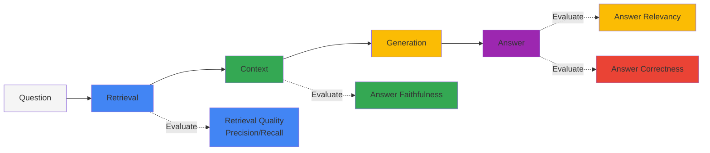
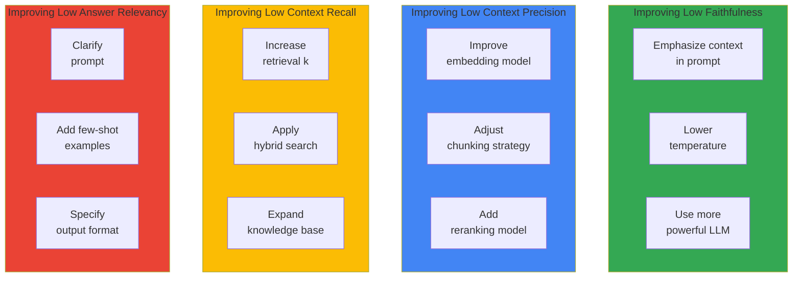

import { RagasVsBedrockComparison, RagasMetrics, CostOptimizationStrategies, CostComparison, ImprovementChecklist } from '@site/src/components/RagasTables';

# Ragas RAG Evaluation Framework

> 📅 **Created**: 2026-02-13 | **Updated**: 2026-02-14 | ⏱️ **Reading Time**: ~3 minutes

Ragas (RAG Assessment) is an open-source framework for objectively evaluating the quality of RAG (Retrieval-Augmented Generation) pipelines. It is essential for measuring and continuously improving RAG system performance in Agentic AI platforms.

## Overview

### Why RAG Evaluation is Needed

RAG systems consist of multiple components (retrieval, generation, context processing), making it difficult to measure overall quality:



### Ragas vs AWS Bedrock RAG Evaluation

:::tip AWS Bedrock RAG Evaluation GA
AWS Bedrock RAG Evaluation reached **GA in March 2025**. You can perform RAG evaluations with Bedrock native integration without separate configuration.
:::

<RagasVsBedrockComparison />

**AWS Bedrock RAG Evaluation Metrics:**

- **Context Relevance**: Whether retrieved context is relevant to the question
- **Coverage**: Whether the answer covers all aspects of the question
- **Correctness**: Whether the answer is accurate (compared to ground truth)
- **Faithfulness**: Whether the answer is faithful to the context

### Ragas Core Metrics

<RagasMetrics />

:::note Ragas 0.2+ API Changes
In Ragas 0.2 and above, the `context_relevancy` metric has been removed. Evaluate context quality using a combination of `context_precision` and `context_recall`.
:::

## Installation and Basic Setup

### Python Environment Setup

```bash
# Install Ragas (0.2+ recommended)
pip install "ragas>=0.2" langchain-openai datasets

# Additional dependencies
pip install pandas numpy
```

### Basic Evaluation Code

```python
from ragas import evaluate
from ragas.metrics import (
    faithfulness,
    answer_relevancy,
    context_precision,
    context_recall,
)
from datasets import Dataset

# Prepare evaluation dataset
eval_data = {
    "question": [
        "How do you schedule GPUs in Kubernetes?",
        "What are the main features of Karpenter?",
    ],
    "answer": [
        "GPU scheduling in Kubernetes is performed through the NVIDIA Device Plugin...",
        "Karpenter provides automatic node provisioning, consolidation, and drift detection...",
    ],
    "contexts": [
        ["GPU scheduling is done through Device Plugin...", "NVIDIA GPU Operator..."],
        ["Karpenter is a Kubernetes node autoscaler...", "Through NodePool CRD..."],
    ],
    "ground_truth": [
        "GPU resources are scheduled using NVIDIA Device Plugin and GPU Operator.",
        "Karpenter provides automatic node provisioning, consolidation, drift detection, and disruption handling.",
    ],
}

dataset = Dataset.from_dict(eval_data)

# Run evaluation (with error handling)
try:
    results = evaluate(
        dataset,
        metrics=[
            faithfulness,
            answer_relevancy,
            context_precision,
            context_recall,
        ],
    )
    print(results)
except Exception as e:
    print(f"Error during evaluation: {e}")
    # Logging or retry logic
```

## Detailed Metric Explanation

### 1. Faithfulness

Measures how faithful the answer is to the provided context. This is a key metric for detecting hallucination.

```python
from ragas.metrics import faithfulness

# Faithfulness calculation process:
# 1. Decompose answer into individual claims
# 2. Verify if each claim can be inferred from context
# 3. Number of verified claims / Total claims = Faithfulness score

# Score interpretation:
# 1.0: All claims supported by context
# 0.5: Only half of claims supported by context
# 0.0: No claims supported by context (severe hallucination)
```

### 2. Answer Relevancy

Measures how relevant the answer is to the question.

```python
from ragas.metrics import answer_relevancy

# Answer Relevancy calculation process:
# 1. Generate questions in reverse from the answer
# 2. Calculate similarity between generated and original questions
# 3. Repeat multiple times and calculate average

# Score interpretation:
# High score: Answer directly relates to the question
# Low score: Answer contains content unrelated to the question
```

### 3. Context Precision

Measures the ratio of actually useful information among retrieved contexts.

```python
from ragas.metrics import context_precision

# Context Precision calculation:
# - Identify contexts needed to generate ground truth answer
# - Check if useful information exists in top-ranked contexts
# - Higher score when relevant context is at higher ranks
```

### 4. Context Recall

Measures whether the information needed to generate the correct answer is included in the retrieved contexts.

```python
from ragas.metrics import context_recall

# Context Recall calculation:
# 1. Decompose ground truth into individual sentences
# 2. Check if each sentence can be inferred from retrieved contexts
# 3. Number of inferable sentences / Total sentences = Recall score
```

## Comprehensive Evaluation Pipeline

### Full RAG System Evaluation

```python
import os
from ragas import evaluate
from ragas.metrics import (
    faithfulness,
    answer_relevancy,
    context_precision,
    context_recall,
    answer_correctness,
)
from datasets import Dataset
from langchain_openai import ChatOpenAI, OpenAIEmbeddings

# LLM configuration (for evaluation)
os.environ["OPENAI_API_KEY"] = "your-api-key"

def evaluate_rag_pipeline(questions, rag_chain, ground_truths):
    """Comprehensive RAG pipeline evaluation"""

    answers = []
    contexts = []

    for question in questions:
        # Execute RAG chain
        result = rag_chain.invoke({"query": question})
        answers.append(result["result"])
        contexts.append([doc.page_content for doc in result["source_documents"]])

    # Construct evaluation dataset
    eval_dataset = Dataset.from_dict({
        "question": questions,
        "answer": answers,
        "contexts": contexts,
        "ground_truth": ground_truths,
    })

    # Evaluate with all metrics
    results = evaluate(
        eval_dataset,
        metrics=[
            faithfulness,
            answer_relevancy,
            context_precision,
            context_recall,
            answer_correctness,
        ],
    )

    return results

# Usage example
questions = [
    "How to configure Karpenter in EKS?",
    "How to configure GPU node auto-scaling?",
    "How to set up dynamic routing for Inference Gateway?",
]

ground_truths = [
    "Karpenter is installed via Helm chart and configured by defining NodePool CRD.",
    "Configure GPU usage-based scaling by integrating DCGM Exporter metrics with KEDA.",
    "Set up weight-based traffic distribution using HTTPRoute in Gateway API.",
]

# Run evaluation
results = evaluate_rag_pipeline(questions, rag_chain, ground_truths)
print(results.to_pandas())
```

### Evaluation Results Analysis

```python
import pandas as pd
import matplotlib.pyplot as plt

def analyze_evaluation_results(results):
    """Analyze and visualize evaluation results"""

    df = results.to_pandas()

    # Average score by metric
    metrics_summary = df.mean(numeric_only=True)
    print("=== Average Score by Metric ===")
    print(metrics_summary)

    # Identify problem areas
    print("\n=== Areas Needing Improvement ===")
    for metric, score in metrics_summary.items():
        if score < 0.7:
            print(f"⚠️ {metric}: {score:.2f} - Needs improvement")
        elif score < 0.85:
            print(f"📊 {metric}: {score:.2f} - Good")
        else:
            print(f"✅ {metric}: {score:.2f} - Excellent")

    # Visualization
    fig, ax = plt.subplots(figsize=(10, 6))
    metrics_summary.plot(kind='bar', ax=ax, color=['#4285f4', '#34a853', '#fbbc04', '#ea4335', '#9c27b0', '#00bcd4'])
    ax.set_ylabel('Score')
    ax.set_title('RAG Pipeline Evaluation Results')
    ax.set_ylim(0, 1)
    ax.axhline(y=0.7, color='r', linestyle='--', label='Minimum Threshold')
    ax.legend()
    plt.tight_layout()
    plt.savefig('rag_evaluation_results.png')

    return metrics_summary

# Run analysis
summary = analyze_evaluation_results(results)
```

## CI/CD Pipeline Integration

### GitHub Actions Workflow

```yaml
# .github/workflows/rag-evaluation.yml
name: RAG Pipeline Evaluation

on:
  push:
    paths:
      - 'src/rag/**'
      - 'data/knowledge_base/**'
  pull_request:
    paths:
      - 'src/rag/**'
  schedule:
    - cron: '0 0 * * *'  # Daily at midnight

jobs:
  evaluate:
    runs-on: ubuntu-latest

    steps:
    - uses: actions/checkout@v4

    - name: Set up Python
      uses: actions/setup-python@v5
      with:
        python-version: '3.11'

    - name: Install dependencies
      run: |
        pip install ragas langchain-openai datasets pandas

    - name: Run RAG Evaluation
      env:
        OPENAI_API_KEY: ${{ secrets.OPENAI_API_KEY }}
      run: |
        python scripts/evaluate_rag.py --output results/evaluation.json

    - name: Check Quality Gates
      run: |
        python scripts/check_quality_gates.py results/evaluation.json

    - name: Upload Results
      uses: actions/upload-artifact@v4
      with:
        name: evaluation-results
        path: results/

    - name: Comment PR with Results
      if: github.event_name == 'pull_request'
      uses: actions/github-script@v7
      with:
        script: |
          const fs = require('fs');
          const results = JSON.parse(fs.readFileSync('results/evaluation.json'));

          let comment = '## RAG Evaluation Results\n\n';
          comment += '| Metric | Score | Status |\n';
          comment += '|--------|-------|--------|\n';

          for (const [metric, score] of Object.entries(results.metrics)) {
            const status = score >= 0.7 ? '✅' : '⚠️';
            comment += `| ${metric} | ${score.toFixed(2)} | ${status} |\n`;
          }

          github.rest.issues.createComment({
            issue_number: context.issue.number,
            owner: context.repo.owner,
            repo: context.repo.repo,
            body: comment
          });
```

### Quality Gate Script

```python
# scripts/check_quality_gates.py
import json
import sys

QUALITY_GATES = {
    "faithfulness": 0.8,
    "answer_relevancy": 0.75,
    "context_precision": 0.7,
    "context_recall": 0.7,
}

def check_quality_gates(results_file):
    with open(results_file) as f:
        results = json.load(f)

    failed_gates = []

    for metric, threshold in QUALITY_GATES.items():
        score = results["metrics"].get(metric, 0)
        if score < threshold:
            failed_gates.append({
                "metric": metric,
                "score": score,
                "threshold": threshold,
            })

    if failed_gates:
        print("❌ Quality gates failed:")
        for gate in failed_gates:
            print(f"  - {gate['metric']}: {gate['score']:.2f} < {gate['threshold']}")
        sys.exit(1)
    else:
        print("✅ All quality gates passed!")
        sys.exit(0)

if __name__ == "__main__":
    check_quality_gates(sys.argv[1])
```

## Kubernetes Job for Regular Evaluation

### Evaluation Job Definition

```yaml
apiVersion: batch/v1
kind: CronJob
metadata:
  name: rag-evaluation
  namespace: genai-platform
spec:
  schedule: "0 6 * * *"  # Daily at 6am
  jobTemplate:
    spec:
      template:
        spec:
          containers:
          - name: evaluator
            image: your-registry/rag-evaluator:latest
            env:
            - name: OPENAI_API_KEY
              valueFrom:
                secretKeyRef:
                  name: openai-credentials
                  key: api-key
            - name: MILVUS_HOST
              value: "milvus-proxy.ai-data.svc.cluster.local"
            - name: RESULTS_BUCKET
              value: "s3://rag-evaluation-results"
            command:
            - python
            - /app/evaluate.py
            - --config=/app/config/evaluation.yaml
            - --output=s3
            resources:
              requests:
                cpu: "1"
                memory: "2Gi"
              limits:
                cpu: "2"
                memory: "4Gi"
          restartPolicy: OnFailure
          serviceAccountName: rag-evaluator
```

### Evaluation Configuration ConfigMap

```yaml
apiVersion: v1
kind: ConfigMap
metadata:
  name: rag-evaluation-config
  namespace: genai-platform
data:
  evaluation.yaml: |
    evaluation:
      metrics:
        - faithfulness
        - answer_relevancy
        - context_precision
        - context_recall

      test_sets:
        - name: "general_knowledge"
          path: "s3://test-data/general.json"
          weight: 0.4
        - name: "technical_docs"
          path: "s3://test-data/technical.json"
          weight: 0.6

      quality_gates:
        faithfulness: 0.8
        answer_relevancy: 0.75
        context_precision: 0.7
        context_recall: 0.7

      alerts:
        slack_webhook: "https://hooks.slack.com/..."
        threshold_drop: 0.1  # Alert on 10%+ drop
```

## Evaluation Results Interpretation and Improvement Guide

### Cost Optimization Strategies

RAG evaluation requires LLM API calls, which incur costs. Optimize costs with these strategies:

<CostOptimizationStrategies />

```python
import hashlib
import json
from functools import lru_cache

class CachedEvaluator:
    """Cost-optimized evaluator using caching"""

    def __init__(self, cache_file='eval_cache.json'):
        self.cache_file = cache_file
        self.cache = self._load_cache()

    def _load_cache(self):
        try:
            with open(self.cache_file, 'r') as f:
                return json.load(f)
        except FileNotFoundError:
            return {}

    def _save_cache(self):
        with open(self.cache_file, 'w') as f:
            json.dump(self.cache, f)

    def _get_cache_key(self, question, answer, contexts):
        """Generate unique key for evaluation item"""
        content = f"{question}|{answer}|{'|'.join(contexts)}"
        return hashlib.md5(content.encode()).hexdigest()

    def evaluate_with_cache(self, dataset, metrics):
        """Evaluate with caching"""
        cached_results = []
        new_items = []

        for item in dataset:
            cache_key = self._get_cache_key(
                item['question'],
                item['answer'],
                item['contexts']
            )

            if cache_key in self.cache:
                cached_results.append(self.cache[cache_key])
            else:
                new_items.append(item)

        # Evaluate only new items
        if new_items:
            new_dataset = Dataset.from_dict({
                k: [item[k] for item in new_items]
                for k in new_items[0].keys()
            })

            new_results = evaluate(new_dataset, metrics=metrics)

            # Update cache
            for item, result in zip(new_items, new_results):
                cache_key = self._get_cache_key(
                    item['question'],
                    item['answer'],
                    item['contexts']
                )
                self.cache[cache_key] = result

            self._save_cache()
            cached_results.extend(new_results)

        return cached_results

# Usage example
evaluator = CachedEvaluator()
results = evaluator.evaluate_with_cache(dataset, metrics)
```

### Using AWS Bedrock RAG Evaluation

AWS Bedrock RAG Evaluation offers simpler evaluation with Bedrock native integration:

```python
import boto3

bedrock = boto3.client('bedrock-agent-runtime')

# Run RAG evaluation
response = bedrock.evaluate_rag(
    evaluationJobName='rag-eval-2026-02-13',
    evaluationDatasetLocation={
        's3Uri': 's3://my-bucket/eval-dataset.jsonl'
    },
    evaluationMetrics=[
        'CONTEXT_RELEVANCE',
        'COVERAGE',
        'CORRECTNESS',
        'FAITHFULNESS'
    ],
    modelId='anthropic.claude-3-sonnet-20240229-v1:0',
    outputDataConfig={
        's3Uri': 's3://my-bucket/eval-results/'
    }
)

job_id = response['evaluationJobId']

# Query evaluation results
result = bedrock.get_evaluation_job(evaluationJobId=job_id)
print(f"Status: {result['status']}")
print(f"Metrics: {result['metrics']}")
```

**Bedrock RAG Evaluation Advantages:**

- ✅ Native integration with Bedrock models
- ✅ S3-based large-scale batch evaluation
- ✅ Automatic CloudWatch metrics publishing
- ✅ IAM-based access control
- ✅ No separate infrastructure needed

**Cost Comparison (based on 1000 evaluations):**

<CostComparison />

### Improvement Direction by Metric



### Improvement Checklist

<ImprovementChecklist />

## Related Documents

- [Milvus Vector Database](../agent-data/milvus-vector-database.md)
- [Agent Monitoring](./agent-monitoring.md)
- [Agentic AI Platform Architecture](../design-architecture/agentic-platform-architecture.md)

:::tip Recommendations

- Evaluation dataset should include at least 50 diverse questions
- Use ground truth verified by domain experts
- Track quality changes over time through regular evaluation
:::

:::warning Precautions

- Ragas evaluation requires LLM API calls which incur costs
- Use batch processing and caching for large-scale evaluations
- Evaluation results may vary depending on the LLM used
:::
