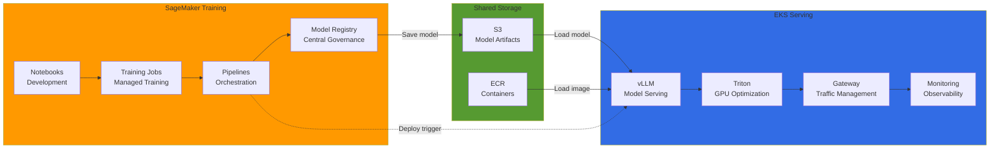
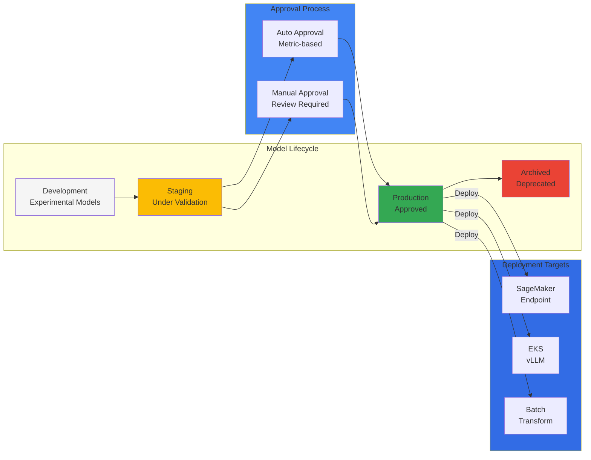
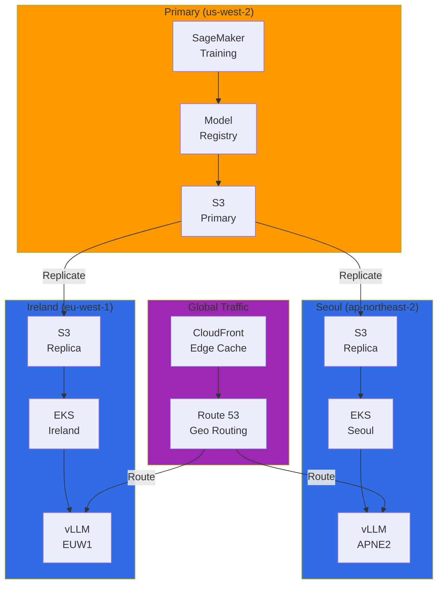
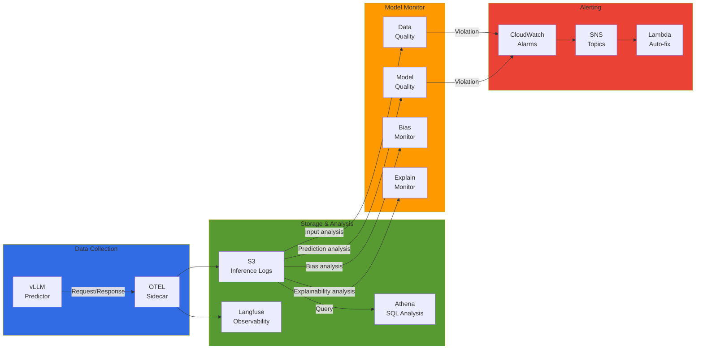

import SpecificationTable from '@site/src/components/tables/SpecificationTable';
import { HybridComparison, CostOptimization } from '@site/src/components/SagemakerTables';

# SageMaker-EKS Hybrid ML Architecture

> 📅 **Created**: 2026-02-13 | **Updated**: 2026-03-17 | ⏱️ **Reading Time**: ~15 minutes

## Overview

Design a hybrid ML architecture that combines SageMaker's managed training environment with EKS's flexible serving infrastructure. This approach achieves both cost efficiency and operational flexibility by leveraging the strengths of each platform.

### Advantages of Hybrid Architecture

<HybridComparison />


## Hybrid Architecture Patterns

### Overall Architecture Overview



### Pattern 1: SageMaker Training → EKS Serving

The most common hybrid pattern: train models on SageMaker and serve on EKS.

**Use Cases:**
- Large-scale distributed training required
- Want to reduce training infrastructure management burden
- Need fine-grained control in serving environment


### Pattern 2: EKS Training → SageMaker Serving

For cases requiring specialized training environment but wanting managed serving operations.

**Use Cases:**
- Using custom training frameworks
- Leveraging Kubernetes-native training tools (Kubeflow, Ray)
- Want to reduce serving infrastructure management burden

### Pattern 3: Hybrid Serving

Operate both SageMaker Endpoint and EKS serving simultaneously to distribute workloads.

**Use Cases:**
- High availability is critical for production environments
- Multi-region deployment
- A/B testing and canary deployments

---

## SageMaker Pipelines Integration

### SageMaker Components for Kubeflow Pipelines

AWS provides official components to invoke SageMaker from Kubeflow Pipelines.

```python
# sagemaker_kubeflow_pipeline.py
import kfp
from kfp import dsl
from kfp.aws import use_aws_secret
import sagemaker
from sagemaker.workflow.pipeline_context import PipelineSession

@dsl.component(
    base_image="public.ecr.aws/sagemaker/sagemaker-distribution:latest",
    packages_to_install=["sagemaker>=2.200.0"]
)
def sagemaker_training_component(
    training_image: str,
    role_arn: str,
    instance_type: str,
    instance_count: int,
    s3_input_data: str,
    s3_output_path: str,
    hyperparameters: dict
) -> str:
    """SageMaker Training Job execution component"""
    import boto3
    import sagemaker
    from sagemaker.estimator import Estimator

    session = sagemaker.Session()

    estimator = Estimator(
        image_uri=training_image,
        role=role_arn,
        instance_count=instance_count,
        instance_type=instance_type,
        output_path=s3_output_path,
        sagemaker_session=session,
        hyperparameters=hyperparameters
    )

    estimator.fit({"training": s3_input_data}, wait=True)

    # Return model artifact path
    return estimator.model_data


@dsl.component(
    base_image="public.ecr.aws/sagemaker/sagemaker-distribution:latest",
    packages_to_install=["sagemaker>=2.200.0"]
)
def register_model_to_registry(
    model_data: str,
    model_package_group_name: str,
    inference_image: str,
    role_arn: str
) -> str:
    """Register model to SageMaker Model Registry"""
    import boto3
    import sagemaker
    from sagemaker.model import Model

    session = sagemaker.Session()

    model = Model(
        image_uri=inference_image,
        model_data=model_data,
        role=role_arn,
        sagemaker_session=session
    )

    # Register to Model Registry
    model_package = model.register(
        content_types=["application/json"],
        response_types=["application/json"],
        inference_instances=["ml.g5.xlarge"],
        transform_instances=["ml.g5.xlarge"],
        model_package_group_name=model_package_group_name,
        approval_status="PendingManualApproval"
    )

    return model_package.model_package_arn


@dsl.component(
    base_image="python:3.10",
    packages_to_install=["kubernetes", "boto3", "pyyaml"]
)
def deploy_to_vllm(
    model_package_arn: str,
    model_name: str,
    namespace: str = "vllm-inference"
) -> str:
    """Deploy vLLM Deployment (ArgoCD GitOps)"""
    import boto3
    import yaml
    import tempfile
    import subprocess

    # Query model information from SageMaker Model Registry
    sm_client = boto3.client('sagemaker')
    model_package = sm_client.describe_model_package(
        ModelPackageName=model_package_arn
    )

    model_data_url = model_package['InferenceSpecification']['Containers'][0]['ModelDataUrl']

    # Generate vLLM Deployment YAML
    deployment_manifest = {
        "apiVersion": "apps/v1",
        "kind": "Deployment",
        "metadata": {
            "name": f"vllm-{model_name}",
            "namespace": namespace,
            "labels": {
                "app": f"vllm-{model_name}",
                "model": model_name
            }
        },
        "spec": {
            "replicas": 2,
            "selector": {
                "matchLabels": {
                    "app": f"vllm-{model_name}"
                }
            },
            "template": {
                "metadata": {
                    "labels": {
                        "app": f"vllm-{model_name}"
                    }
                },
                "spec": {
                    "containers": [
                        {
                            "name": "vllm-server",
                            "image": "vllm/vllm-openai:latest",
                            "args": [
                                "--model", model_data_url,
                                "--tensor-parallel-size", "1",
                                "--max-model-len", "4096"
                            ],
                            "ports": [
                                {"containerPort": 8000, "name": "http"}
                            ],
                            "resources": {
                                "requests": {
                                    "nvidia.com/gpu": "1",
                                    "memory": "16Gi"
                                },
                                "limits": {
                                    "nvidia.com/gpu": "1",
                                    "memory": "32Gi"
                                }
                            },
                            "env": [
                                {"name": "VLLM_LOGGING_LEVEL", "value": "INFO"}
                            ]
                        }
                    ]
                }
            }
        }
    }

    # Deploy with ArgoCD Application
    with tempfile.NamedTemporaryFile(mode='w', suffix='.yaml', delete=False) as f:
        yaml.dump(deployment_manifest, f)
        manifest_path = f.name

    # kubectl apply via ArgoCD
    subprocess.run([
        "kubectl", "apply", "-f", manifest_path,
        "-n", namespace
    ], check=True)

    return f"Deployed {model_name} to vLLM"


@dsl.pipeline(
    name="SageMaker to EKS Hybrid Pipeline",
    description="Train on SageMaker, deploy to EKS"
)
def hybrid_ml_pipeline(
    training_image: str = "763104351884.dkr.ecr.us-west-2.amazonaws.com/pytorch-training:2.1.0-gpu-py310",
    inference_image: str = "763104351884.dkr.ecr.us-west-2.amazonaws.com/pytorch-inference:2.1.0-gpu-py310",
    role_arn: str = "arn:aws:iam::123456789012:role/SageMakerExecutionRole",
    instance_type: str = "ml.g5.2xlarge",
    s3_input_data: str = "s3://my-bucket/training-data/",
    s3_output_path: str = "s3://my-bucket/models/",
    model_package_group: str = "fraud-detection-models"
):
    # 1. Train on SageMaker
    training_task = sagemaker_training_component(
        training_image=training_image,
        role_arn=role_arn,
        instance_type=instance_type,
        instance_count=2,
        s3_input_data=s3_input_data,
        s3_output_path=s3_output_path,
        hyperparameters={
            "epochs": "50",
            "batch-size": "64",
            "learning-rate": "0.001"
        }
    )
    training_task.apply(use_aws_secret('aws-secret', 'AWS_ACCESS_KEY_ID', 'AWS_SECRET_ACCESS_KEY'))

    # 2. Register to Model Registry
    registry_task = register_model_to_registry(
        model_data=training_task.output,
        model_package_group_name=model_package_group,
        inference_image=inference_image,
        role_arn=role_arn
    )
    registry_task.apply(use_aws_secret('aws-secret', 'AWS_ACCESS_KEY_ID', 'AWS_SECRET_ACCESS_KEY'))

    # 3. Deploy to EKS vLLM
    deploy_task = deploy_to_vllm(
        model_package_arn=registry_task.output,
        model_name="fraud-detection-v1",
        namespace="vllm-inference"
    )

    return deploy_task.output
```


---

## SageMaker Model Registry Governance

### Centralized Model Management

SageMaker Model Registry serves as a central repository for all models, allowing the same governance to be applied in EKS serving environments.



### Model Registry Configuration

```python
# model_registry_setup.py
import boto3
import sagemaker
from sagemaker.model_package import ModelPackageGroup

sm_client = boto3.client('sagemaker')
session = sagemaker.Session()

# Create Model Package Group
model_package_group_name = "fraud-detection-models"

try:
    sm_client.create_model_package_group(
        ModelPackageGroupName=model_package_group_name,
        ModelPackageGroupDescription="Fraud detection models for production",
        Tags=[
            {"Key": "Team", "Value": "ml-platform"},
            {"Key": "Environment", "Value": "production"}
        ]
    )
except sm_client.exceptions.ResourceInUse:
    print(f"Model package group {model_package_group_name} already exists")

# Configure model approval policy
model_approval_policy = {
    "Rules": [
        {
            "Name": "AutoApproveHighAccuracy",
            "Condition": {
                "MetricName": "accuracy",
                "Operator": "GreaterThanOrEqualTo",
                "Value": 0.95
            },
            "Action": "Approve"
        },
        {
            "Name": "RejectLowAccuracy",
            "Condition": {
                "MetricName": "accuracy",
                "Operator": "LessThan",
                "Value": 0.85
            },
            "Action": "Reject"
        }
    ]
}
```

### Query Model Registry from EKS

```python
# eks_model_loader.py
import boto3
from kubernetes import client, config

def get_approved_model_from_registry(model_package_group_name: str) -> str:
    """Query latest approved model from Model Registry"""
    sm_client = boto3.client('sagemaker')

    # Query approved model packages
    response = sm_client.list_model_packages(
        ModelPackageGroupName=model_package_group_name,
        ModelApprovalStatus='Approved',
        SortBy='CreationTime',
        SortOrder='Descending',
        MaxResults=1
    )

    if not response['ModelPackageSummaryList']:
        raise ValueError(f"No approved models found in {model_package_group_name}")

    model_package_arn = response['ModelPackageSummaryList'][0]['ModelPackageArn']

    # Query model details
    model_package = sm_client.describe_model_package(
        ModelPackageName=model_package_arn
    )

    model_data_url = model_package['InferenceSpecification']['Containers'][0]['ModelDataUrl']

    return model_data_url


def update_vllm_with_latest_model(model_name: str, namespace: str):
    """Update vLLM Deployment with latest approved model"""
    config.load_incluster_config()
    apps_api = client.AppsV1Api()

    # Query latest model from Model Registry
    model_url = get_approved_model_from_registry("fraud-detection-models")

    # Update Deployment
    patch_body = {
        "spec": {
            "template": {
                "spec": {
                    "containers": [
                        {
                            "name": "vllm-server",
                            "args": [
                                "--model", model_url,
                                "--tensor-parallel-size", "1",
                                "--max-model-len", "4096"
                            ]
                        }
                    ]
                }
            }
        }
    }

    apps_api.patch_namespaced_deployment(
        name=f"vllm-{model_name}",
        namespace=namespace,
        body=patch_body
    )

    print(f"Updated {model_name} with model from {model_url}")
```


---

## Cost Optimization Strategy

### Training vs Serving Cost Analysis

<CostOptimization />

### Cost Optimization Checklist

```yaml
# cost-optimization-config.yaml
training:
  # SageMaker Managed Spot Training (up to 90% savings)
  use_spot_instances: true
  max_wait_time_seconds: 86400  # 24 hours
  max_run_time_seconds: 43200   # 12 hours

  # Enable checkpointing (for Spot interruptions)
  checkpoint_s3_uri: s3://my-bucket/checkpoints/
  checkpoint_local_path: /opt/ml/checkpoints

  # Instance type optimization
  instance_type: ml.g5.2xlarge  # GPU training
  instance_count: 2

  # Auto-terminate after training
  auto_terminate: true

serving:
  # Karpenter Spot instances (up to 70% savings)
  capacity_type: spot

  # Auto-scaling configuration
  min_replicas: 1
  max_replicas: 10
  target_utilization: 70

  # Scale down during idle time
  scale_down_delay: 300  # 5 minutes

  # GPU sharing (MIG or MPS)
  enable_gpu_sharing: true
  max_shared_clients: 4

storage:
  # S3 Intelligent-Tiering
  s3_storage_class: INTELLIGENT_TIERING

  # Archive old models
  lifecycle_policy:
    archive_after_days: 90
    delete_after_days: 365
```

### Cost Monitoring Dashboard

```python
# cost_monitoring.py
import boto3
from datetime import datetime, timedelta

def get_sagemaker_training_costs(days=30):
    """Query SageMaker training costs"""
    ce_client = boto3.client('ce')

    end_date = datetime.now().date()
    start_date = end_date - timedelta(days=days)

    response = ce_client.get_cost_and_usage(
        TimePeriod={
            'Start': start_date.strftime('%Y-%m-%d'),
            'End': end_date.strftime('%Y-%m-%d')
        },
        Granularity='DAILY',
        Metrics=['UnblendedCost'],
        Filter={
            'Dimensions': {
                'Key': 'SERVICE',
                'Values': ['Amazon SageMaker']
            }
        },
        GroupBy=[
            {'Type': 'DIMENSION', 'Key': 'USAGE_TYPE'}
        ]
    )

    return response


def get_eks_serving_costs(cluster_name: str, days=30):
    """Query EKS serving costs"""
    ce_client = boto3.client('ce')

    end_date = datetime.now().date()
    start_date = end_date - timedelta(days=days)

    response = ce_client.get_cost_and_usage(
        TimePeriod={
            'Start': start_date.strftime('%Y-%m-%d'),
            'End': end_date.strftime('%Y-%m-%d')
        },
        Granularity='DAILY',
        Metrics=['UnblendedCost'],
        Filter={
            'And': [
                {
                    'Dimensions': {
                        'Key': 'SERVICE',
                        'Values': ['Amazon Elastic Compute Cloud - Compute']
                    }
                },
                {
                    'Tags': {
                        'Key': 'kubernetes.io/cluster/' + cluster_name,
                        'Values': ['owned']
                    }
                }
            ]
        }
    )

    return response
```


---

## Multi-Region Deployment Pattern

### Global Model Deployment Architecture



### S3 Cross-Region Replication Configuration

```json
{
  "Role": "arn:aws:iam::123456789012:role/S3ReplicationRole",
  "Rules": [
    {
      "ID": "ReplicateModelsToAPNE2",
      "Status": "Enabled",
      "Priority": 1,
      "Filter": {
        "Prefix": "models/"
      },
      "Destination": {
        "Bucket": "arn:aws:s3:::my-models-ap-northeast-2",
        "ReplicationTime": {
          "Status": "Enabled",
          "Time": {
            "Minutes": 15
          }
        },
        "Metrics": {
          "Status": "Enabled",
          "EventThreshold": {
            "Minutes": 15
          }
        }
      }
    },
    {
      "ID": "ReplicateModelsToEUW1",
      "Status": "Enabled",
      "Priority": 2,
      "Filter": {
        "Prefix": "models/"
      },
      "Destination": {
        "Bucket": "arn:aws:s3:::my-models-eu-west-1",
        "ReplicationTime": {
          "Status": "Enabled",
          "Time": {
            "Minutes": 15
          }
        }
      }
    }
  ]
}
```

### Multi-Region Deployment Automation

```python
# multi_region_deployment.py
import boto3
from typing import List, Dict

class MultiRegionDeployer:
    def __init__(self, regions: List[str]):
        self.regions = regions
        self.sm_clients = {
            region: boto3.client('sagemaker', region_name=region)
            for region in regions
        }

    def deploy_model_to_all_regions(
        self,
        model_package_arn: str,
        model_name: str,
        namespace: str = "vllm-inference"
    ):
        """Deploy model to all regions"""
        deployment_results = {}

        for region in self.regions:
            try:
                # Load model from regional S3 bucket
                model_url = self._get_regional_model_url(model_package_arn, region)

                # Deploy to regional EKS cluster
                result = self._deploy_to_eks(
                    region=region,
                    model_url=model_url,
                    model_name=model_name,
                    namespace=namespace
                )

                deployment_results[region] = {
                    "status": "success",
                    "model_url": model_url,
                    "endpoint": result
                }

            except Exception as e:
                deployment_results[region] = {
                    "status": "failed",
                    "error": str(e)
                }

        return deployment_results

    def _get_regional_model_url(self, model_package_arn: str, region: str) -> str:
        """Query regional model URL"""
        sm_client = self.sm_clients[region]

        # Query model information from Model Registry
        model_package = sm_client.describe_model_package(
            ModelPackageName=model_package_arn
        )

        # Convert to regional S3 bucket
        original_url = model_package['InferenceSpecification']['Containers'][0]['ModelDataUrl']
        regional_url = original_url.replace('us-west-2', region)

        return regional_url

    def _deploy_to_eks(
        self,
        region: str,
        model_url: str,
        model_name: str,
        namespace: str
    ) -> str:
        """Deploy to regional EKS cluster"""
        from kubernetes import client, config

        # Load regional kubeconfig
        config.load_kube_config(context=f"eks-{region}")

        apps_api = client.AppsV1Api()

        vllm_deployment = {
            "apiVersion": "apps/v1",
            "kind": "Deployment",
            "metadata": {
                "name": f"vllm-{model_name}-{region}",
                "namespace": namespace,
                "labels": {
                    "app": f"vllm-{model_name}",
                    "region": region
                }
            },
            "spec": {
                "replicas": 2,
                "selector": {
                    "matchLabels": {
                        "app": f"vllm-{model_name}",
                        "region": region
                    }
                },
                "template": {
                    "metadata": {
                        "labels": {
                            "app": f"vllm-{model_name}",
                            "region": region
                        }
                    },
                    "spec": {
                        "containers": [
                            {
                                "name": "vllm-server",
                                "image": "vllm/vllm-openai:latest",
                                "args": [
                                    "--model", model_url,
                                    "--tensor-parallel-size", "1",
                                    "--max-model-len", "4096"
                                ],
                                "ports": [
                                    {"containerPort": 8000, "name": "http"}
                                ],
                                "resources": {
                                    "requests": {"nvidia.com/gpu": "1"},
                                    "limits": {"nvidia.com/gpu": "1"}
                                }
                            }
                        ]
                    }
                }
            }
        }

        apps_api.create_namespaced_deployment(
            namespace=namespace,
            body=vllm_deployment
        )

        return f"http://vllm-{model_name}-{region}.{namespace}.svc.cluster.local:8000"


# Usage example
deployer = MultiRegionDeployer(
    regions=["us-west-2", "ap-northeast-2", "eu-west-1"]
)

results = deployer.deploy_model_to_all_regions(
    model_package_arn="arn:aws:sagemaker:us-west-2:123456789012:model-package/fraud-detection/1",
    model_name="fraud-detection-v1"
)

print(results)
```


---

## Model Monitoring and Drift Detection

### Integrated Monitoring Architecture



### vLLM OTEL Sidecar Configuration

```yaml
apiVersion: apps/v1
kind: Deployment
metadata:
  name: vllm-fraud-detection-monitored
  namespace: vllm-inference
spec:
  replicas: 2
  selector:
    matchLabels:
      app: vllm-fraud-detection
  template:
    metadata:
      labels:
        app: vllm-fraud-detection
    spec:
      serviceAccountName: vllm-sa
      containers:
        # vLLM server
        - name: vllm-server
          image: vllm/vllm-openai:latest
          args:
            - --model
            - s3://my-models/fraud-detection/model.tar.gz
            - --tensor-parallel-size
            - "1"
            - --max-model-len
            - "4096"
          ports:
            - containerPort: 8000
              name: http
          resources:
            requests:
              nvidia.com/gpu: 1
              memory: 16Gi
            limits:
              nvidia.com/gpu: 1
              memory: 32Gi
          env:
            - name: VLLM_LOGGING_LEVEL
              value: "INFO"

        # OpenTelemetry Collector Sidecar
        - name: otel-collector
          image: otel/opentelemetry-collector-contrib:latest
          args:
            - --config=/conf/otel-collector-config.yaml
          ports:
            - containerPort: 4317  # OTLP gRPC
            - containerPort: 4318  # OTLP HTTP
          volumeMounts:
            - name: otel-config
              mountPath: /conf
          env:
            - name: LANGFUSE_PUBLIC_KEY
              valueFrom:
                secretKeyRef:
                  name: langfuse-credentials
                  key: public-key
            - name: LANGFUSE_SECRET_KEY
              valueFrom:
                secretKeyRef:
                  name: langfuse-credentials
                  key: secret-key
            - name: LANGFUSE_HOST
              value: "https://langfuse.example.com"
          resources:
            requests:
              cpu: "200m"
              memory: "512Mi"
            limits:
              cpu: "500m"
              memory: "1Gi"

      volumes:
        - name: otel-config
          configMap:
            name: otel-collector-config
---
apiVersion: v1
kind: ConfigMap
metadata:
  name: otel-collector-config
  namespace: vllm-inference
data:
  otel-collector-config.yaml: |
    receivers:
      otlp:
        protocols:
          grpc:
            endpoint: 0.0.0.0:4317
          http:
            endpoint: 0.0.0.0:4318

    processors:
      batch:
        timeout: 10s
        send_batch_size: 1024

      resource:
        attributes:
          - key: service.name
            value: vllm-fraud-detection
            action: upsert

    exporters:
      # Langfuse exporter
      otlphttp/langfuse:
        endpoint: ${LANGFUSE_HOST}/api/public/ingestion
        headers:
          Authorization: Bearer ${LANGFUSE_SECRET_KEY}

      # S3 exporter (inference logs)
      awss3:
        s3uploader:
          region: us-west-2
          s3_bucket: my-inference-logs
          s3_prefix: fraud-detection/
          s3_partition: hour

      # CloudWatch Logs exporter
      awscloudwatchlogs:
        log_group_name: /aws/vllm/fraud-detection
        log_stream_name: inference-logs
        region: us-west-2

    service:
      pipelines:
        traces:
          receivers: [otlp]
          processors: [batch, resource]
          exporters: [otlphttp/langfuse]

        logs:
          receivers: [otlp]
          processors: [batch, resource]
          exporters: [awss3, awscloudwatchlogs]
```

### SageMaker Model Monitor Integration

```python
# sagemaker_model_monitor.py
import boto3
from sagemaker.model_monitor import (
    DataCaptureConfig,
    DataQualityMonitor,
    ModelQualityMonitor
)
from sagemaker import Session

session = Session()
sm_client = boto3.client('sagemaker')

# Data Quality Monitor configuration
data_quality_monitor = DataQualityMonitor(
    role='arn:aws:iam::123456789012:role/SageMakerModelMonitorRole',
    instance_count=1,
    instance_type='ml.m5.xlarge',
    volume_size_in_gb=20,
    max_runtime_in_seconds=3600,
    sagemaker_session=session
)

# Create baseline (based on training data)
baseline_job = data_quality_monitor.suggest_baseline(
    baseline_dataset='s3://my-bucket/training-data/baseline.csv',
    dataset_format={'csv': {'header': True}},
    output_s3_uri='s3://my-bucket/model-monitor/baseline',
    wait=True
)

# Create monitoring schedule
monitoring_schedule = data_quality_monitor.create_monitoring_schedule(
    monitor_schedule_name='fraud-detection-data-quality',
    endpoint_input='s3://my-inference-logs/fraud-detection/',  # EKS logs
    output_s3_uri='s3://my-bucket/model-monitor/reports',
    statistics=baseline_job.baseline_statistics(),
    constraints=baseline_job.suggested_constraints(),
    schedule_cron_expression='cron(0 * * * ? *)',  # Hourly
    enable_cloudwatch_metrics=True
)

print(f"Monitoring schedule created: {monitoring_schedule.monitoring_schedule_name}")
```

### Drift Detection and Automatic Retraining

```python
# drift_detection_handler.py
import boto3
import json
from datetime import datetime

def lambda_handler(event, context):
    """Automatic retraining when CloudWatch Alarm triggers"""

    # Parse alarm information
    message = json.loads(event['Records'][0]['Sns']['Message'])
    alarm_name = message['AlarmName']

    if 'DataQualityViolation' in alarm_name:
        print(f"Data quality violation detected: {alarm_name}")

        # Trigger SageMaker Training Job
        sm_client = boto3.client('sagemaker')

        training_job_name = f"fraud-detection-retrain-{datetime.now().strftime('%Y%m%d%H%M%S')}"

        response = sm_client.create_training_job(
            TrainingJobName=training_job_name,
            RoleArn='arn:aws:iam::123456789012:role/SageMakerExecutionRole',
            AlgorithmSpecification={
                'TrainingImage': '763104351884.dkr.ecr.us-west-2.amazonaws.com/pytorch-training:2.1.0-gpu-py310',
                'TrainingInputMode': 'File'
            },
            InputDataConfig=[
                {
                    'ChannelName': 'training',
                    'DataSource': {
                        'S3DataSource': {
                            'S3DataType': 'S3Prefix',
                            'S3Uri': 's3://my-bucket/training-data/',
                            'S3DataDistributionType': 'FullyReplicated'
                        }
                    }
                }
            ],
            OutputDataConfig={
                'S3OutputPath': 's3://my-bucket/models/'
            },
            ResourceConfig={
                'InstanceType': 'ml.g5.2xlarge',
                'InstanceCount': 2,
                'VolumeSizeInGB': 50
            },
            StoppingCondition={
                'MaxRuntimeInSeconds': 43200  # 12 hours
            },
            Tags=[
                {'Key': 'Trigger', 'Value': 'AutoRetraining'},
                {'Key': 'Reason', 'Value': 'DataDrift'}
            ]
        )

        print(f"Retraining job started: {training_job_name}")

        return {
            'statusCode': 200,
            'body': json.dumps({
                'message': 'Retraining triggered',
                'training_job': training_job_name
            })
        }

    return {
        'statusCode': 200,
        'body': json.dumps({'message': 'No action required'})
    }
```


---

## Summary

SageMaker-EKS hybrid architecture combines the advantages of managed training and flexible serving.

### Key Points

1. **Hybrid Patterns**: Leverage strengths of each platform with SageMaker training + EKS serving
2. **Central Governance**: Unified model management with SageMaker Model Registry
3. **Cost Optimization**: Cost savings through Spot instances and auto-scaling
4. **Multi-Region**: Global deployment with S3 Cross-Region Replication
5. **Monitoring**: Integration of SageMaker Model Monitor and EKS logging

### Recommendations

- Perform large-scale distributed training on SageMaker to reduce infrastructure management burden
- Operate serving environment on EKS for fine-grained control and cost optimization
- Use Model Registry as central repository to strengthen governance
- Build automatic retraining pipeline when drift is detected

### Next Steps

- [EKS-based MLOps Pipeline](./mlops-pipeline-eks.md) - Kubeflow + MLflow + vLLM + ArgoCD GitOps
- [GPU Resource Management](../model-serving/gpu-resource-management.md) - GPU cluster optimization
- [Model Monitoring](./agent-monitoring.md) - Production model observability

---

## References

- [SageMaker Components for Kubeflow Pipelines](https://docs.aws.amazon.com/sagemaker/latest/dg/kubernetes-sagemaker-components-for-kubeflow-pipelines.html)
- [SageMaker Model Registry](https://docs.aws.amazon.com/sagemaker/latest/dg/model-registry.html)
- [SageMaker Model Monitor](https://docs.aws.amazon.com/sagemaker/latest/dg/model-monitor.html)
- [vLLM Documentation](https://docs.vllm.ai/)
- [vLLM Deployment Guide](https://docs.vllm.ai/en/latest/serving/deploying_with_docker.html)
- [ArgoCD Documentation](https://argo-cd.readthedocs.io/)
- [OpenTelemetry Collector](https://opentelemetry.io/docs/collector/)
- [Langfuse Self-Hosting](https://langfuse.com/docs/deployment/self-host)
- [AWS Multi-Region Architecture](https://aws.amazon.com/solutions/implementations/multi-region-application-architecture/)
