# Cascade Routing characters‹¤characters „ 튜닝

> charactersž‘characters„±characters¼: 2026-04-18 | characters½ëŠ” characters‹œitems„: characters•½ 20분

characters´ 문characters„œëŠ” Inference Gatewaycharacters˜ **Cascade Routingcharacters„ 프로덕characters…˜ 환경characters—characters„œ 튜닝**하는 characters‹¤characters „ items€characters´ë“œcharactersž…니다. characters•„키텍characters²˜ itemsœë…ê³¼ 기본 구현characters€ [게characters´íŠ¸characters›¨characters´ 라charactersš°íŒ… characters „ëžµ](./inference-gateway-routing.md)characters„ 먼characters € characters°¸characters¡°í•˜characters„¸charactersš”.

:::info 대charactersƒ 독charactersž
characters´ 문characters„œëŠ” 플랫폼 charactersš´characters˜charactersž, MLOps characters—”characters§€ë‹ˆcharacters–´ë¥¼ 대charactersƒcharactersœ¼ë¡œ 합니다. LLM Classifier 또는 LiteLLM based˜ Cascade Routingcharacters´ characters´ë¯¸ 배포되characters—ˆê³ , characters‹¤characters œ 프로덕characters…˜ 트래픽 based˜charactersœ¼ë¡œ characters •í™•ë„characters™€ 비charactersš©characters„ itemsœcharacters„ í•˜ë ¤ëŠ” charactersƒí™©characters„ items€characters •í•©ë‹ˆë‹¤.
:::

---

## 1. 튜닝 목표characters™€ SLO characters •characters˜

Cascade Routing 튜닝characters€ **비charactersš© characters ˆitems**ê³¼ **품characters§ˆ charactersœ characters§€**를 동characters‹œcharacters— 달characters„±í•´characters•¼ 합니다. 명확한 SLO를 characters •characters˜í•˜characters§€ characters•Šcharactersœ¼ë©´ 과도한 charactersµœcharacters í™”ë¡œ characters¸í•´ characters‚¬charactersš©charactersž 경험characters´ characters €í•˜ë  charactersˆ˜ charactersžˆcharactersŠµë‹ˆë‹¤.

### SLO characters˜ˆcharacters‹œ (GLM-5 + Qwen3-4B 환경)

| characters§€í‘œ | 목표items’ | characters¸¡characters • 방법 | 비고 |
|------|--------|----------|------|
| **TTFT P95** | < 3characters´ˆ | Langfuse trace `time_to_first_token` | Qwen3-4B criteria€, GLM-5는 < 10characters´ˆ |
| **Cost per 1k Requests** | < $5.00 | characters¼characters¼ characters´ 비charactersš© / charactersš”characters²­ charactersˆ˜ × 1000 | 현charactersž¬ $8.20 대비 38% characters ˆitems 목표 |
| **Misroute Rate** | ≤ 5% | (FN + FP) / characters „characters²´ charactersš”characters²­ | FN: weak→strong 필charactersš”í–ˆcharacters§€ë§Œ weak characters‚¬charactersš©, FP: strong characters‚¬charactersš©í–ˆcharacters§€ë§Œ weak characters¶©ë¶„ |
| **SLM characters‚¬charactersš©ë¥ ** | 60-70% | weak 라charactersš°íŒ… / characters „characters²´ charactersš”characters²­ | 너무 낮charactersœ¼ë©´ 비charactersš© characters ˆitems 미흡, 너무 높charactersœ¼ë©´ 품characters§ˆ characters €í•˜ |
| **characters‚¬charactersš©charactersž 만characters¡±ë„** | ≥ 4.0/5.0 | Langfuse 피드백 characters charactersˆ˜ 평균 | thumb-down < 10% |

### characters¸¡characters • cycle

- **characters‹¤characters‹œitems„ 모니터링**: TTFT P95, Cost per Request (Grafana 대characters‹œë³´ë“œ)
- **characters¼characters¼ 리뷰**: Misroute Rate, SLM characters‚¬charactersš©ë¥  (Langfuse 분characters„)
- **characters£¼items„ 튜닝**: 키characters›Œë“œ characters¶”items€/characters œê±°, charactersž„계items’ characters¡°characters • (characters˜¤í”„라characters¸ 라벨링 based˜)

### characters„±ê³µ characters§€í‘œ 계characters‚° characters˜ˆcharacters‹œ

```python
# Langfuse trace 데characters´í„° based˜ 계characters‚°
def calculate_metrics(traces: list):
    total = len(traces)
    weak_count = sum(1 for t in traces if t.tags.get("tier") == "weak")
    misroute_count = sum(1 for t in traces if t.tags.get("misroute"))
    total_cost = sum(t.calculated_total_cost or 0 for t in traces)
    
    return {
        "slm_usage_rate": weak_count / total * 100,
        "misroute_rate": misroute_count / total * 100,
        "cost_per_1k": (total_cost / total) * 1000,
    }
```

:::warning SLO 트레characters´ë“œcharacters˜¤í”„
SLM characters‚¬charactersš©ë¥ characters„ 너무 높characters´ë©´ 품characters§ˆcharacters´ characters €í•˜ë˜ê³ , 너무 낮characters¶”ë©´ 비charactersš© characters ˆitems 효과items€ 미미합니다. **characters£¼items„ A/B 테charactersŠ¤íŠ¸ë¡œ charactersµœcharacters  균형characters **characters„ characters°¾charactersœ¼characters„¸charactersš”.
:::

---

## 2. 분류 charactersž„계items’ criteria€characters„  (v7 baseline)

### characters‹¤characters „ 검characters¦ëœ 분류 criteria€

GLM-5 744B (H200 × 8, $12/hr)characters™€ Qwen3-4B (L4 × 1, $0.3/hr) 환경characters—characters„œ 2characters£¼items„ 프로덕characters…˜ 테charactersŠ¤íŠ¸ë¥¼ ê±°characters³ 도characters¶œí•œ baselinecharactersž…니다.

#### STRONG_KEYWORDS (17itemsœ)

```python
STRONG_KEYWORDS = [
    # 한국characters–´ (7itemsœ)
    "리팩터", "characters•„키텍characters²˜", "characters„¤ê³„", "분characters„", "charactersµœcharacters í™”", "디버그", "마characters´ê·¸ë ˆcharacters´characters…˜",
    
    # characters˜characters–´ (10itemsœ)
    "refactor", "architect", "design", "analyze", "optimize", "debug",
    "migration", "complex", "performance", "security"
]
```

**키characters›Œë“œ characters„ characters • 근거**:
- **리팩터/refactor**: characters½”ë“œ characters „characters²´ 구characters¡° 파characters•… 필charactersš” — Qwen3-4B는 1,000characters¤„ characters´charactersƒ characters½”드베characters´charactersŠ¤characters—characters„œ characters»¨í…charactersŠ¤íŠ¸ charactersœ characters‹¤
- **characters•„키텍characters²˜/architect**: 다characters¤‘ 파characters¼ items„ characters˜characters¡´characters„± 분characters„ — SLMcharacters€ shallow reasoningcharactersœ¼ë¡œ 불characters¶©ë¶„
- **분characters„/analyze**: fundamental characters›characters¸ characters¶”characters  — GLM-5characters˜ chain-of-thoughtitems€ 필charactersˆ˜
- **charactersµœcharacters í™”/optimize**: characters•Œê³ ë¦¬characters¦˜ ë³µcharactersž¡ë„ 계characters‚° — charactersˆ˜í•™characters  characters¶”ë¡  능력 characters°¨characters´
- **디버그/debug**: charactersŠ¤íƒ 트레characters´charactersŠ¤ characters—­characters¶”characters  — 긴 characters»¨í…charactersŠ¤íŠ¸ 필charactersš”
- **마characters´ê·¸ë ˆcharacters´characters…˜/migration**: API 변경 characters‚¬í•­ 매핑 — 프레charactersž„characters›Œí¬ 깊characters€ characters´í•´ 필charactersš”
- **complex**: characters‚¬charactersš©charactersžitems€ 명characters‹œcharacters charactersœ¼ë¡œ ë³µcharactersž¡ë„ characters–¸ê¸‰
- **performance**: 프로파characters¼ë§, 병목 분characters„ — characters‹œcharactersŠ¤í…œ charactersˆ˜characters¤€ characters´í•´
- **security**: CVE 분characters„, characters·¨characters•½characters  탐characters§€ — ë³´characters•ˆ 도메characters¸ characters§€characters‹

#### TOKEN_THRESHOLD (500charactersž)

```python
TOKEN_THRESHOLD = 500  # 한글 criteria€ characters•½ 250-300 토큰
```

**근거**:
- **500charactersž 미만**: 단charactersˆœ characters§ˆcharacters˜ (characters½”ë“œ charactersŠ¤ë‹ˆíŽ« characters„¤ëª…, 단characters¼ 함charactersˆ˜ charactersž‘characters„±) — Qwen3-4B characters¶©ë¶„
- **500charactersž characters´charactersƒ**: 멀티턴 대화 누characters , 긴 characters½”ë“œ 블록 포함 — GLM-5 필charactersš”
- 한/characters˜ 혼charactersš© characters‹œ characters˜characters–´ëŠ” 토큰 밀도items€ 높charactersœ¼ë¯€ë¡œ `len(content.encode('utf-8')) > 600` characters¡°ê±´ characters¶”items€ 권charactersž¥

#### TURN_THRESHOLD (5턴)

```python
TURN_THRESHOLD = 5
```

**근거**:
- **5턴 characters´í•˜**: 독립characters  characters§ˆcharacters˜ — context window 부담 characters charactersŒ
- **5턴 characters´ˆê³¼**: 누characters  characters»¨í…charactersŠ¤íŠ¸items€ ë³µcharactersž¡í•´characters§€ë©°, characters´characters „ 대화를 characters°¸characters¡°í•˜ëŠ” ê²½charactersš° characters¦items€ — GLM-5characters˜ 긴 characters»¨í…charactersŠ¤íŠ¸ characters²˜ë¦¬ 능력 활charactersš©

### v7 분류 로characters§ characters „characters²´ characters½”ë“œ

```python
STRONG_KEYWORDS = [
    "리팩터", "characters•„키텍characters²˜", "characters„¤ê³„", "분characters„", "charactersµœcharacters í™”", "디버그", "마characters´ê·¸ë ˆcharacters´characters…˜",
    "refactor", "architect", "design", "analyze", "optimize", "debug",
    "migration", "complex", "performance", "security"
]
TOKEN_THRESHOLD = 500
TURN_THRESHOLD = 5

def classify_v7(messages: list[dict]) -> str:
    """
    v7 분류 criteria€ (2characters£¼items„ 프로덕characters…˜ 검characters¦)
    - Misroute Rate: 4.2%
    - SLM characters‚¬charactersš©ë¥ : 68%
    - Cost per 1k: $5.80
    """
    content = " ".join(m.get("content", "") for m in messages if m.get("content"))
    lower = content.lower()
    
    # 1. 키characters›Œë“œ 매characters¹­ (charactersš°characters„ charactersˆœcharactersœ„ charactersµœê³ )
    if any(kw in lower for kw in STRONG_KEYWORDS):
        return "strong"
    
    # 2. charactersž…ë ¥ 길characters´
    if len(content) > TOKEN_THRESHOLD:
        return "strong"
    
    # 3. 대화 턴 charactersˆ˜
    if len(messages) > TURN_THRESHOLD:
        return "strong"
    
    return "weak"
```

### 도characters¶œ ê³¼characters • charactersš”characters•½

| 버characters „ | STRONG_KEYWORDS charactersˆ˜ | TOKEN_THRESHOLD | TURN_THRESHOLD | Misroute Rate | SLM characters‚¬charactersš©ë¥  | 비고 |
|------|-------------------|----------------|----------------|---------------|-----------|------|
| v1 | 5itemsœ | 1000 | 10 | 12.3% | 82% | SLM 과다 characters‚¬charactersš©, 품characters§ˆ characters €í•˜ |
| v3 | 10itemsœ | 750 | 7 | 8.1% | 74% | 키characters›Œë“œ characters¶”items€ë¡œ characters •í™•ë„ itemsœcharacters„  |
| v5 | 15itemsœ | 600 | 6 | 5.6% | 70% | 한국characters–´ 키characters›Œë“œ ë³´items• |
| **v7** | **17itemsœ** | **500** | **5** | **4.2%** | **68%** | **현charactersž¬ 프로덕characters…˜ criteria€** |

---

## 3. Langfuse OTel trace based˜ misroute 탐characters§€

### Misroute characters •characters˜

| charactersœ í˜• | characters„¤ëª… | 탐characters§€ 방법 |
|------|------|----------|
| **False Negative (FN)** | weak 라charactersš°íŒ…í–ˆcharacters§€ë§Œ strong 필charactersš” | thumb-down + `tier: weak` 태그 |
| **False Positive (FP)** | strong 라charactersš°íŒ…í–ˆcharacters§€ë§Œ weak characters¶©ë¶„ | `tier: strong` + 단charactersˆœ characters§ˆcharacters˜ 패턴 (charactersˆ˜ë™ 라벨링) |

### Langfuse 트레characters´charactersŠ¤ 태그 구characters¡°

LLM Classifier는 모든 charactersš”characters²­characters— 다charactersŒ 태그를 Langfusecharacters— characters „characters†¡í•©ë‹ˆë‹¤:

```python
from langfuse import Langfuse

langfuse = Langfuse()

# 분류 characters‹œ 태그 characters¶”items€
trace = langfuse.trace(
    name="llm_request",
    tags=["tier:weak", "keyword_match:false", "turn_count:3"],
    metadata={
        "classifier_version": "v7",
        "content_length": 320,
        "strong_keywords_found": [],
    }
)
```

### Misroute 탐characters§€ characters¿¼ë¦¬ (Langfuse UI)

#### FN 탐characters§€ (weak → strong 필charactersš”)

**필터**:
```
tags: tier:weak
feedback.score: <= 2  (thumb-down)
```

**characters¶”characters¶œ characters •ë³´**:
- 프롬프트 characters „문
- characters‘답 품characters§ˆ
- characters‚¬charactersš©charactersž 피드백 characters½”멘트

**characters£¼items„ 분characters„ characters ˆcharacters°¨**:
1. Langfuse UI → Traces → Filter: `tier:weak AND feedback.score <= 2`
2. 100itemsœ charactersƒ˜í”Œ characters¶”characters¶œ (무charactersž‘charactersœ„)
3. characters‹¤characters œ strongcharacters´ 필charactersš”했는characters§€ charactersˆ˜ë™ 라벨링
4. 공통 패턴 characters¶”characters¶œ → 키characters›Œë“œ 후보 도characters¶œ

#### FP 탐characters§€ (strong → weak characters¶©ë¶„)

**필터**:
```
tags: tier:strong
calculated_total_cost: > 0.01  (비charactersš© 발charactersƒ 큰 charactersš”characters²­)
metadata.content_length: < 200  (characters§§characters€ characters§ˆcharacters˜)
```

**characters¶”characters¶œ characters •ë³´**:
- 프롬프트 items„ê²°characters„±
- characters‹¤characters œ characters‘답 ë³µcharactersž¡ë„
- TTFT (< 2characters´ˆë©´ weak로 characters¶©ë¶„í–ˆcharacters„ items€ëŠ¥characters„±)

### Python charactersŠ¤í¬ë¦½íŠ¸ë¡œ charactersžë™ characters¶”characters¶œ

```python
from langfuse import Langfuse
import pandas as pd

langfuse = Langfuse()

def extract_fn_candidates(days=7, limit=100):
    """FN 후보 characters¶”characters¶œ — weakcharacters˜€characters§€ë§Œ thumb-down 받characters€ characters¼€characters´charactersŠ¤"""
    traces = langfuse.get_traces(
        tags=["tier:weak"],
        from_timestamp=datetime.now() - timedelta(days=days),
        limit=limit
    )
    
    fn_candidates = []
    for trace in traces:
        feedback = trace.get_feedback()
        if feedback and feedback.score <= 2:
            fn_candidates.append({
                "trace_id": trace.id,
                "prompt": trace.input,
                "response": trace.output,
                "feedback_comment": feedback.comment,
                "content_length": len(trace.input),
            })
    
    return pd.DataFrame(fn_candidates)

# characters£¼items„ FN 분characters„
fn_df = extract_fn_candidates(days=7, limit=200)
fn_df.to_csv("fn_candidates_week12.csv")
```

### Retry 패턴 based˜ FN 탐characters§€ (Advanced)

characters‚¬charactersš©charactersžitems€ 동characters¼ characters§ˆcharacters˜ë¥¼ 다characters‹œ characters‹œë„하는 ê²½charactersš° characters²« 번characters§¸ characters‘답characters´ 불만characters¡±charactersŠ¤ëŸ¬characters› characters„ items€ëŠ¥characters„±characters´ 높charactersŠµë‹ˆë‹¤.

```python
def detect_retry_pattern(traces):
    """동characters¼ characters‚¬charactersš©charactersžitems€ 5분 내 charactersœ characters‚¬ characters§ˆcharacters˜ charactersž¬characters‹œë„ characters‹œ FNcharactersœ¼ë¡œ 분류"""
    user_sessions = defaultdict(list)
    
    for trace in traces:
        user_id = trace.user_id
        user_sessions[user_id].append(trace)
    
    fn_retries = []
    for user_id, sessions in user_sessions.items():
        for i in range(len(sessions) - 1):
            current = sessions[i]
            next_req = sessions[i + 1]
            
            time_diff = (next_req.timestamp - current.timestamp).seconds
            if time_diff < 300:  # 5분 characters´ë‚´
                similarity = cosine_similarity(current.input, next_req.input)
                if similarity > 0.8 and current.tags.get("tier") == "weak":
                    fn_retries.append(current.id)
    
    return fn_retries
```

---

## 4. 키characters›Œë“œÂ·ê¸¸characters´Â·í„´charactersˆ˜ 3-dim 튜닝 플레characters´ë¶

### characters£¼items„ 튜닝 characters‚¬characters´í´ (4단계)

```mermaid
flowchart LR
    A[1. Trace charactersˆ˜characters§‘<br/>7characters¼characters¹˜ FN/FP] --> B[2. characters˜¤í”„라characters¸ 라벨링<br/>100itemsœ charactersƒ˜í”Œ]
    B --> C[3. Precision/Recall<br/>계characters‚°]
    C --> D[4. STRONG_KEYWORDS<br/>diff PR]
    D --> A
    
    style A fill:#4285f4,color:#fff
    style B fill:#34a853,color:#fff
    style C fill:#fbbc04,color:#000
    style D fill:#ea4335,color:#fff
```



### 1단계: Trace charactersˆ˜characters§‘

```bash
# Langfuse API로 characters¼characters£¼characters¼characters¹˜ trace 다charactersš´ë¡œë“œ
curl -X POST https://langfuse.your-domain.com/api/public/traces \
  -H "Authorization: Bearer ${LANGFUSE_SECRET_KEY}" \
  -d '{
    "filter": {
      "tags": ["tier:weak", "tier:strong"],
      "from": "2026-04-11T00:00:00Z",
      "to": "2026-04-18T00:00:00Z"
    },
    "limit": 1000
  }' | jq . > traces_week12.json
```

### 2단계: characters˜¤í”„라characters¸ 라벨링 (100itemsœ charactersƒ˜í”Œ)

**라벨링 도구**: Jupyter Notebook + pandas

```python
import pandas as pd
import json

# Trace 로드
with open("traces_week12.json") as f:
    traces = json.load(f)["data"]

# 무charactersž‘charactersœ„ 100itemsœ charactersƒ˜í”Œë§
sample = pd.DataFrame(traces).sample(100)

# 라벨링 characters»¬ëŸ¼ characters¶”items€
sample["ground_truth"] = None  # charactersˆ˜ë™charactersœ¼ë¡œ "weak" 또는 "strong" charactersž…ë ¥

# CSV characters €charactersž¥
sample.to_csv("labeling_week12.csv", index=False)
```

**라벨링 criteria€**:
- **strong 필charactersš”**: 멀티파characters¼ characters°¸characters¡°, characters•Œê³ ë¦¬characters¦˜ characters„¤ëª…, ë³µcharactersž¡í•œ 디버깅, ë³´characters•ˆ 분characters„
- **weak characters¶©ë¶„**: 단characters¼ 함charactersˆ˜ charactersž‘characters„±, items„단한 characters§ˆcharacters˜, 문법 characters„¤ëª…, characters½”ë“œ 포맷팅

### 3단계: Precision/Recall 계characters‚°

```python
def evaluate_classifier(df):
    """
    Precision: strong characters˜ˆcharacters¸¡ characters¤‘ characters‹¤characters œ strong 비charactersœ¨ (FP charactersµœcharacters†Œí™”)
    Recall: characters‹¤characters œ strong characters¤‘ strong characters˜ˆcharacters¸¡ 비charactersœ¨ (FN charactersµœcharacters†Œí™”)
    """
    tp = len(df[(df.predicted == "strong") & (df.ground_truth == "strong")])
    fp = len(df[(df.predicted == "strong") & (df.ground_truth == "weak")])
    fn = len(df[(df.predicted == "weak") & (df.ground_truth == "strong")])
    tn = len(df[(df.predicted == "weak") & (df.ground_truth == "weak")])
    
    precision = tp / (tp + fp) if (tp + fp) > 0 else 0
    recall = tp / (tp + fn) if (tp + fn) > 0 else 0
    f1 = 2 * (precision * recall) / (precision + recall) if (precision + recall) > 0 else 0
    
    return {
        "precision": precision,
        "recall": recall,
        "f1": f1,
        "misroute_rate": (fp + fn) / len(df) * 100
    }

# 라벨링 characters™„료 후 평items€
df = pd.read_csv("labeling_week12_labeled.csv")
metrics = evaluate_classifier(df)
print(f"Precision: {metrics['precision']:.2%}")
print(f"Recall: {metrics['recall']:.2%}")
print(f"F1: {metrics['f1']:.2%}")
print(f"Misroute Rate: {metrics['misroute_rate']:.1%}")
```

### 4단계: STRONG_KEYWORDS diff PR

**FN characters¼€characters´charactersŠ¤characters—characters„œ 공통 키characters›Œë“œ characters¶”characters¶œ**:

```python
def extract_keyword_candidates(fn_traces):
    """FN characters¼€characters´charactersŠ¤characters—characters„œ 빈도 높characters€ 단characters–´ characters¶”characters¶œ"""
    from collections import Counter
    import re
    
    words = []
    for trace in fn_traces:
        content = trace["input"].lower()
        words.extend(re.findall(r'\b\w+\b', content))
    
    # 불charactersš©characters–´ characters œê±°
    stopwords = {"the", "a", "is", "in", "to", "for", "and", "of", "characters´", "ê·¸", "characters €"}
    filtered = [w for w in words if w not in stopwords and len(w) > 3]
    
    # 빈도 charactersˆœ characters •ë ¬
    counter = Counter(filtered)
    return counter.most_common(20)

# 후보 키characters›Œë“œ characters¶œë ¥
candidates = extract_keyword_candidates(fn_df.to_dict("records"))
print("Top 20 키characters›Œë“œ 후보:")
for word, count in candidates:
    print(f"  {word}: {count}회")
```

**PR charactersž‘characters„± characters˜ˆcharacters‹œ**:

```markdown
## [Cascade Routing] STRONG_KEYWORDS 튜닝 — Week 12

### 변경 characters‚¬í•­
- `STRONG_KEYWORDS`characters— 3itemsœ characters¶”items€: "review", "benchmark", "scale"

### 근거
- FN 분characters„ ê²°ê³¼ 100itemsœ characters¤‘ 12ê±´characters´ "code review" characters§ˆcharacters˜ → weak 라charactersš°íŒ… → 품characters§ˆ characters €í•˜
- "benchmark" 키characters›Œë“œëŠ” characters„±ëŠ¥ 비교 분characters„ charactersš”characters²­characters— 빈번히 등charactersž¥ (8ê±´)
- "scale" 키characters›Œë“œëŠ” characters‹œcharactersŠ¤í…œ 확charactersž¥characters„± characters„¤ê³„ characters§ˆcharacters˜characters—characters„œ 발견 (6ê±´)

### Before/After 메트릭 (characters˜ˆcharactersƒ)
| characters§€í‘œ | Before (v7) | After (v8) |
|------|------------|-----------|
| Misroute Rate | 4.2% | 3.1% |
| SLM characters‚¬charactersš©ë¥  | 68% | 64% |
| Cost per 1k | $5.80 | $6.20 |

### 배포 계획
- Canary 롤characters•„characters›ƒ: 10% → 50% → 100% (items 단계 2characters¼ 관characters°°)
```

---

## 5. Canary charactersž„계items’ 롤characters•„characters›ƒ

### kgateway BackendRef Weight based˜ Canary

LLM Classifier를 v7characters—characters„œ v8로 characters—…데characters´íŠ¸í•  때, characters characters§„characters  트래픽 characters „환charactersœ¼ë¡œ 리charactersŠ¤í¬ë¥¼ charactersµœcharacters†Œí™”합니다.

#### Phase 1: 10% Canary

```yaml
apiVersion: gateway.networking.k8s.io/v1
kind: HTTPRoute
metadata:
  name: llm-classifier-canary
  namespace: ai-inference
spec:
  parentRefs:
    - name: unified-gateway
      namespace: ai-gateway
  rules:
    - matches:
        - path:
            type: PathPrefix
            value: /v1/
      backendRefs:
        # v7 (stable) - 90%
        - name: llm-classifier-v7
          port: 8080
          weight: 90
        # v8 (canary) - 10%
        - name: llm-classifier-v8
          port: 8080
          weight: 10
      timeouts:
        request: 300s
```

**관characters°° 기items„**: 48characters‹œitems„

**모니터링 메트릭**:
```promql
# v8 characters—ëŸ¬charactersœ¨
rate(envoy_http_downstream_rq_xx{envoy_response_code_class="5", backend="llm-classifier-v8"}[5m])
/ 
rate(envoy_http_downstream_rq_total{backend="llm-classifier-v8"}[5m]) * 100

# v8 P99 레characters´í„´characters‹œ
histogram_quantile(0.99, 
  rate(envoy_http_downstream_rq_time_bucket{backend="llm-classifier-v8"}[5m])
)
```

#### Phase 2: 50% (characters—ëŸ¬charactersœ¨ < 2%)

```bash
# weight characters¡°characters • (v7: 50%, v8: 50%)
kubectl patch httproute llm-classifier-canary -n ai-inference --type=json -p='[
  {"op": "replace", "path": "/spec/rules/0/backendRefs/0/weight", "value": 50},
  {"op": "replace", "path": "/spec/rules/0/backendRefs/1/weight", "value": 50}
]'
```

**관characters°° 기items„**: 48characters‹œitems„

#### Phase 3: 100% (characters—ëŸ¬charactersœ¨ < 2%, P99 < 15s)

```bash
# v8로 characters™„characters „ characters „환
kubectl patch httproute llm-classifier-canary -n ai-inference --type=json -p='[
  {"op": "replace", "path": "/spec/rules/0/backendRefs/0/weight", "value": 0},
  {"op": "replace", "path": "/spec/rules/0/backendRefs/1/weight", "value": 100}
]'
```

### Rollback 트리거

| characters¡°ê±´ | Action | 복구 characters‹œitems„ |
|------|--------|----------|
| **5xx > 2%** (5분 characters—°characters†) | weight 0charactersœ¼ë¡œ characters¦‰characters‹œ 롤백 | < 1분 |
| **P99 > 15s** (5분 characters—°characters†) | weight 0charactersœ¼ë¡œ characters¦‰characters‹œ 롤백 | < 1분 |
| **Misroute Rate > 8%** (Langfuse characters¼characters¼ 분characters„) | 다charactersŒ 날 weight 0, v7 복구 | 12characters‹œitems„ |

**charactersžë™ 롤백 charactersŠ¤í¬ë¦½íŠ¸**:

```bash
#!/bin/bash
# auto_rollback.sh

# 5xx characters—ëŸ¬charactersœ¨ characters²´í¬
ERROR_RATE=$(curl -s "http://prometheus:9090/api/v1/query?query=rate(envoy_http_downstream_rq_xx%7Benvoy_response_code_class%3D%225%22%2Cbackend%3D%22llm-classifier-v8%22%7D%5B5m%5D)%2Frate(envoy_http_downstream_rq_total%7Bbackend%3D%22llm-classifier-v8%22%7D%5B5m%5D)*100" | jq -r '.data.result[0].value[1]')

if (( $(echo "$ERROR_RATE > 2" | bc -l) )); then
  echo "ERROR: 5xx rate ${ERROR_RATE}% > 2%, rolling back..."
  kubectl patch httproute llm-classifier-canary -n ai-inference --type=json -p='[
    {"op": "replace", "path": "/spec/rules/0/backendRefs/0/weight", "value": 100},
    {"op": "replace", "path": "/spec/rules/0/backendRefs/1/weight", "value": 0}
  ]'
  exit 1
fi

echo "OK: 5xx rate ${ERROR_RATE}%"
```

---

## 6. Spot characters¤‘단·Rate limit Fallback

### Spot characters¤‘단 characters‹œ charactersžë™ Downgrade

GLM-5를 p5en.48xlarge Spotcharacters—characters„œ characters‹¤í–‰ characters¤‘characters´ë¼ë©´, Spot characters¤‘단 characters‹œ charactersžë™charactersœ¼ë¡œ Qwen3-4B로 Fallback해characters•¼ 합니다.

#### kgateway Retry characters„¤characters •

```yaml
apiVersion: gateway.networking.k8s.io/v1
kind: HTTPRoute
metadata:
  name: llm-classifier-route
  namespace: ai-inference
spec:
  parentRefs:
    - name: unified-gateway
      namespace: ai-gateway
  rules:
    - matches:
        - path:
            type: PathPrefix
            value: /v1/
      backendRefs:
        # Primary: LLM Classifier (GLM-5 + Qwen3 charactersžë™ 분기)
        - name: llm-classifier
          port: 8080
          weight: 100
      # Fallback characters„¤characters •
      filters:
        - type: ExtensionRef
          extensionRef:
            group: gateway.envoyproxy.io
            kind: EnvoyRetry
            name: llm-fallback-policy
---
apiVersion: gateway.envoyproxy.io/v1alpha1
kind: EnvoyRetry
metadata:
  name: llm-fallback-policy
  namespace: ai-inference
spec:
  retryOn:
    - "5xx"
    - "connect-failure"
    - "refused-stream"
    - "retriable-status-codes"
  retriableStatusCodes:
    - 503  # Service Unavailable (Spot characters¤‘단)
    - 429  # Rate Limit
  numRetries: 2
  perTryTimeout: 30s
  retryHostPredicate:
    - name: envoy.retry_host_predicates.previous_hosts
```

#### LLM Classifier 내부 Fallback 로characters§

```python
import httpx
from fastapi import Request, HTTPException

WEAK_URL = "http://qwen3-serving:8000"
STRONG_URL = "http://glm5-serving:8000"
FALLBACK_URL = WEAK_URL  # GLM-5 charactersž¥characters•  characters‹œ Qwen3로 Fallback

@app.post("/v1/{path:path}")
async def proxy(path: str, request: Request):
    body = await request.json()
    messages = body.get("messages", [])
    tier = classify_v7(messages)
    backend = STRONG_URL if tier == "strong" else WEAK_URL
    target = f"{backend}/v1/{path}"
    
    async with httpx.AsyncClient(timeout=300) as client:
        try:
            resp = await client.post(target, json=body)
            resp.raise_for_status()
            return resp.json()
        except (httpx.HTTPStatusError, httpx.ConnectError) as e:
            if backend == STRONG_URL:
                # GLM-5 charactersž¥characters•  → Qwen3로 Fallback
                print(f"WARN: GLM-5 unavailable, falling back to Qwen3. Error: {e}")
                fallback_target = f"{FALLBACK_URL}/v1/{path}"
                resp = await client.post(fallback_target, json=body)
                return resp.json()
            else:
                raise HTTPException(status_code=503, detail="All backends unavailable")
```

### Rate Limit Fallback (characters™¸ë¶€ 프로바characters´ë”)

characters™¸ë¶€ LLM API(OpenAI, Anthropic)를 Bifrost/LiteLLM로 호characters¶œ characters¤‘ Rate Limit 발charactersƒ characters‹œ charactersžë™charactersœ¼ë¡œ 다른 프로바characters´ë”ë¡œ characters „환합니다.

#### LiteLLM Fallback characters„¤characters •

```yaml
# litellm_config.yaml
model_list:
  # Primary: OpenAI GPT-4o
  - model_name: gpt-4o
    litellm_params:
      model: gpt-4o
      api_key: os.environ/OPENAI_API_KEY
  
  # Fallback: Anthropic Claude Sonnet 4.6
  - model_name: gpt-4o
    litellm_params:
      model: claude-sonnet-4.6
      api_key: os.environ/ANTHROPIC_API_KEY

router_settings:
  routing_strategy: simple-shuffle
  fallbacks:
    - gpt-4o: ["claude-sonnet-4.6"]
  retry_policy:
    - TimeoutError
    - InternalServerError
    - RateLimitError  # 429 charactersžë™ Fallback
  num_retries: 2
```

#### Bifrost CEL Rules Fallback

Bifrost는 CEL Rules로 헤더 based˜ Fallbackcharacters„ 구현합니다.

```json
{
  "plugins": [
    {
      "enabled": true,
      "name": "cel_rules",
      "config": {
        "rules": [
          {
            "condition": "response.status == 429",
            "action": "retry",
            "target": "anthropic",
            "max_retries": 2
          }
        ]
      }
    }
  ]
}
```

---

## 7. 비charactersš© 드리프트 모니터링·경보

### AMP Recording Rule (characters‹œitems„당 비charactersš©)

```yaml
# prometheus-rules.yaml
apiVersion: monitoring.coreos.com/v1
kind: PrometheusRule
metadata:
  name: cascade-cost-rules
  namespace: observability
spec:
  groups:
    - name: llm_cost
      interval: 60s
      rules:
        # GLM-5 characters‹œitems„당 비charactersš© (H200 x8 Spot $12/hr)
        - record: cascade:glm5_cost_usd_per_hour
          expr: |
            12.0 * count(up{job="glm5-serving"} == 1)
        
        # Qwen3 characters‹œitems„당 비charactersš© (L4 x1 Spot $0.3/hr)
        - record: cascade:qwen3_cost_usd_per_hour
          expr: |
            0.3 * count(up{job="qwen3-serving"} == 1)
        
        # characters „characters²´ characters‹œitems„당 비charactersš©
        - record: cascade:total_cost_usd_per_hour
          expr: |
            cascade:glm5_cost_usd_per_hour + cascade:qwen3_cost_usd_per_hour
        
        # charactersš”characters²­ë‹¹ 평균 비charactersš© (charactersµœê·¼ 1characters‹œitems„)
        - record: cascade:cost_per_request_usd
          expr: |
            increase(cascade:total_cost_usd_per_hour[1h]) 
            / 
            increase(llm_requests_total[1h])
```

### Grafana 패널 (비charactersš© characters¶”characters„¸)

```json
{
  "title": "Cascade Routing Cost Trend",
  "targets": [
    {
      "expr": "cascade:total_cost_usd_per_hour",
      "legendFormat": "Total Cost ($/hr)"
    },
    {
      "expr": "cascade:glm5_cost_usd_per_hour",
      "legendFormat": "GLM-5 Cost ($/hr)"
    },
    {
      "expr": "cascade:qwen3_cost_usd_per_hour",
      "legendFormat": "Qwen3 Cost ($/hr)"
    }
  ],
  "yAxes": [
    {
      "label": "Cost (USD/hr)",
      "format": "currencyUSD"
    }
  ]
}
```

### characters˜ˆcharacters‚° 80% 경보

```yaml
# alertmanager-config.yaml
apiVersion: monitoring.coreos.com/v1
kind: PrometheusRule
metadata:
  name: cascade-budget-alerts
  namespace: observability
spec:
  groups:
    - name: budget
      rules:
        # characters¼characters¼ characters˜ˆcharacters‚° 80% 도달
        - alert: DailyBudget80Percent
          expr: |
            sum(increase(cascade:total_cost_usd_per_hour[24h])) > 80.0
          for: 5m
          labels:
            severity: warning
          annotations:
            summary: "Daily budget 80% reached"
            description: "Total cost in last 24h: {{ $value | humanize }}. Budget: $100/day"
        
        # characters›”items„ characters˜ˆcharacters‚° 90% 도달
        - alert: MonthlyBudget90Percent
          expr: |
            sum(increase(cascade:total_cost_usd_per_hour[30d])) > 2700.0
          for: 1h
          labels:
            severity: critical
          annotations:
            summary: "Monthly budget 90% reached"
            description: "Total cost in last 30d: {{ $value | humanize }}. Budget: $3000/month"
```

### 비charactersš© 드리프트 탐characters§€ (characters£¼items„ 비교)

```promql
# characters´ë²ˆ characters£¼ vs characters§€ë‚œ characters£¼ 비charactersš© characters¦items€charactersœ¨
(
  sum(increase(cascade:total_cost_usd_per_hour[7d]))
  -
  sum(increase(cascade:total_cost_usd_per_hour[7d] offset 7d))
)
/
sum(increase(cascade:total_cost_usd_per_hour[7d] offset 7d))
* 100
```

**경보 characters¡°ê±´**: characters£¼items„ 비charactersš©characters´ 20% characters´charactersƒ characters¦items€ characters‹œ Slack characters•Œë¦¼

```yaml
- alert: CostDriftDetected
  expr: |
    (
      sum(increase(cascade:total_cost_usd_per_hour[7d]))
      - sum(increase(cascade:total_cost_usd_per_hour[7d] offset 7d))
    )
    / sum(increase(cascade:total_cost_usd_per_hour[7d] offset 7d))
    * 100 > 20
  labels:
    severity: warning
  annotations:
    summary: "Cost drift detected — 20%+ increase"
    description: "Weekly cost increased by {{ $value | humanize }}%"
```

---

## 8. characters•ˆí‹°íŒ¨í„´ê³¼ characters‹¤characters „ 함characters •

### characters•ˆí‹°íŒ¨í„´ 1: Bifrost single base_url charactersš°íšŒ characters‹¤íŒ¨

**문characters œ**: Bifrost는 provider당 단characters¼ `network_config.base_url`만 characters§€characters›í•˜ë¯€ë¡œ, SLMê³¼ LLMcharacters´ 다른 Servicecharacters— charactersžˆcharactersœ¼ë©´ 동characters¼ provider로 라charactersš°íŒ… 불items€.

**charactersž˜ëª»ëœ characters‹œë„**:
```json
{
  "providers": {
    "openai": {
      "keys": [
        {"name": "qwen3", "models": ["qwen3-4b"]},
        {"name": "glm5", "models": ["glm-5"]}
      ],
      "network_config": {
        "base_url": "???"  // 2itemsœcharacters˜ base_urlcharacters„ characters„¤characters •í•  charactersˆ˜ characters—†charactersŒ
      }
    }
  }
}
```

**characters˜¬ë°”른 해결characters±…**: LLM Classifier를 Bifrost characters•žcharacters— ë°°characters¹˜í•˜characters—¬ ë°±characters—”ë“œ charactersžë™ characters„ íƒ.

### characters•ˆí‹°íŒ¨í„´ 2: RouteLLM 프로덕characters…˜ 배포 items•í–‰

**문characters œ**: RouteLLMcharacters€ characters—°êµ¬ 프로characters íŠ¸ë¡œ, K8s 배포 characters‹œ 다charactersŒ characters´charactersŠˆ 발charactersƒ:
- `torch`, `transformers` characters˜characters¡´characters„± characters¶©ëŒ
- characters»¨í…Œcharacters´ë„ˆ characters´ë¯¸characters§€ 10GB+ (경량 라charactersš°í„°characters— 부characters í•©)
- pip dependency resolution characters‹¤íŒ¨

**교훈**: RouteLLMcharacters˜ MF classifier **itemsœë…**만 characters°¸characters¡°í•˜ê³ , 프로덕characters…˜characters—ëŠ” LLM Classifier (휴리charactersŠ¤í‹±) 또는 LiteLLM (characters™¸ë¶€ 프로바characters´ë”) characters‚¬charactersš©.

### characters•ˆí‹°íŒ¨í„´ 3: model: "auto" 하드characters½”딩 누락

**문characters œ**: LLM Classifier는 클라characters´characters–¸íŠ¸items€ `model: "auto"` (또는 charactersž„characters˜ 모델명)로 charactersš”characters²­í•´characters•¼ 하characters§€ë§Œ, characters¼ë¶€ IDE는 `model` 필드를 charactersžë™ characters±„charactersš°characters§€ characters•ŠcharactersŒ.

**characters¦charactersƒ**: 클라characters´characters–¸íŠ¸items€ `model: "glm-5"` 하드characters½”딩 → LLM Classifieritems€ `messages`만 분characters„ → `model` 필드 무characters‹œ → characters˜ë„characters™€ 다른 ë°±characters—”ë“œ characters„ íƒ

**해결characters±…**: LLM Classifiercharacters—characters„œ `model` 필드를 items•characters œë¡œ characters œê±°.

```python
@app.post("/v1/{path:path}")
async def proxy(path: str, request: Request):
    body = await request.json()
    messages = body.get("messages", [])
    tier = classify_v7(messages)
    
    # model 필드 items•characters œ characters œê±° (ë°±characters—”ë“œitems€ charactersžcharacters²´ model characters‚¬charactersš©)
    body.pop("model", None)
    
    backend = STRONG_URL if tier == "strong" else WEAK_URL
    target = f"{backend}/v1/{path}"
    # ...
```

### characters•ˆí‹°íŒ¨í„´ 4: 한/characters˜ 혼charactersš© 키characters›Œë“œ 누락

**문characters œ**: 한국 characters‚¬charactersš©charactersžëŠ” "리팩터링", characters˜characters–´ characters‚¬charactersš©charactersžëŠ” "refactor" → characters–¸characters–´ë³„ 키characters›Œë“œ 모두 등록 필charactersš”.

**누락 characters˜ˆcharacters‹œ**:
```python
STRONG_KEYWORDS = ["refactor", "architect"]  # "리팩터", "characters•„키텍characters²˜" 누락
```

**ê²°ê³¼**: 한국characters–´ characters§ˆcharacters˜ëŠ” 모두 weak 라charactersš°íŒ… → 품characters§ˆ characters €í•˜

**해결characters±…**: characters£¼charactersš” 키characters›Œë“œëŠ” 한/characters˜ 병기.

```python
STRONG_KEYWORDS = [
    "리팩터", "refactor",
    "characters•„키텍characters²˜", "architect",
    "characters„¤ê³„", "design",
    # ...
]
```

### characters•ˆí‹°íŒ¨í„´ 5: Canary 롤characters•„characters›ƒ characters—†characters´ v7 → v8 characters „환

**문characters œ**: charactersƒˆ 버characters „characters„ characters¦‰characters‹œ 100% 배포 → 버그 발charactersƒ characters‹œ characters „characters²´ 트래픽 characters˜í–¥.

**교훈**: 반드characters‹œ 10% → 50% → 100% 단계characters  characters „환.

### characters•ˆí‹°íŒ¨í„´ 6: Misroute Rate만 ë³´ê³  SLM characters‚¬charactersš©ë¥  무characters‹œ

**문characters œ**: Misroute Rate 2% 달characters„±í–ˆcharacters§€ë§Œ SLM characters‚¬charactersš©ë¥  30% → 비charactersš© characters ˆitems 미흡.

**균형characters **: Misroute Rate ≤ 5%, SLM characters‚¬charactersš©ë¥  60-70%를 동characters‹œcharacters— 만characters¡±í•´characters•¼ 함.

---

## 관련 문characters„œ

### characters•„키텍characters²˜ 및 characters „ëžµ
- [게characters´íŠ¸characters›¨characters´ 라charactersš°íŒ… characters „ëžµ](./inference-gateway-routing.md) - 2-Tier characters•„키텍characters²˜, Cascade/Semantic Router, LLM Classifier itemsœë…
- [characters¶”ë¡  게characters´íŠ¸characters›¨characters´ 배포 items€characters´ë“œ](./inference-gateway-setup/) - kgateway Helm characters„¤characters¹˜, HTTPRoute YAML, LLM Classifier 배포 characters½”ë“œ

### 모니터링 및 비charactersš©
- [Agent 모니터링](../operations-mlops/agent-monitoring.md) - Langfuse characters•„키텍characters²˜, 핵characters‹¬ 메트릭, characters•Œë¦¼ characters „ëžµ
- [모니터링 charactersŠ¤íƒ 구characters„± items€characters´ë“œ](./monitoring-observability-setup.md) - Langfuse Helm, AMP/AMG, ServiceMonitor, Grafana 대characters‹œë³´ë“œ
- [characters½”딩 도구 & 비charactersš© 분characters„](./coding-tools-cost-analysis.md) - Aider/Cline characters—°ê²°, 비charactersš© charactersµœcharacters í™” 팁

### 프레charactersž„characters›Œí¬ 및 모델
- [vLLM 모델 characters„œë¹™](../model-serving/inference-frameworks/vllm-model-serving.md) - vLLM 배포, PagedAttention, Multi-LoRA
- [Semantic Caching characters „ëžµ](../model-serving/inference-frameworks/semantic-caching-strategy.md) - 3계characters¸µ charactersºcharacters‹œ, charactersœ characters‚¬ë„ charactersž„계items’, 관characters¸¡characters„±

---

## characters°¸ê³  charactersžë£Œ

### ê³µcharacters‹ 문characters„œ
- [Langfuse Documentation](https://langfuse.com/docs)
- [LiteLLM Routing](https://docs.litellm.ai/docs/routing)
- [Bifrost Documentation](https://www.getmaxim.ai/bifrost/docs)
- [Kubernetes Gateway API](https://gateway-api.sigs.k8s.io/)
- [Amazon Managed Prometheus](https://docs.aws.amazon.com/prometheus/)

### characters—°êµ¬ charactersžë£Œ
- [RouteLLM: Learning to Route LLMs with Preference Data (arXiv)](https://arxiv.org/abs/2406.18665)
- [LMSYS Chatbot Arena Leaderboard](https://chat.lmsys.org/?leaderboard)
- [FrugalGPT: How to Use Large Language Models While Reducing Cost and Improving Performance](https://arxiv.org/abs/2305.05176)

### 관련 블로그
- [LLM Router Pattern: Model Switching](https://markaicode.com/llm-router-pattern-model-switching/)
- [Cost-Effective LLM Inference with Cascade Routing](https://www.anthropic.com/research/cost-effective-inference)
