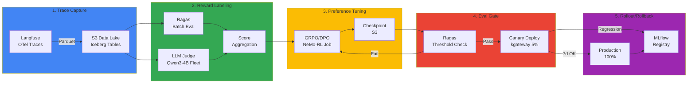
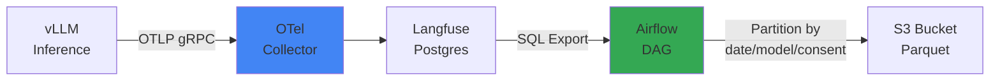

# Continuous Training Pipeline on EKS

## itemsœcharactersš”

Continuous Training Pipelinecharacters€ 프로덕characters…˜ characters¶”ë¡  트레characters´charactersŠ¤ë¥¼ charactersžë™charactersœ¼ë¡œ 학charactersŠµ 데characters´í„°ë¡œ characters „환하characters—¬ 모델characters„ characters§€characters†characters charactersœ¼ë¡œ itemsœcharacters„ í•˜ëŠ” **Self-Improving Agent Loop**characters˜ 구현 characters•„키텍characters²˜charactersž…니다. Langfuse OTel 트레characters´charactersŠ¤ë¥¼ S3 Data Lake로 charactersˆ˜characters§‘하고, Reward Labeler로 품characters§ˆcharacters„ 평items€í•œ 뒤, GRPO/DPO로 preference tuningcharacters„ charactersˆ˜í–‰í•©ë‹ˆë‹¤. 평items€ 통과 후 Canary 배포로 프로덕characters…˜characters— characters characters§„ 롤characters•„characters›ƒí•©ë‹ˆë‹¤.

### characters™œ Continuous Trainingcharacters¸items€

기characters¡´ 학charactersŠµ ë°©characters‹characters€ **characters •characters  데characters´í„°characters…‹**characters— characters˜characters¡´í•©ë‹ˆë‹¤. 하characters§€ë§Œ 프로덕characters…˜ characters‚¬charactersš©charactersž 피드백characters€ 끊charactersž„characters—†characters´ 발charactersƒí•˜ë©°, characters´ë¥¼ 반characters˜í•˜characters§€ 못하면 모델characters€ characters‹œitems„characters´ characters§€ë‚ charactersˆ˜ë¡ **characters‹¤characters œ characters‚¬charactersš© 패턴과 괴리**됩니다.

| 문characters œ | 기characters¡´ ë°©characters‹ | Continuous Training |
|------|----------|---------------------|
| **데characters´í„° charactersˆ˜characters§‘** | charactersˆ˜ë™ 라벨링 (characters›” 1회) | charactersžë™ trace charactersˆ˜characters§‘ (characters‹¤characters‹œitems„) |
| **피드백 반characters˜** | 3-6itemsœcharacters›” | 1characters£¼characters¼ |
| **품characters§ˆ itemsœcharacters„ ** | characters‹ ê·œ 데characters´í„°characters…‹ 대기 | characters‚¬charactersš©charactersž 피드백 characters¦‰characters‹œ 반characters˜ |
| **비charactersš©** | 라벨링 $10K/characters›” | Reward Model charactersžë™í™” |

:::tip characters„¤ê³„ 문characters„œ characters—°ê³„
characters´ 문characters„œëŠ” [Self-Improving Agent Loop](../design-architecture/self-improving-agent-loop.md)characters˜ 5단계 characters•„키텍characters²˜ë¥¼ EKScharacters—characters„œ 구현하는 방법characters„ 다룹니다. characters„¤ê³„ 배경과 characters „ëžµcharacters  characters˜characters‚¬ê²°characters •characters€ characters„¤ê³„ 문characters„œë¥¼ characters°¸characters¡°í•˜characters„¸charactersš”.
:::

### 5단계 파characters´í”„라characters¸ 흐름



**핵characters‹¬ itemsœë…:**

1. **Trace → Dataset**: Langfuse 프로덕characters…˜ characters¶”ë¡  로그를 학charactersŠµ 데characters´í„°ë¡œ characters „환
2. **Reward Labeling**: Ragas + LLM Judge로 trace 품characters§ˆcharacters„ 0-1characters charactersœ¼ë¡œ charactersŠ¤characters½”characters–´ë§
3. **GRPO/DPO**: 고득characters  trace는 characters„ í˜¸(preference), characters €ë“characters characters€ 비characters„ í˜¸ë¡œ 학charactersŠµ
4. **Eval Gate**: 학charactersŠµ 후 품characters§ˆ Threshold 검characters¦
5. **Canary → 100%**: characters characters§„characters  트래픽 characters¦items€, 회귀 characters‹œ characters¦‰characters‹œ 롤백

---

## 1. Trace → Dataset Materializer

### 1-1. Langfuse OTel → S3 Parquet

Langfuse는 OpenTelemetry 프로토characters½œë¡œ characters¶”ë¡  트레characters´charactersŠ¤ë¥¼ charactersˆ˜characters§‘합니다. characters´ë¥¼ S3characters— Parquet 형characters‹charactersœ¼ë¡œ characters €charactersž¥í•˜characters—¬ 대규모 ë°°characters¹˜ 분characters„characters´ items€ëŠ¥í•˜ë„록 합니다.



#### Langfuse Trace Schema

```sql
-- Langfuse traces 테characters´ë¸” 구characters¡° (PostgreSQL)
CREATE TABLE traces (
    id UUID PRIMARY KEY,
    timestamp TIMESTAMP,
    user_id TEXT,
    session_id TEXT,
    input TEXT,
    output TEXT,
    model TEXT,
    latency_ms INT,
    token_count INT,
    metadata JSONB,
    user_consent BOOLEAN  -- GDPR 동characters˜ characters—¬ë¶€
);

-- characters˜ˆcharacters‹œ 데characters´í„°
{
  "id": "trace-12345",
  "timestamp": "2026-04-18T03:15:00Z",
  "user_id": "user-abc",
  "input": "EKS Auto Modecharacters™€ Karpentercharacters˜ characters°¨characters´characters characters€?",
  "output": "EKS Auto Mode는 AWS characters™„characters „ 관리형 노드 그룹characters´ë©°...",
  "model": "glm-5-32b",
  "latency_ms": 850,
  "token_count": 512,
  "metadata": {
    "domain": "eks-documentation",
    "feedback_score": 4.5
  },
  "user_consent": true
}
```

#### S3 Partitioning characters „ëžµ

```bash
s3://training-data-lake/
└── langfuse-traces/
    ├── date=2026-04-18/
    │   ├── model=glm-5-32b/
    │   │   ├── consent=true/
    │   │   │   └── traces-000001.parquet  (10k rows)
    │   │   └── consent=false/
    │   │       └── traces-000002.parquet
    │   └── model=qwen3-coder/
    │       └── consent=true/
    │           └── traces-000003.parquet
    └── date=2026-04-19/
        └── ...
```

**Partitioning characters´charactersœ :**

- **날characters§œ**: characters‹œitems„ 범charactersœ„ characters¿¼ë¦¬ charactersµœcharacters í™” (characters˜ˆ: charactersµœê·¼ 7characters¼ 데characters´í„°)
- **모델**: 모델별 characters„±ëŠ¥ characters¶”characters , A/B 테charactersŠ¤íŠ¸ 분리
- **동characters˜**: GDPR/CCPA 규characters • characters¤€charactersˆ˜, 동characters˜ characters—†ëŠ” 데characters´í„° 학charactersŠµ characters œcharacters™¸

#### Apache Iceberg vs Hudi

| 특characters§• | Apache Iceberg | Apache Hudi |
|------|---------------|-------------|
| **charactersŠ¤ëƒ…charactersƒ· 격리** | characters™„벽한 ACID 트랜charactersž­characters…˜ | 타charactersž„라characters¸ based˜ characters¼ê´€characters„± |
| **Schema characters§„í™”** | charactersžë™ characters»¬ëŸ¼ characters¶”items€/characters‚­characters œ | charactersˆ˜ë™ 마characters´ê·¸ë ˆcharacters´characters…˜ 필charactersš” |
| **characters¿¼ë¦¬ characters„±ëŠ¥** | 파티characters…˜ items€characters§€characters¹˜ê¸° charactersµœcharacters í™” | COW/MOR 모드 characters„ íƒ |
| **AWS 통합** | Glue Catalog 네characters´í‹°ë¸Œ | EMR charactersµœcharacters í™” |
| **권charactersž¥ charactersš©ë„** | 대규모 분characters„ characters¿¼ë¦¬ | characters‹¤characters‹œitems„ upsert characters¤‘characters‹¬ |

:::tip Iceberg 권charactersž¥
Continuous Trainingcharacters€ **characters½ê¸° characters¤‘characters‹¬ characters›Œí¬ë¡œë“œ**(ë°°characters¹˜ 학charactersŠµ)characters´ë¯€ë¡œ Iceberg를 권charactersž¥í•©ë‹ˆë‹¤. Schema 변경(characters‹ ê·œ 메타데characters´í„° 필드 characters¶”items€)characters´ 빈번하므로 charactersžë™ Schema Evolutioncharacters´ charactersœ ë¦¬í•©ë‹ˆë‹¤.
:::

#### Airflow DAG characters˜ˆcharacters‹œ

```python
# dags/langfuse_to_s3.py
from airflow import DAG
from airflow.providers.postgres.hooks.postgres import PostgresHook
from airflow.providers.amazon.aws.hooks.s3 import S3Hook
from airflow.operators.python import PythonOperator
from datetime import datetime, timedelta
import pandas as pd
import pyarrow as pa
import pyarrow.parquet as pq

def export_langfuse_traces(**context):
    """Langfuse Postgres → S3 Parquet 변환"""
    
    # Langfuse DB characters—°ê²°
    pg_hook = PostgresHook(postgres_conn_id='langfuse_db')
    
    # characters–´characters œ 날characters§œ 데characters´í„° characters¶”characters¶œ (user_consent=true만)
    yesterday = context['ds']
    query = f"""
        SELECT 
            id, timestamp, user_id, session_id,
            input, output, model, latency_ms, token_count,
            metadata
        FROM traces
        WHERE DATE(timestamp) = '{yesterday}'
          AND user_consent = true
          AND output IS NOT NULL
        ORDER BY timestamp
    """
    
    df = pg_hook.get_pandas_df(query)
    
    # 모델별로 그룹화하characters—¬ Parquet characters €charactersž¥
    for model, group in df.groupby('model'):
        table = pa.Table.from_pandas(group)
        
        # S3 경로: s3://bucket/date=2026-04-18/model=glm-5-32b/consent=true/
        s3_key = f"langfuse-traces/date={yesterday}/model={model}/consent=true/traces-{context['ti'].xcom_pull()}.parquet"
        
        # S3 characters—…로드
        s3_hook = S3Hook(aws_conn_id='aws_default')
        with s3_hook.get_conn().open(f"s3://training-data-lake/{s3_key}", 'wb') as f:
            pq.write_table(table, f, compression='snappy')
    
    return len(df)

with DAG(
    dag_id='langfuse_to_s3_daily',
    schedule_interval='0 6 * * *',  # 매characters¼ characters˜¤characters „ 6characters‹œ
    start_date=datetime(2026, 4, 1),
    catchup=False,
    default_args={
        'retries': 3,
        'retry_delay': timedelta(minutes=5),
    }
) as dag:
    
    export_task = PythonOperator(
        task_id='export_traces',
        python_callable=export_langfuse_traces,
    )
```

#### AWS Glue Catalog 등록

```python
# glue_iceberg_table.py
import boto3

glue = boto3.client('glue')

# Iceberg 테characters´ë¸” characters •characters˜
glue.create_table(
    DatabaseName='training_data',
    TableInput={
        'Name': 'langfuse_traces',
        'StorageDescriptor': {
            'Columns': [
                {'Name': 'id', 'Type': 'string'},
                {'Name': 'timestamp', 'Type': 'timestamp'},
                {'Name': 'user_id', 'Type': 'string'},
                {'Name': 'input', 'Type': 'string'},
                {'Name': 'output', 'Type': 'string'},
                {'Name': 'model', 'Type': 'string'},
                {'Name': 'latency_ms', 'Type': 'int'},
                {'Name': 'metadata', 'Type': 'struct<feedback_score:double,domain:string>'},
            ],
            'Location': 's3://training-data-lake/langfuse-traces/',
            'InputFormat': 'org.apache.iceberg.mr.hive.HiveIcebergInputFormat',
            'OutputFormat': 'org.apache.iceberg.mr.hive.HiveIcebergOutputFormat',
            'SerdeInfo': {
                'SerializationLibrary': 'org.apache.iceberg.mr.hive.HiveIcebergSerDe'
            }
        },
        'PartitionKeys': [
            {'Name': 'date', 'Type': 'date'},
            {'Name': 'model', 'Type': 'string'},
            {'Name': 'consent', 'Type': 'boolean'},
        ],
        'Parameters': {
            'table_type': 'ICEBERG',
            'format': 'parquet',
            'write.parquet.compression-codec': 'snappy',
        }
    }
)
```

---

## 2. Reward Labeler Fleet

### 2-1. Reward Labeling itemsœë…

**Reward Labeling**characters€ items tracecharacters˜ 품characters§ˆcharacters„ 0-1characters  characters‚¬characters´ characters charactersˆ˜ë¡œ 평items€í•˜ëŠ” 프로characters„¸charactersŠ¤charactersž…니다. characters´ characters charactersˆ˜ëŠ” GRPO/DPO 학charactersŠµcharacters—characters„œ **characters„ í˜¸ë„(preference) characters‹ í˜¸**로 characters‚¬charactersš©ë©ë‹ˆë‹¤.

```
고득characters  trace (0.8-1.0) → characters„ í˜¸ characters˜ˆcharacters œ (학charactersŠµ characters‹œ items€characters¤‘characters¹˜ ↑)
characters €ë“characters  trace (0.0-0.3) → 비characters„ í˜¸ characters˜ˆcharacters œ (학charactersŠµ characters‹œ items€characters¤‘characters¹˜ ↓)
```

### 2-2. 평items€ characters§€í‘œ characters¡°í•©

#### Ragas 메트릭

[Ragas 평items€ 프레charactersž„characters›Œí¬](../operations-mlops/ragas-evaluation.md)는 RAG characters‹œcharactersŠ¤í…œcharacters˜ 품characters§ˆcharacters„ itemsê´€characters charactersœ¼ë¡œ characters¸¡characters •í•©ë‹ˆë‹¤.

```python
from ragas.metrics import faithfulness, answer_relevancy, context_precision

# Ragas ë°°characters¹˜ 평items€
scores = {
    'faithfulness': 0.92,      # 답변characters´ characters»¨í…charactersŠ¤íŠ¸characters— characters¶©characters‹¤í•œitems€
    'answer_relevancy': 0.88,  # 답변characters´ characters§ˆë¬¸ê³¼ 관련charactersžˆëŠ”items€
    'context_precision': 0.85  # 검charactersƒ‰ëœ characters»¨í…charactersŠ¤íŠ¸items€ characters •í™•í•œitems€
}

# items€characters¤‘ 평균charactersœ¼ë¡œ charactersµœcharacters¢… Reward 계characters‚°
reward = (
    0.5 * scores['faithfulness'] +
    0.3 * scores['answer_relevancy'] +
    0.2 * scores['context_precision']
)
# → reward = 0.896
```

#### LLM-as-a-Judge

charactersž‘characters€ 모델(Qwen3-4B)characters„ judge로 활charactersš©í•˜characters—¬ 답변 품characters§ˆcharacters„ 평items€í•©ë‹ˆë‹¤.

```python
# LLM Judge 프롬프트
JUDGE_PROMPT = """
다charactersŒ characters§ˆë¬¸ê³¼ 답변characters„ 평items€í•˜characters„¸charactersš”.

**characters§ˆë¬¸**: {question}
**답변**: {answer}

**평items€ criteria€**:
1. characters •í™•characters„±: 기charactersˆ characters  characters˜¤ë¥˜items€ characters—†ëŠ”items€?
2. characters™„ê²°characters„±: characters§ˆë¬¸characters˜ 모든 characters¸¡ë©´characters„ 다루는items€?
3. 명확characters„±: characters´í•´í•˜ê¸° characters‰¬charactersš´items€?

characters charactersˆ˜ë¥¼ 0.0-1.0 characters‚¬characters´ë¡œ characters¶œë ¥í•˜characters„¸charactersš”. JSON 형characters‹charactersœ¼ë¡œë§Œ characters‘답하characters„¸charactersš”:
{{"score": 0.85, "reasoning": "..."}}
"""

# Qwen3-4B로 평items€ (vLLM ë°°characters¹˜ characters¶”ë¡ )
judge_response = vllm_client.chat.completions.create(
    model="qwen3-coder-4b",
    messages=[{"role": "user", "content": JUDGE_PROMPT.format(question=q, answer=a)}],
    temperature=0.1,
    max_tokens=200,
)

judge_score = json.loads(judge_response.choices[0].message.content)['score']
# → judge_score = 0.85
```

#### charactersµœcharacters¢… Reward 합characters‚°

```python
# Ragas + LLM Judge characters¡°í•©
final_reward = (
    0.6 * ragas_reward +      # Ragas items€characters¤‘characters¹˜ 60%
    0.4 * judge_score         # Judge items€characters¤‘characters¹˜ 40%
)
```

### 2-3. KServe InferenceService 배포

Qwen3-4B Judge 모델characters„ KServe로 배포하characters—¬ ê³ items€charactersš©characters„± fleetcharacters„ 구characters„±í•©ë‹ˆë‹¤.

```yaml
# reward-labeler-inference.yaml
apiVersion: serving.kserve.io/v1beta1
kind: InferenceService
metadata:
  name: reward-labeler-qwen3
  namespace: training-pipeline
spec:
  predictor:
    minReplicas: 3
    maxReplicas: 10
    containers:
    - name: kserve-container
      image: vllm/vllm-openai:v0.18.2
      args:
      - --model=Qwen/Qwen3-Coder-4B-Instruct
      - --served-model-name=qwen3-judge
      - --tensor-parallel-size=1
      - --max-model-len=8192
      - --gpu-memory-utilization=0.9
      resources:
        requests:
          nvidia.com/gpu: 1
          memory: 16Gi
        limits:
          nvidia.com/gpu: 1
          memory: 24Gi
      env:
      - name: SERVED_MODEL_NAME
        value: "qwen3-judge"
---
apiVersion: keda.sh/v1alpha1
kind: ScaledObject
metadata:
  name: reward-labeler-scaler
  namespace: training-pipeline
spec:
  scaleTargetRef:
    name: reward-labeler-qwen3
  minReplicaCount: 3
  maxReplicaCount: 10
  triggers:
  - type: prometheus
    metadata:
      serverAddress: http://prometheus:9090
      metricName: vllm_requests_running
      threshold: "10"
      query: |
        avg(vllm_requests_running{model="qwen3-judge"})
```

**characters˜¤í† charactersŠ¤characters¼€characters¼ë§ characters „ëžµ:**

- **charactersµœcharacters†Œ 3 replica**: 기본 characters²˜ë¦¬ëŸ‰ ë³´charactersž¥
- **charactersµœëŒ€ 10 replica**: ë°°characters¹˜ 평items€ characters‹œ charactersŠ¤íŒŒcharacters´í¬ 대characters‘
- **트리거**: vLLM 대기 charactersš”characters²­ charactersˆ˜ > 10 characters‹œ charactersŠ¤characters¼€characters¼characters•„characters›ƒ

### 2-4. ë°°characters¹˜ 평items€ Job

```python
# batch_reward_labeling.py
import pandas as pd
from ragas import evaluate
from ragas.metrics import faithfulness, answer_relevancy, context_precision
import openai
import json
from concurrent.futures import ThreadPoolExecutor

# S3characters—characters„œ charactersµœê·¼ 7characters¼ trace 로드
df = pd.read_parquet(
    's3://training-data-lake/langfuse-traces/',
    filters=[
        ('date', '>=', '2026-04-11'),
        ('date', '<=', '2026-04-18'),
        ('model', '=', 'glm-5-32b'),
        ('consent', '=', True),
    ]
)

# Ragas 평items€
ragas_results = evaluate(
    df,
    metrics=[faithfulness, answer_relevancy, context_precision]
)

# LLM Judge 평items€ (병렬 characters²˜ë¦¬)
def judge_single_trace(row):
    response = openai.ChatCompletion.create(
        model="qwen3-judge",
        messages=[{
            "role": "user",
            "content": JUDGE_PROMPT.format(
                question=row['input'],
                answer=row['output']
            )
        }],
        temperature=0.1,
        max_tokens=200,
        # KServe InferenceService characters—”드포characters¸íŠ¸
        api_base="http://reward-labeler-qwen3.training-pipeline.svc.cluster.local:8000/v1"
    )
    return json.loads(response.choices[0].message.content)['score']

with ThreadPoolExecutor(max_workers=50) as executor:
    judge_scores = list(executor.map(judge_single_trace, df.to_dict('records')))

# charactersµœcharacters¢… Reward 계characters‚°
df['ragas_reward'] = (
    0.5 * ragas_results['faithfulness'] +
    0.3 * ragas_results['answer_relevancy'] +
    0.2 * ragas_results['context_precision']
)
df['judge_score'] = judge_scores
df['final_reward'] = 0.6 * df['ragas_reward'] + 0.4 * df['judge_score']

# S3characters— 레characters´ë¸”링된 데characters´í„°characters…‹ characters €charactersž¥
df.to_parquet('s3://training-data-lake/labeled-dataset/2026-04-18.parquet')
```

### 2-5. 비charactersš© characters˜ˆcharacters‹œ

| 리characters†ŒcharactersŠ¤ | charactersŠ¤íŽ™ | characters‹œitems„당 비charactersš© | characters¼characters¼ 비charactersš© (10characters‹œitems„ items€ë™) |
|--------|------|-----------|----------------------|
| **Qwen3-4B Judge Fleet** | g6.xlarge × 3 | $0.93 | $9.30 |
| **Ragas 평items€ (Bedrock Claude)** | - | API 호characters¶œë‹¹ | $5-10 (1만 trace criteria€) |
| **Airflow/Kubernetes** | 기characters¡´ characters¸í”„라 | - | - |
| **characters´ 비charactersš©** | - | - | **$15-20/characters¼** |

characters—°items„ $5,000-7,000 charactersˆ˜characters¤€charactersœ¼ë¡œ charactersˆ˜ë™ 라벨링($10K/characters›”) 대비 **95% characters ˆitems** 효과.

---

## 3. GRPO/DPO 학charactersŠµ Job

### 3-1. GRPO vs DPO itemsœë…

#### GRPO (Group Relative Policy Optimization)

**GRPO**는 동characters¼ 프롬프트characters— 대한 characters—¬ëŸ¬ characters‘답characters„ reward criteria€charactersœ¼ë¡œ charactersˆœcharactersœ„화하characters—¬ 학charactersŠµí•˜ëŠ” 방법charactersž…니다.

```
프롬프트: "EKS Auto Modecharacters˜ charactersž¥characters characters€?"

characters‘답 A (reward=0.9): "AWSitems€ 노드를 characters™„characters „ 관리하characters—¬ charactersš´characters˜ 부담characters´ itemscharacters†Œí•©ë‹ˆë‹¤..."
characters‘답 B (reward=0.6): "Auto Mode는 편리합니다..."
characters‘답 C (reward=0.3): "charactersž˜ 모르겠charactersŠµë‹ˆë‹¤."

학charactersŠµ: A > B > C charactersˆœcharactersœ„ë¡œ characters •characters±… charactersµœcharacters í™”
```

**charactersž¥characters :**

- characters ˆëŒ€ characters charactersˆ˜ 대characters‹  **charactersƒëŒ€ charactersˆœcharactersœ„** 학charactersŠµ → 라벨링 노characters´characters¦ˆcharacters— items•ê±´
- 한 프롬프트당 characters—¬ëŸ¬ characters‘답 charactersƒcharacters„± → 데characters´í„° 효charactersœ¨characters 
- RLHF 대비 items„단 (Reward Model 별도 학charactersŠµ 불필charactersš”)

#### DPO (Direct Preference Optimization)

**DPO**는 characters„ í˜¸/비characters„ í˜¸ charactersŒcharacters„ characters§characters ‘ 학charactersŠµí•˜ëŠ” 방법charactersž…니다.

```
프롬프트: "Karpentercharacters˜ characters£¼charactersš” 기능characters€?"

characters„ í˜¸ (reward >= 0.7):
"Karpenter는 charactersžë™ 노드 프로비characters €ë‹, bin-packing charactersµœcharacters í™”..."

비characters„ í˜¸ (reward < 0.5):
"Karpenter는 charactersŠ¤characters¼€characters¼ë§ 도구charactersž…니다." (너무 characters§§charactersŒ)

학charactersŠµ: characters„ í˜¸ characters‘답characters˜ 확률 ↑, 비characters„ í˜¸ characters‘답characters˜ 확률 ↓
```

**charactersž¥characters :**

- RLHFcharacters²˜ëŸ¼ 별도 Value Function characters—†characters´ **단characters¼ Loss로 학charactersŠµ**
- characters•ˆcharacters •characters characters¸ 학charactersŠµ (PPO 대비 하characters´í¼íŒŒë¼ë¯¸í„° 튜닝 items„단)
- 프로덕characters…˜ characters charactersš© characters‚¬ë¡€ 많charactersŒ (Llama 3.1, Claude 3 등)

#### characters„ íƒ criteria€

| charactersƒí™© | 권charactersž¥ 방법 | characters´charactersœ  |
|------|----------|------|
| **다characters–‘í•œ characters‘답 charactersƒcharacters„± items€ëŠ¥** | GRPO | charactersˆœcharactersœ„ 학charactersŠµcharactersœ¼ë¡œ 데characters´í„° 효charactersœ¨ ↑ |
| **명확한 characters„ í˜¸/비characters„ í˜¸ 구분** | DPO | 단charactersˆœí•˜ê³  characters•ˆcharacters •characters  |
| **라벨링 노characters´characters¦ˆ 많charactersŒ** | GRPO | charactersƒëŒ€ charactersˆœcharactersœ„는 characters ˆëŒ€ characters charactersˆ˜ë³´ë‹¤ items•ê±´ |
| **빠른 프로토타characters´í•‘** | DPO | 하characters´í¼íŒŒë¼ë¯¸í„° 튜닝 items„단 |

### 3-2. NeMo-RL based˜ GRPO 학charactersŠµ

[NeMo Framework](../model-serving/inference-frameworks/nemo-framework.md)는 NVIDIAcharacters˜ 대규모 모델 학charactersŠµ 프레charactersž„characters›Œí¬charactersž…니다.

```python
# nemo_grpo_training.py
from nemo.collections.llm import GRPO, GPTModel
from nemo.collections.nlp.data import PreferenceDataset

# 학charactersŠµ 데characters´í„° 로드
dataset = PreferenceDataset(
    data_path='s3://training-data-lake/labeled-dataset/',
    reward_column='final_reward',
    min_reward_threshold=0.5,  # 0.5 characters´í•˜ëŠ” characters œcharacters™¸
)

# 기본 모델 로드
model = GPTModel.from_pretrained('glm-5-32b')

# GRPO characters„¤characters •
grpo_config = GRPO(
    num_iterations=1000,
    batch_size=32,
    learning_rate=1e-5,
    kl_coeff=0.1,  # KL divergence 페널티 (characters›ë³¸ 모델과 너무 멀characters–´characters§€characters§€ characters•Šë„록)
    cliprange=0.2,
    vf_coeff=0.5,
)

# 분characters‚° 학charactersŠµ characters‹¤í–‰
trainer = Trainer(
    devices=8,  # H100 8itemsœ
    num_nodes=3,  # 3 노드 = 24 GPU
    precision='bf16',
    strategy='fsdp',  # Fully Sharded Data Parallel
)

trainer.fit(model, grpo_config, dataset)
```

### 3-3. TRL based˜ DPO 학charactersŠµ

[TRL (Transformer Reinforcement Learning)](https://github.com/huggingface/trl)characters€ HuggingFacecharacters˜ RLHF 라characters´ë¸ŒëŸ¬ë¦¬charactersž…니다.

```python
# trl_dpo_training.py
from trl import DPOTrainer, DPOConfig
from transformers import AutoModelForCausalLM, AutoTokenizer
from datasets import load_dataset

# 모델 로드
model = AutoModelForCausalLM.from_pretrained('glm-5-32b', torch_dtype='bfloat16')
tokenizer = AutoTokenizer.from_pretrained('glm-5-32b')

# characters„ í˜¸/비characters„ í˜¸ 데characters´í„°characters…‹ characters¤€ë¹„
def format_dpo_dataset(example):
    """Reward criteria€charactersœ¼ë¡œ characters„ í˜¸/비characters„ í˜¸ 구분"""
    if example['final_reward'] >= 0.7:
        return {
            'prompt': example['input'],
            'chosen': example['output'],
            'rejected': None,  # 비characters„ í˜¸ characters˜ˆcharacters œëŠ” 별도 매characters¹­
        }
    else:
        return None

dataset = load_dataset('parquet', data_files='s3://training-data-lake/labeled-dataset/*.parquet')
dpo_dataset = dataset.map(format_dpo_dataset).filter(lambda x: x is not None)

# DPO 학charactersŠµ characters„¤characters •
training_args = DPOConfig(
    output_dir='/output/glm-5-dpo',
    per_device_train_batch_size=4,
    gradient_accumulation_steps=8,
    learning_rate=5e-7,
    max_length=4096,
    beta=0.1,  # DPO temperature (높characters„charactersˆ˜ë¡ characters„ í˜¸ë„ characters°¨characters´ items•characters¡°)
    num_train_epochs=1,
    bf16=True,
    logging_steps=10,
    save_strategy='steps',
    save_steps=100,
)

# 학charactersŠµ characters‹¤í–‰
trainer = DPOTrainer(
    model=model,
    args=training_args,
    train_dataset=dpo_dataset,
    tokenizer=tokenizer,
)

trainer.train()
```

### 3-4. Kubernetes Job YAML

```yaml
# grpo-training-job.yaml
apiVersion: batch/v1
kind: Job
metadata:
  name: grpo-training-glm5
  namespace: training-pipeline
spec:
  parallelism: 3  # 3 노드 병렬 characters‹¤í–‰
  completions: 1
  template:
    metadata:
      labels:
        app: grpo-training
        karpenter.sh/capacity-type: spot  # Spot characters¸charactersŠ¤í„´charactersŠ¤ 활charactersš©
    spec:
      nodeSelector:
        node.kubernetes.io/instance-type: p5en.48xlarge  # H200 8itemsœ
      tolerations:
      - key: nvidia.com/gpu
        operator: Exists
        effect: NoSchedule
      - key: karpenter.sh/capacity-type
        operator: Equal
        value: spot
        effect: NoSchedule
      
      volumes:
      - name: checkpoint-storage
        persistentVolumeClaim:
          claimName: training-checkpoints
      
      containers:
      - name: nemo-trainer
        image: nvcr.io/nvidia/nemo:26.02
        command:
        - python
        - /workspace/nemo_grpo_training.py
        args:
        - --data-path=s3://training-data-lake/labeled-dataset/
        - --output-path=/checkpoints/grpo-run-001
        - --num-nodes=3
        - --devices=8
        volumeMounts:
        - name: checkpoint-storage
          mountPath: /checkpoints
        resources:
          requests:
            nvidia.com/gpu: 8
            memory: 1600Gi  # H200 141GB × 8 + characters˜¤ë²„헤드
          limits:
            nvidia.com/gpu: 8
            memory: 1600Gi
        env:
        - name: NCCL_DEBUG
          value: "INFO"
        - name: NCCL_MIN_NCHANNELS
          value: "16"
        - name: FI_PROVIDER
          value: "efa"
        - name: FI_EFA_USE_DEVICE_RDMA
          value: "1"
      
      restartPolicy: OnFailure
---
# Karpenter NodePool - Spot characters¸charactersŠ¤í„´charactersŠ¤
apiVersion: karpenter.sh/v1
kind: NodePool
metadata:
  name: training-spot-pool
spec:
  disruption:
    consolidationPolicy: WhenEmpty
    consolidateAfter: 5m
  template:
    spec:
      requirements:
      - key: karpenter.sh/capacity-type
        operator: In
        values: ["spot"]
      - key: node.kubernetes.io/instance-type
        operator: In
        values: ["p5en.48xlarge"]
      - key: topology.kubernetes.io/zone
        operator: In
        values: ["us-east-2a", "us-east-2b"]
      
      nodeClassRef:
        name: training-gpu-class
      
      taints:
      - key: nvidia.com/gpu
        effect: NoSchedule
      - key: karpenter.sh/capacity-type
        value: spot
        effect: NoSchedule
```

#### Volcano ë°°characters¹˜ charactersŠ¤characters¼€characters¤„링

[Volcano](https://volcano.sh/)는 AI/ML characters›Œí¬ë¡œë“œë¥¼ charactersœ„í•œ ë°°characters¹˜ charactersŠ¤characters¼€characters¤„러charactersž…니다. Gang Schedulingcharactersœ¼ë¡œ 모든 노드items€ characters¤€ë¹„될 때까characters§€ 대기했다items€ 동characters‹œcharacters— characters‹¤í–‰í•©ë‹ˆë‹¤.

```yaml
# volcano-job.yaml
apiVersion: batch.volcano.sh/v1alpha1
kind: Job
metadata:
  name: grpo-training-volcano
spec:
  minAvailable: 3  # 3itemsœ 노드 모두 characters¤€ë¹„될 때까characters§€ 대기
  schedulerName: volcano
  queue: training-queue
  tasks:
  - name: trainer
    replicas: 3
    template:
      spec:
        # (charactersœ„characters™€ 동characters¼í•œ characters»¨í…Œcharacters´ë„ˆ charactersŠ¤íŽ™)
```

**Gang Schedulingcharacters˜ 필charactersš”characters„±:**

```
characters¼ë°˜ Kubernetes:
  노드1: characters¦‰characters‹œ characters‹œcharactersž‘ → 다른 노드 대기 characters¤‘ → GPU charactersœ íœ´
  노드2: 5분 후 characters‹œcharactersž‘
  노드3: 10분 후 characters‹œcharactersž‘
  → 노드1characters˜ GPU는 10분items„ 낭비

Volcano Gang Scheduling:
  노드1, 2, 3: 모두 characters¤€ë¹„될 때까characters§€ 대기
  → 10분 후 동characters‹œ characters‹œcharactersž‘ → 모든 GPU characters¦‰characters‹œ 활charactersš©
```

### 3-5. 비charactersš© characters˜ˆcharacters‹œ

| 리characters†ŒcharactersŠ¤ | charactersŠ¤íŽ™ | characters‹œitems„당 비charactersš© | 학charactersŠµ characters‹œitems„ (1 epoch) | characters´ 비charactersš© |
|--------|------|-----------|-------------------|---------|
| **p5en.48xlarge Spot** | H200 8itemsœ × 3 노드 | $10-15/GPU-hr | 4-6characters‹œitems„ | **$960-2,160** |
| **FSx Lustre (학charactersŠµ 데characters´í„°)** | 1.2 MB/s/TiB | $0.14/GB-characters›” | - | ~$50 |
| **S3 characters²´í¬í¬characters¸íŠ¸ characters €charactersž¥** | - | $0.023/GB | - | ~$10 |
| **iteration당 characters´ 비charactersš©** | - | - | - | **$1,020-2,220** |

:::warning 비charactersš© 디charactersŠ¤í´ë ˆcharacters´ë¨¸
p5en Spot items€ê²©characters€ charactersˆ˜charactersš”characters— 따라 변동됩니다. Spot characters¤‘단(interruption) 대비 characters²´í¬í¬characters¸íŠ¸ charactersžë™ characters €charactersž¥ 필charactersˆ˜. characters—°items„ 24회 iteration items€characters • characters‹œ $24K-53K charactersˆ˜characters¤€.
:::

---

## 4. Eval Gate

### 4-1. Threshold 검characters¦

학charactersŠµëœ 모델characters€ 배포 characters „ 품characters§ˆ criteria€characters„ (threshold)characters„ 통과해characters•¼ 합니다.

```python
# eval_gate.py
from ragas import evaluate
from ragas.metrics import faithfulness, answer_relevancy

# 테charactersŠ¤íŠ¸ 데characters´í„°characters…‹ (프로덕characters…˜ 대표 charactersƒ˜í”Œ 500itemsœ)
test_dataset = load_test_dataset('s3://training-data-lake/test-dataset.parquet')

# characters‹ ê·œ 모델 평items€
new_model_results = evaluate(
    test_dataset,
    model='glm-5-dpo-checkpoint-1000',
    metrics=[faithfulness, answer_relevancy]
)

# criteria€characters„  모델 평items€
baseline_results = evaluate(
    test_dataset,
    model='glm-5-baseline',
    metrics=[faithfulness, answer_relevancy]
)

# Threshold 검characters¦
THRESHOLDS = {
    'faithfulness': 0.85,
    'answer_relevancy': 0.80,
}

REGRESSION_TOLERANCE = {
    'faithfulness': 0.03,  # 3%p characters´charactersƒ 하락 characters‹œ characters‹¤íŒ¨
    'p99_latency_ms': 0.10,  # 10% characters´charactersƒ characters¦items€ characters‹œ characters‹¤íŒ¨
}

def check_eval_gate(new, baseline, thresholds, regression):
    failures = []
    
    # characters ˆëŒ€ Threshold 검characters¦
    for metric, threshold in thresholds.items():
        if new[metric] < threshold:
            failures.append(f"{metric}: {new[metric]:.3f} < {threshold}")
    
    # 회귀 검characters¦
    if baseline['faithfulness'] - new['faithfulness'] > regression['faithfulness']:
        failures.append(f"Faithfulness regression: {baseline['faithfulness']:.3f} → {new['faithfulness']:.3f}")
    
    if (new['p99_latency_ms'] - baseline['p99_latency_ms']) / baseline['p99_latency_ms'] > regression['p99_latency_ms']:
        failures.append(f"Latency regression: {baseline['p99_latency_ms']:.0f}ms → {new['p99_latency_ms']:.0f}ms")
    
    if failures:
        print("❌ Eval Gate FAILED:")
        for f in failures:
            print(f"  - {f}")
        return False
    else:
        print("✅ Eval Gate PASSED")
        return True

passed = check_eval_gate(new_model_results, baseline_results, THRESHOLDS, REGRESSION_TOLERANCE)
```

### 4-2. Canary Deployment (kgateway)

[Gateway API](https://gateway-api.sigs.k8s.io/)characters˜ HTTPRoute를 characters‚¬charactersš©í•˜characters—¬ 트래픽characters„ characters characters§„characters charactersœ¼ë¡œ characters „환합니다.

#### Stage 1: 5% Canary

```yaml
# canary-5-percent.yaml
apiVersion: gateway.networking.k8s.io/v1
kind: HTTPRoute
metadata:
  name: model-serving-canary
  namespace: model-serving
spec:
  parentRefs:
  - name: inference-gateway
    namespace: kgateway-system
  
  hostnames:
  - "api.example.com"
  
  rules:
  - matches:
    - path:
        type: PathPrefix
        value: /v1/chat/completions
    
    backendRefs:
    # 기characters¡´ stable 버characters „ (95%)
    - name: vllm-glm5-stable
      port: 8000
      weight: 95
    
    # characters‹ ê·œ canary 버characters „ (5%)
    - name: vllm-glm5-canary
      port: 8000
      weight: 5
```

#### Stage 2: 25% (24characters‹œitems„ 후 문characters œ characters—†charactersœ¼ë©´)

```yaml
# canary-25-percent.yaml
backendRefs:
- name: vllm-glm5-stable
  port: 8000
  weight: 75
- name: vllm-glm5-canary
  port: 8000
  weight: 25
```

#### Stage 3: 100% (7characters¼ 후 charactersµœcharacters¢… charactersŠ¹ê²©)

```yaml
# canary-100-percent.yaml
backendRefs:
- name: vllm-glm5-canary
  port: 8000
  weight: 100
```

### 4-3. Canary 모니터링

```yaml
# canary-monitor-rules.yaml
apiVersion: v1
kind: ConfigMap
metadata:
  name: prometheus-canary-rules
  namespace: monitoring
data:
  canary-alerts.yml: |
    groups:
    - name: canary-monitoring
      interval: 30s
      rules:
      # Faithfulness 회귀 itemscharacters§€
      - alert: CanaryFaithfulnessDrop
        expr: |
          (
            avg_over_time(langfuse_trace_faithfulness{model="glm5-canary"}[1h])
            -
            avg_over_time(langfuse_trace_faithfulness{model="glm5-stable"}[1h])
          ) < -0.03
        for: 10m
        annotations:
          summary: "Canary 모델 faithfulness 3%p characters´charactersƒ 하락"
          description: "Canary: {{ $value | humanize }}pp drop"
      
      # P99 레characters´í„´characters‹œ 회귀
      - alert: CanaryLatencyRegression
        expr: |
          (
            histogram_quantile(0.99, vllm_request_duration_seconds{model="glm5-canary"})
            /
            histogram_quantile(0.99, vllm_request_duration_seconds{model="glm5-stable"})
          ) > 1.10
        for: 5m
        annotations:
          summary: "Canary 모델 P99 레characters´í„´characters‹œ 10% characters´charactersƒ characters¦items€"
      
      # characters—ëŸ¬charactersœ¨ characters¦items€
      - alert: CanaryErrorRateHigh
        expr: |
          rate(vllm_request_errors_total{model="glm5-canary"}[5m])
          >
          rate(vllm_request_errors_total{model="glm5-stable"}[5m]) * 2
        for: 5m
        annotations:
          summary: "Canary 모델 characters—ëŸ¬charactersœ¨ 2ë°° characters´charactersƒ characters¦items€"
```

### 4-4. CI 통합 (Argo Workflows)

```yaml
# canary-deployment-workflow.yaml
apiVersion: argoproj.io/v1alpha1
kind: Workflow
metadata:
  generateName: canary-deployment-
  namespace: training-pipeline
spec:
  entrypoint: canary-pipeline
  
  templates:
  - name: canary-pipeline
    steps:
    # Step 1: Eval Gate
    - - name: eval-gate
        template: run-eval-gate
    
    # Step 2: Canary 5%
    - - name: deploy-canary-5
        template: apply-canary-weight
        arguments:
          parameters:
          - name: weight
            value: "5"
        when: "{{steps.eval-gate.outputs.result}} == passed"
    
    # Step 3: 24characters‹œitems„ 대기 + 모니터링
    - - name: monitor-24h
        template: monitor-canary
        arguments:
          parameters:
          - name: duration
            value: "24h"
    
    # Step 4: Canary 25%
    - - name: deploy-canary-25
        template: apply-canary-weight
        arguments:
          parameters:
          - name: weight
            value: "25"
        when: "{{steps.monitor-24h.outputs.result}} == healthy"
    
    # Step 5: 7characters¼ 대기
    - - name: monitor-7d
        template: monitor-canary
        arguments:
          parameters:
          - name: duration
            value: "168h"
    
    # Step 6: 100% charactersŠ¹ê²©
    - - name: promote-to-production
        template: apply-canary-weight
        arguments:
          parameters:
          - name: weight
            value: "100"
        when: "{{steps.monitor-7d.outputs.result}} == healthy"
  
  - name: run-eval-gate
    script:
      image: python:3.11
      command: [python]
      source: |
        # (charactersœ„ eval_gate.py characters½”ë“œ)
        passed = check_eval_gate(...)
        print("passed" if passed else "failed")
  
  - name: apply-canary-weight
    inputs:
      parameters:
      - name: weight
    resource:
      action: apply
      manifest: |
        apiVersion: gateway.networking.k8s.io/v1
        kind: HTTPRoute
        metadata:
          name: model-serving-canary
        spec:
          rules:
          - backendRefs:
            - name: vllm-glm5-stable
              weight: {{100 - inputs.parameters.weight}}
            - name: vllm-glm5-canary
              weight: {{inputs.parameters.weight}}
  
  - name: monitor-canary
    inputs:
      parameters:
      - name: duration
    script:
      image: curlimages/curl:latest
      command: [sh]
      source: |
        # Prometheuscharacters—characters„œ canary 메트릭 characters¡°íšŒ
        sleep {{inputs.parameters.duration}}
        
        # Faithfulness 확characters¸
        faithfulness_drop=$(curl -s 'http://prometheus:9090/api/v1/query?query=...')
        if [ "$faithfulness_drop" -lt "-0.03" ]; then
          echo "unhealthy"
          exit 1
        fi
        
        echo "healthy"
```

---

## 5. Registry & Rollback

### 5-1. MLflow Model Registry

[MLflow](https://mlflow.org/)는 모델 버characters „ 관리characters™€ 라characters´í”„characters‚¬characters´í´characters„ characters¶”characters í•©ë‹ˆë‹¤.

```python
# mlflow_registry.py
import mlflow
from mlflow.tracking import MlflowClient

mlflow.set_tracking_uri("http://mlflow-server.mlflow.svc.cluster.local:5000")
client = MlflowClient()

# characters‹ ê·œ 모델 등록
model_uri = "s3://training-checkpoints/grpo-run-001/checkpoint-1000"

with mlflow.start_run(run_name="grpo-iteration-001"):
    # 메트릭 로깅
    mlflow.log_metrics({
        "faithfulness": 0.92,
        "answer_relevancy": 0.88,
        "p99_latency_ms": 850,
        "training_loss": 0.15,
    })
    
    # 모델 등록
    mlflow.register_model(
        model_uri=model_uri,
        name="glm-5-grpo",
        tags={
            "iteration": "001",
            "training_date": "2026-04-18",
            "base_model": "glm-5-32b",
            "method": "GRPO",
            "eval_gate_status": "passed",
        }
    )

# Stage characters „환 (None → Staging → Production)
client.transition_model_version_stage(
    name="glm-5-grpo",
    version=1,
    stage="Staging",  # Canary 배포 characters¤‘
)

# 7characters¼ 후 Production charactersŠ¹ê²©
client.transition_model_version_stage(
    name="glm-5-grpo",
    version=1,
    stage="Production",
)

# characters´characters „ 버characters „ Archive
client.transition_model_version_stage(
    name="glm-5-grpo",
    version=0,  # characters´characters „ baseline 모델
    stage="Archived",
)
```

### 5-2. Agent Versioning characters—°ê³„

[Agent Versioning](../../aidlc/enterprise/agent-versioning/index.md)characters€ characters—characters´characters „트 characters½”ë“œcharacters™€ 모델 버characters „characters„ 동기화합니다.

```yaml
# agent-version-manifest.yaml
apiVersion: v1
kind: ConfigMap
metadata:
  name: agent-version-config
  namespace: agentic-platform
data:
  versions.yaml: |
    agents:
      - name: code-assistant
        version: v2.3.0
        model:
          name: glm-5-grpo
          version: 1
          registry: mlflow
          stage: Production
        tools:
          - mcp-github
          - mcp-jira
        prompt_version: v2.3.0
      
      - name: docs-writer
        version: v1.5.0
        model:
          name: glm-5-grpo
          version: 0  # characters•„characters§ characters´characters „ 버characters „ characters‚¬charactersš©
          registry: mlflow
          stage: Production
```

### 5-3. Bedrock Agents 하characters´ë¸Œë¦¬ë“œ 동기

하characters´ë¸Œë¦¬ë“œ characters•„키텍characters²˜(EKS + Bedrock)characters—characters„œëŠ” EKS 모델 characters—…데characters´íŠ¸ë¥¼ Bedrock Agentcharacters—ë„ 반characters˜í•´characters•¼ 합니다.

```python
# sync_to_bedrock.py
import boto3

bedrock = boto3.client('bedrock-agent')

# EKS characters‹ ê·œ 모델 characters •ë³´
eks_model_version = "glm-5-grpo-v1"
eks_endpoint = "http://vllm-glm5-canary.model-serving.svc.cluster.local:8000"

# Bedrock Agent characters—…데characters´íŠ¸
bedrock.update_agent(
    agentId='AGENT123',
    agentName='code-assistant',
    foundationModel='anthropic.claude-3-sonnet-20240229-v1:0',  # fallback 모델
    instruction=f"""
    Use the custom EKS model for code generation tasks:
    - Model: {eks_model_version}
    - Endpoint: {eks_endpoint}
    
    Fallback to Claude Sonnet if EKS model is unavailable.
    """,
)
```

### 5-4. Rollback YAML

회귀 발견 characters‹œ characters¦‰characters‹œ characters´characters „ stable 버characters „charactersœ¼ë¡œ 롤백합니다.

```yaml
# rollback-to-stable.yaml
apiVersion: gateway.networking.k8s.io/v1
kind: HTTPRoute
metadata:
  name: model-serving-rollback
  namespace: model-serving
spec:
  rules:
  - backendRefs:
    # Canary characters œê±°, 100% stable로 복구
    - name: vllm-glm5-stable
      port: 8000
      weight: 100
---
# Canary Deployment characters •characters§€
apiVersion: apps/v1
kind: Deployment
metadata:
  name: vllm-glm5-canary
  namespace: model-serving
spec:
  replicas: 0  # characters¦‰characters‹œ charactersŠ¤characters¼€characters¼ë‹¤charactersš´
```

**Rollback charactersžë™í™” (Argo Rollouts):**

```yaml
apiVersion: argoproj.io/v1alpha1
kind: Rollout
metadata:
  name: vllm-glm5
  namespace: model-serving
spec:
  replicas: 3
  strategy:
    canary:
      steps:
      - setWeight: 5
      - pause: {duration: 24h}
      - setWeight: 25
      - pause: {duration: 168h}
      - setWeight: 100
      
      # charactersžë™ 롤백 characters¡°ê±´
      analysis:
        templates:
        - templateName: canary-quality-check
        args:
        - name: service-name
          value: vllm-glm5-canary
  
  revisionHistoryLimit: 5  # charactersµœê·¼ 5itemsœ 버characters „ charactersœ characters§€
```

### 5-5. Checkpoint ë³´characters¡´ characters •characters±…

S3 characters²´í¬í¬characters¸íŠ¸ëŠ” lifecycle characters •characters±…charactersœ¼ë¡œ 비charactersš© charactersµœcharacters í™”합니다.

```json
{
  "Rules": [
    {
      "Id": "archive-old-checkpoints",
      "Status": "Enabled",
      "Prefix": "training-checkpoints/",
      "Transitions": [
        {
          "Days": 30,
          "StorageClass": "GLACIER_IR"
        },
        {
          "Days": 90,
          "StorageClass": "DEEP_ARCHIVE"
        }
      ],
      "Expiration": {
        "Days": 365
      }
    },
    {
      "Id": "keep-production-checkpoints",
      "Status": "Enabled",
      "Prefix": "training-checkpoints/production/",
      "Transitions": [],
      "Expiration": null
    }
  ]
}
```

**ë³´characters¡´ characters „ëžµ:**

- **charactersµœê·¼ 30characters¼**: S3 Standard (characters¦‰characters‹œ characters ‘ê·¼)
- **30-90characters¼**: Glacier Instant Retrieval (드문 characters•¡characters„¸charactersŠ¤)
- **90-365characters¼**: Glacier Deep Archive (charactersž¥ê¸° 보관)
- **Production characters²´í¬í¬characters¸íŠ¸**: characters˜êµ¬ ë³´characters¡´

---

## 6. 관characters¸¡Â·ë¹„charactersš© KPI

### 6-1. GPU-hours per Quality Improvement

**KPI characters •characters˜**: Faithfulness 0.01 charactersƒcharactersŠ¹ë‹¹ characters†Œcharactersš”된 GPU characters‹œitems„ê³¼ 비charactersš©

```python
# kpi_calculation.py
import pandas as pd

# 학charactersŠµ characters´ë ¥
training_runs = pd.DataFrame([
    {'iteration': 1, 'gpu_hours': 96, 'cost_usd': 1200, 'faithfulness_delta': 0.02},
    {'iteration': 2, 'gpu_hours': 120, 'cost_usd': 1500, 'faithfulness_delta': 0.015},
    {'iteration': 3, 'gpu_hours': 144, 'cost_usd': 1800, 'faithfulness_delta': 0.01},
])

# KPI 계characters‚°
training_runs['gpu_hours_per_0.01_improvement'] = training_runs['gpu_hours'] / (training_runs['faithfulness_delta'] * 100)
training_runs['cost_per_0.01_improvement'] = training_runs['cost_usd'] / (training_runs['faithfulness_delta'] * 100)

print(training_runs)
```

**ê²°ê³¼ characters˜ˆcharacters‹œ:**

| iteration | gpu_hours | cost_usd | faithfulness_delta | gpu_hours_per_0.01 | cost_per_0.01 |
|-----------|-----------|----------|-------------------|-------------------|--------------|
| 1 | 96 | $1,200 | 0.020 | 48 | $600 |
| 2 | 120 | $1,500 | 0.015 | 80 | $1,000 |
| 3 | 144 | $1,800 | 0.010 | 144 | $1,800 |

**해characters„**: characters´ˆê¸°characters—ëŠ” 빠른 itemsœcharacters„ characters´ items€ëŠ¥í•˜characters§€ë§Œ, iterationcharacters´ characters§„행될charactersˆ˜ë¡ **charactersˆ˜charactersµcharacters²´items(diminishing returns)** 발charactersƒ. 비charactersš© 대비 효charactersœ¨characters´ 떨characters–´characters§€ë©´ 학charactersŠµ characters¤‘단 ê³ ë ¤.

### 6-2. AMP Recording Rule

Prometheus Recording Rule로 KPI를 characters‚¬characters „ 계characters‚°í•˜characters—¬ 대characters‹œë³´ë“œ characters¿¼ë¦¬ characters„±ëŠ¥characters„ charactersµœcharacters í™”합니다.

```yaml
# amp-recording-rules.yaml
apiVersion: v1
kind: ConfigMap
metadata:
  name: continuous-training-recording-rules
  namespace: monitoring
data:
  rules.yml: |
    groups:
    - name: continuous-training-kpi
      interval: 1m
      rules:
      # 모델별 평균 Faithfulness (1characters‹œitems„ charactersœˆë„charactersš°)
      - record: model:faithfulness:avg1h
        expr: |
          avg_over_time(langfuse_trace_faithfulness[1h])
      
      # Canary vs Stable Faithfulness characters°¨characters´
      - record: canary:faithfulness:delta
        expr: |
          model:faithfulness:avg1h{model="glm5-canary"}
          -
          model:faithfulness:avg1h{model="glm5-stable"}
      
      # GPU characters‚¬charactersš© characters‹œitems„ (누characters )
      - record: training:gpu_hours:total
        expr: |
          sum(
            rate(container_gpu_allocation{namespace="training-pipeline"}[5m])
          ) * 3600
      
      # 학charactersŠµ 비charactersš© characters¶”characters • (GPU-hour × $12.5)
      - record: training:cost_usd:total
        expr: |
          training:gpu_hours:total * 12.5
      
      # Quality Improvement per Dollar
      - record: training:improvement_per_dollar
        expr: |
          increase(model:faithfulness:avg1h[7d])
          /
          increase(training:cost_usd:total[7d])
```

### 6-3. Grafana 대characters‹œë³´ë“œ

```json
{
  "dashboard": {
    "title": "Continuous Training KPI",
    "panels": [
      {
        "title": "Faithfulness Trend (7d)",
        "targets": [
          {
            "expr": "model:faithfulness:avg1h{model=\"glm5-canary\"}"
          },
          {
            "expr": "model:faithfulness:avg1h{model=\"glm5-stable\"}"
          }
        ],
        "type": "graph"
      },
      {
        "title": "Training Cost per Week",
        "targets": [
          {
            "expr": "increase(training:cost_usd:total[7d])"
          }
        ],
        "type": "stat"
      },
      {
        "title": "Quality Improvement per $1000",
        "targets": [
          {
            "expr": "training:improvement_per_dollar * 1000"
          }
        ],
        "type": "gauge",
        "thresholds": [
          {"value": 0, "color": "red"},
          {"value": 0.005, "color": "yellow"},
          {"value": 0.01, "color": "green"}
        ]
      },
      {
        "title": "Canary Deployment Timeline",
        "targets": [
          {
            "expr": "sum(rate(vllm_request_success_total{model=\"glm5-canary\"}[5m])) / sum(rate(vllm_request_success_total[5m]))"
          }
        ],
        "type": "graph",
        "annotations": [
          {"text": "Canary 5%", "time": "2026-04-18T06:00:00Z"},
          {"text": "Canary 25%", "time": "2026-04-19T06:00:00Z"},
          {"text": "Production 100%", "time": "2026-04-25T06:00:00Z"}
        ]
      }
    ]
  }
}
```

### 6-4. characters£¼items„/characters›”items„ Cadence 권charactersž¥

| cycle | characters•¡characters…˜ | 목표 |
|------|------|------|
| **characters£¼items„** | Trace charactersˆ˜characters§‘ → Reward Labeling | charactersµœcharacters†Œ 5,000itemsœ 고품characters§ˆ trace 확보 |
| **격characters£¼** | GRPO/DPO 학charactersŠµ iteration | Faithfulness +0.01 itemsœcharacters„  |
| **characters›”items„** | characters „characters²´ 평items€ + Canary 배포 | 프로덕characters…˜ 품characters§ˆ 1% itemsœcharacters„  |
| **분기** | 비charactersš© 대비 ROI 분characters„ | 학charactersŠµ characters¤‘단/characters§€characters† characters˜characters‚¬ê²°characters • |

**권charactersž¥ characters‹œcharactersž‘ cycle:**

- **characters´ˆê¸° 3itemsœcharacters›”**: 격characters£¼ iteration (빠른 itemsœcharacters„ )
- **characters„±charactersˆ™ê¸° (6itemsœcharacters›”+)**: characters›”items„ iteration (characters•ˆcharacters •í™”)

### 6-5. characters†charactersµ 분기 분characters„

```python
# roi_analysis.py
# items€characters •: 모델 품characters§ˆ 1% itemsœcharacters„  → characters‚¬charactersš©charactersž 만characters¡±ë„ 5% characters¦items€ → characters´íƒˆë¥  2% itemscharacters†Œ

# 현charactersž¬ characters§€í‘œ
monthly_revenue = 100_000  # $100K/characters›”
churn_rate = 0.10  # 10% characters›”items„ characters´íƒˆë¥ 
ltv_per_user = 5_000  # characters‚¬charactersš©charactersž charactersƒcharacters•  items€characters¹˜ $5K

# 학charactersŠµ 비charactersš©
training_cost_per_iteration = 2_000
iterations_per_month = 2
monthly_training_cost = training_cost_per_iteration * iterations_per_month  # $4K

# 품characters§ˆ itemsœcharacters„  효과
quality_improvement_per_month = 0.01  # 1% faithfulness characters¦items€
churn_reduction = quality_improvement_per_month * 2  # 2% characters´íƒˆë¥  itemscharacters†Œ

# 매characters¶œ characters¦ëŒ€
retained_users = (monthly_revenue / ltv_per_user) * churn_reduction
revenue_increase = retained_users * ltv_per_user

print(f"characters›”items„ 학charactersŠµ 비charactersš©: ${monthly_training_cost:,}")
print(f"characters›”items„ 매characters¶œ characters¦ëŒ€: ${revenue_increase:,.0f}")
print(f"charactersˆœcharactersµ: ${revenue_increase - monthly_training_cost:,.0f}")
print(f"ROI: {(revenue_increase / monthly_training_cost - 1) * 100:.1f}%")
```

**characters¶œë ¥ characters˜ˆcharacters‹œ:**

```
characters›”items„ 학charactersŠµ 비charactersš©: $4,000
characters›”items„ 매characters¶œ characters¦ëŒ€: $20,000
charactersˆœcharactersµ: $16,000
ROI: 400%
```

---

## charactersš”characters•½

Continuous Training Pipelinecharacters€ 5단계 characters›Œí¬í”Œë¡œcharactersš°ë¡œ 프로덕characters…˜ 피드백characters„ charactersžë™charactersœ¼ë¡œ 모델 itemsœcharacters„ characters— 반characters˜í•©ë‹ˆë‹¤:

1. **Trace → Dataset**: Langfuse OTel → S3 Iceberg (날characters§œ/모델/동characters˜ 파티characters…”닝)
2. **Reward Labeling**: Ragas + Qwen3-4B Judge Fleet (KServe + KEDA)
3. **GRPO/DPO 학charactersŠµ**: NeMo-RL 또는 TRL (Karpenter Spot p5en.48xlarge × 3 노드)
4. **Eval Gate**: Threshold 검characters¦ + Canary 5% → 25% → 100% (kgateway)
5. **Registry & Rollback**: MLflow + Agent Versioning + charactersžë™ 롤백

**핵characters‹¬ 포characters¸íŠ¸:**

- **비charactersš© 효charactersœ¨**: Spot characters¸charactersŠ¤í„´charactersŠ¤ + 격characters£¼ iteration → $4K/characters›” charactersˆ˜characters¤€
- **품characters§ˆ itemsœcharacters„ **: characters›” 1% faithfulness characters¦items€ 목표
- **characters•ˆcharacters „characters„±**: Eval Gate + characters characters§„ Canary + charactersžë™ 롤백
- **ROI**: 학charactersŠµ 비charactersš© 대비 400% 매characters¶œ characters¦ëŒ€ items€ëŠ¥

### 다charactersŒ 단계

- [Self-Improving Agent Loop](../design-architecture/self-improving-agent-loop.md) - characters„¤ê³„ characters•„키텍characters²˜ 및 characters „ëžµ
- [characters»¤charactersŠ¤í…€ 모델 파characters´í”„라characters¸](./custom-model-pipeline.md) - SFT 학charactersŠµ characters „characters œ characters¡°ê±´
- [Cascade Routing Tuning](./cascade-routing-tuning.md) - 배포 후 라charactersš°íŒ… charactersµœcharacters í™”
- [Agent Versioning](../../aidlc/enterprise/agent-versioning/index.md) - 모델·characters½”드·프롬프트 동기화

---

## characters°¸ê³  charactersžë£Œ

| charactersžë£Œ | 링크 |
|------|------|
| **GRPO Paper** | [arxiv.org/abs/2402.03300](https://arxiv.org/abs/2402.03300) |
| **DPO Paper** | [arxiv.org/abs/2305.18290](https://arxiv.org/abs/2305.18290) |
| **NeMo Framework** | [docs.nvidia.com/nemo-framework](https://docs.nvidia.com/nemo-framework/user-guide/latest/) |
| **TRL Library** | [github.com/huggingface/trl](https://github.com/huggingface/trl) |
| **Apache Iceberg** | [iceberg.apache.org](https://iceberg.apache.org/) |
| **Karpenter** | [karpenter.sh](https://karpenter.sh/) |
| **Volcano Scheduler** | [volcano.sh](https://volcano.sh/) |
| **Gateway API** | [gateway-api.sigs.k8s.io](https://gateway-api.sigs.k8s.io/) |
| **MLflow** | [mlflow.org](https://mlflow.org/) |
| **Ragas** | [docs.ragas.io](https://docs.ragas.io/) |

:::tip 프로덕characters…˜ characters²´í¬ë¦¬charactersŠ¤íŠ¸

- [ ] Langfuse OTel trace charactersˆ˜characters§‘ 활characters„±í™” (user_consent 필드 characters¶”items€)
- [ ] S3 Data Lake + Glue Iceberg 테characters´ë¸” 구characters„±
- [ ] Reward Labeler Fleet (Qwen3-4B KServe + KEDA) 배포
- [ ] NeMo-RL 또는 TRL 학charactersŠµ 환경 구characters„± (Karpenter Spot 노드풀)
- [ ] Eval Gate Threshold characters •characters˜ (faithfulness >= 0.85)
- [ ] Canary Deployment HTTPRoute + 모니터링 characters•ŒëžŒ characters„¤characters •
- [ ] MLflow Registry + Agent Versioning characters—°ë™
- [ ] Rollback charactersžë™í™” (Argo Rollouts)
- [ ] 비charactersš© KPI 대characters‹œë³´ë“œ (Grafana) 구characters¶•
- [ ] 격characters£¼/characters›”items„ iteration characters¼characters • charactersˆ˜ë¦½

:::
