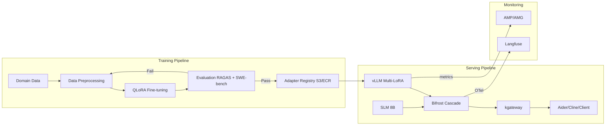
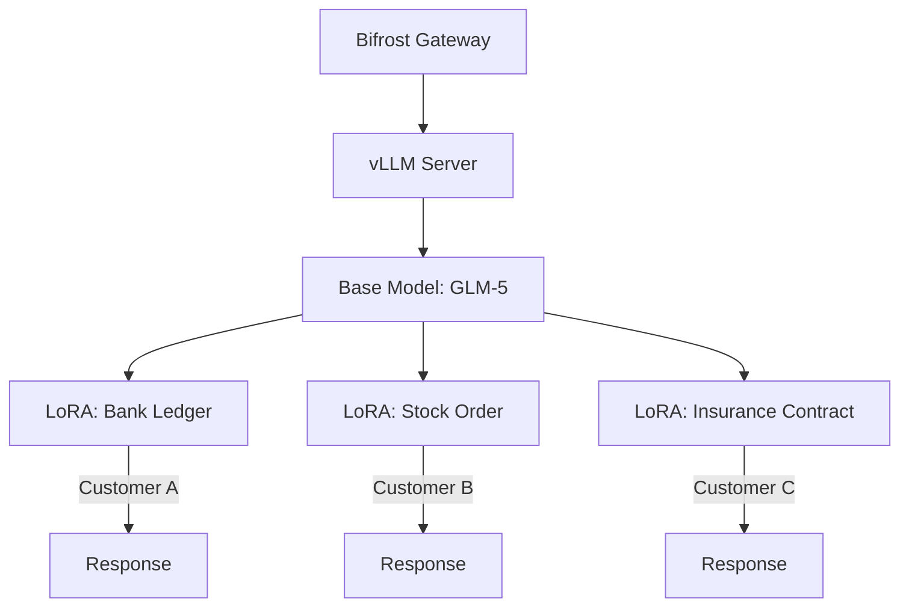
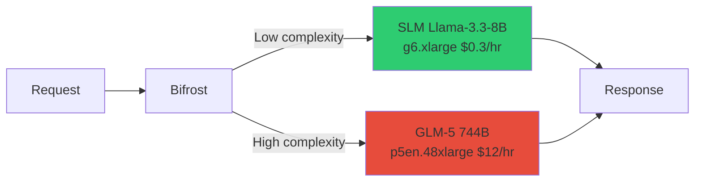
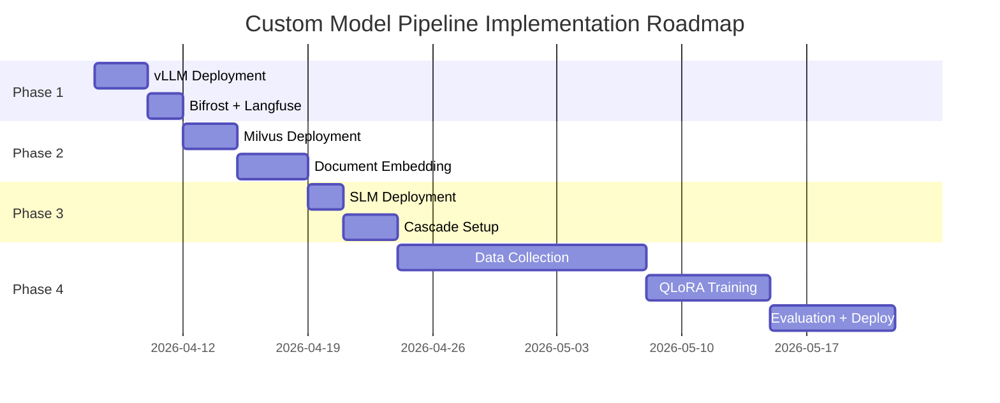

# Custom Model Pipeline Guide

## 1. Overview

### Why You Need a Custom Model Pipeline

SaaS-based AI coding tools (e.g., Kiro, GitHub Copilot) offer a quick start, but they hit fundamental limitations in enterprise environments.

| Constraint | SaaS (Kiro, etc.) | Self-hosted Pipeline |
|-----------|-------------------|---------------------|
| **LoRA Fine-tuning** | Not possible | Domain-specific adapter training |
| **Data Sovereignty** | Code sent externally | Stays within VPC |
| **Model Selection** | Limited to provided models | Free choice of open-source models |
| **Cost Control** | Fixed per-token pricing | 66% savings possible with SLM Cascade |
| **Per-customer Optimization** | Shared general-purpose model | Multi-LoRA for customer-specific specialization |

:::info Core Strategy
The **Base Model + LoRA adapter** pattern serves multiple domain-specialized models simultaneously on a single GPU. Since base model weights are shared, GPU memory efficiency is maximized.
:::

### End-to-End Pipeline Flow



The training pipeline trains domain data with QLoRA, and only adapters that pass evaluation are registered in the registry. The serving pipeline loads multiple adapters simultaneously with vLLM Multi-LoRA and performs cost-optimized routing between SLM/LLM through Bifrost Cascade.

:::tip Related Docs
- [Operations & Governance](../operations-mlops/index.md) - Full operations architecture
- [Custom Model Deployment Guide](./custom-model-deployment.md) - Includes Kiro vs. self-hosted comparison
:::

---

## 2. LoRA Fine-tuning Pipeline

### 2.1 QLoRA GPU Savings

**QLoRA** (Quantized LoRA) trains only the LoRA adapter while keeping the base model quantized to INT4. This dramatically reduces GPU requirements compared to full fine-tuning.

| Model | Full Fine-tuning | LoRA | QLoRA |
|-------|-----------------|------|-------|
| **Llama-3.3-70B** | H100x32 (impractical) | H100x8 | **H100x4** |
| **VRAM** | 280 GB | 80 GB | **40 GB** |
| **Training Time** | - | 5 days | **2-3 days** |
| **Cost** | - | $8,000 | **$2,000** |

:::warning INT4 Quantization Precision
QLoRA keeps base model weights in INT4 during training, so tasks requiring extremely precise numerical computations (e.g., financial calculations) may show slight accuracy differences compared to LoRA (FP16). Always validate in the domain evaluation stage.
:::

### 2.2 Training Data Format

Prepare training data as input-output pairs in JSONL format.

```json
{
  "input": "COBOL: PERFORM CALC-INTEREST USING WS-PRINCIPAL WS-RATE.",
  "output": "Java: @Transactional public BigDecimal calcInterest(BigDecimal principal, BigDecimal rate) { return principal.multiply(rate).setScale(2, RoundingMode.HALF_UP); }"
}
```

**Data Collection Strategy:**

| Source | Transformation Method | Expected Data Volume |
|--------|----------------------|---------------------|
| Legacy COBOL code | Generate COBOL -> Java translation pairs | 10,000+ modules |
| Internal frameworks | Framework pattern -> code pairs | 5,000+ patterns |
| Code review history | Pre-fix -> post-fix pairs | 20,000+ commits |
| Technical docs | Documentation -> implementation code pairs | 3,000+ pages |

:::tip Data Quality Determines Model Quality
**Quality** matters more than quantity. 1,000 high-quality pairs reviewed by senior developers are more effective than 10,000 auto-generated ones. Start with at least 500 reviewed pairs.
:::

### 2.3 Training Frameworks

#### NeMo Framework (NVIDIA)

NVIDIA's official framework optimized for large-scale model training. Natively supports multi-GPU and multi-node distributed training.

```bash
python train_lora.py \
  --config-path=conf \
  --config-name=llama3_70b_lora \
  model.data.train_ds.file_path=cobol_to_java.jsonl \
  model.peft.lora_tuning.adapter_dim=16
```

:::info Key NeMo Configuration Parameters
- `adapter_dim` (rank): 16 is typical. Can increase to 32-64 for complex domains
- `adapter_dropout`: 0.05 recommended (prevents overfitting)
- `target_modules`: attention layers (`q_proj`, `k_proj`, `v_proj`, `o_proj`)
:::

#### Unsloth (2x Faster Training)

An open-source library that doubles LoRA/QLoRA training speed on a single node while reducing memory usage by up to 50%.

```python
from unsloth import FastLanguageModel

model, tokenizer = FastLanguageModel.from_pretrained(
    model_name="meta-llama/Llama-3.3-70B-Instruct",
    max_seq_length=4096,
    load_in_4bit=True,  # QLoRA: INT4 quantization
)

model = FastLanguageModel.get_peft_model(
    model,
    r=16,                # LoRA rank
    lora_alpha=32,       # LoRA scaling factor
    target_modules=["q_proj", "k_proj", "v_proj"],
)

trainer = SFTTrainer(
    model=model,
    train_dataset=dataset,
    max_seq_length=4096,
)
trainer.train()
```

| Framework | Strengths | Best For |
|-----------|----------|---------|
| **NeMo** | Multi-node distributed training, official NVIDIA support | H100 cluster available, large-scale training |
| **Unsloth** | 2x faster training, memory savings, simple API | Single node, rapid prototyping |

### 2.4 Checkpoint Management

Trained LoRA adapters are stored in S3 with version management via MLflow.

```bash
# Adapter storage structure
s3://model-registry/
  └── lora-adapters/
      ├── bank-ledger/
      │   ├── v1.0/adapter_model.safetensors
      │   ├── v1.1/adapter_model.safetensors
      │   └── latest -> v1.1
      ├── stock-order/
      │   └── v1.0/adapter_model.safetensors
      └── insurance-contract/
          └── v1.0/adapter_model.safetensors
```

:::tip MLflow Integration
Recording training metrics (loss, accuracy) alongside adapter paths in MLflow lets you track which dataset and hyperparameter combinations are optimal.
:::

- Reference: [NeMo Framework Checkpoint Management](../model-serving/inference-frameworks/nemo-framework.md)

---

## 3. Multi-LoRA Hot-swap Deployment

### 3.1 Architecture

Leveraging vLLM's Multi-LoRA feature, you can load multiple LoRA adapters simultaneously on top of a single base model to serve customized responses per customer.



:::info Multi-LoRA Memory Efficiency
The base model (e.g., 70B) is loaded into GPU memory only once. Each LoRA adapter at rank 16 is approximately **100-200MB**, so even loading 10 adapters simultaneously adds less than 2GB of additional memory.
:::

### 3.2 vLLM Multi-LoRA Configuration

```bash
vllm serve meta-llama/Llama-3.3-70B-Instruct \
  --enable-lora \
  --lora-modules \
    bank-ledger=/models/lora/bank \
    stock-order=/models/lora/stock \
    insurance-contract=/models/lora/insurance \
  --max-lora-rank 16
```

**Key Options:**

| Option | Description | Default |
|--------|------------|---------|
| `--enable-lora` | Enable Multi-LoRA | `false` |
| `--lora-modules` | Register adapters as `name=path` | - |
| `--max-lora-rank` | Maximum LoRA rank | 16 |
| `--max-loras` | Maximum adapters loaded simultaneously | 1 |
| `--max-cpu-loras` | Number of adapters cached in CPU memory | - |

:::caution Hot-swap Considerations
vLLM loads adapters into GPU memory at request time. Using more adapters than `--max-loras` causes **swap latency** (hundreds of ms). Set `--max-loras` to match the number of frequently used adapters.
:::

### 3.3 Specifying Adapters in Requests

Make requests via the OpenAI-compatible API and specify the LoRA name in `extra_body`.

```python
response = client.chat.completions.create(
    model="meta-llama/Llama-3.3-70B-Instruct",
    messages=[{"role": "user", "content": "Convert this COBOL ledger code to Java"}],
    extra_body={"lora_name": "bank-ledger"}
)
```

### 3.4 Per-customer Routing (Bifrost + X-Customer-Domain Header)

Use kgateway's HTTPRoute for HTTP header-based per-customer LoRA adapter routing.

```yaml
# kgateway HTTPRoute - Per-customer LoRA routing
apiVersion: gateway.networking.k8s.io/v1
kind: HTTPRoute
metadata:
  name: lora-routing
spec:
  rules:
  - matches:
    - headers:
      - name: X-Customer-Domain
        value: bank
    backendRefs:
    - name: vllm-svc
      port: 8000
```

:::tip Routing Flow
Client (Aider/Cline) -> Sets `X-Customer-Domain: bank` header -> kgateway -> Bifrost -> vLLM (auto-maps to `lora_name=bank-ledger`)
:::

### 3.5 Langfuse Per-customer Tracking

Track each customer's inference requests with Langfuse to monitor per-adapter performance.

```python
from langfuse import Langfuse

langfuse = Langfuse()

trace = langfuse.trace(
    name="inference",
    user_id="customer-bank-A",
    metadata={"lora": "bank-ledger", "model": "glm-5"}
)

# Record results after inference
generation = trace.generation(
    name="completion",
    model="glm-5",
    model_parameters={"lora": "bank-ledger"},
    input=messages,
    output=response.choices[0].message.content,
    usage={
        "input": response.usage.prompt_tokens,
        "output": response.usage.completion_tokens,
    },
)
```

---

## 4. SLM Cascade Routing (Cost Optimization)

### 4.1 Cascade Architecture

Sending every request to a large model (LLM) is wasteful. 70% of requests can be handled adequately by a small model (SLM).



### 4.2 Cost Analysis

| | SLM Only | LLM Only | **Cascade (70:30)** |
|---|---|---|---|
| **Monthly Cost** | $500 | $8,900 | **$3,020** |
| **Accuracy** | 70% | 95% | **92%** |
| **Cost Savings** | - | - | **66%** |

:::tip ROI Calculation
Adopting Cascade saves $5,880/month ($70,560/year). Setup takes only 1-2 days, making it **immediately worthwhile**.
:::

### 4.3 Bifrost Cascade Config

```json
{
  "providers": {
    "openai": {
      "keys": [
        {
          "name": "slm",
          "value": "dummy",
          "weight": 0.7,
          "models": ["llama-8b"]
        },
        {
          "name": "llm",
          "value": "dummy",
          "weight": 0.3,
          "models": ["glm5"]
        }
      ],
      "network_config": {
        "base_url": "http://glm5-serving:8000"
      }
    }
  }
}
```

:::caution Bifrost Cascade Limitations
Bifrost's current cascade routing operates at the **provider level** and does not support automatic routing based on request complexity. It works with simple weight-based distribution or fallback conditions (5xx, latency exceeded). Complexity-based routing must be implemented with llm-d or custom logic.
:::

### 4.4 SLM Deployment YAML

```yaml
apiVersion: apps/v1
kind: Deployment
metadata:
  name: vllm-slm
  namespace: agentic-serving
spec:
  replicas: 1
  selector:
    matchLabels:
      app: vllm-slm
  template:
    metadata:
      labels:
        app: vllm-slm
    spec:
      nodeSelector:
        node.kubernetes.io/instance-type: g6.xlarge
      containers:
      - name: vllm
        image: vllm/vllm-openai:latest
        command: ["vllm", "serve"]
        args:
          - "meta-llama/Llama-3.3-8B-Instruct"
          - "--served-model-name=llama-8b"
          - "--tensor-parallel-size=1"
          - "--max-model-len=32768"
          - "--host=0.0.0.0"
          - "--port=8000"
        resources:
          limits:
            nvidia.com/gpu: 1
        ports:
        - containerPort: 8000
          name: http
      tolerations:
      - key: nvidia.com/gpu
        operator: Exists
        effect: NoSchedule
---
apiVersion: v1
kind: Service
metadata:
  name: vllm-slm-svc
  namespace: agentic-serving
spec:
  selector:
    app: vllm-slm
  ports:
  - port: 8000
    targetPort: 8000
    protocol: TCP
```

:::info g6.xlarge Instance Specs
- GPU: 1x NVIDIA L4 (24GB VRAM)
- Cost: ~$0.31/hr (On-Demand), ~$0.09/hr (Spot)
- Sufficient for serving 8B models
:::

- Reference: [Cost Threshold Analysis](./custom-model-deployment.md#cost-threshold-analysis)

---

## 5. Evaluation Pipeline

### 5.1 LoRA Adapter Evaluation Matrix

Trained adapters must pass multiple evaluations before deployment.

| Evaluation Method | Purpose | Tool | Automation |
|------------------|---------|------|-----------|
| **RAGAS** | RAG accuracy (faithfulness, relevancy) | ragas | CI/CD integration |
| **SWE-bench** | Coding quality (real issue resolution) | swe-bench | CI/CD integration |
| **Domain Expert Review** | Business correctness validation | Langfuse Annotation | Manual |
| **Red-teaming** | Security/safety (prompt injection, etc.) | Garak | CI/CD integration |

:::warning Evaluation Thresholds
Minimum criteria for adapter deployment:
- RAGAS Faithfulness: >= 0.85
- SWE-bench Resolved: >= 30%
- Domain expert approval: At least 2 out of 3
- Garak security test: 0 critical findings
:::

### 5.2 LoRA A/B Testing

Before deploying a new adapter version, compare performance using Langfuse tags for A/B testing.

```python
# A/B testing with Langfuse
import random
from langfuse.openai import openai

client = openai.OpenAI(
    base_url="http://vllm:8000/v1",
    api_key="dummy",
)

for test_case in test_dataset:
    lora = random.choice(["bank-ledger-v1", "bank-ledger-v2"])
    response = client.chat.completions.create(
        model="glm-5",
        messages=[{"role": "user", "content": test_case["input"]}],
        extra_body={"lora_name": lora},
        langfuse_tags=[f"lora:{lora}", "ab-test"],
    )
    # Compare per-LoRA performance in Langfuse dashboard
```

**A/B Test Comparison Metrics:**

| Metric | Measurement | Meaning |
|--------|------------|---------|
| Accuracy | SWE-bench / domain tests | Code conversion correctness |
| Latency | Langfuse p50/p95 | Response speed |
| Token Efficiency | output_tokens / input_tokens | Answer conciseness |
| User Satisfaction | Langfuse Annotation Score | Real user evaluation |

- Reference: [RAGAS Evaluation Framework](../operations-mlops/ragas-evaluation.md)
- Reference: [LLMOps Observability Evaluation Pipeline](../operations-mlops/llmops-observability.md)

---

## 6. Phased Implementation Roadmap

| Phase | Timeline | Components | Cost (USD) | Key Actions |
|-------|----------|-----------|-----------|------------|
| **1** | Immediate | Base Model + Steering | $8,900/mo (GPU) | vLLM deployment, Bifrost + Langfuse integration |
| **2** | 1-2 weeks | + VectorRAG | +infra | Milvus deployment, internal document embedding |
| **3** | 2-4 weeks | + SLM Cascade | +$500/mo | SLM deployment, Bifrost cascade configuration |
| **4** | 1-2 months | + LoRA Fine-tuning | +$2K (one-time) | Training data collection -> QLoRA -> Evaluation -> Multi-LoRA deployment |



:::tip Return on Investment (ROI)
Upon completing Phase 4:
- **COBOL to Java migration**: 10,000 modules x 1.5 hours saved = **15,000 hours saved** (~$750K)
- **LoRA training cost**: $2,000 (one-time)
- **Monthly operational savings**: $5,880 (Cascade effect)
- **ROI: 375x**
:::

---

## References

| Resource | Link |
|----------|------|
| LoRA Paper (Hu et al., 2021) | [arxiv.org/abs/2106.09685](https://arxiv.org/abs/2106.09685) |
| QLoRA Paper (Dettmers et al., 2023) | [arxiv.org/abs/2305.14314](https://arxiv.org/abs/2305.14314) |
| vLLM Multi-LoRA | [docs.vllm.ai/en/latest/models/lora.html](https://docs.vllm.ai/en/latest/models/lora.html) |
| Unsloth Fast Training | [github.com/unslothai/unsloth](https://github.com/unslothai/unsloth) |
| NeMo Framework | [docs.nvidia.com/nemo-framework](https://docs.nvidia.com/nemo-framework/user-guide/latest/) |
| RAGAS Evaluation | [docs.ragas.io](https://docs.ragas.io/) |
| Bifrost AI Gateway | [docs.getbifrost.ai](https://docs.getbifrost.ai/) |
| Custom Model Deployment Guide | [custom-model-deployment.md](./custom-model-deployment.md) |
