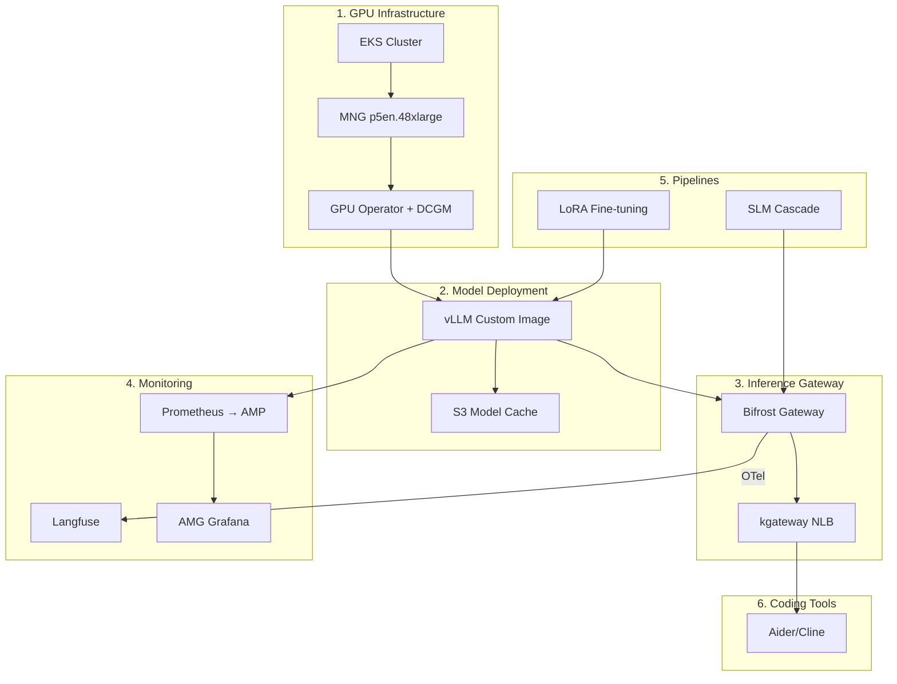
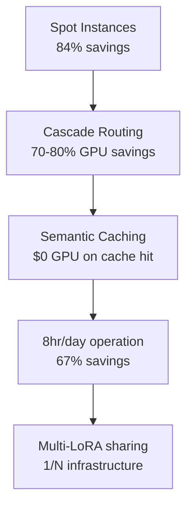

import DocCardList from '@theme/DocCardList';

# Reference Architecture

This section provides **production deployment and configuration guides** for the Agentic AI Platform. Concepts and design principles are covered in the [Documentation section](../design-architecture/agentic-platform-architecture.md); here we focus on specific configurations, YAML manifests, and verification procedures for deploying and operating on actual clusters.

:::info Documentation vs Reference Architecture
| Aspect | Documentation | Reference Architecture |
|--------|--------------|----------------------|
| **Focus** | Architecture concepts, design principles, technology comparison | Production deployment procedures, manifests, verification |
| **Audience** | Decision makers, architects | Platform engineers, DevOps |
| **Deliverables** | Architecture documents, decision records | Deployable YAML, scripts, checklists |
| **Update Cadence** | On design changes | As deployment/operations experience accumulates |
:::

## Architecture Overview

The diagram below shows the 6 areas of the Reference Architecture and the deployment sequence.

## Deployment Sequence

The Reference Architecture is configured in the following order. Each phase depends on the outputs of the previous phase, so **the order must be followed**.

### Phase 1: GPU Infrastructure Setup

Configure the EKS cluster and GPU node groups. Covers differences between Auto Mode and Standard Mode, and considerations when installing GPU Operator.

| Item | Details |
|------|---------|
| EKS Version | 1.32+ (recommended 1.33) |
| Node Group | MNG p5en.48xlarge (Spot) |
| GPU Operator | `devicePlugin.enabled=false` (to prevent Auto Mode conflicts) |
| Monitoring Agents | DCGM Exporter, GFD, Node Status Exporter |

### Phase 2: Model Deployment

Serve large open-source models with vLLM. Covers custom image building, S3 model caching, and considerations for multi-node deployment.

| Item | Details |
|------|---------|
| Serving Engine | vLLM (custom image) |
| Model Cache | S3 → s5cmd → NVMe emptyDir |
| Parallelism | Tensor Parallelism (single node recommended) |
| Validation | OpenAI-compatible API endpoint |

### Phase 3: Inference Gateway

Configure the 2-Tier inference gateway based on kgateway + Bifrost/LiteLLM. Includes Complexity-based Cascade Routing, Semantic Caching, and Guardrails.

| Item | Details |
|------|---------|
| L1 Gateway | kgateway (Gateway API, mTLS, rate limiting) |
| L2-A Gateway | Bifrost (CEL Rules conditional routing, failover) or LiteLLM (native complexity-based routing) |
| Load Balancer | NLB (TCP/TLS) |
| Routing Strategy | Complexity-based Cascade (SLM → LLM), Hybrid Routing, Fallback |

### Phase 4: Monitoring and Observability

Configure the monitoring stack based on Prometheus + AMP + AMG + Langfuse.

| Item | Details |
|------|---------|
| Metrics Collection | Prometheus → AMP (Pod Identity authentication) |
| Dashboards | AMG Grafana (SigV4 `ec2_iam_role`) |
| LLM Observability | Langfuse (OTel traces, cost tracking) |
| GPU Metrics | DCGM Exporter (GPU utilization, VRAM, temperature) |

### Phase 5: Pipelines

Configure LoRA Fine-tuning and Cascade Routing pipelines.

| Item | Details |
|------|---------|
| Fine-tuning | LoRA adapter training → S3 storage → vLLM hot-reload |
| Cascade Routing | SLM (8B) → LLM (744B) cost optimization |
| Evaluation | Ragas + custom benchmarks |

### Phase 6: Coding Tool Integration

Connect AI coding tools such as Aider and Cline to self-hosted models.

| Item | Details |
|------|---------|
| Coding Tools | Aider, Cline, Continue.dev |
| Protocol | OpenAI-compatible API |
| Connection Path | Coding tool → NLB → kgateway → Bifrost/LiteLLM → vLLM |
| Monitoring | Bifrost/LiteLLM OTel → Langfuse (per-request tracing) |

## Documents

<DocCardList />

## Core Design Principles

The Reference Architecture follows these principles.

### 1. Single-Node First

Multi-node distribution significantly increases complexity and failure potential. Prioritize selecting instances with sufficient VRAM (p5en, p6) to **serve with Tensor Parallelism only on a single node**.

### 2. Spot Instance Utilization

GPU Spot instances are 80-85% cheaper than On-Demand. Inference workloads are stateless, so they can immediately restart on new instances upon Spot reclamation. Model weights are rapidly restored from S3.

### 3. Standard Toolchain

Use standard tools from the CNCF and Kubernetes ecosystem wherever possible.

| Area | Standard Tool | Alternative |
|------|--------------|-------------|
| GPU Scheduling | Karpenter / MNG | Auto Mode NodePool |
| Model Serving | vLLM | SGLang, llm-d |
| AI Gateway | Bifrost / LiteLLM | OpenClaw, Helicone |
| Metrics | Prometheus + AMP | CloudWatch |
| LLM Observability | Langfuse | Helicone, LangSmith |
| Distributed Training | LeaderWorkerSet (LWS) | KubeRay |

### 4. Layered Cost Optimization

Cost optimization uses a **layered approach** rather than a single technique.

## Prerequisites

Prerequisites for deploying the Reference Architecture.

### AWS Account and Permissions

- EKS cluster creation permissions (IAM, VPC, EC2, EKS)
- GPU instance Spot quotas (p5en.48xlarge: 192+ vCPUs)
- S3 bucket creation permissions
- AMP/AMG creation permissions (for monitoring setup)
- ECR registry creation permissions (for custom image builds)

### Tools

| Tool | Minimum Version | Purpose |
|------|----------------|---------|
| `eksctl` | 0.200+ | EKS cluster management |
| `kubectl` | 1.32+ | Kubernetes resource management |
| `helm` | 3.16+ | Chart deployment |
| `aws` CLI | 2.22+ | AWS resource management |
| `docker` | 27+ | Custom image builds |
| `s5cmd` | 2.2+ | High-speed S3 sync |

### Networking

- Public subnets: For NLB deployment (when coding tools need external access)
- Private subnets: For GPU nodes, vLLM, Bifrost deployment
- NAT Gateway: For S3, ECR, HuggingFace Hub access
- VPC Endpoints (recommended): S3, ECR, AMP

## Next Steps

For concepts and architecture design, refer to the following documents:

- [Agentic AI Platform Architecture](../design-architecture/agentic-platform-architecture.md) — Overall design principles and component structure
- [GPU Resource Management](../model-serving/gpu-resource-management.md) — Karpenter, KEDA, DRA-based GPU autoscaling
- [vLLM Model Serving](../model-serving/vllm-model-serving.md) — vLLM architecture and optimization techniques
- [Inference Gateway Routing](../design-architecture/inference-gateway-routing.md) — kgateway + AI gateway design

---

:::tip Feedback
This Reference Architecture is continuously updated based on production deployment experience. If you have improvement suggestions or additional use cases, please open an issue.
:::
