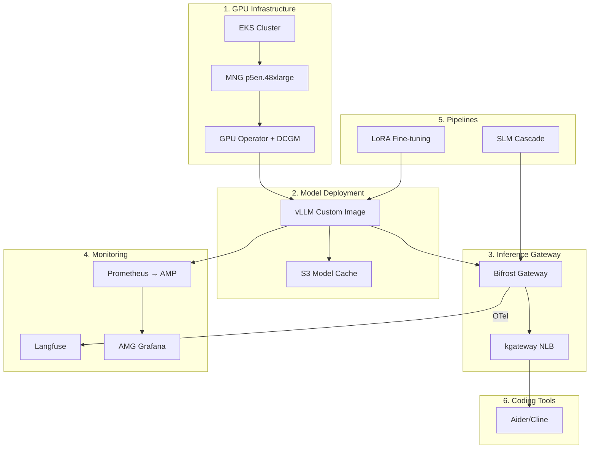
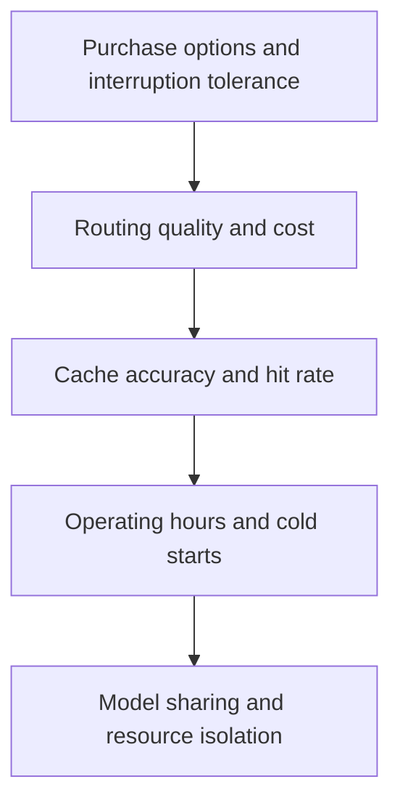

import DocCardList from '@theme/DocCardList';
import Figure from '@site/src/components/Figure';

Implementation guides for platform engineers deploying and operating the Agentic AI Platform. Choose the relevant area, then check its environment requirements and validation steps. Design decisions are covered in the [platform architecture](../design-architecture/foundations/agentic-platform-architecture.md).

:::info Documentation vs Reference Architecture
| Aspect | Documentation | Reference Architecture |
|--------|--------------|----------------------|
| **Focus** | Architecture concepts, design principles, technology comparison | Production deployment procedures, manifests, verification |
| **Audience** | Decision makers, architects | Platform engineers, DevOps |
| **Deliverables** | Architecture documents, decision records | Deployable YAML, scripts, checklists |
| **Update Cadence** | On design changes | As deployment/operations experience accumulates |
:::

## Documents

<DocCardList />

## Prerequisites

Prerequisites for deploying the Reference Architecture.

### AWS Account and Permissions

- EKS cluster creation permissions (IAM, VPC, EC2, EKS)
- GPU instance Spot quotas (p5en.48xlarge: 192+ vCPUs)
- S3 bucket creation permissions
- AMP/AMG creation permissions (for monitoring setup)
- ECR registry creation permissions (for custom image builds)

### Tools

Check the tool versions and cluster compatibility specified by the deployment chapter. Record installed versions with the validation results.

| Tool | Purpose |
|------|---------|
| `eksctl`, `aws` CLI | Cluster and AWS resource management |
| `kubectl`, `helm` | Kubernetes resource and chart management |
| Container build tool | Custom image builds |
| `s5cmd` | S3 model-file transfer used by the examples |

### Networking

- Public subnets: For NLB deployment (when coding tools need external access)
- Private subnets: For GPU nodes, vLLM, Bifrost deployment
- NAT Gateway: For S3, ECR, HuggingFace Hub access
- VPC Endpoints (recommended): S3, ECR, AMP

## Platform Architecture

The diagram shows six runtime layers, three shared planes, the Knowledge Feature Store, and serving/fine-tuning paths. The six deployment areas below describe implementation stages, not matching runtime-layer numbers.

<Figure title="Platform architecture" description="The original architecture diagram shows request processing and shared control areas. Use the source link below to inspect detailed connections on a larger canvas." source={<a href="https://app.diagrams.net/?src=about#Uhttps%3A%2F%2Fraw.githubusercontent.com%2Fdevfloor9%2Fengineering-playbook%2Fmain%2Fstatic%2FAgentic%2520AI%2520Platform(with%2520Ontology%2520and%2520fine%2520tunning%2520feature).drawio">Open source diagram</a>}>
<iframe
  src="https://viewer.diagrams.net/?highlight=0000ff&nav=1&title=Agentic%20AI%20Platform&url=https%3A%2F%2Fraw.githubusercontent.com%2Fdevfloor9%2Fengineering-playbook%2Fmain%2Fstatic%2FAgentic%2520AI%2520Platform(with%2520Ontology%2520and%2520fine%2520tunning%2520feature).drawio"
  width="100%"
  height="480"
  title="Agentic AI Platform Architecture"
  loading="lazy"
/>
</Figure>

:::tip Edit in draw.io
[Open in draw.io](https://app.diagrams.net/?src=about#Uhttps%3A%2F%2Fraw.githubusercontent.com%2Fdevfloor9%2Fengineering-playbook%2Fmain%2Fstatic%2FAgentic%2520AI%2520Platform(with%2520Ontology%2520and%2520fine%2520tunning%2520feature).drawio) — Opens without login for viewing and editing. Use File → Save As to save a copy.
:::

---

## Architecture Overview

The diagram below shows the 6 areas of the Reference Architecture and the deployment sequence.

```mermaid
graph TB
    subgraph "1. GPU Infrastructure"
        EKS[EKS Cluster] --> MNG[MNG p5en.48xlarge]
        MNG --> GPU[GPU Operator + DCGM]
    end
    subgraph "2. Model Deployment"
        GPU --> VLLM[vLLM Custom Image]
        VLLM --> S3[S3 Model Cache]
    end
    subgraph "3. Inference Gateway"
        VLLM --> BF[Bifrost Gateway]
        BF --> KGW[kgateway NLB]
    end
    subgraph "4. Monitoring"
        VLLM --> PROM[Prometheus → AMP]
        BF -->|OTel| LF[Langfuse]
        PROM --> AMG[AMG Grafana]
    end
    subgraph "5. Pipelines"
        LORA[LoRA Fine-tuning] --> VLLM
        SLM[SLM Cascade] --> BF
    end
    subgraph "6. Coding Tools"
        KGW --> AIDER[Aider/Cline]
    end
```

## Deployment Sequence

The Reference Architecture is configured in the following order. Each phase depends on the outputs of the previous phase, so **the order must be followed**.

### Phase 1: GPU Infrastructure Setup

Configure the EKS cluster and GPU node groups. Covers differences between Auto Mode and Standard Mode, and considerations when installing GPU Operator.

| Item | Details |
|------|---------|
| EKS Version | A version supported by the selected deployment guide and add-ons |
| Node Group | MNG or NodePool selected for model memory, SLOs, and available capacity |
| GPU Operator | Check pre-installed AMI components and avoid duplicate ownership |
| Monitoring Agents | DCGM Exporter, GFD, Node Status Exporter |

### Phase 2: Model Deployment

Serve large open-source models with vLLM. Covers custom image building, S3 model caching, and considerations for multi-node deployment.

| Item | Details |
|------|---------|
| Serving Engine | vLLM (custom image) |
| Model Cache | S3 → s5cmd → NVMe emptyDir |
| Parallelism | Tensor Parallelism (single node recommended) |
| Validation | OpenAI-compatible API endpoint |

### Phase 3: Inference Gateway

Configure the 2-Tier inference gateway based on kgateway + Bifrost/LiteLLM. Includes Complexity-based Cascade Routing, Semantic Caching, and Guardrails.

| Item | Details |
|------|---------|
| L1 Gateway | kgateway (Gateway API, mTLS, rate limiting) |
| L2-A Gateway | Bifrost (CEL Rules conditional routing, failover) or LiteLLM (native complexity-based routing) |
| Load Balancer | NLB (TCP/TLS) |
| Routing Strategy | Complexity-based Cascade (SLM → LLM), Hybrid Routing, Fallback |

### Phase 4: Monitoring and Observability

Configure the monitoring stack based on Prometheus + AMP + AMG + Langfuse.

| Item | Details |
|------|---------|
| Metrics Collection | Prometheus → AMP (Pod Identity authentication) |
| Dashboards | AMG Grafana (SigV4 `ec2_iam_role`) |
| LLM Observability | Langfuse (OTel traces, cost tracking) |
| GPU Metrics | DCGM Exporter (GPU utilization, VRAM, temperature) |

### Phase 5: Pipelines

Configure LoRA Fine-tuning and Cascade Routing pipelines.

| Item | Details |
|------|---------|
| Fine-tuning | LoRA adapter training → S3 storage → vLLM hot-reload |
| Cascade Routing | SLM (8B) → LLM (744B) cost optimization |
| Evaluation | Ragas + custom benchmarks |

### Phase 6: Coding Tool Integration

Connect AI coding tools such as Aider and Cline to self-hosted models.

| Item | Details |
|------|---------|
| Coding Tools | Aider, Cline, Continue.dev |
| Protocol | OpenAI-compatible API |
| Connection Path | Coding tool → NLB → kgateway → Bifrost/LiteLLM → vLLM |
| Monitoring | Bifrost/LiteLLM OTel → Langfuse (per-request tracing) |

## Core Design Principles

The Reference Architecture follows these principles.

### 1. Single-Node First

Multi-node distribution significantly increases complexity and failure potential. Prioritize selecting instances with sufficient VRAM (p5en, p6) to **serve with Tensor Parallelism only on a single node**.

### 2. Spot Instance Utilization

Choose Spot according to interruption tolerance as well as price. Inference servers still need image and weight loading, engine initialization, and handling for in-flight requests; recovery is not instantaneous. Validate replacement capacity, ready replicas, drain/retry policy, and actual cold-start time. Review the real-time workload considerations in [EKS Compute and Autoscaling](https://docs.aws.amazon.com/eks/latest/best-practices/aiml-compute.html).

### 3. Standard Toolchain

Use standard tools from the CNCF and Kubernetes ecosystem wherever possible.

| Area | Standard Tool | Alternative |
|------|--------------|-------------|
| GPU Scheduling | Karpenter / MNG | Auto Mode NodePool |
| Model Serving | vLLM | SGLang, llm-d |
| AI Gateway | Bifrost / LiteLLM | OpenClaw, Helicone |
| Metrics | Prometheus + AMP | CloudWatch |
| LLM Observability | Langfuse | Helicone, LangSmith |
| Distributed Training | LeaderWorkerSet (LWS) | KubeRay |

### 4. Layered Cost Optimization

Effects depend on traffic, cache-hit rate, quality criteria, and operating hours. Do not add percentage savings across techniques. Compare total cost per successful request and SLOs under the same conditions.

```mermaid
graph TD
    accTitle: Cost optimization review sequence
    accDescr: Review purchase options, routing, caching, operating hours, and model sharing, measuring cost and quality after each change.
    A[Purchase options and interruption tolerance] --> B[Routing quality and cost]
    B --> C[Cache accuracy and hit rate]
    C --> D[Operating hours and cold starts]
    D --> E[Model sharing and resource isolation]
```

## Next Steps

For concepts and architecture design, refer to the following documents:

- [Agentic AI Platform Architecture](../design-architecture/foundations/agentic-platform-architecture.md) — Overall design principles and component structure
- [GPU Resource Management](../model-serving/gpu-infrastructure/gpu-resource-management.md) — Karpenter, KEDA, DRA-based GPU autoscaling
- [vLLM Model Serving](../model-serving/inference-frameworks/vllm-model-serving.md) — vLLM architecture and optimization techniques
- [Inference Gateway Routing Strategy](../model-serving/inference-routing/routing-strategy.md) — 2-Tier architecture and Cascade/Semantic/Hybrid Routing design

---

:::tip Feedback
This Reference Architecture is continuously updated based on production deployment experience. If you have improvement suggestions or additional use cases, please open an issue.
:::
