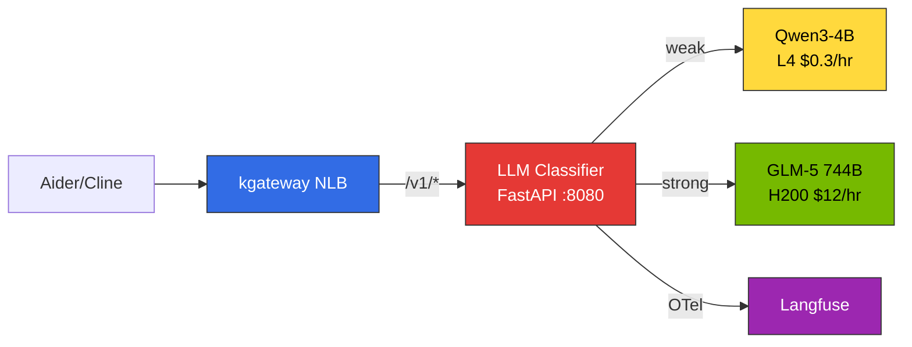

# Inference Gateway Setup Guide

This document covers the **hands-on deployment procedures** for a kgateway + Bifrost-based inference gateway. For architectural concepts and design principles, see [Inference Gateway Routing](../design-architecture/inference-gateway-routing.md).

---

## 1. kgateway Installation and Base Resource Configuration

### 1.1 Gateway API CRD Installation

```bash
# Install Gateway API standard CRDs (v1.2.0+)
kubectl apply -f https://github.com/kubernetes-sigs/gateway-api/releases/download/v1.2.0/standard-install.yaml

# Install with experimental features (HTTPRoute filters, etc.)
kubectl apply -f https://github.com/kubernetes-sigs/gateway-api/releases/download/v1.2.0/experimental-install.yaml
```

### 1.2 kgateway v2.2.2 Helm Installation

```bash
# Add Helm repository
helm repo add kgateway oci://ghcr.io/kgateway-dev/charts
helm repo update

# Create namespace
kubectl create namespace kgateway-system

# Install kgateway v2.2.2
helm install kgateway kgateway/kgateway \
  --namespace kgateway-system \
  --version v2.2.2 \
  --set controller.replicaCount=2 \
  --set controller.resources.requests.cpu=500m \
  --set controller.resources.requests.memory=512Mi \
  --set controller.resources.limits.cpu=1000m \
  --set controller.resources.limits.memory=1Gi \
  --set metrics.enabled=true \
  --set metrics.port=9091
```

### 1.3 GatewayClass Definition

```yaml
apiVersion: gateway.networking.k8s.io/v1
kind: GatewayClass
metadata:
  name: kgateway
spec:
  controllerName: kgateway.dev/kgateway-controller
  description: "Kgateway for AI inference routing"
  parametersRef:
    group: kgateway.dev
    kind: GatewayClassConfig
    name: kgateway-config
---
apiVersion: kgateway.dev/v1alpha1
kind: GatewayClassConfig
metadata:
  name: kgateway-config
spec:
  proxy:
    replicas: 3
    resources:
      requests:
        cpu: "1"
        memory: "2Gi"
      limits:
        cpu: "2"
        memory: "4Gi"
  connectionSettings:
    maxConnections: 10000
    connectTimeout: 10s
    idleTimeout: 60s
```

### 1.4 Gateway Resource (Unified NLB)

```yaml
apiVersion: gateway.networking.k8s.io/v1
kind: Gateway
metadata:
  name: unified-gateway
  namespace: ai-gateway
  annotations:
    service.beta.kubernetes.io/aws-load-balancer-type: "external"
    service.beta.kubernetes.io/aws-load-balancer-nlb-target-type: "ip"
    service.beta.kubernetes.io/aws-load-balancer-scheme: "internet-facing"
spec:
  gatewayClassName: kgateway
  listeners:
    - name: http
      protocol: HTTP
      port: 80
      allowedRoutes:
        namespaces:
          from: All
```

### 1.5 ReferenceGrant (Cross-namespace Access)

A ReferenceGrant is required when an HTTPRoute needs to reference a Service in a different namespace.

```yaml
# Allow access to Services in the ai-inference namespace
apiVersion: gateway.networking.k8s.io/v1beta1
kind: ReferenceGrant
metadata:
  name: allow-gateway-to-services
  namespace: ai-inference
spec:
  from:
    - group: gateway.networking.k8s.io
      kind: HTTPRoute
      namespace: ai-gateway
  to:
    - group: ""
      kind: Service
---
# Allow access to Langfuse Service in the observability namespace
apiVersion: gateway.networking.k8s.io/v1beta1
kind: ReferenceGrant
metadata:
  name: allow-gateway-to-langfuse
  namespace: observability
spec:
  from:
    - group: gateway.networking.k8s.io
      kind: HTTPRoute
      namespace: ai-gateway
  to:
    - group: ""
      kind: Service
```

---

## 2. HTTPRoute Configuration

Route multiple services via path-based routing behind a single NLB endpoint.

### 2.1 Direct vLLM Routing

A pattern that routes directly from kgateway to vLLM without Bifrost. Simplest when using a single model.

```yaml
apiVersion: gateway.networking.k8s.io/v1
kind: HTTPRoute
metadata:
  name: vllm-route
  namespace: ai-inference
spec:
  parentRefs:
    - name: unified-gateway
      namespace: ai-gateway
  hostnames:
    - "api.example.com"
  rules:
    - matches:
        - path:
            type: PathPrefix
            value: /v1/
      backendRefs:
        - name: vllm-service
          port: 8000
```

### 2.2 Bifrost-proxied Routing

Use this when you need multi-provider integration, Cascade Routing, or OTel monitoring via Bifrost.

```yaml
apiVersion: gateway.networking.k8s.io/v1
kind: HTTPRoute
metadata:
  name: bifrost-route
  namespace: ai-gateway
spec:
  parentRefs:
    - name: unified-gateway
      namespace: ai-gateway
  hostnames:
    - "api.example.com"
  rules:
    - matches:
        - path:
            type: PathPrefix
            value: /v1/
      backendRefs:
        - name: bifrost-service
          namespace: ai-external
          port: 8080
```

### 2.3 Langfuse Sub-path Routing (URLRewrite)

Langfuse (Next.js) serves from `/`, so a URLRewrite is required to access it via the `/langfuse` prefix.

```yaml
apiVersion: gateway.networking.k8s.io/v1
kind: HTTPRoute
metadata:
  name: langfuse-route
  namespace: observability
spec:
  parentRefs:
    - name: unified-gateway
      namespace: ai-gateway
  hostnames:
    - "api.example.com"
  rules:
    # /langfuse -> strip / prefix
    - matches:
        - path:
            type: PathPrefix
            value: /langfuse/
      filters:
        - type: URLRewrite
          urlRewrite:
            path:
              type: ReplacePrefixMatch
              replacePrefixMatch: /
      backendRefs:
        - name: langfuse-web
          port: 3000
    # Next.js static assets
    - matches:
        - path:
            type: PathPrefix
            value: /_next
      backendRefs:
        - name: langfuse-web
          port: 3000
    # Langfuse auth API
    - matches:
        - path:
            type: PathPrefix
            value: /api/auth
      backendRefs:
        - name: langfuse-web
          port: 3000
    # Langfuse public API
    - matches:
        - path:
            type: PathPrefix
            value: /api/public
      backendRefs:
        - name: langfuse-web
          port: 3000
    # Favicon and other static files
    - matches:
        - path:
            type: PathPrefix
            value: /icon.svg
      backendRefs:
        - name: langfuse-web
          port: 3000
```

### 2.4 OTel URLRewrite (Bifrost -> Langfuse)

The Bifrost OTel plugin uses only the base path from `collector_url`, so kgateway transforms it into the full OTLP path.

```yaml
apiVersion: gateway.networking.k8s.io/v1
kind: HTTPRoute
metadata:
  name: langfuse-otel-route
  namespace: observability
spec:
  parentRefs:
    - name: unified-gateway
      namespace: ai-gateway
  hostnames:
    - "api.example.com"
  rules:
    - matches:
        - path:
            type: PathPrefix
            value: /api/public/otel
      filters:
        - type: URLRewrite
          urlRewrite:
            path:
              type: ReplacePrefixMatch
              replacePrefixMatch: /api/public/otel/v1/traces
      backendRefs:
        - name: langfuse-web
          port: 3000
```

### 2.5 Routing Endpoint Structure Summary

```
http://<NLB_ENDPOINT>/v1/*           -> vLLM or Bifrost (Inference API)
http://<NLB_ENDPOINT>/langfuse/*     -> Langfuse (Observability UI)
http://<NLB_ENDPOINT>/_next/*        -> Langfuse (Static Assets)
http://<NLB_ENDPOINT>/api/public/*   -> Langfuse (API + OTel)
https://<AMG_ENDPOINT>               -> Grafana (Managed separately)
```

:::tip Changes Applied Instantly
Gateway API CRD-based routing is applied in real-time without Pod restarts. When you modify HTTPRoute or Gateway resources, the kgateway controller automatically detects and applies changes immediately.
:::

---

## 3. Bifrost Gateway Mode Configuration

### 3.1 config.json Structure

Bifrost Gateway Mode uses a declarative config.json. This format has been verified to work correctly.

```json
{
  "$schema": "https://www.getbifrost.ai/schema",
  "providers": {
    "openai": {
      "keys": [
        {
          "name": "local-vllm",
          "value": "dummy",
          "weight": 1.0,
          "models": ["glm-5"]
        }
      ],
      "network_config": {
        "base_url": "http://glm5-serving.agentic-serving.svc.cluster.local:8000"
      }
    }
  },
  "plugins": [
    {
      "enabled": true,
      "name": "otel",
      "config": {
        "service_name": "bifrost",
        "trace_type": "otel",
        "protocol": "http",
        "collector_url": "http://langfuse-web.langfuse.svc.cluster.local:3000/api/public/otel/v1/traces",
        "headers": {
          "Authorization": "Basic <BASE64(pk:sk)>",
          "x-langfuse-ingestion-version": "4"
        }
      }
    }
  ]
}
```

### 3.2 Key Configuration Items

#### providers (Map Structure)

- `providers` is a **map** (not an array). Keys are Bifrost built-in provider names (`openai`, `anthropic`, etc.)
- `keys` is an **array**, with `models` restricting available models
- Request model names use the `provider/model` format (e.g., `openai/glm-5`)

:::danger providers Format Warning
Writing `"providers": [...]` (array) will cause settings to not appear in the UI. Always use `"providers": {...}` (map).
:::

#### OTel Plugin

- `trace_type` must be `"otel"` (using `"genai_extension"` prevents traces from reaching Langfuse)
- `collector_url` must be the full Langfuse OTLP path: `/api/public/otel/v1/traces`
- Authorization header: `Basic <BASE64(public_key:secret_key)>` format

---

## 4. Bifrost K8s Deployment Pattern (PVC + initContainer)

Bifrost manages config.json + SQLite under the `-app-dir` path. Use PVC and initContainer for declarative deployment.

### 4.1 PVC + ConfigMap + Deployment

```yaml
apiVersion: v1
kind: PersistentVolumeClaim
metadata:
  name: bifrost-data
  namespace: ai-external
spec:
  accessModes:
    - ReadWriteOnce
  resources:
    requests:
      storage: 1Gi
---
apiVersion: v1
kind: ConfigMap
metadata:
  name: bifrost-gateway-config
  namespace: ai-external
data:
  config.json: |
    {
      "$schema": "https://www.getbifrost.ai/schema",
      "providers": {
        "openai": {
          "keys": [{"name": "local-vllm", "value": "dummy", "weight": 1.0, "models": ["glm-5"]}],
          "network_config": {"base_url": "http://vllm-service:8000"}
        }
      },
      "plugins": [{
        "enabled": true,
        "name": "otel",
        "config": {
          "service_name": "bifrost",
          "trace_type": "otel",
          "protocol": "http",
          "collector_url": "http://langfuse-web.langfuse.svc.cluster.local:3000/api/public/otel/v1/traces",
          "headers": {
            "Authorization": "Basic <BASE64(pk:sk)>",
            "x-langfuse-ingestion-version": "4"
          }
        }
      }]
    }
---
apiVersion: apps/v1
kind: Deployment
metadata:
  name: bifrost
  namespace: ai-external
spec:
  replicas: 3
  selector:
    matchLabels:
      app: bifrost
  template:
    metadata:
      labels:
        app: bifrost
    spec:
      securityContext:
        fsGroup: 1000
      initContainers:
      - name: setup
        image: busybox
        command:
          - sh
          - -c
          - |
            cp /config/config.json /app/data/config.json
            chown 1000:1000 /app/data/config.json
        volumeMounts:
        - name: bifrost-data
          mountPath: /app/data
        - name: gateway-config
          mountPath: /config
      containers:
      - name: bifrost
        image: bifrost/bifrost:v2.0.0
        args: ["-app-dir", "/app/data"]
        ports:
        - containerPort: 8080
          name: http
        volumeMounts:
        - name: bifrost-data
          mountPath: /app/data
        resources:
          requests:
            cpu: 500m
            memory: 512Mi
          limits:
            cpu: 1000m
            memory: 1Gi
      volumes:
      - name: bifrost-data
        persistentVolumeClaim:
          claimName: bifrost-data
      - name: gateway-config
        configMap:
          name: bifrost-gateway-config
---
apiVersion: v1
kind: Service
metadata:
  name: bifrost-service
  namespace: ai-external
spec:
  selector:
    app: bifrost
  ports:
    - port: 8080
      targetPort: 8080
  type: ClusterIP
```

:::warning fsGroup: 1000 Required
The Bifrost container runs as UID 1000. Without `securityContext.fsGroup: 1000`, PVC write permission errors will occur.
:::

---

## 5. Bifrost provider/model Format and IDE Compatibility

Bifrost uses the `provider/model` format for model names.

### 5.1 Correct Model Name Format

```
openai/gpt-4o           (provider/model)
anthropic/claude-sonnet-4
openai/glm-5            (self-hosted vLLM also uses openai provider)

gpt-4o                   (missing provider — error)
openai-gpt-4o            (hyphen instead of slash — error)
```

### 5.2 IDE/Coding Tool Compatibility

| Tool | model Field Handling | Bifrost Compatible | Configuration |
|------|---------------------|-------------------|--------------|
| **Cline** | Passes as-is | ✅ | Model ID: `openai/glm-5` |
| **Continue.dev** | Passes as-is | ✅ | model: `openai/glm-5` |
| **Aider** | Strips LiteLLM prefix | ⚠️ Double-prefix needed | `openai/openai/glm-5` |
| **Cursor** | Rejects own validation | ❌ | Rejects `/` in model name |

### 5.3 Aider Connection Example

```bash
# Double-prefix trick: LiteLLM strips the first openai/ -> Bifrost receives openai/glm-5
aider --model openai/openai/glm-5 \
  --openai-api-base http://<NLB_ENDPOINT>/v1 \
  --openai-api-key dummy \
  --no-auto-commits
```

### 5.4 Continue.dev Configuration Example

```json
{
  "models": [
    {
      "title": "GLM-5 (Bifrost)",
      "provider": "openai",
      "model": "openai/glm-5",
      "apiBase": "http://<NLB_ENDPOINT>/v1",
      "apiKey": "dummy"
    }
  ]
}
```

### 5.5 Cline Configuration Example

Settings -> API Provider -> OpenAI Compatible
- Base URL: `http://<NLB_ENDPOINT>/v1`
- Model: `openai/glm-5`
- API Key: `dummy`

### 5.6 Python Client Example

```python
from openai import OpenAI

client = OpenAI(
    base_url="http://<NLB_ENDPOINT>/v1",
    api_key="dummy"
)

response = client.chat.completions.create(
    model="openai/glm-5",  # provider/model format required
    messages=[{"role": "user", "content": "Hello"}]
)
```

:::info Endpoint De-identification
In production environments, map the NLB endpoint to a domain name (e.g., `api.your-company.com`). Do not expose direct IP addresses or AWS-generated DNS names.
:::

---

## 6. SQLite Re-initialization Procedure (When config.json Changes)

Bifrost reads config.json once at startup and stores it in SQLite. After that it uses SQLite, so when config.json changes, the SQLite database must be regenerated.

### Change Procedure

```bash
# 1. Update ConfigMap
kubectl apply -f bifrost-gateway-config.yaml

# 2. Delete Pods (PVC data's config.db auto-initializes)
kubectl delete pod -l app=bifrost -n ai-external

# 3. initContainer copies new config.json -> Bifrost regenerates SQLite
kubectl get pods -n ai-external -l app=bifrost -w
```

:::caution Difference from kgateway CRD Changes
kgateway **automatically applies** CRD changes (no Pod restart needed), but Bifrost **requires Pod restart** when ConfigMap changes. Be sure to understand this difference during operations.
:::

---

## 7. Troubleshooting

### 7.1 404 Not Found

**Symptom**: 404 when requesting `http://<NLB_ENDPOINT>/v1/chat/completions`

**Diagnosis**:
```bash
# Check HTTPRoute status
kubectl get httproute -A

# Check Gateway status
kubectl get gateway -n ai-gateway -o yaml

# Check kgateway logs
kubectl logs -n kgateway-system -l app=kgateway --tail=50
```

**Common causes**:
- HTTPRoute's `parentRefs.namespace` does not match the Gateway namespace
- Missing ReferenceGrant preventing cross-namespace access
- `hostnames` field does not match the request's Host header

### 7.2 Bifrost provider/model Error

**Symptom**: `Provider not found` or `Model not found` error

**Causes and Solutions**:

| Error Message | Cause | Solution |
|--------------|-------|---------|
| `Provider not found: vllm` | Not using built-in provider name | Use built-in names like `openai`, `anthropic` |
| `Model not found: glm-5` | Missing provider prefix | Send as `openai/glm-5` in requests |
| Settings not shown in UI | providers written as array | `"providers": [...]` -> `"providers": {...}` (map) |
| OTel traces not arriving | trace_type error | `"genai_extension"` -> `"otel"` |
| Langfuse 403/401 | Authorization format error | Verify `Basic <BASE64(public_key:secret_key)>` |

### 7.3 Bifrost Model Name Normalization Issue

**Symptom**: Requested `openai/glm-5` but vLLM returns `model not found`

**Cause**: Bifrost normalizes model names by removing hyphens (`glm-5` -> `glm5`).

**Solution**: Match vLLM's `--served-model-name` to the normalized name.

```bash
# When starting the vLLM server
vllm serve zai-org/GLM-5-FP8 \
  --served-model-name=glm5 \  # Name without hyphens
  --tensor-parallel-size=8
```

:::info Bifrost Model Alias Feature
A model alias feature has been requested in Bifrost as [#1058](https://github.com/maximhq/bifrost/issues/1058), but as of April 2026 it has not been implemented.
:::

### 7.4 Langfuse Sub-path 404

**Symptom**: Page loads at `/langfuse/` but static assets like CSS/JS return 404

**Cause**: Next.js static asset paths (`/_next/*`) are not routed to Langfuse

**Solution**: Add routes for `/_next`, `/api/auth`, `/api/public`, and `/icon.svg` to Langfuse as shown in Section 2.3

### 7.5 OTel Traces Not Reaching Langfuse

**Diagnosis steps**:

```bash
# 1. Check Bifrost logs for OTel sending
kubectl logs -l app=bifrost -n ai-external --tail=30 | grep -i otel

# 2. Check Langfuse logs for OTLP reception
kubectl logs -l app=langfuse-web -n langfuse --tail=30 | grep -i otlp

# 3. Verify kgateway URLRewrite operation
kubectl logs -n kgateway-system -l app=kgateway --tail=30 | grep "otel"
```

**Checklist**:

| Check Item | Correct Value |
|-----------|--------------|
| `trace_type` | `"otel"` (not `"genai_extension"`) |
| `collector_url` | `http://langfuse-web.langfuse.svc.cluster.local:3000/api/public/otel/v1/traces` |
| Authorization | `Basic <BASE64(pk:sk)>` |
| kgateway URLRewrite | `/api/public/otel` -> `/api/public/otel/v1/traces` |
| ReferenceGrant | Created in observability namespace |

:::tip Bifrost OTel collector_url Path
The Bifrost OTel plugin uses the path specified in `collector_url` as-is. When sending directly to Langfuse within the cluster (without going through kgateway), you must include the full path (`/api/public/otel/v1/traces`) in `collector_url`.

When going through kgateway, the URLRewrite handles path transformation.
:::

---

## 8. LLM Classifier Deployment {#llm-classifier-deployment}

### 8.1 Architecture Overview

The LLM Classifier is a **lightweight Python FastAPI-based router** that sits behind kgateway. It receives OpenAI-compatible requests from clients (Aider, Cline, etc.), analyzes prompt content, and automatically proxies to either a weak (SLM) or strong (LLM) backend.



**Key features:**
- Clients request with `model: "auto"` (or any model name) -- they are unaware of model selection
- Classification based on keyword matching + token length + conversation turn count
- Direct trace submission to Langfuse via OTel SDK
- Container image under 50MB (FastAPI + httpx)

### 8.2 Classification Logic (extproc_http.py)

```python
"""LLM Classifier -- Automatic model routing based on prompt content"""
import os, httpx
from fastapi import FastAPI, Request
from fastapi.responses import StreamingResponse

app = FastAPI()

# --- Classification settings ---
STRONG_KEYWORDS = [
    "refactor", "architect", "design", "analyze", "optimize", "debug",
    "migration", "complex", "performance", "security", "review",
]
TOKEN_THRESHOLD = 500
TURN_THRESHOLD = 5

# --- Backend settings ---
WEAK_URL = os.getenv("WEAK_BACKEND", "http://qwen3-serving:8000")
STRONG_URL = os.getenv("STRONG_BACKEND", "http://glm5-serving:8000")

def classify(messages: list[dict]) -> str:
    """Analyze prompt content -> decide weak / strong"""
    content = " ".join(
        m.get("content", "") for m in messages if m.get("content")
    )
    lower = content.lower()
    # 1. Keyword matching
    if any(kw in lower for kw in STRONG_KEYWORDS):
        return "strong"
    # 2. Input length
    if len(content) > TOKEN_THRESHOLD:
        return "strong"
    # 3. Conversation turn count
    if len(messages) > TURN_THRESHOLD:
        return "strong"
    return "weak"

@app.api_route("/v1/{path:path}", methods=["POST"])
async def proxy(path: str, request: Request):
    body = await request.json()
    messages = body.get("messages", [])
    tier = classify(messages)
    backend = STRONG_URL if tier == "strong" else WEAK_URL
    target = f"{backend}/v1/{path}"

    async with httpx.AsyncClient(timeout=300) as client:
        if body.get("stream"):
            req = client.build_request("POST", target, json=body)
            resp = await client.send(req, stream=True)
            return StreamingResponse(
                resp.aiter_bytes(),
                status_code=resp.status_code,
                headers=dict(resp.headers),
            )
        resp = await client.post(target, json=body)
        return resp.json()
```

:::tip Langfuse OTel Integration
Adding the OpenTelemetry SDK to the above code lets you record classification decisions and backend response times directly to Langfuse. Install `opentelemetry-sdk` and `opentelemetry-exporter-otlp` packages and set `OTEL_EXPORTER_OTLP_ENDPOINT` to the Langfuse OTLP endpoint.
:::

### 8.3 Dockerfile

```dockerfile
FROM python:3.11-slim
RUN pip install --no-cache-dir fastapi uvicorn httpx
COPY extproc_http.py /app/
WORKDIR /app
CMD ["uvicorn", "extproc_http:app", "--host", "0.0.0.0", "--port", "8080", "--workers", "2"]
```

```bash
# Build and push to ECR
docker buildx build --platform linux/amd64 \
  -t <ACCOUNT_ID>.dkr.ecr.us-east-2.amazonaws.com/llm-classifier:latest \
  --push .
```

### 8.4 K8s Deployment + Service

```yaml
apiVersion: apps/v1
kind: Deployment
metadata:
  name: llm-classifier
  namespace: ai-inference
spec:
  replicas: 2
  selector:
    matchLabels:
      app: llm-classifier
  template:
    metadata:
      labels:
        app: llm-classifier
    spec:
      containers:
      - name: classifier
        image: <ACCOUNT_ID>.dkr.ecr.us-east-2.amazonaws.com/llm-classifier:latest
        ports:
        - containerPort: 8080
          name: http
        env:
        - name: WEAK_BACKEND
          value: "http://qwen3-serving.ai-inference.svc.cluster.local:8000"
        - name: STRONG_BACKEND
          value: "http://glm5-serving.ai-inference.svc.cluster.local:8000"
        resources:
          requests:
            cpu: 250m
            memory: 256Mi
          limits:
            cpu: 500m
            memory: 512Mi
        readinessProbe:
          httpGet:
            path: /docs
            port: 8080
          initialDelaySeconds: 5
          periodSeconds: 10
        livenessProbe:
          httpGet:
            path: /docs
            port: 8080
          initialDelaySeconds: 10
          periodSeconds: 30
---
apiVersion: v1
kind: Service
metadata:
  name: llm-classifier
  namespace: ai-inference
spec:
  selector:
    app: llm-classifier
  ports:
  - name: http
    port: 8080
    targetPort: 8080
  type: ClusterIP
```

### 8.5 kgateway HTTPRoute Configuration

Route the `/v1/*` path from kgateway to the LLM Classifier. Use this instead of direct vLLM routing (Section 2.1) or Bifrost-proxied routing (Section 2.2).

```yaml
apiVersion: gateway.networking.k8s.io/v1
kind: HTTPRoute
metadata:
  name: llm-classifier-route
  namespace: ai-inference
spec:
  parentRefs:
    - name: unified-gateway
      namespace: ai-gateway
  rules:
    - matches:
        - path:
            type: PathPrefix
            value: /v1/
      backendRefs:
        - name: llm-classifier
          port: 8080
      timeouts:
        request: 300s
        backendRequest: 300s
```

:::caution Timeout Configuration
LLM inference can take tens of seconds. Set `timeouts.request` and `backendRequest` generously (minimum 120s for GLM-5 744B, recommended 300s).
:::

### 8.6 Aider/Cline Connection

With the LLM Classifier, **all clients connect to a single endpoint**. The model name can be any arbitrary value (the Classifier ignores it and classifies based on the prompt).

#### Aider

```bash
# LLM Classifier auto-routing -- no double-prefix needed
OPENAI_API_BASE="http://<NLB_ENDPOINT>/v1" \
OPENAI_API_KEY="dummy" \
aider --model openai/auto
```

#### Cline

Settings -> API Provider -> OpenAI Compatible
- Base URL: `http://<NLB_ENDPOINT>/v1`
- Model: `auto`
- API Key: `dummy`

#### Python Client

```python
from openai import OpenAI

client = OpenAI(
    base_url="http://<NLB_ENDPOINT>/v1",
    api_key="dummy"
)

# Simple request -> Qwen3-4B (automatic)
response = client.chat.completions.create(
    model="auto",
    messages=[{"role": "user", "content": "Hello"}]
)

# Complex request -> GLM-5 744B (automatic)
response = client.chat.completions.create(
    model="auto",
    messages=[{"role": "user", "content": "Refactor this code and analyze the architecture"}]
)
```

:::info Advantages over Bifrost
The `provider/model` format (`openai/glm-5`) and Aider double-prefix trick (`openai/openai/glm-5`) required when going through Bifrost are **completely unnecessary**. All clients simply connect with `model: "auto"`.
:::

### 8.7 Routing Endpoint Structure (with LLM Classifier)

```
http://<NLB_ENDPOINT>/v1/*           -> LLM Classifier -> Qwen3-4B or GLM-5 (auto-routed)
http://<NLB_ENDPOINT>/langfuse/*     -> Langfuse (Observability UI)
http://<NLB_ENDPOINT>/_next/*        -> Langfuse (Static Assets)
http://<NLB_ENDPOINT>/api/public/*   -> Langfuse (API + OTel)
https://<AMG_ENDPOINT>               -> Grafana (Managed separately)
```

---

## References

- [Inference Gateway Routing](../design-architecture/inference-gateway-routing.md) - Detailed kgateway architecture and routing strategies
- [Kubernetes Gateway API Official Documentation](https://gateway-api.sigs.k8s.io/)
- [kgateway Official Documentation](https://kgateway.dev/docs/)
- [Bifrost Official Documentation](https://bifrost.dev/docs)
