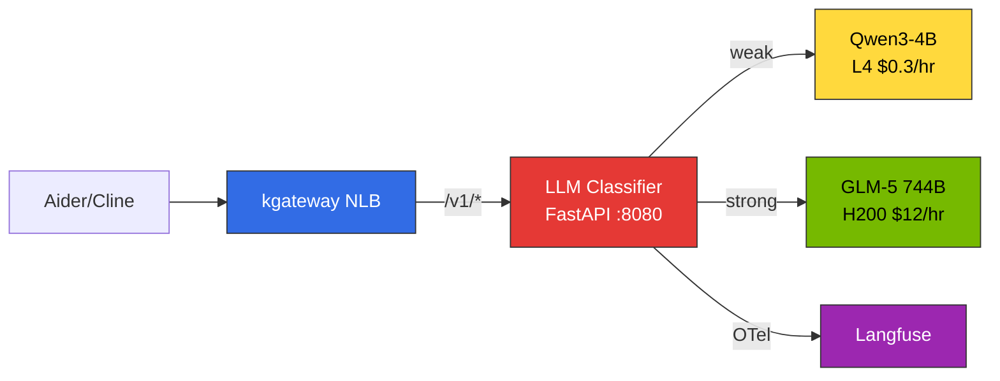
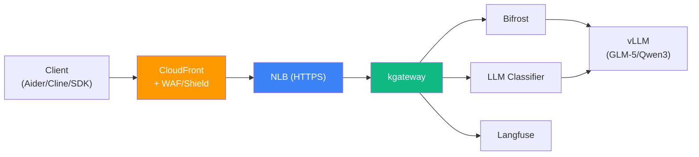
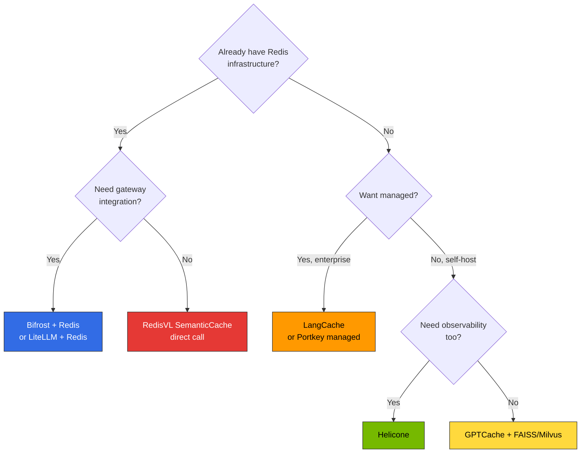

# Advanced Features

This document covers advanced configurations for production environments. Add prompt-based automatic routing (LLM Classifier), security layer (CloudFront + WAF/Shield), and cost optimization (Semantic Caching) to complete a full inference pipeline.

:::tip Time Required
**Learning**: 45 min | **Deployment**: 60-90 min
:::

:::info Prerequisites
The components in this document assume [Basic Deployment](./basic-deployment.md) is complete. Verify that kgateway, HTTPRoute, and Bifrost are operational first.
:::

---

## 1. LLM Classifier Deployment {#llm-classifier-deployment}

### 1.1 Architecture Overview

LLM Classifier is a **Python FastAPI-based lightweight router** that operates behind kgateway. It receives OpenAI-compatible requests from clients (Aider, Cline, etc.), analyzes prompt content, and automatically proxies to weak (SLM) or strong (LLM) backends.



**Key Features:**
- Clients request with `model: "auto"` (or any model name) — unaware of model selection
- Classification based on keyword matching + token length + conversation turn count
- Direct trace transmission via Langfuse OTel SDK
- Container image under 50MB (FastAPI + httpx)

### 1.2 Classification Logic (extproc_http.py)

```python
"""LLM Classifier — Prompt-based automatic model routing"""
import os, httpx
from fastapi import FastAPI, Request
from fastapi.responses import StreamingResponse

app = FastAPI()

# --- Classification Settings ---
STRONG_KEYWORDS = [
    "refactor", "architect", "design", "analyze", "optimize", "debug",
    "migration", "complex", "performance", "security", "review",
]
TOKEN_THRESHOLD = 500
TURN_THRESHOLD = 5

# --- Backend Settings ---
WEAK_URL = os.getenv("WEAK_BACKEND", "http://qwen3-serving:8000")
STRONG_URL = os.getenv("STRONG_BACKEND", "http://glm5-serving:8000")

def classify(messages: list[dict]) -> str:
    """Analyze prompt content → decide weak / strong"""
    content = " ".join(
        m.get("content", "") for m in messages if m.get("content")
    )
    lower = content.lower()
    # 1. Keyword matching
    if any(kw in lower for kw in STRONG_KEYWORDS):
        return "strong"
    # 2. Input length
    if len(content) > TOKEN_THRESHOLD:
        return "strong"
    # 3. Conversation turn count
    if len(messages) > TURN_THRESHOLD:
        return "strong"
    return "weak"

@app.api_route("/v1/{path:path}", methods=["POST"])
async def proxy(path: str, request: Request):
    body = await request.json()
    messages = body.get("messages", [])
    tier = classify(messages)
    backend = STRONG_URL if tier == "strong" else WEAK_URL
    target = f"{backend}/v1/{path}"

    async with httpx.AsyncClient(timeout=300) as client:
        if body.get("stream"):
            req = client.build_request("POST", target, json=body)
            resp = await client.send(req, stream=True)
            return StreamingResponse(
                resp.aiter_bytes(),
                status_code=resp.status_code,
                headers=dict(resp.headers),
            )
        resp = await client.post(target, json=body)
        return resp.json()
```

:::tip Langfuse OTel Integration
Adding OpenTelemetry SDK to the above code allows direct recording of classification decisions + backend response times to Langfuse. Install `opentelemetry-sdk`, `opentelemetry-exporter-otlp` packages and set `OTEL_EXPORTER_OTLP_ENDPOINT` to Langfuse OTLP endpoint.
:::

### 1.3 Dockerfile

```dockerfile
FROM python:3.11-slim
RUN pip install --no-cache-dir fastapi uvicorn httpx
COPY extproc_http.py /app/
WORKDIR /app
CMD ["uvicorn", "extproc_http:app", "--host", "0.0.0.0", "--port", "8080", "--workers", "2"]
```

```bash
# Build and push to ECR
docker buildx build --platform linux/amd64 \
  -t <ACCOUNT_ID>.dkr.ecr.us-east-2.amazonaws.com/llm-classifier:latest \
  --push .
```

### 1.4 K8s Deployment + Service

```yaml
apiVersion: apps/v1
kind: Deployment
metadata:
  name: llm-classifier
  namespace: ai-inference
spec:
  replicas: 2
  selector:
    matchLabels:
      app: llm-classifier
  template:
    metadata:
      labels:
        app: llm-classifier
    spec:
      containers:
      - name: classifier
        image: <ACCOUNT_ID>.dkr.ecr.us-east-2.amazonaws.com/llm-classifier:latest
        ports:
        - containerPort: 8080
          name: http
        env:
        - name: WEAK_BACKEND
          value: "http://qwen3-serving.ai-inference.svc.cluster.local:8000"
        - name: STRONG_BACKEND
          value: "http://glm5-serving.ai-inference.svc.cluster.local:8000"
        resources:
          requests:
            cpu: 250m
            memory: 256Mi
          limits:
            cpu: 500m
            memory: 512Mi
        readinessProbe:
          httpGet:
            path: /docs
            port: 8080
          initialDelaySeconds: 5
          periodSeconds: 10
        livenessProbe:
          httpGet:
            path: /docs
            port: 8080
          initialDelaySeconds: 10
          periodSeconds: 30
---
apiVersion: v1
kind: Service
metadata:
  name: llm-classifier
  namespace: ai-inference
spec:
  selector:
    app: llm-classifier
  ports:
  - name: http
    port: 8080
    targetPort: 8080
  type: ClusterIP
```

### 1.5 kgateway HTTPRoute Configuration

Route `/v1/*` path to LLM Classifier in kgateway. Use instead of direct vLLM routing or Bifrost-routed routing from basic deployment.

```yaml
apiVersion: gateway.networking.k8s.io/v1
kind: HTTPRoute
metadata:
  name: llm-classifier-route
  namespace: ai-inference
spec:
  parentRefs:
    - name: unified-gateway
      namespace: ai-gateway
  rules:
    - matches:
        - path:
            type: PathPrefix
            value: /v1/
      backendRefs:
        - name: llm-classifier
          port: 8080
      timeouts:
        request: 300s
        backendRequest: 300s
```

:::caution Timeout Settings
LLM inference can take tens of seconds. Set `timeouts.request` and `backendRequest` sufficiently (minimum 120s for GLM-5 744B, recommended 300s).
:::

### 1.6 Aider/Cline Connection

With LLM Classifier, **all clients connect to a single endpoint**. Model name can be any value (Classifier ignores it and classifies based on prompt).

#### Aider

```bash
# LLM Classifier automatic branching — no double-prefix needed
OPENAI_API_BASE="http://<NLB_ENDPOINT>/v1" \
OPENAI_API_KEY="dummy" \
aider --model openai/auto
```

#### Cline

Settings -> API Provider -> OpenAI Compatible
- Base URL: `http://<NLB_ENDPOINT>/v1`
- Model: `auto`
- API Key: `dummy`

#### Python Client

```python
from openai import OpenAI

client = OpenAI(
    base_url="http://<NLB_ENDPOINT>/v1",
    api_key="dummy"
)

# Simple request → Qwen3-4B (automatic)
response = client.chat.completions.create(
    model="auto",
    messages=[{"role": "user", "content": "Hello"}]
)

# Complex request → GLM-5 744B (automatic)
response = client.chat.completions.create(
    model="auto",
    messages=[{"role": "user", "content": "Refactor this code and analyze the architecture"}]
)
```

:::info Advantages over Bifrost
The `provider/model` format (`openai/glm-5`) and Aider double-prefix trick (`openai/openai/glm-5`) required when routing via Bifrost are **completely unnecessary**. All clients connect with the same `model: "auto"`.
:::

### 1.7 Routing Endpoint Structure (With LLM Classifier)

```
http://<NLB_ENDPOINT>/v1/*           → LLM Classifier → Qwen3-4B or GLM-5 (automatic branching)
http://<NLB_ENDPOINT>/langfuse/*     → Langfuse (Observability UI)
http://<NLB_ENDPOINT>/_next/*        → Langfuse (Static Assets)
http://<NLB_ENDPOINT>/api/public/*   → Langfuse (API + OTel)
https://<AMG_ENDPOINT>               → Grafana (Separate managed service)
```

---

## 2. CloudFront + WAF/Shield Security Layer {#cloudfront-waf}

In production, do not expose NLB directly; configure **CloudFront + WAF/Shield** at the front to perform DDoS defense, request filtering, and TLS termination.

### Architecture



### 2.1 Configure NLB TLS Listener

Convert existing HTTP Gateway to HTTPS. Requires ACM certificate.

```bash
# 1. Request ACM certificate (NLB region — us-east-2)
aws acm request-certificate \
  --domain-name "api.your-company.com" \
  --validation-method DNS \
  --region us-east-2

# 2. Confirm ARN after DNS validation complete
export NLB_CERT_ARN=$(aws acm list-certificates --region us-east-2 \
  --query "CertificateSummaryList[?DomainName=='api.your-company.com'].CertificateArn" \
  --output text)
```

Update Gateway resource to HTTPS:

```yaml
apiVersion: gateway.networking.k8s.io/v1
kind: Gateway
metadata:
  name: unified-gateway
  namespace: ai-gateway
  annotations:
    service.beta.kubernetes.io/aws-load-balancer-type: "external"
    service.beta.kubernetes.io/aws-load-balancer-nlb-target-type: "ip"
    service.beta.kubernetes.io/aws-load-balancer-scheme: "internet-facing"
    # TLS termination
    service.beta.kubernetes.io/aws-load-balancer-ssl-cert: "${NLB_CERT_ARN}"
    service.beta.kubernetes.io/aws-load-balancer-ssl-ports: "443"
    # SG restriction: Allow only CloudFront IP ranges
    service.beta.kubernetes.io/aws-load-balancer-security-groups: "${CF_RESTRICTED_SG_ID}"
spec:
  gatewayClassName: kgateway
  listeners:
    - name: https
      protocol: HTTPS
      port: 443
      tls:
        mode: Terminate
        certificateRefs:
          - name: nlb-tls-cert
      allowedRoutes:
        namespaces:
          from: All
```

:::warning Restrict NLB Security Group
NLB's Security Group should **allow only CloudFront Managed Prefix List**. Opening `0.0.0.0/0` will be automatically blocked by company policy.

```bash
# Check CloudFront Managed Prefix List
aws ec2 describe-managed-prefix-lists \
  --filters "Name=prefix-list-name,Values=com.amazonaws.global.cloudfront.origin-facing" \
  --query "PrefixLists[0].PrefixListId" --output text

# Allow only CloudFront prefix list in SG
aws ec2 authorize-security-group-ingress \
  --group-id ${CF_RESTRICTED_SG_ID} \
  --ip-permissions "IpProtocol=tcp,FromPort=443,ToPort=443,PrefixListIds=[{PrefixListId=${CF_PREFIX_LIST_ID}}]"
```
:::

### 2.2 Create WAF WebACL

```bash
# Create WAF WebACL (CloudFront must be in us-east-1)
aws wafv2 create-web-acl \
  --name "inference-gateway-waf" \
  --scope CLOUDFRONT \
  --region us-east-1 \
  --default-action '{"Allow":{}}' \
  --rules '[
    {
      "Name": "AWSManagedRulesCommonRuleSet",
      "Priority": 1,
      "Statement": {
        "ManagedRuleGroupStatement": {
          "VendorName": "AWS",
          "Name": "AWSManagedRulesCommonRuleSet"
        }
      },
      "OverrideAction": {"None":{}},
      "VisibilityConfig": {
        "SampledRequestsEnabled": true,
        "CloudWatchMetricsEnabled": true,
        "MetricName": "CommonRuleSet"
      }
    },
    {
      "Name": "RateLimit",
      "Priority": 2,
      "Statement": {
        "RateBasedStatement": {
          "Limit": 2000,
          "AggregateKeyType": "IP"
        }
      },
      "Action": {"Block":{}},
      "VisibilityConfig": {
        "SampledRequestsEnabled": true,
        "CloudWatchMetricsEnabled": true,
        "MetricName": "RateLimit"
      }
    },
    {
      "Name": "AWSManagedRulesKnownBadInputsRuleSet",
      "Priority": 3,
      "Statement": {
        "ManagedRuleGroupStatement": {
          "VendorName": "AWS",
          "Name": "AWSManagedRulesKnownBadInputsRuleSet"
        }
      },
      "OverrideAction": {"None":{}},
      "VisibilityConfig": {
        "SampledRequestsEnabled": true,
        "CloudWatchMetricsEnabled": true,
        "MetricName": "KnownBadInputs"
      }
    }
  ]' \
  --visibility-config '{
    "SampledRequestsEnabled": true,
    "CloudWatchMetricsEnabled": true,
    "MetricName": "InferenceGatewayWAF"
  }'
```

WAF Rule Configuration:

| Rule | Purpose | Configuration |
|------|---------|---------------|
| **AWSManagedRulesCommonRuleSet** | SQL Injection, XSS, general attack defense | AWS Managed |
| **RateLimit** | Per-IP request limit | 2,000 req/5min (adjustable) |
| **KnownBadInputsRuleSet** | Block Log4j, known malicious patterns | AWS Managed |

### 2.3 Create CloudFront Distribution

```bash
# Confirm NLB DNS name
export NLB_DNS=$(kubectl get gateway unified-gateway -n ai-gateway \
  -o jsonpath='{.status.addresses[0].value}')

# Create CloudFront distribution
aws cloudfront create-distribution \
  --distribution-config "{
    \"CallerReference\": \"inference-gateway-$(date +%s)\",
    \"Origins\": {
      \"Quantity\": 1,
      \"Items\": [{
        \"Id\": \"nlb-origin\",
        \"DomainName\": \"${NLB_DNS}\",
        \"CustomOriginConfig\": {
          \"HTTPPort\": 80,
          \"HTTPSPort\": 443,
          \"OriginProtocolPolicy\": \"https-only\",
          \"OriginSslProtocols\": {\"Quantity\": 1, \"Items\": [\"TLSv1.2\"]}
        }
      }]
    },
    \"DefaultCacheBehavior\": {
      \"TargetOriginId\": \"nlb-origin\",
      \"ViewerProtocolPolicy\": \"https-only\",
      \"AllowedMethods\": {
        \"Quantity\": 7,
        \"Items\": [\"GET\",\"HEAD\",\"OPTIONS\",\"PUT\",\"POST\",\"PATCH\",\"DELETE\"],
        \"CachedMethods\": {\"Quantity\": 2, \"Items\": [\"GET\",\"HEAD\"]}
      },
      \"CachePolicyId\": \"4135ea2d-6df8-44a3-9df3-4b5a84be39ad\",
      \"OriginRequestPolicyId\": \"216adef6-5c7f-47e4-b989-5492eafa07d3\",
      \"Compress\": true,
      \"ForwardedValues\": {
        \"QueryString\": true,
        \"Cookies\": {\"Forward\": \"none\"},
        \"Headers\": {
          \"Quantity\": 3,
          \"Items\": [\"Authorization\", \"Content-Type\", \"X-Api-Key\"]
        }
      }
    },
    \"Enabled\": true,
    \"WebACLId\": \"${WAF_ACL_ARN}\",
    \"Comment\": \"Inference Gateway - kgateway + Bifrost\",
    \"PriceClass\": \"PriceClass_200\",
    \"ViewerCertificate\": {
      \"CloudFrontDefaultCertificate\": true
    }
  }"
```

:::tip Cache Policy
LLM inference API (`/v1/chat/completions`) is **POST request** so not cached in CloudFront. Use `CachingDisabled` policy (`4135ea2d-...`) and `AllOriginRequestPolicy` (`216adef6-...`) to forward all headers to Origin. Only Langfuse static assets (`/_next/*`) benefit from caching.
:::

### 2.4 Shield Standard

CloudFront distributions automatically include **AWS Shield Standard** (no additional cost). Includes L3/L4 DDoS defense.

For large-scale services, consider Shield Advanced upgrade ($3,000/month):
- L7 DDoS defense
- AWS DDoS Response Team (DRT) support
- WAF cost exemption
- Cost protection (refund for scaling costs due to DDoS)

### 2.5 Change Client Endpoints

After deployment, access via CloudFront domain:

```bash
# Confirm CloudFront domain
export CF_DOMAIN=$(aws cloudfront list-distributions \
  --query "DistributionList.Items[?Comment=='Inference Gateway - kgateway + Bifrost'].DomainName" \
  --output text)

echo "Endpoint: https://${CF_DOMAIN}/v1"
```

**IDE/Client Configuration Changes**:

```bash
# Aider
OPENAI_API_BASE="https://${CF_DOMAIN}/v1" \
OPENAI_API_KEY="dummy" \
aider --model openai/auto

# Python SDK
from openai import OpenAI
client = OpenAI(
    base_url=f"https://{CF_DOMAIN}/v1",
    api_key="dummy"
)
```

### 2.6 Verification

```bash
# 1. Verify CloudFront → NLB → kgateway path
curl -s https://${CF_DOMAIN}/v1/models | jq .

# 2. Verify WAF operation (block SQL Injection patterns)
curl -s -o /dev/null -w "%{http_code}" \
  "https://${CF_DOMAIN}/v1/models?id=1%20OR%201=1"
# Expected: 403 (WAF blocked)

# 3. Verify Rate Limit (exceed 2000 req/5min)
for i in $(seq 1 100); do
  curl -s -o /dev/null -w "%{http_code}\n" \
    https://${CF_DOMAIN}/v1/models &
done

# 4. Verify NLB direct access blocked (SG allows only CF prefix)
curl -s -o /dev/null -w "%{http_code}" \
  "https://${NLB_DNS}/v1/models"
# Expected: timeout (direct access blocked)
```

### 2.7 Connection Path Summary

```
Before: Client → NLB (HTTP, public) → kgateway → Bifrost → vLLM
After: Client → CloudFront (HTTPS, WAF/Shield) → NLB (HTTPS, CF only) → kgateway → Bifrost → vLLM
```

| Segment | Protocol | Security |
|---------|----------|----------|
| Client → CloudFront | HTTPS (TLS 1.2+) | WAF rules + Shield Standard + Rate Limit |
| CloudFront → NLB | HTTPS (TLS 1.2) | SG: Allow only CloudFront Prefix List |
| NLB → kgateway | HTTP (inside cluster) | VPC internal communication, NetworkPolicy |
| kgateway → Bifrost/vLLM | HTTP (inside cluster) | Service-to-service communication |

---

## 3. Semantic Caching Implementation Options (Advanced) {#semantic-caching-implementation-options-advanced}

:::info Concepts and Design Principles
For Semantic Caching concepts, similarity threshold design, cache key structure, and observability strategies, refer to [Semantic Caching Strategy](../../model-serving/inference-frameworks/semantic-caching-strategy.md). This section covers tool comparisons and deployment configurations for actual implementation.
:::

### 3.1 Implementation Tool Comparison (2026-04 baseline)

Major options organized based on official documentation and repositories. Features change rapidly, so always verify official documentation at deployment time.

| Tool | License | Backend | Key Advantages | Limitations | Official Resources |
|------|---------|---------|----------------|-------------|-------------------|
| **GPTCache** | OSS (MIT) | Redis / Milvus / FAISS / SQLite | Various backends, rich adapters, specialized for Semantic Cache from the start | Release frequency decreased after 2024, community-driven vs. LangChain/LiteLLM | [GitHub](https://github.com/zilliztech/GPTCache) |
| **Redis Semantic Cache (RedisVL)** | OSS (MIT) | Redis Stack / Redis 8+ | Reuse existing Redis infrastructure, native `SemanticCache` class, built-in vector search | Application must configure embedding pipeline and TTL policies directly | [RedisVL — Semantic Cache](https://redis.io/docs/latest/develop/ai/redisvl/user_guide/semantic_caching/) |
| **Portkey** | SaaS + Self-host (OSS Gateway, Apache 2.0) | Built-in store / Redis | Gateway all-in-one (routing/guardrails/cache integrated), multi-tenant with Virtual Keys | Advanced features depend on managed plans, self-host configuration complex | [Portkey Semantic Cache](https://docs.portkey.ai/docs/product/ai-gateway/cache-simple-and-semantic) |
| **Helicone** | OSS (Apache 2.0) / SaaS | ClickHouse (observability) + Redis/S3 (cache) | Observability·logging and cache integrated, low latency with Rust gateway | Self-host full stack has many dependencies, cache defaults to exact-match (Semantic is advanced feature) | [Helicone Caching](https://docs.helicone.ai/features/advanced-usage/caching) |
| **Bifrost + Redis** | OSS (Apache 2.0) + OSS Redis | Redis | Low latency with Go, customize cache keys with CEL Rules, reuse existing Bifrost deployment | Semantic Cache itself requires direct plugin/sidecar configuration | [Bifrost Documentation](https://www.getmaxim.ai/bifrost/docs) |
| **LangCache (Redis Labs)** | Managed SaaS (Redis Enterprise) | Redis Enterprise | Fully managed, includes embedding model·governance (GA H2 2025) | Enterprise only, region constraints, cost | [Redis LangCache](https://redis.io/langcache/) |

### 3.2 Tool Selection Decision Tree



### 3.3 Scenario-Based Recommendations

| Scenario | Recommended Combination | Reason |
|----------|------------------------|--------|
| **Existing EKS + Redis operations** | Bifrost + Redis + RedisVL | Reuse existing infrastructure without introducing new vendors |
| **Managed + compliance** | Portkey managed or LangCache | SOC2/HIPAA certifications, minimal operational burden |
| **Observability priority** | Helicone | Cache·routing·logging in single product |
| **Initial PoC / prototype** | LiteLLM + Redis (`cache: true`) | Activate with 1-2 lines of configuration, fast validation |
| **Strong open source constraint** | GPTCache + Milvus | No vendor lock-in, free backend choice |

### 3.4 Gateway Integration Patterns

#### LiteLLM

Basic activation (exact-match):

```yaml
# litellm_config.yaml
litellm_settings:
  cache: true
  cache_params:
    type: "redis"
    host: "redis-service.default.svc.cluster.local"
    port: 6379
```

Semantic Cache activation:

```yaml
litellm_settings:
  cache: true
  cache_params:
    type: "redis-semantic-cache"
    host: "redis-service.default.svc.cluster.local"
    port: 6379
    similarity_threshold: 0.85
    embedding_model: "text-embedding-3-small"
```

For detailed options, refer to [LiteLLM Caching documentation](https://docs.litellm.ai/docs/proxy/caching).

#### Bifrost + RedisVL Sidecar

Bifrost itself only supports exact-match cache, so implement Semantic Cache in two ways.

**Method A: Python proxy frontend** — Deploy lightweight FastAPI proxy using RedisVL `SemanticCache` class in front of Bifrost

```python
from redisvl.extensions.session_manager import SemanticCache
from fastapi import FastAPI, Request
import httpx

app = FastAPI()

cache = SemanticCache(
    name="llm_cache",
    redis_url="redis://redis-service:6379",
    distance_threshold=0.15,  # 1 - similarity (0.85 similarity = 0.15 distance)
)

@app.post("/v1/{path:path}")
async def proxy(path: str, request: Request):
    body = await request.json()
    query = body["messages"][-1]["content"]
    
    # Semantic Cache lookup
    cached = cache.check(prompt=query)
    if cached:
        return {"choices": [{"message": {"content": cached[0]["response"]}}]}
    
    # MISS → Bifrost call
    async with httpx.AsyncClient() as client:
        resp = await client.post(f"http://bifrost:8080/v1/{path}", json=body)
        result = resp.json()
    
    # Store response
    cache.store(prompt=query, response=result["choices"][0]["message"]["content"])
    return result
```

**Method B: CEL Rules header-based branching** — Use Bifrost CEL Rules to route only requests with `x-cache-enabled: true` header via Redis

```json
{
  "plugins": [
    {
      "enabled": true,
      "name": "cel_rules",
      "config": {
        "rules": [
          {
            "condition": "request.header['x-cache-enabled'] == 'true'",
            "action": "route",
            "target": "redis-semantic-proxy"
          }
        ]
      }
    }
  ]
}
```

#### Portkey

Portkey is gateway all-in-one with built-in cache support.

```typescript
import Portkey from "portkey-ai";

const portkey = new Portkey({
  apiKey: "YOUR_PORTKEY_API_KEY",
  config: {
    cache: {
      mode: "semantic",
      max_age: 3600,  // TTL 1 hour
    },
    strategy: {
      mode: "fallback",
      targets: [
        { provider: "openai", model: "gpt-4o" },
        { provider: "anthropic", model: "claude-sonnet-4" },
      ],
    },
  },
});

const response = await portkey.chat.completions.create({
  messages: [{ role: "user", content: "Hello" }],
  model: "gpt-4o",
});
```

Can also separate cache policies per tenant with Virtual Keys. For details, refer to [Portkey Semantic Cache documentation](https://docs.portkey.ai/docs/product/ai-gateway/cache-simple-and-semantic).

#### Helicone

Helicone controls cache with request headers.

```bash
curl https://oai.helicone.ai/v1/chat/completions \
  -H "Authorization: Bearer YOUR_OPENAI_KEY" \
  -H "Helicone-Auth: Bearer YOUR_HELICONE_KEY" \
  -H "Helicone-Cache-Enabled: true" \
  -H "Helicone-Cache-Seed: prod-v1" \
  -d '{
    "model": "gpt-4o",
    "messages": [{"role": "user", "content": "Hello"}]
  }'
```

Semantic mode is an advanced feature, verify in [Helicone Caching documentation](https://docs.helicone.ai/features/advanced-usage/caching).

### 3.5 Cache Key Design Example (YAML)

Pseudo-code example for generating cache keys in actual implementation.

```yaml
# Cache key generation logic (pseudo-code)
cache_key_components:
  model_id: "glm-5"                      # Model type
  system_prompt_hash: "a3f2e1b"          # System prompt SHA256 (8 chars)
  tenant_id: "org-12345"                 # Organization/tenant
  language: "ko"                         # Language
  tool_set_hash: "c9d8e7f"               # Agent tool set hash
  embedding: [0.12, -0.34, ...]         # User query embedding (stored in vector DB)

# Redis key format
redis_key: "cache:org-12345:ko:glm-5:a3f2e1b:c9d8e7f"
# Vector DB searches embedding similarity → on HIT above threshold, retrieves response with redis_key
```

### 3.6 Pre-Deployment Checklist

- [ ] Set initial threshold to 0.90 (conservative start)
- [ ] Document TTL policies (apply differentially by domain)
- [ ] Verify Guardrails (PII redaction) placed **before** cache
- [ ] Add `cache_hit`, `similarity_score` tags to Langfuse traces
- [ ] Verify fail-open scenario on Redis failure
- [ ] Gradual rollout with A/B testing (traffic 10% → 50% → 100%)

---

## Next Steps

Advanced feature configuration is complete. Proceed to the next steps:

1. **Troubleshooting**: If errors occurred during deployment, refer to [Troubleshooting Guide](./troubleshooting-guide.md).
2. **Enhanced Monitoring**: Complete OTel integration and dashboards by referring to [Langfuse Deployment Guide](../monitoring-observability-setup.md).
3. **Operational Processes**: Establish production operations by referring to [Agent Monitoring](../../operations-mlops/agent-monitoring.md).

---

## References

- [Semantic Caching Strategy](../../model-serving/inference-frameworks/semantic-caching-strategy.md) - Concepts, threshold design, observability, domain-specific patterns
- [Inference Gateway Routing](../inference-gateway-routing.md) - kgateway architecture and routing strategies
- [Langfuse Deployment Guide](../monitoring-observability-setup.md) - Helm installation, OTel integration, Redis/ClickHouse configuration
- [Agent Monitoring](../../operations-mlops/agent-monitoring.md) - Langfuse architecture and components
