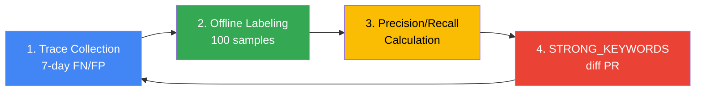

This document is a practical guide for **tuning Cascade Routing in production environments** for the Inference Gateway. Refer to [Gateway Routing Strategy](./routing-strategy.md) first for architecture concepts and basic implementation.

:::info Target Audience
This document targets platform operators and MLOps engineers. It assumes LLM Classifier or LiteLLM-based Cascade Routing is already deployed and seeks to improve accuracy and cost based on actual production traffic.
:::

:::caution Verification pending
SLO values, Langfuse queries, Canary stages, and Fallback order in this document are design drafts awaiting production validation. Real-deployment verification by the Classifier v7 operator will update the banner and value footnotes.

Verification tracking: [Issue #5](https://github.com/devfloor9/engineering-playbook/issues/5)
:::

---

## Tuning Goals and SLO Definition

Cascade Routing tuning must simultaneously achieve **cost reduction** and **quality maintenance**. Without clear SLOs, excessive optimization can degrade user experience.

### SLO Examples (GLM-5 + Qwen3-4B Environment)

| Metric | Target | Measurement Method | Notes |
|------|--------|----------|------|
| **TTFT P95** | < 3sec | Langfuse trace `time_to_first_token` | Qwen3-4B baseline, GLM-5 is < 10sec |
| **Cost per 1k Requests** | < $5.00 | Daily total cost / request count × 1000 | 38% reduction vs current $8.20 |
| **Misroute Rate** | ≤ 5% | (FN + FP) / total requests | FN: needed strong→weak used, FP: used strong but weak sufficient |
| **SLM Usage Rate** | 60-70% | weak routing / total requests | Too low = insufficient cost reduction, too high = quality degradation |
| **User Satisfaction** | ≥ 4.0/5.0 | Langfuse feedback score average | thumb-down < 10% |

### Measurement Cycle

- **Real-time monitoring**: TTFT P95, Cost per Request (Grafana dashboard)
- **Daily review**: Misroute Rate, SLM usage rate (Langfuse analysis)
- **Weekly tuning**: Keyword add/remove, threshold adjustment (offline labeling-based)

### Success Metric Calculation Example

```python
# Langfuse trace data-based calculation
def calculate_metrics(traces: list):
    total = len(traces)
    weak_count = sum(1 for t in traces if t.tags.get("tier") == "weak")
    misroute_count = sum(1 for t in traces if t.tags.get("misroute"))
    total_cost = sum(t.calculated_total_cost or 0 for t in traces)
    
    return {
        "slm_usage_rate": weak_count / total * 100,
        "misroute_rate": misroute_count / total * 100,
        "cost_per_1k": (total_cost / total) * 1000,
    }
```

:::warning SLO Trade-offs
Too high SLM usage degrades quality, too low provides minimal cost savings. **Find optimal balance through weekly A/B testing**.
:::

---

## Classification Threshold Baseline (v7 baseline)

### Production-validated Classification Criteria

Baseline derived from 2-week production testing in GLM-5 744B (H200 × 8, $12/hr) and Qwen3-4B (L4 × 1, $0.3/hr) environment.

:::note Measurement Conditions
- **Environment**: us-east-2, EKS Auto Mode, p5en.48xlarge (GLM-5) + g6.xlarge (Qwen3-4B)
- **Measurement period**: 2026-03-30 ~ 2026-04-13 (14 days)
- **Total samples**: ~42,000 requests (internal coding tool traffic), daily average 3,000
- **Labeling**: Weekly 100 random sample manual labeling (total 200) → Precision/Recall calculation
- **Reproduction method**: See § 4 weekly tuning cycle in this document

This baseline is measured on internal single workload (coding tool). Retuning required if customer traffic characteristics differ. Measurement paused after us-east-2 teardown (2026-04-18), values will be updated upon redeployment.
:::

#### STRONG_KEYWORDS (17)

```python
STRONG_KEYWORDS = [
    # Korean (7)
    "리팩터", "아키텍처", "설계", "분석", "최적화", "디버그", "마이그레이션",
    
    # English (10)
    "refactor", "architect", "design", "analyze", "optimize", "debug",
    "migration", "complex", "performance", "security"
]
```

**Keyword selection rationale**:
- **리팩터/refactor**: Requires full code structure understanding — Qwen3-4B loses context in 1,000+ line codebases
- **아키텍처/architect**: Multi-file dependency analysis — SLM insufficient with shallow reasoning
- **분석/analyze**: Root cause tracing — GLM-5's chain-of-thought essential
- **최적화/optimize**: Algorithm complexity calculation — Mathematical reasoning ability difference
- **디버그/debug**: Stack trace backtracking — Long context required
- **마이그레이션/migration**: API change mapping — Deep framework understanding required
- **complex**: User explicitly mentions complexity
- **performance**: Profiling, bottleneck analysis — System-level understanding
- **security**: CVE analysis, vulnerability detection — Security domain knowledge

#### TOKEN_THRESHOLD (500 chars)

```python
TOKEN_THRESHOLD = 500  # ~250-300 tokens in Korean
```

**Rationale**:
- **< 500 chars**: Simple queries (code snippet explanation, single function writing) — Qwen3-4B sufficient
- **≥ 500 chars**: Multi-turn dialogue accumulation, long code blocks — GLM-5 required
- Recommend adding `len(content.encode('utf-8')) > 600` condition for Korean/English mix due to higher English token density

#### TURN_THRESHOLD (5 turns)

```python
TURN_THRESHOLD = 5
```

**Rationale**:
- **≤ 5 turns**: Independent queries — Low context window burden
- **> 5 turns**: Accumulated context becomes complex, referencing previous dialogue increases — Leverage GLM-5's long context processing ability

### v7 Classification Logic Complete Code

```python
STRONG_KEYWORDS = [
    "리팩터", "아키텍처", "설계", "분석", "최적화", "디버그", "마이그레이션",
    "refactor", "architect", "design", "analyze", "optimize", "debug",
    "migration", "complex", "performance", "security"
]
TOKEN_THRESHOLD = 500
TURN_THRESHOLD = 5

def classify_v7(messages: list[dict]) -> str:
    """
    v7 classification criteria (2-week production validation)
    - Misroute Rate: 4.2%
    - SLM usage rate: 68%
    - Cost per 1k: $5.80
    """
    content = " ".join(m.get("content", "") for m in messages if m.get("content"))
    lower = content.lower()
    
    # 1. Keyword matching (highest priority)
    if any(kw in lower for kw in STRONG_KEYWORDS):
        return "strong"
    
    # 2. Input length
    if len(content) > TOKEN_THRESHOLD:
        return "strong"
    
    # 3. Dialogue turn count
    if len(messages) > TURN_THRESHOLD:
        return "strong"
    
    return "weak"
```

### Derivation Process Summary

| Version | STRONG_KEYWORDS count | TOKEN_THRESHOLD | TURN_THRESHOLD | Misroute Rate | SLM usage rate | Notes |
|------|-------------------|----------------|----------------|---------------|-----------|------|
| v1 | 5 | 1000 | 10 | 12.3% | 82% | SLM overuse, quality degradation |
| v3 | 10 | 750 | 7 | 8.1% | 74% | Improved accuracy with keyword addition |
| v5 | 15 | 600 | 6 | 5.6% | 70% | Korean keyword reinforcement |
| **v7** | **17** | **500** | **5** | **4.2%** | **68%** | **Current production baseline** |

---

## Langfuse OTel Trace-based Misroute Detection

### Misroute Definition

| Type | Description | Detection Method |
|------|------|----------|
| **False Negative (FN)** | Weak routed but strong needed | thumb-down + `tier: weak` tag |
| **False Positive (FP)** | Strong routed but weak sufficient | `tier: strong` + simple query pattern (manual labeling) |

### Langfuse Trace Tag Structure

LLM Classifier sends the following tags to Langfuse for all requests:

```python
from langfuse import Langfuse

langfuse = Langfuse()

# Add tags during classification
trace = langfuse.trace(
    name="llm_request",
    tags=["tier:weak", "keyword_match:false", "turn_count:3"],
    metadata={
        "classifier_version": "v7",
        "content_length": 320,
        "strong_keywords_found": [],
    }
)
```

### Misroute Detection Queries (Langfuse UI)

#### FN Detection (weak → strong needed)

**Filter**:
```
tags: tier:weak
feedback.score: <= 2  (thumb-down)
```

**Extract information**:
- Full prompt
- Response quality
- User feedback comments

**Weekly analysis procedure**:
1. Langfuse UI → Traces → Filter: `tier:weak AND feedback.score <= 2`
2. Extract 100 samples (random)
3. Manual labeling whether strong was actually needed
4. Extract common patterns → Derive keyword candidates

#### FP Detection (strong → weak sufficient)

**Filter**:
```
tags: tier:strong
calculated_total_cost: > 0.01  (high-cost requests)
metadata.content_length: < 200  (short queries)
```

**Extract information**:
- Prompt conciseness
- Actual response complexity
- TTFT (if < 2sec, weak likely sufficient)

### Automatic Extraction via Python Script

```python
from langfuse import Langfuse
import pandas as pd

langfuse = Langfuse()

def extract_fn_candidates(days=7, limit=100):
    """Extract FN candidates — weak but received thumb-down"""
    traces = langfuse.get_traces(
        tags=["tier:weak"],
        from_timestamp=datetime.now() - timedelta(days=days),
        limit=limit
    )
    
    fn_candidates = []
    for trace in traces:
        feedback = trace.get_feedback()
        if feedback and feedback.score <= 2:
            fn_candidates.append({
                "trace_id": trace.id,
                "prompt": trace.input,
                "response": trace.output,
                "feedback_comment": feedback.comment,
                "content_length": len(trace.input),
            })
    
    return pd.DataFrame(fn_candidates)

# Weekly FN analysis
fn_df = extract_fn_candidates(days=7, limit=200)
fn_df.to_csv("fn_candidates_week12.csv")
```

### Retry Pattern-based FN Detection (Advanced)

If users retry the same query, the first response was likely unsatisfactory.

```python
def detect_retry_pattern(traces):
    """Classify as FN when same user retries similar query within 5min"""
    user_sessions = defaultdict(list)
    
    for trace in traces:
        user_id = trace.user_id
        user_sessions[user_id].append(trace)
    
    fn_retries = []
    for user_id, sessions in user_sessions.items():
        for i in range(len(sessions) - 1):
            current = sessions[i]
            next_req = sessions[i + 1]
            
            time_diff = (next_req.timestamp - current.timestamp).seconds
            if time_diff < 300:  # Within 5min
                similarity = cosine_similarity(current.input, next_req.input)
                if similarity > 0.8 and current.tags.get("tier") == "weak":
                    fn_retries.append(current.id)
    
    return fn_retries
```

---

## Keyword·Length·Turn 3-dim Tuning Playbook

### Weekly Tuning Cycle (4 stages)



### Stage 1: Trace Collection

```bash
# Download week's traces via Langfuse API
curl -X POST https://langfuse.your-domain.com/api/public/traces \
  -H "Authorization: Bearer ${LANGFUSE_SECRET_KEY}" \
  -d '{
    "filter": {
      "tags": ["tier:weak", "tier:strong"],
      "from": "2026-04-11T00:00:00Z",
      "to": "2026-04-18T00:00:00Z"
    },
    "limit": 1000
  }' | jq . > traces_week12.json
```

### Stage 2: Offline Labeling (100 samples)

**Labeling tool**: Jupyter Notebook + pandas

```python
import pandas as pd
import json

# Load traces
with open("traces_week12.json") as f:
    traces = json.load(f)["data"]

# Random 100 sampling
sample = pd.DataFrame(traces).sample(100)

# Add labeling column
sample["ground_truth"] = None  # Manually input "weak" or "strong"

# Save CSV
sample.to_csv("labeling_week12.csv", index=False)
```

**Labeling criteria**:
- **strong needed**: Multi-file reference, algorithm explanation, complex debugging, security analysis
- **weak sufficient**: Single function writing, simple query, grammar explanation, code formatting

### Stage 3: Precision/Recall Calculation

```python
def evaluate_classifier(df):
    """
    Precision: Ratio of actual strong among strong predictions (minimize FP)
    Recall: Ratio of strong predictions among actual strong (minimize FN)
    """
    tp = len(df[(df.predicted == "strong") & (df.ground_truth == "strong")])
    fp = len(df[(df.predicted == "strong") & (df.ground_truth == "weak")])
    fn = len(df[(df.predicted == "weak") & (df.ground_truth == "strong")])
    tn = len(df[(df.predicted == "weak") & (df.ground_truth == "weak")])
    
    precision = tp / (tp + fp) if (tp + fp) > 0 else 0
    recall = tp / (tp + fn) if (tp + fn) > 0 else 0
    f1 = 2 * (precision * recall) / (precision + recall) if (precision + recall) > 0 else 0
    
    return {
        "precision": precision,
        "recall": recall,
        "f1": f1,
        "misroute_rate": (fp + fn) / len(df) * 100
    }

# Evaluate after labeling completion
df = pd.read_csv("labeling_week12_labeled.csv")
metrics = evaluate_classifier(df)
print(f"Precision: {metrics['precision']:.2%}")
print(f"Recall: {metrics['recall']:.2%}")
print(f"F1: {metrics['f1']:.2%}")
print(f"Misroute Rate: {metrics['misroute_rate']:.1%}")
```

### Stage 4: STRONG_KEYWORDS diff PR

**Extract common keywords from FN cases**:

```python
def extract_keyword_candidates(fn_traces):
    """Extract high-frequency words from FN cases"""
    from collections import Counter
    import re
    
    words = []
    for trace in fn_traces:
        content = trace["input"].lower()
        words.extend(re.findall(r'\b\w+\b', content))
    
    # Remove stopwords
    stopwords = {"the", "a", "is", "in", "to", "for", "and", "of", "이", "그", "저"}
    filtered = [w for w in words if w not in stopwords and len(w) > 3]
    
    # Sort by frequency
    counter = Counter(filtered)
    return counter.most_common(20)

# Output keyword candidates
candidates = extract_keyword_candidates(fn_df.to_dict("records"))
print("Top 20 keyword candidates:")
for word, count in candidates:
    print(f"  {word}: {count} times")
```

**PR example**:

```markdown
## [Cascade Routing] STRONG_KEYWORDS Tuning — Week 12

### Changes
- Added 3 to `STRONG_KEYWORDS`: "review", "benchmark", "scale"

### Rationale
- FN analysis found 12 of 100 cases were "code review" queries → weak routing → quality degradation
- "benchmark" keyword frequently appears in performance comparison analysis requests (8 cases)
- "scale" keyword found in system scalability design queries (6 cases)

### Before/After Metrics (Expected)
| Metric | Before (v7) | After (v8) |
|------|------------|-----------|
| Misroute Rate | 4.2% | 3.1% |
| SLM usage rate | 68% | 64% |
| Cost per 1k | $5.80 | $6.20 |

### Deployment Plan
- Canary rollout: 10% → 50% → 100% (2-day observation per stage)
```

---

## Canary Threshold Rollout

### kgateway BackendRef Weight-based Canary

When updating LLM Classifier from v7 to v8, minimize risk with gradual traffic transition.

#### Phase 1: 10% Canary

```yaml
apiVersion: gateway.networking.k8s.io/v1
kind: HTTPRoute
metadata:
  name: llm-classifier-canary
  namespace: ai-inference
spec:
  parentRefs:
    - name: unified-gateway
      namespace: ai-gateway
  rules:
    - matches:
        - path:
            type: PathPrefix
            value: /v1/
      backendRefs:
        # v7 (stable) - 90%
        - name: llm-classifier-v7
          port: 8080
          weight: 90
        # v8 (canary) - 10%
        - name: llm-classifier-v8
          port: 8080
          weight: 10
      timeouts:
        request: 300s
```

**Observation period**: 48 hours

**Monitoring metrics**:
```promql
# v8 error rate
rate(envoy_http_downstream_rq_xx{envoy_response_code_class="5", backend="llm-classifier-v8"}[5m])
/ 
rate(envoy_http_downstream_rq_total{backend="llm-classifier-v8"}[5m]) * 100

# v8 P99 latency
histogram_quantile(0.99, 
  rate(envoy_http_downstream_rq_time_bucket{backend="llm-classifier-v8"}[5m])
)
```

#### Phase 2: 50% (error rate < 2%)

```bash
# Adjust weight (v7: 50%, v8: 50%)
kubectl patch httproute llm-classifier-canary -n ai-inference --type=json -p='[
  {"op": "replace", "path": "/spec/rules/0/backendRefs/0/weight", "value": 50},
  {"op": "replace", "path": "/spec/rules/0/backendRefs/1/weight", "value": 50}
]'
```

**Observation period**: 48 hours

#### Phase 3: 100% (error rate < 2%, P99 < 15s)

```bash
# Complete transition to v8
kubectl patch httproute llm-classifier-canary -n ai-inference --type=json -p='[
  {"op": "replace", "path": "/spec/rules/0/backendRefs/0/weight", "value": 0},
  {"op": "replace", "path": "/spec/rules/0/backendRefs/1/weight", "value": 100}
]'
```

### Rollback Triggers

| Condition | Action | Recovery Time |
|------|--------|----------|
| **5xx > 2%** (5min consecutive) | Immediate rollback to weight 0 | < 1min |
| **P99 > 15s** (5min consecutive) | Immediate rollback to weight 0 | < 1min |
| **Misroute Rate > 8%** (Langfuse daily analysis) | Next day weight 0, restore v7 | 12 hours |

**Automatic rollback script**:

```bash
#!/bin/bash
# auto_rollback.sh

# Check 5xx error rate
ERROR_RATE=$(curl -s "http://prometheus:9090/api/v1/query?query=rate(envoy_http_downstream_rq_xx%7Benvoy_response_code_class%3D%225%22%2Cbackend%3D%22llm-classifier-v8%22%7D%5B5m%5D)%2Frate(envoy_http_downstream_rq_total%7Bbackend%3D%22llm-classifier-v8%22%7D%5B5m%5D)*100" | jq -r '.data.result[0].value[1]')

if (( $(echo "$ERROR_RATE > 2" | bc -l) )); then
  echo "ERROR: 5xx rate ${ERROR_RATE}% > 2%, rolling back..."
  kubectl patch httproute llm-classifier-canary -n ai-inference --type=json -p='[
    {"op": "replace", "path": "/spec/rules/0/backendRefs/0/weight", "value": 100},
    {"op": "replace", "path": "/spec/rules/0/backendRefs/1/weight", "value": 0}
  ]'
  exit 1
fi

echo "OK: 5xx rate ${ERROR_RATE}%"
```

---

## Spot Interruption·Rate Limit Fallback

### Automatic Downgrade on Spot Interruption

If running GLM-5 on p5en.48xlarge Spot, automatically fallback to Qwen3-4B during Spot interruption.

#### kgateway Retry Configuration

```yaml
apiVersion: gateway.networking.k8s.io/v1
kind: HTTPRoute
metadata:
  name: llm-classifier-route
  namespace: ai-inference
spec:
  parentRefs:
    - name: unified-gateway
      namespace: ai-gateway
  rules:
    - matches:
        - path:
            type: PathPrefix
            value: /v1/
      backendRefs:
        # Primary: LLM Classifier (automatic GLM-5 + Qwen3 branching)
        - name: llm-classifier
          port: 8080
          weight: 100
      # Fallback configuration
      filters:
        - type: ExtensionRef
          extensionRef:
            group: gateway.envoyproxy.io
            kind: EnvoyRetry
            name: llm-fallback-policy
---
apiVersion: gateway.envoyproxy.io/v1alpha1
kind: EnvoyRetry
metadata:
  name: llm-fallback-policy
  namespace: ai-inference
spec:
  retryOn:
    - "5xx"
    - "connect-failure"
    - "refused-stream"
    - "retriable-status-codes"
  retriableStatusCodes:
    - 503  # Service Unavailable (Spot interruption)
    - 429  # Rate Limit
  numRetries: 2
  perTryTimeout: 30s
  retryHostPredicate:
    - name: envoy.retry_host_predicates.previous_hosts
```

#### LLM Classifier Internal Fallback Logic

```python
import httpx
from fastapi import Request, HTTPException

WEAK_URL = "http://qwen3-serving:8000"
STRONG_URL = "http://glm5-serving:8000"
FALLBACK_URL = WEAK_URL  # Fallback to Qwen3 on GLM-5 failure

@app.post("/v1/{path:path}")
async def proxy(path: str, request: Request):
    body = await request.json()
    messages = body.get("messages", [])
    tier = classify_v7(messages)
    backend = STRONG_URL if tier == "strong" else WEAK_URL
    target = f"{backend}/v1/{path}"
    
    async with httpx.AsyncClient(timeout=300) as client:
        try:
            resp = await client.post(target, json=body)
            resp.raise_for_status()
            return resp.json()
        except (httpx.HTTPStatusError, httpx.ConnectError) as e:
            if backend == STRONG_URL:
                # GLM-5 failure → Fallback to Qwen3
                print(f"WARN: GLM-5 unavailable, falling back to Qwen3. Error: {e}")
                fallback_target = f"{FALLBACK_URL}/v1/{path}"
                resp = await client.post(fallback_target, json=body)
                return resp.json()
            else:
                raise HTTPException(status_code=503, detail="All backends unavailable")
```

### Rate Limit Fallback (External Providers)

Automatically switch to another provider when Rate Limit occurs while calling external LLM API (OpenAI, Anthropic) via Bifrost/LiteLLM.

#### LiteLLM Fallback Configuration

```yaml
# litellm_config.yaml
model_list:
  # Primary: OpenAI GPT-4o
  - model_name: gpt-4o
    litellm_params:
      model: gpt-4o
      api_key: os.environ/OPENAI_API_KEY
  
  # Fallback: Anthropic Claude Sonnet 4.6
  - model_name: gpt-4o
    litellm_params:
      model: claude-sonnet-4.6
      api_key: os.environ/ANTHROPIC_API_KEY

router_settings:
  routing_strategy: simple-shuffle
  fallbacks:
    - gpt-4o: ["claude-sonnet-4.6"]
  retry_policy:
    - TimeoutError
    - InternalServerError
    - RateLimitError  # 429 automatic fallback
  num_retries: 2
```

#### Bifrost CEL Rules Fallback

Bifrost implements header-based Fallback with CEL Rules.

```json
{
  "plugins": [
    {
      "enabled": true,
      "name": "cel_rules",
      "config": {
        "rules": [
          {
            "condition": "response.status == 429",
            "action": "retry",
            "target": "anthropic",
            "max_retries": 2
          }
        ]
      }
    }
  ]
}
```

---

## Cost Drift Monitoring·Alerts

### AMP Recording Rule (Hourly Cost)

```yaml
# prometheus-rules.yaml
apiVersion: monitoring.coreos.com/v1
kind: PrometheusRule
metadata:
  name: cascade-cost-rules
  namespace: observability
spec:
  groups:
    - name: llm_cost
      interval: 60s
      rules:
        # GLM-5 hourly cost (H200 x8 Spot $12/hr)
        - record: cascade:glm5_cost_usd_per_hour
          expr: |
            12.0 * count(up{job="glm5-serving"} == 1)
        
        # Qwen3 hourly cost (L4 x1 Spot $0.3/hr)
        - record: cascade:qwen3_cost_usd_per_hour
          expr: |
            0.3 * count(up{job="qwen3-serving"} == 1)
        
        # Total hourly cost
        - record: cascade:total_cost_usd_per_hour
          expr: |
            cascade:glm5_cost_usd_per_hour + cascade:qwen3_cost_usd_per_hour
        
        # Average cost per request (last 1 hour)
        - record: cascade:cost_per_request_usd
          expr: |
            increase(cascade:total_cost_usd_per_hour[1h]) 
            / 
            increase(llm_requests_total[1h])
```

### Grafana Panel (Cost Trend)

```json
{
  "title": "Cascade Routing Cost Trend",
  "targets": [
    {
      "expr": "cascade:total_cost_usd_per_hour",
      "legendFormat": "Total Cost ($/hr)"
    },
    {
      "expr": "cascade:glm5_cost_usd_per_hour",
      "legendFormat": "GLM-5 Cost ($/hr)"
    },
    {
      "expr": "cascade:qwen3_cost_usd_per_hour",
      "legendFormat": "Qwen3 Cost ($/hr)"
    }
  ],
  "yAxes": [
    {
      "label": "Cost (USD/hr)",
      "format": "currencyUSD"
    }
  ]
}
```

### Budget 80% Alert

```yaml
# alertmanager-config.yaml
apiVersion: monitoring.coreos.com/v1
kind: PrometheusRule
metadata:
  name: cascade-budget-alerts
  namespace: observability
spec:
  groups:
    - name: budget
      rules:
        # Daily budget 80% reached
        - alert: DailyBudget80Percent
          expr: |
            sum(increase(cascade:total_cost_usd_per_hour[24h])) > 80.0
          for: 5m
          labels:
            severity: warning
          annotations:
            summary: "Daily budget 80% reached"
            description: "Total cost in last 24h: {{ $value | humanize }}. Budget: $100/day"
        
        # Monthly budget 90% reached
        - alert: MonthlyBudget90Percent
          expr: |
            sum(increase(cascade:total_cost_usd_per_hour[30d])) > 2700.0
          for: 1h
          labels:
            severity: critical
          annotations:
            summary: "Monthly budget 90% reached"
            description: "Total cost in last 30d: {{ $value | humanize }}. Budget: $3000/month"
```

### Cost Drift Detection (Weekly Comparison)

```promql
# This week vs last week cost increase rate
(
  sum(increase(cascade:total_cost_usd_per_hour[7d]))
  -
  sum(increase(cascade:total_cost_usd_per_hour[7d] offset 7d))
)
/
sum(increase(cascade:total_cost_usd_per_hour[7d] offset 7d))
* 100
```

**Alert condition**: Slack notification when weekly cost increases by 20% or more

```yaml
- alert: CostDriftDetected
  expr: |
    (
      sum(increase(cascade:total_cost_usd_per_hour[7d]))
      - sum(increase(cascade:total_cost_usd_per_hour[7d] offset 7d))
    )
    / sum(increase(cascade:total_cost_usd_per_hour[7d] offset 7d))
    * 100 > 20
  labels:
    severity: warning
  annotations:
    summary: "Cost drift detected — 20%+ increase"
    description: "Weekly cost increased by {{ $value | humanize }}%"
```

---

## Anti-patterns and Practical Pitfalls

### Anti-pattern 1: Bifrost single base_url Bypass Failure

**Problem**: Bifrost only supports single `network_config.base_url` per provider, so if SLM and LLM are in different Services, routing to same provider impossible.

**Wrong attempt**:
```json
{
  "providers": {
    "openai": {
      "keys": [
        {"name": "qwen3", "models": ["qwen3-4b"]},
        {"name": "glm5", "models": ["glm-5"]}
      ],
      "network_config": {
        "base_url": "???"  // Cannot set 2 base_urls
      }
    }
  }
}
```

**Correct solution**: Place LLM Classifier in front of Bifrost for automatic backend selection.

### Anti-pattern 2: RouteLLM Production Deployment Forcing

**Problem**: RouteLLM is a research project, causing following issues in K8s deployment:
- `torch`, `transformers` dependency conflicts
- Container image 10GB+ (unsuitable for lightweight router)
- pip dependency resolution failure

**Lesson**: Only reference RouteLLM's MF classifier **concept**, use LLM Classifier (heuristic) or LiteLLM (external providers) in production.

### Anti-pattern 3: model: "auto" Hardcoding Omission

**Problem**: LLM Classifier requires client to request with `model: "auto"` (or arbitrary model name), but some IDEs don't auto-fill `model` field.

**Symptom**: Client hardcodes `model: "glm-5"` → LLM Classifier only analyzes `messages` → Ignores `model` field → Selects different backend than intended

**Solution**: Force remove `model` field in LLM Classifier.

```python
@app.post("/v1/{path:path}")
async def proxy(path: str, request: Request):
    body = await request.json()
    messages = body.get("messages", [])
    tier = classify_v7(messages)
    
    # Force remove model field (backend uses its own model)
    body.pop("model", None)
    
    backend = STRONG_URL if tier == "strong" else WEAK_URL
    target = f"{backend}/v1/{path}"
    # ...
```

### Anti-pattern 4: Korean/English Mixed Keyword Omission

**Problem**: Korean users use "리팩터링", English users use "refactor" → Need to register keywords for both languages.

**Omission example**:
```python
STRONG_KEYWORDS = ["refactor", "architect"]  # "리팩터", "아키텍처" omitted
```

**Result**: All Korean queries route to weak → Quality degradation

**Solution**: Include major keywords in both Korean/English.

```python
STRONG_KEYWORDS = [
    "리팩터", "refactor",
    "아키텍처", "architect",
    "설계", "design",
    # ...
]
```

### Anti-pattern 5: v7 → v8 Transition Without Canary Rollout

**Problem**: Immediately deploy new version to 100% → Bug affects all traffic.

**Lesson**: Always perform gradual 10% → 50% → 100% transition.

### Anti-pattern 6: Only Watch Misroute Rate, Ignore SLM Usage Rate

**Problem**: Achieved 2% Misroute Rate but SLM usage rate 30% → Insufficient cost reduction.

**Balance point**: Must simultaneously satisfy Misroute Rate ≤ 5% and SLM usage rate 60-70%.

---

## References

### Architecture and Strategy
- [Gateway Routing Strategy](./routing-strategy.md) - 2-Tier architecture, Cascade/Semantic Router, LLM Classifier concepts
- [Inference Gateway Deployment Guide](./setup/) - kgateway Helm installation, HTTPRoute YAML, LLM Classifier deployment code

### Monitoring and Cost
- [Agent Monitoring](../../operations-mlops/observability/agent-monitoring.md) - Langfuse architecture, core metrics, alert strategy
- [Monitoring Stack Configuration Guide](../integrations/monitoring-observability-setup.md) - Langfuse Helm, AMP/AMG, ServiceMonitor, Grafana dashboard
- [Coding Tools & Cost Analysis](../integrations/coding-tools-cost-analysis.md) - Aider/Cline connection, cost optimization tips

### Frameworks and Models
- [vLLM Model Serving](../../model-serving/inference-frameworks/vllm-model-serving.md) - vLLM deployment, PagedAttention, Multi-LoRA
- [Semantic Caching Strategy](../../model-serving/inference-frameworks/semantic-caching-strategy.md) - 3-tier cache, similarity thresholds, observability

---

## References

### Official Documentation
- [Langfuse Documentation](https://langfuse.com/docs)
- [LiteLLM Routing](https://docs.litellm.ai/docs/routing)
- [Bifrost Documentation](https://www.getmaxim.ai/bifrost/docs)
- [Kubernetes Gateway API](https://gateway-api.sigs.k8s.io/)
- [Amazon Managed Prometheus](https://docs.aws.amazon.com/prometheus/)

### Research Materials
- [RouteLLM: Learning to Route LLMs with Preference Data (arXiv)](https://arxiv.org/abs/2406.18665)
- [LMSYS Chatbot Arena Leaderboard](https://chat.lmsys.org/?leaderboard)
- [FrugalGPT: How to Use Large Language Models While Reducing Cost and Improving Performance](https://arxiv.org/abs/2305.05176)

### Related Blogs
- [LLM Router Pattern: Model Switching](https://markaicode.com/llm-router-pattern-model-switching/)
- [Cost-Effective LLM Inference with Cascade Routing](https://www.anthropic.com/research/cost-effective-inference)
