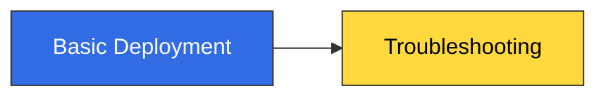
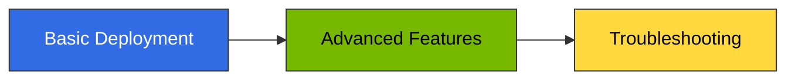

import { useColorMode } from '@docusaurus/theme-common';
import { useEffect, useRef } from 'react';

export const InferencePipelineDiagram = () => {
  const { colorMode } = useColorMode();
  const iframeRef = useRef(null);
  useEffect(() => {
    if (iframeRef.current && iframeRef.current.contentWindow) {
      iframeRef.current.contentWindow.postMessage(
        { type: 'theme-change', theme: colorMode },
        '*'
      );
    }
  }, [colorMode]);
  return (
    <iframe
      ref={iframeRef}
      src={`/engineering-playbook/agentic-platform-architecture.html?theme=${colorMode}`}
      style={{width: '100%', height: '1600px', border: 'none', borderRadius: '12px'}}
      title="Production Inference Pipeline Architecture"
      loading="lazy"
    />
  );
};

# Inference Gateway Deployment Guide

This document covers **production deployment procedures** for kgateway + Bifrost-based inference gateway. For architecture concepts and routing strategies (Cascade, Semantic Router, 2-Tier structure), refer to [Inference Gateway Routing](../routing-strategy.md).

:::info Guide Structure
This guide consists of 3 documents. Learn sequentially or reference specific sections as needed.
:::

## Production Inference Pipeline Reference Architecture

Complete request flow of production inference pipeline based on EKS Auto Mode. CloudFront (WAF/Shield) → NLB → kgateway ExtProc analyzes prompts to determine LLM routing, passes through Bifrost governance layer and llm-d KV Cache-aware routing to deliver requests to optimal models.

<InferencePipelineDiagram />

---

## Deployment Stages Overview

### 1. [Basic Deployment](./basic-deployment.md) (Required)

Configure kgateway + HTTPRoute + Bifrost behind a single NLB endpoint to complete basic inference pipeline.

**Includes:**
- kgateway installation and Gateway API CRD configuration
- GatewayClass, Gateway, HTTPRoute resource definitions
- Cross-namespace access via ReferenceGrant
- Bifrost Gateway Mode configuration (config.json + PVC)
- provider/model format and IDE compatibility (Aider, Cline, Continue.dev)
- SQLite initialization procedure (when config.json changes)

**Learning Time:** 30 min | **Deployment Time:** 45 min

---

### 2. [Advanced Features](./advanced-features.md) (Optional)

Add prompt-based automatic routing, production security layer, and Semantic Caching to enhance cost optimization and security.

**Includes:**
- LLM Classifier deployment (prompt-based SLM/LLM automatic branching)
- CloudFront + WAF/Shield security layer
- Semantic Caching implementation options (GPTCache, RedisVL, Portkey, Helicone)

**Learning Time:** 45 min | **Deployment Time:** 60-90 min

---

### 3. [Troubleshooting](./troubleshooting-guide.md) (Reference)

Common issues and solutions during deployment and operations.

**Includes:**
- 404 Not Found (HTTPRoute/Gateway configuration errors)
- Bifrost provider/model errors
- Bifrost model name normalization issues
- Langfuse Sub-path 404
- OTel Trace not arriving

**Reference Frequency:** During deployment or when issues occur

---

## Learning Paths

### Quick Start (Development/Test Environment)

1. Configure kgateway + Bifrost with [Basic Deployment](./basic-deployment.md)
2. Refer to [Troubleshooting](./troubleshooting-guide.md) when issues occur

**Time Required:** 1-2 hours

---

### Production Configuration (Complete Pipeline)

1. Configure basic infrastructure with [Basic Deployment](./basic-deployment.md)
2. Add LLM Classifier + CloudFront/WAF + Semantic Caching in [Advanced Features](./advanced-features.md)
3. Refer to [Troubleshooting](./troubleshooting-guide.md) during operations

**Time Required:** 3-4 hours

---

## Prerequisites

Verify the following before proceeding with all deployment stages.

### Required

- [x] EKS cluster (K8s 1.32+, DRA 1.35 GA)
- [x] kubectl installed with cluster access
- [x] Helm 3.x installed
- [x] vLLM or llm-d based model serving Pods deployed

### Recommended

- AWS Load Balancer Controller installed (for automatic NLB creation)
- Langfuse deployed (refer to [Langfuse Deployment Guide](../../integrations/monitoring-observability-setup.md))
- Production environment: ACM certificate issued (for CloudFront + TLS)

---

## Next Steps

- **Get Started**: Navigate to [Basic Deployment](./basic-deployment.md) to begin kgateway installation.
- **Understand Architecture**: Read [Inference Gateway Routing](../routing-strategy.md) before deployment to grasp the overall structure.
- **Prepare Monitoring**: Configure observability stack by referring to [Langfuse Deployment Guide](../../integrations/monitoring-observability-setup.md).

---

## References

- [Inference Gateway Routing](../routing-strategy.md) - kgateway architecture and routing strategy details
- [Langfuse Deployment Guide](../../integrations/monitoring-observability-setup.md) - Helm installation, OTel integration, Redis/ClickHouse configuration
- [Agent Monitoring](../../../operations-mlops/observability/agent-monitoring.md) - Langfuse architecture and components
- [Kubernetes Gateway API Official Documentation](https://gateway-api.sigs.k8s.io/)
- [kgateway Official Documentation](https://kgateway.dev/docs/)
- [Bifrost Official Documentation](https://bifrost.dev/docs)
