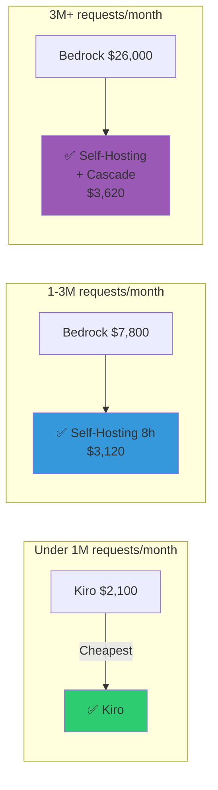
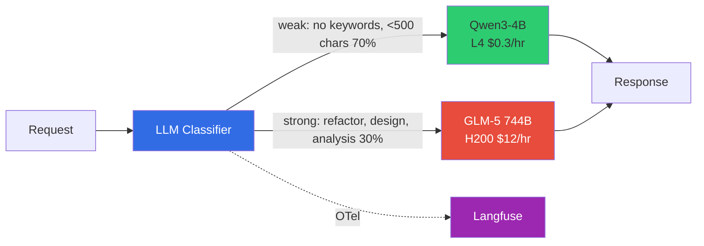
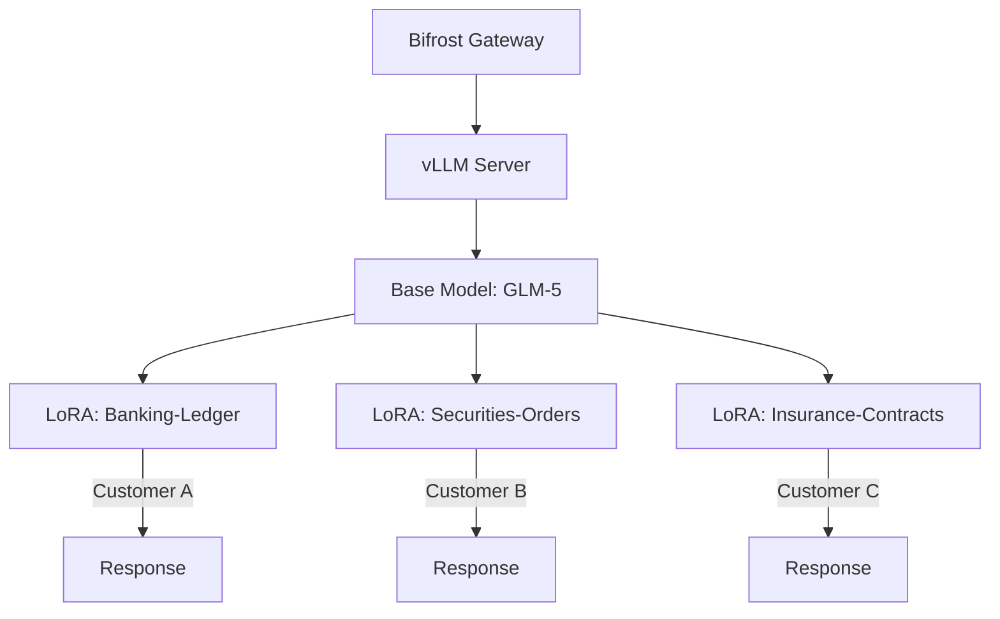

## Overview

To leverage AI coding tools in enterprise environments, three factors must be considered: **IDE integration**, **cost optimization**, and **data sovereignty**. This document provides methods for connecting major coding tools like Aider, Cline, and Continue.dev to self-hosted LLMs, along with cost analysis of Bedrock vs Kiro vs self-hosting.

### Why Self-Hosting Integration Is Needed

| Constraint | SaaS (Kiro, Copilot) | Self-Hosting |
|------------|---------------------|--------------|
| **Data sovereignty** | Code transmitted externally | ✅ Complete VPC isolation |
| **Customization** | Only provided models | ✅ LoRA Fine-tuning |
| **Cost control** | Fixed token pricing | ✅ Cascade 66% savings |
| **Observability** | Limited | ✅ Full Langfuse control |

:::tip Core Strategy
Deploy an **LLM Classifier** behind kgateway so clients use a single endpoint (`/v1`), and SLM (Qwen3-4B) or LLM (GLM-5) is automatically selected based on prompt content. Track all requests with Langfuse, achieving 66% cost savings through Cascade Routing without manual model selection.
:::

---

## IDE/Coding Tool Connections

### 2.1 LLM Classifier Auto-Routing (Recommended)

Using an **LLM Classifier**, all clients connect to a **single endpoint**, and SLM/LLM is automatically selected based on prompt content. No manual model selection needed.

| Tool | LLM Classifier Compatible | Configuration |
|------|--------------------------|--------------|
| **Aider** | ✅ | `OPENAI_API_BASE=http://<NLB>/v1 aider --model openai/auto` |
| **Cline** | ✅ | Model: `auto`, Base URL: `http://<NLB>/v1` |
| **Continue.dev** | ✅ | model: `auto`, apiBase: `http://<NLB>/v1` |
| **Cursor** | ✅ | No `/` needed in model name — use `auto` |

:::tip Compatibility Improvement over Bifrost
The `provider/model` format (`openai/glm-5`) and Aider double-prefix trick (`openai/openai/glm-5`) required when routing through Bifrost are **completely unnecessary**. Cursor can also be used without model name `/` restrictions.
:::

### 2.2 Aider Connection Example

[Aider](https://aider.chat) is an open-source CLI tool supporting Git-aware code editing + auto-commit.

```bash
# Install Aider
pip install aider-chat

# LLM Classifier auto-routing — single endpoint, automatic model selection
OPENAI_API_BASE="http://<NLB_ENDPOINT>/v1" \
OPENAI_API_KEY="dummy" \
aider --model openai/auto
```

:::info Automatic Model Routing
When requesting with `model: "auto"`, the LLM Classifier analyzes prompt content and automatically selects SLM (Qwen3-4B) or LLM (GLM-5 744B). Simple code completion routes to Qwen3-4B ($0.3/hr), while refactoring/architecture analysis routes to GLM-5 ($12/hr).
:::

#### Why Aider Is Recommended

1. **Git integration**: Auto-commits changes, minimizes edit scope via diff-based modifications
2. **CLI-based**: Usable in CI/CD pipelines
3. **OpenAI-Compatible**: Supports all OpenAI-compatible endpoints
4. **Auto Cascade**: Automatic prompt-based model selection + Langfuse recording when routed through LLM Classifier

### 2.3 Continue.dev Configuration Example

Continue.dev is an AI coding assistant for VSCode/JetBrains.

```json
{
  "models": [
    {
      "title": "Auto (LLM Classifier)",
      "provider": "openai",
      "model": "auto",
      "apiBase": "http://<NLB_ENDPOINT>/v1",
      "apiKey": "dummy"
    }
  ]
}
```

### 2.4 Cline Configuration Example

Cline is an AI coding tool for VSCode.

Settings -> API Provider -> OpenAI Compatible
- Base URL: `http://<NLB_ENDPOINT>/v1`
- Model: `auto`
- API Key: `dummy`

---

## Routing Architecture Comparison

### 3.1 LLM Classifier vs Bifrost

| Item | **LLM Classifier (Recommended)** | **Bifrost** |
|------|--------------------------------|------------|
| **Suitable for** | Self-hosted vLLM cascade | External provider integration (OpenAI/Anthropic) |
| **Model name format** | `auto` (arbitrary value OK) | `provider/model` required |
| **Prompt analysis** | ✅ Direct body access | ❌ CEL can only access headers |
| **Multi-backend** | ✅ WEAK/STRONG URL separation | ❌ Single base_url per provider |
| **Aider compatible** | ✅ No tricks needed | ⚠️ Double-prefix required |
| **Cursor compatible** | ✅ | ❌ Slash not allowed |
| **Image size** | ~50MB | ~100MB |

:::info When to Use Bifrost
Bifrost is optimized for **external LLM provider** (OpenAI, Anthropic, Bedrock) integration, failover, and rate limiting. Use LLM Classifier for intelligent cascade between self-hosted vLLMs. Both can be used together (Bifrost for external, LLM Classifier for self-hosted).
:::

### 3.2 Client Request Example (LLM Classifier)

```python
from openai import OpenAI

client = OpenAI(
    base_url="http://<NLB_ENDPOINT>/v1",
    api_key="dummy"
)

# Simple request → automatically Qwen3-4B
response = client.chat.completions.create(
    model="auto",  # Model name irrelevant — Classifier analyzes prompt
    messages=[{"role": "user", "content": "Hello, how are you?"}]
)

# Complex request → automatically GLM-5 744B
response = client.chat.completions.create(
    model="auto",
    messages=[{"role": "user", "content": "Refactor this code and analyze the architecture"}]
)
```

---

## Kiro vs Self-Hosting Comparison

In April 2026, [Kiro IDE began natively supporting GLM-5](https://kiro.dev/changelog/models/glm-5-now-available-in-kiro). Kiro hosts open weight models on its own infrastructure (us-east-1) at 0.5x credit.

### Feature Comparison

| | **Kiro Hosted** | **Self-Hosting (EKS + vLLM)** |
|---|---|---|
| **Infrastructure** | Kiro/AWS managed | Self-operated (EKS + GPU nodes) |
| **Cost** | Usage-based (0.5x credit) | GPU Spot ~$12/hr |
| **LoRA Fine-tuning** | ❌ Not available | ✅ Domain-specific customization |
| **Data sovereignty** | Via Kiro infrastructure | ✅ Complete VPC isolation |
| **Compliance** | Depends on Kiro policy | ✅ Self-controlled SOC2/ISO27001 |
| **Observability** | Kiro dashboard | ✅ Full Langfuse + AMP/AMG control |
| **Gateway** | None | ✅ Bifrost (guardrails, caching) |
| **Steering/Spec** | ✅ Native | Separate implementation needed |
| **Custom endpoints** | ❌ Kiro model list only | ✅ Freely configurable |
| **Getting started** | Immediate | High difficulty |

:::tip When Self-Hosting Is Needed
- **FSI/Regulated industries**: Data cannot traverse external services (VPC isolation required)
- **LoRA Fine-tuning**: COBOL→Java migration, internal framework code generation
- **Multi-customer operations**: Per-customer LoRA adapter hot-swap + Bifrost routing
- **Complete Observability**: Collect all traces/metrics in self-hosted Langfuse + AMP
:::

:::info When Kiro Is Suitable
- Rapid GLM-5 prototyping without infrastructure setup
- Leveraging Kiro Steering/Spec native workflows
- Small teams looking to reduce GPU infrastructure operational burden
:::

---

## 5. Cost Threshold Analysis: Bedrock vs Kiro vs Self-Hosting

Comparing per-token costs for three methods of using GLM-5.

### 5.1 Per-Token Cost (as of 2026-04-17)[^1]

| | **Bedrock API** | **Kiro (0.5x credit)** | **Self-Hosting (EKS)** |
|---|---|---|---|
| Input ($/1M tokens) | $1.00 | ~$0.80 (est.) | **Variable** |
| Output ($/1M tokens) | $3.20 | ~$2.56 (est.) | **Variable** |
| Avg request cost (1K in + 500 out) | **$0.0026** | **$0.0021** | **Fixed cost ÷ request volume** |
| Monthly subscription | None (pay-as-you-go) | $20~200/month | None |
| Minimum cost | $0 | $20/month | $8,900/month |
| LoRA Fine-tuning | ❌ | ❌ | ✅ |
| Data sovereignty | △ VPC Endpoint | ❌ | ✅ VPC isolation |

[^1]: Based on GLM-5. Latest Bedrock pricing: [AWS Bedrock Pricing](https://aws.amazon.com/bedrock/pricing/), Kiro pricing: [Kiro Pricing](https://kiro.dev/pricing)

:::info Kiro Pricing Estimate Basis
Kiro provides GLM-5 at 0.5x credit. Pro plan $20/month = 1,000 credits, excess at $0.04/credit. Assuming 1 credit ≈ 1 request (~1.5K tokens), per-token cost is ~20% cheaper than Bedrock.
:::

### 5.2 Self-Hosting Fixed Costs

| Item | 24/7 Operation | 8hr/day Operation |
|------|---------------|-------------------|
| p5en.48xlarge Spot | $8,640/month | $2,880/month |
| EKS + Storage + Monitoring | $243/month | $243/month |
| **Total** | **$8,900/month** | **$3,120/month** |

### 5.3 Monthly Cost Comparison by Request Volume (USD)

| Monthly Requests | Monthly Tokens (M) | **Bedrock** | **Kiro** | **Self-Hosting 24/7** | **Self-Hosting 8h** | **Self+Cascade** |
|-----------------|-------------------|------------|---------|---------------------|-------------------|----------------|
| 50,000 | 75M | $130 | $105 | $8,900 | $3,120 | $3,620 |
| 200,000 | 300M | $520 | $420 | $8,900 | $3,120 | $3,620 |
| 500,000 | 750M | $1,300 | $1,050 | $8,900 | $3,120 | $3,620 |
| 1,000,000 | 1.5B | $2,600 | $2,100 | $8,900 | **$3,120** | **$3,620** |
| 3,000,000 | 4.5B | **$7,800** | **$6,300** | $8,900 | **$3,120** | **$3,620** |
| 5,000,000 | 7.5B | **$13,000** | **$10,500** | $8,900 | **$3,120** | **$3,620** |
| 10,000,000 | 15B | **$26,000** | **$21,000** | $8,900 | **$3,120** | **$3,620** |

### 5.4 Break-Even Points

| Comparison | Break-Even (Monthly Requests) | Break-Even (Monthly Cost) |
|-----------|------------------------------|--------------------------|
| Bedrock vs Self-Hosting 24/7 | ~3,400,000 | ~$8,900 |
| Bedrock vs Self-Hosting 8h | ~1,200,000 | ~$3,120 |
| Kiro vs Self-Hosting 24/7 | ~4,200,000 | ~$8,900 |
| Kiro vs Self-Hosting 8h | ~1,500,000 | ~$3,120 |
| Bedrock vs Self+Cascade | ~1,400,000 | ~$3,620 |



---

## Cost Optimization Options (Not Available on Bedrock/Kiro)

Cost optimization strategies only possible with self-hosting.

### 6.1 Optimization Options Comparison

| Optimization | Effect | Description |
|-------------|--------|-------------|
| **8hr/day operation** | 67% savings | CronJob scales up only during business hours ($8,900 → $3,120) |
| **Cascade Routing** | 70-80% savings | Simple requests to SLM (8B), complex requests only to GLM-5 |
| **KV Cache Aware Routing** | 90% TTFT reduction | llm-d prefix-cache aware scheduling, reuse same context |
| **Semantic Caching** | $0 GPU cost (cache hit) | Bifrost similarity threshold 0.85 caches similar requests |
| **Spot Instance** | 84% savings | On-Demand $76/hr → Spot $12/hr |
| **Multi-LoRA sharing** | 1/N infrastructure cost | GLM-5 x1 + LoRA xN = serve N customers |

### 6.2 Cascade Routing Architecture (LLM Classifier)



#### Cascade Cost Analysis

| | SLM Only | LLM Only | **Cascade (70:30)** |
|---|---|---|---|
| **Monthly cost** | $500 | $8,900 | **$3,020** |
| **Accuracy** | 70% | 95% | **92%** |
| **Cost savings** | - | - | **66%** |

:::tip ROI Calculation
Introducing LLM Classifier Cascade saves $5,880/month ($70,560/year). LLM Classifier deploys as a single FastAPI Pod, and setup takes about half a day, making it **immediately worthwhile**.
:::

:::info LLM Classifier Classification Criteria
| Criteria | weak (SLM) | strong (LLM) |
|----------|-----------|-------------|
| Keywords | None | Refactor, architecture, design, analysis, debug, optimize, etc. |
| Input length | &lt;500 chars | ≥500 chars |
| Conversation turns | ≤5 turns | &gt;5 turns |

Detailed deployment guide: [Inference Gateway Setup: LLM Classifier](../inference-gateway/setup/advanced-features#llm-classifier-deployment)
:::

### 6.3 Semantic Caching

Bifrost supports embedding-based semantic caching.

```json
{
  "semantic_cache": {
    "enabled": true,
    "similarity_threshold": 0.85,
    "embedding_model": "text-embedding-3-small",
    "max_cache_size": 10000
  }
}
```

**Effect:**
- Similar requests (similarity >= 0.85) return instantly from cache
- GPU cost $0
- Response latency &lt;50ms (vs inference 2-10s)

### 6.4 KV Cache Aware Routing

Using llm-d routes requests reusing the same context to the same GPU, reducing TTFT by 90%.

```yaml
# llm-d Deployment
spec:
  replicas: 3
  template:
    spec:
      containers:
      - name: llm-d
        args:
          - --enable-prefix-caching
          - --scheduler-strategy=prefix-aware
```

**Effect:**
- TTFT: 10s → 1s (on prefix cache hit)
- Same GPU cost (instance count may decrease due to increased throughput)

Reference: [llm-d EKS Auto Mode](../../model-serving/inference-frameworks/llm-d-eks-automode.md)

### 6.5 Multi-LoRA Sharing

Load multiple LoRA adapters simultaneously on a single GLM-5 instance for per-customer custom serving.



**Effect:**
- 3 customers = 1 GPU instance
- Infrastructure cost 1/3
- Each customer uses domain-specific model

Reference: [Custom Model Pipeline](../model-lifecycle/custom-model-pipeline.md)

---

## Selection Criteria Summary

| Criteria | Recommendation |
|----------|---------------|
| &lt;500K requests/month + quick start | **Kiro** (cheapest) |
| 500K-1.5M + API integration | **Bedrock** (pay-as-you-go, no infrastructure) |
| 1.5M+ (24/7) or 1.2M+ (8h) | **Self-Hosting** |
| With Cascade, 1.4M+ | **Self-Hosting** (savings vs Bedrock) |
| LoRA/Compliance needed | **Self-Hosting** (regardless of volume) |
| Steering/Spec workflow | **Kiro** |

:::tip Combined Cost Optimization Strategy
**Most cost-efficient self-hosting**: 8hr/day operation + Cascade Routing + Spot
- Monthly cost: ~$3,620 (fixed)
- Unlimited request processing
- Break-even vs Bedrock: **~1.4M requests/month**
- At 10M requests/month: Bedrock $26,000 vs Self-hosting $3,620 → **86% savings**
:::

---

## Next Steps

### Phase 1: Basic Integration (1 day)
- [ ] Deploy kgateway + Bifrost + Langfuse
- [ ] Test Aider connection
- [ ] Verify Langfuse dashboard

### Phase 2: Cost Optimization (1 week)
- [ ] Deploy SLM (g6.xlarge)
- [ ] Configure Bifrost Cascade
- [ ] Enable Semantic Caching

### Phase 3: Domain Specialization (2-4 weeks)
- [ ] Collect LoRA Fine-tuning data
- [ ] QLoRA training (NeMo/Unsloth)
- [ ] Deploy Multi-LoRA

### Phase 4: Advanced Optimization (Optional)
- [ ] llm-d prefix-cache aware routing
- [ ] 8hr/day CronJob scheduling
- [ ] Multi-LoRA per-customer routing

---

## References

### Official Documentation

| Resource | Link |
|----------|------|
| Aider Official Docs | [aider.chat](https://aider.chat) |
| Continue.dev Docs | [continue.dev](https://www.continue.dev/) |
| Bifrost Gateway | [getbifrost.ai](https://getbifrost.ai/) |
| Langfuse Observability | [langfuse.com](https://langfuse.com/) |
| Kiro Pricing | [kiro.dev/pricing](https://kiro.dev/pricing) |
| AWS Bedrock Pricing | [aws.amazon.com/bedrock/pricing](https://aws.amazon.com/bedrock/pricing/) |
| OpenAI Pricing | [platform.openai.com/pricing](https://platform.openai.com/pricing) |
| Anthropic Pricing | [anthropic.com/pricing](https://www.anthropic.com/pricing) |
| Custom Model Deployment Guide | [custom-model-deployment.md](../model-lifecycle/custom-model-deployment.md) |
| Custom Model Pipeline | [custom-model-pipeline.md](../model-lifecycle/custom-model-pipeline.md) |
| Inference Gateway | [inference-gateway-routing.md](../inference-gateway/routing-strategy.md) |
