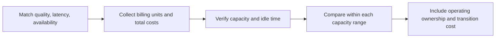
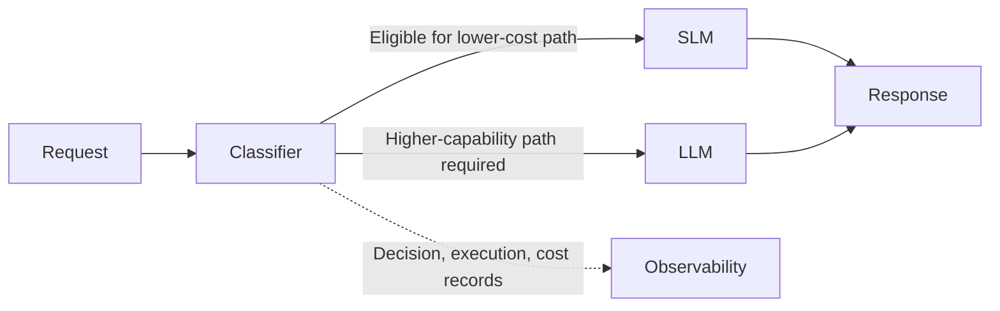
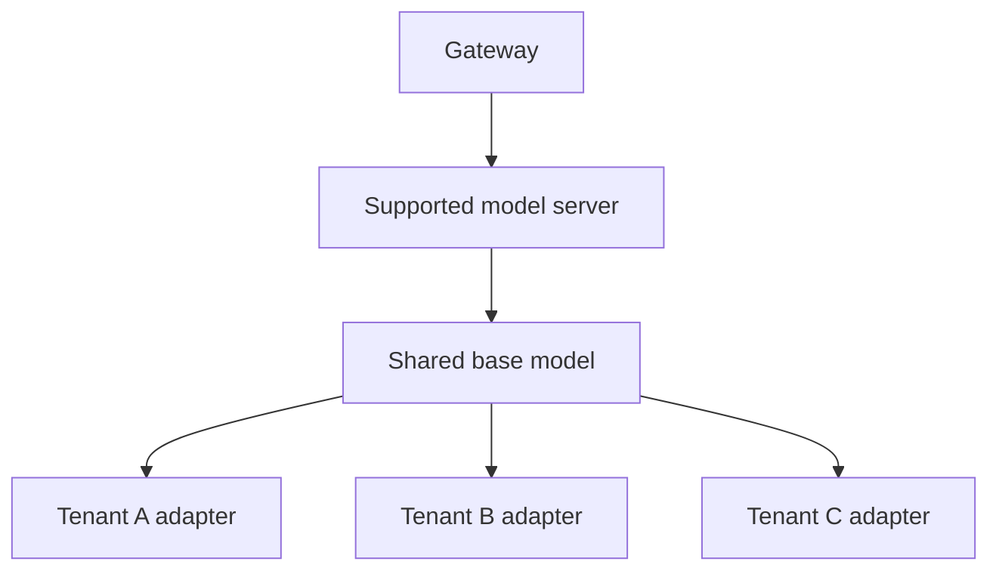

## Overview

To leverage AI coding tools in enterprise environments, three factors must be considered: **IDE integration**, **cost optimization**, and **data sovereignty**. This document provides methods for connecting major coding tools like Aider, Cline, and Continue.dev to self-hosted LLMs, along with cost analysis of Bedrock vs Kiro vs self-hosting.

### Why Self-Hosting Integration Is Needed

| Constraint | SaaS (Kiro, Copilot) | Self-Hosting |
|------------|---------------------|--------------|
| **Data sovereignty** | Check service data handling and contracts | Validate VPC, external calls, and access policy |
| **Customization** | Only provided models | ✅ LoRA Fine-tuning |
| **Cost control** | Service-specific subscription/usage billing | Verify capacity, routing, and actual billing |
| **Observability** | Limited | ✅ Full Langfuse control |

:::tip Core Strategy
Deploy an **LLM Classifier** behind kgateway so clients use a single endpoint (`/v1`), and SLM (Qwen3-4B) or LLM (GLM-5) is automatically selected based on prompt content. Track routing, execution, and costs with Langfuse. Assess savings from measured model quality, request mix, fallback, and actual billed capacity.
:::

---

## IDE/Coding Tool Connections

### 2.1 LLM Classifier Auto-Routing (Recommended)

Using an **LLM Classifier**, all clients connect to a **single endpoint**, and SLM/LLM is automatically selected based on prompt content. No manual model selection needed.

| Tool | LLM Classifier Compatible | Configuration |
|------|--------------------------|--------------|
| **Aider** | ✅ | `OPENAI_API_BASE=http://<NLB>/v1 aider --model openai/auto` |
| **Cline** | ✅ | Model: `auto`, Base URL: `http://<NLB>/v1` |
| **Continue.dev** | ✅ | model: `auto`, apiBase: `http://<NLB>/v1` |
| **Cursor** | ✅ | No `/` needed in model name — use `auto` |

:::tip Compatibility Improvement over Bifrost
The `provider/model` format (`openai/glm-5`) and Aider double-prefix trick (`openai/openai/glm-5`) required when routing through Bifrost are **completely unnecessary**. Cursor can also be used without model name `/` restrictions.
:::

### 2.2 Aider Connection Example

[Aider](https://aider.chat) is an open-source CLI tool supporting Git-aware code editing + auto-commit.

```bash
# Install Aider
pip install aider-chat

# LLM Classifier auto-routing — single endpoint, automatic model selection
OPENAI_API_BASE="http://<NLB_ENDPOINT>/v1" \
OPENAI_API_KEY="dummy" \
aider --model openai/auto
```

:::info Automatic Model Routing
When requesting with `model: "auto"`, the LLM Classifier analyzes prompt content and automatically selects SLM (Qwen3-4B) or LLM (GLM-5 744B). This is the intended routing for an example deployment of both models. Verify the served model and cost from classification results, fallback, and provisioned capacity.
:::

#### Why Aider Is Recommended

1. **Git integration**: Auto-commits changes, minimizes edit scope via diff-based modifications
2. **CLI-based**: Usable in CI/CD pipelines
3. **OpenAI-Compatible**: Supports all OpenAI-compatible endpoints
4. **Auto Cascade**: Automatic prompt-based model selection + Langfuse recording when routed through LLM Classifier

### 2.3 Continue.dev Configuration Example

Continue.dev is an AI coding assistant for VSCode/JetBrains.

```json
{
  "models": [
    {
      "title": "Auto (LLM Classifier)",
      "provider": "openai",
      "model": "auto",
      "apiBase": "http://<NLB_ENDPOINT>/v1",
      "apiKey": "dummy"
    }
  ]
}
```

### 2.4 Cline Configuration Example

Cline is an AI coding tool for VSCode.

Settings -> API Provider -> OpenAI Compatible
- Base URL: `http://<NLB_ENDPOINT>/v1`
- Model: `auto`
- API Key: `dummy`

---

## Routing Architecture Comparison

### 3.1 LLM Classifier vs Bifrost

| Item | **LLM Classifier (Recommended)** | **Bifrost** |
|------|--------------------------------|------------|
| **Suitable for** | Self-hosted vLLM cascade | External provider integration (OpenAI/Anthropic) |
| **Model name format** | `auto` (arbitrary value OK) | `provider/model` required |
| **Prompt analysis** | ✅ Direct body access | ❌ CEL can only access headers |
| **Multi-backend** | ✅ WEAK/STRONG URL separation | ❌ Single base_url per provider |
| **Aider compatible** | ✅ No tricks needed | ⚠️ Double-prefix required |
| **Cursor compatible** | ✅ | ❌ Slash not allowed |
| **Image size** | ~50MB | ~100MB |

:::info When to Use Bifrost
Bifrost is optimized for **external LLM provider** (OpenAI, Anthropic, Bedrock) integration, failover, and rate limiting. Use LLM Classifier for intelligent cascade between self-hosted vLLMs. Both can be used together (Bifrost for external, LLM Classifier for self-hosted).
:::

### 3.2 Client Request Example (LLM Classifier)

```python
from openai import OpenAI

client = OpenAI(
    base_url="http://<NLB_ENDPOINT>/v1",
    api_key="dummy"
)

# Simple request → automatically Qwen3-4B
response = client.chat.completions.create(
    model="auto",  # Model name irrelevant — Classifier analyzes prompt
    messages=[{"role": "user", "content": "Hello, how are you?"}]
)

# Complex request → automatically GLM-5 744B
response = client.chat.completions.create(
    model="auto",
    messages=[{"role": "user", "content": "Refactor this code and analyze the architecture"}]
)
```

---

## Kiro vs Self-Hosting Comparison

In April 2026, [Kiro IDE began natively supporting GLM-5](https://kiro.dev/changelog/models/glm-5-now-available-in-kiro). Check current model availability and credit consumption in the service configuration and [billing documentation](https://kiro.dev/docs/billing/).

### Feature Comparison

| | **Kiro Hosted** | **Self-Hosting (EKS + vLLM)** |
|---|---|---|
| **Infrastructure** | Kiro/AWS managed | Self-operated (EKS + GPU nodes) |
| **Cost** | Actual subscription and credit consumption | Billed node hours plus infrastructure and operations |
| **LoRA Fine-tuning** | ❌ Not available | ✅ Domain-specific customization |
| **Data sovereignty** | Check service data handling and contracts | Design and validate data paths and access policy |
| **Compliance** | Verify service scope and customer responsibilities | Implement controls and prepare audit evidence |
| **Observability** | Kiro dashboard | ✅ Full Langfuse + AMP/AMG control |
| **Gateway** | None | ✅ Bifrost (guardrails, caching) |
| **Steering/Spec** | ✅ Native | Separate implementation needed |
| **Custom endpoints** | ❌ Kiro model list only | ✅ Freely configurable |
| **Getting started** | Immediate | High difficulty |

:::tip When Self-Hosting Is Needed
- **FSI/Regulated industries**: Data cannot traverse external services (VPC isolation required)
- **LoRA Fine-tuning**: COBOL→Java migration, internal framework code generation
- **Multi-customer operations**: Per-customer LoRA adapter hot-swap + Bifrost routing
- **Complete Observability**: Collect all traces/metrics in self-hosted Langfuse + AMP
:::

:::info When Kiro Is Suitable
- Rapid GLM-5 prototyping without infrastructure setup
- Leveraging Kiro Steering/Spec native workflows
- Small teams looking to reduce GPU infrastructure operational burden
:::

---

## 5. Cost Threshold Analysis: Bedrock vs Kiro vs Self-Hosting

Compare the **total cost of completed work under the same quality, latency, and availability requirements**. Request counts alone do not normalize models, token lengths, or operating hours. The amounts below illustrate a calculation method; they are not a model/region price quote or measured operating results.

### 5.1 Billing Units and Inputs[^1] {#51-per-token-cost-as-of-2026-04-17}

| Approach | Billing unit to verify | Inputs needed for comparison |
|----------|------------------------|------------------------------|
| Bedrock On-Demand | Input/output tokens and other units for the selected model, region, and inference mode | Actual tokens, cache treatment, retries, and additional features |
| Bedrock Provisioned Throughput | Provisioned model capacity, hours, and commitment | Billed capacity including idle time and commitment terms |
| Kiro | Subscription and credit consumption | Selected plan, model, actual credits per task, and add-on purchases |
| Self-hosting | Node operating hours and surrounding infrastructure | GPU/CPU, storage, networking, observability/operations, and serving capacity |

Verify the selected configuration against [Bedrock pricing](https://aws.amazon.com/bedrock/pricing/) and [Kiro billing](https://kiro.dev/docs/billing/). Kiro credit consumption varies with task complexity and model; do not equate **one credit, one request, and a fixed token count**. Dividing observed total spend by completed tasks gives an effective rate for that sample, not a provider token price.

### 5.2 Self-Hosting Fixed Costs

A simplified monthly model is `C_self(Q) = F + v × Q`, where `F` is the configuration's fixed monthly cost, `v` is its incremental cost per request, and `Q` is the number of comparable completed requests. Adding nodes changes `F`; recalculate within each capacity range.

| Cost category | Include |
|---------------|---------|
| Compute | Actual billed GPU/CPU node hours, idle/reserve capacity, startup and model loading |
| Platform | EKS, storage, load balancers, NAT/data transfer, and other services used |
| Routing and caching | Classifier, fallback/retries, embeddings, cache storage and lookups |
| Operations | Observability data, security controls, incident response, and allocated operating effort |

Reducing Pods does not reduce GPU charges if the nodes continue running. Business-hours operation requires validating actual node hours and off-hours service requirements. Allocate each item once so fixed and variable costs do not double-count the same expense.

### 5.3 Monthly Cost Comparison by Request Volume (USD)

**Assumptions**: API cost `c_api = $0.0026/request`, self-hosting fixed cost `F = $8,900/month`, and incremental cost `v = $0.0004/request`. The API rate uses hypothetical input/output rates of $1/$3.20 per million tokens and 1,000 input/500 output tokens per request. These are not product prices.

| Monthly completed requests `Q` | API: `0.0026 × Q` | Self-hosting: `8,900 + 0.0004 × Q` |
|-------------------------------|------------------|----------------------------------|
| 50,000 | $130 | $8,920 |
| 500,000 | $1,300 | $9,100 |
| 1,000,000 | $2,600 | $9,300 |
| 5,000,000 | $13,000 | $10,900 |

This is an arithmetic example, not evidence that the assumed capacity serves each volume at equivalent quality and latency. Compare Kiro separately using observed credits and subscription spend for a matched task sample.

### 5.4 Break-Even Points

Within the same capacity range, `Q_break_even = F / (c_api − v)` applies only when `c_api > v`. The assumptions above give approximately **4,045,455 requests/month**. Recalculate when additional nodes, availability requirements, discounts/commitments, or token distributions change. When `c_api ≤ v`, this simplified model has no cost crossover in favor of self-hosting.


```mermaid
graph LR
    A[Match quality, latency, availability] --> B[Collect billing units and total costs]
    B --> C[Verify capacity and idle time]
    C --> D[Compare within each capacity range]
    D --> E[Include operating ownership and transition cost]
```

---

## Cost Optimization Options {#cost-optimization-options-not-available-on-bedrockkiro}

Available features depend on the provider, model, engine, and version. Check the selected service's support rather than assuming caching or routing optimization is exclusive to self-hosting.

### 6.1 Optimization Options Comparison

| Optimization | Effect to verify | Cost and quality boundaries |
|--------------|------------------|-----------------------------|
| **Business-hours operation** | Reduced billed node hours | Include loading, reserve capacity, and off-hours service |
| **Cascade Routing** | Eligible requests use a lower-cost path | Include classification errors, fallback, quality, and actual capacity costs |
| **KV Cache Aware Routing** | Less prefill work for repeated prefixes | Measure hits, eviction, load imbalance, and TTFT distributions |
| **Semantic Caching** | Eligible hits avoid model calls | Include cache/embedding costs, correctness, authorization, and expiry |
| **Spot Instance** | Lower actual purchase cost for the selected instances | Include capacity availability, interruption, retries, and recovery |
| **Multi-LoRA sharing** | Shared base capacity for supported models | Verify adapter memory, concurrency, and tenant isolation |

### 6.2 Cascade Routing Architecture (LLM Classifier)


```mermaid
graph LR
    Req[Request] --> CLS[Classifier]
    CLS -->|Eligible for lower-cost path| SLM[SLM]
    CLS -->|Higher-capability path required| LLM[LLM]
    SLM --> Resp[Response]
    LLM --> Resp
    CLS -.->|Decision, execution, cost records| LF[Observability]
```

Measure the routing mix. Keyword and character-count rules are an evaluation starting point, not a guarantee of model selection or quality. Pin models, router version, classification rules, and fallback policy before evaluating an actual request set.

#### Cascade Cost Analysis

**Hypothetical proportional-cost example**: assume the same request set costs $500 entirely on the SLM or $8,900 entirely on the LLM, with costs scaling fully in proportion to request share. A 70% SLM/30% LLM split gives `0.70 × 500 + 0.30 × 8,900 = $3,020`, an arithmetic reduction of approximately **66.07%**.

Do not apply that weighted formula directly to fixed GPU pools. If both pools remain provisioned at $500 and $8,900 per month, they total **$9,400**, not $3,020. The proportional example also excludes the classifier, cache, fallback, retries, transition, and operations. Establish the reduction in actual node hours or API billing before claiming savings.

Accuracy cannot be derived from the cost split. Use the matched-sample quality, latency, and cost requirements in [Cascade Routing Tuning](../../model-serving/inference-routing/cascade-routing-tuning.md). Distinguish expected effects from measured results until the relevant scope is accepted.

### 6.3 Semantic Caching

Use cache configuration supported by the selected gateway version. A similarity threshold alone does not establish response correctness.

- Include tenant, authorization, model, and prompt version in cache boundaries; verify expiry, invalidation, and sensitive-data handling.
- Measure hit/miss latency, incorrect reuse, and embedding/storage/lookup costs together.
- Avoiding a model call can still incur cache costs, while provisioned GPU charges remain.

### 6.4 KV Cache Aware Routing

Repeated prefixes can reduce prefill work. Results depend on engine support, hit rate, request length, eviction, and scheduling; do not assume a fixed TTFT reduction.

Model-server prefix caching and cache-aware request scheduling are separate configurations. Do not combine them into unverified Deployment arguments; consult the versioned setup in [llm-d EKS Auto Mode](../../model-serving/inference-frameworks/llm-d-eks-automode.md). Compare TTFT, throughput, and errors under the same load, and count node savings only when capacity is actually reduced.

### 6.5 Multi-LoRA Sharing

First verify LoRA support for the selected base model and serving engine. Supported configurations can share base-model capacity, but adapter memory and concurrency prevent assuming cost falls in inverse proportion to tenant count.


```mermaid
graph TD
    G[Gateway] --> V[Supported model server]
    V --> B[Shared base model]
    B --> L1[Tenant A adapter]
    B --> L2[Tenant B adapter]
    B --> L3[Tenant C adapter]
```

Validate adapter-selection authorization, concurrent load, loading/eviction, and per-tenant quality. See [Custom Model Pipeline](../model-lifecycle/custom-model-pipeline.md) for model-specific support and implementation.

---

## Selection Criteria Summary

| Requirement | Compare |
|-------------|---------|
| Managed IDE workflow | Kiro features/models, actual credit consumption, and subscription spend |
| API integration | Quality, tokens, and additional costs for the selected Bedrock model/inference mode |
| Control over models/adapters | Supported serving configuration, operating capability, and total infrastructure cost |
| Cascade or caching | Matched-task quality, latency, cost, fallback, and isolation |
| Regulation/data boundaries | Service-specific data paths, contracts, configuration, and audit evidence |

Fixed cost does not mean unlimited capacity. Compare configurations that satisfy peak concurrency, token distributions, availability, and operating ownership instead of selecting a “cheapest” platform from request count alone. Deployment and cost acceptance require actual validation.

---

[^1]: Check current provider billing terms separately from the assumptions in the arithmetic example. Operating results and price quotes require their own evidence.

## Next Steps

These stages describe work order, not measured delivery times. Set milestones and schedules based on platform readiness, security review, supported models, and accountable owners.

### Phase 1: Basic Integration {#phase-1-basic-integration-1-day}
- [ ] Deploy kgateway + Bifrost + Langfuse
- [ ] Test Aider connection
- [ ] Verify Langfuse dashboard

### Phase 2: Cost Optimization {#phase-2-cost-optimization-1-week}
- [ ] Deploy SLM (g6.xlarge)
- [ ] Configure Bifrost Cascade
- [ ] Enable Semantic Caching

### Phase 3: Domain Specialization {#phase-3-domain-specialization-2-4-weeks}
- [ ] Collect LoRA Fine-tuning data
- [ ] QLoRA training (NeMo/Unsloth)
- [ ] Deploy Multi-LoRA

### Phase 4: Advanced Optimization (Optional)
- [ ] llm-d prefix-cache aware routing
- [ ] 8hr/day CronJob scheduling
- [ ] Multi-LoRA per-customer routing

---

## References

### Official Documentation

| Resource | Link |
|----------|------|
| Aider Official Docs | [aider.chat](https://aider.chat) |
| Continue.dev Docs | [continue.dev](https://www.continue.dev/) |
| Bifrost Gateway | [Bifrost](https://www.getmaxim.ai/bifrost) |
| Langfuse Observability | [langfuse.com](https://langfuse.com/) |
| Kiro Pricing | [kiro.dev/pricing](https://kiro.dev/pricing) |
| AWS Bedrock Pricing | [aws.amazon.com/bedrock/pricing](https://aws.amazon.com/bedrock/pricing/) |
| OpenAI Pricing | [platform.openai.com/pricing](https://platform.openai.com/pricing) |
| Anthropic Pricing | [anthropic.com/pricing](https://www.anthropic.com/pricing) |
| Custom Model Deployment Guide | [custom-model-deployment.md](../model-lifecycle/custom-model-deployment.md) |
| Custom Model Pipeline | [custom-model-pipeline.md](../model-lifecycle/custom-model-pipeline.md) |
| Inference Gateway | [inference-gateway-routing.md](../../model-serving/inference-routing/routing-strategy.md) |
