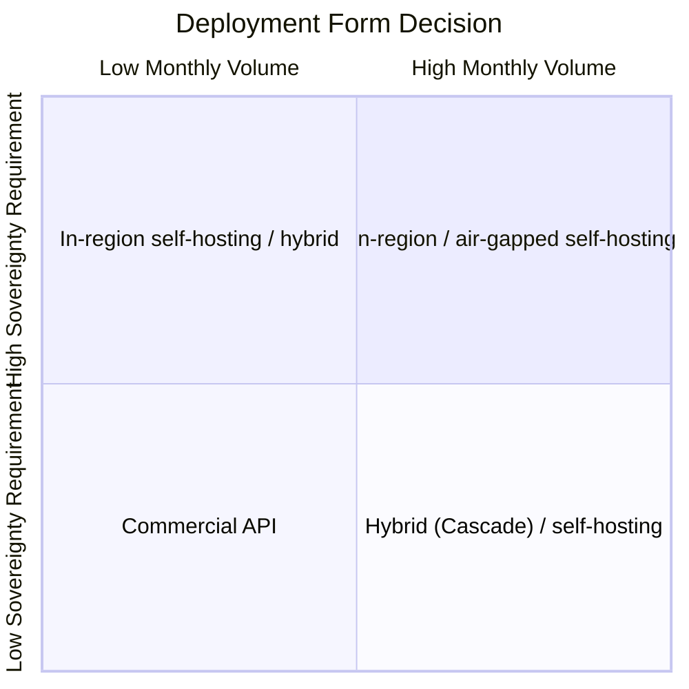
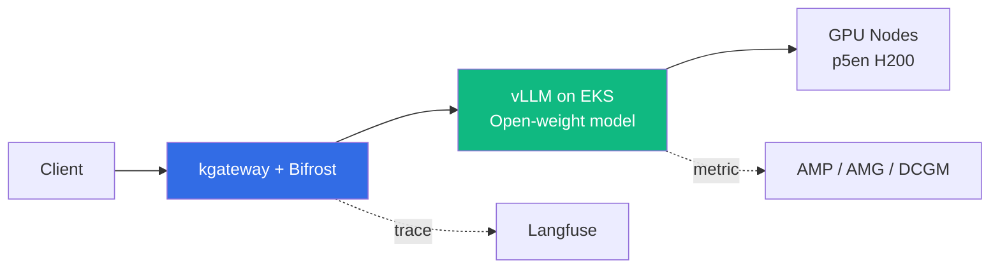

## Overview

This document is a decision guide for customers evaluating whether to self-host open-weight large language models in place of commercial APIs. It centers on two value drivers. The first is **Token Economics** — the break-even between per-token pricing of commercial APIs and the fixed-cost structure of self-hosting. The second is **Data Sovereignty** — regulatory requirements that data and inference must not leave controlled regions and VPC boundaries. The intended audience is architects and decision makers in regulated industries such as finance and the public sector.

This document focuses on decisions and trade-offs. For the higher-level platform-selection framework, see [AI Platform Decision Framework](../../design-architecture/platform-selection/ai-platform-decision-framework.md); for the detailed derivation of cost figures, see [Coding Tools Cost Analysis](./coding-tools-cost-analysis.md); and for the deployment implementation procedure, see [Custom Model Deployment Guide](../model-lifecycle/custom-model-deployment.md).

---

## Background: Why Open-Weight Now

Open-weight models are models whose weights are publicly released, allowing inference on customer-controlled infrastructure. Entering 2026, both licensing and performance have changed the premises for the self-hosting decision.

- **Spread of permissive licenses**: Many flagship open-weight models are released under MIT or Apache 2.0. For example, Z.ai's GLM-5.2 was released under the MIT license ([Z.ai blog](https://z.ai/blog/glm-5.2)). This is distinct from the era when license constraints were an obstacle to self-hosting and commercial use.
- **Approaching frontier-grade performance**: Open-weight models' coding and reasoning benchmarks have closed the gap with commercial models. However, benchmark numbers vary by source and evaluation conditions, so they must be validated against customer workloads before adoption.
- **Limits of commercial-API dependence**: Per-token pricing scales costs linearly as volume grows. In addition, prompts and outputs traverse external services, making data sovereignty requirements difficult to satisfy.

:::info Model naming and version verification
Model specifications and versions change quickly. The model examples in this document are based on publicly available information as of the time of writing (2026-06); model cards and inference-engine compatibility must be reconfirmed before adoption.
:::

---

## Pillar 1 — Token Economics

### Differences in Pricing Structure

Commercial APIs and self-hosting incur cost in different ways.

| Aspect | Commercial API | Self-hosting (EKS + vLLM) |
|------|----------|----------------------|
| Cost model | Per-token (metered) | Per-GPU-hour fixed cost |
| Volume sensitivity | Scales linearly with usage | Volume-independent (within capacity) |
| Initial cost | None | GPU and operations setup |
| Marginal cost | Incurred per request | Approaches 0 (within capacity) |

Commercial APIs are advantageous at low volume, while self-hosting yields a lower effective per-token cost once a certain volume is exceeded. The crossover is the break-even point.

### Break-Even Analysis

Detailed break-even simulations (cost tables by monthly request volume; Cascade and Spot savings) are covered in [Coding Tools Cost Analysis](./coding-tools-cost-analysis.md). Only the core baselines are summarized here.

- The break-even between commercial APIs and 24/7 self-hosting forms at the scale of several million requests per month.
- Applying Cascade Routing (simple requests to SLM, complex requests only to large models) significantly lowers the break-even volume.
- Operating only during business hours (8 hours/day) or using Spot instances lowers the fixed cost itself.

When applying this logic to open-weight models in general, the variables are **model throughput** and **GPU requirements**. Higher throughput on the same GPU budget yields a lower per-token cost.

### Hidden Costs

The total cost of ownership (TCO) of self-hosting is not just the GPU bill. The decision must include:

- **Engineering and operations staff**: FTEs for deployment, upgrades, and incident response. Model swaps and inference-engine version management are ongoing.
- **Cold start**: Large models have weights of hundreds of GB. The first launch's download and load time affects availability.
- **GPU idle**: GPU cost when there is no traffic. EKS scale-to-zero can cut idle cost, but it conflicts with cold start, so a balance is needed.

For an AIDLC-perspective TCO framework, see [Enterprise Cost Estimation](../../../aidlc/enterprise/cost-estimation.md).

### Performance Is Effectively Unit Cost

In self-hosting, inference performance optimization directly lowers per-token unit cost. Higher throughput on the same GPU generates more tokens at the same cost. The main levers are:

- **Quantization**: FP8 and INT4 weights reduce required GPU memory and GPU count. However, quality loss is possible, so workload-specific validation is required. The credibility of official checkpoints versus community-quantized versions must be distinguished (see warning below).
- **vLLM engine tuning**: PagedAttention, FP8 KV cache, prefix caching, chunked prefill, and Multi-Token Prediction (MTP)-based speculative decoding raise throughput. `--gpu-memory-utilization`, `--max-num-batched-tokens`, `--max-num-seqs`, and `--max-model-len` are the key flags that tune concurrency and memory usage. For details on these concepts, see [vLLM Model Serving](../../model-serving/inference-frameworks/vllm-model-serving.md).
- **Local NVMe storage**: Using instance store (NVMe SSD) as a model cache speeds up cold start and KV offload. Availability depends on the node provisioning method (see the infrastructure section below).
- **EFA (Elastic Fabric Adapter)**: Determines node-to-node KV transfer bandwidth in multi-node distributed inference. No effect on single-node inference (which uses NVLink/NVSwitch within the node).

:::caution Verify community-quantized checkpoints
HuggingFace hosts many third-party quantized checkpoints. Using weights without verifying source, calibration, and licensing in production carries quality and security risks. Prefer the model provider's official quantized version when possible, and adopt community-quantized versions only after internal evaluation.
:::

---

## Pillar 2 — Data Sovereignty

### Four Levels of Sovereignty Requirements

Data sovereignty requirements are a spectrum rather than a single threshold. The [AI Platform Decision Framework](../../design-architecture/platform-selection/ai-platform-decision-framework.md) breaks them into four levels.

| Sovereignty Level | Inference Location | Recommended Approach |
|----------|----------|----------|
| Public | No region constraint | Commercial API / AWS Native |
| In-country | Pinned to in-country region | Region enforcement + in-region self-hosting |
| Hybrid | On-premises + in-country | EKS Hybrid Nodes + self-hosting |
| Air-gapped | Fully isolated | On-premises EKS only |

The stronger the requirement, the lower the managed-service dependence and the larger the share of self-hosting and on-premises. For SCP region enforcement and EKS Hybrid Nodes implementation, see [Sovereign & Hybrid Deployment](../../design-architecture/platform-selection/sovereign-hybrid-deployment.md).

### What Self-Hosting Guarantees

Self-hosting open-weight models offers the following for sovereignty requirements.

- **In-boundary processing of data and inference**: Prompts, outputs, and embeddings never leave controlled VPCs and regions.
- **No external transmission**: Inference traffic does not go to external model providers, so the data egress path itself is removed.
- **Auditability**: Inference traces and access logs are kept in-house systems to address audit requirements.

### Application of Korean Regulations

Detailed controls mapping the e-Finance Supervisory Regulation, ISMS-P, SOC2, and ISO 27001 to AI operations are covered in [Enterprise Compliance Framework](../../operations-mlops/governance/compliance-framework.md). From a deployment-form perspective, the key points are:

- In-region self-hosting forms the infrastructure-level foundation that satisfies data-location and access-control requirements (e-Finance Supervisory Regulation Articles 15 and 17, ISMS-P 2.6).
- Self-hosting alone does not complete compliance. Implementation of control items such as access control, encryption, audit logs, and PII controls is also required.

### Sovereignty Premium

Meeting sovereignty requirements incurs additional cost. Decisions must quantify these.

- **Region premium**: GPU instance unit prices differ by region. For example, the p5en.48xlarge On-Demand price in Tokyo (ap-northeast-1) is about 25% higher than in us-east-1 (see the infrastructure section below). Region pinning may entail unit-price increases.
- **Regulatory operations cost**: Audit response, evidence production, and the staffing and time imposed by deployment constraints.
- **Opportunity cost**: The self-implementation burden incurred by giving up managed features such as Bedrock AgentCore and SageMaker.

---

## Intersection of the Two Drivers — Decision Matrix

Placing token economics (monthly inference volume) and data sovereignty requirements on two axes organizes deployment forms into four quadrants.

| | Low Sovereignty Requirement | High Sovereignty Requirement |
|---|---------------|---------------|
| **Low Volume** | Commercial API (fastest to start) | In-region self-hosting (small scale) or hybrid |
| **High Volume** | Hybrid (Cascade) or cost-driven self-hosting | In-region / air-gapped self-hosting |

Two principles guide interpretation:

- **If sovereignty is a hard constraint, apply it first.** When sovereignty requires in-country or stronger, self-hosting or hybrid is enforced ahead of cost and volume conclusions.
- **If sovereignty is soft, volume decides.** Without sovereignty constraints, the break-even volume is the criterion for choosing between commercial APIs and self-hosting.

For customer-meeting discovery questions, use the checklist in [AI Platform Decision Framework](../../design-architecture/platform-selection/ai-platform-decision-framework.md).

---

## Reference Architecture Summary

The standard form that satisfies both sovereignty and cost is in-region EKS-hosted vLLM self-hosting.

Details of the deployment implementation (image build, S3 caching, multi-node LeaderWorkerSet, incident cases) are covered in [Custom Model Deployment Guide](../model-lifecycle/custom-model-deployment.md), and GPU-node provisioning choice is covered in [EKS GPU Node Strategy](../../model-serving/gpu-infrastructure/eks-gpu-node-strategy.md).

### Impact of Infrastructure Choice on Cost and Sovereignty

The GPU-node provisioning method determines the achievable range of performance optimization. The following are constraints verified against primary sources.

- **Local NVMe**: EKS Auto Mode does not support a CSI driver that exposes instance store as a Pod volume, and the NodeClass `ephemeralStorage` configures an EBS volume. The standard Karpenter `EC2NodeClass` can use `instanceStorePolicy: RAID0` to RAID0 local NVMe ([EKS Auto Mode NodeClass](https://docs.aws.amazon.com/eks/latest/userguide/create-node-class.html)).
- **EFA**: EKS Auto Mode supports the EFA device plugin, but per-device `efa-only` interface configuration is unsupported as of this writing. Maximum-bandwidth configuration is possible only via `networkInterfaces` on the standard Karpenter `EC2NodeClass` (Karpenter v1.11+). p5.48xlarge and p5en.48xlarge support 32 network cards and 3,200 Gbps ([Manage EFA devices on Amazon EKS](https://docs.aws.amazon.com/eks/latest/userguide/device-management-efa.html), [Maximize network bandwidth](https://docs.aws.amazon.com/AWSEC2/latest/UserGuide/efa-acc-inst-types.html)).
- **Conclusion**: Single-node inference can be served with EKS Auto Mode. High-performance multi-node deployments that exploit local NVMe and maximum EFA bandwidth require the standard Karpenter node pool.

:::info GPU instance pricing
p5en.48xlarge (8×H200, 1,128 GiB GPU memory, EFAv3 3,200 Gbps) is available in the Tokyo (ap-northeast-1) region ([AWS News](https://aws.amazon.com/blogs/aws/new-amazon-ec2-p5en-instances-with-nvidia-h200-tensor-core-gpus-and-efav3-networking/)). On-Demand pricing is reported around $63/hr in us-east-1 and around $79/hr in Tokyo. Prices change frequently; for actual figures, see the [AWS official pricing page](https://aws.amazon.com/ec2/instance-types/p5/).
:::

---

## Summary

Self-hosting open-weight models is decided by two drivers: token economics and data sovereignty. If sovereignty requires in-country or stronger, in-region self-hosting or hybrid is selected ahead of cost and volume. Without sovereignty constraints, the criterion is whether monthly inference volume crosses break-even. In self-hosting, performance optimization — quantization, vLLM tuning, NVMe, EFA — directly lowers per-token unit cost. Node provisioning choice (Auto Mode vs standard Karpenter) governs the achievable range of optimization and must be decided together with deployment form.

---

## References

### Official Documentation

- [Manage EFA devices on Amazon EKS](https://docs.aws.amazon.com/eks/latest/userguide/device-management-efa.html) — EKS EFA device-plugin and DRA support scope
- [Create a Node Class for Amazon EKS](https://docs.aws.amazon.com/eks/latest/userguide/create-node-class.html) — EKS Auto Mode NodeClass specification
- [Amazon EC2 P5 Instances](https://aws.amazon.com/ec2/instance-types/p5/) — p5 and p5en GPU instance specs and pricing
- [Z.ai GLM-5.2 blog](https://z.ai/blog/glm-5.2) — Example of an open-weight model's license and architecture

### Related Documents (Internal)

- [AI Platform Decision Framework](../../design-architecture/platform-selection/ai-platform-decision-framework.md) — High-level decision: managed vs open-source vs hybrid
- [Coding Tools Cost Analysis](./coding-tools-cost-analysis.md) — Detailed break-even, Cascade, and Spot cost simulations
- [Enterprise Compliance Framework](../../operations-mlops/governance/compliance-framework.md) — Mapping to e-Finance Supervisory Regulation, ISMS-P, and SOC2
- [Custom Model Deployment Guide](../model-lifecycle/custom-model-deployment.md) — Detailed EKS deployment for large open-weight models
- [EKS GPU Node Strategy](../../model-serving/gpu-infrastructure/eks-gpu-node-strategy.md) — Auto Mode vs Karpenter node provisioning
