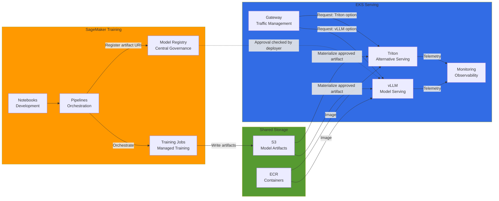
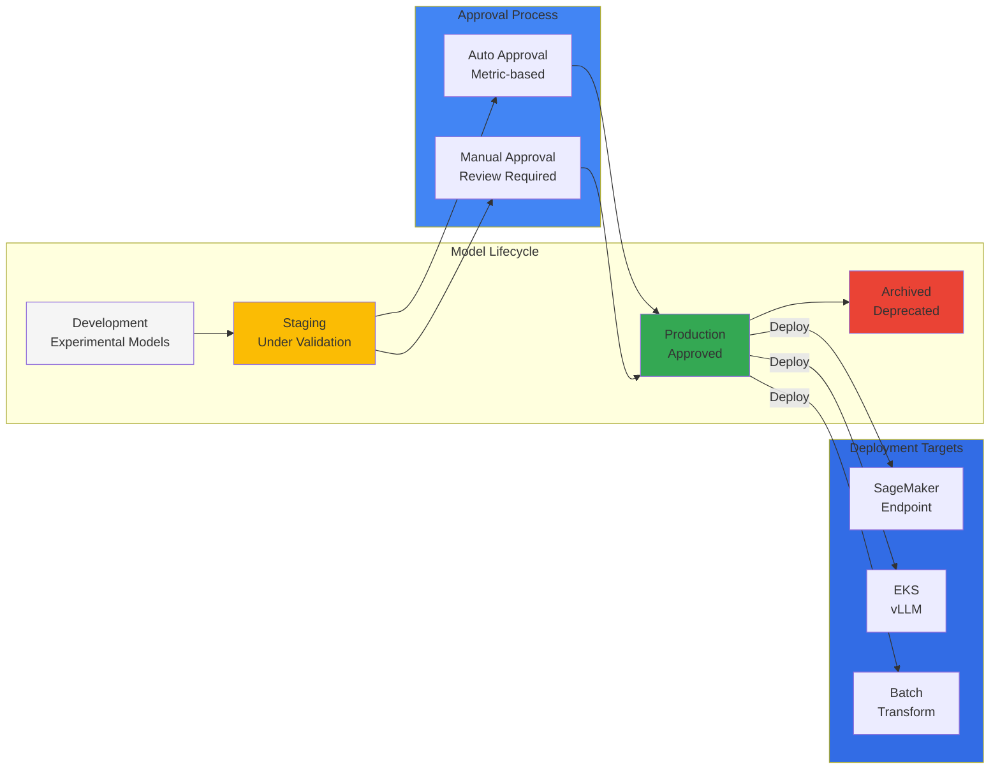
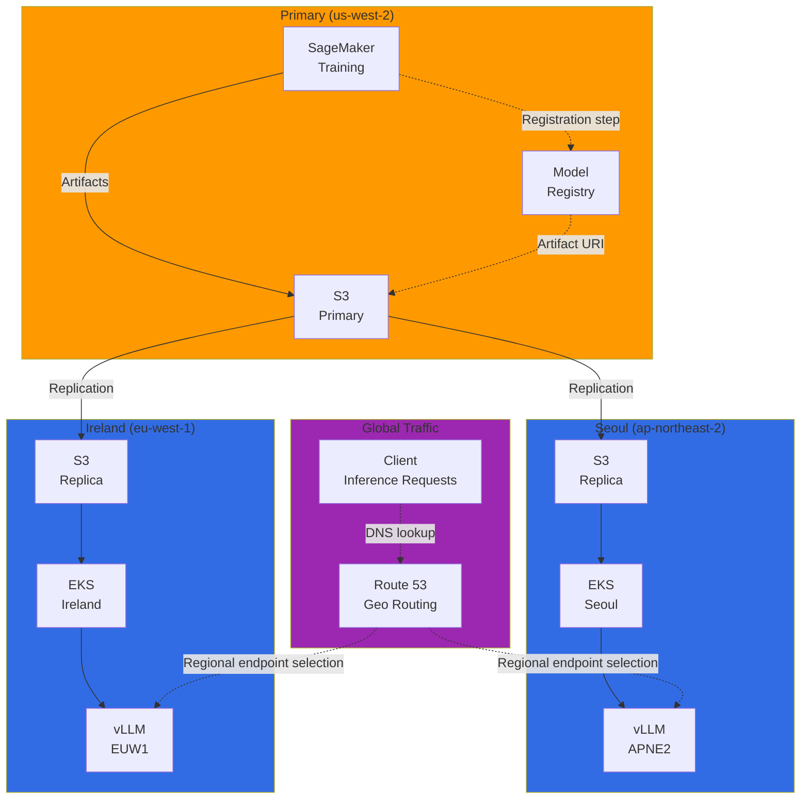
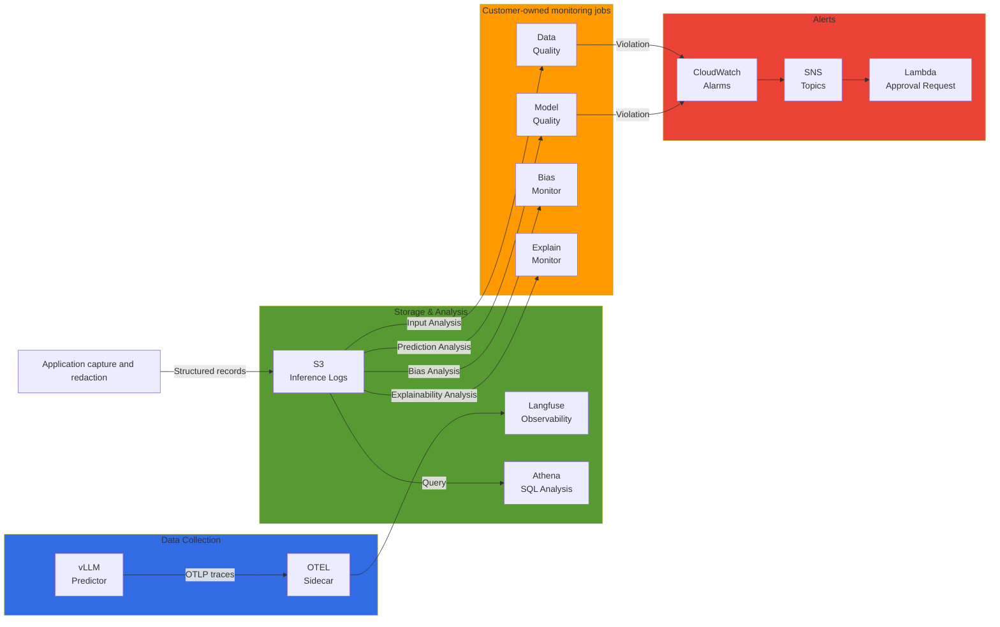

import SpecificationTable from '@site/src/components/tables/SpecificationTable';
import { HybridComparison, CostOptimization } from '@site/src/components/SagemakerTables';

## Overview

This design trains a model on SageMaker, then loads the approved model files into an inference service on EKS. SageMaker manages the training infrastructure while the team controls serving through Kubernetes. The team also implements artifact transfer, release approval and observability; compare costs using actual usage.

<HybridComparison />


## Hybrid Architecture Patterns

### Overall Architecture Overview



Pipelines orchestrates training; Registry references artifact URIs and metadata. vLLM and Triton are alternative serving paths here. A separate Triton configuration can use its vLLM backend, but this diagram does not imply two serial servers or a generic GPU-optimization layer.

### Pattern 1: SageMaker Training -> EKS Serving

**Use Case:** Large-scale distributed training, reduced training infrastructure management burden, fine-grained control over serving environment

### Pattern 2: EKS Training -> SageMaker Serving

**Use Case:** Custom training frameworks, Kubernetes-native training tools (Kubeflow, Ray)

### Pattern 3: Hybrid Serving

**Use Case:** High-availability production, multi-region, A/B testing

---

## SageMaker Pipelines Integration

### SageMaker Components for Kubeflow Pipelines

These are **custom KFP v2 wrappers** around the SageMaker SDK, not the official AWS component package. The reference versions are `kfp==2.7.0` and `sagemaker==2.200.0`. The pipeline trains and registers a package, then stops at `PendingManualApproval`. EKS deployment is a separate release phase using the approval-checking adapter below.

The required BYOC `training_image` must contain the actual training program and dependencies. Implement and verify reading `/opt/ml/input/data/training` and writing a vLLM-supported Hugging Face causal-LM configuration, tokenizer and safetensors weights to `/opt/ml/model`. A generic PyTorch image does not supply a training algorithm, and an arbitrary fraud-detection model is not necessarily compatible with vLLM. `inference_image` must be separately validated for the registered artifact and API contract. No image build or training run has been performed here.

```python
# Custom wrappers, not the AWS-provided Kubeflow component package.
# Reference SDKs: kfp==2.7.0 and sagemaker==2.200.0; compile only after pinning images.
from kfp import dsl


@dsl.component(base_image='python:3.10-slim', packages_to_install=['sagemaker==2.200.0'])
def train(training_image: str, role_arn: str, s3_input: str, s3_output: str,
          hyperparameters: dict, region: str) -> str:
    import boto3
    import sagemaker
    from sagemaker.estimator import Estimator
    if '@sha256:' not in training_image:
        raise ValueError('supply a reviewed BYOC training image digest')
    estimator = Estimator(image_uri=training_image, role=role_arn,
        instance_count=2, instance_type='ml.g5.2xlarge',
        output_path=s3_output, hyperparameters=hyperparameters,
        max_run=43200, sagemaker_session=sagemaker.Session(
            boto_session=boto3.Session(region_name=region)))
    estimator.fit({'training': s3_input}, wait=True)
    return estimator.model_data


@dsl.component(base_image='python:3.10-slim', packages_to_install=['sagemaker==2.200.0'])
def register(model_data: str, group: str, inference_image: str, role_arn: str,
             region: str) -> str:
    import boto3
    import hashlib
    from urllib.parse import urlparse
    import sagemaker
    from sagemaker.model import Model
    session = boto3.Session(region_name=region)
    uri = urlparse(model_data)
    response = session.client('s3').get_object(Bucket=uri.netloc, Key=uri.path.lstrip('/'))
    digest = hashlib.sha256()
    try:
        if not response.get('VersionId') or response['VersionId'] == 'null':
            raise ValueError('enable bucket versioning before training')
        for chunk in response['Body'].iter_chunks(chunk_size=1024 * 1024):
            digest.update(chunk)
    finally:
        response['Body'].close()
    model = Model(image_uri=inference_image, model_data=model_data, role=role_arn,
                  sagemaker_session=sagemaker.Session(boto_session=session))
    package = model.register(content_types=['application/json'], response_types=['application/json'],
        model_package_group_name=group, approval_status='PendingManualApproval',
        customer_metadata_properties={'artifact_sha256': digest.hexdigest(),
            'artifact_version_id': response['VersionId'], 'artifact_format': 'hf-causal-lm-tar-v1'})
    return package.model_package_arn


@dsl.pipeline(name='sagemaker-to-eks-training-and-registration')
def hybrid_ml_pipeline(training_image: str, inference_image: str, role_arn: str,
                       s3_input: str, s3_output: str, group: str,
                       hyperparameters: dict, region: str = 'us-west-2'):
    trained = train(training_image=training_image, role_arn=role_arn, s3_input=s3_input,
        s3_output=s3_output, hyperparameters=hyperparameters, region=region)
    trained.set_caching_options(False)
    registered = register(model_data=trained.output, group=group,
        inference_image=inference_image, role_arn=role_arn, region=region)
    registered.set_caching_options(False)
    # Deliberately no deploy task: PendingManualApproval must not reach EKS.


# Submission is a separate, authorized operation; arguments must name real reviewed artifacts:
# kfp.Client(host=KFP_HOST).create_run_from_pipeline_func(
#     hybrid_ml_pipeline, arguments=reviewed_arguments,
#     namespace='training-pipeline', service_account='sagemaker-pipeline', enable_caching=False)
```

Use the run-level `service_account`; do not use legacy `task.apply(use_aws_secret(...))`. A platform administrator configures IAM integration for `training-pipeline/sagemaker-pipeline`. The pipeline role needs scoped training creation/description, model registration/read, artifact read and `iam:PassRole` on the exact execution role. Separately scope the SageMaker execution role’s S3/ECR/KMS access, the EKS deployer’s namespace RBAC and the model loader’s GetObjectVersion permission. Do not inject static AWS access keys into Pods. For operation, replace install-at-runtime dependencies with a reviewed lockfile and a digest-pinned image.


---

## SageMaker Model Registry Governance

### Centralized Model Management

Recording approval in Registry does not make EKS enforce it automatically. The lifecycle and approval flow below are application policy. Distinguish deployment behavior supplied by SageMaker project templates from your EKS deployer. Pin an approved **versioned package ARN** in the release and re-check its state immediately before deployment. Revoking approval does not automatically recall existing Pods or restore routing.



### Model Registry Setup

Prepare the Model Package Group once under a separate administrative role. Declaring an arbitrary `Rules` dict does not install an AWS approval policy. This function uses the actual `UpdateModelPackage` API after the application verifies evaluation evidence and reviewer authorization. The 0.95 accuracy threshold is example policy, not a complete quality criterion for generative models. Bind the actual report to model version, evaluation data and metric definitions.

```python
# model_registry_approval.py -- explicit approval after reviewing the release evidence.
def create_group(sm, name):
    # Administrative one-time operation for a NEW group; do not call on every deployment.
    return sm.create_model_package_group(ModelPackageGroupName=name,
        ModelPackageGroupDescription='Reviewed model releases for EKS serving',
        Tags=[{'Key': 'Team', 'Value': 'ml-platform'}, {'Key': 'Environment', 'Value': 'production'}])


def approve_release(sm, *, package_arn, verified_report):
    # The caller authenticates the report, dataset/model digest and reviewer authorization.
    # A mutable dict supplied by the model or an untrusted caller is not approval evidence.
    from math import isfinite
    if verified_report.get('model_package_arn') != package_arn:
        raise ValueError('report/package mismatch')
    accuracy = verified_report.get('accuracy')
    if type(accuracy) not in (int, float) or not isfinite(accuracy) or not 0 <= accuracy <= 1:
        raise ValueError('invalid accuracy')
    if verified_report.get('approved_by_reviewer') is not True or accuracy < 0.95:
        raise ValueError('reviewer approval and example accuracy threshold are required')
    package = sm.describe_model_package(ModelPackageName=package_arn)
    if package['ModelPackageStatus'] != 'Completed':
        raise ValueError('package registration is incomplete')
    sm.update_model_package(ModelPackageArn=package_arn, ModelApprovalStatus='Approved',
        ApprovalDescription='Release evidence reviewed; EKS deployer re-checks this version')
```

See the scopes of [approval and deployment](https://docs.aws.amazon.com/sagemaker/latest/dg/model-registry-approve.html) and [UpdateModelPackage](https://docs.aws.amazon.com/sagemaker/latest/APIReference/API_UpdateModelPackage.html). Permission to approve a package should not automatically grant arbitrary EKS resource writes.

### Querying Model Registry from EKS

This adapter uses the `kubernetes==30.1.0` Python API and does not require a `kubectl` executable. The approved release manifest records `source_uri`, `artifact_sha256`, `artifact_version_id` and `artifact_format: hf-causal-lm-tar-v1`. Pin the actual `region`, `bucket`, `key` and `version_id` in each `target`. Use only a reviewed manifest whose source and replicas have the same digest. Do not substitute strings in S3 URLs or resolve “latest” during each deployment.

Derive a distinct Deployment and Service name from the versioned package ARN and artifact digest. The adapter creates candidate resources only when both names are absent; it never updates an existing resource. Same-release retries and create-time conflicts also fail. Inspect and clean up any partially created candidate within that release scope. Switch routing separately after readiness and response verification, retaining the previous stable release until its connections drain.

```python
# eks_model_loader.py -- deployment adapter; Kubernetes Python client 30.1.0.
import hashlib
import re
import time
from urllib.parse import urlparse


def approved_release(sm, package_arn, release):
    match = re.fullmatch(r'arn:aws:sagemaker:([^:]+):(\d{12}):model-package/([^/]+)/([1-9]\d*)', package_arn)
    if not match or sm.meta.region_name != match[1]:
        raise ValueError('use a versioned model-package ARN and its registry Region')
    package = sm.describe_model_package(ModelPackageName=package_arn)
    if package.get('ModelPackageArn') != package_arn:
        raise ValueError('unexpected package')
    if package.get('ModelPackageStatus') != 'Completed' or package.get('ModelApprovalStatus') != 'Approved':
        raise ValueError('deployment blocked: package must be Completed and Approved')
    containers = package.get('InferenceSpecification', {}).get('Containers', [])
    if len(containers) != 1 or containers[0].get('ModelDataUrl') != release['source_uri']:
        raise ValueError('release does not match the single registered artifact')
    metadata = package.get('CustomerMetadataProperties', {})
    for key in ('artifact_sha256', 'artifact_version_id', 'artifact_format'):
        if not release.get(key) or metadata.get(key) != release[key]:
            raise ValueError(f'registered {key} does not match the approved release')
    if not re.fullmatch('[0-9a-f]{64}', release['artifact_sha256']):
        raise ValueError('invalid artifact digest')
    if release['artifact_format'] != 'hf-causal-lm-tar-v1' or release['artifact_version_id'] == 'null':
        raise ValueError('unsupported artifact contract')
    uri = urlparse(release['source_uri'])
    if uri.scheme != 's3' or not uri.netloc or not uri.path.strip('/') or uri.query or uri.fragment:
        raise ValueError('invalid registered S3 URI')
    return package


def release_resource_name(package_arn, artifact_sha256):
    if not re.fullmatch(
        r"arn:aws:sagemaker:[^:]+:\d{12}:model-package/[^/]+/[1-9]\d*",
        package_arn,
    ):
        raise ValueError("a versioned model-package ARN is required")
    if not re.fullmatch(r"[0-9a-f]{64}", artifact_sha256):
        raise ValueError("a SHA-256 artifact digest is required")
    identity = f"{package_arn}\0{artifact_sha256}".encode()
    return "vllm-r-" + hashlib.sha256(identity).hexdigest()[:32]


def create_candidate_resources(
    apps, core, deployment, service, *,
    package_arn, artifact_sha256, api_exception_type,
):
    """Read both names first, then create only absent candidate resources.

    Any existing resource rejects this attempt, even for the same identity.
    A create-time race raises to the caller. Never fall back to patch.
    Partial candidate creation can remain and needs explicit scoped cleanup.
    """
    expected = release_resource_name(package_arn, artifact_sha256)
    dep_meta, svc_meta = deployment["metadata"], service["metadata"]
    namespace = dep_meta["namespace"]
    if (
        dep_meta["name"] != expected or svc_meta["name"] != expected
        or svc_meta["namespace"] != namespace
    ):
        raise ValueError("candidate resources must use the derived release identity")
    labels = {"app": expected}
    template = deployment["spec"]["template"]["metadata"]
    if (
        deployment["spec"]["selector"]["matchLabels"] != labels
        or template["labels"] != labels
        or service["spec"]["selector"] != labels
        or template["annotations"].get("model-package-arn") != package_arn
        or template["annotations"].get("artifact-sha256") != artifact_sha256
    ):
        raise ValueError("candidate selectors/package/digest do not match the release")

    existing = []
    for read in (apps.read_namespaced_deployment, core.read_namespaced_service):
        try:
            found = read(name=expected, namespace=namespace, _request_timeout=(5, 30))
        except api_exception_type as exc:
            if exc.status != 404:
                raise
            found = None
        existing.append(found)
    if any(item is not None for item in existing):
        raise ValueError("candidate name already exists; automatic updates/resume are forbidden")

    apps.create_namespaced_deployment(
        namespace=namespace, body=deployment, _request_timeout=(5, 30))
    core.create_namespaced_service(
        namespace=namespace, body=service, _request_timeout=(5, 30))
    return expected


def manifests(name, namespace, package_arn, release, target, loader_image):
    if not re.fullmatch(r'[a-z0-9](?:[a-z0-9-]{0,61}[a-z0-9])?', name):
        raise ValueError('invalid DNS name')
    if not re.fullmatch(r'[^\s]+@sha256:[0-9a-f]{64}', loader_image):
        raise ValueError('supply an approved loader image pinned by digest')
    labels = {'app': name}
    env = [{'name': k, 'value': v} for k, v in {
        'ARTIFACT_REGION': target['region'], 'ARTIFACT_BUCKET': target['bucket'],
        'ARTIFACT_KEY': target['key'], 'ARTIFACT_VERSION': target['version_id'],
        'ARTIFACT_SHA256': release['artifact_sha256'],
    }.items()]
    pod = {
        'serviceAccountName': 'vllm-model-reader',
        'initContainers': [{
            'name': 'materialize-model', 'image': loader_image,
            'command': ['python', '/scripts/model_artifact.py'], 'env': env,
            'resources': {'requests': {'cpu': '1', 'memory': '512Mi', 'ephemeral-storage': '130Gi'},
                          'limits': {'cpu': '2', 'memory': '1Gi', 'ephemeral-storage': '160Gi'}},
            'volumeMounts': [{'name': 'model', 'mountPath': '/model'},
                             {'name': 'scripts', 'mountPath': '/scripts', 'readOnly': True}],
        }],
        'containers': [{
            'name': 'vllm-server', 'image': 'vllm/vllm-openai:v0.23.0',
            'args': ['--model', '/model', '--served-model-name', name,
                     '--tensor-parallel-size', '1', '--max-model-len', '4096'],
            'ports': [{'containerPort': 8000, 'name': 'http'}],
            'startupProbe': {'httpGet': {'path': '/health', 'port': 'http'},
                             'periodSeconds': 10, 'failureThreshold': 180},
            'readinessProbe': {'httpGet': {'path': '/health', 'port': 'http'}, 'periodSeconds': 10},
            'resources': {'requests': {'cpu': '2', 'memory': '16Gi', 'nvidia.com/gpu': '1'},
                          'limits': {'cpu': '4', 'memory': '32Gi', 'nvidia.com/gpu': '1'}},
            'volumeMounts': [{'name': 'model', 'mountPath': '/model', 'readOnly': True}],
        }],
        'volumes': [{'name': 'model', 'emptyDir': {'sizeLimit': '64Gi'}},
                    {'name': 'scripts', 'configMap': {'name': 'model-loader-code'}}],
    }
    deployment = {'apiVersion': 'apps/v1', 'kind': 'Deployment',
        'metadata': {'name': name, 'namespace': namespace},
        'spec': {'replicas': 2, 'selector': {'matchLabels': labels},
                 'template': {'metadata': {'labels': labels, 'annotations': {
                     'model-package-arn': package_arn, 'artifact-sha256': release['artifact_sha256']}},
                     'spec': pod}}}
    service = {'apiVersion': 'v1', 'kind': 'Service',
        'metadata': {'name': name, 'namespace': namespace},
        'spec': {'type': 'ClusterIP', 'selector': labels,
                 'ports': [{'name': 'http', 'port': 8000, 'targetPort': 'http'}]}}
    return deployment, service


def deploy_approved(sm, apps, core, *, package_arn, release, target, name, namespace,
                    loader_image, verify_endpoint, timeout=1800):
    # release/target are approved, immutable release-manifest inputs, not model-generated text.
    approved_release(sm, package_arn, release)  # Re-check at the mutation boundary.
    deployment, service = manifests(name, namespace, package_arn, release, target, loader_image)
    from kubernetes.client.exceptions import ApiException
    create_candidate_resources(apps, core, deployment, service,
        package_arn=package_arn, artifact_sha256=release['artifact_sha256'],
        api_exception_type=ApiException)
    deadline = time.monotonic() + timeout
    while time.monotonic() < deadline:
        actual = apps.read_namespaced_deployment(name, namespace, _request_timeout=(5, 30))
        status = actual.status
        if ((status.observed_generation or 0) >= actual.metadata.generation
                and status.updated_replicas == 2 and status.available_replicas == 2
                and status.replicas == 2):
            endpoint = f'http://{name}.{namespace}.svc.cluster.local:8000'
            # Caller must verify /v1/models and an approved smoke request from this cluster.
            # The callback raises on failure; it is not a default-true placeholder.
            if verify_endpoint(endpoint, name, release['artifact_sha256']) is not True:
                raise ValueError('endpoint identity/smoke verification failed')
            return {'status': 'ready', 'endpoint': endpoint, 'package_arn': package_arn}
        time.sleep(5)
    raise TimeoutError('deployment did not become ready; retain the last stable route')
```

Place the following loader in `model-loader-code` and run it in a reviewed digest-pinned image containing boto3. Give `vllm-model-reader` only access to the required object versions and KMS decryption. The deployer uses in-cluster configuration or an explicit kube context with namespace-scoped Deployment/Service get/create permissions. Separately scope the Pod/EndpointSlice get/list permissions needed by the verifier. An init container downloads the versioned S3 object, verifies SHA-256 and safely unpacks the model directory. Do not pass the tar archive itself to `--model`. vLLM’s separate S3 loader capabilities are distinct from this tar-artifact contract.

```python
# model_artifact.py -- Python 3.12+, boto3 in a prebuilt, reviewed loader image.
import hashlib
import json
import os
from pathlib import Path, PurePosixPath
import tarfile
import tempfile


def extract_model(archive, destination, expected_sha256, max_bytes=64 * 1024**3):
    destination = Path(destination)
    if any(destination.iterdir()):
        raise ValueError('model destination must be empty')
    digest = hashlib.sha256()
    with open(archive, 'rb') as source:
        while chunk := source.read(1024 * 1024):
            digest.update(chunk)
    if digest.hexdigest() != expected_sha256:
        raise ValueError('artifact SHA-256 mismatch')
    with tarfile.open(archive, 'r:gz') as tar:
        members, names, total = [], set(), 0
        # Validate every member before extracting any member.
        for member in tar:
            name = PurePosixPath(member.name)
            normalized = str(name)
            if name.is_absolute() or '..' in name.parts or '\\' in member.name:
                raise ValueError('unsafe archive path')
            if not (member.isdir() or member.isfile()) or normalized in names:
                raise ValueError('links, special files and duplicate paths are forbidden')
            if normalized in ('', '.') and not member.isdir():
                raise ValueError('invalid archive root')
            names.add(normalized)
            total += member.size
            if member.size < 0 or total > max_bytes or len(names) > 100_000:
                raise ValueError('unpacked artifact exceeds limits')
            members.append(member)
        required = {'config.json', 'tokenizer_config.json'}
        if not required <= names or not any(n.endswith('.safetensors') for n in names):
            raise ValueError('expected a root-level Hugging Face causal-LM artifact')
        if not any(n in names for n in ('tokenizer.json', 'tokenizer.model', 'vocab.json')):
            raise ValueError('tokenizer assets missing')
        tar.extractall(destination, members=members, filter='data')
    config = json.loads((destination / 'config.json').read_text())
    if not isinstance(config.get('model_type'), str):
        raise ValueError('invalid model config')
    # Format checks do not prove vLLM architecture support or GPU memory fit.
    (destination / 'artifact.sha256').write_text(expected_sha256 + '\n')


def download_and_extract(s3, bucket, key, version_id, expected_sha256, destination,
                         max_bytes=64 * 1024**3):
    if not version_id or version_id == 'null':
        raise ValueError('a non-null S3 object version is required')
    response = s3.get_object(Bucket=bucket, Key=key, VersionId=version_id)
    body = response['Body']
    try:
        if response.get('VersionId') != version_id or not 0 < response['ContentLength'] <= max_bytes:
            raise ValueError('unexpected S3 version or size')
        with tempfile.NamedTemporaryFile(suffix='.tar.gz') as archive:
            size = 0
            while chunk := body.read(1024 * 1024):
                size += len(chunk)
                if size > max_bytes:
                    raise ValueError('download exceeds limit')
                archive.write(chunk)
            if size != response['ContentLength']:
                raise ValueError('incomplete S3 body')
            archive.flush()
            extract_model(archive.name, destination, expected_sha256, max_bytes)
    finally:
        body.close()


if __name__ == '__main__':
    import boto3
    download_and_extract(
        boto3.client('s3', region_name=os.environ['ARTIFACT_REGION']),
        os.environ['ARTIFACT_BUCKET'], os.environ['ARTIFACT_KEY'],
        os.environ['ARTIFACT_VERSION'], os.environ['ARTIFACT_SHA256'], '/model',
    )
```

The one-GPU, memory, disk and startup limits are illustrative; validate architecture support and capacity for the actual model. `/health` alone does not verify quality or model identity. `verify_endpoint` is a required integration adapter that checks `/v1/models` served name, the Pod’s approved digest annotation/loader result and an approved smoke request from each cluster. It is not implemented or executed in this document. The adapter returns `ready` only after replica readiness and that verification. On failure, retain stable routing and recover using the previously approved version.


---

## Cost Optimization Strategies

### Training vs Serving Cost Analysis

<CostOptimization />

### Cost Optimization Checklist

This YAML is a **design checklist, not a configuration consumed by a service**. No controller for `auto_terminate`, `scale_down_delay`, `enable_gpu_sharing` or the nested lifecycle fields is supplied. AWS’s “up to 90%” Managed Spot Training saving is a conditional vendor upper bound, not a measurement of this architecture.

```yaml
# cost-optimization-config.yaml
training:
  # SageMaker Managed Spot Training (up to 90% savings)
  use_spot_instances: true
  max_wait_time_seconds: 86400  # 24 hours
  max_run_time_seconds: 43200   # 12 hours
  
  # Enable checkpointing (for Spot interruption recovery)
  checkpoint_s3_uri: s3://my-bucket/checkpoints/
  checkpoint_local_path: /opt/ml/checkpoints
  
  # Instance type optimization
  instance_type: ml.g5.2xlarge  # GPU training
  instance_count: 2
  
  # Auto-terminate after training completes
  auto_terminate: true

serving:
  # Karpenter Spot instances (discount varies; unmeasured here)
  capacity_type: spot
  
  # Auto-scaling configuration
  min_replicas: 1
  max_replicas: 10
  target_utilization: 70
  
  # Scale down delay on idle
  scale_down_delay: 300  # 5 minutes
  
  # GPU sharing (MIG or MPS)
  enable_gpu_sharing: false
  max_shared_clients: 4

storage:
  # S3 Intelligent-Tiering
  s3_storage_class: INTELLIGENT_TIERING
  
  # Archive old models
  lifecycle_policy:
    archive_after_days: 90
    delete_after_days: 365
```

| Item | Actual implementation point |
|---|---|
| Training Spot, time limits, checkpoints | Estimator `use_spot_instances`, `max_wait`, `max_run`, `checkpoint_s3_uri`, `checkpoint_local_path`; the training program implements checkpoint restore |
| Training termination | SageMaker releases training resources when the job completes, fails or stops; retained S3/ECR costs are separate |
| EKS Spot | Karpenter NodePool requirements and interruption handling; savings unmeasured |
| Replicas/scale-down delay | Configure actual HPA/KEDA metrics/behavior and node controllers separately |
| GPU sharing | Validate GPU, driver and device-plugin MIG/MPS compatibility before choosing it; a generic Boolean does not enable it |
| S3 tiers/expiration | Use the actual bucket lifecycle API and production artifact retention policy; do not apply this checklist as configuration |

### Cost Monitoring Dashboard

All SageMaker service costs are not the same as training costs. Filter training with an allowlist of training usage types verified in this payer account. The EKS example includes **only EC2 compute** carrying the activated `Workload=eks-model-serving` cost-allocation tag. It excludes EKS control-plane, EBS, S3, NAT/transfer, load-balancer and shared-resource costs; do not interpret it as total ownership cost or a platform ranking. Check tag activation, billing availability and untagged resources.

```python
# cost_monitoring.py -- returns explicitly scoped costs, not an EKS total-cost estimate.
from decimal import Decimal


def scoped_costs(ce, *, start, end, service, usage_types=None, tag=None):
    clauses = [{'Dimensions': {'Key': 'SERVICE', 'Values': [service]}}]
    if usage_types is not None:
        if not usage_types:
            raise ValueError('training usage-type allowlist must not be empty')
        clauses.append({'Dimensions': {'Key': 'USAGE_TYPE', 'Values': usage_types}})
    if tag:
        clauses.append({'Tags': {'Key': tag['key'], 'Values': [tag['value']]}})
    request = {'TimePeriod': {'Start': start, 'End': end}, 'Granularity': 'DAILY',
               'Metrics': ['UnblendedCost'],
               'Filter': clauses[0] if len(clauses) == 1 else {'And': clauses},
               'GroupBy': [{'Type': 'DIMENSION', 'Key': 'USAGE_TYPE'}]}
    rows, seen = [], set()
    while True:
        response = ce.get_cost_and_usage(**request)
        for day in response['ResultsByTime']:
            for group in day['Groups']:
                cost = group['Metrics']['UnblendedCost']
                amount = Decimal(cost['Amount'])
                if not amount.is_finite() or cost['Unit'] != 'USD':
                    raise ValueError('unexpected monetary unit or amount')
                rows.append({'period': day['TimePeriod'], 'usage_type': group['Keys'][0],
                             'amount_usd': str(amount), 'estimated': day['Estimated']})
        token = response.get('NextPageToken')
        if not token:
            return {'scope': request['Filter'], 'end_exclusive': end, 'rows': rows}
        if token in seen:
            raise ValueError('repeated Cost Explorer page token')
        seen.add(token)
        request['NextPageToken'] = token


# Supply actual billing usage types from this payer account; do not guess their names.
# training = scoped_costs(ce, start=start, end=end, service='Amazon SageMaker',
#                         usage_types=approved_training_usage_types)
# tagged_ec2 = scoped_costs(ce, start=start, end=end,
#     service='Amazon Elastic Compute Cloud - Compute',
#     tag={'key': 'Workload', 'value': 'eks-model-serving'})
```

Read every page and retain `Estimated`, currency and the inclusive-start/exclusive-end interval. No billing query has been executed.


---

## Multi-Region Deployment Pattern

### Global Model Deployment Architecture



Route 53 selects separately configured regional ingress endpoints through DNS; it does not proxy requests. This conceptual diagram relates replication, approved releases and regional serving, but does not configure global ingress. Do not assume that personalized generated responses are automatically cached by a CDN.

### S3 Cross-Region Replication Configuration

This is the ReplicationConfiguration body for `PutBucketReplication`. First configure versioning on source/destination buckets, the replication role assumed by S3, both bucket policies and required KMS permissions. Both filtered rules explicitly set `DeleteMarkerReplication` and configure Metrics alongside RTC. This JSON assumes SSE-S3 objects. SSE-KMS objects additionally need `SourceSelectionCriteria.SseKmsEncryptedObjects`, destination `EncryptionConfiguration.ReplicaKmsKeyID` and the corresponding permissions. RTC has additional charges and applicability conditions; it is not a guarantee that every object always arrives within 15 minutes. Existing objects and replication failures need separate handling.

```json
{
  "Role": "arn:aws:iam::123456789012:role/S3ReplicationRole",
  "Rules": [
    {
      "ID": "ReplicateModelsToAPNE2",
      "Status": "Enabled",
      "Priority": 1,
      "Filter": {
        "Prefix": "models/"
      },
      "Destination": {
        "Bucket": "arn:aws:s3:::my-models-ap-northeast-2",
        "ReplicationTime": {
          "Status": "Enabled",
          "Time": {
            "Minutes": 15
          }
        },
        "Metrics": {
          "Status": "Enabled",
          "EventThreshold": {
            "Minutes": 15
          }
        }
      },
      "DeleteMarkerReplication": {
        "Status": "Disabled"
      }
    },
    {
      "ID": "ReplicateModelsToEUW1",
      "Status": "Enabled",
      "Priority": 2,
      "Filter": {
        "Prefix": "models/"
      },
      "Destination": {
        "Bucket": "arn:aws:s3:::my-models-eu-west-1",
        "ReplicationTime": {
          "Status": "Enabled",
          "Time": {
            "Minutes": 15
          }
        },
        "Metrics": {
          "Status": "Enabled",
          "EventThreshold": {
            "Minutes": 15
          }
        }
      },
      "DeleteMarkerReplication": {
        "Status": "Disabled"
      }
    }
  ]
}
```

### Multi-Region Deployment Automation

Call Registry in the Region encoded in the package ARN. Supply actual replica object versions and reviewed kube contexts for each Region, and record success only after checksum, permissions and model readiness checks. Replacing a Region string in an object URI does not replicate an object. This function reuses the same approval, materialization, Service and readiness adapter above.

```python
# multi_region_deployment.py -- calls the deployment adapter above; no URL string substitution.
import boto3
from kubernetes import client, config
from eks_model_loader import deploy_approved, release_resource_name


def deploy_regions(package_arn, release, approved_targets, loader_image, verifiers):
    registry_region = package_arn.split(':')[3]
    sm = boto3.client('sagemaker', region_name=registry_region)
    results = {}
    for region, target in approved_targets.items():
        if target['region'] != region or not target.get('version_id') or target['version_id'] == 'null':
            raise ValueError('a verified regional replica object version is required')
        # Explicit context-to-cluster mapping is reviewed before use; no global default switch.
        with config.new_client_from_config(context=target['kube_context']) as api:
            results[region] = deploy_approved(sm, client.AppsV1Api(api), client.CoreV1Api(api),
                package_arn=package_arn, release=release, target=target,
                name=release_resource_name(package_arn, release['artifact_sha256']),
                namespace='vllm-inference',
                loader_image=loader_image, verify_endpoint=verifiers[region])
    return results


# approved_targets maps each Region to its actual bucket, key, non-null version_id,
# region and kube_context. CRR is asynchronous; verify the replica exists first.
# All copies must hash to release['artifact_sha256']; the init container enforces it.
# A target failure raises rather than claiming that all Regions deployed successfully.
```


---

## Model Monitoring and Drift Detection

### Unified Monitoring Architecture



Tracing and input/output capture are separate paths. stdout or arbitrary OTLP traces do not automatically become Model Monitor input. Model quality needs ground-truth labels, bias analysis needs group definitions/labels, and explainability needs a supported model and analysis configuration. Each monitoring job here is a separate implementation contract, not an automatically created integration.

### vLLM OTEL Sidecar Configuration

The first YAML is a fragment to merge into the approved Pod spec above. Do not replace entire `containers`/`volumes` lists and lose the model init container, mounts, probes or resource limits. vLLM **v0.23.0** must include its OTEL dependencies; explicitly enable export with `--otlp-traces-endpoint`. Collector **0.123.0** sends HTTP/protobuf traces to [Langfuse OTLP](https://langfuse.com/integrations/native/opentelemetry) at `/api/public/otel`. The documented self-hosted minimum is v3.22.0; verify compatibility with your deployed version.

```yaml
# Pod-spec fragment: merge into the approved deployment above, retaining init/volumes/probes.
containers:
- name: vllm-server
  image: vllm/vllm-openai:v0.23.0
  args: [--model, /model, --served-model-name, '$(RELEASE_NAME)',
         --tensor-parallel-size, '1', --max-model-len, '4096',
         --otlp-traces-endpoint, 'http://127.0.0.1:4318/v1/traces']
  env:
  - {name: OTEL_EXPORTER_OTLP_TRACES_PROTOCOL, value: http/protobuf}
  - name: RELEASE_NAME
    valueFrom: {fieldRef: {fieldPath: "metadata.labels['app']"}}
- name: otel-collector
  image: otel/opentelemetry-collector-contrib:0.123.0
  args: [--config=/conf/otel-collector-config.yaml]
  volumeMounts:
  - {name: otel-config, mountPath: /conf, readOnly: true}
  env:
  - name: LANGFUSE_HOST
    value: https://langfuse.example.com
  - name: LANGFUSE_AUTH_STRING
    valueFrom: {secretKeyRef: {name: langfuse-credentials, key: auth-string}}
  resources:
    requests: {cpu: 200m, memory: 512Mi}
    limits: {cpu: 500m, memory: 1Gi}
volumes:
- name: otel-config
  configMap: {name: otel-collector-config}
```

```yaml
apiVersion: v1
kind: ConfigMap
metadata:
  name: otel-collector-config
  namespace: vllm-inference
data:
  otel-collector-config.yaml: |
    receivers:
      otlp:
        protocols:
          http: {endpoint: 127.0.0.1:4318}
    processors:
      memory_limiter: {check_interval: 1s, limit_mib: 768, spike_limit_mib: 128}
      batch: {timeout: 10s, send_batch_size: 1024}
      resource:
        attributes:
        - {key: service.name, value: vllm-approved-model, action: upsert}
    exporters:
      otlphttp/langfuse:
        endpoint: ${env:LANGFUSE_HOST}/api/public/otel
        headers:
          Authorization: Basic ${env:LANGFUSE_AUTH_STRING}
    service:
      pipelines:
        traces:
          receivers: [otlp]
          processors: [memory_limiter, resource, batch]
          exporters: [otlphttp/langfuse]
```

Supply `auth-string` through a Secret as base64 of `public-key:secret-key`. Do not use a Bearer secret key or `/api/public/ingestion` as the OTLP endpoint. For Langfuse v4 real-time ingestion, also set `x-langfuse-ingestion-version: "4"` according to its documentation. Do not log Secret values. This trace pipeline does not collect stdout or implement complete prompt/response capture. The application needs a separate path for redacted structured request records and retention.

### SageMaker Model Monitor Integration

The [official availability notice](https://docs.aws.amazon.com/sagemaker/latest/dg/model-monitor-availability-change.html), retrieved on 2026-09-19, says Model Monitor is not open to new customers; existing customers can continue using it. This SDK example is for an **existing customer’s actual SageMaker endpoint** with data capture enabled. An EKS log prefix is not an `endpoint_input`. Read baseline artifacts and schedule name from the `DefaultModelMonitor` instance rather than treating method return values as Monitor objects.

```python
# Existing Model Monitor customers only; sagemaker==2.200.0 reference.
from sagemaker.model_monitor import DefaultModelMonitor, DatasetFormat, EndpointInput
from sagemaker import Session


def monitor_existing_sagemaker_endpoint(role_arn, endpoint_name, baseline_uri, output_uri):
    monitor = DefaultModelMonitor(role=role_arn, instance_count=1,
        instance_type='ml.m5.xlarge', volume_size_in_gb=20,
        max_runtime_in_seconds=3600, sagemaker_session=Session())
    monitor.suggest_baseline(baseline_dataset=baseline_uri,
        dataset_format=DatasetFormat.csv(header=True),
        output_s3_uri=output_uri + '/baseline', wait=True)
    monitor.create_monitoring_schedule(
        monitor_schedule_name='approved-endpoint-data-quality',
        endpoint_input=EndpointInput(endpoint_name=endpoint_name, destination='/opt/ml/processing/input'),
        output_s3_uri=output_uri + '/reports',
        statistics=monitor.baseline_statistics(), constraints=monitor.suggested_constraints(),
        schedule_cron_expression='cron(0 * * * ? *)', enable_cloudwatch_metrics=True)
    return monitor.monitoring_schedule_name
```

A new EKS deployment needs customer-owned batch analysis. This function reads redacted JSONL records containing `request_id` and `input_tokens` and compares mean input length between baseline/current windows. The capture job must produce complete, disjoint windows for the same application, schema and model revision and deduplicate retries. The 25% threshold is example review policy, not accuracy, bias or explainability evaluation. Scheduling, S3 reads, metric publication and alarm wiring belong to a separate batch job and have not been executed here.

```python
# eks_data_quality.py -- offline numeric feature drift policy, not model-accuracy evaluation.
import math
from statistics import fmean


def feature_mean(rows):
    if len(rows) < 100:
        raise ValueError('at least 100 captured requests required per window')
    values, ids = [], set()
    for row in rows:
        identifier = row.get('request_id')
        if not isinstance(identifier, str) or not identifier or identifier in ids:
            raise ValueError('missing or duplicated request_id')
        ids.add(identifier)
        value = row.get('input_tokens')
        if type(value) is not int or not 0 < value <= 1_000_000:
            raise ValueError('input_tokens must be a bounded positive integer')
        values.append(value)
    return fmean(values)


def quality_report(baseline, current):
    # The capture job supplies disjoint, complete windows for the same application,
    # schema and model revision, with PII removed and retries deduplicated by request_id.
    if {r.get('request_id') for r in baseline} & {r.get('request_id') for r in current}:
        raise ValueError('baseline and current windows overlap')
    old, new = feature_mean(baseline), feature_mean(current)
    relative_change = abs(new - old) / old
    if not math.isfinite(relative_change):
        raise ValueError('invalid drift result')
    return {'baseline_mean_input_tokens': old, 'current_mean_input_tokens': new,
            'relative_change': relative_change, 'threshold': 0.25,
            'needs_review': relative_change > 0.25}
```

### Drift Detection and Automatic Retraining

Do not start training based on an alarm-name substring. This Lambda example checks the allowed SNS topic, exact alarm ARN, account, ALARM transition and timestamp, then records **only an approval request** in DynamoDB under a stable transition ID. The table partition key is `request_id` (String); a conditional write prevents duplicate notifications from creating duplicate requests. Also restrict the SNS subscription/Lambda resource policy to that topic and account. String checks do not replace authentication.

```python
# drift_detection_handler.py -- durable approval request; does not start paid training.
import hashlib
import json
from datetime import datetime, timezone


def approval_request(event, *, topic_arn, alarm_arn, now):
    records = event.get('Records', [])
    if len(records) != 1:
        raise ValueError('one SNS record required')
    record = records[0]
    sns = record.get('Sns', {})
    if record.get('EventSource') != 'aws:sns' or sns.get('TopicArn') != topic_arn:
        raise ValueError('unexpected event source')
    message = json.loads(sns['Message'])
    if message.get('AlarmArn') != alarm_arn:
        raise ValueError('unexpected alarm')
    parts = alarm_arn.split(':', 6)
    if len(parts) != 7 or parts[2] != 'cloudwatch' or message.get('AWSAccountId') != parts[4]:
        raise ValueError('unexpected account or alarm ARN')
    # CloudWatch's display-name Region field is not a Region code: trust the exact allowed ARN.
    if message.get('NewStateValue') != 'ALARM':
        return None
    stamp = datetime.fromisoformat(message['StateChangeTime'].replace('Z', '+00:00'))
    if stamp.tzinfo is None or now.tzinfo is None or not 0 <= (now - stamp).total_seconds() <= 900:
        raise ValueError('stale or future alarm transition')
    identity = alarm_arn + '|' + stamp.astimezone(timezone.utc).isoformat() + '|ALARM'
    return {'request_id': hashlib.sha256(identity.encode()).hexdigest(),
            'alarm_arn': alarm_arn, 'state_changed_at': stamp.isoformat(),
            'status': 'PendingApproval'}


def persist_request(ddb_table, request):
    if request is None:
        return 'ignored'
    from botocore.exceptions import ClientError
    try:
        ddb_table.put_item(Item=request, ConditionExpression='attribute_not_exists(request_id)')
    except ClientError as exc:
        if exc.response['Error']['Code'] == 'ConditionalCheckFailedException':
            return 'duplicate'
        raise
    return 'pending_approval'


def lambda_handler(event, context):
    import boto3
    import os
    request = approval_request(event, topic_arn=os.environ['ALLOWED_TOPIC_ARN'],
        alarm_arn=os.environ['ALLOWED_ALARM_ARN'], now=datetime.now(timezone.utc))
    return {'status': persist_request(boto3.resource('dynamodb').Table(
        os.environ['APPROVAL_REQUEST_TABLE']), request)}
```

After approval, a dispatcher must bind the reviewed dataset snapshot, BYOC image digest and real training program, execution role, explicit resource/time limits (for example two `ml.g5.2xlarge` instances and at most 43,200 seconds), and cost authorization to the request. Reuse a stable name such as `TrainingJobName="retrain-" + request_id[:40]` and Describe any existing job to confirm its configuration. Conditional state transitions and reconciliation after an API success followed by a record-write failure are also required. That dispatcher and an exactly-once execution guarantee are not implemented here. Do not call CreateTrainingJob before approval; after training, repeat evaluation, Registry approval and Canary stages. The implemented automation stops at creating an approval request.


---

## Summary

A release consists of a specific Registry version and the verified files it references. Training completion starts evaluation and approval; traffic moves only after the new serving version is verified.

### Key Takeaways

1. Training writes model files to S3 and registers a version awaiting approval.
2. The deployer checks approval, S3 object version and file digest before preparing the model on EKS.
3. Each Region verifies its replica files and the model actually being served before traffic moves.
4. EKS request capture and analysis need their own implementation. The Model Monitor example applies only to an existing customer’s SageMaker endpoint.

### Recommendations

- Choose the hybrid design based on the team’s Kubernetes operations experience and measured training and serving costs.
- Separate model approval from deployment permissions and test recovery to the previously approved version.
- Treat drift alerts as review requests. Approve retraining costs before starting training, evaluation and deployment.

### Next Steps

- [EKS-Based MLOps Pipeline](../model-lifecycle/mlops-pipeline-eks.md)
- [GPU Resource Management](../../model-serving/gpu-infrastructure/gpu-resource-management.md)
- [Model Monitoring](../../operations-mlops/observability/agent-monitoring.md)

---

## References

- [SageMaker Components for Kubeflow Pipelines](https://docs.aws.amazon.com/sagemaker/latest/dg/kubernetes-sagemaker-components-for-kubeflow-pipelines.html)
- [SageMaker Model Registry](https://docs.aws.amazon.com/sagemaker/latest/dg/model-registry.html)
- [SageMaker Model Monitor](https://docs.aws.amazon.com/sagemaker/latest/dg/model-monitor.html)
- [vLLM Documentation](https://docs.vllm.ai/)
- [vLLM Deployment Guide](https://docs.vllm.ai/en/latest/deployment/docker/)
- [ArgoCD Documentation](https://argo-cd.readthedocs.io/)
- [OpenTelemetry Collector](https://opentelemetry.io/docs/collector/)
- [Langfuse Self-Hosting](https://langfuse.com/docs/deployment/self-host)
- [AWS Multi-Region Fundamentals](https://docs.aws.amazon.com/prescriptive-guidance/latest/aws-multi-region-fundamentals/introduction.html)
