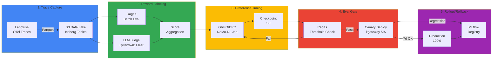

import DocCardList from '@theme/DocCardList';

## Overview

The Continuous Training Pipeline is the implementation architecture of the **Self-Improving Agent Loop** that automatically converts production inference traces into training data for continuous model improvement. It collects Langfuse OTel traces into an S3 Data Lake, evaluates quality with a Reward Labeler, and performs preference tuning with GRPO/DPO. After passing evaluation, it gradually rolls out to production via Canary deployment.

## Why Continuous Training

Traditional training methods rely on **static datasets**. However, production user feedback occurs continuously, and without incorporating it, models increasingly **diverge from actual usage patterns** over time.

| Challenge | Traditional Approach | Continuous Training |
|-----------|---------------------|---------------------|
| **Data Collection** | Manual labeling (monthly) | Automatic trace collection (real-time) |
| **Feedback Integration** | 3-6 months | 1 week |
| **Quality Improvement** | Wait for new dataset | Immediate user feedback integration |
| **Cost** | $10K/month labeling | Reward Model automation |

:::tip Design Document Link
This document covers how to implement the 5-stage architecture of [Self-Improving Agent Loop](../../../design-architecture/advanced-patterns/self-improving-agent-loop.md) on EKS. Refer to the design document for background and strategic decisions.
:::

:::warning ADR Agreement Required Before Production
To apply this pipeline to production traffic, the scope, automation boundaries, data gates, and rollback criteria defined in [ADR — Self-Improving Agent Loop Decision](../../../design-architecture/advanced-patterns/adr-self-improving-loop.md) must be agreed upon at the organizational level. Operate the Train/Deploy stages with manual approval gates.
:::

## 5-Stage Pipeline Flow

**Key Concepts:**

1. **Trace → Dataset**: Convert Langfuse production inference logs into training data
2. **Reward Labeling**: Score trace quality 0-1 with Ragas + LLM Judge
3. **GRPO/DPO**: High-score traces as preferred, low-score as non-preferred
4. **Eval Gate**: Verify quality threshold after training
5. **Canary → 100%**: Gradual traffic increase, immediate rollback on regression

## Sub-Documents

<DocCardList />

- [Trace → Dataset Materializer](./trace-to-dataset.md) — Langfuse OTel collection, S3 Iceberg tables, Reward Labeler Fleet
- [GRPO/DPO Training Job](./grpo-dpo-training.md) — NeMo-RL/TRL-based preference tuning with Karpenter Spot node pools
- [Eval Gate · Registry · KPI](./evaluation-rollout.md) — Threshold verification, Canary deployment, MLflow Registry, cost KPIs

## Summary

The Continuous Training Pipeline automatically incorporates production feedback into model improvement through a 5-stage workflow:

1. **Trace → Dataset**: Langfuse OTel → S3 Iceberg (partitioned by date/model/consent)
2. **Reward Labeling**: Ragas + Qwen3-4B Judge Fleet (KServe + KEDA)
3. **GRPO/DPO Training**: NeMo-RL or TRL (Karpenter Spot p5en.48xlarge × 3 nodes)
4. **Eval Gate**: Threshold verification + Canary 5% → 25% → 100% (kgateway)
5. **Registry & Rollback**: MLflow + Agent Versioning + automatic rollback

**Key Points:**

- **Cost Efficiency**: Spot instances + bi-weekly iterations → ~$4K/month
- **Quality Improvement**: Target 1% monthly faithfulness increase
- **Safety**: Eval Gate + gradual Canary + automatic rollback
- **ROI**: Potential 400% revenue increase versus training cost

## Next Steps

- [Self-Improving Agent Loop](../../../design-architecture/advanced-patterns/self-improving-agent-loop.md) — Design architecture and strategy
- [Custom Model Pipeline](../custom-model-pipeline.md) — SFT training prerequisites
- [Cascade Routing Tuning](../../inference-gateway/cascade-routing-tuning.md) — Post-deployment routing optimization
- [Agent Versioning](../../../../aidlc/enterprise/agent-versioning/index.md) — Model/code/prompt synchronization

## References

### Official Documentation

- [NVIDIA NeMo Framework](https://docs.nvidia.com/nemo-framework/user-guide/latest/) — Large-scale model training and RLHF
- [HuggingFace TRL](https://github.com/huggingface/trl) — DPO/PPO reference implementation
- [MLflow](https://mlflow.org/) — Model registry and version management
- [Gateway API](https://gateway-api.sigs.k8s.io/) — Canary traffic splitting

### Papers & Technical Blogs

- [GRPO Paper (arxiv 2402.03300)](https://arxiv.org/abs/2402.03300) — Group Relative Policy Optimization
- [DPO Paper (arxiv 2305.18290)](https://arxiv.org/abs/2305.18290) — Direct Preference Optimization

### Related Documents

- [Self-Improving Agent Loop](../../../design-architecture/advanced-patterns/self-improving-agent-loop.md)
- [ADR — Self-Improving Loop](../../../design-architecture/advanced-patterns/adr-self-improving-loop.md)
- [Ragas Evaluation](../../../operations-mlops/governance/ragas-evaluation.md)

:::tip Production Checklist

- [ ] Enable Langfuse OTel trace collection (add user_consent field)
- [ ] Configure S3 Data Lake + Glue Iceberg tables
- [ ] Deploy Reward Labeler Fleet (Qwen3-4B KServe + KEDA)
- [ ] Set up NeMo-RL or TRL training environment (Karpenter Spot node pool)
- [ ] Define Eval Gate thresholds (faithfulness >= 0.85)
- [ ] Configure Canary Deployment HTTPRoute + monitoring alerts
- [ ] Integrate MLflow Registry + Agent Versioning
- [ ] Automate rollback (Argo Rollouts)
- [ ] Build cost KPI dashboard (Grafana)
- [ ] Establish bi-weekly/monthly iteration schedule

:::
