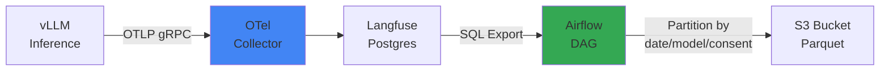

## Overview

This document covers the implementation of stages 1-2 of the Continuous Training Pipeline: **Trace Collection → Reward Labeling**. It loads production inference traces stored in Langfuse into S3 Parquet and scores each trace's quality on a 0-1 scale with Ragas + LLM Judge Fleet to construct GRPO/DPO training datasets.

## Langfuse OTel → S3 Parquet

Langfuse collects inference traces via the OpenTelemetry protocol. Store them in S3 in Parquet format to enable large-scale batch analysis.



### Langfuse Trace Schema

```sql
-- Langfuse traces table structure (PostgreSQL)
CREATE TABLE traces (
    id UUID PRIMARY KEY,
    timestamp TIMESTAMP,
    user_id TEXT,
    session_id TEXT,
    input TEXT,
    output TEXT,
    model TEXT,
    latency_ms INT,
    token_count INT,
    metadata JSONB,
    user_consent BOOLEAN  -- GDPR consent status
);

-- Example data
{
  "id": "trace-12345",
  "timestamp": "2026-04-18T03:15:00Z",
  "user_id": "user-abc",
  "input": "What's the difference between EKS Auto Mode and Karpenter?",
  "output": "EKS Auto Mode is an AWS fully-managed node group...",
  "model": "glm-5-32b",
  "latency_ms": 850,
  "token_count": 512,
  "metadata": {
    "domain": "eks-documentation",
    "feedback_score": 4.5
  },
  "user_consent": true
}
```

### S3 Partitioning Strategy

```bash
s3://training-data-lake/
└── langfuse-traces/
    ├── date=2026-04-18/
    │   ├── model=glm-5-32b/
    │   │   ├── consent=true/
    │   │   │   └── traces-000001.parquet  (10k rows)
    │   │   └── consent=false/
    │   │       └── traces-000002.parquet
    │   └── model=qwen3-coder/
    │       └── consent=true/
    │           └── traces-000003.parquet
    └── date=2026-04-19/
        └── ...
```

**Partitioning Reasons:**

- **Date**: Optimize time-range queries (e.g., last 7 days of data)
- **Model**: Per-model performance tracking, A/B test separation
- **Consent**: GDPR/CCPA compliance, exclude non-consented data from training

### Apache Iceberg vs Hudi

| Feature | Apache Iceberg | Apache Hudi |
|---------|---------------|-------------|
| **Snapshot Isolation** | Full ACID transactions | Timeline-based consistency |
| **Schema Evolution** | Automatic column add/delete | Manual migration required |
| **Query Performance** | Partition pruning optimization | COW/MOR mode selection |
| **AWS Integration** | Native Glue Catalog | EMR optimized |
| **Recommended Use** | Large-scale analytical queries | Real-time upsert focus |

:::tip Iceberg Recommended
Continuous Training is a **read-heavy workload** (batch learning), so Iceberg is recommended. Schema changes (adding new metadata fields) are frequent, making automatic Schema Evolution advantageous.
:::

### Airflow DAG Example

```python
# dags/langfuse_to_s3.py
from airflow import DAG
from airflow.providers.postgres.hooks.postgres import PostgresHook
from airflow.providers.amazon.aws.hooks.s3 import S3Hook
from airflow.operators.python import PythonOperator
from datetime import datetime, timedelta
import pandas as pd
import pyarrow as pa
import pyarrow.parquet as pq

def export_langfuse_traces(**context):
    """Langfuse Postgres → S3 Parquet conversion"""
    
    # Connect to Langfuse DB
    pg_hook = PostgresHook(postgres_conn_id='langfuse_db')
    
    # Extract yesterday's data (user_consent=true only)
    yesterday = context['ds']
    query = f"""
        SELECT 
            id, timestamp, user_id, session_id,
            input, output, model, latency_ms, token_count,
            metadata
        FROM traces
        WHERE DATE(timestamp) = '{yesterday}'
          AND user_consent = true
          AND output IS NOT NULL
        ORDER BY timestamp
    """
    
    df = pg_hook.get_pandas_df(query)
    
    # Group by model and save Parquet
    for model, group in df.groupby('model'):
        table = pa.Table.from_pandas(group)
        
        # S3 path: s3://bucket/date=2026-04-18/model=glm-5-32b/consent=true/
        s3_key = f"langfuse-traces/date={yesterday}/model={model}/consent=true/traces-{context['ti'].xcom_pull()}.parquet"
        
        # S3 upload
        s3_hook = S3Hook(aws_conn_id='aws_default')
        with s3_hook.get_conn().open(f"s3://training-data-lake/{s3_key}", 'wb') as f:
            pq.write_table(table, f, compression='snappy')
    
    return len(df)

with DAG(
    dag_id='langfuse_to_s3_daily',
    schedule_interval='0 6 * * *',  # Daily at 6 AM
    start_date=datetime(2026, 4, 1),
    catchup=False,
    default_args={
        'retries': 3,
        'retry_delay': timedelta(minutes=5),
    }
) as dag:
    
    export_task = PythonOperator(
        task_id='export_traces',
        python_callable=export_langfuse_traces,
    )
```

### AWS Glue Catalog Registration

```python
# glue_iceberg_table.py
import boto3

glue = boto3.client('glue')

# Define Iceberg table
glue.create_table(
    DatabaseName='training_data',
    TableInput={
        'Name': 'langfuse_traces',
        'StorageDescriptor': {
            'Columns': [
                {'Name': 'id', 'Type': 'string'},
                {'Name': 'timestamp', 'Type': 'timestamp'},
                {'Name': 'user_id', 'Type': 'string'},
                {'Name': 'input', 'Type': 'string'},
                {'Name': 'output', 'Type': 'string'},
                {'Name': 'model', 'Type': 'string'},
                {'Name': 'latency_ms', 'Type': 'int'},
                {'Name': 'metadata', 'Type': 'struct<feedback_score:double,domain:string>'},
            ],
            'Location': 's3://training-data-lake/langfuse-traces/',
            'InputFormat': 'org.apache.iceberg.mr.hive.HiveIcebergInputFormat',
            'OutputFormat': 'org.apache.iceberg.mr.hive.HiveIcebergOutputFormat',
            'SerdeInfo': {
                'SerializationLibrary': 'org.apache.iceberg.mr.hive.HiveIcebergSerDe'
            }
        },
        'PartitionKeys': [
            {'Name': 'date', 'Type': 'date'},
            {'Name': 'model', 'Type': 'string'},
            {'Name': 'consent', 'Type': 'boolean'},
        ],
        'Parameters': {
            'table_type': 'ICEBERG',
            'format': 'parquet',
            'write.parquet.compression-codec': 'snappy',
        }
    }
)
```

## Reward Labeler Fleet

### Reward Labeling Concept

**Reward Labeling** is the process of evaluating each trace's quality with a 0-1 score. This score is used as a **preference signal** in GRPO/DPO training.

```
High-score traces (0.8-1.0) → Preferred examples (higher weight in training)
Low-score traces (0.0-0.3) → Non-preferred examples (lower weight in training)
```

### Evaluation Metrics Combination

#### Ragas Metrics

The [Ragas evaluation framework](../../../operations-mlops/governance/ragas-evaluation.md) objectively measures RAG system quality.

```python
from ragas.metrics import faithfulness, answer_relevancy, context_precision

# Ragas batch evaluation
scores = {
    'faithfulness': 0.92,      # Is answer faithful to context?
    'answer_relevancy': 0.88,  # Is answer relevant to question?
    'context_precision': 0.85  # Is retrieved context accurate?
}

# Calculate final Reward with weighted average
reward = (
    0.5 * scores['faithfulness'] +
    0.3 * scores['answer_relevancy'] +
    0.2 * scores['context_precision']
)
# → reward = 0.896
```

#### LLM-as-a-Judge

Use a small model (Qwen3-4B) as a judge to evaluate answer quality.

```python
# LLM Judge prompt
JUDGE_PROMPT = """
Evaluate the following question and answer.

**Question**: {question}
**Answer**: {answer}

**Evaluation Criteria**:
1. Accuracy: Are there technical errors?
2. Completeness: Does it cover all aspects of the question?
3. Clarity: Is it easy to understand?

Output a score between 0.0-1.0. Respond only in JSON format:
{{"score": 0.85, "reasoning": "..."}}
"""

# Evaluate with Qwen3-4B (vLLM batch inference)
judge_response = vllm_client.chat.completions.create(
    model="qwen3-coder-4b",
    messages=[{"role": "user", "content": JUDGE_PROMPT.format(question=q, answer=a)}],
    temperature=0.1,
    max_tokens=200,
)

judge_score = json.loads(judge_response.choices[0].message.content)['score']
# → judge_score = 0.85
```

#### Final Reward Aggregation

```python
# Ragas + LLM Judge combination
final_reward = (
    0.6 * ragas_reward +      # Ragas weight 60%
    0.4 * judge_score         # Judge weight 40%
)
```

### KServe InferenceService Deployment

Deploy Qwen3-4B Judge model with KServe to build a high-availability fleet.

```yaml
# reward-labeler-inference.yaml
apiVersion: serving.kserve.io/v1beta1
kind: InferenceService
metadata:
  name: reward-labeler-qwen3
  namespace: training-pipeline
spec:
  predictor:
    minReplicas: 3
    maxReplicas: 10
    containers:
    - name: kserve-container
      image: vllm/vllm-openai:v0.18.2
      args:
      - --model=Qwen/Qwen3-Coder-4B-Instruct
      - --served-model-name=qwen3-judge
      - --tensor-parallel-size=1
      - --max-model-len=8192
      - --gpu-memory-utilization=0.9
      resources:
        requests:
          nvidia.com/gpu: 1
          memory: 16Gi
        limits:
          nvidia.com/gpu: 1
          memory: 24Gi
      env:
      - name: SERVED_MODEL_NAME
        value: "qwen3-judge"
---
apiVersion: keda.sh/v1alpha1
kind: ScaledObject
metadata:
  name: reward-labeler-scaler
  namespace: training-pipeline
spec:
  scaleTargetRef:
    name: reward-labeler-qwen3
  minReplicaCount: 3
  maxReplicaCount: 10
  triggers:
  - type: prometheus
    metadata:
      serverAddress: http://prometheus:9090
      metricName: vllm_requests_running
      threshold: "10"
      query: |
        avg(vllm_requests_running{model="qwen3-judge"})
```

**Autoscaling Strategy:**

- **Minimum 3 replicas**: Guarantee baseline throughput
- **Maximum 10 replicas**: Handle spikes during batch evaluation
- **Trigger**: Scale out when vLLM waiting requests > 10

### Batch Evaluation Job

```python
# batch_reward_labeling.py
import pandas as pd
from ragas import evaluate
from ragas.metrics import faithfulness, answer_relevancy, context_precision
import openai
import json
from concurrent.futures import ThreadPoolExecutor

# Load last 7 days of traces from S3
df = pd.read_parquet(
    's3://training-data-lake/langfuse-traces/',
    filters=[
        ('date', '>=', '2026-04-11'),
        ('date', '<=', '2026-04-18'),
        ('model', '=', 'glm-5-32b'),
        ('consent', '=', True),
    ]
)

# Ragas evaluation
ragas_results = evaluate(
    df,
    metrics=[faithfulness, answer_relevancy, context_precision]
)

# LLM Judge evaluation (parallel processing)
def judge_single_trace(row):
    response = openai.ChatCompletion.create(
        model="qwen3-judge",
        messages=[{
            "role": "user",
            "content": JUDGE_PROMPT.format(
                question=row['input'],
                answer=row['output']
            )
        }],
        temperature=0.1,
        max_tokens=200,
        # KServe InferenceService endpoint
        api_base="http://reward-labeler-qwen3.training-pipeline.svc.cluster.local:8000/v1"
    )
    return json.loads(response.choices[0].message.content)['score']

with ThreadPoolExecutor(max_workers=50) as executor:
    judge_scores = list(executor.map(judge_single_trace, df.to_dict('records')))

# Calculate final Reward
df['ragas_reward'] = (
    0.5 * ragas_results['faithfulness'] +
    0.3 * ragas_results['answer_relevancy'] +
    0.2 * ragas_results['context_precision']
)
df['judge_score'] = judge_scores
df['final_reward'] = 0.6 * df['ragas_reward'] + 0.4 * df['judge_score']

# Save labeled dataset to S3
df.to_parquet('s3://training-data-lake/labeled-dataset/2026-04-18.parquet')
```

### Cost Example

| Resource | Spec | Hourly Cost | Daily Cost (10 hours) |
|----------|------|-------------|----------------------|
| **Qwen3-4B Judge Fleet** | g6.xlarge × 3 | $0.93 | $9.30 |
| **Ragas Evaluation (Bedrock Claude)** | - | Per API call | $5-10 (10K traces) |
| **Airflow/Kubernetes** | Existing infrastructure | - | - |
| **Total Cost** | - | - | **$15-20/day** |

Annual cost of $5,000-7,000, achieving **95% savings** compared to manual labeling ($10K/month).

## Next Steps

- [GRPO/DPO Training Job](./grpo-dpo-training.md) — Perform preference tuning with collected labeled dataset
- [Eval Gate · Registry · KPI](./evaluation-rollout.md) — Quality verification and Canary deployment after training

## References

### Official Documentation

- [Langfuse](https://langfuse.com/docs) — LLM Observability platform
- [Apache Iceberg](https://iceberg.apache.org/) — Open table format
- [AWS Glue Data Catalog](https://docs.aws.amazon.com/glue/latest/dg/components-overview.html) — Iceberg metastore
- [KServe](https://kserve.github.io/website/) — Kubernetes ModelMesh/InferenceService

### Papers & Technical Blogs

- [Ragas: Automated Evaluation of RAG (arxiv 2309.15217)](https://arxiv.org/abs/2309.15217)
- [LLM-as-a-Judge Survey (arxiv 2411.15594)](https://arxiv.org/abs/2411.15594)

### Related Documents

- [Ragas Evaluation](../../../operations-mlops/governance/ragas-evaluation.md) — Deep dive into Ragas metrics
- [Agent Monitoring (Langfuse)](../../../operations-mlops/observability/agent-monitoring.md)
- [GRPO/DPO Training Job](./grpo-dpo-training.md)
