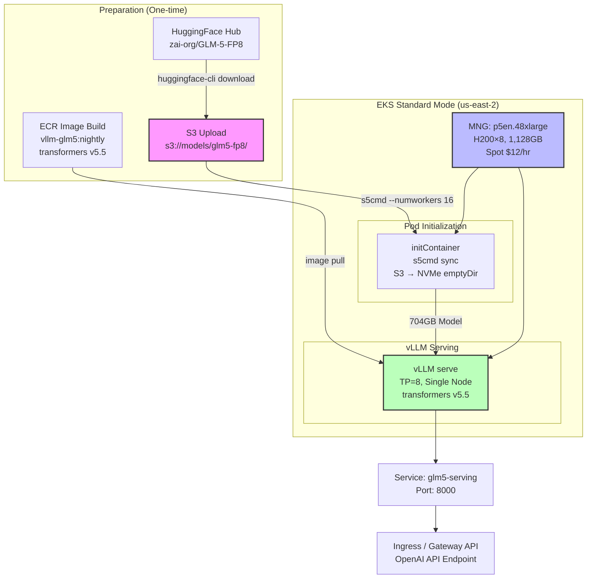

This document is a hands-on guide to deploying large open-source models with vLLM on EKS. It uses the **GLM-5.1 744B MoE FP8** model as a working example, but the same patterns apply to other large models such as DeepSeek-V3, Mixtral, and Qwen-MoE.

:::info Purpose of This Guide
This document focuses less on "here's how to do it" and more on "here's what we ran into, and how we solved it." It helps you anticipate and address issues you may encounter during actual production deployments.
:::

## 1. Model Selection Criteria

Evaluate the following criteria when choosing a model to deploy.

| Criterion | What to Check | Notes |
|-----------|--------------|-------|
| **License** | Commercial use permitted (MIT, Apache 2.0, etc.) | Some models have non-commercial licenses |
| **Model Size (VRAM)** | Required VRAM at FP8/FP16 | Directly affects GPU instance selection |
| **vLLM Compatibility** | Official vLLM support, transformers version | Custom image needed if unsupported |
| **Benchmark Performance** | Target task scores (coding, reasoning, conversation, etc.) | SWE-bench, HumanEval, etc. |
| **Context Length** | Maximum supported token count | 200K+ recommended for agentic workloads |
| **MoE Architecture** | Total vs. active parameters | MoE is more VRAM-efficient for its performance |

### Example: Key Features of GLM-5.1

- **GLM-5.1 = Same weights as GLM-5**: Only additional post-training RL for coding tasks
- **744B MoE (40B active)**: 8 out of 256 experts activated per token
- **HuggingFace**: `zai-org/GLM-5-FP8`
- **License**: MIT License
- **Context**: 200K tokens supported
- **Performance**:
  - #1 open-source model on Agentic Coding benchmarks (55.00 points)
  - SWE-bench 77.8% (vs. GPT-4.1 62.3%)

:::tip Why We Chose GLM-5.1
It has an MIT license allowing commercial use and outperforms OpenAI GPT-4o on Agentic Coding tasks. Its SWE-bench score of 77.8% demonstrates particular strength in code generation and bug-fixing tasks.
:::

:::info Automatic Model Branching
With an LLM Classifier, clients send requests to a single endpoint (`/v1`), and the system automatically selects an SLM or LLM based on prompt content. Simple requests are routed to Qwen3-4B (L4 $0.3/hr), while complex requests (refactoring, architecture, design, etc.) are routed to GLM-5 744B (H200 $12/hr). See [Inference Gateway Setup: LLM Classifier](../inference-gateway/setup/advanced-features#llm-classifier-deployment) for configuration details.
:::

### Model Specs (GLM-5.1 Example)

| Item | Details |
|------|---------|
| Parameters | 744B (total) / 40B (active) |
| MoE Structure | 256 experts, top-8 routing |
| Precision | FP8 |
| Model Size | ~704GB (weights) |
| Required VRAM | ~744GB (single-node loading) |
| Minimum GPUs | 8x H200 (1,128GB) or 8x B200 (1,536GB) |

## GPU Instance Selection Matrix

The most critical decision when deploying large models is the GPU instance type. Select instances based on the model's VRAM requirements.

| Instance | GPU | VRAM | 744B Single Node? | PP=2 Multi-node | Spot Price (us-east-2) | Recommendation |
|---------|-----|------|-------------------|--------------|---------------------|--------|
| p5.48xlarge | H100×8 | 640GB | ❌ (744GB > 640GB) | ⚠️ vLLM deadlock | $12/hr | ⚠️ |
| p5en.48xlarge | H200×8 | 1,128GB | ✅ | ✅ (unnecessary) | $12/hr | ✅ Optimal |
| p6-b200.48xlarge | B200×8 | 1,536GB | ✅ | ✅ (unnecessary) | $18/hr | ✅ Headroom |

:::warning Caution When Using Instances with Insufficient VRAM
If the model's VRAM requirement exceeds the instance VRAM, PP (Pipeline Parallelism) multi-node is required. However, due to vLLM V1 engine multi-node PP deadlock issues (see Section 6), stable deployment is difficult. **We recommend selecting an instance with sufficient VRAM for single-node deployment.**
:::

### Instance Selection Principles

**Choose the cheapest Spot instance with sufficient VRAM.**

1. **Same price**: If p5en Spot and p5 Spot are both $12/hr, choose p5en for more VRAM
2. **VRAM headroom**: Secure at least 1.5x VRAM relative to model size (for KV Cache)
3. **Simplicity**: Eliminate multi-node complexity
4. **Stability**: Avoid PP deadlock issues

```bash
# Spot price lookup example (us-east-2)
aws ec2 describe-spot-price-history \
  --instance-types p5en.48xlarge \
  --region us-east-2 \
  --start-time $(date -u +%Y-%m-%dT%H:%M:%S) \
  --product-descriptions "Linux/UNIX" \
  --query 'SpotPriceHistory[0].[SpotPrice,Timestamp]' \
  --output table
```

## EKS Deployment Mode Selection

The choice between EKS Auto Mode and Standard Mode depends on the GPU instance type you plan to use.

| Mode | p5.48xlarge | p5en.48xlarge | p6-b200.48xlarge | Stability |
|------|------------|---------------|------------------|--------|
| Auto Mode | ✅ | ❌ NoCompatibleInstanceTypes | ❌ Unsupported | ⚠️ |
| Auto Mode + MNG Hybrid | ✅ | ✅ (MNG may be delayed/fail) | ✅ (MNG may be delayed/fail) | ⚠️ |
| Standard Mode + MNG | ✅ | ✅ | ✅ | ✅ Most stable |

:::caution Auto Mode Limitations with Latest GPU Instances
As of April 2026, EKS Auto Mode supports p5.48xlarge but returns `NoCompatibleInstanceTypes` for p5en.48xlarge and p6-b200.48xlarge. Auto Mode + MNG hybrid is possible, but MNG creation may be delayed or fail.
:::

### Recommended: Standard Mode + MNG

**Why we recommend Standard Mode + Managed Node Group:**

1. **Instance type flexibility**: Supports p5, p5en, and p6
2. **MNG stability**: No Auto Mode limitations
3. **Spot control**: Fine-grained Spot replacement strategies
4. **Karpenter option**: Can add Karpenter later if needed

#### Standard Mode + MNG Configuration Example

```bash
# Create EKS cluster (Standard Mode)
eksctl create cluster \
  --name glm5-cluster \
  --region us-east-2 \
  --version 1.33 \
  --without-nodegroup

# Create p5en.48xlarge MNG
eksctl create nodegroup \
  --cluster glm5-cluster \
  --region us-east-2 \
  --name glm5-gpu-nodes \
  --node-type p5en.48xlarge \
  --nodes 1 \
  --nodes-min 0 \
  --nodes-max 2 \
  --spot \
  --managed \
  --node-ami-family Ubuntu2204 \
  --ssh-access \
  --ssh-public-key ~/.ssh/id_rsa.pub \
  --node-labels "workload=glm5,gpu=h200" \
  --node-volume-size 500 \
  --node-volume-type gp3 \
  --kubelet-extra-args "--max-pods=110"
```

## vLLM Custom Image Build

### Problem: Latest Model Not Recognized

The transformers version bundled in the standard vLLM image may not support the architecture of the model you want to deploy. In the case of GLM-5, it fails to recognize the `glm_moe_dsa` architecture.

```bash
# Error example when running the standard vLLM image
ValueError: Model type 'glm_moe_dsa' is not supported.
```

### Solution: Install the Latest Transformers

After confirming that the model support is included in the transformers main branch, build a custom image.

#### Dockerfile

```dockerfile
FROM vllm/vllm-openai:nightly
RUN pip install https://github.com/huggingface/transformers/archive/refs/heads/main.zip
ENV VLLM_USE_DEEP_GEMM=1
```

:::tip VLLM_USE_DEEP_GEMM
`VLLM_USE_DEEP_GEMM=1` enables FP8 Tensor Core acceleration on NVIDIA H100/H200/B200, improving inference performance for MoE models.
:::

#### Build and Push

```bash
# Create ECR repository
aws ecr create-repository \
  --repository-name vllm-glm5 \
  --region us-east-2

# ECR login
aws ecr get-login-password --region us-east-2 | \
  docker login --username AWS --password-stdin \
  <ACCOUNT_ID>.dkr.ecr.<REGION>.amazonaws.com

# Multi-platform build (linux/amd64)
docker buildx build --platform linux/amd64 \
  -t <ACCOUNT_ID>.dkr.ecr.<REGION>.amazonaws.com/vllm-glm5:nightly \
  --push .
```

:::warning Slow Cross-Platform Build on Mac
Building with `--platform linux/amd64` on Apple Silicon Mac is extremely slow due to emulation (30+ minutes). As an alternative, consider running `pip install` directly in an initContainer.
:::

#### Alternative: initContainer Zip Install

```yaml
initContainers:
- name: install-transformers
  image: vllm/vllm-openai:nightly
  command: ["/bin/bash", "-c"]
  args:
    - |
      pip install https://github.com/huggingface/transformers/archive/refs/heads/main.zip
  volumeMounts:
  - name: vllm-python-packages
    mountPath: /opt/vllm/.local
```

## Model Cache Strategy (S3 → NVMe)

Downloading large models (hundreds of GB) takes a very long time. An efficient caching strategy is essential.

| Strategy | Download Time | Multi-node Sync | Cost | Complexity | Recommendation |
|----------|-------------|----------------|-----|--------|--------|
| HuggingFace Hub Direct | ~45min (per node) | ❌ Each node independent | Free (bandwidth) | Low | ⚠️ |
| S3 + init container `aws s3 sync` | ~30min (per node) | ⚠️ Timing mismatch possible | S3 storage + transfer | Medium | ✅ |
| S3 + init container `s5cmd` | ~15min (per node) | ⚠️ Timing mismatch possible | S3 storage + transfer | Medium | ✅ Optimal |
| EFS | ~60min (per node) | ✅ Shared filesystem | EFS storage + throughput | High | ⚠️ |
| NVMe emptyDir (pre-download required) | Instant | ✅ (S3 sync first) | S3 transfer only | High | ✅ |

### Recommended: S3 Pre-upload → s5cmd → NVMe emptyDir

**Recommended workflow:**

1. **Pre-upload model to S3** (one-time only)
2. **Parallel download with s5cmd in initContainer**
3. **Cache to NVMe emptyDir**

#### Step 1: Upload Model to S3

```bash
# Download from HuggingFace to local
huggingface-cli download zai-org/GLM-5-FP8 \
  --local-dir /tmp/glm5-fp8 \
  --local-dir-use-symlinks False

# Upload to S3
aws s3 sync /tmp/glm5-fp8 \
  s3://<MODEL_CACHE_BUCKET>/glm5-fp8/ \
  --region us-east-2
```

#### Step 2: initContainer s5cmd Download

```yaml
apiVersion: v1
kind: Pod
metadata:
  name: vllm-glm5
spec:
  initContainers:
  - name: download-model
    image: public.ecr.aws/aws-cli/aws-cli:latest
    command: ["/bin/bash", "-c"]
    args:
      - |
        # Install s5cmd
        wget -q https://github.com/peak/s5cmd/releases/download/v2.2.2/s5cmd_2.2.2_Linux-64bit.tar.gz
        tar xzf s5cmd_2.2.2_Linux-64bit.tar.gz
        
        # Parallel download (16 workers)
        ./s5cmd --numworkers 16 sync \
          s3://<MODEL_CACHE_BUCKET>/glm5-fp8/* \
          /mnt/models/glm5-fp8/
    volumeMounts:
    - name: model-cache
      mountPath: /mnt/models
    env:
    - name: AWS_REGION
      value: us-east-2
  containers:
  - name: vllm
    image: <ACCOUNT_ID>.dkr.ecr.<REGION>.amazonaws.com/vllm-glm5:nightly
    command: ["vllm", "serve"]
    args:
      - "zai-org/GLM-5-FP8"
      - "--download-dir=/mnt/models"
      - "--tensor-parallel-size=8"
      - "--enforce-eager"
      - "--trust-remote-code"
    volumeMounts:
    - name: model-cache
      mountPath: /mnt/models
  volumes:
  - name: model-cache
    emptyDir:
      medium: ""  # NVMe (p5en provides 4TB NVMe)
      sizeLimit: 800Gi
```

:::tip s5cmd vs aws s3 sync
`s5cmd` is a high-performance S3 client written in Go that is 3-4x faster than `aws s3 sync`. With `--numworkers 16` for parallel downloads, you can download a 704GB model in ~15 minutes.
:::

:::warning Multi-node Issues with Direct HuggingFace Hub Download
When downloading directly from HuggingFace Hub, each node downloads independently, causing:
1. Download timing mismatch (Leader finishes while Worker is still downloading)
2. vLLM engine initialization timeout
3. Synchronization issues in PP multi-node setups

Pre-uploading to S3 and using `s5cmd` for fast downloads minimizes timing mismatches.
:::

## 6. PP Multi-node Deadlock Issue (Lessons Learned)

This section documents a **failure case**. It details the issues encountered and resolution attempts when trying PP=2 multi-node deployment on instances with insufficient VRAM. **Using instances with sufficient VRAM completely avoids this problem.**

### Symptoms

1. **Leader Pod**: Model loading complete → `vllm.engine.engine.LLMEngine` initialization success
2. **Worker Pod**: `Waiting for engine process to be ready...` → Timeout (10 minutes)
3. **Result**: GPU memory released → `TCPStore::recv: Connection closed by peer` → Crash

```bash
# Leader Pod logs (normal)
INFO 04-01 12:34:56 engine.py:123] Initialized engine process.
INFO 04-01 12:35:02 model_runner.py:456] Loading weights on GPU...
INFO 04-01 12:37:45 model_runner.py:789] Model loading complete. VRAM: 43GB / 80GB

# Worker Pod logs (deadlocked)
INFO 04-01 12:34:58 engine.py:123] Initialized engine process.
INFO 04-01 12:35:05 model_runner.py:456] Loading weights on GPU...
INFO 04-01 12:35:05 worker.py:234] Waiting for engine process to be ready...
INFO 04-01 12:35:05 worker.py:234] Waiting for engine process to be ready...
... (repeats for 10 minutes) ...
ERROR 04-01 12:45:05 worker.py:345] Engine process failed to become ready within 600s.
NCCL ERROR: Call to connect() failed: Connection refused
ERROR: TCPStore::recv: Connection closed by peer
```

### Root Cause Analysis

#### 1. Insufficient vLLM Engine Timeout Default

The default value of `VLLM_ENGINE_READY_TIMEOUT_S` is 600 seconds (10 minutes). However, for large models:

- Leader: Model loading ~3 minutes
- Worker: Model loading ~8 minutes (slower than Leader)
- torch.compile (first run): Additional 5-10 minutes

The deadlock begins when the Worker hits the timeout.

#### 2. Incomplete Multi-node PP in V1 Engine

The vLLM V1 engine uses `multiproc_executor`, and multi-node Pipeline Parallelism is still experimental. In non-Ray mode:

- Incomplete Leader-Worker synchronization mechanism
- Insufficient TCPStore timeout handling
- torch.distributed initialization order issues

#### 3. torch.compile Synchronization Deadlock

When `--enforce-eager` is not properly applied, torch.compile is activated. In multi-node environments, torch.compile causes:

- Compile timing mismatch between Leader and Worker
- Partial rank waiting during NCCL collectives → deadlock
- GPU memory OOM → process termination → NCCL connection drop

#### 4. Timing Mismatch Due to Independent Per-node Downloads

When downloading directly from HuggingFace Hub, each node downloads independently:

- Leader: Completes in 3 minutes
- Worker: Completes in 8 minutes
- Leader initializes engine first → Worker waits → timeout

### Attempted Solutions and Results

| Attempt | Method | Result | Notes |
|---------|--------|--------|-------|
| 1. Extend timeout | `VLLM_ENGINE_READY_TIMEOUT_S=1800` (30 min) | Reduced Worker crash frequency, deadlock persists | Not a root fix |
| 2. Force eager mode | `--enforce-eager` | ❌ Not applied | LWS LeaderWorkerSet failed to pass vLLM args properly |
| 3. S3 pre-download | S3 + s5cmd | Improved timing, deadlock persists | Download was faster but sync issue remained |
| 4. Extend NCCL timeout | `NCCL_TIMEOUT=1800` | No effect | Issue was engine timeout, not NCCL timeout |
| 5. Distributed timeout | `VLLM_DISTRIBUTED_TIMEOUT=1800` | ❌ Variable not recognized | No such variable in vLLM code |
| 6. Ray mode | `--engine-use-ray` | ❌ Complex Kubernetes + Ray integration | Requires Ray cluster setup |

:::caution Conclusion: vLLM V1 Multi-node PP is Unstable as of April 2026
The vLLM V1 engine's non-Ray multi-node Pipeline Parallelism is not suitable for production environments as of April 2026. Leader-Worker synchronization is incomplete, and deadlocks occur frequently when torch.compile is enabled.
:::

### Recommended Alternatives

#### Alternative 1: Single Node with Sufficient VRAM (Top Recommendation)

```yaml
resources:
  limits:
    nvidia.com/gpu: 8  # 8× H200 = 1,128GB
```

- **Pros**: Eliminates multi-node complexity, maximum stability
- **Cons**: Spot availability (minimal impact since only one node needed)

#### Alternative 2: SGLang (Model-specific Optimized Image)

SGLang provides dedicated images for certain models and supports multi-node PP more reliably.

```yaml
image: lmsysorg/sglang:glm5-hopper
command: ["python3", "-m", "sglang.launch_server"]
args:
  - "--model-path=zai-org/GLM-5-FP8"
  - "--tp=8"
  - "--pp=2"  # Multi-node PP supported
  - "--trust-remote-code"
```

- **Pros**: Model-specific optimization, multi-node PP stability
- **Cons**: Leaving the vLLM ecosystem (OpenAI API compatibility is maintained)

#### Alternative 3: vLLM Ray Mode

vLLM's Ray mode provides more stable multi-node distribution, but integration with Kubernetes is complex.

```bash
# Ray cluster setup required
helm install ray-cluster kuberay/ray-cluster \
  --set head.resources.limits.nvidia\\.com/gpu=0 \
  --set worker.replicas=2 \
  --set worker.resources.limits.nvidia\\.com/gpu=8
```

- **Pros**: Stay within the vLLM ecosystem, improved stability
- **Cons**: Ray cluster operational overhead

## LWS Multi-node Configuration

When multi-node deployment is necessary, use LeaderWorkerSet (LWS). While the deadlock issue existed, the LWS multi-node networking itself worked successfully.

### LWS LeaderWorkerSet Definition

```yaml
apiVersion: leaderworkerset.x-k8s.io/v1
kind: LeaderWorkerSet
metadata:
  name: vllm-glm5
spec:
  replicas: 1  # 1 Leader + 1 Worker = 2 nodes
  leaderWorkerTemplate:
    size: 2  # Leader (rank 0) + Worker (rank 1)
    restartPolicy: Default  # Only restart Worker
    leaderTemplate:
      metadata:
        labels:
          role: leader
      spec:
        containers:
        - name: vllm
          image: <ACCOUNT_ID>.dkr.ecr.us-east-2.amazonaws.com/vllm-glm5:nightly
          command: ["vllm", "serve"]
          args:
            - "zai-org/GLM-5-FP8"
            - "--tensor-parallel-size=8"
            - "--pipeline-parallel-size=2"
            - "--node-rank=0"
            - "--master-addr=$(LWS_LEADER_ADDRESS)"
            - "--master-port=29500"
            - "--trust-remote-code"
            - "--port=8000"
          env:
          - name: LWS_LEADER_ADDRESS
            valueFrom:
              fieldRef:
                fieldPath: status.podIP
          - name: VLLM_ENGINE_READY_TIMEOUT_S
            value: "1800"
          - name: NCCL_DEBUG
            value: "INFO"
          resources:
            limits:
              nvidia.com/gpu: 8
    workerTemplate:
      metadata:
        labels:
          role: worker
      spec:
        containers:
        - name: vllm
          image: <ACCOUNT_ID>.dkr.ecr.us-east-2.amazonaws.com/vllm-glm5:nightly
          command: ["vllm", "serve"]
          args:
            - "zai-org/GLM-5-FP8"
            - "--tensor-parallel-size=8"
            - "--pipeline-parallel-size=2"
            - "--node-rank=1"
            - "--master-addr=$(LWS_LEADER_ADDRESS)"
            - "--master-port=29500"
            - "--trust-remote-code"
            - "--port=8001"  # Worker uses a different port
          env:
          - name: VLLM_ENGINE_READY_TIMEOUT_S
            value: "1800"
          - name: NCCL_DEBUG
            value: "INFO"
          resources:
            limits:
              nvidia.com/gpu: 8
```

### What Worked

#### 1. NCCL 16-rank Connection Success

```bash
# Leader Pod logs
vllm-glm5-0 vllm[1234]: NCCL INFO rank 0 initialized 16 ranks on 2 nodes
vllm-glm5-0 vllm[1234]: NCCL INFO Using network Socket
vllm-glm5-0 vllm[1234]: NCCL INFO Channel 00/02: 0/0 -> 8/0 [0x10] via NET/Socket/0
...
vllm-glm5-0 vllm[1234]: NCCL INFO 16 Ranks, 16 CONNECTED

# Worker Pod logs
vllm-glm5-0-1 vllm[5678]: NCCL INFO rank 8 initialized 16 ranks on 2 nodes
vllm-glm5-0-1 vllm[5678]: NCCL INFO Using network Socket
```

NCCL successfully connected 16 ranks (8 GPUs per node × 2 nodes).

#### 2. Distributed Model Weight Loading Success

```bash
# Leader: 43GB VRAM used
vllm-glm5-0 vllm[1234]: Model weights loaded: 43.2GB / 80GB

# Worker: 43GB VRAM used
vllm-glm5-0-1 vllm[5678]: Model weights loaded: 43.5GB / 80GB
```

The 744GB model was evenly distributed across 2 nodes.

#### 3. Automatic LWS_LEADER_ADDRESS Injection

LWS automatically passed the Leader Pod's IP to the Worker.

```bash
# Worker Pod environment variable
echo $LWS_LEADER_ADDRESS
10.0.45.123  # Leader Pod IP
```

#### 4. Worker Port Separation

The Leader used port 8000 and the Worker used port 8001 to prevent conflicts.

:::tip restartPolicy: Default
`restartPolicy: Default` restarts only the Worker Pod while keeping the Leader running. This improves stability by avoiding full group restarts for transient Worker failures.
:::

## K8s Service Naming Pitfall

Kubernetes automatically generates environment variables based on Service names. This can cause unexpected vLLM configuration errors.

### The Problem

```yaml
apiVersion: v1
kind: Service
metadata:
  name: vllm-glm5  # ❌ Uses vllm- prefix
spec:
  selector:
    app: vllm-glm5
  ports:
  - port: 8000
    targetPort: 8000
```

When the Service is named `vllm-glm5`, Kubernetes automatically generates these environment variables:

```bash
VLLM_GLM5_SERVICE_HOST=10.100.45.67
VLLM_GLM5_SERVICE_PORT=8000
VLLM_GLM5_PORT=tcp://10.100.45.67:8000
VLLM_GLM5_PORT_8000_TCP=tcp://10.100.45.67:8000
VLLM_GLM5_PORT_8000_TCP_ADDR=10.100.45.67
VLLM_GLM5_PORT_8000_TCP_PORT=8000
VLLM_GLM5_PORT_8000_TCP_PROTO=tcp
```

vLLM misinterprets environment variables with the `VLLM_*` prefix as its own configuration, producing warnings:

```bash
WARNING: Unknown vLLM environment variable: VLLM_GLM5_SERVICE_HOST
WARNING: Unknown vLLM environment variable: VLLM_GLM5_SERVICE_PORT
```

### Solution: Avoid the vllm- Prefix in Service Names

```yaml
apiVersion: v1
kind: Service
metadata:
  name: glm5-serving  # ✅ Removed vllm- prefix
spec:
  selector:
    app: vllm-glm5
  ports:
  - port: 8000
    targetPort: 8000
```

Now the environment variables Kubernetes generates are `GLM5_SERVING_*`, which do not conflict with vLLM.

:::caution K8s Automatic Environment Variable Generation Rules
Kubernetes converts Service names into environment variables in the format `<NAME>_<PORT>_`. Avoid common prefixes like `vllm-`, `llm-`, and `model-`.
:::

## GPU Operator + Auto Mode Conflict

EKS Auto Mode provides a built-in NVIDIA Device Plugin, and installing GPU Operator with default settings causes a conflict.

### The Problem

```bash
# Default GPU Operator installation
helm install gpu-operator nvidia/gpu-operator \
  --namespace gpu-operator \
  --create-namespace

# Check GPU nodes
kubectl get nodes -l node.kubernetes.io/instance-type=p5en.48xlarge -o json | \
  jq '.items[0].status.allocatable'
{
  "nvidia.com/gpu": "0"  # ❌ GPU shows as 0
}
```

### Root Cause

Auto Mode already has a built-in NVIDIA Device Plugin. GPU Operator's `devicePlugin.enabled=true` (default) installs an additional Device Plugin, causing a conflict.

```bash
# Confirm conflict
kubectl get pods -n gpu-operator | grep device-plugin
nvidia-device-plugin-daemonset-abcde   0/1     CrashLoopBackOff   5          3m
```

### Solution: devicePlugin.enabled=false

```bash
# Reinstall GPU Operator (disable Device Plugin)
helm upgrade --install gpu-operator nvidia/gpu-operator \
  --namespace gpu-operator \
  --create-namespace \
  --set devicePlugin.enabled=false \
  --set dcgm.enabled=true \
  --set dcgmExporter.enabled=true \
  --set gfd.enabled=true \
  --set nodeStatusExporter.enabled=true
```

Now only DCGM, GFD (GPU Feature Discovery), and Node Status Exporter run, while the Device Plugin uses the Auto Mode built-in version. For the full GPU Operator architecture and component details, see [NVIDIA GPU Stack](../../model-serving/gpu-infrastructure/nvidia-gpu-stack.md).

```bash
# Confirm GPUs are properly recognized
kubectl get nodes -l node.kubernetes.io/instance-type=p5en.48xlarge -o json | \
  jq '.items[0].status.allocatable'
{
  "nvidia.com/gpu": "8"  # ✅ 8 GPUs properly recognized
}
```

:::warning GPU Node Recreation Required After Conflict
After a Device Plugin conflict, even after reinstalling the GPU Operator, you must recreate the GPU nodes:

1. Delete GPU workloads
2. Delete NodeClaim (Auto Mode) or drain + terminate nodes (Standard Mode)
3. Provision new GPU nodes
:::

## Recommended Deployment Architecture

This is the recommended architecture incorporating all the lessons learned above.



### Deployment Checklist

#### 1. Preparation (One-time)

- [ ] Download model from HuggingFace
- [ ] Create S3 bucket and upload model
- [ ] Build custom vLLM image (with required transformers version)
- [ ] Push to ECR

#### 2. EKS Cluster Configuration

- [ ] Create EKS cluster (Standard Mode, Kubernetes 1.33)
- [ ] Create GPU instance MNG (Spot, sufficient EBS gp3)
- [ ] Install GPU Operator (`devicePlugin.enabled=false`)
- [ ] Verify DCGM and GFD are working properly

#### 3. vLLM Deployment

- [ ] Validate Service name (no vllm- prefix)
- [ ] Configure initContainer s5cmd download
- [ ] Set NVMe emptyDir size (model size + headroom)
- [ ] vLLM args: TP=GPU count, --enforce-eager, --trust-remote-code
- [ ] Resource limits: GPU count

#### 4. Verification

- [ ] Pod startup success (initContainer complete)
- [ ] Model loading success (verify VRAM usage)
- [ ] OpenAI API response normal
- [ ] Performance benchmarks (tps, ttft, latency)

### Complete Single-node Deployment YAML Example

```yaml
apiVersion: v1
kind: Service
metadata:
  name: glm5-serving
  namespace: default
spec:
  selector:
    app: vllm-glm5
  ports:
  - name: http
    port: 8000
    targetPort: 8000
  type: ClusterIP
---
apiVersion: apps/v1
kind: Deployment
metadata:
  name: vllm-glm5
  namespace: default
spec:
  replicas: 1
  selector:
    matchLabels:
      app: vllm-glm5
  template:
    metadata:
      labels:
        app: vllm-glm5
    spec:
      nodeSelector:
        node.kubernetes.io/instance-type: p5en.48xlarge
      initContainers:
      - name: download-model
        image: public.ecr.aws/aws-cli/aws-cli:latest
        command: ["/bin/bash", "-c"]
        args:
          - |
            set -e
            echo "Installing s5cmd..."
            wget -q https://github.com/peak/s5cmd/releases/download/v2.2.2/s5cmd_2.2.2_Linux-64bit.tar.gz
            tar xzf s5cmd_2.2.2_Linux-64bit.tar.gz
            
            echo "Downloading GLM-5-FP8 from S3..."
            ./s5cmd --numworkers 16 sync \
              "s3://<MODEL_CACHE_BUCKET>/glm5-fp8/*" \
              /mnt/models/glm5-fp8/
            
            echo "Download complete. Model size:"
            du -sh /mnt/models/glm5-fp8/
        volumeMounts:
        - name: model-cache
          mountPath: /mnt/models
        env:
        - name: AWS_REGION
          value: us-east-2
        resources:
          requests:
            memory: "16Gi"
            cpu: "4"
          limits:
            memory: "32Gi"
            cpu: "8"
      containers:
      - name: vllm
        image: <ACCOUNT_ID>.dkr.ecr.us-east-2.amazonaws.com/vllm-glm5:nightly
        command: ["vllm", "serve"]
        args:
          - "zai-org/GLM-5-FP8"
          - "--download-dir=/mnt/models"
          - "--tensor-parallel-size=8"
          - "--enforce-eager"
          - "--trust-remote-code"
          - "--host=0.0.0.0"
          - "--port=8000"
          - "--max-model-len=32768"
          - "--gpu-memory-utilization=0.95"
        env:
        - name: VLLM_USE_DEEP_GEMM
          value: "1"
        - name: NCCL_DEBUG
          value: "WARN"
        - name: CUDA_VISIBLE_DEVICES
          value: "0,1,2,3,4,5,6,7"
        ports:
        - containerPort: 8000
          name: http
        volumeMounts:
        - name: model-cache
          mountPath: /mnt/models
        - name: shm
          mountPath: /dev/shm
        resources:
          limits:
            nvidia.com/gpu: 8
            memory: "800Gi"
          requests:
            nvidia.com/gpu: 8
            memory: "600Gi"
        readinessProbe:
          httpGet:
            path: /health
            port: 8000
          initialDelaySeconds: 300
          periodSeconds: 10
          timeoutSeconds: 5
          failureThreshold: 3
        livenessProbe:
          httpGet:
            path: /health
            port: 8000
          initialDelaySeconds: 600
          periodSeconds: 30
          timeoutSeconds: 10
          failureThreshold: 3
      volumes:
      - name: model-cache
        emptyDir:
          medium: ""  # NVMe
          sizeLimit: 800Gi
      - name: shm
        emptyDir:
          medium: Memory
          sizeLimit: 64Gi
      tolerations:
      - key: nvidia.com/gpu
        operator: Exists
        effect: NoSchedule
```

## Deployment Verification Results (GLM-5.1 Case, 2026-04-03)

:::tip Deployment Success
GLM-5.1 (744B MoE FP8) serving was successfully deployed with the configuration below.
:::

### Final Deployment Specs

| Item | Value |
|------|-------|
| Cluster | `glm5-std-us-east-2` (EKS Standard Mode, K8s 1.35) |
| Instance | **p5en.48xlarge** (H200×8, 1,128GB VRAM) |
| Capacity | **Spot** (~$12/hr, 84% savings vs. On-Demand $76/hr) |
| GPU Usage | 131.7 GB / 143.7 GB per GPU (91.6%) |
| Disk | **2TB** (704GB model + 1.3TB headroom) |
| Model Cache | S3 → `aws s3 sync` (50 parallel) → NVMe emptyDir |
| vLLM | v0.18.2rc1 nightly + transformers v5.5.0.dev0 |
| TP | 8 (PP unnecessary) |
| max_model_len | 32,768 |
| max_num_seqs | 64 |

### Inference Response Example

```json
{
  "model": "glm-5",
  "choices": [{
    "message": {
      "role": "assistant",
      "reasoning": "We need to write a Python function...",
      "content": "def is_prime(n: int) -> bool: ..."
    },
    "finish_reason": "length"
  }],
  "usage": {
    "prompt_tokens": 24,
    "completion_tokens": 200
  }
}
```

### Deployment Notes

:::caution Disk Size Configuration
When deploying large models, set the MNG `disk-size` to **at least 2x the model size, ideally 3x**. emptyDir uses the node's ephemeral storage, and insufficient disk space will trigger `ephemeral-storage eviction`.
:::

:::warning EKS Mode Selection
For large GPU instances (p5en, p6), use **EKS Standard Mode**. Auto Mode + MNG hybrid may result in MNG creation delays of 30+ minutes or outright failure.
:::

## Key Takeaways

1. **Choose a Spot instance with sufficient VRAM** -- Eliminate complexity with single-node deployment
2. **Standard Mode + MNG is most stable** -- No instance type restrictions from Auto Mode
3. **Custom vLLM image is essential** -- Ensure model support with the latest transformers
4. **S3 + s5cmd + NVMe emptyDir** -- High-speed model download pipeline
5. **Avoid vLLM PP multi-node** -- Unstable as of April 2026; use SGLang or single-node instead
6. **No vllm- prefix in Service names** -- Prevents K8s environment variable conflicts
7. **GPU Operator with devicePlugin=false** -- Use Auto Mode's built-in Device Plugin

## Next Steps

### Model Serving and Infrastructure
- [vLLM Model Serving](../../model-serving/inference-frameworks/vllm-model-serving.md) -- vLLM configuration, performance optimization, tensor parallelism
- [MoE Model Serving](../../model-serving/inference-frameworks/moe-model-serving.md) -- Guide specific to Mixture-of-Experts models
- [llm-d Distributed Inference](../../model-serving/inference-frameworks/llm-d-eks-automode.md) -- KV Cache-aware routing, Disaggregated Serving
- [EKS GPU Node Strategy](../../model-serving/gpu-infrastructure/eks-gpu-node-strategy.md) -- Auto Mode + Karpenter hybrid, security, troubleshooting

### Operations and Monitoring
- [Monitoring Stack Setup](../integrations/monitoring-observability-setup.md) -- Langfuse, Prometheus, Grafana deployment
- [Inference Gateway Routing](../inference-gateway/routing-strategy.md) -- kgateway + Bifrost 2-Tier architecture

## References

### Official Documentation

- [GLM-5 Model Card](https://huggingface.co/zai-org/GLM-5-FP8)
- [vLLM Documentation](https://docs.vllm.ai/)
- [SGLang GLM-5 Guide](https://sglang.readthedocs.io/en/latest/models/glm5.html)
- [LeaderWorkerSet GitHub](https://github.com/kubernetes-sigs/lws)
- [NVIDIA GPU Operator](https://docs.nvidia.com/datacenter/cloud-native/gpu-operator/)
- [s5cmd GitHub](https://github.com/peak/s5cmd)

---

This guide is based on real deployment experience. Please open an issue for questions or improvement suggestions.
