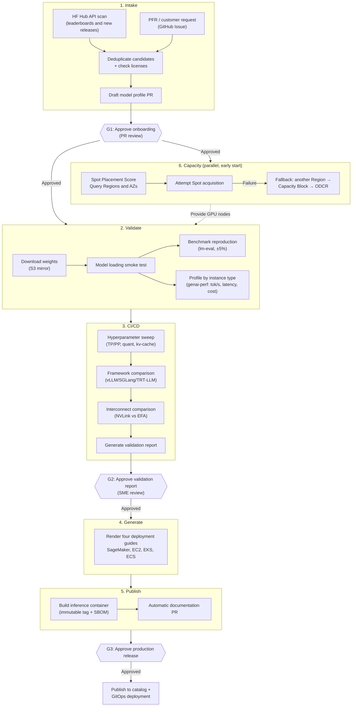
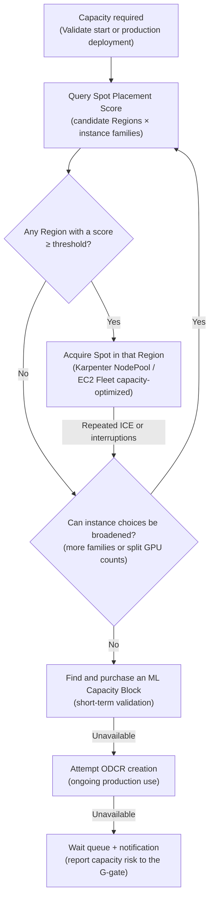

## 1. Purpose and Conclusions (Executive Summary)

Adopting a new open-weight model involves recurring work: downloading weights, validating serving settings, preparing deployment manifests and documentation, and acquiring GPU capacity. This guide proposes a **seven-stage automation pipeline** that connects those tasks with Argo Events and Argo Workflows on EKS. It assigns open-source and AWS tools to the stages. In the normal path, people approve onboarding, validation results, and production release at three gates. Validation failures and exceptions can require additional specialist intervention.

**Key conclusions:**

1. The pipeline's single source of truth is a **Model Profile stored in Git**. Intake creates a draft profile for each candidate; Validate/CI/CD populate measurements; Generate/Publish read the profile to render artifacts. Every stage is recorded through a PR against the profile, so approval gates naturally take the form of PR reviews.
2. Quality validation (benchmark reproduction) and performance validation (tok/s, latency, and cost) are designed as **separate stages**. Quality reproduction uses lm-evaluation-harness to check whether results are within ±5% of published scores, while performance profiling uses genai-perf (AIPerf) to generate a matrix by instance type. Combining both validations in one Job makes it harder to isolate the cause of a failure.
3. Capacity acquisition starts **in parallel before the Validate stage**, rather than at deployment time. For large models requiring eight or more GPUs, first query EC2 Spot Placement Score for capacity availability by Region and Availability Zone (AZ), then fall back to an ML Capacity Block or an On-Demand Capacity Reservation (ODCR) if acquisition fails. GPU capacity has the longest lead time of any pipeline resource.
4. Human intervention is organized around **three fixed gates**: (G1) approval to begin onboarding, (G2) validation report approval, and (G3) production release approval. Argo Workflows suspend steps and parameter overrides allow subject matter experts (SMEs) to intervene between gates.

## 2. Requirements

The architecture must satisfy the following seven-stage requirements.

| # | Stage | Requirement | Key Acceptance Criteria |
|---|-------|-------------|-------------------------|
| 1 | Intake | Detect new models through HuggingFace leaderboard scans, PFRs, and customer requests | Start the pipeline only after passing a human approval gate |
| 2 | Validate | Validate model loading, reproduce public benchmarks, and profile performance by instance type | Benchmark reproduction within ±5%; produce tok/s, latency, and cost measurements |
| 3 | CI/CD | Run hyperparameter sweeps, compare frameworks, and report on interconnects (NVLink vs EFA) | Allow SME intervention to change parameters and rerun |
| 4 | Generate | Generate deployment guides for four targets: SageMaker, EC2, EKS, and ECS | Render all four guides from one model profile |
| 5 | Publish | Produce versioned inference containers and blog-quality documentation | Immutable tags and automatic documentation PRs |
| 6 | Capacity | Automatically acquire global Spot compute capacity across Regions | Automate Region and reservation fallbacks when Spot acquisition fails |
| 7 | Human gate | Agents validate; humans give final approval | No production changes without a gate |

### Baseline Assumptions

- EKS is the execution platform, and Karpenter (or EKS Auto Mode) provisions GPU nodes.
- Model weights and benchmark artifacts are stored in S3; pipeline state is stored in Git as model profiles.
- vLLM is the default serving framework, with SGLang and TensorRT-LLM included for comparison.
- The organization has an SME group comprising the platform team and ML engineers to approve model onboarding.

## 3. Overall Architecture



The entire pipeline is expressed as a single Argo Workflows DAG, with gates G1–G3 implemented as suspend steps. The workflow waits indefinitely at each gate and proceeds when an approver resumes it.

### Stage-to-Tool Mapping

| Stage | Orchestration | Core Tools | Artifacts |
|-------|---------------|------------|-----------|
| Intake | Argo Events (Calendar/Webhook) | huggingface_hub API, GitHub Issue templates | Draft model profile PR |
| Validate | Argo Workflows DAG | vLLM, lm-evaluation-harness, genai-perf | Quality and performance measurements (profile updates) |
| CI/CD | Argo Workflows + suspend | Sweep matrix Jobs, comparison harness | Validation report (Markdown) |
| Generate | Workflows template steps | Handlebars/Jinja renderer | Four deployment guides |
| Publish | GitHub Actions | BuildKit, ECR, syft (SBOM) | Image with a version tag + documentation PR |
| Capacity | Parallel Workflows branch | Spot Placement Score API, EC2 Fleet, ODCR | Provisioned NodePools/reservations |
| Human gate | Argo suspend + Slack notifications | PR reviews, `argo resume` | Approval records (audit trail) |

## 4. Detailed Stage Design

### 4.1 Intake — Model Detection and Onboarding Approval

There are two detection sources.

**(a) Leaderboard and release scans.** An Argo Events Calendar EventSource triggers a scanner Job periodically, for example every six hours. The scanner collects the following through the huggingface_hub API.

```python
from huggingface_hub import HfApi

api = HfApi()
# Top trending text-generation models created within the last seven days
candidates = api.list_models(
    filter="text-generation",
    sort="trendingScore",
    direction=-1,
    limit=50,
)
for m in candidates:
    info = api.model_info(m.id, files_metadata=True)
    # Gate criteria: open weights, license, parameter count, safetensors availability
    if info.gated or info.card_data.license not in ALLOWED_LICENSES:
        continue
    emit_candidate(info)
```

Public leaderboards such as the Open LLM Leaderboard provide result datasets through HF Datasets, so scores can be retrieved through the same API. The scanner must **record published benchmark scores in the draft profile**, because these become the reference values for the ±5% reproduction check in Validate.

**(b) PFRs and customer requests.** Customer requests are submitted through a GitHub Issue template containing the model ID, request rationale, target workload, and SLA. An Issue label webhook passes through Argo Events and joins the same candidate creation path. Candidates from the two sources are deduplicated by model ID.

**Candidate → draft profile.** Each detected candidate automatically becomes a draft model profile PR.

```yaml
# profiles/qwen3-8b.yaml — Model Profile (SSOT)
model:
  id: Qwen/Qwen3-8B
  revision: main            # Pin to a commit SHA after passing Validate
  license: apache-2.0
  params_b: 8.2
intake:
  source: leaderboard-scan   # leaderboard-scan | pfr | customer-request
  detected_at: 2026-07-28
  published_scores:          # Reference values for reproduction checks
    mmlu_pro: 58.4
    gsm8k: 89.1
validate: {}                 # Populated by the Validate stage
profiles: []                 # Populated with profiling results by instance type
serving: {}                  # Populated with optimal settings from CI/CD sweeps
```

**G1 gate.** Approving and merging the draft PR constitutes approval to begin onboarding. CODEOWNERS enforces the approver group, and unapproved PRs do not trigger the pipeline. The scanner automatically rejects gated models and models with disallowed licenses before creating a PR, while logging the reason for rejection.

### 4.2 Validate — Model Loading, Benchmark Reproduction, and Performance Profiling

Validate consists of three independent checks. If any check fails, the failure reason is recorded in the profile and the stage stops.

**(a) Model loading smoke test.** Mirror the weights to S3, limiting direct downloads from HF to one, then start the server with the target framework and check the following.

```bash
# 1) Server Ready (rollout success ≠ model loading success; verify through the API)
kubectl rollout status deploy/${MODEL}-validate --timeout=30m
curl -sf http://${SVC}:8000/v1/models | jq -e '.data[0].id'

# 2) One actual inference request — check that the greedy output is nonempty
curl -sf http://${SVC}:8000/v1/chat/completions -d '{
  "model": "'"${MODEL}"'",
  "messages": [{"role": "user", "content": "What is 2+2?"}],
  "temperature": 0, "max_tokens": 16
}' | jq -e '.choices[0].message.content | length > 0'
```

**(b) Benchmark reproduction (±5%).** Run lm-evaluation-harness as a Kubernetes Job and compare results with the published scores recorded by Intake.

```bash
lm_eval --model local-completions \
  --model_args model=${MODEL},base_url=http://${SVC}:8000/v1/completions \
  --tasks mmlu_pro,gsm8k \
  --batch_size auto --output_path /results
```

A simple comparison is sufficient for the decision logic: `abs(reproduced_score - published_score) / published_score <= 0.05`. Establish the following two documented rules.

- **Reproduction failure does not mean immediate rejection.** Published scores are sensitive to evaluation prompts, few-shot counts, and scoring methods. On failure, retry automatically once after replacing the harness version and task configuration with those specified in the model card. If reproduction still fails, submit the result to G2 with a "not reproducible" flag. The decision is handed to a person; the pipeline does not pass it on its own.
- **Quantized variants need separate profiles.** FP8 and INT4 variants are expected to score differently from the original, so define a separate tolerance for degradation relative to the original, for example −2 percentage points.

**(c) Performance profiling by instance type.** Choose candidate instances based on model size, for example g6e.xlarge/g6e.12xlarge/inf2.8xlarge for an 8B model and the p5en family for 70B+ models, then run a genai-perf concurrency sweep for each instance type. Normalize the results along three dimensions.

| Dimension | Calculation | Purpose |
|-----------|-------------|---------|
| Throughput | output tok/s ÷ GPU count | Normalized comparison across instances |
| Latency | TTFT p50/p99, ITL p50/p99 | SLA assessment |
| Cost | (Hourly instance price ÷ 3600) ÷ (total tok/s) × 10⁶ = $/1M tokens | Select recommended instances for deployment guides |

For the cost dimension, record both the Spot price at execution time (EC2 DescribeSpotPriceHistory) and the On-Demand price. Profiling results provide the basis for the recommended instances in the Generate stage.

### 4.3 CI/CD — Sweeps, Comparisons, Reports, and SME Intervention

The CI/CD stage searches for optimal serving settings using the baseline established by Validate.

**Hyperparameter sweep.** Declare the search space in the profile and run combinations in parallel through Argo Workflows matrix fan-out.

```yaml
sweep:
  tensor_parallel: [1, 2, 4]
  quantization: [none, fp8]
  max_num_seqs: [64, 128, 256]
  kv_cache_dtype: [auto, fp8]
  # Staged search, not exhaustive combinations: select TP → quantization → the rest
  strategy: staged
```

An exhaustive search of 3×2×3×2=36 combinations wastes GPU time. The default strategy is therefore a staged search, starting with the dimensions that have the greatest impact: TP → quantization → batching-related settings.

**Framework comparison.** Run vLLM, SGLang, and TensorRT-LLM with their respective optimal configurations on the same model, instance, and workload, keeping the ISL/OSL distributions fixed, and compare the same metrics. Consistent comparison conditions are essential: results measured with different concurrency levels or sequence lengths across frameworks cannot be included in the report.

**Interconnect comparison (NVLink vs EFA).** Use a model that can run in both single-node and multi-node configurations. Keep the model, precision, context length, workload, and GPU type fixed.

- Compare single-node TP over NVLink/NVSwitch with multi-node TP/PP over EFA using the same total GPU count.
- Use vLLM + Ray or LeaderWorkerSet for multi-node execution. First verify the EFA bandwidth baseline with the aws-ofi-nccl plugin and `nccl-tests` (all_reduce_perf).
- Compare the change in tok/s per GPU, TTFT, and TPOT between the single-node and multi-node runs. Record the TP/PP placement and memory use per GPU; do not assume which configuration performs better before measuring.

**Models that require multiple nodes.** If a model cannot fit on one node under the same conditions, evaluate its scalability separately. Mark the single-node baseline as `N/A` and compare the smallest viable node configuration with larger configurations. Do not calculate a degradation rate against a single-node run that cannot execute.

**SME intervention during execution.** At the end of each sweep round, the workflow enters a suspend step with a summary of intermediate results. An SME can choose one of three actions.

1. `argo resume` — proceed with the proposed next round.
2. Override parameters, then resume — modify the search space, for example excluding TP=4 or adding INT4.
3. `argo stop` — end early and generate a report from the results collected so far.

Set an upper limit on the suspend wait time, for example four hours, and use organizational policy to determine whether the workflow automatically follows the default path or stops when that limit is exceeded. Waiting indefinitely while holding GPU nodes wastes capacity, so always include a step to scale in validation nodes before entering suspend.

**Report generation.** Record all measurements in the model profile. A report renderer generates a Markdown report from the profile, organized as summary → Pareto chart → recommended settings → raw data links, and attaches it to the G2 gate PR.

### 4.4 Generate — Deployment Guides for Multiple Targets

Generate performs no new measurements. It renders deployment guides for four targets from a single finalized model profile using templates.

| Target | Deployment Form | Profile Values Included in the Guide |
|--------|-----------------|--------------------------------------|
| SageMaker | LMI (Large Model Inference) container + Endpoint | Recommended instance and serving settings such as `OPTION_TENSOR_PARALLEL_DEGREE` |
| EC2 | DLAMI + Docker Compose (or systemd) | AMI requirements, NVIDIA driver and container toolkit versions, startup commands |
| EKS | Helm chart / Kustomize + Karpenter NodePool | nodeSelector, tolerations, resource requests, KEDA scaling policy |
| ECS | Task Definition + Capacity Provider | GPU task definition and ASG capacity provider settings |

Separating templates from profiles allows a shared change, such as a vLLM version upgrade, to propagate to all four guides through one template change. Rendered guides must pass style checks such as vale and command syntax checks such as shellcheck and `helm template` rendering checks before moving to Publish.

### 4.5 Publish — Versioned Containers and Documentation

**Inference container.** Build an image with the serving framework version and the model's optimal settings baked in.

- Tag convention: `{framework}-{fw_version}-{model_slug}-{profile_git_sha}`, for example `vllm-0.11.0-qwen3-8b-a1b2c3d`. The `latest` tag is prohibited.
- Enforce **immutable tags** on the ECR repository to prevent overwriting an existing tag.
- Generate an SBOM with syft during the build, attach it as an artifact, and enable ECR enhanced scanning (Inspector).
- Use buildx for multiple platforms only when multiple architectures are needed, such as non-GPU auxiliary images for web frontends. Keep GPU inference images on amd64 only.

**Documentation.** The report renderer generates blog-quality documentation organized as overview → benchmark results → instance selection guide → links to the four deployment guides, then automatically opens a PR in the documentation site repository. Merge the documentation PR together with the G3 gate so documentation is not published before the image has been approved.

### 4.6 Capacity — Automatic Global Spot Capacity Acquisition

GPU capacity has the longest lead time and highest likelihood of failure among pipeline resources. Design on the assumption that ICE (InsufficientCapacityError) occurs regularly for large instances such as the p5en and p6 families.



Implementation elements:

- **Spot Placement Score API**: Query the likelihood of acquiring Spot capacity, on a scale of 1–10, for each Region and instance combination. Send workloads to higher-scoring Regions instead of retrying indefinitely in low-scoring Regions.
- **Prerequisites for moving across Regions**: Configure Cross-Region Replication (CRR) for the S3 bucket containing weights, and prepare validation clusters in multiple Regions, either as persistent clusters in each Region or clusters created on demand. Validation workloads keep state only in profiles (Git) and S3, making Region migration inexpensive. Preserving this property is a design principle.
- **Separate acquisition strategies by use case**: For validation and sweeps lasting hours to days, use Spot → Capacity Block. For production serving, combine Spot and On-Demand capacity with KEDA schedules for business-hour scaling and ODCRs.
- **Karpenter configuration**: Allow multiple instance families such as p5e/p5en/p6 in the NodePool and enable `capacity-type: [spot, on-demand]`, delegating node-level fallback to Karpenter. The pipeline handles Region-level fallback.

### 4.7 Human Gate — Approval Gate Design

The principle that agents validate and humans approve is enforced through three gates.

| Gate | Timing | Approval Scope | Approver | Implementation |
|------|--------|----------------|----------|----------------|
| G1 | Immediately after Intake | Start onboarding, which begins incurring GPU costs | Platform team | Approve and merge the draft profile PR |
| G2 | After the CI/CD report is complete | Validation results and recommended settings | SME group | Approve the PR with the attached report + `argo resume` |
| G3 | After Publish artifacts are complete | Production release of catalog entries, documentation, and images | Platform lead | Approve and merge the release PR |

- Send approval requests through Slack/email when a gate is reached, including the report summary and accumulated costs in the message.
- Record every approval in PR review history to provide an audit trail. Approval through a chat button alone is insufficient.
- If an automated step between gates fails, retry from the point of failure rather than returning to the gate. Use Argo Workflows retryStrategy and cache completed steps when resubmitting the workflow.

## 5. Mapping to the Seven-Stage Requirements

| Requirement | How This Architecture Satisfies It |
|-------------|-----------------------------------|
| Intake | HF Hub API scanner (Argo Events cron) + GitHub Issue intake → draft profile PR → G1 approval gate |
| Validate | Loading smoke test checked through the API + lm-eval reproduction within ±5% + genai-perf instance matrix (tok/s, TTFT/ITL, $/1M tok) |
| CI/CD | Staged hyperparameter sweeps + framework comparison under fixed conditions + NVLink/EFA comparison → Markdown report, with SME intervention through suspend steps |
| Generate | Model profile SSOT → templates for four guides covering SageMaker, EC2, EKS, and ECS + automatic syntax and style checks |
| Publish | Container with immutable tags (ECR immutable + SBOM + Inspector) + automatic documentation PR merged together with G3 |
| Capacity | Region selection based on Spot Placement Score → Spot → Capacity Block → ODCR fallback chain, starting early in parallel with Validate |
| Human gate | Three gates for G1 (onboarding), G2 (validation), and G3 (release), with a PR review audit trail and suspend timeout policy |

## 6. Operational Considerations

**Cost control.** Declare a GPU budget per pipeline run in the profile, for example $200 for an 8B model or $2,000 for a 70B model. If accumulated costs exceed the budget, stop automatically and escalate to G2. Reducing the sweep space with the staged strategy and scaling in nodes before suspend are the main determinants of cost.

**Observability of the pipeline itself.** Collect duration, success rate, and GPU hours for each workflow stage through Prometheus. Send benchmark results through Pushgateway to a Grafana Pareto dashboard. Lead time from model detection to catalog publication is the pipeline's top-level KPI.

**Security.** Inject HF tokens and registry credentials through External Secrets Operator. Before publication, verify the integrity of downloaded weights through checksums and confirm the presence of license files. Deny execution of third-party model code (`trust_remote_code`) by default; models that require it must receive explicit approval at G1.

**Failure modes.** The three most common failures are (1) GPU ICE, handled by the Capacity fallback chain; (2) benchmark reproduction failure, handled by one automatic retry followed by a human decision; and (3) OOM, handled by failing only the affected sweep combination and continuing. Handle all three through isolation, recording, and continuation rather than stopping the entire pipeline.

## 7. Conclusions (Summary)

When adopting this seven-stage pipeline, first check whether reviewers can follow the results through the model profile stored in Git. The profile should connect this guide's ±5% quality-reproduction criterion with performance measurements, required GPU capacity, failure and retry records, and approvals.

At each of the three approval gates, reviewers check that the required evidence is available. Record and handle insufficient GPU capacity (ICE), reproduction failures, and out-of-memory (OOM) errors separately. Continue to the next stage only after the required capacity and validation checks have completed; recording a failure is not evidence that validation passed.

## References

### Official AWS Documentation

- [Spot Placement Score](https://docs.aws.amazon.com/AWSEC2/latest/UserGuide/spot-placement-score.html) — API to query the likelihood of acquiring Spot capacity by Region and AZ in advance
- [On-Demand Capacity Reservations](https://docs.aws.amazon.com/AWSEC2/latest/UserGuide/ec2-capacity-reservations.html) — ODCR creation, sharing, and fallback configuration
- [Amazon EC2 Capacity Blocks for ML](https://docs.aws.amazon.com/AWSEC2/latest/UserGuide/ec2-capacity-blocks.html) — Purchase short-term GPU capacity reservations
- [ECR Image Tag Mutability](https://docs.aws.amazon.com/AmazonECR/latest/userguide/image-tag-mutability.html) — Enforce immutable tags
- [Elastic Fabric Adapter](https://docs.aws.amazon.com/AWSEC2/latest/UserGuide/efa.html) — EFA overview and NCCL integration

### Official Upstream Documentation

- [Argo Workflows — Suspending Workflows](https://argo-workflows.readthedocs.io/en/latest/walk-through/suspending/) — Implement approval gates with suspend/resume
- [Argo Events](https://argoproj.github.io/argo-events/) — Calendar and Webhook event sources
- [lm-evaluation-harness](https://github.com/EleutherAI/lm-evaluation-harness) — Harness for reproducing public benchmarks
- [huggingface_hub API](https://huggingface.co/docs/huggingface_hub/) — Model search and metadata retrieval
- [vLLM — Parallelism and Scaling](https://docs.vllm.ai/en/latest/serving/parallelism_scaling/) — Multi-node TP/PP configuration

### Related Documentation (This Repository)

- [MLOps Pipeline on EKS](./mlops-pipeline-eks.md) — Training pipeline based on Kubeflow and ArgoCD
- [Custom Model Pipeline Guide](./custom-model-pipeline.md) — LoRA fine-tuning and Multi-LoRA serving
- [Custom Model Deployment](./custom-model-deployment.md) — Manual deployment procedure for a single model
- [EKS GPU Node Strategy](../../model-serving/gpu-infrastructure/eks-gpu-node-strategy.md) — Karpenter GPU NodePool design
