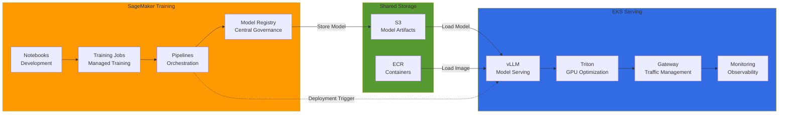
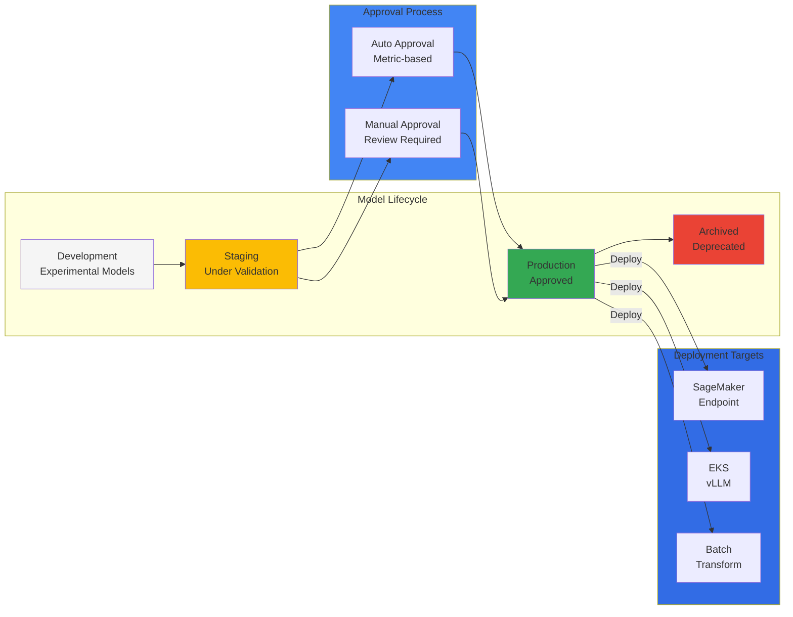
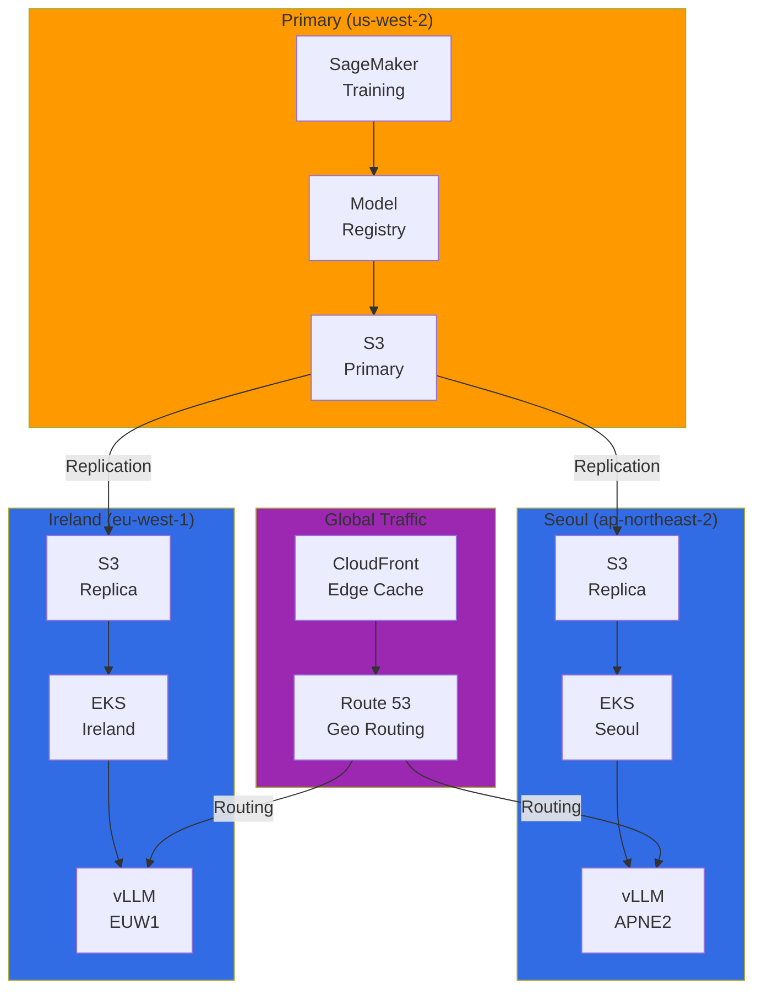
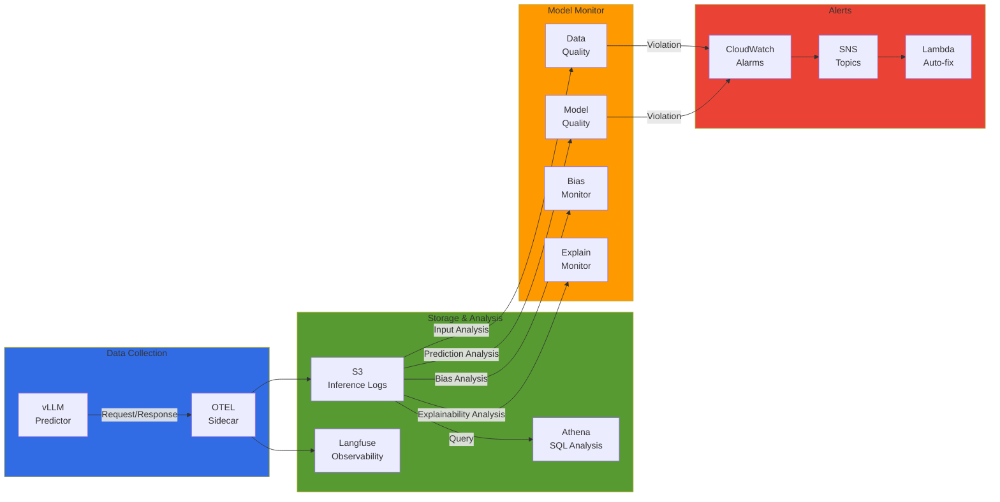

import SpecificationTable from '@site/src/components/tables/SpecificationTable';
import { HybridComparison, CostOptimization } from '@site/src/components/SagemakerTables';

# SageMaker-EKS Hybrid ML Architecture

> Published: 2026-02-13 | Updated: 2026-04-06 | Reading time: ~15 min

## Overview

This is a hybrid architecture that combines SageMaker's managed training environment with EKS's flexible serving infrastructure. By leveraging the strengths of each platform, it achieves both cost efficiency and operational flexibility.

<HybridComparison />


## Hybrid Architecture Patterns

### Overall Architecture Overview



### Pattern 1: SageMaker Training -> EKS Serving

**Use Case:** Large-scale distributed training, reduced training infrastructure management burden, fine-grained control over serving environment

### Pattern 2: EKS Training -> SageMaker Serving

**Use Case:** Custom training frameworks, Kubernetes-native training tools (Kubeflow, Ray)

### Pattern 3: Hybrid Serving

**Use Case:** High-availability production, multi-region, A/B testing

---

## SageMaker Pipelines Integration

### SageMaker Components for Kubeflow Pipelines

AWS provides official components for invoking SageMaker from Kubeflow Pipelines.

```python
# sagemaker_kubeflow_pipeline.py
import kfp
from kfp import dsl
from kfp.aws import use_aws_secret
import sagemaker
from sagemaker.workflow.pipeline_context import PipelineSession

@dsl.component(
    base_image="public.ecr.aws/sagemaker/sagemaker-distribution:latest",
    packages_to_install=["sagemaker>=2.200.0"]
)
def sagemaker_training_component(
    training_image: str, role_arn: str, instance_type: str,
    instance_count: int, s3_input_data: str, s3_output_path: str,
    hyperparameters: dict
) -> str:
    """Run SageMaker Training Job"""
    import sagemaker
    from sagemaker.estimator import Estimator
    
    estimator = Estimator(
        image_uri=training_image, role=role_arn,
        instance_count=instance_count, instance_type=instance_type,
        output_path=s3_output_path, sagemaker_session=sagemaker.Session(),
        hyperparameters=hyperparameters
    )
    estimator.fit({"training": s3_input_data}, wait=True)
    return estimator.model_data


@dsl.component(
    base_image="public.ecr.aws/sagemaker/sagemaker-distribution:latest",
    packages_to_install=["sagemaker>=2.200.0"]
)
def register_model_to_registry(
    model_data: str, model_package_group_name: str,
    inference_image: str, role_arn: str
) -> str:
    """Register model to Model Registry"""
    import sagemaker
    from sagemaker.model import Model
    
    model = Model(
        image_uri=inference_image, model_data=model_data,
        role=role_arn, sagemaker_session=sagemaker.Session()
    )
    model_package = model.register(
        content_types=["application/json"],
        response_types=["application/json"],
        inference_instances=["ml.g5.xlarge"],
        transform_instances=["ml.g5.xlarge"],
        model_package_group_name=model_package_group_name,
        approval_status="PendingManualApproval"
    )
    return model_package.model_package_arn


@dsl.component(
    base_image="python:3.10",
    packages_to_install=["kubernetes", "boto3", "pyyaml"]
)
def deploy_to_vllm(
    model_package_arn: str, model_name: str, namespace: str = "vllm-inference"
) -> str:
    """Deploy vLLM Deployment"""
    import boto3, yaml, tempfile, subprocess

    sm_client = boto3.client('sagemaker')
    model_package = sm_client.describe_model_package(ModelPackageName=model_package_arn)
    model_data_url = model_package['InferenceSpecification']['Containers'][0]['ModelDataUrl']

    deployment_manifest = {
        "apiVersion": "apps/v1", "kind": "Deployment",
        "metadata": {
            "name": f"vllm-{model_name}", "namespace": namespace,
            "labels": {"app": f"vllm-{model_name}", "model": model_name}
        },
        "spec": {
            "replicas": 2,
            "selector": {"matchLabels": {"app": f"vllm-{model_name}"}},
            "template": {
                "metadata": {"labels": {"app": f"vllm-{model_name}"}},
                "spec": {
                    "containers": [{
                        "name": "vllm-server",
                        "image": "vllm/vllm-openai:latest",
                        "args": ["--model", model_data_url, "--tensor-parallel-size", "1", "--max-model-len", "4096"],
                        "ports": [{"containerPort": 8000, "name": "http"}],
                        "resources": {
                            "requests": {"nvidia.com/gpu": "1", "memory": "16Gi"},
                            "limits": {"nvidia.com/gpu": "1", "memory": "32Gi"}
                        },
                        "env": [{"name": "VLLM_LOGGING_LEVEL", "value": "INFO"}]
                    }]
                }
            }
        }
    }

    with tempfile.NamedTemporaryFile(mode='w', suffix='.yaml', delete=False) as f:
        yaml.dump(deployment_manifest, f)
        manifest_path = f.name

    subprocess.run(["kubectl", "apply", "-f", manifest_path, "-n", namespace], check=True)
    return f"Deployed {model_name} to vLLM"


@dsl.pipeline(name="SageMaker to EKS Hybrid Pipeline", description="Train on SageMaker, deploy to EKS")
def hybrid_ml_pipeline(
    training_image: str = "763104351884.dkr.ecr.us-west-2.amazonaws.com/pytorch-training:2.1.0-gpu-py310",
    inference_image: str = "763104351884.dkr.ecr.us-west-2.amazonaws.com/pytorch-inference:2.1.0-gpu-py310",
    role_arn: str = "arn:aws:iam::123456789012:role/SageMakerExecutionRole",
    instance_type: str = "ml.g5.2xlarge",
    s3_input_data: str = "s3://my-bucket/training-data/",
    s3_output_path: str = "s3://my-bucket/models/",
    model_package_group: str = "fraud-detection-models"
):
    training_task = sagemaker_training_component(
        training_image=training_image, role_arn=role_arn,
        instance_type=instance_type, instance_count=2,
        s3_input_data=s3_input_data, s3_output_path=s3_output_path,
        hyperparameters={"epochs": "50", "batch-size": "64", "learning-rate": "0.001"}
    )
    training_task.apply(use_aws_secret('aws-secret', 'AWS_ACCESS_KEY_ID', 'AWS_SECRET_ACCESS_KEY'))
    
    registry_task = register_model_to_registry(
        model_data=training_task.output, model_package_group_name=model_package_group,
        inference_image=inference_image, role_arn=role_arn
    )
    registry_task.apply(use_aws_secret('aws-secret', 'AWS_ACCESS_KEY_ID', 'AWS_SECRET_ACCESS_KEY'))
    
    deploy_task = deploy_to_vllm(
        model_package_arn=registry_task.output,
        model_name="fraud-detection-v1", namespace="vllm-inference"
    )
    return deploy_task.output
```


---

## SageMaker Model Registry Governance

### Centralized Model Management

SageMaker Model Registry serves as the central repository for all models, applying consistent governance even in EKS serving environments.



### Model Registry Setup

```python
# model_registry_setup.py
import boto3

sm_client = boto3.client('sagemaker')

try:
    sm_client.create_model_package_group(
        ModelPackageGroupName="fraud-detection-models",
        ModelPackageGroupDescription="Fraud detection models for production",
        Tags=[{"Key": "Team", "Value": "ml-platform"}, {"Key": "Environment", "Value": "production"}]
    )
except sm_client.exceptions.ResourceInUse:
    print("Model package group already exists")

# Model approval policy
model_approval_policy = {
    "Rules": [
        {"Name": "AutoApproveHighAccuracy", "Condition": {"MetricName": "accuracy", "Operator": "GreaterThanOrEqualTo", "Value": 0.95}, "Action": "Approve"},
        {"Name": "RejectLowAccuracy", "Condition": {"MetricName": "accuracy", "Operator": "LessThan", "Value": 0.85}, "Action": "Reject"}
    ]
}
```

### Querying Model Registry from EKS

```python
# eks_model_loader.py
import boto3
from kubernetes import client, config

def get_approved_model_from_registry(model_package_group_name: str) -> str:
    """Retrieve the latest approved model"""
    sm_client = boto3.client('sagemaker')
    response = sm_client.list_model_packages(
        ModelPackageGroupName=model_package_group_name,
        ModelApprovalStatus='Approved', SortBy='CreationTime',
        SortOrder='Descending', MaxResults=1
    )
    if not response['ModelPackageSummaryList']:
        raise ValueError(f"No approved models in {model_package_group_name}")
    
    model_package_arn = response['ModelPackageSummaryList'][0]['ModelPackageArn']
    model_package = sm_client.describe_model_package(ModelPackageName=model_package_arn)
    return model_package['InferenceSpecification']['Containers'][0]['ModelDataUrl']

def update_vllm_with_latest_model(model_name: str, namespace: str):
    """Update vLLM Deployment"""
    config.load_incluster_config()
    model_url = get_approved_model_from_registry("fraud-detection-models")
    
    patch_body = {
        "spec": {"template": {"spec": {"containers": [{
            "name": "vllm-server",
            "args": ["--model", model_url, "--tensor-parallel-size", "1", "--max-model-len", "4096"]
        }]}}}
    }
    client.AppsV1Api().patch_namespaced_deployment(
        name=f"vllm-{model_name}", namespace=namespace, body=patch_body
    )
    print(f"Updated {model_name} with {model_url}")
```


---

## Cost Optimization Strategies

### Training vs Serving Cost Analysis

<CostOptimization />

### Cost Optimization Checklist

```yaml
# cost-optimization-config.yaml
training:
  # SageMaker Managed Spot Training (up to 90% savings)
  use_spot_instances: true
  max_wait_time_seconds: 86400  # 24 hours
  max_run_time_seconds: 43200   # 12 hours
  
  # Enable checkpointing (for Spot interruption recovery)
  checkpoint_s3_uri: s3://my-bucket/checkpoints/
  checkpoint_local_path: /opt/ml/checkpoints
  
  # Instance type optimization
  instance_type: ml.g5.2xlarge  # GPU training
  instance_count: 2
  
  # Auto-terminate after training completes
  auto_terminate: true

serving:
  # Karpenter Spot instances (up to 70% savings)
  capacity_type: spot
  
  # Auto-scaling configuration
  min_replicas: 1
  max_replicas: 10
  target_utilization: 70
  
  # Scale down delay on idle
  scale_down_delay: 300  # 5 minutes
  
  # GPU sharing (MIG or MPS)
  enable_gpu_sharing: true
  max_shared_clients: 4

storage:
  # S3 Intelligent-Tiering
  s3_storage_class: INTELLIGENT_TIERING
  
  # Archive old models
  lifecycle_policy:
    archive_after_days: 90
    delete_after_days: 365
```

### Cost Monitoring Dashboard

```python
# cost_monitoring.py
import boto3
from datetime import datetime, timedelta

def get_sagemaker_training_costs(days=30):
    """Query SageMaker training costs"""
    ce_client = boto3.client('ce')
    end_date = datetime.now().date()
    start_date = end_date - timedelta(days=days)
    
    return ce_client.get_cost_and_usage(
        TimePeriod={'Start': start_date.strftime('%Y-%m-%d'), 'End': end_date.strftime('%Y-%m-%d')},
        Granularity='DAILY', Metrics=['UnblendedCost'],
        Filter={'Dimensions': {'Key': 'SERVICE', 'Values': ['Amazon SageMaker']}},
        GroupBy=[{'Type': 'DIMENSION', 'Key': 'USAGE_TYPE'}]
    )

def get_eks_serving_costs(cluster_name: str, days=30):
    """Query EKS serving costs"""
    ce_client = boto3.client('ce')
    end_date = datetime.now().date()
    start_date = end_date - timedelta(days=days)
    
    return ce_client.get_cost_and_usage(
        TimePeriod={'Start': start_date.strftime('%Y-%m-%d'), 'End': end_date.strftime('%Y-%m-%d')},
        Granularity='DAILY', Metrics=['UnblendedCost'],
        Filter={'And': [
            {'Dimensions': {'Key': 'SERVICE', 'Values': ['Amazon Elastic Compute Cloud - Compute']}},
            {'Tags': {'Key': 'kubernetes.io/cluster/' + cluster_name, 'Values': ['owned']}}
        ]}
    )
```


---

## Multi-Region Deployment Pattern

### Global Model Deployment Architecture



### S3 Cross-Region Replication Configuration

```json
{
  "Role": "arn:aws:iam::123456789012:role/S3ReplicationRole",
  "Rules": [
    {
      "ID": "ReplicateModelsToAPNE2", "Status": "Enabled", "Priority": 1,
      "Filter": {"Prefix": "models/"},
      "Destination": {
        "Bucket": "arn:aws:s3:::my-models-ap-northeast-2",
        "ReplicationTime": {"Status": "Enabled", "Time": {"Minutes": 15}},
        "Metrics": {"Status": "Enabled", "EventThreshold": {"Minutes": 15}}
      }
    },
    {
      "ID": "ReplicateModelsToEUW1", "Status": "Enabled", "Priority": 2,
      "Filter": {"Prefix": "models/"},
      "Destination": {
        "Bucket": "arn:aws:s3:::my-models-eu-west-1",
        "ReplicationTime": {"Status": "Enabled", "Time": {"Minutes": 15}}
      }
    }
  ]
}
```

### Multi-Region Deployment Automation

```python
# multi_region_deployment.py
import boto3
from typing import List, Dict
from kubernetes import client, config

class MultiRegionDeployer:
    def __init__(self, regions: List[str]):
        self.regions = regions
        self.sm_clients = {region: boto3.client('sagemaker', region_name=region) for region in regions}
    
    def deploy_model_to_all_regions(self, model_package_arn: str, model_name: str, namespace: str = "vllm-inference"):
        """Deploy model to all regions"""
        deployment_results = {}
        for region in self.regions:
            try:
                model_url = self._get_regional_model_url(model_package_arn, region)
                result = self._deploy_to_eks(region, model_url, model_name, namespace)
                deployment_results[region] = {"status": "success", "model_url": model_url, "endpoint": result}
            except Exception as e:
                deployment_results[region] = {"status": "failed", "error": str(e)}
        return deployment_results
    
    def _get_regional_model_url(self, model_package_arn: str, region: str) -> str:
        """Get regional model URL"""
        model_package = self.sm_clients[region].describe_model_package(ModelPackageName=model_package_arn)
        original_url = model_package['InferenceSpecification']['Containers'][0]['ModelDataUrl']
        return original_url.replace('us-west-2', region)
    
    def _deploy_to_eks(self, region: str, model_url: str, model_name: str, namespace: str) -> str:
        """Deploy to regional EKS cluster"""
        config.load_kube_config(context=f"eks-{region}")
        
        vllm_deployment = {
            "apiVersion": "apps/v1", "kind": "Deployment",
            "metadata": {"name": f"vllm-{model_name}-{region}", "namespace": namespace,
                        "labels": {"app": f"vllm-{model_name}", "region": region}},
            "spec": {
                "replicas": 2,
                "selector": {"matchLabels": {"app": f"vllm-{model_name}", "region": region}},
                "template": {
                    "metadata": {"labels": {"app": f"vllm-{model_name}", "region": region}},
                    "spec": {"containers": [{
                        "name": "vllm-server", "image": "vllm/vllm-openai:latest",
                        "args": ["--model", model_url, "--tensor-parallel-size", "1", "--max-model-len", "4096"],
                        "ports": [{"containerPort": 8000, "name": "http"}],
                        "resources": {"requests": {"nvidia.com/gpu": "1"}, "limits": {"nvidia.com/gpu": "1"}}
                    }]}
                }
            }
        }
        client.AppsV1Api().create_namespaced_deployment(namespace=namespace, body=vllm_deployment)
        return f"http://vllm-{model_name}-{region}.{namespace}.svc.cluster.local:8000"

# Usage example
deployer = MultiRegionDeployer(regions=["us-west-2", "ap-northeast-2", "eu-west-1"])
results = deployer.deploy_model_to_all_regions(
    model_package_arn="arn:aws:sagemaker:us-west-2:123456789012:model-package/fraud-detection/1",
    model_name="fraud-detection-v1"
)
print(results)
```


---

## Model Monitoring and Drift Detection

### Unified Monitoring Architecture



### vLLM OTEL Sidecar Configuration

```yaml
apiVersion: apps/v1
kind: Deployment
metadata:
  name: vllm-fraud-detection-monitored
  namespace: vllm-inference
spec:
  replicas: 2
  selector:
    matchLabels:
      app: vllm-fraud-detection
  template:
    metadata:
      labels:
        app: vllm-fraud-detection
    spec:
      serviceAccountName: vllm-sa
      containers:
        - name: vllm-server
          image: vllm/vllm-openai:latest
          args: [--model, s3://my-models/fraud-detection/model.tar.gz, --tensor-parallel-size, "1", --max-model-len, "4096"]
          ports:
            - containerPort: 8000
              name: http
          resources:
            requests: {nvidia.com/gpu: 1, memory: 16Gi}
            limits: {nvidia.com/gpu: 1, memory: 32Gi}
          env:
            - name: VLLM_LOGGING_LEVEL
              value: "INFO"
        - name: otel-collector
          image: otel/opentelemetry-collector-contrib:latest
          args: [--config=/conf/otel-collector-config.yaml]
          ports:
            - containerPort: 4317
            - containerPort: 4318
          volumeMounts:
            - name: otel-config
              mountPath: /conf
          env:
            - name: LANGFUSE_PUBLIC_KEY
              valueFrom: {secretKeyRef: {name: langfuse-credentials, key: public-key}}
            - name: LANGFUSE_SECRET_KEY
              valueFrom: {secretKeyRef: {name: langfuse-credentials, key: secret-key}}
            - name: LANGFUSE_HOST
              value: "https://langfuse.example.com"
          resources:
            requests: {cpu: "200m", memory: "512Mi"}
            limits: {cpu: "500m", memory: "1Gi"}
      volumes:
        - name: otel-config
          configMap:
            name: otel-collector-config
---
apiVersion: v1
kind: ConfigMap
metadata:
  name: otel-collector-config
  namespace: vllm-inference
data:
  otel-collector-config.yaml: |
    receivers:
      otlp:
        protocols:
          grpc: {endpoint: 0.0.0.0:4317}
          http: {endpoint: 0.0.0.0:4318}
    processors:
      batch: {timeout: 10s, send_batch_size: 1024}
      resource:
        attributes:
          - {key: service.name, value: vllm-fraud-detection, action: upsert}
    exporters:
      otlphttp/langfuse:
        endpoint: ${LANGFUSE_HOST}/api/public/ingestion
        headers: {Authorization: Bearer ${LANGFUSE_SECRET_KEY}}
      awss3:
        s3uploader: {region: us-west-2, s3_bucket: my-inference-logs, s3_prefix: fraud-detection/, s3_partition: hour}
      awscloudwatchlogs:
        log_group_name: /aws/vllm/fraud-detection
        log_stream_name: inference-logs
        region: us-west-2
    service:
      pipelines:
        traces: {receivers: [otlp], processors: [batch, resource], exporters: [otlphttp/langfuse]}
        logs: {receivers: [otlp], processors: [batch, resource], exporters: [awss3, awscloudwatchlogs]}
```

### SageMaker Model Monitor Integration

```python
# sagemaker_model_monitor.py
from sagemaker.model_monitor import DataQualityMonitor
from sagemaker import Session

data_quality_monitor = DataQualityMonitor(
    role='arn:aws:iam::123456789012:role/SageMakerModelMonitorRole',
    instance_count=1, instance_type='ml.m5.xlarge',
    volume_size_in_gb=20, max_runtime_in_seconds=3600,
    sagemaker_session=Session()
)

baseline_job = data_quality_monitor.suggest_baseline(
    baseline_dataset='s3://my-bucket/training-data/baseline.csv',
    dataset_format={'csv': {'header': True}},
    output_s3_uri='s3://my-bucket/model-monitor/baseline', wait=True
)

monitoring_schedule = data_quality_monitor.create_monitoring_schedule(
    monitor_schedule_name='fraud-detection-data-quality',
    endpoint_input='s3://my-inference-logs/fraud-detection/',
    output_s3_uri='s3://my-bucket/model-monitor/reports',
    statistics=baseline_job.baseline_statistics(),
    constraints=baseline_job.suggested_constraints(),
    schedule_cron_expression='cron(0 * * * ? *)',
    enable_cloudwatch_metrics=True
)
print(f"Monitoring schedule: {monitoring_schedule.monitoring_schedule_name}")
```

### Drift Detection and Automatic Retraining

```python
# drift_detection_handler.py
import boto3, json
from datetime import datetime

def lambda_handler(event, context):
    """Automatic retraining triggered by CloudWatch Alarm"""
    message = json.loads(event['Records'][0]['Sns']['Message'])
    alarm_name = message['AlarmName']
    
    if 'DataQualityViolation' in alarm_name:
        print(f"Data quality violation: {alarm_name}")
        sm_client = boto3.client('sagemaker')
        training_job_name = f"fraud-detection-retrain-{datetime.now().strftime('%Y%m%d%H%M%S')}"
        
        sm_client.create_training_job(
            TrainingJobName=training_job_name,
            RoleArn='arn:aws:iam::123456789012:role/SageMakerExecutionRole',
            AlgorithmSpecification={
                'TrainingImage': '763104351884.dkr.ecr.us-west-2.amazonaws.com/pytorch-training:2.1.0-gpu-py310',
                'TrainingInputMode': 'File'
            },
            InputDataConfig=[{
                'ChannelName': 'training',
                'DataSource': {'S3DataSource': {
                    'S3DataType': 'S3Prefix',
                    'S3Uri': 's3://my-bucket/training-data/',
                    'S3DataDistributionType': 'FullyReplicated'
                }}
            }],
            OutputDataConfig={'S3OutputPath': 's3://my-bucket/models/'},
            ResourceConfig={'InstanceType': 'ml.g5.2xlarge', 'InstanceCount': 2, 'VolumeSizeInGB': 50},
            StoppingCondition={'MaxRuntimeInSeconds': 43200},
            Tags=[{'Key': 'Trigger', 'Value': 'AutoRetraining'}, {'Key': 'Reason', 'Value': 'DataDrift'}]
        )
        print(f"Retraining job: {training_job_name}")
        return {'statusCode': 200, 'body': json.dumps({'message': 'Retraining triggered', 'training_job': training_job_name})}
    
    return {'statusCode': 200, 'body': json.dumps({'message': 'No action required'})}
```


---

## Summary

The SageMaker-EKS hybrid architecture combines the advantages of managed training with flexible serving.

### Key Takeaways

1. **Hybrid Pattern**: SageMaker training + EKS serving
2. **Central Governance**: Unified Model Registry management
3. **Cost Optimization**: Spot instances + auto-scaling
4. **Multi-Region**: S3 Cross-Region Replication
5. **Monitoring**: Model Monitor + EKS logging integration

### Recommendations

- Use SageMaker for large-scale distributed training, EKS for serving
- Strengthen centralized governance through Model Registry
- Build automatic retraining pipelines triggered by drift detection

### Next Steps

- [EKS-Based MLOps Pipeline](./mlops-pipeline-eks.md)
- [GPU Resource Management](../model-serving/gpu-resource-management.md)
- [Model Monitoring](../operations-mlops/agent-monitoring.md)

---

## References

- [SageMaker Components for Kubeflow Pipelines](https://docs.aws.amazon.com/sagemaker/latest/dg/kubernetes-sagemaker-components-for-kubeflow-pipelines.html)
- [SageMaker Model Registry](https://docs.aws.amazon.com/sagemaker/latest/dg/model-registry.html)
- [SageMaker Model Monitor](https://docs.aws.amazon.com/sagemaker/latest/dg/model-monitor.html)
- [vLLM Documentation](https://docs.vllm.ai/)
- [vLLM Deployment Guide](https://docs.vllm.ai/en/latest/serving/deploying_with_docker.html)
- [ArgoCD Documentation](https://argo-cd.readthedocs.io/)
- [OpenTelemetry Collector](https://opentelemetry.io/docs/collector/)
- [Langfuse Self-Hosting](https://langfuse.com/docs/deployment/self-host)
- [AWS Multi-Region Architecture](https://aws.amazon.com/solutions/implementations/multi-region-application-architecture/)
