import { ScalingComparison, ResponsePatterns, MaturityTable, EvolutionStages, MLModelComparison, AnomalyMetrics, RightSizingResults, ChaosExperiments, DashboardPanels } from '@site/src/components/PredictiveOpsTables';

# Predictive Scaling and Auto-Remediation Patterns

> 📅 **Created**: 2026-02-12 | **Updated**: 2026-02-14 | ⏱️ **Reading time**: ~29 min

---

## 1. Overview

### 1.1 From Reactive to Autonomous

EKS Operations evolution **reactive-type → prediction-type → autonomous-type** 3phase 이루어집.

<EvolutionStages />

:::info Scope of This Document
Goes beyond the limitations of reactive scaling, covering ML-based predictive scaling and autonomous recovery patterns through AI Agents. especially Kiro+MCP based **programmatic 디버깅**과 Kagent/Strands based **automatic incident response**을 중심 as 설명.
:::

### 1.2 Why Predictive Operations Are Needed

- **HPA 계**: metric threshold 초 and after reactive → 이미 use impact occurrence
- **Cold Start issue**: 새 Pod start 30초-2minutes → traffic spike time response impossible
- **node provisioning delay**: Karpenteralso node start 1-3minutes required
- **복합 failure**: single metric으 detection impossible 복합 cause failure increase
- **cost ratioefficiency**: 과also 여유 resource securing → cost waste

---

## 2. ML-Based Predictive Scaling

### 2.1 Limitations of HPA

HPA (Horizontal Pod Autoscaler) has structural limitations as it reacts to **current metrics**.

<ScalingComparison />

```
[HPA의 반응형 스케일링]

트래픽 ████████████████████████░░░░░░░░░
 ↑ 임계값 초과
 |
Pod 수 ██████████░░░░████████████████████
 ↑ 스케일아웃 시작
 | (지연 발생)
사용자 ✓✓✓✓✓✓✓✓✗✗✗✓✓✓✓✓✓✓✓✓✓✓✓✓✓✓
경험 ↑ 성능 저하 구간

[ML 예측 스케일링]

트래픽 ████████████████████████░░░░░░░░░
 ↑ 예측 시점 (30분 전)
 |
Pod 수 ██████████████████████████████████
 ↑ 사전 스케일아웃
 |
사용자 ✓✓✓✓✓✓✓✓✓✓✓✓✓✓✓✓✓✓✓✓✓✓✓✓✓✓
경험 (성능 저하 없음)
```

### 2.2 Time Series Forecasting Models

Representative ML models for predicting EKS workload traffic patterns:

<MLModelComparison />

### 2.3 Prophet-Based Predictive Scaling Implementation

```python
# Prophet 기반 EKS 트래픽 예측
import boto3
from prophet import Prophet
import pandas as pd
from datetime import datetime, timedelta

def fetch_metrics_from_amp(workspace_id, query, hours=168):
 """AMP에서 지난 7일간 메트릭 조회"""
 client = boto3.client('amp', region_name='ap-northeast-2')
 end_time = datetime.utcnow()
 start_time = end_time - timedelta(hours=hours)

 response = client.query_range(
 workspaceId=workspace_id,
 query=query,
 startTime=start_time,
 endTime=end_time,
 step='5m'
 )
 return response

def predict_scaling(metrics_df, forecast_hours=2):
 """Prophet으로 향후 트래픽 예측"""
 # Prophet 형식으로 변환
 df = metrics_df.rename(columns={
 'timestamp': 'ds',
 'value': 'y'
 })

 model = Prophet(
 changepoint_prior_scale=0.05,
 seasonality_mode='multiplicative',
 daily_seasonality=True,
 weekly_seasonality=True,
 )
 model.fit(df)

 # 향후 forecast_hours 예측
 future = model.make_future_dataframe(
 periods=forecast_hours * 12, # 5분 간격
 freq='5min'
 )
 forecast = model.predict(future)

 return forecast[['ds', 'yhat', 'yhat_upper', 'yhat_lower']]

def calculate_required_pods(predicted_rps, pod_capacity_rps=100):
 """예측 RPS 기반 필요 Pod 수 계산"""
 # 상한값(yhat_upper) 사용으로 안전 마진 확보
 required = int(predicted_rps / pod_capacity_rps) + 1
 return max(required, 2) # 최소 2개 유지

def apply_scaling(namespace, deployment, target_replicas):
 """kubectl을 통해 스케일링 적용"""
 import subprocess
 cmd = f"kubectl scale deployment/{deployment} -n {namespace} --replicas={target_replicas}"
 subprocess.run(cmd.split(), check=True)
 print(f"Scaled {deployment} to {target_replicas} replicas")
```

### 2.4 CronJob-Based Predictive Scaling Automation

```yaml
# 예측 스케일링을 주기적으로 실행하는 CronJob
apiVersion: batch/v1
kind: CronJob
metadata:
 name: predictive-scaler
 namespace: scaling
spec:
 schedule: "*/15 * * * *" # 15분마다 실행
 jobTemplate:
 spec:
 template:
 spec:
 serviceAccountName: predictive-scaler
 containers:
 - name: scaler
 image: my-registry/predictive-scaler:latest
 env:
 - name: AMP_WORKSPACE_ID
 value: "ws-xxxxx"
 - name: TARGET_NAMESPACE
 value: "payment"
 - name: TARGET_DEPLOYMENT
 value: "payment-service"
 - name: FORECAST_HOURS
 value: "2"
 resources:
 requests:
 cpu: 500m
 memory: 1Gi
 limits:
 cpu: "1"
 memory: 2Gi
 restartPolicy: OnFailure
```

### 2.5 Network Performance Prediction and ML Inference Workload Optimization

EKS **Container Network Observability**는 Pod-to-Pod 통신 pattern 세밀 monitoring, network bottleneck preemptive prediction and ML inference workload performance Optimization .

#### Container Network Observability data utilization

**1. Pod-to-Pod 통신 pattern → network bottleneck prediction**

```python
# Container Network Observability 메트릭 기반 병목 예측
import boto3
from prophet import Prophet
import pandas as pd

def predict_network_bottleneck(cluster_name, namespace):
 """
 Pod-to-Pod 네트워크 지연을 예측하여 병목 가능성을 판단합니다.
 """
 cloudwatch = boto3.client('cloudwatch')

 # Container Network Observability 메트릭 조회
 metrics = cloudwatch.get_metric_data(
 MetricDataQueries=[
 {
 'Id': 'rx_latency',
 'MetricStat': {
 'Metric': {
 'Namespace': 'ContainerInsights',
 'MetricName': 'pod_network_rx_latency_ms',
 'Dimensions': [
 {'Name': 'ClusterName', 'Value': cluster_name},
 {'Name': 'Namespace', 'Value': namespace}
 ]
 },
 'Period': 300,
 'Stat': 'Average'
 }
 },
 {
 'Id': 'tx_bytes',
 'MetricStat': {
 'Metric': {
 'Namespace': 'ContainerInsights',
 'MetricName': 'pod_network_tx_bytes',
 'Dimensions': [
 {'Name': 'ClusterName', 'Value': cluster_name},
 {'Name': 'Namespace', 'Value': namespace}
 ]
 },
 'Period': 300,
 'Stat': 'Sum'
 }
 }
 ],
 StartTime=datetime.utcnow() - timedelta(days=7),
 EndTime=datetime.utcnow()
 )

 # Prophet 모델로 향후 2시간 예측
 df = pd.DataFrame({
 'ds': [d['Timestamp'] for d in metrics['MetricDataResults'][0]['Timestamps']],
 'y': [d for d in metrics['MetricDataResults'][0]['Values']]
 })

 model = Prophet(changepoint_prior_scale=0.05)
 model.fit(df)

 future = model.make_future_dataframe(periods=24, freq='5min')
 forecast = model.predict(future)

 # 병목 예측: 레이턴시가 평소 대비 2배 이상 증가 예상
 baseline = df['y'].mean()
 predicted_peak = forecast['yhat'].iloc[-1]

 if predicted_peak > baseline * 2:
 return {
 'bottleneck_risk': 'HIGH',
 'predicted_latency_ms': predicted_peak,
 'baseline_latency_ms': baseline,
 'action': 'consider_network_policy_optimization'
 }
 return {'bottleneck_risk': 'LOW'}
```

**2. Cross-AZ traffic 추 → Cost Optimization prediction**

```promql
# Cross-AZ 네트워크 트래픽 비용 추적
sum(rate(pod_network_tx_bytes{
 source_az!="", dest_az!="",
 source_az!=dest_az
}[5m])) by (source_az, dest_az)
* 0.01 / 1024 / 1024 / 1024 # $0.01/GB
```

**Cost Optimization Strategy**:

- **토폴로지 인식 scheduling**: Kubernetes Topology Aware Hints leveraging 동day AZ 내 통신 선호
- **service 메time Optimization**: Istio locality load balancing as Cross-AZ traffic 최소화
- **prediction based 배치**: ML model 통신 pattern learning to 최 AZ 배치 recommendation

```yaml
# Topology Aware Hints 활성화
apiVersion: v1
kind: Service
metadata:
 name: ml-inference-service
 annotations:
 service.kubernetes.io/topology-mode: Auto
spec:
 selector:
 app: ml-inference
 ports:
 - port: 8080
 type: ClusterIP
```

#### ML inference workload performance prediction

**1. Ray, vLLM, Triton, PyTorch workload network performance Monitoring**

```yaml
# vLLM 추론 서비스 네트워크 모니터링
apiVersion: v1
kind: ConfigMap
metadata:
 name: vllm-network-monitoring
data:
 metrics.yaml: |
 # Container Network Observability 메트릭
 metrics:
 - pod_network_rx_bytes
 - pod_network_tx_bytes
 - pod_network_rx_latency_ms
 - pod_network_rx_errors_total

 # 추가 커스텀 메트릭
 custom_metrics:
 - name: vllm_inference_network_throughput_mbps
 query: |
 sum(rate(pod_network_rx_bytes{app="vllm-inference"}[1m]))
 / 1024 / 1024

 - name: vllm_model_load_network_time_ms
 query: |
 histogram_quantile(0.99,
 rate(pod_network_rx_latency_bucket{
 app="vllm-inference",
 operation="model_load"
 }[5m])
 )
```

**Ray distributed inference network pattern**:

```python
# Ray 클러스터의 네트워크 병목 감지
import ray
from ray import serve

@serve.deployment
class LLMInferenceDeployment:
 def __init__(self):
 self.model = load_model()
 self.network_monitor = NetworkMonitor()

 async def __call__(self, request):
 # 네트워크 지연 추적
 start_time = time.time()

 # Ray의 분산 추론 호출
 result = await self.model.generate(request.prompt)

 network_latency = time.time() - start_time

 # CloudWatch에 커스텀 메트릭 전송
 self.network_monitor.record_latency(network_latency)

 # 네트워크 병목 감지 시 스케일 아웃 트리거
 if network_latency > 200: # 200ms 이상
 trigger_scale_out()

 return result
```

**2. inference latency → scale-out trigger prediction**

```python
# ML 추론 레이턴시 기반 예측 스케일링
def predict_inference_scaling(service_name, forecast_hours=2):
 """
 추론 레이턴시 패턴을 학습하여 스케일 아웃 필요 시점을 예측합니다.
 """
 # 지난 7일간 추론 레이턴시 데이터 수집
 latency_data = fetch_inference_latency_from_cloudwatch(
 service_name=service_name,
 days=7
 )

 # 추론 요청 수 데이터 수집
 request_volume = fetch_request_volume(service_name, days=7)

 # 레이턴시와 요청 수의 상관관계 분석
 df = pd.DataFrame({
 'timestamp': latency_data['timestamps'],
 'latency_p99': latency_data['p99'],
 'request_rate': request_volume['rate']
 })

 # 임계값 계산: P99 레이턴시 > 500ms 시점의 요청 수
 threshold_requests = df[df['latency_p99'] > 500]['request_rate'].min()

 # Prophet으로 향후 요청 수 예측
 prophet_df = df[['timestamp', 'request_rate']].rename(
 columns={'timestamp': 'ds', 'request_rate': 'y'}
 )

 model = Prophet()
 model.fit(prophet_df)

 future = model.make_future_dataframe(
 periods=forecast_hours * 12, # 5분 간격
 freq='5min'
 )
 forecast = model.predict(future)

 # 스케일 아웃 필요 시점 예측
 scale_out_needed = forecast[
 forecast['yhat'] > threshold_requests
 ]['ds'].min()

 if pd.notna(scale_out_needed):
 # 예측된 시간 30분 전에 선제적 스케일 아웃
 preemptive_time = scale_out_needed - timedelta(minutes=30)

 return {
 'scale_out_recommended': True,
 'recommended_time': preemptive_time,
 'predicted_request_rate': forecast.iloc[-1]['yhat'],
 'threshold': threshold_requests,
 'current_replicas': get_current_replicas(service_name),
 'recommended_replicas': calculate_required_replicas(
 forecast.iloc[-1]['yhat'],
 threshold_requests
 )
 }

 return {'scale_out_recommended': False}
```

**3. GPU userate + network bandwidth correlation Analysis**

```promql
# GPU 사용률과 네트워크 대역폭의 상관관계
# (NVIDIA DCGM Exporter 메트릭 + Container Network Observability)

# GPU 사용률
DCGM_FI_DEV_GPU_UTIL{
 namespace="ml-inference",
 pod=~"vllm-.*"
}

# 동시 네트워크 수신 대역폭
sum(rate(pod_network_rx_bytes{
 namespace="ml-inference",
 pod=~"vllm-.*"
}[1m])) by (pod)

# 상관관계 분석: GPU 사용률 < 50% && 네트워크 대역폭 > 100MB/s
# → 네트워크 병목이 GPU 활용도를 저해하고 있음
```

**Optimization strategy**:

```yaml
# 네트워크 병목 해소: Enhanced Networking 및 ENA Express 활성화
apiVersion: karpenter.sh/v1
kind: NodePool
metadata:
 name: ml-inference-pool
spec:
 template:
 spec:
 requirements:
 - key: karpenter.k8s.aws/instance-family
 operator: In
 values: ["p5", "p4d"] # 최신 GPU 인스턴스 (ENA Express 지원)
 - key: karpenter.k8s.aws/instance-size
 operator: In
 values: ["24xlarge", "48xlarge"]
 nodeClassRef:
 name: ml-inference-class
---
apiVersion: karpenter.k8s.aws/v1
kind: EC2NodeClass
metadata:
 name: ml-inference-class
spec:
 amiSelectorTerms:
 - alias: al2023@latest
 userData: |
 #!/bin/bash
 # ENA Express 활성화 (100Gbps 네트워크 성능)
 ethtool -K eth0 ena-express on

 # TCP BBR congestion control (높은 대역폭 최적화)
 echo "net.ipv4.tcp_congestion_control=bbr" >> /etc/sysctl.conf
 sysctl -p
```

#### EKS Auto Mode automatic recovery/ 치유

**EKS Auto Mode**는 node failure automatic as detection and recovery to, **MTTR(Mean Time To Recovery)**을 대폭 improvement.

**1. automatic node failure detection and 교체**

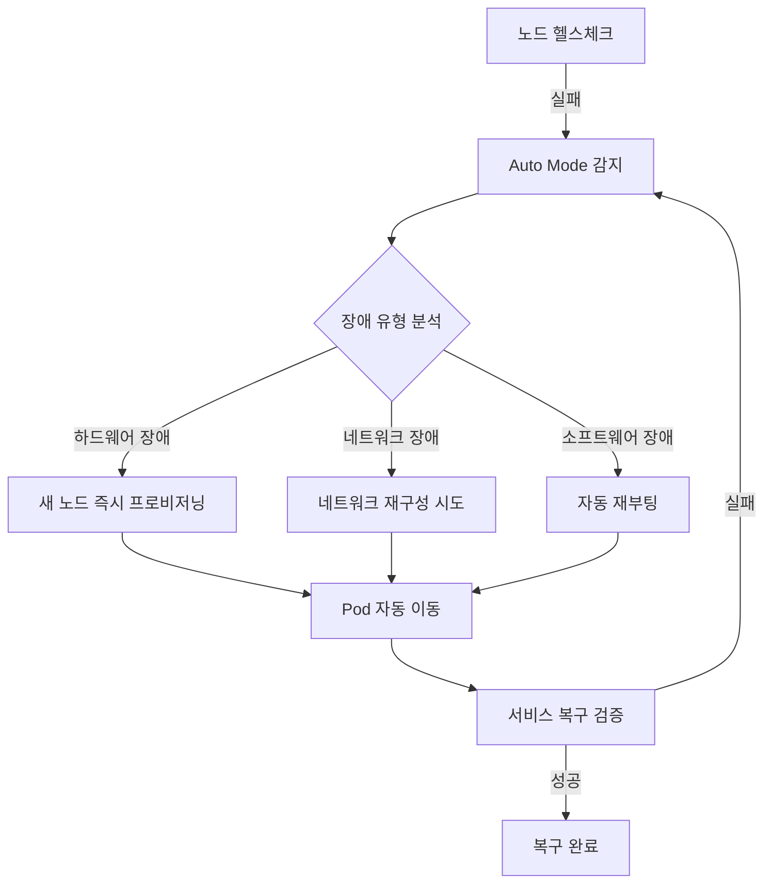

**automatic recovery trigger**:

- **NodeNotReady**: node 5minutes abnormal NotReady status
- **NetworkUnavailable**: network plugin failure
- **MemoryPressure/DiskPressure**: resource shortage
- **Unschedulable**: node scheduling impossible status

**2. OS 패칭 Automation**

Auto Mode **제 다운타임 OS 패칭**을 automatic as perform:

```yaml
# Auto Mode 노드 자동 업데이트 정책 (사용자 설정 불필요)
# AWS가 자동으로 관리하는 내부 정책 예시
nodeMaintenance:
 autoUpdate: true
 maintenanceWindow:
 preferredDays: ["Sunday", "Wednesday"]
 preferredHours: ["02:00-06:00"] # UTC
 strategy:
 type: RollingUpdate
 maxUnavailable: 1
 respectPodDisruptionBudget: true
```

**패칭 process**:

1. **신규 node provisioning**: 최신 AL2023 AMI 새 node generation
2. **Pod safety movement**: PDB 준 and existing node from 새 node Pod movement
3. **구 node removal**: all Pod movement 완료 after 구 node 종료
4. **Validation**: service 헬스체크 통 and Verification

**3. security service Integration**

Auto Mode AWS security service and automatic Integration **security incident automatic response**이 possible:

```
GuardDuty Extended Threat Detection
 ↓ (암호화폐 채굴 감지)
Auto Mode 자동 대응
 ↓
1. 영향받은 노드 격리 (Taint: NoSchedule)
2. 새 노드 프로비저닝
3. 깨끗한 노드로 Pod 이동
4. 감염된 노드 종료 및 포렌식 데이터 수집
5. CloudWatch Logs에 인시던트 기록
```

**4. prediction 관점: Auto Mode MTTR improvement**

** existing manual Operations vs Auto Mode ratio교**:

| Failure Scenario | manual Operations MTTR | Auto Mode MTTR | Improvement |
|--------------|----------------|----------------|--------|
| node 드웨어 failure | 15-30minutes | 2-5minutes | **83% 단축** |
| OS security patch | time (계획 다운타임) | 0minutes (제 다운타임) | **100% improvement** |
| network plugin failure | 10-20minutes | 1-3minutes | **85% 단축** |
| 악code 감염 | 30minutes-1time | 5-10minutes | **80% 단축** |

**prediction Operations 관점 Auto Mode value**:

- **preemptive 교체**: node performance 저 detection to failure before 교체
- **automatic 용량 Management**: workload pattern learning to 최 node 타입 automatic optional
- **무interruption maintenance보**: use 입 without security patch and 업그레이드 automatic perform
- **Cost Optimization**: Spot instance interruption time automatic as On-Demand failover

:::tip Auto Mode + prediction Operations time너지
Auto Mode automatic recovery feature **reactive(Reactive)**이지only, Container Network Observability data and combinationif **prediction(Predictive)** operations possible. network performance 저 pattern detection to failure occurrence기 before node 교체거나, ML inference workload network bottleneck preemptive 해소 .
:::

---

## 3. Karpenter + AI Prediction

### 3.1 Karpenter Basic Operation

Karpenter Pending Pod detection to **합 instance 타입 automatic optional** and provisioning.

```yaml
# Karpenter NodePool 설정
apiVersion: karpenter.sh/v1
kind: NodePool
metadata:
 name: default
spec:
 template:
 spec:
 requirements:
 - key: kubernetes.io/arch
 operator: In
 values: ["amd64", "arm64"]
 - key: karpenter.sh/capacity-type
 operator: In
 values: ["on-demand", "spot"]
 - key: karpenter.k8s.aws/instance-family
 operator: In
 values: ["m7g", "m7i", "c7g", "c7i", "r7g"]
 - key: karpenter.k8s.aws/instance-size
 operator: In
 values: ["medium", "large", "xlarge", "2xlarge"]
 nodeClassRef:
 group: karpenter.k8s.aws
 kind: EC2NodeClass
 name: default
 limits:
 cpu: "100"
 memory: 400Gi
 disruption:
 consolidationPolicy: WhenEmptyOrUnderutilized
 consolidateAfter: 30s
---
apiVersion: karpenter.k8s.aws/v1
kind: EC2NodeClass
metadata:
 name: default
spec:
 role: KarpenterNodeRole
 amiSelectorTerms:
 - alias: al2023@latest
 subnetSelectorTerms:
 - tags:
 karpenter.sh/discovery: my-cluster
 securityGroupSelectorTerms:
 - tags:
 karpenter.sh/discovery: my-cluster
 blockDeviceMappings:
 - deviceName: /dev/xvda
 ebs:
 volumeSize: 100Gi
 volumeType: gp3
 iops: 3000
 throughput: 125
```

### 3.2 AI Prediction-Based Preemptive Provisioning

Karpenter 체 Pending Pod reactivenotonly, **AI prediction and combination**if preemptive as node provisioning .

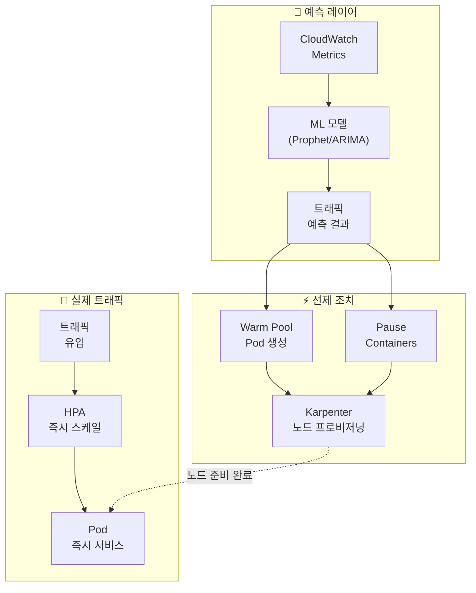

**preemptive provisioning strategy**:

```yaml
# Placeholder Pod로 노드 선제 확보
apiVersion: apps/v1
kind: Deployment
metadata:
 name: capacity-reservation
 namespace: scaling
spec:
 replicas: 0 # 예측 스케일러가 동적으로 조정
 selector:
 matchLabels:
 app: capacity-reservation
 template:
 metadata:
 labels:
 app: capacity-reservation
 spec:
 priorityClassName: capacity-reservation # 낮은 우선순위
 terminationGracePeriodSeconds: 0
 containers:
 - name: pause
 image: registry.k8s.io/pause:3.9
 resources:
 requests:
 cpu: "1"
 memory: 2Gi
---
# 낮은 우선순위 클래스 (실제 워크로드에 의해 축출됨)
apiVersion: scheduling.k8s.io/v1
kind: PriorityClass
metadata:
 name: capacity-reservation
value: -10
globalDefault: false
description: "Karpenter 노드 선제 프로비저닝용"
```

:::tip preemptive provisioning 원리

1. ML model 30minutes after traffic increase prediction
2. Placeholder Pod(pause container) replicas 늘림
3. Karpenter Pending Pod detection to node provisioning
4. actual traffic 오면 HPA actual Pod generation
5. Placeholder Pod low 우선순위 immediately 축출됨
6. node 이미 readiness 있으므 Pod immediately scheduling됨
:::

### 3.5 ARC + Karpenter Integrated Automatic AZ Evacuation

**ARC(Application Recovery Controller)**는 AWS 고가용 service로, AZ failure automatic as detection and traffic 건강 AZ movementtime킵. Karpenter and Integrationif **node 레벨 automatic recovery** possible.

#### ARC overview

Application Recovery Controller following 3가지 key features Provision:

- **Readiness Check**: application 헬스 status continuous as Monitoring
- **Routing Control**: Route 53 or ALB through traffic routing 제어
- **Zonal Shift**: AZ 단위 traffic automatic or manual as movement

#### Karpenter Integration pattern

```yaml
# ARC Zonal Shift 시그널을 감지하는 Controller
apiVersion: v1
kind: ConfigMap
metadata:
 name: arc-karpenter-controller
 namespace: kube-system
data:
 config.yaml: |
 arcCluster: arn:aws:route53-recovery-control::ACCOUNT:cluster/CLUSTER_ID
 routingControls:
 - name: az-a-routing
 arn: arn:aws:route53-recovery-control::ACCOUNT:controlpanel/PANEL/routingcontrol/CONTROL_A
 - name: az-b-routing
 arn: arn:aws:route53-recovery-control::ACCOUNT:controlpanel/PANEL/routingcontrol/CONTROL_B
 - name: az-c-routing
 arn: arn:aws:route53-recovery-control::ACCOUNT:controlpanel/PANEL/routingcontrol/CONTROL_C
 karpenterNodePools:
 - default
 - gpu-pool
```

#### AZ failure automatic recovery time퀀스

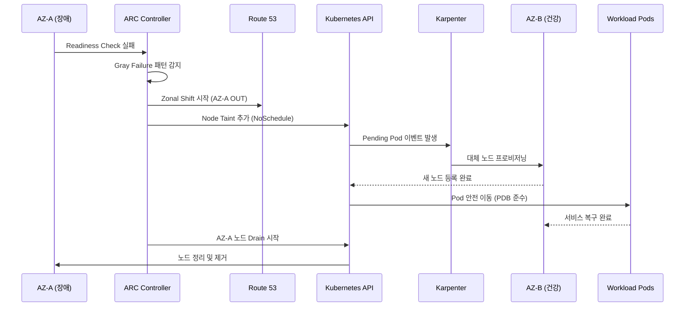

#### Gray Failure 처리

**Gray Failure**는 complete failure not performance 저 status means. ARC following pattern detection:

- **network delay increase**: 평소 5ms → 50ms abnormal
- **between헐 타임아웃**: request 1-5%가 failure
- **resource 경합**: CPU steal time increase, network 패킷 손실

```python
# Gray Failure 감지 Lambda 함수 예시
import boto3
from datetime import datetime, timedelta

def detect_gray_failure(event, context):
 """
 Container Network Observability 데이터를 기반으로
 Gray Failure 패턴을 감지합니다.
 """
 cloudwatch = boto3.client('cloudwatch')

 # AZ별 네트워크 지연 메트릭 조회
 response = cloudwatch.get_metric_statistics(
 Namespace='ContainerInsights',
 MetricName='pod_network_rx_latency_ms',
 Dimensions=[
 {'Name': 'ClusterName', 'Value': 'my-cluster'},
 {'Name': 'AvailabilityZone', 'Value': 'ap-northeast-2a'}
 ],
 StartTime=datetime.utcnow() - timedelta(minutes=15),
 EndTime=datetime.utcnow(),
 Period=60,
 Statistics=['Average', 'Maximum']
 )

 # Gray Failure 임계값 체크
 datapoints = response['Datapoints']
 if len(datapoints) < 10:
 return {'status': 'insufficient_data'}

 avg_latency = sum(d['Average'] for d in datapoints) / len(datapoints)
 max_latency = max(d['Maximum'] for d in datapoints)

 # 기준: 평균 지연 > 50ms 또는 최대 지연 > 200ms
 if avg_latency > 50 or max_latency > 200:
 trigger_zonal_shift('ap-northeast-2a')
 return {'status': 'gray_failure_detected', 'action': 'zonal_shift'}

 return {'status': 'healthy'}

def trigger_zonal_shift(az):
 """ARC Zonal Shift를 트리거합니다."""
 arc = boto3.client('route53-recovery-cluster')
 arc.update_routing_control_state(
 RoutingControlArn='arn:aws:route53-recovery-control::ACCOUNT:...',
 RoutingControlState='Off' # AZ-A 트래픽 차단
 )
```

#### Istio Integration End-to-end recovery

Istio service 메time useif **L7 레벨 traffic 제어**가 possible:

```yaml
# Istio DestinationRule: AZ 장애 시 자동 페일오버
apiVersion: networking.istio.io/v1beta1
kind: DestinationRule
metadata:
 name: payment-service-dr
spec:
 host: payment-service
 trafficPolicy:
 outlierDetection:
 consecutiveErrors: 5
 interval: 30s
 baseEjectionTime: 30s
 maxEjectionPercent: 50
 loadBalancer:
 localityLbSetting:
 enabled: true
 failover:
 - from: ap-northeast-2a
 to: ap-northeast-2c
```

**End-to-end recovery flow**:

1. **ARC Readiness Check failure** → Zonal Shift start
2. **Route 53** → AZ-A 가 external traffic blocking
3. **Istio Envoy** → AZ-A 내부 Pod 가 East-West traffic blocking
4. **Karpenter** → AZ-C 대체 node provisioning
5. **Kubernetes** → PDB 준 and Pod safety movement
6. **Istio** → 새 Pod traffic automatic routing

#### prediction AZ Management

Container Network Observability data leveraging **AZ performance abnormal preemptive as detection**:

```promql
# AZ별 네트워크 에러율 추이
sum(rate(pod_network_rx_errors_total[5m])) by (availability_zone)
/ sum(rate(pod_network_rx_packets_total[5m])) by (availability_zone)
* 100

# AZ별 평균 Pod-to-Pod 레이턴시
histogram_quantile(0.99,
 sum(rate(pod_network_latency_bucket[5m])) by (availability_zone, le)
)
```

**prediction AZ Management strategy**:

- **트렌드 Analysis**: 지난 7daybetween per AZ performance pattern learning
- **조기 경보**: performance baseline compared to 20% 저 time alert
- **preemptive Shift**: 30% 저 time automatic Zonal Shift consideration
- **Cost Optimization**: Cross-AZ traffic cost consideration 최 배치

:::warning ARC + Karpenter Integration Considerations
ARC + Karpenter Integration PDB 올바르 Configuration case에only safe Pod movement guarantee. all production workload PDB Configuration.

```yaml
apiVersion: policy/v1
kind: PodDisruptionBudget
metadata:
 name: payment-service-pdb
spec:
 minAvailable: 2
 selector:
 matchLabels:
 app: payment-service
```
:::

---

## 4. CloudWatch Anomaly Detection

### 4.1 abnormal detection 밴드

CloudWatch Anomaly Detection ML use to metric **normal scope 밴드**를 automatic as learning and, 밴드 벗어나 abnormal detection.

```bash
# Anomaly Detection 모델 생성
aws cloudwatch put-anomaly-detector \
 --namespace "ContainerInsights" \
 --metric-name "pod_cpu_utilization" \
 --dimensions Name=ClusterName,Value=my-cluster \
 --stat "Average" \
 --configuration '{
 "ExcludedTimeRanges": [
 {
 "StartTime": "2026-01-01T00:00:00Z",
 "EndTime": "2026-01-02T00:00:00Z"
 }
 ],
 "MetricTimezone": "Asia/Seoul"
 }'
```

### 4.2 EKS metric Application

Anomaly Detection Application Core EKS metric:

<AnomalyMetrics />

### 4.3 Anomaly Detection based alarm

```bash
# Anomaly Detection 기반 CloudWatch Alarm
aws cloudwatch put-metric-alarm \
 --alarm-name "EKS-CPU-Anomaly" \
 --comparison-operator GreaterThanUpperThreshold \
 --threshold-metric-id ad1 \
 --evaluation-periods 3 \
 --datapoints-to-alarm 2 \
 --metrics '[
 {
 "Id": "m1",
 "MetricStat": {
 "Metric": {
 "Namespace": "ContainerInsights",
 "MetricName": "pod_cpu_utilization",
 "Dimensions": [
 {"Name": "ClusterName", "Value": "my-cluster"}
 ]
 },
 "Period": 300,
 "Stat": "Average"
 }
 },
 {
 "Id": "ad1",
 "Expression": "ANOMALY_DETECTION_BAND(m1, 2)"
 }
 ]' \
 --alarm-actions "arn:aws:sns:ap-northeast-2:ACCOUNT_ID:ops-alerts"
```

---

## 5. AI Agent Automatic Incident Response

### 5.1 Limitations of Existing Automation

EventBridge + Lambda based Automation **규칙 based**이므 계 있:

```
[기존 방식: 규칙 기반 자동화]
CloudWatch Alarm → EventBridge Rule → Lambda → 고정된 조치

문제점:
 ✗ "CPU > 80%이면 스케일아웃" — 원인이 메모리 누수일 수도 있음
 ✗ "Pod 재시작 > 5이면 알림" — 원인별 대응이 다름
 ✗ 복합 장애 대응 불가
 ✗ 새로운 패턴에 적응 불가
```

### 5.2 AI Agent-Based Autonomous Response

<ResponsePatterns />

AI Agent **컨텍스트 based decision** as autonomous as response.

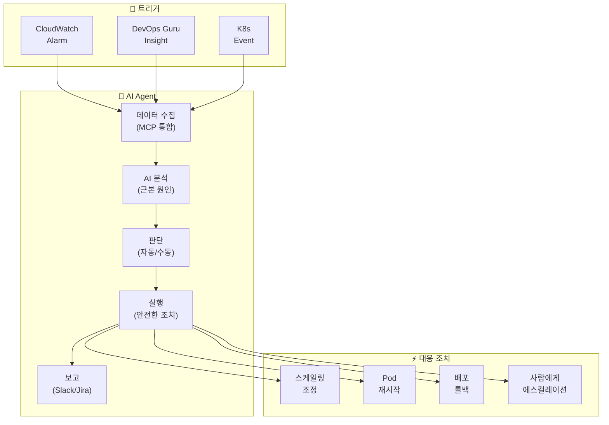

### 5.3 Kagent Automatic Incident Response

```yaml
# Kagent: 자동 인시던트 대응 에이전트
apiVersion: kagent.dev/v1alpha1
kind: Agent
metadata:
 name: incident-responder
 namespace: kagent-system
spec:
 description: "EKS 인시던트 자동 대응 에이전트"
 modelConfig:
 provider: bedrock
 model: anthropic.claude-sonnet
 region: ap-northeast-2
 systemPrompt: |
 당신은 EKS 인시던트 대응 에이전트입니다.

 ## 대응 원칙
 1. 안전 우선: 위험한 변경은 사람에게 에스컬레이션
 2. 근본 원인 우선: 증상이 아닌 원인에 대응
 3. 최소 개입: 필요한 최소한의 조치만 수행
 4. 모든 조치 기록: Slack과 JIRA에 자동 보고

 ## 자동 조치 허용 범위
 - Pod 재시작 (CrashLoopBackOff, 5회 이상)
 - HPA min/max 조정 (현재값의 ±50% 범위)
 - Deployment rollback (이전 버전으로)
 - 노드 drain (MemoryPressure/DiskPressure)

 ## 에스컬레이션 대상
 - 데이터 손실 가능성이 있는 조치
 - 50% 이상의 replicas 영향
 - StatefulSet 관련 변경
 - 네트워크 정책 변경

 tools:
 - name: kubectl
 type: kmcp
 config:
 allowedVerbs: ["get", "describe", "logs", "top", "rollout", "scale", "delete"]
 deniedResources: ["secrets", "configmaps"]
 - name: cloudwatch
 type: kmcp
 config:
 actions: ["GetMetricData", "DescribeAlarms", "GetInsight"]
 - name: slack
 type: mcp
 config:
 webhook_url: "${SLACK_WEBHOOK}"
 channel: "#incidents"

 triggers:
 - type: cloudwatch-alarm
 filter:
 severity: ["CRITICAL", "HIGH"]
 - type: kubernetes-event
 filter:
 reason: ["CrashLoopBackOff", "OOMKilled", "FailedScheduling"]
```

### 5.4 Strands Agent SOP: Complex Failure Response

```python
# Strands Agent: 복합 장애 자동 대응
from strands import Agent
from strands.tools import eks_tool, cloudwatch_tool, slack_tool, jira_tool

incident_agent = Agent(
 name="complex-incident-handler",
 model="bedrock/anthropic.claude-sonnet",
 tools=[eks_tool, cloudwatch_tool, slack_tool, jira_tool],
 sop="""
 ## 복합 장애 대응 SOP

 ### Phase 1: 상황 파악 (30초 이내)
 1. CloudWatch 알람 및 DevOps Guru 인사이트 조회
 2. 관련 서비스의 Pod 상태 확인
 3. 노드 상태 및 리소스 사용률 확인
 4. 최근 배포 이력 확인 (10분 이내 변경 사항)

 ### Phase 2: 근본 원인 분석 (2분 이내)
 1. 로그에서 에러 패턴 추출
 2. 메트릭 상관 분석 (CPU, Memory, Network, Disk)
 3. 배포 변경과의 시간적 상관관계 분석
 4. 의존 서비스 상태 확인

 ### Phase 3: 자동 대응
 원인별 자동 조치:

 **배포 관련 장애:**
 - 최근 10분 이내 배포 존재 → 자동 롤백
 - 롤백 후 상태 확인 → 정상화되면 완료

 **리소스 부족:**
 - CPU/Memory > 90% → HPA 조정 또는 Karpenter 노드 추가
 - Disk > 85% → 불필요 로그/이미지 정리

 **의존 서비스 장애:**
 - RDS 연결 실패 → 연결 풀 설정 확인, 필요시 재시작
 - SQS 지연 → DLQ 확인, 소비자 스케일아웃

 **원인 불명:**
 - 사람에게 에스컬레이션
 - 수집된 모든 데이터를 Slack에 공유

 ### Phase 4: 사후 처리
 1. 인시던트 타임라인 생성
 2. JIRA 인시던트 티켓 생성
 3. Slack #incidents 채널에 보고서 게시
 4. 학습 데이터로 저장 (피드백 루프)
 """
)
```

:::info AI Agent Core Value
EventBridge+Lambda 넘어 AI 컨텍스트 based autonomous response possible. ** various data source**(CloudWatch, EKS API, X-Ray, Deployment 이력)를 **MCP Integration 조times** to, 규칙으 responsecannot 복합 failurealso root cause Analysis and appropriate action automatic as perform.
:::

### 5.5 CloudWatch Investigations — AI-Based Automatic Root Cause Analysis

**CloudWatch Investigations**는 AWS 17yearbetween accumulation Operations 경험 based as build **generation-type AI based automatic 조사 system**. incident occurrence time AI automatic as 가설 generation and, data collection and, Validation 조사 workflow execution.

#### CloudWatch Investigations overview

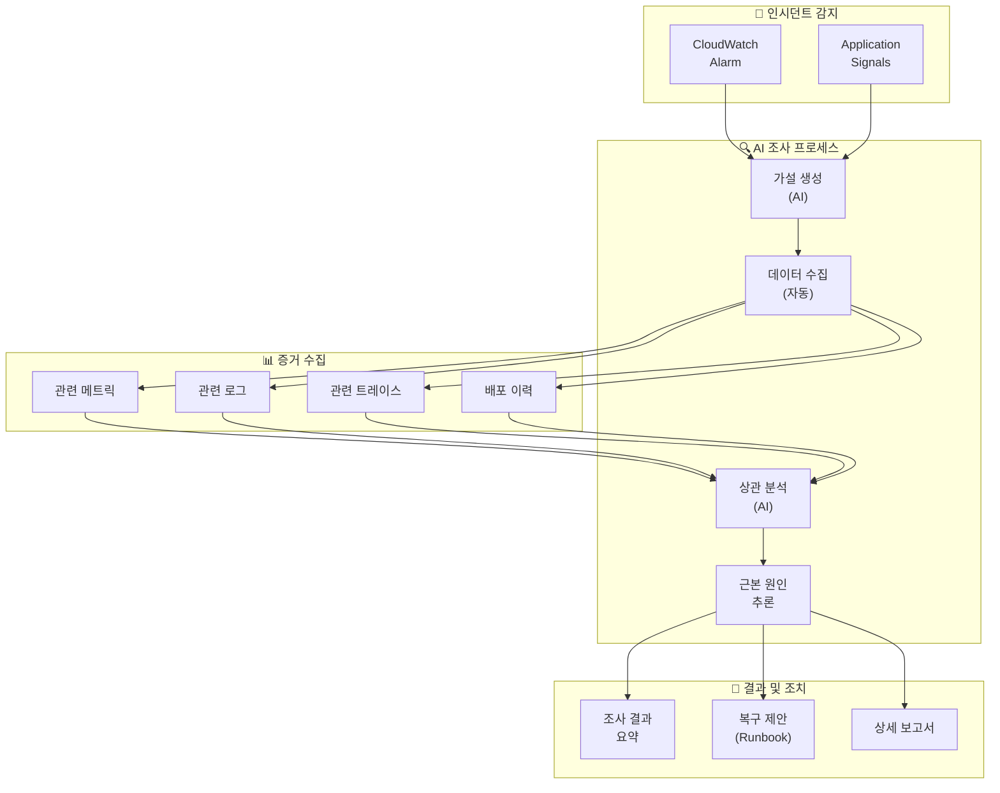

#### Key Features

**1. Application Signals Integration: service 맵 based impactalso automatic Analysis**

CloudWatch Investigations Application Signals automatic generation service 맵 leveraging **failure before파 경로**를 tracking:

```yaml
# Application Signals 자동 서비스 맵 예시
payment-gateway (에러율 증가 25%)
 └─> payment-service (레이턴시 증가 300%)
 ├─> postgres-db (연결 풀 고갈)
 └─> redis-cache (정상)
 └─> dynamodb (정상)
```

Investigations 이 맵 Analysis to:
- **Root Cause**: `postgres-db` connection 풀 exhaustion
- **Impacted Services**: `payment-service`, `payment-gateway`
- **Propagation Path**: DB → Service → Gateway

**2. 관련 metric/log/traces automatic correlation Analysis**

```python
# Investigations가 수행하는 자동 상관 분석 예시

# 시간적 상관관계
payment_service_errors.spike_at = "2026-02-12 14:23:00"
db_connection_pool.exhausted_at = "2026-02-12 14:22:55"
# → 5초 차이: DB 문제가 서비스 에러보다 먼저 발생

# 메트릭 상관관계
db_active_connections = 100 (max_connections 도달)
payment_service_response_time = 5000ms (평소 50ms 대비 100배)
# → 강한 상관관계: DB 연결 고갈 → 서비스 지연

# 로그 패턴 분석
logs.error_pattern = "CannotGetJdbcConnectionException"
logs.frequency = 1,234 occurrences in last 5 minutes
# → 명확한 증거: DB 연결 불가 에러
```

**3. 가설 based root cause inference**

Investigations following and such as 가설 automatic generation and Validation:

| Hypothesis | Verification Method | Result |
|------|----------|------|
| DB connection 풀 exhaustion | `db_connections` metric Verification | ✓ Verification됨 |
| network delay | VPC Flow Logs Analysis | ✗ normal |
| OOM(memory shortage) | container memory metric Verification | ✗ normal |
| Deployment after 버그 | 최근 Deployment 이력 조times | ✓ 10minutes before Deployment Verification |

**최종 결론**: 최근 Deployment from DB connection 풀 Configuration `maxPoolSize=50` from `maxPoolSize=10` as 잘못 change됨.

**4. 조사 result summary and recovery recommendation**

```
━━━━━━━━━━━━━━━━━━━━━━━━━━━━━━━━━━━━━━━━━━
 CloudWatch Investigations 결과 요약
━━━━━━━━━━━━━━━━━━━━━━━━━━━━━━━━━━━━━━━━━━

🔴 근본 원인 (Root Cause):
 payment-service의 DB 연결 풀 설정 오류
 (maxPoolSize: 50 → 10으로 잘못 변경)

📊 영향도 (Impact):
 - payment-gateway: 에러율 25% 증가
 - payment-service: 레이턴시 300% 증가
 - 영향받은 요청: 약 15,000건

⏱️ 타임라인:
 14:10 - 배포 시작 (v1.2.3 → v1.2.4)
 14:22 - DB 연결 풀 고갈 시작
 14:23 - 서비스 에러 급증 알람 발생
 14:25 - Investigations 자동 시작

💡 권장 조치:
 1. 즉시 롤백: kubectl rollout undo deployment/payment-service
 2. DB 연결 풀 설정 복구: maxPoolSize=50
 3. 배포 전 환경 변수 검증 단계 추가
 4. ConfigMap 변경 시 자동 검증 스크립트 적용

📋 관련 리소스:
 - Runbook: https://wiki/db-connection-pool-issue
 - 로그: CloudWatch Logs Insights 쿼리 링크
 - 메트릭: CloudWatch Dashboard 링크
━━━━━━━━━━━━━━━━━━━━━━━━━━━━━━━━━━━━━━━━━━
```

#### DevOps Agent and 차이점

| Aspect | CloudWatch Investigations | Kagent / Strands Agent |
|------|--------------------------|------------------------|
| **Operations method** | AWS managed (Configuration non-needed) | use installation·Operations |
| **Analysis scope** | AWS before역 data automatic collection | Configuration data sourceonly |
| **root cause Analysis** | AI based automatic 가설 generation·Validation | SOP based 규칙 execution |
| **커스터마이징** | limitation (AWS 프리셋) | high (complete 유also) |
| **automatic recovery** | recommendationonly Provision (execution 안 함) | automatic execution possible |
| **cost** | CloudWatch use량 based | infrastructure costonly |
| **learning 곡선** | none ( immediately use possible) | intermediate (YAML 작 needed) |

**recommendation Integration pattern**:

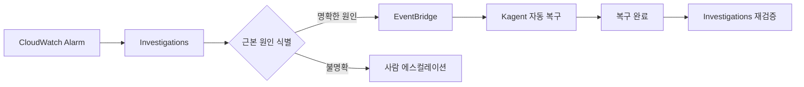

**Integration example: EventBridge Rule**

```json
{
 "source": ["aws.cloudwatch"],
 "detail-type": ["CloudWatch Investigation Complete"],
 "detail": {
 "conclusion": {
 "rootCauseType": ["Configuration Error", "Resource Exhaustion"]
 }
 }
}
```

```python
# EventBridge → Kagent 자동 복구 Lambda
def lambda_handler(event, context):
 """
 CloudWatch Investigations 결과를 받아
 Kagent를 통해 자동 복구를 트리거합니다.
 """
 investigation = event['detail']
 root_cause = investigation['conclusion']['rootCauseType']

 if root_cause == "Configuration Error":
 # Kagent에 ConfigMap 롤백 요청
 trigger_kagent_task(
 task_type="rollback_config",
 resource=investigation['affectedResources'][0],
 reason=investigation['conclusion']['summary']
 )
 elif root_cause == "Resource Exhaustion":
 # Kagent에 스케일링 요청
 trigger_kagent_task(
 task_type="scale_up",
 resource=investigation['affectedResources'][0],
 target_replicas=calculate_required_replicas()
 )
```

:::tip CloudWatch Investigations utilization strategy
CloudWatch Investigations Configuration without 바 usecan managed AI Analysis. custom Automation required case Kagent/Strands Agent along with use.

**Recommended Workflow**:
1. **1차 Analysis**: CloudWatch Investigations root cause automatic identification
2. **2차 response**: clear cause인 case → Kagent/Strands automatic recovery
3. **escalation**: non-clear case → 사람에 조사 result before달
:::

#### Practical Scenario: EKS Pod OOMKilled 조사

```
[인시던트] 14:45 - payment-service Pod OOMKilled

[Investigations 자동 조사]

단계 1: 가설 생성
 - 가설 A: 메모리 누수
 - 가설 B: 트래픽 급증으로 인한 정상 메모리 증가
 - 가설 C: 메모리 limits 설정 오류

단계 2: 데이터 수집
 - Pod 메모리 사용 추이: 100Mi → 512Mi (4시간)
 - 트래픽 추이: 변화 없음 (안정적)
 - Heap dump 분석: Redis 연결 객체 10,000개 누적

단계 3: 근본 원인 식별
 ✓ 가설 A 확인: 메모리 누수 (Redis 연결 미해제)
 ✗ 가설 B 기각: 트래픽 변화 없음
 ✗ 가설 C 기각: limits는 적절 (512Mi)

단계 4: 복구 제안
 즉시 조치:
 - kubectl rollout restart deployment/payment-service
 - 메모리 limits를 임시로 1Gi로 증가

 근본적 해결:
 - Redis 클라이언트 코드 수정 (연결 풀 제대로 닫기)
 - 메모리 프로파일링 도구 추가
 - 메모리 누수 모니터링 알람 설정

 관련 코드:
 파일: src/cache/redis_client.go
 문제: defer conn.Close() 누락
 수정 PR: https://github.com/...
```

### 5.6 Amazon Q Developer Natural Language-Based Operations Automation

**Amazon Q Developer**는 AWS 차세대 AI 어time스턴트로, **natural language interface** through EKS Operations 혁신 as between소화. 콘솔 탐색이나 complex 명령어 without, day상 언어 질문 and action request .

#### natural language interface based EKS troubleshooting

Amazon Q Developer **natural language 질의**를 AWS API call and kubectl 명령 as automatic 변환 to execution:

**scenario 1: OOM occurrence Pod 찾기**

```
[사용자 질문]
"이 클러스터에서 OOM이 발생하는 Pod를 찾아줘"

[Amazon Q Developer 응답]
분석 중입니다...

발견된 OOM 이벤트:
- payment-service-7d8f9c4b-xyz (namespace: payment)
 └─ 최근 3회 OOMKilled (지난 1시간)
 └─ 메모리 limits: 512Mi, 실제 사용: 520Mi
 └─ 권장: memory limits를 1Gi로 증가

- cart-service-5a6b2d1c-abc (namespace: shopping)
 └─ 최근 1회 OOMKilled (지난 30분)
 └─ 메모리 limits: 256Mi, 실제 사용: 280Mi
 └─ 권장: memory limits를 512Mi로 증가

실행된 명령:
$ kubectl get events --all-namespaces --field-selector reason=OOMKilled
$ kubectl top pod -n payment payment-service-7d8f9c4b-xyz
$ kubectl describe pod -n payment payment-service-7d8f9c4b-xyz

다음 조치를 원하시나요?
1. memory limits 자동 조정 (VPA 적용)
2. 상세 메모리 프로파일링 시작
3. 관련 로그 전체 분석
```

**scenario 2: 고부 node identification**

```
[사용자 질문]
"지난 1시간 동안 CPU 사용률이 80% 이상인 노드는?"

[Amazon Q Developer 응답]
CloudWatch Container Insights 데이터를 조회하고 있습니다...

고부하 노드 목록:

1. ip-10-0-1-45.ap-northeast-2.compute.internal
 - 평균 CPU: 87.3% (지난 1시간)
 - 최대 CPU: 94.1%
 - 인스턴스 타입: m5.xlarge (4 vCPU)
 - 실행 중인 Pod: 23개
 - 권장 조치: Karpenter를 통한 노드 추가 또는 워크로드 재분산

2. ip-10-0-2-78.ap-northeast-2.compute.internal
 - 평균 CPU: 82.5% (지난 1시간)
 - 최대 CPU: 89.7%
 - 인스턴스 타입: c5.2xlarge (8 vCPU)
 - 실행 중인 Pod: 31개
 - 권장 조치: CPU intensive Pod를 다른 노드로 이동

실행된 CloudWatch 쿼리:
namespace: ContainerInsights
metric: node_cpu_utilization
period: 1h
threshold: > 80%

다음 조치를 실행할까요?
1. Karpenter로 새 노드 자동 프로비저닝
2. 고부하 Pod를 다른 노드로 수동 이동
3. HPA 설정 검토 및 조정
```

**scenario 3: Deployment rollback**

```
[사용자 질문]
"이 Deployment를 롤백해줘"

[Amazon Q Developer 응답]
payment-service Deployment의 롤백을 준비하고 있습니다...

현재 배포 상태:
- Revision: 15
- 배포 시간: 2026-02-12 14:30:00 (15분 전)
- 에러율: 12.3% (평소 0.5% 대비 급증)
- 이전 안정 버전: Revision 14 (에러율 0.4%)

롤백 대상:
- 현재: payment-service:v2.3.1 (Revision 15)
- 롤백: payment-service:v2.3.0 (Revision 14)

PDB 확인:
- minAvailable: 2
- 현재 Running: 5
- 롤백 중 최소 보장: 2개 유지 ✓

실행 명령:
$ kubectl rollout undo deployment/payment-service -n payment --to-revision=14

롤백을 실행할까요? (yes/no)
```

**scenario 4: network connection issue diagnosis**

```
[사용자 질문]
"payment-service가 database에 연결할 수 없는 이유를 찾아줘"

[Amazon Q Developer 응답]
네트워크 연결 문제를 진단하고 있습니다...

진단 결과:

1. DNS 확인: ✓ 정상
 - database.payment.svc.cluster.local 해석 성공
 - IP: 10.100.15.234

2. 네트워크 정책 확인: ✗ 문제 발견
 - payment-service → database 연결 차단됨
 - 원인: NetworkPolicy "database-access-policy"에서
 payment-service의 라벨이 허용 목록에 없음

3. SecurityGroup 확인: ✓ 정상
 - RDS SecurityGroup에서 EKS 노드 허용

4. 로그 분석:
 - 에러: "dial tcp 10.100.15.234:5432: i/o timeout"
 - 발생 빈도: 지난 10분간 1,247회

해결 방법:
$ kubectl edit networkpolicy database-access-policy -n payment

다음 라벨을 ingress.from.podSelector에 추가:
 matchLabels:
 app: payment-service # ← 이 라벨 추가

수정된 YAML 미리보기:
---
apiVersion: networking.k8s.io/v1
kind: NetworkPolicy
metadata:
 name: database-access-policy
 namespace: payment
spec:
 podSelector:
 matchLabels:
 app: database
 ingress:
 - from:
 - podSelector:
 matchLabels:
 app: payment-service # ← 추가됨
 - podSelector:
 matchLabels:
 app: order-service
---

자동으로 수정할까요? (yes/no)
```

#### Cost Explorer Integration

Amazon Q Developer **AWS Cost Explorer**와 Integration natural language cost 질의 possible:

**scenario 1: cost increase cause Analysis**

```
[사용자 질문]
"이번 달 EKS 비용이 왜 증가했어?"

[Amazon Q Developer 응답]
Cost Explorer 데이터를 분석하고 있습니다...

비용 증가 분석 (2026년 2월):

총 EKS 비용: $12,450 (전월 대비 +45%)
증가 원인:

1. 컴퓨팅 비용 증가: +$3,200 (52% 기여)
 - m5.4xlarge 인스턴스 사용 증가
 - 원인: ML 추론 워크로드 증가 (vLLM 배포)
 - 권장: Graviton (m7g) 마이그레이션으로 40% 절감 가능

2. 데이터 전송 비용 증가: +$1,800 (29% 기여)
 - Cross-AZ 트래픽 증가 (150GB → 450GB)
 - 원인: 새로운 마이크로서비스 간 통신 패턴
 - 권장: Topology Aware Hints로 동일 AZ 통신 선호

3. EBS 스토리지 비용 증가: +$950 (15% 기여)
 - gp3 볼륨 사용량 증가 (500GB → 1,200GB)
 - 원인: Prometheus 메트릭 보관 기간 연장 (7일 → 30일)
 - 권장: S3로 장기 보관 데이터 이관

4. 로드 밸런서 비용 증가: +$250 (4% 기여)
 - ALB LCU 사용 증가
 - 원인: API 트래픽 증가

상세 비용 대시보드: (링크)
비용 최적화 제안 보고서 생성 중...
```

**scenario 2: Spot vs On-Demand Cost Comparison**

```
[사용자 질문]
"Spot 인스턴스로 전환하면 얼마나 절감할 수 있어?"

[Amazon Q Developer 응답]
Spot 절감 시뮬레이션을 실행하고 있습니다...

현재 클러스터 구성:
- On-Demand 노드: 45개
- 인스턴스 타입: m5.xlarge, m5.2xlarge, c5.2xlarge
- 월 비용: $8,500

Spot 전환 시뮬레이션 (70% Spot, 30% On-Demand):

시나리오 A: 보수적 전환 (Stateless 워크로드만)
- Spot 노드: 32개 (70%)
- On-Demand 노드: 13개 (30%)
- 예상 월 비용: $3,200
- 절감액: $5,300/월 (62% 절감)
- 위험도: 낮음 (Stateful 워크로드는 On-Demand 유지)

시나리오 B: 적극적 전환 (대부분 Spot)
- Spot 노드: 40개 (89%)
- On-Demand 노드: 5개 (11%)
- 예상 월 비용: $1,900
- 절감액: $6,600/월 (78% 절감)
- 위험도: 중간 (Spot 중단 시 일부 서비스 영향)

Spot 중단 대응:
- Karpenter 자동 재프로비저닝: 평균 90초
- Spot Instance Interruption Warning: 2분 전 알림
- PDB로 최소 가용성 보장

권장 사항:
1. 시나리오 A로 시작 (안정성 우선)
2. 2주 동안 모니터링
3. 안정적이면 시나리오 B로 확대

Spot 전환 계획서 생성 중...
```

#### MCP server Integration 저code AIOps

Amazon Q Developer **Model Context Protocol(MCP)** through various AWS service and Integration, **저code AIOps solution**을 buildcan:

**MCP server integration architecture**:

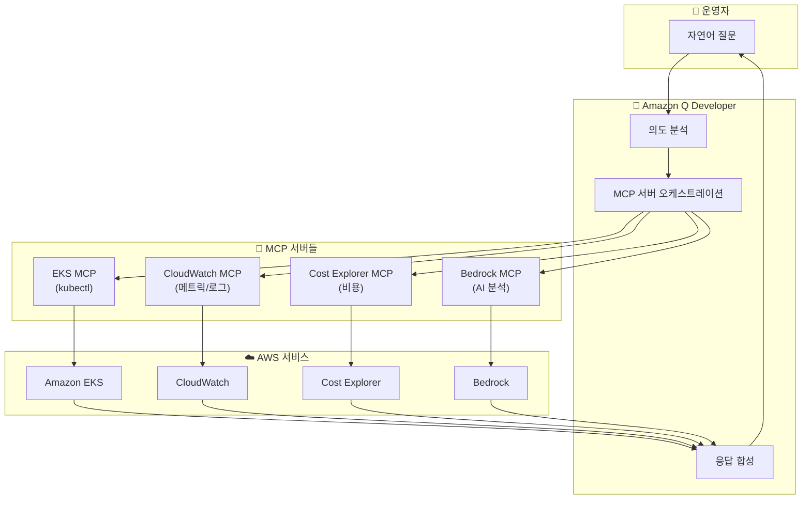

**Integration Operations 뷰 example**:

```
[사용자 질문]
"payment-service의 현재 상태를 종합적으로 보여줘"

[Amazon Q Developer 응답]
payment-service 통합 상태 대시보드:

━━━━━━━━━━━━━━━━━━━━━━━━━━━━━━━━━━━━━━━━━━
 PAYMENT-SERVICE 상태 (2026-02-12 15:30)
━━━━━━━━━━━━━━━━━━━━━━━━━━━━━━━━━━━━━━━━━━

1. Kubernetes 상태 (EKS MCP)
 - Deployment: payment-service
 - Replicas: 5/5 Running
 - Image: payment-service:v2.3.1
 - 최근 재시작: 없음 (안정적)
 - PDB: minAvailable=2 (만족)

2. 성능 메트릭 (CloudWatch MCP)
 - Request Rate: 1,234 req/s
 - P50 Latency: 45ms
 - P99 Latency: 280ms (SLO: 500ms) ✓
 - Error Rate: 0.3% (SLO: 1%) ✓
 - CPU 사용률: 65% (평균)
 - Memory 사용률: 72% (평균)

3. 비용 (Cost Explorer MCP)
 - 이번 달 비용: $1,245
 - 전월 대비: +12%
 - 주요 비용: 컴퓨팅 (m5.xlarge x 5)
 - 최적화 기회: Spot 전환 시 $750 절감 가능

4. AI 분석 (Bedrock MCP)
 - 상태: 정상
 - 트렌드: 트래픽 증가 추세 (주간 +15%)
 - 예측: 2주 내 스케일링 필요
 - 권장: HPA maxReplicas를 10으로 증가

5. 최근 이벤트 (CloudWatch Logs MCP)
 - 배포: 2일 전 (v2.3.0 → v2.3.1) 성공
 - 알람: 없음
 - 에러 로그: 15건 (경미, DB 연결 타임아웃)

━━━━━━━━━━━━━━━━━━━━━━━━━━━━━━━━━━━━━━━━━━

종합 평가: 🟢 정상
다음 조치 필요: 없음
관찰 계속: CPU/Memory 추세 모니터링

자세히 보려는 항목이 있나요? (1-5)
```

**natural language → MCP call → result Analysis → 액션 recommendation automatic loop**:

```python
# Amazon Q Developer의 내부 동작 (개념적)
class QDeveloperAIOpsLoop:
 def process_query(self, user_query: str):
 """자연어 질의를 처리하는 자동 루프"""

 # 1. 의도 분석
 intent = self.analyze_intent(user_query)
 # 예: "payment-service 상태" → intents: ["k8s_status", "metrics", "cost"]

 # 2. 필요한 MCP 서버 식별
 required_mcps = self.identify_mcps(intent)
 # 예: ["eks-mcp", "cloudwatch-mcp", "cost-explorer-mcp"]

 # 3. MCP 호출 (병렬)
 results = await asyncio.gather(
 self.eks_mcp.get_deployment_status("payment-service"),
 self.cloudwatch_mcp.get_metrics("payment-service", period="1h"),
 self.cost_explorer_mcp.get_service_cost("payment-service")
 )

 # 4. 결과 통합 분석 (Bedrock Claude 사용)
 analysis = self.bedrock_mcp.analyze(
 prompt=f"다음 데이터를 분석하여 종합 상태를 평가하고 액션을 제안해주세요:\n{results}",
 model="anthropic.claude-sonnet-4.0"
 )

 # 5. 액션 제안 생성
 actions = self.generate_actions(analysis)
 # 예: ["HPA 조정", "Spot 전환 고려", "로그 모니터링 강화"]

 # 6. 사용자에게 응답
 return self.format_response(analysis, actions)
```

**MCP server 조합 example**:

| 질문 type | use되 MCP server | Integration Analysis |
|----------|----------------|----------|
| "Pod 왜 restart나요?" | EKS MCP + CloudWatch Logs MCP | event + log correlation Analysis |
| "cost 왜 increase했나요?" | Cost Explorer MCP + EKS MCP | cost increase + resource change correlation Analysis |
| "network delay occurrence나요?" | CloudWatch MCP + EKS MCP | metric + network policy Analysis |
| "security 위협 있나요?" | GuardDuty MCP + EKS MCP | 위협 detection + Pod status Analysis |

#### Kagent/Strands and 차이점

| Aspect | Amazon Q Developer | Kagent / Strands |
|------|-------------------|------------------|
| **Operations method** | 대화-type tool (Interactive) | Automation agent (Autonomous) |
| **trigger** | use 질문 (On-demand) | event based (Event-driven) |
| ** major 용also** | manual 조사 and Analysis | automatic response and recovery |
| **execution permission** | 읽기 중심 (day부 쓰기) | 쓰기 permission needed (automatic action) |
| **Configuration complexalso** | 낮음 ( immediately use) | intermediate (YAML Configuration needed) |
| **커스터마이징** | limitation (AWS 프리셋) | high (SOP based complete 제어) |
| **cost** | Q Developer 구독 cost | infrastructure costonly |
| **learning 곡선** | none (natural language) | intermediate (Kubernetes knowledge needed) |

**recommendation 조합 pattern**:

```
[시나리오 1: 인시던트 발생]

1. Kagent/Strands (자동 대응)
 - 알람 감지 → 즉시 자동 조치 시작
 - 예: Pod 재시작, 스케일링, 롤백

2. Amazon Q Developer (수동 조사)
 - 복잡한 원인 분석이 필요한 경우
 - 예: "왜 이 Pod가 계속 재시작하나요?"

[시나리오 2: 정기 점검]

1. Amazon Q Developer (수동 조사)
 - "이번 주 비용 증가 원인을 분석해줘"
 - "성능 저하가 있는 서비스를 찾아줘"

2. Kagent/Strands (자동 대응)
 - Q Developer의 제안을 받아 자동 적용
 - 예: VPA 조정, HPA 설정 변경

[시나리오 3: 예측 운영]

1. CloudWatch Anomaly Detection
 - 이상 징후 자동 감지

2. Amazon Q Developer (분석)
 - "이 이상 징후가 무엇을 의미하나요?"
 - "과거에 유사한 패턴이 있었나요?"

3. Kagent/Strands (선제적 조치)
 - 예측된 문제에 대한 선제적 스케일링
```

**Integration workflow example**:

```yaml
# Kagent Agent: Amazon Q Developer 제안을 자동 실행
apiVersion: kagent.dev/v1alpha1
kind: Agent
metadata:
 name: q-developer-executor
spec:
 description: "Amazon Q Developer의 제안을 자동 실행"
 triggers:
 - type: slack-command
 filter:
 command: "/q-execute"
 tools:
 - name: kubectl
 type: kmcp
 - name: amazon-q
 type: custom
 config:
 endpoint: "https://q.aws.amazon.com/api"
 workflow: |
 ## Q Developer 제안 자동 실행 워크플로우

 1. Slack에서 Q Developer에게 질문
 예: "@q payment-service 최적화 방안을 제안해줘"

 2. Q Developer가 제안 생성
 예: "HPA maxReplicas를 10으로 증가, VPA 적용"

 3. 사용자가 승인
 명령: "/q-execute 제안번호"

 4. Kagent가 자동 실행
 - HPA 설정 변경
 - VPA 생성 및 적용
 - 실행 결과 Slack에 보고
```

:::tip Amazon Q Developer Core Value
Amazon Q Developer **natural language interface** through EKS Operations 진입 장벽 대폭 낮춥. kubectl 명령어나 CloudWatch query 문법 몰라also, day상 언어 질문 and action request . **MCP server Integration** through multiple data source automatic as 조합 to, **저code AIOps solution**을 build .

**recommended use scenario**:
1. **manual 조사**: complex issue root cause Analysis
2. **Cost Optimization**: Cost Explorer and 연동 cost insight
3. **learning tool**: 신규 팀원 EKS Operations learning
4. **Kagent/Strands 조합**: Q Developer(조사) + Kagent(automatic response)
:::

### 5.7 Bedrock AgentCore-Based Autonomous Operations

**Amazon Bedrock AgentCore**는 Bedrock Agents Core 엔진으로, production environment from **complete autonomous Operations agent**를 buildcan . Kagent/Strands Kubernetes native approach이라면, Bedrock AgentCore AWS native approach as **guardrails**와 **action groups** through safe Automation scope clear히 제어.

#### 5.6.1 Bedrock Agentcore architecture

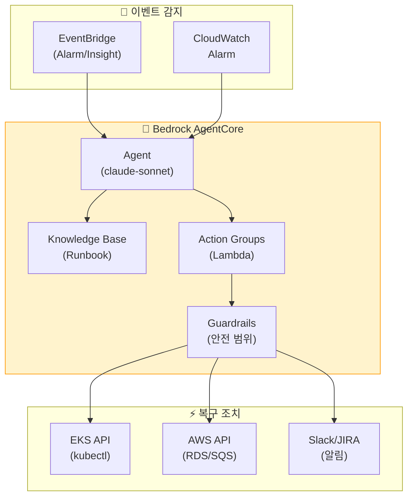

#### 5.6.2 Bedrock Agent 정 — incident autonomous recovery

```python
# Bedrock Agent 생성 — 인시던트 자동 대응
import boto3

bedrock = boto3.client('bedrock-agent', region_name='ap-northeast-2')

response = bedrock.create_agent(
 agentName='incident-auto-remediation',
 foundationModel='anthropic.claude-sonnet-v3',
 instruction="""
 당신은 EKS 인시던트 자동 복구 에이전트입니다.

 ## 핵심 원칙
 1. 안전 우선: guardrails 범위 내에서만 조치
 2. 근본 원인 분석: 증상이 아닌 원인 해결
 3. 최소 개입: 필요한 최소한의 변경만 수행
 4. 완전 투명성: 모든 조치를 Slack과 JIRA에 즉시 보고

 ## 자동 복구 워크플로우
 Phase 1: 감지 (30초 이내)
 - CloudWatch Alarm 분석
 - DevOps Guru Insight 수집
 - 관련 EKS 리소스 상태 조회

 Phase 2: 진단 (2분 이내)
 - Pod 로그 및 이벤트 분석
 - 메트릭 상관 분석 (CPU/Memory/Network)
 - 배포 이력 확인 (최근 10분 변경 사항)
 - Knowledge Base에서 유사 사례 검색

 Phase 3: 자동 복구 (5분 이내)
 - 배포 장애 → 자동 롤백 (to previous stable revision)
 - 리소스 부족 → HPA 조정 또는 Pod 재시작
 - 의존 서비스 장애 → 재시작 또는 연결 재설정
 - 원인 불명 → 사람에게 에스컬레이션

 Phase 4: 검증 및 보고
 - 복구 후 상태 확인 (메트릭 정상화 확인)
 - 인시던트 타임라인 생성
 - Slack/JIRA 자동 보고
 """,
 idleSessionTTLInSeconds=600,
 agentResourceRoleArn='arn:aws:iam::ACCOUNT_ID:role/BedrockAgentRole'
)

agent_id = response['agent']['agentId']
```

#### 5.6.3 Action Groups — safe recovery action scope

```python
# Action Group 1: EKS 읽기 조회
bedrock.create_agent_action_group(
 agentId=agent_id,
 agentVersion='DRAFT',
 actionGroupName='eks-read-actions',
 actionGroupExecutor={
 'lambda': 'arn:aws:lambda:ap-northeast-2:ACCOUNT_ID:function:eks-read-handler'
 },
 apiSchema={
 'payload': '''
 {
 "openapi": "3.0.0",
 "info": {"title": "EKS Read API", "version": "1.0.0"},
 "paths": {
 "/pods": {
 "get": {
 "summary": "Get Pod list",
 "parameters": [
 {"name": "namespace", "in": "query", "schema": {"type": "string"}}
 ],
 "responses": {"200": {"description": "Pod list"}}
 }
 },
 "/pods/{name}/logs": {
 "get": {
 "summary": "Get Pod logs",
 "parameters": [
 {"name": "name", "in": "path", "required": true, "schema": {"type": "string"}},
 {"name": "namespace", "in": "query", "schema": {"type": "string"}}
 ],
 "responses": {"200": {"description": "Pod logs"}}
 }
 },
 "/deployments/{name}/revisions": {
 "get": {
 "summary": "Get deployment revision history",
 "parameters": [
 {"name": "name", "in": "path", "required": true, "schema": {"type": "string"}},
 {"name": "namespace", "in": "query", "schema": {"type": "string"}}
 ],
 "responses": {"200": {"description": "Revision list"}}
 }
 }
 }
 }
 '''
 }
)

# Action Group 2: EKS 복구 조치 (guardrails 적용)
bedrock.create_agent_action_group(
 agentId=agent_id,
 agentVersion='DRAFT',
 actionGroupName='eks-remediation-actions',
 actionGroupExecutor={
 'lambda': 'arn:aws:lambda:ap-northeast-2:ACCOUNT_ID:function:eks-remediation-handler'
 },
 apiSchema={
 'payload': '''
 {
 "openapi": "3.0.0",
 "info": {"title": "EKS Remediation API", "version": "1.0.0"},
 "paths": {
 "/deployments/{name}/rollback": {
 "post": {
 "summary": "Rollback deployment to previous revision",
 "parameters": [
 {"name": "name", "in": "path", "required": true, "schema": {"type": "string"}},
 {"name": "namespace", "in": "query", "schema": {"type": "string"}},
 {"name": "to_revision", "in": "query", "schema": {"type": "integer"}}
 ],
 "responses": {"200": {"description": "Rollback initiated"}}
 }
 },
 "/pods/{name}/restart": {
 "post": {
 "summary": "Restart Pod (delete and let controller recreate)",
 "parameters": [
 {"name": "name", "in": "path", "required": true, "schema": {"type": "string"}},
 {"name": "namespace", "in": "query", "schema": {"type": "string"}}
 ],
 "responses": {"200": {"description": "Pod restarted"}}
 }
 },
 "/hpa/{name}/adjust": {
 "post": {
 "summary": "Adjust HPA min/max replicas",
 "parameters": [
 {"name": "name", "in": "path", "required": true, "schema": {"type": "string"}},
 {"name": "namespace", "in": "query", "schema": {"type": "string"}},
 {"name": "min_replicas", "in": "query", "schema": {"type": "integer"}},
 {"name": "max_replicas", "in": "query", "schema": {"type": "integer"}}
 ],
 "responses": {"200": {"description": "HPA adjusted"}}
 }
 }
 }
 }
 '''
 }
)

# Action Group 3: 알림 및 보고
bedrock.create_agent_action_group(
 agentId=agent_id,
 agentVersion='DRAFT',
 actionGroupName='notification-actions',
 actionGroupExecutor={
 'lambda': 'arn:aws:lambda:ap-northeast-2:ACCOUNT_ID:function:notification-handler'
 },
 apiSchema={
 'payload': '''
 {
 "openapi": "3.0.0",
 "info": {"title": "Notification API", "version": "1.0.0"},
 "paths": {
 "/slack/send": {
 "post": {
 "summary": "Send Slack notification",
 "requestBody": {
 "required": true,
 "content": {
 "application/json": {
 "schema": {
 "type": "object",
 "properties": {
 "channel": {"type": "string"},
 "message": {"type": "string"},
 "severity": {"type": "string", "enum": ["info", "warning", "critical"]}
 }
 }
 }
 }
 },
 "responses": {"200": {"description": "Message sent"}}
 }
 },
 "/jira/create-incident": {
 "post": {
 "summary": "Create JIRA incident ticket",
 "requestBody": {
 "required": true,
 "content": {
 "application/json": {
 "schema": {
 "type": "object",
 "properties": {
 "title": {"type": "string"},
 "description": {"type": "string"},
 "severity": {"type": "string"}
 }
 }
 }
 }
 },
 "responses": {"200": {"description": "Ticket created"}}
 }
 }
 }
 }
 '''
 }
)
```

#### 5.6.4 Guardrails — safety scope limitation

```python
# Guardrails 정의 — 안전한 자동화 범위 제한
bedrock_guardrails = boto3.client('bedrock', region_name='ap-northeast-2')

guardrail_response = bedrock_guardrails.create_guardrail(
 name='incident-remediation-guardrails',
 description='인시던트 자동 복구 안전 범위 제한',
 topicPolicyConfig={
 'topicsConfig': [
 {
 'name': 'data-deletion',
 'definition': 'Any action that deletes persistent data, such as PV, StatefulSet, or database',
 'type': 'DENY'
 },
 {
 'name': 'security-policy-change',
 'definition': 'Changes to SecurityGroup, NetworkPolicy, RBAC, or IAM roles',
 'type': 'DENY'
 },
 {
 'name': 'namespace-critical',
 'definition': 'Actions on kube-system or critical infrastructure namespaces',
 'type': 'DENY'
 }
 ]
 },
 contentPolicyConfig={
 'filtersConfig': [
 {'type': 'HATE', 'inputStrength': 'HIGH', 'outputStrength': 'HIGH'},
 {'type': 'VIOLENCE', 'inputStrength': 'HIGH', 'outputStrength': 'HIGH'}
 ]
 },
 wordPolicyConfig={
 'wordsConfig': [
 {'text': 'delete pv'},
 {'text': 'delete statefulset'},
 {'text': 'drop database'},
 {'text': 'rm -rf'},
 {'text': 'delete namespace kube-system'}
 ],
 'managedWordListsConfig': [
 {'type': 'PROFANITY'}
 ]
 }
)

# Guardrails를 Agent에 연결
bedrock.associate_agent_guardrail(
 agentId=agent_id,
 agentVersion='DRAFT',
 guardrailIdentifier=guardrail_response['guardrailId'],
 guardrailVersion='DRAFT'
)
```

#### 5.6.5 Knowledge Base Integration — Runbook automatic Reference

```python
# Knowledge Base 생성 — Runbook 저장소
bedrock.create_knowledge_base(
 name='incident-runbook-kb',
 description='인시던트 대응 Runbook 저장소',
 roleArn='arn:aws:iam::ACCOUNT_ID:role/BedrockKBRole',
 knowledgeBaseConfiguration={
 'type': 'VECTOR',
 'vectorKnowledgeBaseConfiguration': {
 'embeddingModelArn': 'arn:aws:bedrock:ap-northeast-2::foundation-model/amazon.titan-embed-text-v1'
 }
 },
 storageConfiguration={
 'type': 'OPENSEARCH_SERVERLESS',
 'opensearchServerlessConfiguration': {
 'collectionArn': 'arn:aws:aoss:ap-northeast-2:ACCOUNT_ID:collection/runbook-kb',
 'vectorIndexName': 'runbook-index',
 'fieldMapping': {
 'vectorField': 'embedding',
 'textField': 'text',
 'metadataField': 'metadata'
 }
 }
 }
)

# Knowledge Base를 Agent에 연결
bedrock.associate_agent_knowledge_base(
 agentId=agent_id,
 agentVersion='DRAFT',
 knowledgeBaseId='KB_ID',
 description='인시던트 대응 Runbook 자동 참조',
 knowledgeBaseState='ENABLED'
)
```

**Runbook example (Knowledge Base storage)**:

```markdown
# Runbook: OOMKilled Pod 복구

## 증상
- Pod Status: OOMKilled
- Event Reason: OOMKilled
- Container Exit Code: 137

## 근본 원인 분석
1. 메모리 사용량 트렌드 확인 (지난 24시간)
2. 메모리 누수 패턴 확인 (점진적 증가 vs 급증)
3. 로그에서 대용량 데이터 처리 확인

## 자동 복구 조치
1. 임시 조치: memory limits 2배 증가 (최대 4Gi)
2. Pod 재시작
3. 메모리 사용량 모니터링 (30분)

## 근본 원인 해결
1. 메모리 누수 의심: 개발팀에 에스컬레이션
2. 데이터 크기 증가: VPA 적용 권장
3. 잘못된 limits: Right-sizing 권장
```

#### 5.6.6 EventBridge Integration — automatic trigger

```json
{
 "source": ["aws.cloudwatch"],
 "detail-type": ["CloudWatch Alarm State Change"],
 "detail": {
 "alarmName": [{"prefix": "EKS-"}],
 "state": {
 "value": ["ALARM"]
 }
 }
}
```

**Lambda 함 — Bedrock Agent call**:

```python
import boto3
import json

bedrock_runtime = boto3.client('bedrock-agent-runtime', region_name='ap-northeast-2')

def lambda_handler(event, context):
 alarm_name = event['detail']['alarmName']
 alarm_description = event['detail']['alarmDescription']

 # Bedrock Agent 호출
 response = bedrock_runtime.invoke_agent(
 agentId='AGENT_ID',
 agentAliasId='PROD',
 sessionId=f"incident-{alarm_name}-{event['time']}",
 inputText=f"""
 CloudWatch 알람이 발생했습니다.

 알람 이름: {alarm_name}
 설명: {alarm_description}
 발생 시간: {event['time']}

 이 인시던트를 자동으로 진단하고 복구하세요.
 모든 조치는 Slack #incidents 채널에 보고하세요.
 """
 )

 return {
 'statusCode': 200,
 'body': json.dumps('Agent invoked successfully')
 }
```

#### 5.6.7 Kagent + Bedrock Agent 이브리드 pattern

Kagent(K8s native)와 Bedrock Agent(AWS native)를 combinationif 최상 autonomous Operations Implementation .

| Aspect | Kagent | Bedrock Agent | recommended use |
|------|--------|---------------|----------|
| **Deployment method** | Kubernetes CRD | AWS service | Kagent: cluster 내 action<br/>Bedrock: AWS resource action |
| **permission 제어** | RBAC | IAM + Guardrails | Kagent: Pod/Deployment<br/>Bedrock: RDS/SQS/Lambda |
| **컨텍스트** | K8s API directly approach | Action Groups 통해 approach | Kagent: K8s event 우선<br/>Bedrock: CloudWatch 우선 |
| **safety 장치** | RBAC + NetworkPolicy | Guardrails + Word Policy | 두 가지 모두 utilization |
| **Knowledge Base** | ConfigMap/Custom | OpenSearch Serverless | Bedrock: 대규모 Runbook |
| **cost** | infrastructure costonly | Bedrock API call cost | Kagent: 빈번 action<br/>Bedrock: complex Analysis |

**이브리드 pattern example**:

```yaml
# Kagent: K8s 리소스 자동 복구
apiVersion: kagent.dev/v1alpha1
kind: Agent
metadata:
 name: k8s-remediation
spec:
 triggers:
 - type: kubernetes-event
 filter:
 reason: ["OOMKilled", "CrashLoopBackOff"]
 tools:
 - name: kubectl
 type: kmcp
 workflow: |
 ## K8s 리소스 자동 복구
 1. Pod 재시작
 2. HPA 조정
 3. VPA 적용
 4. Bedrock Agent 호출 (AWS 리소스 조치 필요 시)
---
# EventBridge Rule: CloudWatch → Bedrock Agent
{
 "source": ["aws.cloudwatch"],
 "detail-type": ["CloudWatch Alarm State Change"],
 "detail": {
 "alarmName": [{"prefix": "RDS-"}, {"prefix": "SQS-"}]
 }
}
```

**Integration workflow**:

```
[인시던트 발생]
 ↓
[K8s Event?] YES → Kagent 자동 대응 (Pod/Deployment 조치)
 ↓ NO
[CloudWatch Alarm?] YES → Bedrock Agent 호출 (AWS 리소스 조치)
 ↓
[복잡한 근본 원인 분석 필요?]
 ↓ YES
Bedrock Agent의 Knowledge Base 참조 → Runbook 자동 적용
 ↓
[Kagent + Bedrock Agent 협업]
Kagent: K8s 리소스 복구
Bedrock Agent: RDS/SQS/Lambda 조정 + Slack 보고
```

:::info Bedrock AgentCore Core Value
Bedrock AgentCore **guardrails**와 **action groups** through production environment에서also safety complete autonomous Operations Implementation . Kagent/Strands K8s native approach이라면, Bedrock AgentCore AWS native approach as **AWS resource(RDS, SQS, Lambda)** Integration Automation . **Knowledge Base Integration** through past Runbook automatic as Reference to, 인between Operations 의사결정 pattern learning and re-현.
:::

#### 5.7.1 Node Readiness Controller and prediction node Management

**Node Readiness Controller(NRC)**는 Kubernetes 1.33+ from Provision되 node readiness status automatic Management tool. node 컨디션(Node Condition) 변화 detection to automatic as taint/cordon 작업 perform to, **reactive-type operations서 prediction-type operations transition** Core 요소.

**prediction operations서 NRC role**:

```
[반응형 운영]
노드 장애 발생 → 수동으로 kubectl cordon → 수동 drain → 수동 복구
• 감지 지연: 5-10분
• 수동 개입: 필수
• MTTR: 20-30분

[NRC 기반 반자동 운영]
Node Condition 변화 → NRC가 자동 taint 적용 → 새 Pod 스케줄링 차단
• 감지 지연: 30초
• 수동 개입: 복구 시에만
• MTTR: 5-10분

[AI + NRC 예측 운영]
AI가 장애 예측 → Node Condition 사전 업데이트 → NRC가 proactive taint
• 감지 지연: 0분 (예측)
• 수동 개입: 없음
• MTTR: 2-5분 (사전 대피)
```

**Continuous 모드 and automatic recovery loop**:

NRC **Continuous 모드**를 Support to Node Condition recoverywhen taint automatic as removal.

```yaml
apiVersion: nrc.k8s.io/v1alpha1
kind: NodeReadinessRule
metadata:
 name: gpu-driver-health
spec:
 mode: Continuous # 핵심: 자동 복구
 conditions:
 - type: GPUDriverHealthy
 status: "False"
 action:
 taint:
 key: gpu-driver-unhealthy
 effect: NoSchedule
```

**automatic recovery time퀀스**:

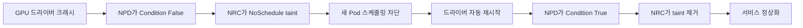

** actual scenario: GPU node automatic recovery**:

```bash
# 1. 장애 감지 (NPD가 GPU 드라이버 크래시 감지)
kubectl get node gpu-node-1 -o jsonpath='{.status.conditions[?(@.type=="GPUDriverHealthy")]}'
# Output: {"type":"GPUDriverHealthy","status":"False","reason":"DriverCrash"}

# 2. NRC가 자동 taint 적용 (30초 이내)
kubectl describe node gpu-node-1 | grep Taints
# Output: gpu-driver-unhealthy:NoSchedule

# 3. 드라이버 자동 복구 (DaemonSet watchdog)
kubectl logs -n kube-system nvidia-driver-watchdog-xxx
# Output: "Restarting nvidia-driver.service..."

# 4. NPD가 복구 감지
kubectl get node gpu-node-1 -o jsonpath='{.status.conditions[?(@.type=="GPUDriverHealthy")]}'
# Output: {"type":"GPUDriverHealthy","status":"True","reason":"DriverHealthy"}

# 5. NRC가 taint 자동 제거
kubectl describe node gpu-node-1 | grep Taints
# Output: <none>
```

**Core: manual 입 없 complete automatic recovery**.

**Chaos Engineering Integration**:

NRC Chaos Engineering and combination to **failure response 능력 preemptive Validation** .

```yaml
# AWS FIS Experiment: 노드 장애 시뮬레이션
apiVersion: fis.aws.amazon.com/v1
kind: ExperimentTemplate
metadata:
 name: nrc-response-test
spec:
 description: "NRC의 자동 taint 반응 속도 측정"
 actions:
 - name: inject-node-condition-failure
 actionId: aws:eks:inject-node-condition
 parameters:
 nodeSelector: gpu=true
 conditionType: GPUDriverHealthy
 conditionStatus: "False"
 duration: PT5M
 stopConditions:
 - source: aws:cloudwatch:alarm
 value: arn:aws:cloudwatch:...:alarm/pod-eviction-rate-high
 targets:
 - resourceType: aws:eks:node
 selectionMode: COUNT(1)
 resourceTags:
 gpu: "true"
```

**NRC dry-run 모드 impact scope preemptive 파악**:

```yaml
apiVersion: nrc.k8s.io/v1alpha1
kind: NodeReadinessRule
metadata:
 name: memory-pressure-dryrun
spec:
 mode: DryRun # 실제 taint 적용 없이 로그만 기록
 conditions:
 - type: MemoryPressure
 status: "True"
 action:
 taint:
 key: memory-pressure
 effect: NoExecute # 강제 Pod 종료 시뮬레이션
```

```bash
# DryRun 모드 결과 분석
kubectl logs -n kube-system node-readiness-controller | grep "DryRun"
# Output:
# [DryRun] Would apply taint to node-1: memory-pressure:NoExecute
# [DryRun] 15 pods would be evicted: [payment-service-xxx, order-service-yyy, ...]
# [DryRun] Estimated MTTR: 45 seconds
```

**AI past NRC event pattern learning → failure prediction model improvement**:

```python
# CloudWatch Logs Insights: NRC taint 패턴 분석
query = """
fields @timestamp, node_name, condition_type, taint_key, pods_affected
| filter action = "taint_applied"
| stats count() by condition_type, bin(1h)
"""

# AI 학습 데이터셋 생성
import pandas as pd

nrc_events = cloudwatch_logs.query(query)
df = pd.DataFrame(nrc_events)

# 장애 예측 모델 입력 피처
features = [
 'condition_type', # GPUDriverHealthy, MemoryPressure, DiskPressure
 'taint_frequency_1h', # 지난 1시간 taint 빈도
 'node_age_days', # 노드 생성 이후 경과 일수
 'pods_affected_avg', # 평균 영향 받는 Pod 수
]

# Prophet 기반 장애 예측
model = Prophet()
model.fit(df[['timestamp', 'taint_frequency_1h']].rename(columns={'timestamp': 'ds', 'taint_frequency_1h': 'y'}))
forecast = model.predict(future)

# 예측 결과 → Node Condition 사전 업데이트
if forecast['yhat'].iloc[-1] > threshold:
 k8s.patch_node_condition(
 node_name='gpu-node-1',
 condition_type='GPUDriverHealthy',
 status='False',
 reason='PredictedFailure'
 )
 # NRC가 자동으로 proactive taint 적용
```

**Karpenter + NRC autonomous node Management**:

NRC and Karpenter combinationif **complete autonomous node 생명주기 Management**가 possible.

```yaml
apiVersion: karpenter.sh/v1
kind: NodePool
metadata:
 name: gpu-pool
spec:
 disruption:
 consolidationPolicy: WhenEmpty
 budgets:
 - nodes: "1"
 schedule: "* * * * *" # 매 분 체크
 template:
 metadata:
 labels:
 workload-type: gpu-inference
 spec:
 nodeClassRef:
 name: gpu-class
 requirements:
 - key: karpenter.sh/capacity-type
 operator: In
 values: ["spot", "on-demand"]
 - key: node.kubernetes.io/instance-type
 operator: In
 values: ["g5.xlarge", "g5.2xlarge"]
 taints:
 - key: gpu-not-ready
 effect: NoSchedule
 # NRC가 GPU 준비 완료 후 제거
```

**autonomous node 교체 time퀀스**:

```
1. NRC가 gpu-node-1에 taint 적용 (GPU 드라이버 장애)
2. Karpenter가 대체 노드 자동 프로비저닝 (gpu-node-2)
3. gpu-node-2에 NRC bootstrap 규칙 적용
 → GPU 드라이버 초기화 완료 전까지 gpu-not-ready:NoSchedule
4. NPD가 GPU 준비 완료 확인 → Condition True
5. NRC가 gpu-not-ready taint 제거
6. Scheduler가 워크로드를 gpu-node-2로 이동
7. gpu-node-1의 모든 Pod 종료 후 Karpenter가 노드 삭제
```

** entire 과정 automatic: detection → isolation → 대체 → recovery → cleanup**

:::tip NRC + AI Core Value
Node Readiness Controller **reactive-type Automation**를 provides, but, AI and combinationif **prediction-type Automation**로 evolution. AI past NRC event pattern learning to failure prediction and, NRC preemptive taint applying **failure occurrence before workload 대피**time킵. Karpenter and Integrationif node 생명주기 before체 complete autonomous화 .
:::

**Reference**: [Introducing Node Readiness Controller](https://kubernetes.io/blog/2026/02/03/introducing-node-readiness-controller/)

---

## 6. Kiro Programmatic Debugging

### 6.1 directing vs programmatic response ratio교

```
[디렉팅 기반 대응] — 수동, 반복적, 비용 높음
━━━━━━━━━━━━━━━━━━━━━━━━━━━━━━━━━━━━━━━━━━
 운영자: "payment-service 500 에러 발생"
 AI: "어떤 Pod에서 발생하나요?"
 운영자: "payment-xxx Pod"
 AI: "로그를 보여주세요"
 운영자: (kubectl logs 실행 후 복사-붙여넣기)
 AI: "DB 연결 오류 같습니다. RDS 상태를 확인해주세요"
 운영자: (AWS 콘솔에서 RDS 확인)
 ...반복...

 총 소요: 15-30분, 수동 작업 다수

[프로그래머틱 대응] — 자동, 체계적, 비용 효율적
━━━━━━━━━━━━━━━━━━━━━━━━━━━━━━━━━━━━━━━━━━
 알림: "payment-service 500 에러 발생"

 Kiro Spec:
 1. EKS MCP로 Pod 상태 조회
 2. 에러 로그 수집 및 분석
 3. 관련 AWS 서비스 (RDS, SQS) 상태 확인
 4. 근본 원인 진단
 5. 자동 수정 코드 생성
 6. PR 생성 및 검증

 총 소요: 2-5분, 자동화
```

### 6.2 Kiro + MCP 디버깅 workflow

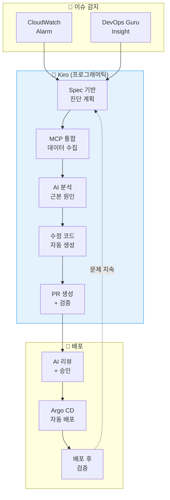

### 6.3 구체 scenario: OOMKilled automatic response

```
[Kiro 프로그래머틱 디버깅: OOMKilled]

1. 감지: payment-service Pod OOMKilled 이벤트

2. Kiro Spec 실행:
 → EKS MCP: get_events(namespace="payment", reason="OOMKilled")
 → EKS MCP: get_pod_logs(pod="payment-xxx", previous=true)
 → CloudWatch MCP: query_metrics("pod_memory_utilization", last="1h")

3. AI 분석:
 "payment-service의 메모리 사용량이 시작 후 2시간마다
 256Mi씩 증가하는 메모리 누수 패턴 감지.
 로그에서 Redis 연결이 제대로 종료되지 않는 것 확인."

4. 자동 수정:
 - memory limits 256Mi → 512Mi (임시 조치)
 - Redis 연결 풀 정리 코드 패치 생성
 - 메모리 프로파일링 설정 추가

5. PR 생성:
 Title: "fix: payment-service Redis connection leak"
 - deployment.yaml: memory limits 조정
 - redis_client.go: defer conn.Close() 추가
 - monitoring: 메모리 사용량 대시보드 추가
```

:::tip programmatic 디버깅 Core
Kiro + EKS MCP through 이슈 **programmatic Analysis·해결**. directing method manual response compared to **cost efficiency이고 fast Automation**가 possible and, the same 이슈 repetitive될 when learning Spec re-use .
:::

---

## 7. AI Right-Sizing

### 7.1 Container Insights based recommendation

CloudWatch Container Insights Pod actual resource use pattern Analysis to 정 크기 recommendation.

```promql
# 실제 CPU 사용량 vs requests 비교
avg(rate(container_cpu_usage_seconds_total{namespace="payment"}[1h]))
 by (pod)
/ avg(kube_pod_container_resource_requests{resource="cpu", namespace="payment"})
 by (pod)
* 100

# 실제 Memory 사용량 vs requests 비교
avg(container_memory_working_set_bytes{namespace="payment"})
 by (pod)
/ avg(kube_pod_container_resource_requests{resource="memory", namespace="payment"})
 by (pod)
* 100
```

### 7.2 VPA + ML based automatic Right-Sizing

```yaml
# VPA (Vertical Pod Autoscaler) 설정
apiVersion: autoscaling.k8s.io/v1
kind: VerticalPodAutoscaler
metadata:
 name: payment-service-vpa
 namespace: payment
spec:
 targetRef:
 apiVersion: apps/v1
 kind: Deployment
 name: payment-service
 updatePolicy:
 updateMode: "Auto" # Off, Initial, Auto
 resourcePolicy:
 containerPolicies:
 - containerName: app
 minAllowed:
 cpu: 100m
 memory: 128Mi
 maxAllowed:
 cpu: "2"
 memory: 4Gi
 controlledResources: ["cpu", "memory"]
```

### 7.3 Right-Sizing effect

<RightSizingResults />

:::tip K8s 1.35: In-Place Pod Resource Updates
K8s 1.35(2026.01, EKS Support)부터 **In-Place Pod Resource Updates** feature adoption, Pod restartnot 않고also CPU and memory dynamic as adjustment . this is VPA most large 계였던 "resource change time Pod restart" issue 해결. StatefulSet이나 restart 민감 workload에서also safety 직 scaling possible해졌.
:::

:::warning VPA Considerations (K8s 1.34 or less)
K8s 1.34 or less from VPA `Auto` 모드 Pod restart to resource adjustment. StatefulSet이나 restart 민감 workload `Off` 모드 recommendation값only Verification and, manual as Application 것 safety. VPA and HPA 동day metric(CPU/Memory) as simultaneously useif 충돌 occurrence .
:::

### 7.4 In-Place Pod Vertical Scaling (K8s 1.33+)

Kubernetes 1.33부터 **In-Place Pod Vertical Scaling**이 Beta 진입if서, VPA most large 단점이었던 **Pod restart issue**가 해결되었. 이제 execution 중인 Pod CPU and memory restart without dynamic as adjustment .

#### In-Place Pod Resize overview

 existing VPA issue점:
- Pod resource change time **반드time restart** needed
- StatefulSet, database, cache etc. **status maintenance important workload** from use difficult
- restart 중 service interruption possible
- PDB(Pod Disruption Budget)와 충돌

In-Place Resize 해결책:
- **execution 중인 Pod resource dynamic as adjustment**
- cgroup limitation Real-time as change
- restart without resource increase/reduction
- **QoS Class maintenance** time restart non-needed

#### Kubernetes per 버before status

| Kubernetes 버before | status | Feature Gate | Notes |
|----------------|------|--------------|------|
| 1.27 | Alpha | `InPlacePodVerticalScaling` | 실험 feature |
| 1.33 | Beta | default Activation | production test recommended |
| 1.35+ (example상) | Stable | default Activation | production safety use |

**EKS Support 현황**:
- **EKS 1.33** (2026year 4monthly example상): Beta feature Activation possible
- **EKS 1.35** (2026year 11monthly example상): Stable 버before Support

EKS from Feature Gate Activation method (1.33 Beta):
```bash
# EKS 클러스터 생성 시 Feature Gate 활성화 (예정)
aws eks create-cluster \
 --name my-cluster \
 --kubernetes-version 1.33 \
 --kubernetes-network-config '{"serviceIpv4Cidr":"10.100.0.0/16"}' \
 --role-arn arn:aws:iam::ACCOUNT_ID:role/EKSClusterRole \
 --resources-vpc-config subnetIds=subnet-xxx,subnet-yyy \
 --feature-gates InPlacePodVerticalScaling=true
```

:::info EKS Feature Gate Support
EKS Kubernetes 버before GA after day정 기between after Feature Gatesupports. 1.33 Beta feature EKS 1.33 출time and simultaneously Activation되지 않 있으므로, AWS 공식 document Verification.
:::

#### behavior method

In-Place Resize **`resize` subresource** through execution 중인 Pod resource change:

```yaml
# Pod의 resize 상태 확인
apiVersion: v1
kind: Pod
metadata:
 name: payment-service-abc123
spec:
 containers:
 - name: app
 resources:
 requests:
 cpu: "1"
 memory: 2Gi
 limits:
 cpu: "2"
 memory: 4Gi
status:
 resize: InProgress # Proposed, InProgress, Deferred, Infeasible
 containerStatuses:
 - name: app
 allocatedResources:
 cpu: "1"
 memory: 2Gi
 resources:
 requests:
 cpu: "1.5" # 새로운 요청값
 memory: 3Gi
```

**Resize status before이**:

```
Proposed (제안됨)
 ↓
InProgress (진행 중) — kubelet이 cgroup 제한 변경
 ↓
[성공] Pod.spec.resources == Pod.status.allocatedResources
 또는
[실패] Deferred (지연됨) — 리소스 부족, 나중에 재시도
 또는
[실패] Infeasible (불가능) — QoS Class 변경 필요, 재시작 필요
```

#### VPA Auto 모드 and Integration

VPA In-Place Resize possible case **automatic as restart without resource adjustment**:

```yaml
apiVersion: autoscaling.k8s.io/v1
kind: VerticalPodAutoscaler
metadata:
 name: payment-service-vpa
spec:
 targetRef:
 apiVersion: apps/v1
 kind: Deployment
 name: payment-service
 updatePolicy:
 updateMode: "Auto" # In-Place Resize 지원 시 재시작 없이 조정
 resourcePolicy:
 containerPolicies:
 - containerName: app
 minAllowed:
 cpu: 100m
 memory: 128Mi
 maxAllowed:
 cpu: "4"
 memory: 8Gi
 controlledResources: ["cpu", "memory"]
 mode: Auto # In-Place Resize 자동 적용
```

**VPA behavior flow**:

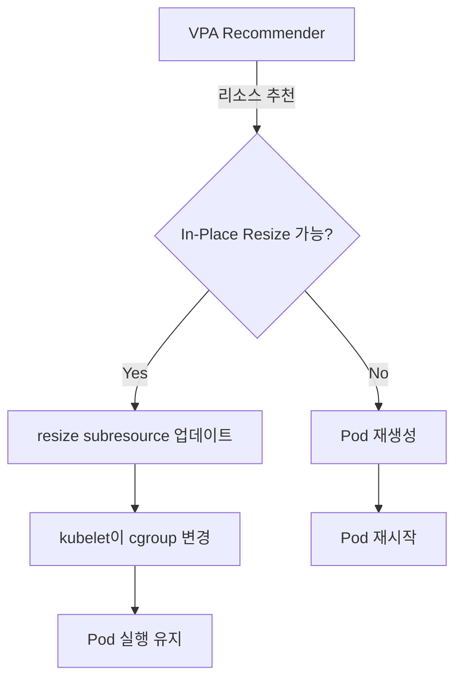

#### constraint사항

1. **CPU 유롭 resize possible**
 - CPU shares, CPU quota dynamic change possible
 - cgroup CPU 컨트롤러 Real-time change Support

2. **Memory increaseonly possible, reduction impossible**
 - Linux cgroup v1/v2 limitation as memory limit **reduction time restart needed**
 - memory increase possible (cgroup memory.limit_in_bytes increase)
 - memory reduction Infeasible status transition → Pod re-generation needed

```yaml
# Memory 증가: In-Place Resize 가능 ✅
resources:
 requests:
 memory: 2Gi → 4Gi # OK, 재시작 없음

# Memory 감소: In-Place Resize 불가 ❌
resources:
 requests:
 memory: 4Gi → 2Gi # Infeasible, Pod 재생성 필요
```

3. **QoS Class change time restart needed**

QoS Class Pod resource guarantee level 결정므로, change time restart needed:

| existing QoS | new QoS | In-Place Resize possible? |
|----------|------------|---------------------|
| Guaranteed | Guaranteed | ✅ possible (requests == limits maintenance) |
| Burstable | Burstable | ✅ possible |
| BestEffort | BestEffort | ✅ possible |
| Guaranteed | Burstable | ❌ impossible (restart needed) |
| Burstable | Guaranteed | ❌ impossible (restart needed) |

```yaml
# QoS Class 유지: In-Place Resize 가능 ✅
# Guaranteed → Guaranteed
resources:
 requests:
 cpu: "1"
 memory: 2Gi
 limits:
 cpu: "1" # requests == limits 유지
 memory: 2Gi
# → (변경 후)
resources:
 requests:
 cpu: "2"
 memory: 4Gi
 limits:
 cpu: "2" # requests == limits 유지
 memory: 4Gi

# QoS Class 변경: In-Place Resize 불가 ❌
# Guaranteed → Burstable
resources:
 requests:
 cpu: "1"
 memory: 2Gi
 limits:
 cpu: "1"
 memory: 2Gi
# → (변경 후)
resources:
 requests:
 cpu: "1"
 memory: 2Gi
 limits:
 cpu: "2" # requests != limits → QoS 변경
 memory: 4Gi
# → Infeasible, Pod 재생성 필요
```

#### StatefulSet safe 직 scaling pattern

StatefulSet status maintenance 중요므로, In-Place Resize utilization safe pattern Applicationmust :

**pattern 1: Guaranteed QoS maintenance**

```yaml
apiVersion: apps/v1
kind: StatefulSet
metadata:
 name: postgres
spec:
 replicas: 3
 template:
 spec:
 containers:
 - name: postgres
 image: postgres:15
 resources:
 requests:
 cpu: "2"
 memory: 4Gi
 limits:
 cpu: "2" # requests == limits (Guaranteed QoS)
 memory: 4Gi
---
apiVersion: autoscaling.k8s.io/v1
kind: VerticalPodAutoscaler
metadata:
 name: postgres-vpa
spec:
 targetRef:
 apiVersion: apps/v1
 kind: StatefulSet
 name: postgres
 updatePolicy:
 updateMode: "Auto"
 resourcePolicy:
 containerPolicies:
 - containerName: postgres
 minAllowed:
 cpu: "1"
 memory: 2Gi
 maxAllowed:
 cpu: "4"
 memory: 8Gi
 controlledResources: ["cpu", "memory"]
 controlledValues: RequestsAndLimits # requests와 limits를 함께 조정
```

**pattern 2: gradual memory increase (reduction prevention)**

```python
# VPA 추천값을 모니터링하여 메모리 감소 방지
import boto3
from kubernetes import client, config

def safe_vpa_update(namespace, statefulset_name):
 """
 VPA 추천값을 확인하여 메모리 감소가 필요한 경우 알림만 보내고,
 증가가 필요한 경우에만 In-Place Resize 수행
 """
 config.load_kube_config()
 v1 = client.CoreV1Api()

 # 현재 Pod의 메모리 사용량 조회
 pods = v1.list_namespaced_pod(
 namespace=namespace,
 label_selector=f"app={statefulset_name}"
 )

 for pod in pods.items:
 current_memory = pod.spec.containers[0].resources.requests['memory']
 vpa_recommendation = get_vpa_recommendation(namespace, statefulset_name)

 if vpa_recommendation['memory'] < current_memory:
 # 메모리 감소는 알림만
 send_alert(
 f"[WARNING] {pod.metadata.name}: VPA recommends memory decrease "
 f"({current_memory} → {vpa_recommendation['memory']}). "
 f"Manual Pod restart required for memory decrease."
 )
 elif vpa_recommendation['memory'] > current_memory:
 # 메모리 증가는 In-Place Resize 수행
 apply_in_place_resize(pod.metadata.name, vpa_recommendation)
```

**pattern 3: 롤링 업데이트 and In-Place Resize 조합**

```yaml
# StatefulSet 업데이트 전략: 롤링 업데이트 + In-Place Resize
apiVersion: apps/v1
kind: StatefulSet
metadata:
 name: cassandra
spec:
 replicas: 5
 updateStrategy:
 type: RollingUpdate
 rollingUpdate:
 partition: 0 # 모든 Pod 업데이트 대상
 podManagementPolicy: OrderedReady
 template:
 spec:
 containers:
 - name: cassandra
 resources:
 requests:
 cpu: "4"
 memory: 8Gi
 limits:
 cpu: "4"
 memory: 8Gi
```

**업데이트 scenario**:

1. **CPU increase**: In-Place Resize immediately Application (restart none)
2. **Memory increase**: In-Place Resize immediately Application (restart none)
3. **Memory reduction**: 롤링 업데이트 Pod 나씩 restart (Quorum maintenance)

```bash
# 메모리 감소 시 안전한 롤링 재시작
kubectl rollout restart statefulset/cassandra -n database

# 롤링 재시작 상태 모니터링
kubectl rollout status statefulset/cassandra -n database

# Pod별 재시작 확인 (Quorum 유지)
# cassandra-4 → cassandra-3 → cassandra-2 → cassandra-1 → cassandra-0
```

#### practical example제: Redis cluster memory increase

```yaml
# Redis StatefulSet
apiVersion: apps/v1
kind: StatefulSet
metadata:
 name: redis-cluster
 namespace: cache
spec:
 replicas: 6
 serviceName: redis-cluster
 template:
 spec:
 containers:
 - name: redis
 image: redis:7
 resources:
 requests:
 cpu: "1"
 memory: 4Gi
 limits:
 cpu: "1"
 memory: 4Gi
---
# VPA로 자동 메모리 증가
apiVersion: autoscaling.k8s.io/v1
kind: VerticalPodAutoscaler
metadata:
 name: redis-cluster-vpa
 namespace: cache
spec:
 targetRef:
 apiVersion: apps/v1
 kind: StatefulSet
 name: redis-cluster
 updatePolicy:
 updateMode: "Auto"
 resourcePolicy:
 containerPolicies:
 - containerName: redis
 minAllowed:
 memory: 4Gi
 maxAllowed:
 memory: 16Gi
 controlledResources: ["memory"]
 controlledValues: RequestsAndLimits
```

**In-Place Resize perform result**:

```bash
# 1. VPA가 메모리 증가 감지
$ kubectl describe vpa redis-cluster-vpa -n cache
Recommendation:
 Container Recommendations:
 Container Name: redis
 Target:
 Memory: 8Gi # 4Gi → 8Gi 증가 권장

# 2. VPA가 자동으로 In-Place Resize 수행
$ kubectl get pod redis-cluster-0 -n cache -o yaml
status:
 resize: InProgress
 containerStatuses:
 - allocatedResources:
 memory: 4Gi
 resources:
 requests:
 memory: 8Gi # 새로운 요청값

# 3. Kubelet이 cgroup 변경 완료
$ kubectl get pod redis-cluster-0 -n cache -o yaml
status:
 resize: "" # 완료되면 비워짐
 containerStatuses:
 - allocatedResources:
 memory: 8Gi # 새로운 리소스 할당 완료

# 4. Pod 재시작 없이 메모리 증가 확인
$ kubectl exec redis-cluster-0 -n cache -- redis-cli INFO memory
used_memory:8589934592 # 8GB
maxmemory:8589934592

# 5. Pod 업타임 확인 (재시작 없음)
$ kubectl get pod redis-cluster-0 -n cache
NAME READY STATUS RESTARTS AGE
redis-cluster-0 1/1 Running 0 15d # 15일간 재시작 없음
```

:::warning In-Place Pod Vertical Scaling 아직 Beta phase
In-Place Pod Vertical Scaling Kubernetes 1.33 from Beta 진입했. production environment in **Kubernetes 1.35+ Stable 이after adoption**을 recommended. Beta 기between 동안 API change possible 있으며, EKS Kubernetes GA 이after day정 기between after Support .

**Recommendations**:
- **K8s 1.33-1.34**: development/staging environment from test
- **K8s 1.35+**: production environment adoption consideration
- **EKS use**: AWS 공식 document from Feature Gate Support time점 Verification
:::

:::tip In-Place Resize Core Value
VPA most large 단점이었던 **Pod restart issue**가 해결when서, StatefulSet, database, cache, ML inference service etc. **status maintenance important workload**에서also safety 직 scaling Applicationcan 되었. especially memory increase restart without immediately 반영되므로, traffic spike time fast response possible.
:::

---

## 8. Feedback Loop

### 8.1 prediction 정확also measurement

```python
# 예측 정확도 측정 및 모델 재학습
import numpy as np

def calculate_accuracy(predicted, actual):
 """MAPE (Mean Absolute Percentage Error) 계산"""
 mape = np.mean(np.abs((actual - predicted) / actual)) * 100
 return {
 'mape': mape,
 'accuracy': 100 - mape,
 'over_prediction_rate': np.mean(predicted > actual) * 100,
 'under_prediction_rate': np.mean(predicted < actual) * 100
 }

def should_retrain(accuracy_history, threshold=85):
 """재학습 필요 여부 판단"""
 recent_accuracy = np.mean(accuracy_history[-10:])
 if recent_accuracy < threshold:
 return True, f"최근 정확도 {recent_accuracy:.1f}% < 임계값 {threshold}%"
 return False, f"정확도 양호: {recent_accuracy:.1f}%"
```

### 8.2 automatic re-learning pipeline

```yaml
# 예측 모델 자동 재학습 CronJob
apiVersion: batch/v1
kind: CronJob
metadata:
 name: model-retrainer
 namespace: scaling
spec:
 schedule: "0 2 * * 0" # 매주 일요일 02:00
 jobTemplate:
 spec:
 template:
 spec:
 containers:
 - name: retrainer
 image: my-registry/model-retrainer:latest
 env:
 - name: AMP_WORKSPACE_ID
 value: "ws-xxxxx"
 - name: TRAINING_WEEKS
 value: "4"
 - name: ACCURACY_THRESHOLD
 value: "85"
 resources:
 requests:
 cpu: "2"
 memory: 4Gi
 restartPolicy: OnFailure
```

### 8.3 A/B scaling test

```
[A/B 스케일링]

그룹 A (50% 트래픽): HPA 기반 반응형 스케일링
그룹 B (50% 트래픽): ML 예측 기반 선제 스케일링

비교 지표:
 - P99 레이턴시 차이
 - 스케일 이벤트 횟수
 - 리소스 사용 효율
 - 비용 대비 성능
```

---

## 9. Chaos Engineering + AI

### 9.1 AWS Fault Injection Service (FIS)

```json
{
 "description": "EKS Pod 장애 주입 테스트",
 "targets": {
 "eks-pods": {
 "resourceType": "aws:eks:pod",
 "selectionMode": "COUNT(2)",
 "resourceTags": {
 "app": "payment-service"
 },
 "parameters": {
 "clusterIdentifier": "my-cluster",
 "namespace": "payment"
 }
 }
 },
 "actions": {
 "terminate-pods": {
 "actionId": "aws:eks:terminate-pod",
 "parameters": {},
 "targets": {
 "Pods": "eks-pods"
 }
 }
 },
 "stopConditions": [
 {
 "source": "aws:cloudwatch:alarm",
 "value": "arn:aws:cloudwatch:ap-northeast-2:ACCOUNT_ID:alarm:PaymentServiceSLO"
 }
 ],
 "roleArn": "arn:aws:iam::ACCOUNT_ID:role/FISRole",
 "tags": {
 "Environment": "staging",
 "Team": "platform"
 }
}
```

### 9.2 AI based failure pattern learning

Chaos Engineering 실험 result AI learning to response 능력 improvementtime킵.

<ChaosExperiments />

```python
# FIS 실험 후 AI 학습 데이터 수집
from strands import Agent

chaos_analyzer = Agent(
 name="chaos-pattern-analyzer",
 model="bedrock/anthropic.claude-sonnet",
 sop="""
 ## Chaos Engineering 결과 분석

 1. FIS 실험 결과 수집
 - 주입된 장애 유형
 - 시스템 반응 시간
 - 복구 시간
 - 영향 범위

 2. 패턴 분석
 - 장애 전파 경로 맵핑
 - 취약 지점 식별
 - 복구 병목 지점 파악

 3. 대응 규칙 업데이트
 - 기존 SOP에 학습 내용 추가
 - 새로운 패턴에 대한 대응 규칙 생성
 - 에스컬레이션 임계값 조정

 4. 보고서 생성
 - 실험 요약
 - 발견된 취약점
 - 권장 개선 사항
 """
)
```

:::tip Chaos Engineering + AI 피드백 loop
FIS failure injection and, AI system reactive pattern learningif, AI Agent automatic response 능력 continuous as improvement. "failure injection → 관찰 → learning → response improvement" 피드백 loop autonomous Operations Core.
:::

### 9.4 AWS FIS 최신 feature and production safety 장치

AWS Fault Injection Service(FIS)는 2025-2026year 기준 as **EKS before용 액션 타입**과 **automatic interruption 메커니즘**을 Provision to, production environment에서also safety Chaos Engineering perform .

#### FIS 최신 EKS 액션 타입

FIS EKS workload 특화 failure injection 액션 Provision:

| 액션 타입 | Description | Application 대상 | use case |
|----------|------|----------|----------|
| `aws:eks:pod-delete` | 특정 Pod deletion | Pod | Pod restart times복력 test |
| `aws:eks:pod-network-latency` | Pod network delay injection | Pod | network delay time application behavior Validation |
| `aws:eks:pod-network-packet-loss` | Pod network 패킷 손실 injection | Pod | non-안정 network environment time뮬레이션 |
| `aws:eks:node-drain` | node 드레인 ( safe Pod movement) | Node | node maintenance보 scenario test |
| `aws:eks:terminate-nodegroup-instances` | node 그룹 instance 종료 | Node Group | 대규모 node failure recovery test |

**Pod deletion 액션 detailed**:

```json
{
 "actionId": "aws:eks:pod-delete",
 "description": "EKS Pod 삭제를 통한 재시작 회복력 테스트",
 "targets": {
 "Pods": "eks-payment-pods"
 },
 "parameters": {
 "kubernetesServiceAccount": "fis-experiment-role",
 "maxPodsToDelete": "2",
 "podDeletionMode": "all-at-once"
 }
}
```

**network delay injection 액션**:

```json
{
 "actionId": "aws:eks:pod-network-latency",
 "description": "Pod 네트워크 지연 200ms 주입",
 "targets": {
 "Pods": "eks-payment-pods"
 },
 "parameters": {
 "kubernetesServiceAccount": "fis-experiment-role",
 "duration": "PT5M",
 "delayMilliseconds": "200",
 "jitterMilliseconds": "50",
 "sources": "all",
 "destinations": "all"
 }
}
```

**패킷 손실 injection 액션**:

```json
{
 "actionId": "aws:eks:pod-network-packet-loss",
 "description": "5% 패킷 손실 주입",
 "targets": {
 "Pods": "eks-payment-pods"
 },
 "parameters": {
 "kubernetesServiceAccount": "fis-experiment-role",
 "duration": "PT3M",
 "lossPercent": "5",
 "sources": "all",
 "destinations": "all"
 }
}
```

**node 드레인 액션**:

```json
{
 "actionId": "aws:eks:node-drain",
 "description": "노드 안전 드레인 (PDB 준수)",
 "targets": {
 "Nodes": "eks-worker-nodes"
 },
 "parameters": {
 "kubernetesServiceAccount": "fis-experiment-role",
 "gracePeriodSeconds": "300",
 "skipWaitForDeleteTimeout": "false"
 }
}
```

#### stopConditions based automatic interruption

FIS **stopConditions** feature SLO 위반 time 실험 automatic as interruption to production safety guarantee:

```json
{
 "description": "EKS Pod 장애 주입 with SLO 보호",
 "stopConditions": [
 {
 "source": "aws:cloudwatch:alarm",
 "value": "arn:aws:cloudwatch:ap-northeast-2:ACCOUNT_ID:alarm:PaymentService-ErrorRate-SLO"
 },
 {
 "source": "aws:cloudwatch:alarm",
 "value": "arn:aws:cloudwatch:ap-northeast-2:ACCOUNT_ID:alarm:PaymentService-Latency-P99-SLO"
 },
 {
 "source": "aws:cloudwatch:alarm",
 "value": "arn:aws:cloudwatch:ap-northeast-2:ACCOUNT_ID:alarm:PaymentService-Availability-SLO"
 }
 ]
}
```

**CloudWatch Alarm Configuration example**:

```bash
# Error Rate SLO Alarm (에러율 > 5%)
aws cloudwatch put-metric-alarm \
 --alarm-name "PaymentService-ErrorRate-SLO" \
 --alarm-description "Stop FIS if error rate exceeds 5%" \
 --namespace "AWS/ApplicationELB" \
 --metric-name "HTTPCode_Target_5XX_Count" \
 --dimensions Name=LoadBalancer,Value=app/payment-lb/xxx \
 --statistic Sum \
 --period 60 \
 --evaluation-periods 2 \
 --threshold 50 \
 --comparison-operator GreaterThanThreshold \
 --treat-missing-data notBreaching

# Latency P99 SLO Alarm (P99 > 500ms)
aws cloudwatch put-metric-alarm \
 --alarm-name "PaymentService-Latency-P99-SLO" \
 --alarm-description "Stop FIS if P99 latency exceeds 500ms" \
 --namespace "ContainerInsights" \
 --metric-name "pod_http_request_duration_p99" \
 --dimensions Name=Service,Value=payment-service \
 --statistic Average \
 --period 60 \
 --evaluation-periods 3 \
 --threshold 500 \
 --comparison-operator GreaterThanThreshold

# Availability SLO Alarm (가용성 < 99.9%)
aws cloudwatch put-metric-alarm \
 --alarm-name "PaymentService-Availability-SLO" \
 --alarm-description "Stop FIS if availability drops below 99.9%" \
 --metric-name "AvailabilityRate" \
 --namespace "CustomMetrics" \
 --dimensions Name=Service,Value=payment-service \
 --statistic Average \
 --period 300 \
 --evaluation-periods 1 \
 --threshold 99.9 \
 --comparison-operator LessThanThreshold
```

#### production safety 장치 pattern

**pattern 1: PDB Integration — FIS 실험 중 PDB 준 guarantee**

```yaml
# Pod Disruption Budget 설정
apiVersion: policy/v1
kind: PodDisruptionBudget
metadata:
 name: payment-service-pdb
 namespace: payment
spec:
 minAvailable: 2 # 최소 2개 Pod는 항상 Running 유지
 selector:
 matchLabels:
 app: payment-service
---
# FIS Experiment Template (PDB 자동 준수)
{
 "description": "Pod 삭제 실험 (PDB 준수)",
 "targets": {
 "eks-payment-pods": {
 "resourceType": "aws:eks:pod",
 "selectionMode": "COUNT(1)",
 "resourceTags": {
 "app": "payment-service"
 },
 "parameters": {
 "clusterIdentifier": "my-cluster",
 "namespace": "payment"
 }
 }
 },
 "actions": {
 "delete-pod-safely": {
 "actionId": "aws:eks:pod-delete",
 "parameters": {
 "kubernetesServiceAccount": "fis-experiment-role",
 "maxPodsToDelete": "1",
 "podDeletionMode": "one-at-a-time"
 },
 "targets": {
 "Pods": "eks-payment-pods"
 }
 }
 }
}
```

**FIS + PDB behavior flow**:

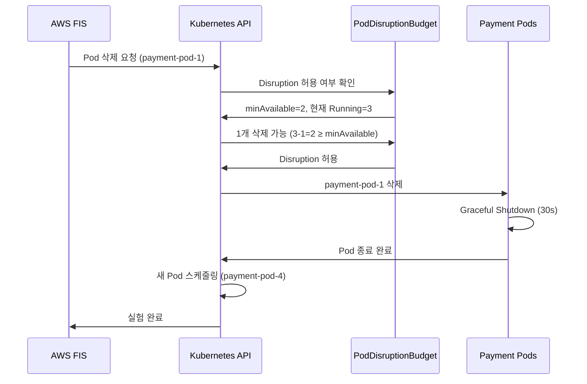

**PDB 위반 scenario**:

```bash
# 현재 Running Pods: 2개 (최소값)
$ kubectl get pods -n payment -l app=payment-service
NAME READY STATUS RESTARTS AGE
payment-pod-2 1/1 Running 0 5m
payment-pod-3 1/1 Running 0 5m

# FIS가 Pod 삭제 시도
$ aws fis start-experiment --experiment-template-id EXT123456

# Kubernetes가 PDB를 확인하고 거부
# minAvailable=2, 현재=2 → 1개 삭제 시 1개만 남음 → PDB 위반
# → FIS 실험 실패 (PDB가 Disruption 차단)

# FIS 실험 로그
{
 "state": "failed",
 "reason": "PodDisruptionBudget prevents pod deletion. Current: 2, Required: 2"
}
```

**pattern 2: 폭발 반경 limitation — 태그/namespace 실험 scope limitation**

```json
{
 "description": "제한된 범위의 Pod 장애 실험",
 "targets": {
 "eks-test-pods": {
 "resourceType": "aws:eks:pod",
 "selectionMode": "PERCENT(25)",
 "resourceTags": {
 "environment": "staging",
 "chaos-experiment": "enabled",
 "team": "payments"
 },
 "filters": [
 {
 "path": "Namespace",
 "values": ["payment-staging"]
 },
 {
 "path": "Labels.version",
 "values": ["canary"]
 }
 ],
 "parameters": {
 "clusterIdentifier": "staging-cluster",
 "namespace": "payment-staging"
 }
 }
 }
}
```

**폭발 반경 limitation strategy**:

| limitation method | Configuration method | Example |
|----------|----------|------|
| **namespace** | `filters.Namespace` | `payment-staging` (production 제외) |
| **라벨 optional** | `filters.Labels` | `version=canary` (canary Deploymentonly) |
| **태그 based** | `resourceTags` | `chaos-experiment=enabled` (명time 옵트인) |
| **ratiorate limitation** | `selectionMode: PERCENT(N)` | `PERCENT(25)` (최대 25%only impact) |
| ** limitation** | `selectionMode: COUNT(N)` | `COUNT(2)` (최대 2only) |

**pattern 3: gradual extension — 1 Pod → 10% Pod → 25% Pod per phase extension**

```json
{
 "description": "점진적 Pod 삭제 실험",
 "actions": {
 "phase-1-single-pod": {
 "actionId": "aws:eks:pod-delete",
 "description": "Phase 1: 1개 Pod 삭제",
 "parameters": {
 "kubernetesServiceAccount": "fis-experiment-role",
 "maxPodsToDelete": "1"
 },
 "targets": {
 "Pods": "eks-payment-pods-phase1"
 }
 },
 "wait-1": {
 "actionId": "aws:fis:wait",
 "parameters": {
 "duration": "PT2M"
 },
 "startAfter": ["phase-1-single-pod"]
 },
 "phase-2-10-percent": {
 "actionId": "aws:eks:pod-delete",
 "description": "Phase 2: 10% Pod 삭제",
 "parameters": {
 "kubernetesServiceAccount": "fis-experiment-role",
 "selectionMode": "PERCENT(10)"
 },
 "targets": {
 "Pods": "eks-payment-pods-phase2"
 },
 "startAfter": ["wait-1"]
 },
 "wait-2": {
 "actionId": "aws:fis:wait",
 "parameters": {
 "duration": "PT3M"
 },
 "startAfter": ["phase-2-10-percent"]
 },
 "phase-3-25-percent": {
 "actionId": "aws:eks:pod-delete",
 "description": "Phase 3: 25% Pod 삭제",
 "parameters": {
 "kubernetesServiceAccount": "fis-experiment-role",
 "selectionMode": "PERCENT(25)"
 },
 "targets": {
 "Pods": "eks-payment-pods-phase3"
 },
 "startAfter": ["wait-2"]
 }
 },
 "stopConditions": [
 {
 "source": "aws:cloudwatch:alarm",
 "value": "arn:aws:cloudwatch:ap-northeast-2:ACCOUNT_ID:alarm:PaymentService-ErrorRate-SLO"
 }
 ]
}
```

**gradual extension flow**:

```
Phase 1: 1개 Pod 삭제
 ↓ (2분 대기, SLO 모니터링)
Phase 2: 10% Pod 삭제
 ↓ (3분 대기, SLO 모니터링)
Phase 3: 25% Pod 삭제
 ↓
[성공] 모든 단계 통과 → 시스템 회복력 검증 완료
[실패] SLO 위반 → 자동 중단, 롤백
```

**pattern 4: rollback condition — latency P99 > 500ms or error rate > 5% time automatic interruption**

```json
{
 "description": "네트워크 지연 실험 with 자동 롤백",
 "actions": {
 "inject-latency": {
 "actionId": "aws:eks:pod-network-latency",
 "description": "200ms 네트워크 지연 주입",
 "parameters": {
 "kubernetesServiceAccount": "fis-experiment-role",
 "duration": "PT10M",
 "delayMilliseconds": "200",
 "jitterMilliseconds": "50"
 },
 "targets": {
 "Pods": "eks-payment-pods"
 }
 }
 },
 "stopConditions": [
 {
 "source": "aws:cloudwatch:alarm",
 "value": "arn:aws:cloudwatch:ap-northeast-2:ACCOUNT_ID:alarm:PaymentService-Latency-P99-SLO"
 },
 {
 "source": "aws:cloudwatch:alarm",
 "value": "arn:aws:cloudwatch:ap-northeast-2:ACCOUNT_ID:alarm:PaymentService-ErrorRate-SLO"
 }
 ],
 "roleArn": "arn:aws:iam::ACCOUNT_ID:role/FISExperimentRole",
 "tags": {
 "Environment": "production",
 "Team": "platform",
 "ChaosExperimentType": "network-latency"
 }
}
```

**automatic rollback scenario**:

```
[00:00] FIS 실험 시작 — 200ms 네트워크 지연 주입
[00:00] CloudWatch Alarms 모니터링 시작
 - Latency P99 SLO: 정상 (250ms < 500ms)
 - Error Rate SLO: 정상 (2% < 5%)
[00:03] Latency P99 증가 감지: 450ms
[00:05] Latency P99 SLO 위반: 520ms > 500ms
[00:05] CloudWatch Alarm 트리거: "PaymentService-Latency-P99-SLO"
[00:05] FIS 자동 중단 (stopCondition 만족)
[00:05] 네트워크 지연 제거 (자동 롤백)
[00:06] Latency P99 복구: 280ms
[00:08] 시스템 정상 상태 복구
```

#### FIS Experiment Template YAML example

```yaml
# FIS Experiment Template: EKS Pod 장애 주입 + stopConditions
AWSTemplateFormatVersion: '2010-09-09'
Description: 'FIS Experiment Template for EKS Pod Fault Injection'

Resources:
 PaymentServiceFISExperiment:
 Type: AWS::FIS::ExperimentTemplate
 Properties:
 Description: 'EKS Pod 삭제 실험 with SLO 보호'
 StopConditions:
 - Source: 'aws:cloudwatch:alarm'
 Value: !GetAtt PaymentServiceErrorRateAlarm.Arn
 - Source: 'aws:cloudwatch:alarm'
 Value: !GetAtt PaymentServiceLatencyAlarm.Arn
 Targets:
 PaymentPods:
 ResourceType: 'aws:eks:pod'
 SelectionMode: 'COUNT(2)'
 ResourceTags:
 app: 'payment-service'
 Parameters:
 clusterIdentifier: !Ref EKSClusterName
 namespace: 'payment'
 Actions:
 DeletePods:
 ActionId: 'aws:eks:pod-delete'
 Parameters:
 kubernetesServiceAccount: !GetAtt FISServiceAccount.Name
 maxPodsToDelete: '2'
 podDeletionMode: 'one-at-a-time'
 Targets:
 Pods: 'PaymentPods'
 RoleArn: !GetAtt FISExperimentRole.Arn
 Tags:
 Environment: 'production'
 Team: 'platform'

 PaymentServiceErrorRateAlarm:
 Type: AWS::CloudWatch::Alarm
 Properties:
 AlarmName: 'PaymentService-ErrorRate-SLO'
 AlarmDescription: 'Stop FIS if error rate exceeds 5%'
 MetricName: 'HTTPCode_Target_5XX_Count'
 Namespace: 'AWS/ApplicationELB'
 Statistic: Sum
 Period: 60
 EvaluationPeriods: 2
 Threshold: 50
 ComparisonOperator: GreaterThanThreshold
 TreatMissingData: notBreaching

 PaymentServiceLatencyAlarm:
 Type: AWS::CloudWatch::Alarm
 Properties:
 AlarmName: 'PaymentService-Latency-P99-SLO'
 AlarmDescription: 'Stop FIS if P99 latency exceeds 500ms'
 MetricName: 'pod_http_request_duration_p99'
 Namespace: 'ContainerInsights'
 Statistic: Average
 Period: 60
 EvaluationPeriods: 3
 Threshold: 500
 ComparisonOperator: GreaterThanThreshold

 FISExperimentRole:
 Type: AWS::IAM::Role
 Properties:
 AssumeRolePolicyDocument:
 Version: '2012-10-17'
 Statement:
 - Effect: Allow
 Principal:
 Service: fis.amazonaws.com
 Action: 'sts:AssumeRole'
 ManagedPolicyArns:
 - 'arn:aws:iam::aws:policy/AWSFaultInjectionSimulatorEKSAccess'
 Policies:
 - PolicyName: FISCloudWatchAccess
 PolicyDocument:
 Version: '2012-10-17'
 Statement:
 - Effect: Allow
 Action:
 - 'cloudwatch:DescribeAlarms'
 - 'cloudwatch:GetMetricData'
 Resource: '*'

 FISServiceAccount:
 Type: AWS::EKS::ServiceAccount
 Properties:
 ClusterName: !Ref EKSClusterName
 Name: 'fis-experiment-role'
 Namespace: 'kube-system'
 RoleArn: !GetAtt FISExperimentRole.Arn

Parameters:
 EKSClusterName:
 Type: String
 Description: 'Name of the EKS cluster'
 Default: 'my-cluster'

Outputs:
 ExperimentTemplateId:
 Description: 'FIS Experiment Template ID'
 Value: !GetAtt PaymentServiceFISExperiment.Id
 Export:
 Name: !Sub '${AWS::StackName}-ExperimentTemplateId'
```

:::tip FIS production safety 장치 Core
AWS FIS **stopConditions**와 **PDB Integration**은 production environment from safety Chaos Engineering performcan Key Features. SLO 위반 time automatic interruption, gradual extension, 폭발 반경 limitation 조합if, **use impact without** system times복력 Validation .

**Recommendations**:
1. **항상 stopConditions Configuration**: CloudWatch Alarm and 연동 to SLO 위반 time automatic interruption
2. **PDB mandatory Configuration**: all production workload PDB Application
3. **gradual extension**: 1 → 10% → 25% per phase extension as safety securing
4. **ratioproduction environment 우선**: staging environment from sufficient히 test after production Application
:::

### 9.5 AI based 고급 Chaos Engineering

AI utilizationif Chaos Engineering **manual 실험 design → intelligent automatic design**로 evolution. past failure pattern learning, Steady State Hypothesis automatic definition, GameDay Automation through system times복력 systematic as improvementtime킬 .

#### 9.5.1 past failure pattern learning → new 카오스 scenario automatic recommendation

AI past incident data learning to, actual occurrence possible high 카오스 scenario automatic as recommendation.

```python
# AI 기반 카오스 시나리오 생성기
from strands import Agent
import boto3

fis_client = boto3.client('fis', region_name='ap-northeast-2')
cloudwatch_client = boto3.client('cloudwatch', region_name='ap-northeast-2')

chaos_designer = Agent(
 name="chaos-scenario-designer",
 model="bedrock/anthropic.claude-sonnet",
 sop="""
 ## AI 기반 카오스 시나리오 자동 설계

 ### Phase 1: 과거 인시던트 분석 (학습)
 1. CloudWatch Logs Insights로 과거 6개월 인시던트 수집
 - 장애 유형별 빈도 분석
 - 영향 범위 및 복구 시간 분석
 - 근본 원인별 분류 (네트워크/리소스/배포)

 2. 인시던트 패턴 추출
 - 반복 발생 패턴 식별
 - 계절적/시간대별 패턴 분석
 - 의존성 기반 연쇄 장애 패턴

 ### Phase 2: 카오스 시나리오 자동 생성
 1. 장애 패턴별 FIS 실험 템플릿 자동 생성
 - Pod OOMKilled 패턴 → 메모리 압박 실험
 - 네트워크 타임아웃 패턴 → 레이턴시 주입 실험
 - 노드 장애 패턴 → 노드 종료 실험

 2. Steady State Hypothesis 자동 정의
 - 과거 SLO 데이터 기반 정상 상태 정의
 - CloudWatch Alarm 기반 중단 조건 자동 생성

 3. 실험 우선순위 제안
 - 빈도 × 영향도 기반 우선순위 계산
 - 미검증 장애 시나리오 우선 제안

 ### Phase 3: 실험 자동 실행 및 분석
 1. FIS 실험 자동 실행 (스케줄링)
 2. 시스템 반응 관찰 및 메트릭 수집
 3. 예상 대비 실제 결과 비교 분석
 4. 미흡한 회복력 영역 식별 및 개선 권장
 """
)
```

**Practical Example: past incident based 카오스 scenario automatic generation**

```python
# Step 1: 과거 인시던트 데이터 수집
import json
from datetime import datetime, timedelta

def analyze_past_incidents():
 """CloudWatch Logs Insights로 과거 인시던트 분석"""
 logs_client = boto3.client('logs', region_name='ap-northeast-2')

 query = """
 fields @timestamp, detail.alarmName, detail.state.value, detail.state.reason
 | filter detail-type = "CloudWatch Alarm State Change"
 | filter detail.state.value = "ALARM"
 | stats count(*) as incident_count by detail.state.reason as failure_pattern
 | sort incident_count desc
 """

 start_time = int((datetime.now() - timedelta(days=180)).timestamp())
 end_time = int(datetime.now().timestamp())

 response = logs_client.start_query(
 logGroupName='/aws/events/cloudwatch-alarms',
 startTime=start_time,
 endTime=end_time,
 queryString=query
 )

 query_id = response['queryId']

 # 쿼리 결과 대기 및 반환
 import time
 while True:
 result = logs_client.get_query_results(queryId=query_id)
 if result['status'] == 'Complete':
 return result['results']
 time.sleep(2)

# Step 2: AI가 인시던트 패턴 기반 카오스 시나리오 제안
incident_patterns = analyze_past_incidents()

scenario_prompt = f"""
과거 6개월간 발생한 인시던트 패턴:
{json.dumps(incident_patterns, indent=2)}

이 패턴을 기반으로 다음을 수행하세요:
1. 가장 빈번한 장애 패턴 Top 5 식별
2. 각 패턴에 대한 AWS FIS 실험 템플릿 생성
3. Steady State Hypothesis 정의 (SLO 기반)
4. 실험 우선순위 제안 (빈도 × 영향도)
"""

response = chaos_designer.run(scenario_prompt)

# Step 3: AI가 제안한 FIS 실험 템플릿 자동 생성
# 예시 출력:
"""
[AI 분석 결과]

Top 5 장애 패턴:
1. Pod OOMKilled (37회) — 메모리 부족
2. Network Timeout (24회) — 외부 API 지연
3. Node NotReady (18회) — 노드 장애
4. Deployment Failed (12회) — 이미지 Pull 실패
5. RDS Connection Timeout (9회) — 데이터베이스 연결 실패

권장 카오스 시나리오:

[시나리오 1: 메모리 압박 실험]
목적: Pod OOMKilled 대응 능력 검증
FIS 액션: aws:eks:inject-pod-memory-stress
대상: payment-service (과거 OOMKilled 37회 발생)
Steady State: memory_utilization < 85%, pod_restart_count < 5
우선순위: 높음 (빈도 37 × 영향도 9 = 333)

[시나리오 2: 네트워크 레이턴시 실험]
목적: 외부 API 지연 시 타임아웃 처리 검증
FIS 액션: aws:eks:pod-network-latency
대상: order-service (외부 payment API 호출)
Steady State: p99_latency < 500ms, error_rate < 1%
우선순위: 중간 (빈도 24 × 영향도 7 = 168)

[시나리오 3: 노드 종료 실험]
목적: 노드 장애 시 Pod 재스케줄링 검증
FIS 액션: aws:eks:terminate-nodegroup-instances
대상: worker-node-group (25% 종료)
Steady State: available_pods >= minAvailable (PDB), scheduling_time < 60s
우선순위: 높음 (빈도 18 × 영향도 10 = 180)
"""
```

#### 9.5.2 Steady State Hypothesis AI automatic definition

Chaos Engineering Core인 **Steady State Hypothesis**(normal status 가설)를 AI past metric data based as automatic definition.

```python
# Steady State Hypothesis 자동 생성
steady_state_agent = Agent(
 name="steady-state-generator",
 model="bedrock/anthropic.claude-sonnet",
 sop="""
 ## Steady State Hypothesis 자동 정의

 ### 입력 데이터
 1. 과거 30일 CloudWatch 메트릭 (정상 상태 기간)
 - RPS (Requests Per Second)
 - Error Rate
 - P50/P95/P99 Latency
 - CPU/Memory Utilization
 - Pod Restart Count

 2. 현재 SLO 설정
 - Availability SLO: 99.9%
 - Latency SLO: P99 < 500ms
 - Error Budget: 0.1%

 ### 정상 상태 정의 로직
 1. 메트릭별 정상 범위 계산
 - Baseline: 과거 30일 평균
 - Acceptable Range: 평균 ± 2σ (표준편차)
 - Alert Threshold: 평균 + 3σ

 2. SLO 기반 상한선 설정
 - Error Rate: max(SLO threshold, 평균 + 2σ)
 - Latency: min(SLO threshold, 평균 + 2σ)

 3. CloudWatch Alarm으로 변환
 - Steady State 위반 시 FIS 실험 자동 중단

 ### 출력
 - Steady State Hypothesis YAML
 - CloudWatch Alarm 정의 (FIS stopConditions)
 """
)
```

**Practical Example: Steady State automatic generation**

```python
def generate_steady_state_hypothesis(service_name: str, lookback_days: int = 30):
 """AI 기반 Steady State Hypothesis 자동 생성"""

 # Step 1: 과거 메트릭 수집
 end_time = datetime.now()
 start_time = end_time - timedelta(days=lookback_days)

 metrics = {
 'error_rate': cloudwatch_client.get_metric_statistics(
 Namespace='AWS/ApplicationELB',
 MetricName='HTTPCode_Target_5XX_Count',
 Dimensions=[{'Name': 'LoadBalancer', 'Value': f'app/{service_name}-lb'}],
 StartTime=start_time,
 EndTime=end_time,
 Period=300,
 Statistics=['Average', 'Maximum']
 ),
 'latency_p99': cloudwatch_client.get_metric_statistics(
 Namespace='ContainerInsights',
 MetricName='pod_http_request_duration_p99',
 Dimensions=[{'Name': 'Service', 'Value': service_name}],
 StartTime=start_time,
 EndTime=end_time,
 Period=300,
 Statistics=['Average']
 )
 }

 # Step 2: AI가 정상 상태 정의
 prompt = f"""
 서비스: {service_name}
 과거 {lookback_days}일 메트릭 데이터:
 {json.dumps(metrics, indent=2, default=str)}

 다음을 생성하세요:
 1. Steady State Hypothesis (정상 상태 기준)
 2. FIS stopConditions용 CloudWatch Alarm 정의
 3. 실험 중 모니터링할 핵심 메트릭 목록
 """

 response = steady_state_agent.run(prompt)

 # 예시 출력:
 """
 [Steady State Hypothesis: payment-service]

 ## 정상 상태 기준 (Baseline: 과거 30일 평균)

 1. Error Rate
 - Baseline: 0.3%
 - Acceptable Range: 0% - 0.8% (평균 ± 2σ)
 - Alert Threshold: 1.2% (평균 + 3σ)
 → FIS stopCondition: error_rate > 1.2%

 2. Latency P99
 - Baseline: 320ms
 - Acceptable Range: 200ms - 440ms
 - Alert Threshold: 560ms
 → FIS stopCondition: p99_latency > 560ms

 3. Availability
 - Baseline: 99.97%
 - Acceptable Range: 99.9% - 100%
 - Alert Threshold: 99.8%
 → FIS stopCondition: availability < 99.8%

 4. Pod Restart Count (5분 윈도우)
 - Baseline: 0.1회
 - Acceptable Range: 0 - 1회
 - Alert Threshold: 3회
 → FIS stopCondition: restart_count > 3

 ## CloudWatch Alarm 정의 (FIS stopConditions)

 ```yaml
 stopConditions:
 - source: aws:cloudwatch:alarm
 value: arn:aws:cloudwatch:region:account:alarm:payment-ErrorRate-SSH
 - source: aws:cloudwatch:alarm
 value: arn:aws:cloudwatch:region:account:alarm:payment-LatencyP99-SSH
 - source: aws:cloudwatch:alarm
 value: arn:aws:cloudwatch:region:account:alarm:payment-Availability-SSH
 - source: aws:cloudwatch:alarm
 value: arn:aws:cloudwatch:region:account:alarm:payment-RestartCount-SSH
 ```

 ## 핵심 모니터링 메트릭
 1. RPS (정상 범위: 800-1200 req/s)
 2. Active Connections (정상 범위: 50-150)
 3. Database Connection Pool (정상 범위: 10-30)
 """

 return response
```

#### 9.5.3 GameDay Automation — AI scenario generation + execution + Analysis

**GameDay**(re-난 recovery 훈련)를 AI complete Automation. scenario generation부터 execution, result Analysis autonomous perform.

```python
# GameDay 자동화 에이전트
gameday_orchestrator = Agent(
 name="gameday-orchestrator",
 model="bedrock/anthropic.claude-opus", # 복잡한 의사결정 → Opus 사용
 sop="""
 ## GameDay 자동화 워크플로우

 ### Phase 1: 사전 계획 (D-7)
 1. 과거 인시던트 분석 → 현실적인 시나리오 생성
 2. 참가 팀 및 역할 정의 (자동 알림)
 3. Steady State Hypothesis 정의
 4. Rollback Plan 준비

 ### Phase 2: 실행 준비 (D-1)
 1. 스테이징 환경 상태 확인
 2. Monitoring Dashboard 준비 (AMG)
 3. 참가자에게 GameDay 브리핑 전송 (Slack)
 4. stopConditions 검증

 ### Phase 3: GameDay 실행 (D-Day)
 1. 시나리오 1: Pod 장애 주입 (FIS 실행)
 - 관찰 시간: 10분
 - 자동 복구 검증
 - 메트릭 수집

 2. 시나리오 2: 네트워크 지연 주입
 - 관찰 시간: 15분
 - 타임아웃 처리 검증
 - 사용자 영향 분석

 3. 시나리오 3: 데이터베이스 장애
 - 관찰 시간: 20분
 - Failover 검증
 - 복구 시간 측정

 ### Phase 4: 사후 분석 (D+1)
 1. 타임라인 재구성
 2. 복구 시간 분석 (MTTR)
 3. 취약점 식별 및 개선 권장
 4. Post-Mortem 보고서 자동 생성
 5. JIRA 티켓 생성 (개선 과제)
 """
)
```

**Practical Example: Automation GameDay execution**

```python
# GameDay 시나리오 정의
gameday_scenario = {
 "name": "EKS 복합 장애 대응 훈련",
 "date": "2026-02-20",
 "environment": "staging",
 "scenarios": [
 {
 "id": "scenario-1",
 "name": "Pod 대량 종료 (25% 동시 장애)",
 "fis_template_id": "EXT-pod-termination-25pct",
 "duration": "10m",
 "expected_behavior": "HPA 자동 스케일아웃, 60초 이내 복구",
 "success_criteria": "error_rate < 2%, p99_latency < 800ms"
 },
 {
 "id": "scenario-2",
 "name": "네트워크 레이턴시 300ms 주입",
 "fis_template_id": "EXT-network-latency-300ms",
 "duration": "15m",
 "expected_behavior": "Circuit Breaker 동작, Fallback 응답",
 "success_criteria": "timeout_rate < 5%, fallback_success > 95%"
 },
 {
 "id": "scenario-3",
 "name": "RDS Failover 시뮬레이션",
 "fis_template_id": "EXT-rds-failover",
 "duration": "20m",
 "expected_behavior": "Connection Pool 재연결, 데이터 손실 없음",
 "success_criteria": "connection_retry_success > 99%, data_consistency = 100%"
 }
 ]
}

# GameDay 자동 실행
def run_automated_gameday(scenario):
 """AI 기반 GameDay 자동 실행"""

 # Phase 1: 사전 준비
 print("[Phase 1] GameDay 사전 준비 시작...")
 gameday_orchestrator.run(f"""
 GameDay 시나리오:
 {json.dumps(scenario, indent=2)}

 다음을 수행하세요:
 1. 참가 팀에게 Slack 알림 전송 (날짜, 시나리오 개요)
 2. AMG 대시보드 생성 (실시간 모니터링)
 3. stopConditions 검증
 """)

 # Phase 2: 시나리오별 실행
 print("[Phase 2] GameDay 시나리오 실행 시작...")
 results = []

 for scenario_item in scenario['scenarios']:
 print(f" → 실행 중: {scenario_item['name']}")

 # FIS 실험 시작
 experiment = fis_client.start_experiment(
 experimentTemplateId=scenario_item['fis_template_id']
 )

 experiment_id = experiment['experiment']['id']

 # 실험 완료 대기
 import time
 while True:
 status = fis_client.get_experiment(id=experiment_id)
 state = status['experiment']['state']['status']

 if state in ['completed', 'stopped', 'failed']:
 break

 time.sleep(10)

 # 결과 수집
 result = {
 'scenario_id': scenario_item['id'],
 'experiment_id': experiment_id,
 'state': state,
 'metrics': collect_metrics_during_experiment(experiment_id)
 }
 results.append(result)

 # AI 분석
 analysis_prompt = f"""
 시나리오: {scenario_item['name']}
 예상 동작: {scenario_item['expected_behavior']}
 성공 기준: {scenario_item['success_criteria']}
 실제 결과:
 {json.dumps(result, indent=2)}

 다음을 분석하세요:
 1. 성공 기준 충족 여부
 2. 예상 대비 실제 동작 비교
 3. 발견된 취약점
 4. 개선 권장 사항
 """

 scenario_analysis = gameday_orchestrator.run(analysis_prompt)
 result['ai_analysis'] = scenario_analysis

 # Phase 3: 종합 분석 및 보고서 생성
 print("[Phase 3] GameDay 결과 분석 및 보고서 생성...")

 final_report_prompt = f"""
 GameDay 전체 결과:
 {json.dumps(results, indent=2)}

 다음을 포함한 Post-Mortem 보고서를 생성하세요:
 1. Executive Summary (경영진용 요약)
 2. 시나리오별 상세 결과
 3. 타임라인 재구성
 4. 취약점 및 개선 과제 (우선순위별)
 5. JIRA 티켓 생성할 개선 과제 목록
 """

 final_report = gameday_orchestrator.run(final_report_prompt)

 # Slack 보고
 slack_client = boto3.client('chatbot', region_name='ap-northeast-2')
 slack_client.send_message(
 Channel='#gameday-results',
 Message=final_report
 )

 # JIRA 티켓 자동 생성
 create_jira_tickets_from_report(final_report)

 return final_report

# 실행
report = run_automated_gameday(gameday_scenario)
```

**AI generation GameDay 보고서 example**:

```markdown
# GameDay Post-Mortem 보고서
Date: 2026-02-20 | Environment: Staging | Duration: 45분

## Executive Summary
3개 시나리오 실행, 2개 성공, 1개 부분 성공.
- Pod 대량 종료: ✅ 성공 (복구 시간 45초)
- 네트워크 레이턴시: ⚠️ 부분 성공 (Timeout 7% 발생)
- RDS Failover: ✅ 성공 (Failover 시간 18초)

주요 발견: Circuit Breaker 타임아웃 설정 미흡

## 시나리오 1: Pod 대량 종료
목표: 25% Pod 동시 종료 시 자동 복구 검증
결과: ✅ 성공
- 복구 시간: 45초 (목표: 60초 이내)
- Error Rate: 1.2% (목표: < 2%)
- P99 Latency: 680ms (목표: < 800ms)

발견 사항:
- HPA가 40초 만에 새 Pod 생성 완료
- PDB가 동시 종료를 적절히 제한
- 사용자 영향 최소화 성공

## 시나리오 2: 네트워크 레이턴시
목표: 300ms 레이턴시 주입 시 Circuit Breaker 동작 검증
결과: ⚠️ 부분 성공
- Timeout Rate: 7% (목표: < 5%)
- Fallback Success: 98% (목표: > 95%)

발견 사항:
- Circuit Breaker 동작은 정상
- 하지만 타임아웃 설정이 너무 짧음 (현재: 500ms)
- 권장: 타임아웃을 800ms로 증가

취약점:
- order-service의 payment-api 호출 타임아웃 설정 미흡
- 재시도 로직 없음 (503 에러 즉시 반환)

## 시나리오 3: RDS Failover
목표: RDS Failover 시 연결 재시도 검증
결과: ✅ 성공
- Failover 시간: 18초
- Connection Retry Success: 100%
- Data Consistency: 100%

발견 사항:
- Connection Pool이 자동으로 재연결 성공
- 트랜잭션 중단된 요청 자동 재시도 성공

## 개선 과제 (우선순위별)

### P0 (긴급)
- [ ] order-service: payment-api 타임아웃 500ms → 800ms 증가
- [ ] order-service: 재시도 로직 추가 (exponential backoff)

### P1 (높음)
- [ ] Circuit Breaker 설정 표준화 문서 작성
- [ ] 전사 서비스 타임아웃 설정 검토

### P2 (중간)
- [ ] GameDay 자동화 스크립트 개선 (더 많은 시나리오)
- [ ] Observability 대시보드에 Circuit Breaker 상태 추가

## JIRA 티켓 생성
- INFRA-1234: order-service 타임아웃 설정 개선
- INFRA-1235: Circuit Breaker 설정 표준화 문서
- INFRA-1236: 전사 서비스 타임아웃 감사
```

:::tip AI based 고급 Chaos Engineering Core
AI utilizationif Chaos Engineering **manual 실험 design → intelligent automatic design**로 evolution. past failure pattern learning through actual occurrence possible high scenario automatic recommendation and, Steady State Hypothesis data based as definition and, GameDay complete Automation to systematic as system times복력 improvementtime킬 .

**Core Value**:
1. **data based scenario**: past incident Analysis → 현실인 카오스 scenario
2. **automatic normal status definition**: metric based Steady State Hypothesis automatic generation
3. **GameDay Automation**: scenario generation → execution → Analysis → 보고서 generation entire Automation
4. **continuous improvement**: AI 실험 result learning → following 실험 improvement
:::

### 9.6 prediction based Cost Optimization

prediction scaling and AI analysis combinationif, **performance maintenance + Cost Optimization**를 simultaneously 달 . traffic prediction and Spot instance interruption prediction combination to, On-Demand compared to Spot ratiorate dynamic as adjustment and, example산 초 and preemptive prevention.

#### 9.6.1 traffic prediction + Spot interruption prediction combination

Karpenter Spot instance use and traffic prediction combination to, **cost efficiency and 안정**을 균-type있 maintenance.

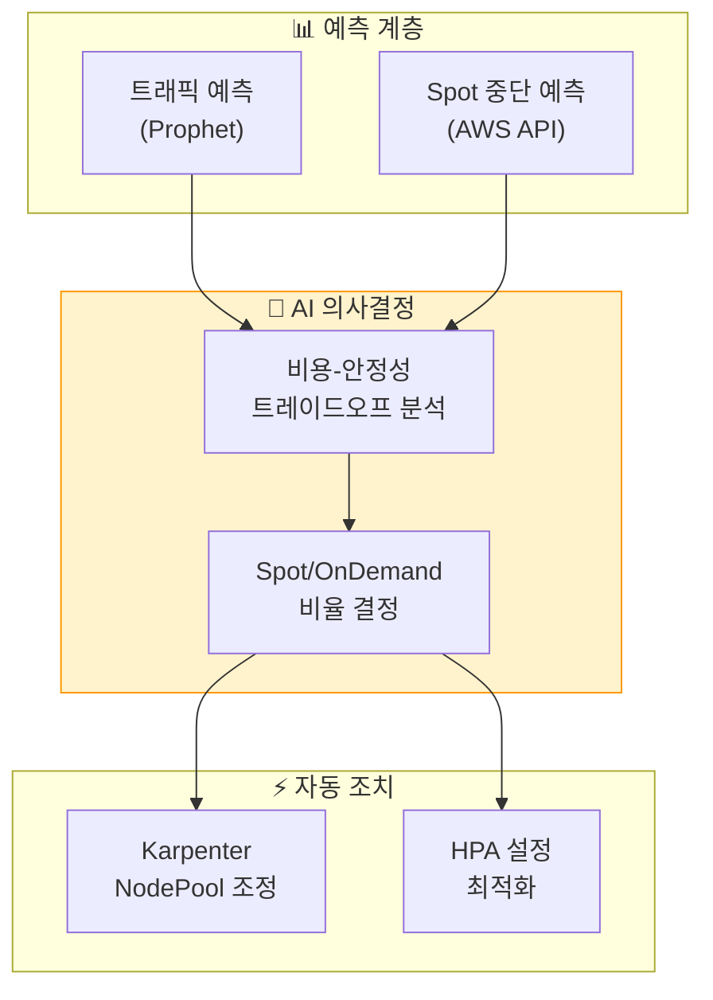

**Spot interruption prediction based ratiorate adjustment**:

```python
# Spot 중단 예측 + 트래픽 예측 통합 스케일러
import boto3
from datetime import datetime, timedelta

ec2_client = boto3.client('ec2', region_name='ap-northeast-2')
cloudwatch_client = boto3.client('cloudwatch', region_name='ap-northeast-2')

def predict_spot_interruption_risk(instance_types: list[str], availability_zones: list[str]) -> dict:
 """Spot 인스턴스 중단 위험도 예측"""

 # Spot 중단 권고 조회 (최근 5분 데이터)
 risk_scores = {}

 for az in availability_zones:
 for instance_type in instance_types:
 # CloudWatch에서 Spot 중단 빈도 조회
 response = cloudwatch_client.get_metric_statistics(
 Namespace='AWS/EC2Spot',
 MetricName='InterruptionRate',
 Dimensions=[
 {'Name': 'AvailabilityZone', 'Value': az},
 {'Name': 'InstanceType', 'Value': instance_type}
 ],
 StartTime=datetime.now() - timedelta(hours=24),
 EndTime=datetime.now(),
 Period=3600,
 Statistics=['Average']
 )

 if response['Datapoints']:
 avg_interruption_rate = sum(dp['Average'] for dp in response['Datapoints']) / len(response['Datapoints'])
 risk_scores[f"{instance_type}/{az}"] = avg_interruption_rate
 else:
 risk_scores[f"{instance_type}/{az}"] = 0.0

 return risk_scores

def calculate_optimal_spot_ratio(traffic_prediction: dict, spot_risk: dict) -> dict:
 """트래픽 예측 + Spot 위험도 기반 최적 Spot 비율 계산"""

 predicted_rps = traffic_prediction['predicted_rps']
 prediction_confidence = traffic_prediction['confidence'] # 0.0 - 1.0

 # 평균 Spot 중단 위험도
 avg_spot_risk = sum(spot_risk.values()) / len(spot_risk) if spot_risk else 0.0

 # 결정 로직
 if avg_spot_risk > 0.05: # 5% 이상 중단 위험
 # 고위험: On-Demand 비율 증가
 spot_ratio = 0.3
 ondemand_ratio = 0.7
 reason = "Spot 중단 위험 높음 (>5%)"

 elif prediction_confidence < 0.7: # 예측 신뢰도 낮음
 # 불확실성 높음: On-Demand 비율 증가 (안정성 우선)
 spot_ratio = 0.5
 ondemand_ratio = 0.5
 reason = "트래픽 예측 신뢰도 낮음 (<70%)"

 elif predicted_rps > 5000: # 고트래픽 예상
 # 피크 타임: On-Demand 비율 증가 (성능 우선)
 spot_ratio = 0.4
 ondemand_ratio = 0.6
 reason = "고트래픽 예상 (>5000 RPS)"

 else:
 # 정상: Spot 비율 최대화 (비용 최적화)
 spot_ratio = 0.8
 ondemand_ratio = 0.2
 reason = "정상 운영 조건 (비용 최적화)"

 return {
 'spot_ratio': spot_ratio,
 'ondemand_ratio': ondemand_ratio,
 'reason': reason,
 'estimated_cost_saving': calculate_cost_saving(spot_ratio)
 }

def calculate_cost_saving(spot_ratio: float) -> float:
 """Spot 비율 기반 비용 절감액 추정"""
 # 가정: Spot 인스턴스는 On-Demand 대비 70% 저렴
 spot_discount = 0.7
 return spot_ratio * spot_discount * 100 # 백분율

# 실행 예시
spot_risk = predict_spot_interruption_risk(
 instance_types=['c6i.xlarge', 'c5.xlarge'],
 availability_zones=['ap-northeast-2a', 'ap-northeast-2b', 'ap-northeast-2c']
)

traffic_pred = {
 'predicted_rps': 3500,
 'confidence': 0.85
}

optimal_ratio = calculate_optimal_spot_ratio(traffic_pred, spot_risk)

print(f"""
[예측 기반 Spot 비율 조정]
트래픽 예측: {traffic_pred['predicted_rps']} RPS (신뢰도: {traffic_pred['confidence']:.0%})
Spot 중단 위험: {sum(spot_risk.values()) / len(spot_risk):.2%}

권장 비율:
- Spot: {optimal_ratio['spot_ratio']:.0%}
- On-Demand: {optimal_ratio['ondemand_ratio']:.0%}

근거: {optimal_ratio['reason']}
예상 비용 절감: {optimal_ratio['estimated_cost_saving']:.1f}%
""")
```

#### 9.6.2 prediction scaling as On-Demand compared to Spot ratiorate dynamic adjustment

Karpenter NodePool configuration dynamic as adjustment to, prediction traffic and Spot riskalso according to 최 ratiorate maintenance.

```yaml
# Karpenter NodePool: 동적 Spot 비율 조정
apiVersion: karpenter.sh/v1
kind: NodePool
metadata:
 name: dynamic-spot-pool
spec:
 template:
 spec:
 requirements:
 - key: karpenter.sh/capacity-type
 operator: In
 values: ["spot", "on-demand"]
 - key: kubernetes.io/arch
 operator: In
 values: ["amd64"]
 - key: node.kubernetes.io/instance-type
 operator: In
 values: ["c6i.xlarge", "c5.xlarge", "c6a.xlarge"]

 # Spot 비율 동적 조정 (기본값: 70% Spot, 30% On-Demand)
 kubelet:
 systemReserved:
 cpu: 100m
 memory: 100Mi

 # Spot 중단 처리 전략
 disruption:
 consolidationPolicy: WhenUnderutilized
 expireAfter: 720h # 30일

 # 가중치 기반 비율 제어
 weight: 100
---
# Lambda 함수: Karpenter NodePool 동적 업데이트
import boto3
import json

eks_client = boto3.client('eks', region_name='ap-northeast-2')
k8s_client = boto3.client('eks', region_name='ap-northeast-2') # kubectl 대신 사용

def update_karpenter_nodepool_weights(optimal_ratio: dict):
 """Karpenter NodePool의 Spot/OnDemand 가중치 업데이트"""

 spot_weight = int(optimal_ratio['spot_ratio'] * 100)
 ondemand_weight = int(optimal_ratio['ondemand_ratio'] * 100)

 # NodePool 업데이트 (kubectl apply 대신 API 사용)
 nodepool_patch = {
 "spec": {
 "template": {
 "spec": {
 "requirements": [
 {
 "key": "karpenter.sh/capacity-type",
 "operator": "In",
 "values": ["spot", "on-demand"],
 "weight": {
 "spot": spot_weight,
 "on-demand": ondemand_weight
 }
 }
 ]
 }
 }
 }
 }

 # CloudWatch 메트릭 기록
 cloudwatch_client.put_metric_data(
 Namespace='Karpenter/CostOptimization',
 MetricData=[
 {
 'MetricName': 'SpotRatio',
 'Value': optimal_ratio['spot_ratio'],
 'Unit': 'Percent',
 'Timestamp': datetime.now()
 },
 {
 'MetricName': 'EstimatedCostSaving',
 'Value': optimal_ratio['estimated_cost_saving'],
 'Unit': 'Percent',
 'Timestamp': datetime.now()
 }
 ]
 )

 print(f"Karpenter NodePool 업데이트: Spot {spot_weight}%, OnDemand {ondemand_weight}%")

# EventBridge Rule: 5분마다 실행
def lambda_handler(event, context):
 # 1. 트래픽 예측 가져오기
 traffic_pred = get_traffic_prediction()

 # 2. Spot 중단 위험 예측
 spot_risk = predict_spot_interruption_risk(
 instance_types=['c6i.xlarge', 'c5.xlarge'],
 availability_zones=['ap-northeast-2a', 'ap-northeast-2b', 'ap-northeast-2c']
 )

 # 3. 최적 비율 계산
 optimal_ratio = calculate_optimal_spot_ratio(traffic_pred, spot_risk)

 # 4. Karpenter NodePool 업데이트
 update_karpenter_nodepool_weights(optimal_ratio)

 # 5. Slack 알림 (비율 변경 시)
 if abs(optimal_ratio['spot_ratio'] - 0.7) > 0.1: # 기본값 대비 10% 이상 변경
 send_slack_notification(
 channel='#cost-optimization',
 message=f"""
 🔄 Karpenter Spot 비율 자동 조정

 **조정 근거**: {optimal_ratio['reason']}
 **새 비율**: Spot {optimal_ratio['spot_ratio']:.0%}, On-Demand {optimal_ratio['ondemand_ratio']:.0%}
 **예상 비용 절감**: {optimal_ratio['estimated_cost_saving']:.1f}%

 트래픽 예측: {traffic_pred['predicted_rps']} RPS (신뢰도 {traffic_pred['confidence']:.0%})
 Spot 중단 위험: {sum(spot_risk.values()) / len(spot_risk):.2%}
 """
 )

 return {
 'statusCode': 200,
 'body': json.dumps(optimal_ratio)
 }
```

#### 9.6.3 CloudWatch metric based cost abnormal detection

CloudWatch Anomaly Detection leveraging example산 초 and preemptive detection and automatic alert.

```python
# 비용 이상 탐지 설정
import boto3

cloudwatch_client = boto3.client('cloudwatch', region_name='ap-northeast-2')
ce_client = boto3.client('ce', region_name='ap-northeast-2') # Cost Explorer

# Step 1: 일일 비용 메트릭을 CloudWatch에 기록
def record_daily_cost_to_cloudwatch():
 """Cost Explorer 데이터를 CloudWatch Custom Metric으로 기록"""

 # 어제 비용 조회
 yesterday = (datetime.now() - timedelta(days=1)).strftime('%Y-%m-%d')
 today = datetime.now().strftime('%Y-%m-%d')

 response = ce_client.get_cost_and_usage(
 TimePeriod={
 'Start': yesterday,
 'End': today
 },
 Granularity='DAILY',
 Metrics=['UnblendedCost'],
 Filter={
 'Dimensions': {
 'Key': 'SERVICE',
 'Values': ['Amazon Elastic Kubernetes Service', 'Amazon EC2']
 }
 }
 )

 total_cost = float(response['ResultsByTime'][0]['Total']['UnblendedCost']['Amount'])

 # CloudWatch 메트릭 기록
 cloudwatch_client.put_metric_data(
 Namespace='AWS/Billing',
 MetricData=[
 {
 'MetricName': 'DailyEKSCost',
 'Value': total_cost,
 'Unit': 'None',
 'Timestamp': datetime.now()
 }
 ]
 )

 return total_cost

# Step 2: Anomaly Detection 설정
cloudwatch_client.put_anomaly_detector(
 Namespace='AWS/Billing',
 MetricName='DailyEKSCost',
 Stat='Sum'
)

# Step 3: 이상 비용 알람 설정
cloudwatch_client.put_metric_alarm(
 AlarmName='EKS-Cost-Anomaly-Detection',
 AlarmDescription='EKS 일일 비용 이상 탐지 (Anomaly Detection)',
 ActionsEnabled=True,
 AlarmActions=[
 'arn:aws:sns:ap-northeast-2:ACCOUNT_ID:cost-alerts'
 ],
 MetricName='DailyEKSCost',
 Namespace='AWS/Billing',
 Statistic='Sum',
 Period=86400, # 24시간
 EvaluationPeriods=1,
 ThresholdMetricId='ad1',
 ComparisonOperator='LessThanLowerOrGreaterThanUpperThreshold',
 Metrics=[
 {
 'Id': 'm1',
 'ReturnData': True,
 'MetricStat': {
 'Metric': {
 'Namespace': 'AWS/Billing',
 'MetricName': 'DailyEKSCost'
 },
 'Period': 86400,
 'Stat': 'Sum'
 }
 },
 {
 'Id': 'ad1',
 'Expression': 'ANOMALY_DETECTION_BAND(m1, 2)', # 2 standard deviations
 'Label': 'DailyEKSCost (expected)'
 }
 ]
)

print("비용 이상 탐지 설정 완료: CloudWatch Anomaly Detection + Alarm")
```

#### 9.6.4 prediction model based Reserved Instances/Savings Plans Optimization

ML model leveraging 미래 resource use량 prediction and, Reserved Instances or Savings Plans 구매 optimization.

```python
# RI/Savings Plans 구매 최적화
from prophet import Prophet
import pandas as pd

def predict_baseline_capacity(historical_data: pd.DataFrame) -> dict:
 """과거 리소스 사용량 기반 Baseline 용량 예측"""

 # Prophet 모델 학습
 model = Prophet(
 yearly_seasonality=True,
 weekly_seasonality=True,
 daily_seasonality=False
 )

 # 과거 인스턴스 시간(instance-hours) 데이터
 df = historical_data[['ds', 'y']].copy() # ds: 날짜, y: 인스턴스 시간
 model.fit(df)

 # 향후 90일 예측
 future = model.make_future_dataframe(periods=90)
 forecast = model.predict(future)

 # Baseline 계산: 하위 20% percentile (항상 필요한 최소 용량)
 baseline_capacity = forecast['yhat'].quantile(0.20)

 # 피크 용량: 상위 95% percentile
 peak_capacity = forecast['yhat'].quantile(0.95)

 return {
 'baseline_capacity': baseline_capacity,
 'peak_capacity': peak_capacity,
 'forecast': forecast
 }

# 실행 예시
historical_data = pd.DataFrame({
 'ds': pd.date_range(start='2025-08-01', end='2026-02-01', freq='H'),
 'y': [50, 52, 48, 55, 60, 58, 62, ...] # 시간당 인스턴스 수
})

prediction = predict_baseline_capacity(historical_data)

print(f"""
[RI/Savings Plans 구매 권장]

Baseline 용량 (하위 20%): {prediction['baseline_capacity']:.0f} 인스턴스
→ 권장: {prediction['baseline_capacity']:.0f}개 인스턴스에 대해 1년 RI 구매

Peak 용량 (상위 95%): {prediction['peak_capacity']:.0f} 인스턴스
→ Baseline 초과분: {prediction['peak_capacity'] - prediction['baseline_capacity']:.0f}개
→ 초과분은 Spot + On-Demand 조합 사용

예상 비용 절감:
- RI 적용 시: 30-40% 절감
- Spot 적용 시: 60-70% 절감 (피크 시간대)
- 총 예상 절감: 약 45% (혼합 전략)
""")
```

**Cost Explorer Integration — Real-time cost tracking**

```yaml
# CloudWatch Dashboard: 비용 최적화 현황
apiVersion: v1
kind: ConfigMap
metadata:
 name: cost-optimization-dashboard
data:
 dashboard.json: |
 {
 "widgets": [
 {
 "type": "metric",
 "properties": {
 "title": "일일 EKS 비용 추이",
 "metrics": [
 ["AWS/Billing", "DailyEKSCost", {"stat": "Sum"}],
 [".", ".", {"stat": "Sum", "id": "ad1", "expression": "ANOMALY_DETECTION_BAND(m1, 2)"}]
 ],
 "period": 86400,
 "region": "ap-northeast-2"
 }
 },
 {
 "type": "metric",
 "properties": {
 "title": "Spot vs On-Demand 비율",
 "metrics": [
 ["Karpenter/CostOptimization", "SpotRatio"],
 [".", "OnDemandRatio"]
 ],
 "period": 300,
 "region": "ap-northeast-2"
 }
 },
 {
 "type": "metric",
 "properties": {
 "title": "누적 비용 절감액",
 "metrics": [
 ["Karpenter/CostOptimization", "EstimatedCostSaving"]
 ],
 "period": 86400,
 "stat": "Sum",
 "region": "ap-northeast-2"
 }
 },
 {
 "type": "metric",
 "properties": {
 "title": "Spot 중단 빈도",
 "metrics": [
 ["AWS/EC2Spot", "InterruptionRate", {"stat": "Average"}]
 ],
 "period": 3600,
 "region": "ap-northeast-2"
 }
 }
 ]
 }
```

:::info prediction based Cost Optimization Core
traffic prediction and Spot interruption prediction combinationif, **performance 저 without** cost 대폭 savings . Karpenter dynamic Spot ratiorate adjustment as cost efficiency 극대화 and, CloudWatch Anomaly Detection as example산 초 and preemptive prevention and, ML based 용량 prediction as RI/Savings Plans 구매 optimization.

**cost savings strategy**:
1. **Spot ratiorate 최대화**: normal time대 80% Spot, 피크 time대 40% Spot
2. **Baseline RI 구매**: 위 20% percentile 용량 about 1year RI
3. **abnormal detection**: CloudWatch Anomaly Detection as example산 초 and preemptive 경고
4. **dynamic adjustment**: 5minutes마다 traffic prediction + Spot riskalso based ratiorate adjustment

**example상 effect**:
- Spot utilization: 60-70% cost savings (On-Demand compared to)
- RI utilization: 30-40% cost savings (On-Demand compared to)
- 혼합 strategy: total 45-50% cost savings (prediction based Optimization)
:::

---

## 10. Integration Operations dashboard

### 10.1 AMG dashboard Configuration

<MaturityTable />

Integration Operations dashboard prediction data and actual data 함께 표time.

```json
{
 "dashboard": {
 "title": "EKS 예측 운영 대시보드",
 "panels": [
 {
 "title": "트래픽 예측 vs 실제",
 "type": "timeseries",
 "targets": [
 {
 "expr": "sum(rate(http_requests_total{namespace='payment'}[5m]))",
 "legendFormat": "실제 RPS"
 },
 {
 "expr": "predicted_rps{service='payment'}",
 "legendFormat": "예측 RPS"
 }
 ]
 },
 {
 "title": "스케일링 이벤트",
 "type": "timeseries",
 "targets": [
 {
 "expr": "kube_deployment_spec_replicas{deployment='payment-service'}",
 "legendFormat": "현재 Replicas"
 },
 {
 "expr": "predicted_replicas{deployment='payment-service'}",
 "legendFormat": "예측 필요 Replicas"
 }
 ]
 },
 {
 "title": "SLO 현황",
 "type": "gauge",
 "targets": [
 {
 "expr": "1 - (sum(rate(http_requests_total{status=~'5..'}[30d])) / sum(rate(http_requests_total[30d])))",
 "legendFormat": "가용성 SLO"
 }
 ],
 "thresholds": {
 "steps": [
 {"value": 0.999, "color": "green"},
 {"value": 0.995, "color": "yellow"},
 {"value": 0, "color": "red"}
 ]
 }
 },
 {
 "title": "Error Budget 잔량",
 "type": "stat",
 "targets": [
 {
 "expr": "error_budget_remaining_percent{service='payment'}",
 "legendFormat": "남은 Error Budget"
 }
 ]
 },
 {
 "title": "예측 정확도",
 "type": "stat",
 "targets": [
 {
 "expr": "prediction_accuracy_percent",
 "legendFormat": "정확도"
 }
 ]
 },
 {
 "title": "인시던트 자동 대응률",
 "type": "stat",
 "targets": [
 {
 "expr": "auto_remediation_success_rate",
 "legendFormat": "자동 대응 성공률"
 }
 ]
 }
 ]
 }
}
```

### 10.2 Core dashboard 패널

<DashboardPanels />

---

## 11. 마무리

### 11.1 adoption 로드맵

```
Phase 1: 관찰성 기반 구축
 └── AMP/AMG + CloudWatch + Anomaly Detection

Phase 2: 예측 스케일링
 └── Prophet/ARIMA + Karpenter 선제 프로비저닝

Phase 3: AI Agent 확장
 └── Q Developer + Strands + Kagent + MCP 통합

Phase 4: Kiro 프로그래머틱 디버깅
 └── Kiro Spec → 자동 진단 → 자동 수정

Phase 5: Chaos Engineering + 피드백 루프
 └── FIS 실험 → AI 학습 → 자율 운영 진화
```

### 11.2 Next Steps

- **[1. AIOps strategy 가이드](./aiops-introduction.md)**: prediction Operations 상위 strategy — AIOps entire 맥락
- **[2. intelligent observability stack](./aiops-observability-stack.md)**: prediction Operations data based — observability build
- **[3. AIDLC framework](../../aidlc/aidlc-framework.md)**: prediction Operations inclusion AI development 라이프사이클

### 11.3 Learning Path

```
[이전] 1. AIOps 전략 가이드 — 전략과 방향성 이해
 ↓
[이전] 2. 지능형 관찰성 스택 — 데이터 수집·분석 기반 구축
 ↓
[이전] 3. AIDLC 프레임워크 — AI 주도 개발 방법론
 ↓
[현재 문서] 4. 예측 스케일링 및 자동 복구 — 자율 운영 실현
```

:::info Related Documents

- [1. AIOps strategy 가이드](./aiops-introduction.md) — AIOps entire strategy
- [2. intelligent observability stack](./aiops-observability-stack.md) — observability based infrastructure
- [3. AIDLC framework](../../aidlc/aidlc-framework.md) — AI 주also development method론
:::
