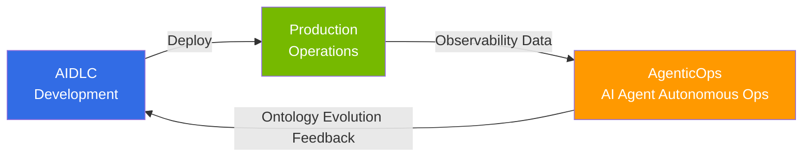

import { CoreTechStack } from '@site/src/components/AiopsIntroTables';

# AgenticOps: AI Agent-Powered Operational Feedback Loops

> **Reading time**: ~3 minutes

AgenticOps is **an approach for autonomously building feedback loops for continuous improvement in production environments using AI agents** after developing software with [AIDLC](/docs/aidlc). While traditional AIOps used AI as a monitoring aid, AgenticOps represents the next step where AI agents autonomously perform **detect → decide → execute** based on observability data.

## Relationship with AIDLC

While AIDLC focuses on **"how to build"** (development methodology), AgenticOps focuses on **"how to operate and improve"** (operational feedback loops). Domain constraints defined by AIDLC's ontology serve as the basis for AI agent operational decisions, and insights discovered during operations feed back as the Outer Loop of ontology evolution.

## Foundation: AWS Open Source Strategy

AWS provides essential Kubernetes ecosystem tools as Managed Add-ons (22+), Community Add-ons Catalog, and managed open source services (AMP, AMG, ADOT). Building on this foundation, **Kiro + MCP (Model Context Protocol)** serve as core AgenticOps tools, autonomously performing EKS cluster control, CloudWatch metric analysis, and cost optimization through AWS MCP servers (50+ GA).

<CoreTechStack />

:::info Learning Path
Read **1 → 2 → 3** in order to follow the complete journey from AgenticOps strategy to autonomous operations.

1. [AgenticOps Strategy Guide](./aiops-introduction.md) — Overall direction and AWS open source strategy
2. [Intelligent Observability Stack](./aiops-observability-stack.md) — Build 3-Pillar + AI analysis data foundation
3. [Predictive Scaling & Auto-Recovery](./aiops-predictive-operations.md) — Achieving autonomous operations
:::

## References

- [Proactive EKS Monitoring with CloudWatch](https://aws.amazon.com/blogs/containers/proactive-amazon-eks-monitoring-with-amazon-cloudwatch-operator-and-aws-control-plane-metrics/)
- [AWS MCP Servers (50+ GA)](https://github.com/awslabs/mcp)
- [Kagent - Kubernetes AI Agent](https://github.com/kagent-dev/kagent)
- [Strands Agents SDK](https://github.com/strands-agents/sdk-python)
