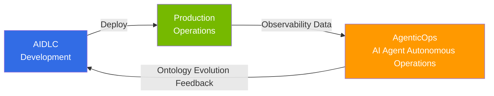

import { CoreTechStack } from '@site/src/components/AiopsIntroTables';

# AgenticOps: AI Agent-Based Operational Feedback Loops

> **Reading time**: ~3 min

AgenticOps is an approach to **autonomously building feedback loops for continuous improvement in production environments through AI agents** after developing software with [AIDLC](/docs/aidlc). While traditional AIOps used AI as a monitoring aid, AgenticOps is the next step where AI agents autonomously perform **detection → judgment → execution** based on observability data.

## Relationship with AIDLC

While AIDLC focuses on **"how to build"** (development methodology), AgenticOps focuses on **"how to operate and improve"** (operational feedback loops). The domain constraints defined by AIDLC's ontology are used by AgenticOps' AI agents as the basis for operational decisions, and insights discovered in operations feed back as the Outer Loop of ontology evolution.

## Core Foundation: AWS Open Source Strategy

AWS provides the Kubernetes ecosystem's core tools as Managed Add-ons (22+), Community Add-ons Catalog, and managed open source services (AMP, AMG, ADOT). On top of this foundation, **Kiro + MCP (Model Context Protocol)** operates as AgenticOps' core tooling, autonomously performing EKS cluster control, CloudWatch metric analysis, and cost optimization through AWS MCP servers (50+ GA).

<CoreTechStack />

:::info Learning Path
Read in order **1 → 2 → 3** to follow the complete journey from AgenticOps strategy formulation to autonomous operations realization.

1. [AgenticOps Strategy Guide](./aiops-introduction.md) — Overall direction and AWS open source strategy
2. [Intelligent Observability Stack](./aiops-observability-stack.md) — Building the data foundation with 3-Pillar + AI analysis
3. [Predictive Scaling and Auto-Remediation](./aiops-predictive-operations.md) — Realizing autonomous operations
:::

## References

- [Proactive EKS Monitoring with CloudWatch](https://aws.amazon.com/blogs/containers/proactive-amazon-eks-monitoring-with-amazon-cloudwatch-operator-and-aws-control-plane-metrics/)
- [AWS MCP Servers (50+ GA individually)](https://github.com/awslabs/mcp)
- [Kagent - Kubernetes AI Agent](https://github.com/kagent-dev/kagent)
- [Strands Agents SDK](https://github.com/strands-agents/sdk-python)
