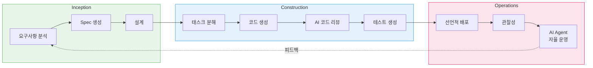
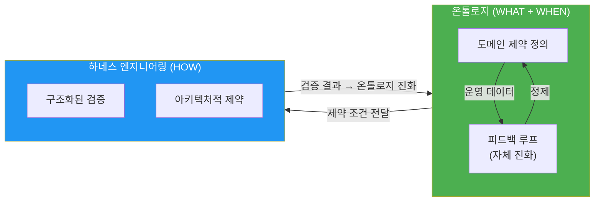
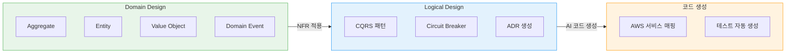
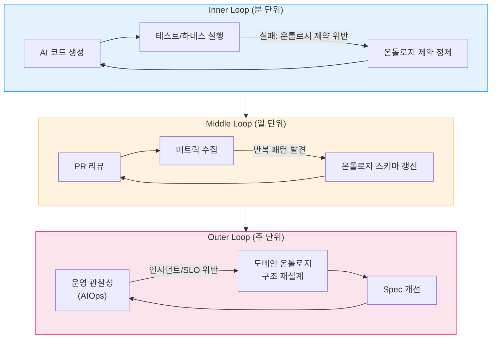
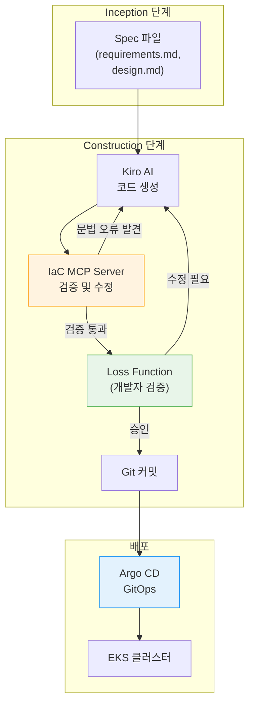
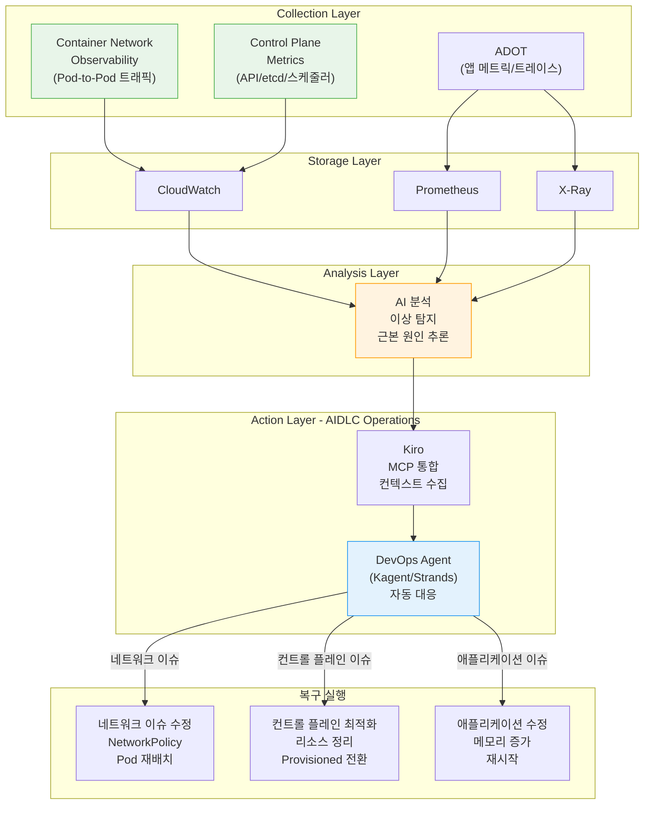
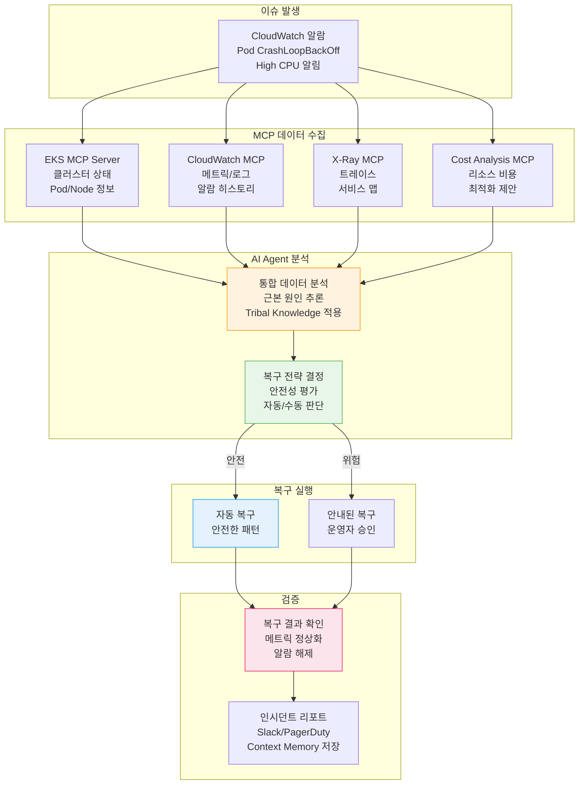
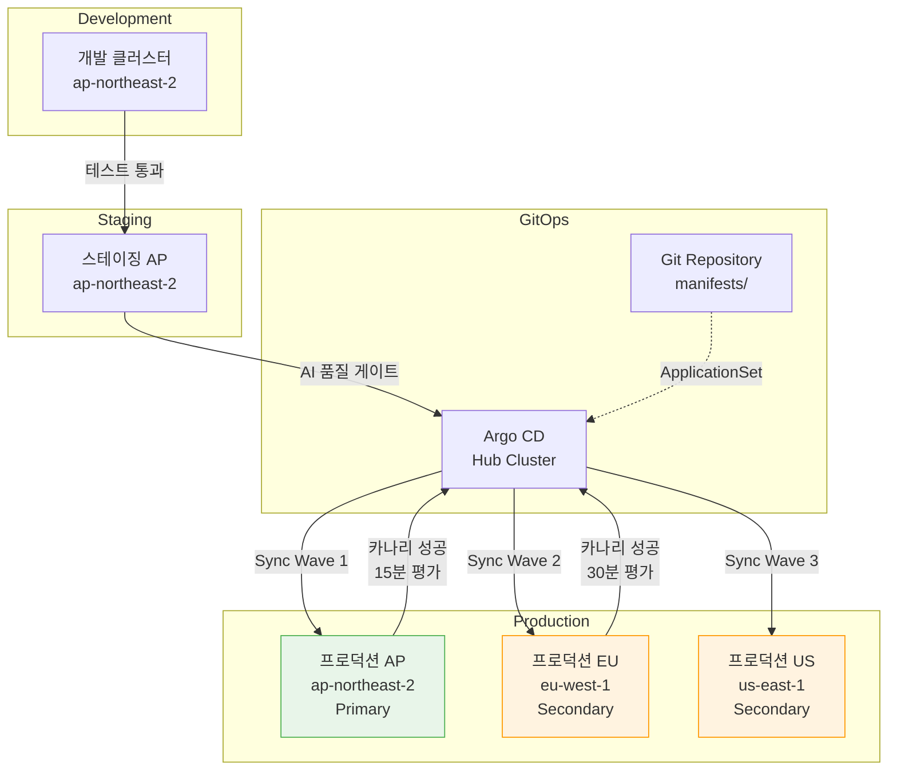

import { AidlcPhaseMapping, EksCapabilities, ProductivityMetrics, AidlcPrinciples, AidlcPhaseActivities, AiCodingAgentComparison, QualityGates, AiAgentEcosystem, DetailedMetrics, AidlcPipeline, AidlcArtifacts } from '@site/src/components/AidlcTables';

# AIDLC Framework — Enhancing AI-Driven Development and Operations in EKS Environments

> 📅 **Created**: 2026-02-12 | **Updated**: 2026-02-14 | ⏱️ **Reading time**: ~39 min

---

## 1. Overview

### 1.1 Why AIDLC

Traditional Software Development Lifecycles (SDLC) were designed with the premise of human-centered long iteration cycles (weekly/monthly). Rituals like daily standups, sprint reviews, and retrospectives are optimized for these long cycles. The advent of AI breaks this premise.

AI performs requirements analysis, task decomposition, code generation, and testing on an **hourly/daily** basis. Retrofitting AI into existing SDLC limits this potential — like building a faster horse-drawn carriage in the automobile era.

**AIDLC (AI-Driven Development Lifecycle)** is a methodology proposed by AWS Labs that reconstructs AI from **First Principles** and integrates it as a core collaborator in the development lifecycle.

```
전통적 SDLC AIDLC
━━━━━━━━━━━━━━ ━━━━━━━━━━━━━━━━━━━
사람이 계획하고 실행 AI가 제안하고, 사람이 검증
주/월 단위 반복 (Sprint) 시간/일 단위 반복 (Bolt)
설계 기법은 팀 선택 DDD/BDD/TDD를 방법론에 내장
역할 사일로 (FE/BE/DevOps) AI로 역할 경계 초월
수동 요구사항 분석 AI가 Intent를 Unit으로 분해
순차적 핸드오프 연속 흐름 + Loss Function 검증
```

### 1.2 Connection to AIOps Strategy

[1. AIOps strategy 가이드](./agentic-ops/aiops-introduction.md)covers the AWS open-source strategy → MCP integration → AI tools → Kiro orchestration as the **technology foundation** for realizing AIDLC. [2. intelligent observability stack](./agentic-ops/aiops-observability-stack.md)built in 3-Pillar + AI analysis layer Operations phase **data based**. This document 그 기술·data based 위 from **development and Operations systematic as 고also화 method론**을 presentation.

```
[1] AIOps 전략 가이드 ──── 기술 기반 (MCP, Kiro, AI Agent)
 │
[2] 지능형 관찰성 스택 ──── 데이터 기반 (ADOT, AMP/AMG, CloudWatch AI)
 │
[3] AIDLC 프레임워크 ── 방법론 (이 문서)
 │
[4] 예측 스케일링 및 자동 복구 ──────── 심화 (ML 예측, 자동 복구, Chaos)
```

:::info Original Reference
AIDLC core concepts are AWS Labs [AI-DLC Method Definition](https://prod.d13rzhkk8cj2z0.amplifyapp.com/)is defined in. This document 해당 method론 EKS environment from 실용 as Implementation 가이드.
:::

---

## 2. AIDLC Core Concepts

### 2.1 Ten Principles

<AidlcPrinciples />

Three that are particularly important in EKS environments:

- **Reverse the Conversation Direction** — AI EKS cluster status MCP collection and, deployment plan 먼저 recommendation. development Google Maps 운before처럼 목지(Intent)를 Configuration and, AI presentation 경 Validation.
- **Integration of Design Techniques** — DDD method론 core 내장 to, AI Business logic Aggregate, Entity, Value Object automatic model링. Scrum from "팀 알아서 optional"던 design 기법 AI-DLC in mandatory 코어.
- **Minimize Stages, Maximize Flow** — handoff 최소화 and 연속 flow implementation. each phase 사람 validation is **Loss Function** role로, 류 before파될 error 조기 blocking.

### 2.2 Core Artifacts

AI-DLC redefines traditional SDLC terms for the AI era.

```
┌─────────┐ ┌─────────┐ ┌─────────┐
│ Intent │───▶│ Unit │───▶│ Bolt │
│ 고수준 목적│ │독립 작업단위│ │빠른 반복 │
│ │ │(DDD Sub- │ │(Sprint │
│비즈니스 목표│ │ domain) │ │ 대체) │
└─────────┘ └─────────┘ └─────────┘
 │
 ┌─────┴─────┐
 ▼ ▼
 ┌──────────┐ ┌──────────┐
 │ Domain │ │ Logical │
 │ Design │ │ Design │
 │비즈니스 로직│ │NFR+패턴 │
 └──────────┘ └──────────┘
 │ │
 └─────┬─────┘
 ▼
 ┌──────────────┐
 │ Deployment │
 │ Unit │
 │컨테이너+Helm+ │
 │ Terraform │
 └──────────────┘
```

<AidlcArtifacts />

:::tip Context Memory and tracking
 all artifact **Context Memory**로 storage AI 라이프사이클 entire from reference. artifact between 양방향 tracking(Domain Model ↔ User Story ↔ test 계획)이 guarantee, AI 항상 정확 맥락 from 작업.
:::

### 2.3 AI-Driven Recursive Workflow

The core of AI-DLC is the **recursive refinement process where AI proposes plans and humans verify**.

```
Intent (비즈니스 목적)
 │
 ▼
AI: Level 1 Plan 생성 ◀──── 사람: 검증 · 수정
 │
 ├─▶ Step 1 ──▶ AI: Level 2 분해 ◀── 사람: 검증
 │ ├─▶ Sub-task 1.1 ──▶ AI 실행 ◀── 사람: 검증
 │ └─▶ Sub-task 1.2 ──▶ AI 실행 ◀── 사람: 검증
 │
 ├─▶ Step 2 ──▶ AI: Level 2 분해 ◀── 사람: 검증
 │ └─▶ ...
 └─▶ Step N ──▶ ...

[모든 산출물 → Context Memory → 양방향 추적성]
```

 each phase 사람 validation is **Loss Function** — error 조기 포착 to 류 before파 prevention. AI 경로별(신규 development, refactoring, 결함 modification) 고정 workflow 규정not 않고, 상황 맞 Level 1 Plan recommendation 유연 approach.

### 2.4 AIDLC Three-Phase Overview

AIDLC consists of three phases: **Inception**, **Construction**, and **Operations**.

<AidlcPhaseMapping />



<AidlcPhaseActivities />

### 2.5 AIDLC Reliability Dual Axis: Ontology x Harness

To systematically ensure the reliability of AI-generated code, AIDLC introduces a dual-axis reliability framework of **ontology** and **harness engineering**.



**Roles of the two axes:**

- **Ontology** — formalized domain knowledge as "typed world model". elevates DDD's Ubiquitous Language to a structured schema that AI can understand. Ontology is not a static schema but a living model that **continuously evolves through its own feedback loop**. Whenever operational data, incidents, or edge cases are discovered, the ontology is refined, improving AI agent behavior.
- **Harness Engineering** — A structure that architecturally validates and enforces the constraints defined by the ontology. "agent 어려운 아니라, harness 어렵다"는 2026year Key Lesson. Harness verification results drive ontology evolution.

**AIDLC three-phase mapping:**

| Phase | ontology (정 + 피드백 loop) | harness (Validation + constraint) |
|------|---------------------------|-------------------|
| **Inception** | Domain ontology definition → Requirements refinement loop via Mob Elaboration | Spec consistency verification harness |
| **Construction** | Code generation constraints → Ontology updates via PR review/metrics | Build/test/security scan harness |
| **Operations** | Operations context model → Ontology evolution via observability data (AIOps → AIDLC) | Runtime guardrails, circuit breakers |

:::info Ontology self-feedback loop
The feedback loop is an **intrinsic property** of the ontology. The ontology evolves across 3 layers:
- **Inner Loop** (Minutes): Test failure → prompt/ontology constraint refinement
- **Middle Loop** (Days): PR review feedback → ontology schema update
- **Outer Loop** (Weeks): Operational incident/SLO violation → domain ontology restructuring

HITL (Human-in-the-Loop) is a **strategic design element** in this evolution process. HITL integration confirmed a 31% accuracy improvement and 67% False Positive reduction.
:::

---

## 3. Inception Phase — From Requirements to Design

### 3.1 Mob Elaboration

The key ritual of Inception is **Mob Elaboration** — A requirements refinement session where Product Owner, developers, and QA collaborate with AI in one room.

```
┌──────────────────────────────────────────────────┐
│ Mob Elaboration 리추얼 │
├──────────────────────────────────────────────────┤
│ │
│ [AI] Intent를 User Story + Unit으로 분해 제안 │
│ ↓ │
│ [PO + Dev + QA] 검토 · 과잉/부족 설계 조정 │
│ ↓ │
│ [AI] 수정 반영 → NFR · Risk 추가 생성 │
│ ↓ │
│ [팀] 최종 검증 → Bolt 계획 확정 │
│ │
├──────────────────────────────────────────────────┤
│ 산출물: │
│ PRFAQ · User Stories · NFR 정의 │
│ Risk Register · 측정 기준 · Bolt 계획 │
└──────────────────────────────────────────────────┘
```

Compresses sequential requirements analysis that took **weeks to months** in traditional methodologies to **hours** by having AI generate drafts and teams review simultaneously.

### 3.2 Kiro Spec-Driven Inception

Kiro Mob Elaboration artifact **Spec 파day**로 체계화. natural language 요구사항 from code entire 과정 structure화.

```
requirements.md → design.md → tasks.md → 코드 생성 → 검증
```

**EKS example: Payment Service Deployment**

`requirements.md`:

```markdown
# Payment Service 배포 요구사항

## 기능 요구사항
- REST API 엔드포인트: /api/v1/payments
- DynamoDB 테이블과 연동
- SQS를 통한 비동기 이벤트 처리

## 비기능 요구사항
- P99 레이턴시: < 200ms
- 가용성: 99.95%
- 자동 스케일링: 2-20 Pod
- EKS 1.35+ 호환
```

`design.md`:

```markdown
# Payment Service 아키텍처

## 인프라 구성
- EKS Deployment (3 replicas min)
- ACK DynamoDB Table (on-demand)
- ACK SQS Queue (FIFO)
- HPA (CPU 70%, Memory 80%)
- Karpenter NodePool (graviton, spot)

## 관찰성
- ADOT sidecar (traces → X-Ray)
- Application Signals (SLI/SLO 자동)
- CloudWatch Logs (/eks/payment-service)

## 보안
- Pod Identity (IRSA 대체)
- NetworkPolicy (namespace 격리)
- Secrets Manager CSI Driver
```

`tasks.md`:

```markdown
# 구현 태스크

## Bolt 1: 인프라
- [ ] ACK DynamoDB Table CRD 작성
- [ ] ACK SQS Queue CRD 작성
- [ ] KRO ResourceGroup 정의 (DynamoDB + SQS 통합)
- [ ] Karpenter NodePool 설정 (graviton, spot)

## Bolt 2: 애플리케이션
- [ ] Go REST API 구현
- [ ] DynamoDB SDK 연동
- [ ] SQS consumer 구현
- [ ] Dockerfile + multi-stage build

## Bolt 3: 배포
- [ ] Helm chart 작성
- [ ] Argo CD Application 정의
- [ ] HPA manifest 작성
- [ ] NetworkPolicy 작성

## Bolt 4: 관찰성
- [ ] ADOT sidecar 설정
- [ ] Application Signals annotation
- [ ] CloudWatch 대시보드
- [ ] SLO 알림 설정
```

:::tip Spec-Driven Core Value
**directing method**: "DynamoDB only들어줘" → "SQSalso needed해" → "이제 deploy it" → 매번 manual 지time, 맥락 loss risk
**Spec-Driven**: Kiro requirements.md Analysis → design.md generation → tasks.md minutes해 → code automatic generation → to validation consistent Context Memory connection
:::

### 3.3 MCP-Based Real-Time Context Collection

Kiro MCP native로, Inception phase from AWS Hosted MCP server through Real-time infrastructure status collection.

```
[Kiro + MCP 상호작용]

Kiro: "EKS 클러스터 상태 확인"
 → EKS MCP Server: get_cluster_status()
 → 응답: { version: "1.35", nodes: 5, status: "ACTIVE" }

Kiro: "비용 분석"
 → Cost Analysis MCP Server: analyze_cost(service="EKS")
 → 응답: { monthly: "$450", recommendations: [...] }

Kiro: "현재 워크로드 분석"
 → EKS MCP Server: list_deployments(namespace="payment")
 → 응답: { deployments: [...], resource_usage: {...} }
```

이 through design.md generation time ** current cluster status and cost 반영 design**가 possible. MCP integration architecture detailed [1. AIOps strategy 가이드](./agentic-ops/aiops-introduction.md)를 Reference.

---

## 4. Construction Phase — From Design to Code

### 4.1 DDD Integration: From Domain Design to Logical Design

AI-DLC from DDD **optional사항 not method론 내장 요소**. AI Business logic automatic as DDD 원칙 according to model링.



**Payment Service example**:

1. **Domain Design** — AI Business logic model링
 - Aggregate: `Payment` (transactionId, amount, status)
 - Entity: `PaymentMethod`, `Customer`
 - Value Object: `Money`, `Currency`
 - Domain Event: `PaymentCreated`, `PaymentCompleted`, `PaymentFailed`

2. **Logical Design** — NFR Application + architecture pattern optional
 - CQRS: 결제 generation(Command) / 조times(Query) minutes리
 - Circuit Breaker: external 결제 이트웨 call
 - ADR: "DynamoDB on-demand vs provisioned" 의사결정 기록

3. **code generation** — AWS service mapping
 - Aggregate → EKS Deployment + DynamoDB Table
 - Domain Event → SQS FIFO Queue
 - Circuit Breaker → Envoy sidecar + Istio

development each phase from AI generation model **Validation·adjustment**. 이 Validation Loss Function role .

### 4.1.1 ontology based development: DDD from type식 ontology로

> "프롬프트 엔지니어링 ontology 엔지니어링이다" — 2026 AI 커뮤니티 컨sensor스

DDD Ubiquitous Language 팀 내 소통 위 ratio-type식 합의. **ontology based development**은 this AI 기계 as 이해 and 준can **type식 스키마(typed world model)**로 격상.

**왜 ontology인가?**

AI agent failure root cause model 약함이나 프롬프트 부정확함 아니라, **architecture 의미 structure(semantic structure)가 없기 when문**. use, 주문, 태스크, 규칙 definition 프롬프트 안 흩어져 있으면 AI 맥락 잃고 환각(hallucination)을 generation.

**Kiro Spec + ontology Integration:**

```yaml
# requirements.md 내 도메인 온톨로지 섹션
domain_ontology:
 aggregates:
 Payment:
 invariants:
 - "amount는 0보다 커야 한다"
 - "status 전이: CREATED → PROCESSING → COMPLETED | FAILED"
 entities:
 - PaymentMethod: { type: "enum", values: ["CARD", "BANK", "WALLET"] }
 - Customer: { attributes: ["customerId", "tier"] }
 value_objects:
 - Money: { currency: "ISO 4217", amount: "decimal(19,4)" }
 domain_events:
 - PaymentCreated: { trigger: "결제 요청 수신", data: ["paymentId", "amount"] }
 - PaymentCompleted: { trigger: "PG 승인 완료" }
 - PaymentFailed: { trigger: "PG 거부 또는 타임아웃" }
 relationships:
 - "Payment CONTAINS PaymentMethod (1:1)"
 - "Customer INITIATES Payment (1:N)"
 constraints:
 - "동일 Customer의 동시 결제는 최대 3건"
 - "FAILED 상태에서 재시도는 최대 2회"
```

이 ontology AI agent **컨텍스트 윈also우 injection**:
1. code generation time 엔티티 관계 and non-변 condition(invariant)을 automatic 준
2. test generation time also메인 event before 경 based as 경계 케이스 automatic also출
3. code review time ontology 위반(example: 금액 음인 결제 generation)을 automatic detection

:::tip Knowledge Graph and connection
ontology Knowledge Graph 구체화if SemanticForge pattern Applicationcan — Knowledge Graph constraint satisfaction harness role to AI generation code 논리/structure 환각 원천 blocking.
:::

:::caution Practical Lesson: 공식 documentonly으 shortage다
ontology build time **공식 document(Official Documentation)only Referenceif AI "논리 as 그럴듯 inference"을 "Validation 사실"로 혼동**. actual case:

- **issue**: AWS EKS Auto Mode 공식 document "AWS GPU 드라이버 Management다"고 기술 → AI "GPU Operator installation impossible"로 ratio약 → ratio교표, architecture, Recommendations before체 오염
- **cause**: actual Implementation 레포([awslabs/ai-on-eks PR #288](https://github.com/awslabs/ai-on-eks/pull/288))를 Verificationnot 않고 공식 document day반론only as inference
- **result**: "기술 non-possible"이라 잘못 before제 document before체 before파 12 abnormal ratio교표 and architecture Recommendations 모두 틀림

**ontology inclusionmust knowledge source 계층:**

| Priority | Source | Example | Reliability |
|---------|------|------|--------|
| 1 | ** actual Implementation code/PR** | awslabs/ai-on-eks, Helm chart sourcecode | 최고 — actual behavior code |
| 2 | **프로젝트 GitHub 이슈/릴리스** | NVIDIA/KAI-Scheduler, ai-dynamo/dynamo | high — development between 사실 교환 |
| 3 | **공식 document** | docs.nvidia.com, docs.aws.amazon.com | intermediate — day반론, 업데이트 delay possible |
| 4 | **블log/튜토리얼** | Medium, AWS Blog | 낮음 — 특정 time점 스냅샷 |

**원칙**: AI generation 기술 document 반드time ** actual Implementation code and 교차 Validation(cross-validation)**must . 공식 document "cannot다"는 "아직 document화되지 않았다"day .
:::

#### Ontology Feedback Loop: A Living Model

ontology 번 definitionif 끝나 정 스키마 아닙. **Operations data and development 경험 through continuous as evolution** 살아있 model. 이 체 피드백 loop AIDLC 신뢰 root as guarantee.



| Loop | Cycle | Trigger | Ontology Change |
|------|------|--------|-------------|
| **Inner** | Minutes | test failure, harness 위반 | constraint condition additional/modification (example: 누락 invariant 발견) |
| **Middle** | Days | PR review from repetitive pattern | 엔티티/관계 스키마 renewal (example: new Value Object additional) |
| **Outer** | Weeks | Operations incident, SLO 위반 | also메인 model structure re-design (example: Aggregate 경계 re-definition) |

:::info HITL ontology evolution Core 메커니즘
HITL(Human-in-the-Loop)을 autonomous 과also기 not **ontology evolution strategy design 요소**로 배치. HITL integration confirmed a 31% accuracy improvement and 67% False Positive reduction. 피드백 loop without Operationsif ML model 90%가 production reachingnot 못.

**case**: 피드백 loop 미Application time $28K cost errorrate 8.3%→7.9% 미미 improvement. structure화 ontology 피드백 loop Application time 31day only errorrate 1.2% reduction.
:::

**References:**
- [Why Ontology Matters for Agentic AI in 2026](https://kenhuangus.substack.com/p/why-ontology-matters-for-agentic) — Ken Huang & Bhavya Gupta
- [Why AI Agents Fail Without Ontologies](https://medium.com/@itznihal/why-ai-agents-fail-without-ontologies-production-lessons-beb9fe9c3af9) — Nihal Parmar, 2026.03
- [SemanticForge: Knowledge Graph based 환 each prevention](https://arxiv.org/html/2511.07584v1)
- [How to Build an AI Agent Feedback Loop](https://www.braincuber.com/blog/how-to-build-feedback-loop-ai-agent-improvement) — Braincuber, 2026.03
- [Human-in-the-Loop in Agentic AI](https://atalupadhyay.wordpress.com/2026/03/16/human-in-the-loop-in-agentic-ai/) — 2026.03

### 4.2 Mob Construction

Construction Core ritual **Mob Construction**. 팀 방 모여 각 Unit development and, Domain Design phase from generation Integration 사양(Integration Specification)을 교환.

```
[Mob Construction 흐름]

Team A: Payment Unit Team B: Notification Unit
 │ │
 ├─ Domain Design 완료 ├─ Domain Design 완료
 │ │
 └────── 통합 사양 교환 ──────┘
 (Domain Event 계약)
 │ │
 ├─ Logical Design ├─ Logical Design
 ├─ 코드 생성 ├─ 코드 생성
 ├─ 테스트 ├─ 테스트
 └─ Bolt 전달 └─ Bolt 전달
```

 each Unit 느슨 combination **병렬 development**이 possible and, Domain Event through Integration. AI Integration testalso automatic generation.

:::warning Brown-field ( existing system) approach
 existing system feature additional나 refactoring perform case, Construction phase **additional 스텝**이 needed:

1. AI existing code **time맨틱 model 역공학** (code → model 승격)
 - **Static Model**: 컴포넌트, 책임, 관계
 - **Dynamic Model**: major 유스케이스 컴포넌트 상호작용
2. development 역공학 model Validation·modification
3. 이after Green-field and the same Construction flow 진행

이 through AI existing system 맥락 정확히 파악 status from change perform.
:::

### 4.3 AI Coding Agents

AIDLC Construction phase from utilization AI 코딩 agent들. Amazon Q Developer and Kiro **Anthropic Claude** model use and, Kiro 오픈 웨이트 modelalso Support to Cost Optimization and 특 also메인 extension possible.

<AiCodingAgentComparison />

#### 4.3.4 Amazon Q Developer — Real-time code build and test (2025)

AWS 2025year 2monthly **Amazon Q Developer Real-time code execution feature**을 announcement했. this is AI code generation after **automatic as build and test execution to result Validation** 뒤 development에 presentation 혁신 approach. AIDLC Construction phase from **Loss Function 조기 작동**time켜 error 류 before파not 않 Core 메커니즘.

**Real-time code execution feature**

Traditional인 AI 코딩 tool code generation after development manual as build·testmust 했. Q Developer 이 과정 Automation to **code generation → automatic build → test execution → result Validation → development review** 폐쇄 loop implementation.

```
기존 방식:
 AI 코드 생성 → 개발자 수동 빌드 → 개발자 수동 테스트 → 오류 발견 → AI에게 피드백 → 재생성
 (반복 주기: 5-10분)

Q Developer 실시간 실행:
 AI 코드 생성 → 자동 빌드 → 자동 테스트 → 결과 검증 → (오류 시 자동 수정 재시도) → 개발자 리뷰
 (반복 주기: 1-2분, 개발자 개입 최소화)
```

**Core 메커니즘**

1. **automatic build pipeline**
 - Q Developer code change after 프로젝트 build tool(Maven, Gradle, npm, pip 등)를 automatic execution
 - 컴파day error, dependency 충돌 immediately detection
 - build failure time error 메time지 Analysis to automatic as code modification re-timealso

2. **test automatic execution**
 - 유닛 test, Integration test automatic as execution
 - test failure time failure cause Analysis to code or test modification
 - existing test coverage maintenance and 새 code additional

3. **development review before Validation**
 - development code 받 when **이미 build and test 통과 status**
 - development Business logic and design 검토 focus (Loss Function role)
 - "code 작동가?"가 not "올바른 code인가?"를 Validation

**security scan automatic modification recommendation**

Q Developer Kubernetes YAML and application code security vulnerability automatic as scan and modification recommendation provides.

**Kubernetes YAML security scan**

1. **Root permission detection**
 - `runAsUser: 0` or `runAsNonRoot: false` detection
 - recommendation: `runAsUser: 1000`, `runAsNonRoot: true`

2. **Privileged container detection**
 - `securityContext.privileged: true` detection
 - recommendation: required capabilitiesonly 명time as additional (example: `NET_ADMIN`)

3. **미Configuration securityContext detection**
 - Pod/Container `securityContext`가 없 case 경고
 - recommendation: 최소 permission 원칙 따른 securityContext additional

**automatic modification recommendation example**

```yaml
# Q Developer가 감지한 문제
apiVersion: v1
kind: Pod
metadata:
 name: payment-pod
spec:
 containers:
 - name: payment
 image: payment:v1
 securityContext:
 runAsUser: 0 # ⚠️ Root 권한 사용
 privileged: true # ⚠️ Privileged 모드

# Q Developer가 제안하는 수정
apiVersion: v1
kind: Pod
metadata:
 name: payment-pod
spec:
 securityContext:
 runAsNonRoot: true
 runAsUser: 1000
 fsGroup: 1000
 seccompProfile:
 type: RuntimeDefault
 containers:
 - name: payment
 image: payment:v1
 securityContext:
 allowPrivilegeEscalation: false
 readOnlyRootFilesystem: true
 capabilities:
 drop:
 - ALL
 add:
 - NET_BIND_SERVICE # 필요한 capabilities만 추가
```

**AIDLC Construction phase Integration**

Q Developer Real-time execution and security scan Construction phase **Quality Gate Automation** to AIDLC Fast iteration 주기(Bolt)를 실현.

1. **Quality Gate from Q Developer security scan automatic execution**
 - Kiro code generation when Q Developer security scan pipeline Integration
 - Kubernetes manifest, Dockerfile, application code automatic scan
 - vulnerability 발견 time modification recommendation development에 presentation (Loss Function)

2. **CI/CD pipeline Q Developer Validation phase additional**
 - PR generation time GitHub Actions/GitLab CI from Q Developer scan execution
 - build·test automatic execution as "code 작동함"을 guarantee
 - security scan as "code safety함"을 guarantee
 - development "code 올바름"only Validation (role minutes리)

**Integration workflow example**

```yaml
# .github/workflows/aidlc-construction.yml
name: AIDLC Construction Quality Gate
on:
 pull_request:
 types: [opened, synchronize]

jobs:
 q-developer-validation:
 runs-on: ubuntu-latest
 steps:
 - uses: actions/checkout@v4

 # 1. Q Developer 보안 스캔
 - name: Q Developer Security Scan
 uses: aws/amazon-q-developer-action@v1
 with:
 scan-type: security
 source-path: .
 auto-fix: true # 자동 수정 제안 적용

 # 2. 실시간 빌드 및 테스트
 - name: Q Developer Build & Test
 uses: aws/amazon-q-developer-action@v1
 with:
 action: build-and-test
 test-coverage-threshold: 80

 # 3. Kubernetes manifest 검증
 - name: K8s Manifest Security Check
 run: |
 # Q Developer가 제안한 수정이 적용되었는지 확인
 kube-linter lint deploy/ --config .kube-linter.yaml

 # 4. 통과 시에만 Argo CD 동기화 허용
 - name: Approve for GitOps
 if: success()
 run: echo "Quality Gate passed. Ready for Argo CD sync."
```

** actual 효 and — 피드백 loop 단축**

```
전통적 Construction 단계:
 [개발자] 코드 작성 (30분)
 → [개발자] 수동 빌드 (2분)
 → [개발자] 수동 테스트 (5분)
 → [개발자] 오류 발견 (10분 디버깅)
 → [개발자] 코드 수정 (20분)
 → 반복...
 총 소요 시간: 2-3시간

Q Developer 실시간 실행:
 [AI] 코드 생성 (1분)
 → [AI] 자동 빌드·테스트 (30초)
 → [AI] 오류 감지 및 자동 수정 (1분)
 → [개발자] Loss Function 검증 (10분)
 → [Argo CD] 자동 배포
 총 소요 시간: 15-20분
```

:::tip AIDLC from Q Developer value
Q Developer Real-time execution AIDLC Core 원칙인 **"Minimize Stages, Maximize Flow"**를 implementation. code generation → build → test → Validation each phase Automation to handoff removal and, development **의사결정(Loss Function)**에only focus. 이것 existing SDLC 주/monthly 단위 주기 AIDLC time/Days 주기 단축 Core 메커니즘.
:::

**References**

- [AWS DevOps Blog: Enhancing Code Generation with Real-Time Execution in Amazon Q Developer](https://aws.amazon.com/blogs/devops/enhancing-code-generation-with-real-time-execution-in-amazon-q-developer/) (2025-02-06)
- AWS re:Invent 2025 EKS Research — Section 13.4 Reference

### 4.4 Declarative Automation Based on EKS Capabilities

EKS Capabilities(2025.11)는 인기 있 open-source tool AWS managed as Provision to, Construction phase artifact declarative as Deployment.

<EksCapabilities />

#### 4.4.1 Managed Argo CD — GitOps

Managed Argo CD GitOps AWS infrastructure from managed as Operations. Kiro generation code Git 푸timeif automatic as EKS Deployment. Application CRD single environment을, ApplicationSet as multi environment(dev/staging/production)을 declarative as Management.

#### 4.4.2 ACK — AWS resource declarative Management

ACK 50+ AWS service K8s CRD declarative as Management. Kiro generation Domain Design infrastructure 요소(DynamoDB, SQS, S3 등)를 `kubectl apply`로 Deployment and, Argo CD GitOps workflow 연스럽 Integration.

:::info ACK Core Value
ACK useif **cluster external AWS resourcealso K8s declarative model Management** . DynamoDB, SQS, S3, RDS etc. K8s CRD generation/modification/deletion and, 이것 "K8s 중심 as all infrastructure declarative as Management" strategy.
:::

#### 4.4.3 KRO — 복합 resource orchestration

KRO multiple K8s resource ** single Deployment 단위(ResourceGroup)**로 묶. AIDLC Deployment Unit 념 and directly mapping, Deployment + Service + HPA + ACK resource 나 Custom Resource generation.

#### 4.4.4 LBC v3 Gateway API

AWS Load Balancer Controller v3 Gateway API GA transition and L4(NLB) + L7(ALB) routing, QUIC/HTTP3, JWT Validation, 헤더 변환 provides. Gateway + HTTPRoute CRD traffic declarative as Management.

#### 4.4.5 LBC v3 Gateway API — 고급 feature detailed

AWS Load Balancer Controller v3 Gateway API Support Kubernetes standard traffic Management API through powerful L4/L7 routing feature provides. this is AIDLC Construction phase from Kiro Spec 네트워킹 요구사항 declarative as Implementation Core tool.

**Gateway API v1.4 + LBC v2.14+ Support scope**

Gateway API role 지향(role-oriented) design infrastructure Operations, cluster Operations, application development 각 책임 scope from traffic Managementcan .

1. **L4 Routes — TCPRoute, UDPRoute, TLSRoute (NLB, v2.13.3+)**
 - **TCPRoute**: TCP based application routing (example: PostgreSQL, Redis, gRPC with TCP)
 - **UDPRoute**: UDP based 프로토콜 routing (example: DNS, QUIC, 임 server)
 - **TLSRoute**: SNI(Server Name Indication) based TLS routing
 - Network Load Balancer(NLB)로 provisioning되며, high 처리량 and low delay time guarantee
 - example: multi-tenant database cluster from SNI based 샤드 routing

2. **L7 Routes — HTTPRoute, GRPCRoute (ALB, v2.14.0+)**
 - **HTTPRoute**: 경로, 헤더, query 파라미터 based HTTP/HTTPS routing
 - **GRPCRoute**: gRPC 메서드 이름 based routing, gRPC-specific 헤더 Management
 - Application Load Balancer(ALB)로 provisioning되며, 콘텐츠 based routing Support
 - example: `/api/v1/*` → v1 service, `/api/v2/*` → v2 service (canary Deployment)

3. **QUIC 프로토콜 Support (HTTP/3 on NLB)**
 - HTTP/3(QUIC) 프로토콜 NLB from native Support
 - UDP based as TCP head-of-line blocking issue 해결
 - 모바day network environment from connection 마이그레이션(connection migration) Support
 - example: Real-time ratio디오 streaming, 임 server, 저delay API

**JWT Validation feature**

Gateway API v1.4 **Gateway 레벨 from JWT(JSON Web Token) Validation**을 support. 이 through 인증 로직 backend service from minutes리 to 부 reductiontime킵.

- **인증 policy definition**: Gateway JWT Validation 규칙 declarative (발급, 공 키, 클레임 Validation)
- **backend 부 reduction**: ALB/NLB from JWT Validation to 유효not 않 request 조기 blocking
- **중앙화 인증**: multiple service 공통 인증 policy re-use
- **example**: Payment Service `/api/v1/payments` 경 from `iss=https://auth.example.com`, `aud=payment-api` Validation

**헤더 변환**

HTTPRoute request and response 헤더 dynamic as additional·modification·deletion .

- **RequestHeaderModifier**: backend before달되기 before request 헤더 조작
 - example: `X-User-ID` 헤더 additional (JWT 클레임 from 추출 use ID)
 - example: `X-Forwarded-Proto: https` 강제 (backend 프록time 뒤 있 when)
- **ResponseHeaderModifier**: 클라이언트 response기 before response 헤더 조작
 - example: `X-Frame-Options: DENY` additional (security 헤더)
 - example: `Server` 헤더 removal (정보 노출 prevention)

**AIDLC Construction phase from utilization**

Gateway API Kiro Spec from definition 네트워킹 요구사항 GitOps workflow automatic Deployment Core tool.

1. **Kiro Spec from API routing 요구사항 definition**
 - `requirements.md` from "canary Deployment 10% traffic v2 routing" such as 요구사항 명time
 - `design.md` from Gateway API use routing strategy design
 - Kiro HTTPRoute manifest automatic generation

2. **Gateway API CRD declarative traffic Management**
 - Git commit 번 as Gateway, GatewayClass, HTTPRoute Deployment
 - Argo CD change 사항 automatic as EKS 동기화
 - LBC ALB/NLB provisioning and routing 규칙 Application

3. **canary/블루-그린 Deployment strategy Automation**
 - HTTPRoute `weight` 필드 traffic distributed ratiorate adjustment
 - example: v1 service 90%, v2 service 10% → gradual as v2 100%로 increase
 - CloudWatch Application Signals each 버before SLO Monitoring
 - AI Agent SLO 위반 time automatic as rollback (Operations phase Integration)

**Gateway, GatewayClass, HTTPRoute YAML example**

```yaml
# gatewayclass.yaml — 인프라 운영자가 정의
apiVersion: gateway.networking.k8s.io/v1
kind: GatewayClass
metadata:
 name: aws-alb
spec:
 controllerName: gateway.alb.aws.amazon.com/controller
 description: "AWS Application Load Balancer"
---
# gateway.yaml — 클러스터 운영자가 정의
apiVersion: gateway.networking.k8s.io/v1
kind: Gateway
metadata:
 name: payment-gateway
 namespace: production
 annotations:
 gateway.alb.aws.amazon.com/scheme: internet-facing
 gateway.alb.aws.amazon.com/tags: Environment=production,Service=payment
spec:
 gatewayClassName: aws-alb
 listeners:
 - name: https
 protocol: HTTPS
 port: 443
 tls:
 mode: Terminate
 certificateRefs:
 - name: payment-tls-cert
 kind: Secret
 allowedRoutes:
 namespaces:
 from: Selector
 selector:
 matchLabels:
 gateway-access: enabled
---
# httproute.yaml — 애플리케이션 개발자가 정의
apiVersion: gateway.networking.k8s.io/v1
kind: HTTPRoute
metadata:
 name: payment-api-route
 namespace: production
spec:
 parentRefs:
 - name: payment-gateway
 namespace: production
 sectionName: https
 rules:
 # 카나리 배포: v1 90%, v2 10%
 - matches:
 - path:
 type: PathPrefix
 value: /api/v1/payments
 backendRefs:
 - name: payment-service-v1
 port: 8080
 weight: 90
 - name: payment-service-v2
 port: 8080
 weight: 10
 filters:
 # JWT 검증 (Gateway API v1.4)
 - type: RequestHeaderModifier
 requestHeaderModifier:
 add:
 - name: X-User-ID
 value: "{jwt.sub}" # JWT 클레임에서 추출
 # 보안 헤더 추가
 - type: ResponseHeaderModifier
 responseHeaderModifier:
 add:
 - name: X-Frame-Options
 value: DENY
 - name: X-Content-Type-Options
 value: nosniff
 remove:
 - Server # 서버 정보 노출 방지
---
# grpcroute.yaml — gRPC 서비스 라우팅
apiVersion: gateway.networking.k8s.io/v1alpha2
kind: GRPCRoute
metadata:
 name: payment-grpc-route
 namespace: production
spec:
 parentRefs:
 - name: payment-gateway
 rules:
 - matches:
 - method:
 service: payment.v1.PaymentService
 method: CreatePayment
 backendRefs:
 - name: payment-grpc-service
 port: 9090
```

:::tip Gateway API and Ingress ratio교
**Ingress**는 single resource all routing 규칙 definition to, infrastructure Operations and development 책임 혼re-. **Gateway API**는 GatewayClass(infrastructure), Gateway(cluster), HTTPRoute(application)로 role minutes리 to, each 팀 independent as 작업 . AIDLC **Loss Function** 념 and day치 — each 레이어 from Validation to error before파 prevention.
:::

**References**

- [Kubernetes Gateway API v1.4 Release](https://kubernetes.io/blog/2025/11/06/gateway-api-v1-4/) (2025-11-06)
- [AWS Load Balancer Controller — Gateway API Docs](https://kubernetes-sigs.github.io/aws-load-balancer-controller/latest/guide/gateway/gateway/)
- [Kubernetes Gateway API in Action (AWS Blog)](https://aws.amazon.com/blogs/containers/kubernetes-gateway-api-in-action/)
- AWS re:Invent 2025 EKS Research — Section 3.5 Reference

#### 4.4.6 Node Readiness Controller — declarative node readiness status Management

**Node Readiness Controller(NRC)**는 Kubernetes node workload 용기 before 충족must condition declarative as definition 컨트롤러. this is AIDLC Construction phase from infrastructure 요구사항 code 표현 and, GitOps through automatic as Application Core tool.

**Core Concepts**

NRC `NodeReadinessRule` CRD through node "Ready" status transition되기 before only족must condition definition. Traditional as node readiness status kubelet automatic as 결정했지only, NRC useif **per application 요구사항 infrastructure 레이어 declarative as injection** .

- **declarative policy**: `NodeReadinessRule`로 node readiness condition YAML definition
- **GitOps 호환**: Argo CD through node readiness policy 버before Management and automatic Deployment
- **workload 보호**: mandatory DaemonSet(CNI, CSI, security agent)이 readiness될 when scheduling blocking

**AIDLC each phase from utilization**

| Phase | NRC role | Example |
|------|----------|------|
| **Inception** | AI workload 요구사항 Analysis → required NodeReadinessRule automatic 정 | "GPU workload NVIDIA device plugin readiness after에only scheduling" |
| **Construction** | NRC 규칙 Helm chart inclusion, Terraform EKS Blueprints AddOn as Deployment | Kiro `NodeReadinessRule` manifest automatic generation |
| **Operations** | NRC 런타임 node readiness automatic Management, AI 규칙 효 and Analysis | CloudWatch Application Signals node readiness delay time tracking |

**Infrastructure as Code 관점**

NRC AIDLC "infrastructure code로, infrastructurealso test" 원칙 node level extension.

1. **GitOps based policy Management**
 - `NodeReadinessRule` CRD Git 리포지토리 storage
 - Argo CD automatic as EKS cluster 동기화
 - policy change time Git commit 번 as entire cluster Application

2. **Kiro + MCP Automation**
 - Kiro Inception phase `design.md` from workload 요구사항 parsing
 - EKS MCP Server through current cluster DaemonSet status Verification
 - required `NodeReadinessRule`을 automatic generation to IaC 리포지토리 additional

3. **Terraform EKS Blueprints Integration**
 - NRC 컨트롤러 EKS Blueprints AddOn as declarative installation
 - Helm values through default policy Configuration Automation
 - multi cluster environment from consistent node readiness policy Application

**Quality Gate Integration**

AIDLC Quality Gate phase from NRC Deployment before node readiness status Validation tool utilization.

- **Deployment before Dry-run**: NRC 규칙 Application했 when existing workload 미치 impact time뮬레이션
- **CI/CD pipeline Validation**: GitHub Actions/GitLab CI from `kubectl apply --dry-run` + NRC 규칙 유효 검사
- **Loss Function as role**: 잘못 node readiness policy production Deployment되기 before blocking

**YAML example: GPU workload용 NodeReadinessRule**

```yaml
apiVersion: node.k8s.io/v1alpha1
kind: NodeReadinessRule
metadata:
 name: gpu-node-readiness
 namespace: kube-system
spec:
 # GPU 노드에만 적용
 nodeSelector:
 matchLabels:
 node.kubernetes.io/instance-type: p4d.24xlarge
 # 다음 데몬셋이 모두 Ready 상태일 때까지 노드를 Ready로 전환하지 않음
 requiredDaemonSets:
 - name: nvidia-device-plugin-daemonset
 namespace: kube-system
 - name: gpu-feature-discovery
 namespace: kube-system
 - name: dcgm-exporter
 namespace: monitoring
 # 타임아웃: 10분 내에 조건이 충족되지 않으면 노드를 NotReady로 유지
 timeout: 10m
```

**Practical Use Cases**

| Scenario | NRC 규칙 | Effect |
|----------|----------|------|
| **Cilium CNI cluster** | Cilium agent Readyday when 대기 | network initial화 before Pod scheduling prevention |
| **GPU cluster** | NVIDIA device plugin + DCGM exporter readiness 대기 | GPU resource 노출 before workload scheduling blocking |
| **security enhancement environment** | Falco, OPA Gatekeeper readiness 대기 | security policy Application before workload execution prevention |
| **스토리지 workload** | EBS CSI driver + snapshot controller readiness 대기 | 볼륨 마운트 failure prevention |

**Terraform EKS Blueprints AddOn example**

```hcl
module "eks_blueprints_addons" {
 source = "aws-ia/eks-blueprints-addons/aws"

 cluster_name = module.eks.cluster_name
 cluster_endpoint = module.eks.cluster_endpoint

 enable_node_readiness_controller = true
 node_readiness_controller = {
 namespace = "kube-system"
 values = [
 yamlencode({
 defaultRules = {
 cilium = {
 enabled = true
 daemonSets = ["cilium"]
 }
 gpuNodes = {
 enabled = true
 nodeSelector = {
 "node.kubernetes.io/instance-type" = "p4d.24xlarge"
 }
 daemonSets = ["nvidia-device-plugin-daemonset", "dcgm-exporter"]
 }
 }
 })
 ]
 }
}
```

:::tip NRC + AIDLC time너지
Node Readiness Controller AIDLC **"infrastructure 요구사항 declarative as 표현 and automatic as Validation"** 원칙 node level extension. Kiro Inception phase from workload 요구사항 Analysis to automatic as `NodeReadinessRule`을 generation and, Argo CD this GitOps Deployment and, Operations phase from AI Agent node readiness status abnormal automatic as detection·response.
:::

**References**

- [Kubernetes Blog: Introducing Node Readiness Controller](https://kubernetes.io/blog/2026/02/03/introducing-node-readiness-controller/) (2026-02-03)
- [Node Readiness Controller GitHub Repository](https://github.com/kubernetes-sigs/node-readiness-controller)

:::tip EKS Capabilities + AIDLC time너지
Managed Argo CD(Deployment) + ACK(infrastructure) + KRO(orchestration) + LBC v3(네트워킹) + NRC(node readiness)가 combinationwhen, Kiro Spec from generation all artifact **Git Push 번 as entire stack Deployment**가 possible. 이것 Construction → Operations transition Core.
:::

### 4.5 MCP-Based IaC Automation Pipeline

Kiro and AWS Hosted MCP server combinationif, Inception Spec from Construction IaC automatic as generation and Argo CD Deployment.

<AidlcPipeline />

#### 4.5.3 AWS IaC MCP Server — CDK/CloudFormation AI Support

AWS 2025year 11monthly 28day **AWS Infrastructure as Code (IaC) MCP Server**를 announcement했. this is Kiro CLI and such as AI tool from CloudFormation and CDK document search and, 템플릿 automatic Validation and, Deployment troubleshooting AI Support programmatic interface.

**AWS IaC MCP Server overview**

AWS IaC MCP Server Model Context Protocol through following feature Provision:

- **document search**: CloudFormation resource 타입, CDK 구문, 모범 case Real-time as search
- **템플릿 Validation**: IaC 템플릿 문법 error automatic as detection and modification recommendation
- **Deployment troubleshooting**: stack Deployment failure time root cause Analysis and 해결 method presentation
- **programmatic approach**: Kiro, Amazon Q Developer etc. AI tool and native Integration

**AIDLC Construction phase Integration**

AIDLC Construction phase from IaC MCP Server following and 같 utilization:

1. **Kiro Spec → IaC code generation Validation**
 - Inception phase from generation `design.md`를 based as Kiro CDK/Terraform/Helm code generation
 - IaC MCP Server generation code 문법, resource constraint, security policy 준 automatic Validation
 - CloudFormation 템플릿 case resource 타입 오타, 순환 종속, 잘못 속 preemptive detection

2. **CloudFormation 템플릭 문법 error automatic modification**
 - Deployment before 템플릿 정 Analysis to error pattern identification
 - example: `Properties` 오타 → `Properties`, 잘못 인트린직 함 → 올바른 함 recommendation
 - modification recommendation Kiro automatic as Application거나 development에 Loss Function Validation request

3. ** existing infrastructure and 호환 preemptive Validation**
 - EKS MCP Server, Cost Analysis MCP and Integration to current cluster status Analysis
 - new IaC code existing resource(VPC, subnet, security 그룹)와 충돌not 않는지 Validation
 - example: DynamoDB 테이블 generation time existing 테이블 and 이름 중복 체크, VPC endpoint re-use possible whether Verification

**code example: Kiro from IaC MCP Server utilization workflow**

```bash
# 1. IaC MCP Server 활성화
kiro mcp add aws-iac

# 2. Spec 파일에서 IaC 코드 생성
kiro generate --spec requirements.md --output infra/

# 3. IaC MCP Server가 자동으로 실행되는 검증 과정
# - CloudFormation 템플릿 문법 체크
# - CDK construct 호환성 검증
# - 리소스 제약 조건 확인 (예: DynamoDB on-demand vs provisioned)

# 4. 검증 결과 확인
kiro verify --target infra/

# 출력 예시:
# ✓ CloudFormation syntax valid
# ⚠ Warning: DynamoDB table 'payments' uses on-demand billing (estimated $150/month)
# ✓ VPC endpoint 'vpce-dynamodb' already exists, reusing
# ✗ Error: Security group 'sg-app' conflicts with existing rule

# 5. 오류 자동 수정
kiro fix --interactive

# IaC MCP Server가 제안하는 수정 사항:
# - Security group rule conflict → 새로운 규칙 ID로 변경
# - 개발자 승인 후 자동 적용

# 6. Argo CD로 배포
git add infra/ && git commit -m "Add Payment Service infrastructure"
git push origin main
# Argo CD가 자동으로 synced → EKS에 배포
```

**Construction phase from Integration flow**



:::tip IaC MCP Server and Kiro time너지
AWS IaC MCP Server Kiro Spec-driven development and combination to infrastructure code 품질 automatic as Validation. `kiro mcp add aws-iac` 명령 as Activationcan으며, generation CloudFormation/CDK code AWS 모범 case automatic as 따르also록 guarantee. this is Construction phase from **IaC error 조기 포착 Loss Function** role .
:::

**References**

- [AWS DevOps Blog: Introducing the AWS IaC MCP Server](https://aws.amazon.com/blogs/devops/introducing-the-aws-infrastructure-as-code-mcp-server-ai-powered-cdk-and-cloudformation-assistance/) (2025-11-28)

---

## 5. Operations Phase — From Deployment to Autonomous Operations

### 5.1 Observability Foundation

Operations phase data based [2. intelligent observability stack](./agentic-ops/aiops-observability-stack.md)built in 5-Layer architecture.

```
[관찰성 스택 → Operations 연결]

Collection Layer (ADOT, CloudWatch Agent, NFM Agent)
 ↓
Transport Layer (OTLP, Prometheus Remote Write)
 ↓
Storage Layer (AMP, CloudWatch, X-Ray)
 ↓
Analysis Layer (AMG, CloudWatch AI, DevOps Guru)
 ↓
Action Layer ← AIDLC Operations가 여기에 위치
 ├── MCP 기반 통합 분석
 ├── AI Agent 자동 대응
 └── 예측 스케일링
```

[2. intelligent observability stack](./agentic-ops/aiops-observability-stack.md)collected from metric·log·traces MCP through AI tool and Agent before달, Operations phase 의사결정 based .

#### 5.1.3 2025-2026 observability 혁신 — AIDLC Operations enhancement

AWS 2025year 11monthly부터 2026year 초 EKS observability 영역 from **두 가지 major 혁신**을 announcement했. this is AIDLC Operations phase **data based 크 enhancement** and, AI Agent network 이슈 and 컨트롤 플레인 issue preemptive as detection and responsecan .

**Container Network Observability (2025year 11monthly 19day)**

AWS **Container Network Observability**를 announcement to EKS cluster network 계층 for 세minutes화 visibility provides. this is existing CloudWatch Container Insights application·container 계층 focus했던 것 보완 to, **network traffic pattern Kubernetes 컨텍스트 and combination**.

**Key Features**

1. **Pod-to-Pod 통신 pattern Analysis**
 - namespace between, service between traffic flow Real-time as time각화
 - microservices architecture dependency 맵 automatic generation
 - example: Payment Service → DynamoDB call pattern, Notification Service and 통신 빈also

2. **Cross-AZ traffic visibility**
 - Availability Zone between data transfer량 and cost tracking
 - Cross-AZ traffic 많 service identification to Cost Optimization 기times Provision
 - example: AZ-a Pod AZ-b DynamoDB endpoint call → monthly $200 non- required cost

3. **network abnormal detection**
 - AI based as 평소 and 다른 traffic pattern automatic detection
 - example: sudden external IP 대량 traffic → potential data 유출 의심
 - example: 특정 Pod connection timealso failurerate spike → NetworkPolicy error or service failure

**AIDLC Operations phase from utilization**

Container Network Observability Operations phase **Collection Layer enhancement** to, AI Agent network 이슈 automatic as identification and responsecan :

- **automatic root cause Analysis**: Pod responsenot 않 when, AI Agent network metric Analysis to "NetworkPolicy 인 traffic blocking"인지 "대상 service failure"인지 automatic decision
- **Cost Optimization recommendation**: Cross-AZ traffic pattern Analysis to "Pod Topology Spread Constraints modification as monthly $500 savings possible" such as 구체 recommendation
- **security abnormal detection**: GuardDuty Extended Threat Detection and 연계 to network 레벨 공격 pattern 조기 detection

**Implementation example: Kiro + MCP through network 이슈 Analysis**

```bash
# Container Network Observability 메트릭을 CloudWatch MCP를 통해 조회
kiro diagnose --issue "payment-service high latency"

# AI Agent의 분석 과정 (내부 동작):
# 1. CloudWatch MCP → Container Network Observability 메트릭 조회
# - payment-service → dynamodb-endpoint: P99 latency 500ms (평소 50ms)
# - Cross-AZ 트래픽 비율: 80% (평소 20%)
#
# 2. EKS MCP → Pod 배치 상태 확인
# - payment-service Pods: 5개 모두 AZ-a에 배치
# - DynamoDB endpoint: AZ-b, AZ-c에만 존재
#
# 3. 근본 원인 추론
# - Pod Topology Spread가 제대로 작동하지 않음
# - 모든 트래픽이 Cross-AZ로 전송 → 네트워크 지연 + 비용 증가
#
# 4. 복구 제안
# - Pod Topology Spread Constraints 수정
# - Karpenter NodePool에 AZ 분산 강제
# - 예상 효과: P99 latency 50ms 회복, 월 $400 비용 절감

# 출력 예시:
# 🔍 네트워크 이슈 탐지: Cross-AZ 트래픽 과다
# 📊 현재 상태: payment-service Pods 100% AZ-a 집중
# 💡 제안: Pod Topology Spread + Karpenter AZ 분산
# 💰 예상 효과: P99 latency 90% 개선, 월 $400 절감
# ❓ 자동 수정을 진행할까요? [Y/n]
```

**CloudWatch Control Plane Metrics (2025year 12monthly 19day)**

AWS **CloudWatch Observability Operator** along with **EKS Control Plane metric**을 announcement했. this is Kubernetes API server, etcd, 스케줄러, 컨트롤러 매니저 헬스 and performance preemptive as Monitoringcan .

**Key Features**

1. **API server delay Monitoring**
 - `kubectl` 명령, Deployment 업데이트, HPA scaling etc. API request delay time tracking
 - example: API server P99 latency 500ms 초과if → cluster 과부 status임 조기 detection

2. **etcd performance tracking**
 - etcd 디스크 동기화 delay, 리더 선출 time, database 크기 Monitoring
 - example: etcd 디스크 delay increaseif → cluster resource(ConfigMap, Secret) 과다 generation 의심

3. **스케줄러 status Monitoring**
 - Pending Pod , scheduling delay time, scheduling failure 이유 tracking
 - example: scheduling failure spikeif → node 용량 shortage or Affinity constraint error

**AIDLC Operations phase from utilization**

CloudWatch Control Plane Metrics **Analysis Layer enhancement** to, AI Agent infrastructure 레벨 issue preemptive as responsecan :

- **preemptive scaling**: API server delay increase 추세 보이면, AI Agent Provisioned Control Plane as 업그레이드 recommendation
- **resource cleanup Automation**: etcd database 크기 threshold reachingif, use되지 않 ConfigMap/Secret automatic identification and cleanup recommendation
- **scheduling Optimization**: Pending Pod cause Analysis to "NodeSelector constraint 너무 엄격함" such as 구체 improvement recommendation

**Implementation example: CloudWatch Observability Operator Configuration**

```yaml
# cloudwatch-operator-config.yaml
apiVersion: v1
kind: ConfigMap
metadata:
 name: cloudwatch-operator-config
 namespace: amazon-cloudwatch
data:
 config.yaml: |
 enableControlPlaneMetrics: true
 controlPlaneMetrics:
 - apiserver_request_duration_seconds
 - apiserver_request_total
 - etcd_disk_backend_commit_duration_seconds
 - etcd_disk_wal_fsync_duration_seconds
 - scheduler_pending_pods
 - scheduler_schedule_attempts_total

 # AI Agent 통합 설정
 alerting:
 - metric: apiserver_request_duration_seconds_p99
 threshold: 500ms
 action: trigger_ai_agent_analysis
 context: |
 API 서버 지연이 증가하고 있습니다.
 AI Agent가 근본 원인을 분석하고 대응 방안을 제안합니다.

 - metric: etcd_mvcc_db_total_size_in_bytes
 threshold: 8GB
 action: trigger_ai_agent_cleanup
 context: |
 etcd 데이터베이스 크기가 임계값에 근접했습니다.
 AI Agent가 정리 가능한 리소스를 식별합니다.
```

**Operations phase from Integration: Kiro + DevOps Agent automatic response**

Container Network Observability and Control Plane Metrics **Kiro + DevOps Agent(Kagent/Strands)**가 observability data based as automatic response pattern possible :



** actual scenario: Integration response workflow**

```bash
# 시나리오 1: 네트워크 이슈 자동 탐지 및 수정
# [15:00] Container Network Observability: Cross-AZ 트래픽 급증
# [15:01] Kiro + EKS MCP: Pod 배치 상태 분석
# [15:02] AI Agent 판단: Pod Topology Spread 오류
# [15:03] 자동 수정: Deployment에 topologySpreadConstraints 추가
# [15:10] 검증: Cross-AZ 트래픽 80% → 20% 감소, P99 latency 90% 개선

# 시나리오 2: 컨트롤 플레인 성능 저하 선제 대응
# [09:00] Control Plane Metrics: API 서버 P99 latency 증가 추세
# [09:05] Kiro 분석: 현재 300ms, 10분 후 500ms 도달 예상
# [09:10] AI Agent 제안: Provisioned Control Plane(XL tier)로 전환
# [09:11] 운영자 승인 (Slack 버튼 클릭)
# [09:30] 전환 완료: API 서버 latency 50ms로 안정화

# 시나리오 3: etcd 용량 관리 자동화
# [18:00] Control Plane Metrics: etcd DB 크기 7.5GB (임계값 8GB)
# [18:05] Kiro + EKS MCP: 미사용 리소스 스캔
# - 90일 이상 사용 안 한 ConfigMap: 250개
# - 삭제된 Namespace의 Secret: 120개
# [18:10] AI Agent 제안: 370개 리소스 정리로 1.2GB 확보 가능
# [18:11] 자동 실행 (안전 패턴): 백업 후 정리
# [18:20] 완료: etcd DB 크기 6.3GB, 여유 공간 확보
```

:::warning Production Adoption Considerations
Container Network Observability and Control Plane Metrics **additional cost**이 occurrence:
- Container Network Observability: VPC Flow Logs based as log collection cost occurrence
- Control Plane Metrics: CloudWatch use 정 metric 요금 Application

production adoption before cost impact 평 and, important cluster부터 gradual as Activation. AWS Cost Calculator use to example상 cost 계산 .
:::

**References**

- [AWS News Blog: Monitor network performance with Container Network Observability](https://aws.amazon.com/blogs/aws/monitor-network-performance-and-traffic-across-your-eks-clusters-with-container-network-observability/) (2025-11-19)
- [Container Blog: Proactive EKS monitoring with CloudWatch Operator](https://aws.amazon.com/blogs/containers/proactive-amazon-eks-monitoring-with-amazon-cloudwatch-operator-and-aws-control-plane-metrics/) (2025-12-19)
- AWS re:Invent 2025 EKS Research — Section 1.1(Network Obs), 1.3(Control Plane) Reference

### 5.2 AI Agent Operations Automation

<AiAgentEcosystem />

#### 5.2.1 Amazon Q Developer (GA)

most 숙 production pattern. CloudWatch Investigations and EKS troubleshooting from immediately utilization possible.

- **CloudWatch Investigations**: AI metric abnormal detection and root cause Analysis
- **EKS troubleshooting**: cluster status, Pod failure, node issue natural language diagnosis
- **security scan**: code vulnerability detection + automatic modification recommendation

#### 5.2.2 Strands Agents (OSS)

AWS production Validation 거친 agent SDK로, **Agent SOPs(Standard Operating Procedures)**를 natural language definition.

```python
# Strands Agent SOP: Pod CrashLoopBackOff 대응
from strands import Agent
from strands.tools import eks_tool, cloudwatch_tool, slack_tool

ops_agent = Agent(
 name="eks-incident-responder",
 model="bedrock/anthropic.claude-sonnet",
 tools=[eks_tool, cloudwatch_tool, slack_tool],
 sop="""
 ## Pod CrashLoopBackOff 대응 SOP

 1. 장애 Pod 식별
 - kubectl get pods --field-selector=status.phase!=Running
 - 네임스페이스, Pod 이름, 재시작 횟수 기록

 2. 로그 분석
 - kubectl logs <pod> --previous
 - 에러 패턴 분류: OOM, ConfigError, DependencyFailure

 3. 근본 원인 진단
 - OOM → 메모리 limits 확인
 - ConfigError → ConfigMap/Secret 확인
 - DependencyFailure → 의존 서비스 상태 확인

 4. 자동 대응
 - OOM이고 limits < 2Gi → limits를 1.5배로 패치 (자동)
 - ConfigError → Slack 알림 + 담당자 멘션 (수동)
 - DependencyFailure → 의존 서비스 재시작 시도 (자동)

 5. 사후 보고
 - Slack #incidents 채널에 인시던트 보고서 게시
 """
)
```

#### 5.2.3 Kagent (K8s Native)

K8s CRD AI agent declarative as Management. MCP Integration(kmcp)을 Supportnotonly 아직 initial phase.

```yaml
# Kagent Agent 정의
apiVersion: kagent.dev/v1alpha1
kind: Agent
metadata:
 name: eks-ops-agent
 namespace: kagent-system
spec:
 description: "EKS 운영 자동화 에이전트"
 modelConfig:
 provider: bedrock
 model: anthropic.claude-sonnet
 region: ap-northeast-2
 systemPrompt: |
 EKS 클러스터 운영 에이전트입니다.
 Pod 장애, 노드 문제, 스케일링 이슈를 자동으로 진단하고 대응합니다.
 항상 안전한 조치만 수행하며, 위험한 변경은 승인을 요청합니다.
 tools:
 - name: kubectl
 type: kmcp
 config:
 server: kubernetes.default.svc
 namespace: "*"
 allowedVerbs: ["get", "describe", "logs", "top"]
 - name: cloudwatch
 type: kmcp
 config:
 region: ap-northeast-2
 actions: ["GetMetricData", "DescribeAlarms"]
```

#### 5.2.5 Kagent maturity re-평 and 최신 feature (2025-2026)

Kagent 2024year initial phase start했으나, 2025-2026year 동안 **production readiness feature 다 securing** to maturity 크 improvement되었. Kubernetes native declarative AI Agent Management라 독보 value and 함께, MCP Integration and multi agent orchestration feature additional되었.

** current maturity 평가**

| Assessment Area | 2024 initial | 2025-2026 current | 변화 |
|----------|----------|---------------|------|
| **CRD 안정** | Alpha (v1alpha1) | Alpha (v1alpha1, 안정 API) | CRD 스키마 stabilization |
| **MCP Integration** | 실험 | kmcp production Support | kubectl, CloudWatch, Prometheus native |
| **Custom Tool** | 미Support | CRD from declarative 정 possible | extension 대폭 improvement |
| **Multi-Agent** | single Agent | multiple Agent 협력 pattern | 복합 이슈 해결 possible |
| **production use** | recommendednot 않음 | 파day럿 possible (체크리스트 준 time) | gradual adoption 경 presentation |

**최신 feature 업데이트**

1. **kmcp (Kubernetes MCP) Integration**

Kagent **Kubernetes MCP (kmcp)** through kubectl 명령 without natural language cluster Management .

```yaml
# kmcp를 통한 자연어 클러스터 관리
apiVersion: kagent.dev/v1alpha1
kind: Agent
metadata:
 name: cluster-manager
spec:
 tools:
 - name: kubernetes
 type: kmcp
 config:
 # kubectl get pods, kubectl describe, kubectl logs 등을
 # 자연어 요청으로 변환
 operations:
 - get
 - describe
 - logs
 - top
 - events
 # 쓰기 작업은 명시적 승인 필요
 writeOperations:
 - patch
 - delete
 - scale
 approvalRequired: true # 위험한 작업은 승인 요청
```

**kmcp utilization example**:
- Agent request: "payment-service 최근 log Verification"
- kmcp 변환: `kubectl logs -l app=payment-service --tail=100`
- Agent Analysis: log from OOM pattern detection → memory limits increase recommendation

2. **Custom Tool definition**

Kagent CRD from custom tool declarative as definition . 팀 고유 Operations 스크립트 AI Agent Integration Key Features.

```yaml
# Custom Tool 예시: DynamoDB 테이블 분석 도구
apiVersion: kagent.dev/v1alpha1
kind: Tool
metadata:
 name: dynamodb-analyzer
 namespace: kagent-system
spec:
 description: "DynamoDB 테이블의 용량, 스로틀링, 비용을 분석"
 type: script
 script:
 language: python
 code: |
 import boto3
 import json

 def analyze_table(table_name):
 dynamodb = boto3.client('dynamodb')
 cloudwatch = boto3.client('cloudwatch')

 # 테이블 메트릭 조회
 response = dynamodb.describe_table(TableName=table_name)
 table = response['Table']

 # CloudWatch 메트릭: ThrottledRequests
 metrics = cloudwatch.get_metric_statistics(
 Namespace='AWS/DynamoDB',
 MetricName='ThrottledRequests',
 Dimensions=[{'Name': 'TableName', 'Value': table_name}],
 StartTime=datetime.now() - timedelta(hours=1),
 EndTime=datetime.now(),
 Period=300,
 Statistics=['Sum']
 )

 return {
 'table_name': table_name,
 'billing_mode': table['BillingModeSummary']['BillingMode'],
 'item_count': table['ItemCount'],
 'size_bytes': table['TableSizeBytes'],
 'throttled_requests': sum(m['Sum'] for m in metrics['Datapoints'])
 }
---
# Agent가 Custom Tool 사용
apiVersion: kagent.dev/v1alpha1
kind: Agent
metadata:
 name: dynamodb-ops-agent
spec:
 tools:
 - name: dynamodb-analyzer
 type: custom
 ref:
 name: dynamodb-analyzer
 namespace: kagent-system
 systemPrompt: |
 DynamoDB 운영 에이전트입니다.
 테이블 성능 문제를 자동으로 진단하고 최적화 제안을 제공합니다.
```

3. **Multi-Agent orchestration**

 multiple Kagent 협력 to 복합 이슈 해결. each Agent before문 영역 focus and, 상위 Orchestrator Agent workflow adjustment.

```yaml
# Orchestrator Agent: 인시던트 대응 총괄
apiVersion: kagent.dev/v1alpha1
kind: Agent
metadata:
 name: incident-orchestrator
spec:
 description: "인시던트 대응을 여러 전문 Agent에게 위임"
 systemPrompt: |
 인시던트를 분석하고, 전문 Agent에게 작업을 위임합니다.
 - network-agent: 네트워크 문제
 - resource-agent: CPU/메모리 문제
 - storage-agent: 스토리지 문제
 delegates:
 - name: network-agent
 namespace: kagent-system
 - name: resource-agent
 namespace: kagent-system
 - name: storage-agent
 namespace: kagent-system
---
# Network 전문 Agent
apiVersion: kagent.dev/v1alpha1
kind: Agent
metadata:
 name: network-agent
spec:
 description: "네트워크 문제 전문 Agent"
 tools:
 - name: kubernetes
 type: kmcp
 - name: network-troubleshoot
 type: custom
 ref:
 name: network-troubleshoot-tool
 systemPrompt: |
 네트워크 문제를 진단합니다:
 - Pod 간 통신 장애
 - NetworkPolicy 오류
 - DNS 해석 문제
```

**Multi-Agent workflow example**:
1. **Orchestrator**: "payment-service Pod responsenot 않음"
2. **Orchestrator → Resource Agent**: CPU/memory status Verification
3. **Resource Agent**: "resource normal"
4. **Orchestrator → Network Agent**: network connection Verification
5. **Network Agent**: "NetworkPolicy from egress blocking 발견" → modification recommendation
6. **Orchestrator**: Operations에 approval request → Application → Validation

4. **Prometheus metric directly 조times feature**

Kagent Prometheus MCP Integration to natural language query PromQL automatic 변환.

```yaml
apiVersion: kagent.dev/v1alpha1
kind: Agent
metadata:
 name: metrics-analyst
spec:
 tools:
 - name: prometheus
 type: kmcp
 config:
 endpoint: http://prometheus.monitoring.svc:9090
 queryLanguage: promql
 autoTranslate: true # 자연어 → PromQL 자동 변환
```

**use example**:
- Agent request: "payment-service 지난 1time P99 latency"
- kmcp 변환: `histogram_quantile(0.99, rate(http_request_duration_seconds_bucket{service="payment-service"}[1h]))`
- Agent Analysis: P99 200ms threshold 초 and → root cause Analysis start

**production use 체크리스트**

Kagent production adoption기 before following 사항 Verification:

| Checklist | Description | Example |
|-----------|------|------|
| **RBAC 최소 permission** | Agent ServiceAccount required 최소 permissiononly 부여 | `get`, `list`, `watch`only 허용, `delete`는 approval needed |
| **automatic action scope limitation** | `allowedActions` 필드 safe actiononly automatic execution | `patch` (memory increase) 허용, `delete` (Pod deletion) 금지 |
| **audit log Activation** | all Agent action Kubernetes Audit Log 기록 | `auditPolicy` from Kagent namespace 로깅 |
| **Dry-run 모드 start** | initial Deployment 읽기 before용 모드 start | `dryRun: true` configuration, recommendationonly generation |
| **gradual Automation 확대** | safe pattern Validation after automatic action scope gradual 확대 | 1주day dry-run → memory patch Automation → scaling Automation |

**example: production readiness Kagent Configuration**

```yaml
apiVersion: kagent.dev/v1alpha1
kind: Agent
metadata:
 name: production-ops-agent
 namespace: kagent-system
spec:
 description: "프로덕션 EKS 클러스터 운영 에이전트"
 modelConfig:
 provider: bedrock
 model: anthropic.claude-sonnet

 # 최소 권한 원칙
 rbac:
 serviceAccount: kagent-ops-sa
 permissions:
 - apiGroups: [""]
 resources: ["pods", "services"]
 verbs: ["get", "list", "watch"]
 - apiGroups: ["apps"]
 resources: ["deployments"]
 verbs: ["get", "list", "watch", "patch"] # patch만 허용

 # 자동 조치 범위 제한
 allowedActions:
 automatic:
 - name: increase_memory
 description: "메모리 limits 1.5배 증가 (최대 4Gi)"
 condition: "OOMKilled && limits < 4Gi"
 - name: scale_up
 description: "HPA 없는 경우 replicas +1 (최대 10)"
 condition: "HighCPU && replicas < 10"
 requiresApproval:
 - name: delete_pod
 description: "Pod 강제 삭제"
 - name: restart_deployment
 description: "Deployment 재시작"

 # 감사 로그
 audit:
 enabled: true
 logLevel: detailed
 destinations:
 - cloudwatch
 - s3

 # 초기 배포는 dry-run
 dryRun: true # 승인 후 false로 변경
```

**Kagent vs Strands vs Q Developer ratio교 업데이트**

| Item | Kagent (2025-2026) | Strands | Q Developer |
|------|-------------------|---------|-------------|
| **Deployment method** | K8s CRD (declarative) | Python SDK (code) | AWS managed |
| **MCP Integration** | kmcp native | MCP server 연동 | AWS Hosted MCP |
| **Custom Tool** | CRD declarative | Python 함 | Q API extension |
| **Multi-Agent** | Orchestrator + before문 Agent | SOP 체인 | single Agent |
| **Prometheus** | kmcp natural language query | Python client | CloudWatch Integration |
| **production maturity** | 파day럿 possible (체크리스트 준) | production Validation됨 | GA |
| **learning 곡선** | K8s CRD knowledge needed | Python development knowledge | none (complete managed) |
| **extension** | high (CRD 무 extension) | intermediate (Python 생태계) | limitation (AWS Provision feature) |

:::tip Kagent adoption scenario
**파day럿 phase**: Q Developer(GA)로 start → Strands(production)로 extension → Kagent(K8s Native)로 transition

**Kagent 합 case**:
- GitOps workflow Agent definition Integration and 싶 when
- multiple before문 Agent orchestrationmust when
- 팀 고유 Operations tool Agent Integration and 싶 when
- Kubernetes native method 선호 platform 팀

**Considerations**: 아직 Alpha phase이므 production adoption before 철저 test and gradual 롤아웃 needed
:::

**References**

- [Kagent GitHub Repository](https://github.com/kagent-dev/kagent)
- AWS re:Invent 2025 EKS Research — Section 2.1(CNS421) Reference

#### 5.2.4 Agentic AI for EKS Operations — re:Invent 2025 CNS421

AWS re:Invent 2025 **CNS421 세션**은 "Streamline Amazon EKS Operations with Agentic AI"라 제목으로, actual behavior code along with AI Agent based EKS Operations Automation 실용 pattern time연했. 이 세션 AIDLC Operations phase **Level 3(prediction-type) → Level 4(autonomous-type)** transition Core 기술 presentation.

**CNS421 세션 Core 내용: 3phase Automation pattern**

CNS421 EKS Operations Automation **phase as evolution**time키 approach method recommendation:

1. **Real-time 이슈 diagnosis (Real-Time Issue Diagnosis)**
 - AI Agent CloudWatch, EKS API, Prometheus metric Integration Analysis
 - abnormal 징after automatic as detection and, root cause inference
 - example: Pod CrashLoopBackOff occurrence time → log pattern Analysis → OOM/ConfigError/DependencyFailure minutes류

2. **안내 recovery (Guided Remediation)**
 - AI diagnosis result based as **recovery phase clear히 presentation**
 - Operations each phase 검토 and approvalif서 execution
 - example: "1) memory limits 1Gi → 1.5Gi increase, 2) Deployment restart, 3) 5minutesbetween Monitoring"

3. **automatic recovery (Auto-Remediation)**
 - safe pattern AI **사람 입 without automatic execution**
 - risk change(production node 종료 등)은 여before히 approval request
 - example: OOM detection → limits automatic patch → Deployment 롤링 업데이트 → Slack alert

이 3phase pattern AIDLC **Loss Function 념**과 정확히 day치 — safe action Automation and, risk action 사람 Validation to error before파 prevention.

**MCP based integration architecture**

CNS421 from time연 architecture ** multiple MCP server Integration** to AI Agent 컨텍스트provides:



**Tribal Knowledge utilization: 팀 Operations 노우 AI before달**

CNS421 Core 혁신 중 나 **Tribal Knowledge(팀 암묵지)를 AI Agent 컨텍스트 Provision** method. 팀 오랜 time 걸쳐 accumulation Operations 노우 AI leveraging **맞춤-type troubleshooting**을 perform.

**Tribal Knowledge example: Payment Service Operations 노우**

```yaml
# tribal-knowledge/payment-service.yaml
service: payment-service
namespace: production
tribal_knowledge:
 known_issues:
 - pattern: "OOM Killed"
 root_cause: "스파이크 트래픽 시 메모리 누수"
 context: |
 2025년 1월 블랙프라이데이 때 발견.
 결제 요청이 초당 1000건 이상일 때 Redis 커넥션 풀이 해제되지 않음.
 remediation:
 - "메모리 limits를 1.5배로 증가 (임시)"
 - "Redis 커넥션 풀 maxIdle=50으로 설정 (영구)"
 - "배포 후 10분간 메트릭 모니터링"
 safe_to_auto_remediate: false
 requires_approval: true

 - pattern: "DynamoDB ThrottlingException"
 root_cause: "프로모션 기간 쓰기 용량 초과"
 context: |
 매월 1일 프로모션 시작 시 반복 발생.
 DynamoDB 테이블이 on-demand 아닌 provisioned 모드.
 remediation:
 - "DynamoDB 테이블을 on-demand로 전환 (자동)"
 - "Exponential backoff 재시도 로직 확인"
 safe_to_auto_remediate: true
 cost_impact: "월 $50 증가 예상"

 dependencies:
 - service: notification-service
 impact_if_down: "결제 완료 알림 실패, 사용자 경험 저하"
 fallback: "알림 큐에 쌓이며 복구 후 재전송"

 - service: fraud-detection
 impact_if_down: "결제 승인 불가, 비즈니스 중단"
 fallback: "없음 - 즉시 oncall 호출 필요"

 escalation_rules:
 - condition: "Error rate > 10% for 5분"
 action: "Slack #payments-oncall + PagerDuty"
 - condition: "Revenue impact > $10,000"
 action: "Slack #executive-alerts + CTO"
```

AI Agent 이 Tribal Knowledge 읽고, the same pattern detectionif 팀 Operations 히스토리 consideration recovery perform. example 들어, "DynamoDB ThrottlingException"을 detectionif past 프로모션 기between 경험 based as **automatic as on-demand 모드 transition** and, cost impact($50/monthly)을 Slack 알립.

**AIDLC Operations phase mapping: Level 3 → Level 4 transition**

CNS421 Agentic AI pattern AIDLC Operations phase maturity **Level 3(prediction-type) from Level 4(autonomous-type)**로 끌어올리 Core 기술:

| Maturity | Characteristics | CNS421 pattern mapping |
|--------|------|-----------------|
| **Level 2: reactive-type** | alarm occurrence → 사람 manual response | existing CloudWatch alarm based Operations |
| **Level 3: prediction-type** | AI abnormal 징after prediction → 사람에 alert | **Real-time 이슈 diagnosis** — MCP Integration Analysis as root cause automatic inference |
| **Level 4: autonomous-type** | AI safe action automatic execution + risk action approval request | **안내 recovery + automatic recovery** — Tribal Knowledge based 맞춤-type response |

AIDLC **Loss Function** 념 여기서 중요 — Level 4에서also ** all 것 Automationnot 않**. safety Validation pattern(memory limits increase, on-demand transition)은 automatic execution and, risk change(node 종료, database 스키마 change)은 사람 Validation. 이것 **Guided Remediation** Core.

**Kiro + MCP through Implementation example**

CNS421 from time연 pattern Kiro and MCP Implementation actual workflow:

```bash
# 1. Tribal Knowledge를 Kiro Context Memory에 로드
kiro context add tribal-knowledge/payment-service.yaml

# 2. MCP 서버 활성화
kiro mcp add eks
kiro mcp add cloudwatch
kiro mcp add xray

# 3. Agentic AI 모드로 모니터링 시작
kiro monitor --namespace production --agent-mode enabled

# 실시간 로그 출력 예시:
# [12:05:30] 🔍 CloudWatch 알람: payment-service Pod OOM
# [12:05:31] 📊 MCP 데이터 수집: EKS Pod 상태, CloudWatch 메트릭, X-Ray 트레이스
# [12:05:35] 🧠 AI 분석: Tribal Knowledge 일치 - "스파이크 트래픽 시 메모리 누수"
# [12:05:36] ⚠️ 복구 승인 필요 (safe_to_auto_remediate: false)
# [12:05:36] 📝 제안된 복구 단계:
# 1) 메모리 limits를 1Gi → 1.5Gi로 증가
# 2) Deployment 재시작
# 3) Redis 커넥션 풀 maxIdle=50 설정
# [12:05:40] ✅ 승인 받음 (Slack에서 운영자 승인)
# [12:05:45] 🔧 Deployment 패치 적용 중...
# [12:06:00] ✅ 복구 완료. 메트릭 정상화 확인.
# [12:06:01] 📊 인시던트 리포트 → Slack #payments-oncall

# 4. 자동 복구 로그 (DynamoDB Throttling 예시)
# [14:30:00] 🔍 CloudWatch 알람: DynamoDB ThrottlingException
# [14:30:02] 🧠 AI 분석: Tribal Knowledge 일치 - "프로모션 기간 쓰기 용량 초과"
# [14:30:03] ✅ 자동 복구 가능 (safe_to_auto_remediate: true)
# [14:30:05] 🔧 DynamoDB 테이블 → on-demand 모드 전환
# [14:30:20] ✅ 복구 완료. 비용 영향: 월 $50 증가 (Slack 알림 전송)
```

:::info CNS421 실용
CNS421 re:Invent 2025 from **most 실용인 AIOps 세션** as 평가받았. 이론 념 not, ** actual behavior code and MCP server Integration pattern**을 time연했기 when문. 세션 동영상([YouTube Link](https://www.youtube.com/watch?v=4s-a0jY4kSE)) in Terraform, kubectl, AWS CLI 대신 **AI Agent natural language 대화 EKS cluster diagnosis and recovery entire 과정**을 볼 .
:::

**References**

- [CNS421 Session Video: Streamline Amazon EKS Operations with Agentic AI](https://www.youtube.com/watch?v=4s-a0jY4kSE) — re:Invent 2025
- AWS re:Invent 2025 EKS Research — Section 2.1 Reference

:::tip Adoption Order
Q Developer(GA) complete managed analysis **먼저 adoption** and, Strands(OSS) SOP based workflow additional after, Kagent(initial phase) K8s native approach gradual as extension. CNS421 Agentic AI pattern **Strands + MCP 조합** as Implementationcan으며, Tribal Knowledge Strands SOP 파day Management. [1. AIOps strategy 가이드](./agentic-ops/aiops-introduction.md) maturity model Level 3→4 transition and 연계.
:::

### 5.3 From CI/CD to AI/CD — Leveraging Bedrock AgentCore

AIDLC from Deployment pipeline existing CI/CD AI enhancement **AI/CD**로 evolution.

```
[CI/CD → AI/CD 전환]

기존 CI/CD:
 코드 커밋 → 빌드 → 테스트 → 수동 승인 → 배포

AI/CD:
 Spec 커밋 → AI 코드 생성 → AI 보안 스캔 → AI 리뷰
 → Loss Function 검증 (사람) → Argo CD 자동 배포
 → AI 관찰성 모니터링 → AI Agent 자동 대응
```

Core transition점:
- **code commit** → **Spec commit** (requirements.md trigger)
- **manual approval** → **AI review + Loss Function Validation** (사람 의사결정 focus)
- **manual Monitoring** → **AI Agent autonomous response** (MCP based Integration Analysis)

:::info Operations advanced
ML based prediction scaling, Karpenter + AI prediction, Chaos Engineering + AI learning etc. Operations phase advanced pattern [4. prediction scaling and automatic recovery](./agentic-ops/aiops-predictive-operations.md)is covered in.
:::

Bedrock AgentCore AWS managed agent framework로, **Deployment pipeline 의사결정 AI 위임** pattern possible . existing CI/CD preemptive definition 규칙 according to linear as execution되지only, AgentCore based pipeline **Real-time metric Analysis to Deployment 진행/rollback autonomous decision**.

Bedrock AgentCore AWS managed agent framework로, **Deployment pipeline 의사결정 AI 위임** pattern possible . existing CI/CD preemptive definition 규칙 according to linear as execution되지only, AgentCore based pipeline **Real-time metric Analysis to Deployment 진행/rollback autonomous decision**.

#### 5.3.1 agent based canary Deployment decision

Traditional canary Deployment 고정 threshold(example: errorrate > 1%, P99 latency > 500ms) as 공/failure decision. AgentCore **맥락 consideration dynamic decision**을 perform.

```yaml
# bedrock-agent-canary-deployment.yaml
apiVersion: bedrock.aws/v1
kind: Agent
metadata:
 name: canary-deployment-agent
 namespace: cicd-system
spec:
 modelArn: arn:aws:bedrock:ap-northeast-2::foundation-model/anthropic.claude-sonnet-3-5-v2
 instruction: |
 당신은 EKS 카나리 배포를 관리하는 AI 에이전트입니다.
 메트릭을 분석하여 배포를 진행(promote)하거나 롤백할지 판단합니다.

 판단 기준:
 1. 에러율: 신규 버전이 기존 대비 20% 이상 증가 → 즉시 롤백
 2. 레이턴시: P99가 임계값 초과 BUT 트래픽 급증이 원인인 경우 → 5분 대기 후 재평가
 3. 비즈니스 메트릭: 결제 성공률 하락 → 기술 메트릭이 정상이어도 롤백
 4. 점진적 위험: 3회 연속 정상 → 트래픽 10% → 25% → 50% → 100% 자동 프로모션

 주의: 금융 서비스는 보수적으로, 내부 도구는 공격적으로 판단하세요.

 actionGroups:
 - name: metrics-analysis
 description: "CloudWatch 메트릭 조회 및 분석"
 tools:
 - name: get_cloudwatch_metrics
 type: aws-service
 service: cloudwatch
 actions:
 - GetMetricData
 - GetMetricStatistics
 - name: get_application_signals
 type: aws-service
 service: application-signals
 actions:
 - GetServiceLevelIndicator

 - name: deployment-control
 description: "Argo Rollouts 제어"
 tools:
 - name: promote_canary
 type: lambda
 functionArn: arn:aws:lambda:ap-northeast-2:123456789012:function:promote-canary
 - name: rollback_canary
 type: lambda
 functionArn: arn:aws:lambda:ap-northeast-2:123456789012:function:rollback-canary

 - name: notification
 description: "Slack 알림"
 tools:
 - name: send_slack
 type: lambda
 functionArn: arn:aws:lambda:ap-northeast-2:123456789012:function:send-slack

 # 자동 실행 워크플로우
 triggers:
 - type: EventBridge
 schedule: rate(2 minutes) # 2분마다 카나리 상태 평가
 condition: |
 Argo Rollouts가 카나리 배포 진행 중일 때만 실행
```

**execution flow**:

```
[카나리 배포 시작]
 ↓
[EventBridge: 2분마다 트리거]
 ↓
[AgentCore 평가 시작]
 ├─→ CloudWatch Metrics 조회
 │ - 에러율: stable 0.1%, canary 0.15% (50% 증가)
 │ - P99 레이턴시: stable 80ms, canary 120ms
 │ - 트래픽: 전체 대비 10%
 │
 ├─→ Application Signals SLI 조회
 │ - 결제 성공률: 99.8% → 99.7% (0.1%p 하락)
 │
 ├─→ AI 판단 (맥락 고려)
 │ "에러율이 50% 증가했지만 절대값은 여전히 낮음(0.15%).
 │ 레이턴시 증가는 신규 버전의 초기화 지연으로 추정.
 │ 결제 성공률 하락은 통계적으로 유의미하지 않음.
 │ → 5분 대기 후 재평가 권장"
 │
 └─→ Slack 알림
 "🟡 카나리 배포 진행 중 - 5분 후 재평가"

[5분 후]
 ↓
[AgentCore 재평가]
 ├─→ 메트릭 조회
 │ - 에러율: stable 0.1%, canary 0.12% (20% 증가)
 │ - P99 레이턴시: stable 80ms, canary 85ms (안정화)
 │
 ├─→ AI 판단
 │ "레이턴시가 안정화되고 에러율도 허용 범위 내.
 │ → 트래픽 25%로 증가 승인"
 │
 └─→ promote_canary 실행
 Argo Rollouts setWeight 25%

[10분 후: 트래픽 25% 평가 → 50% 프로모션]
[15분 후: 트래픽 50% 평가 → 100% 프로모션]
```

#### 5.3.2 CodePipeline + Bedrock Agent Integration pattern

CodePipeline from Bedrock Agent call to **Deployment approval whether AI 결정**also록 Configuration .

```yaml
# codepipeline-with-bedrock-agent.yaml
AWSTemplateFormatVersion: '2010-09-09'
Resources:
 DeploymentPipeline:
 Type: AWS::CodePipeline::Pipeline
 Properties:
 Name: ai-controlled-deployment
 Stages:
 - Name: Source
 Actions:
 - Name: GitHubSource
 ActionTypeId:
 Category: Source
 Owner: ThirdParty
 Provider: GitHub
 Version: 1
 Configuration:
 Repo: payment-service
 Branch: main

 - Name: Build
 Actions:
 - Name: BuildImage
 ActionTypeId:
 Category: Build
 Owner: AWS
 Provider: CodeBuild
 Version: 1

 - Name: DeployToStaging
 Actions:
 - Name: DeployStaging
 ActionTypeId:
 Category: Deploy
 Owner: AWS
 Provider: ECS # 또는 EKS
 Version: 1

 - Name: AIGatekeeper
 Actions:
 - Name: BedrockAgentApproval
 ActionTypeId:
 Category: Invoke
 Owner: AWS
 Provider: Lambda
 Version: 1
 Configuration:
 FunctionName: !Ref BedrockAgentInvoker
 UserParameters: |
 {
 "agentId": "AGENT_ID",
 "agentAliasId": "ALIAS_ID",
 "decision": "approve_production_deployment",
 "context": {
 "service": "payment-service",
 "environment": "staging",
 "evaluationPeriod": "15m"
 }
 }

 - Name: DeployToProduction
 Actions:
 - Name: DeployProd
 ActionTypeId:
 Category: Deploy
 Owner: AWS
 Provider: EKS
 Version: 1

 BedrockAgentInvoker:
 Type: AWS::Lambda::Function
 Properties:
 Runtime: python3.12
 Handler: index.handler
 Code:
 ZipFile: |
 import json
 import boto3

 bedrock_agent = boto3.client('bedrock-agent-runtime')
 codepipeline = boto3.client('codepipeline')

 def handler(event, context):
 # CodePipeline job 정보
 job_id = event['CodePipeline.job']['id']
 user_params = json.loads(
 event['CodePipeline.job']['data']['actionConfiguration']['configuration']['UserParameters']
 )

 # Bedrock Agent 호출
 response = bedrock_agent.invoke_agent(
 agentId=user_params['agentId'],
 agentAliasId=user_params['agentAliasId'],
 sessionId=job_id,
 inputText=f"""
 스테이징 환경에 배포된 {user_params['context']['service']}를
 {user_params['context']['evaluationPeriod']} 동안 평가하여
 프로덕션 배포를 승인할지 판단하세요.

 평가 항목:
 1. 에러율이 기존 대비 증가했는가?
 2. 레이턴시가 SLO를 위반하는가?
 3. 비즈니스 메트릭(결제 성공률 등)이 하락했는가?
 4. 보안 취약점이 발견되었는가?

 승인 기준을 충족하면 "APPROVE", 그렇지 않으면 "REJECT"를 반환하고 이유를 설명하세요.
 """
 )

 # Agent 응답 파싱
 decision = parse_agent_response(response)

 if decision['action'] == 'APPROVE':
 codepipeline.put_job_success_result(jobId=job_id)
 else:
 codepipeline.put_job_failure_result(
 jobId=job_id,
 failureDetails={
 'type': 'JobFailed',
 'message': decision['reason']
 }
 )
```

#### 5.3.3 AgentCore vs Strands SOPs ratio교 (CI/CD 관점)

| Comparison | Bedrock AgentCore | Strands SOPs |
|----------|-------------------|--------------|
| **Deployment method** | AWS managed (server리스) | 체 호스팅 (container/Lambda) |
| **cost model** | Agent call당 과금 | 컴퓨팅 resource based |
| **CI/CD Integration** | CodePipeline native | custom Lambda/Webhook |
| **status Management** | Agent 세션 automatic Management | external storage소 needed (DynamoDB 등) |
| **tool extension** | ActionGroups declarative | Python 함 Implementation |
| **multi 스텝 workflow** | 내장 Support | SOP 체인 as Implementation |
| **observability** | CloudWatch Logs automatic | directly Implementation needed |
| **production maturity** | GA (2024.11 출time) | production Validation됨 |
| **learning 곡선** | 낮음 (declarative YAML) | intermediate (Python + framework) |

:::tip CI/CD Automation Selection Guide
**AgentCore recommendation**:
- CodePipeline 주력 as use 팀
- server리스 architecture 선호
- fast 프로토타입 and 실험 중요

**Strands recommendation**:
- complex custom 로직 needed
- existing Python based Automation infrastructure 보유
- 세밀 Cost Optimization needed (Agent call cost vs 컴퓨팅 cost)

**조합 pattern**:
- AgentCore: Deployment approval 이트 (고level decision)
- Strands: 세부 recovery Automation (저level execution)
:::

### 5.4 Multi-Region AIDLC Patterns

multi-region EKS environment from AIDLC **gradual Deployment strategy**과 **per region Automation 제어** 균-type 맞춰야 . GitOps(Argo CD)를 based as region between consistency guaranteeif서, each region 특(traffic pattern, 규정 준)에 맞 Deployment adjustment.

#### 5.4.1 multi-region EKS AIDLC workflow



#### 5.4.2 GitOps multi-region gradual Deployment

Argo CD ApplicationSet use to **per region 순차 Deployment**를 Automation and, each region canary 평 result according to following region Deployment 제어.

```yaml
# argocd-multi-region-applicationset.yaml
apiVersion: argoproj.io/v1alpha1
kind: ApplicationSet
metadata:
 name: payment-service-multi-region
 namespace: argocd
spec:
 generators:
 - list:
 elements:
 - region: ap-northeast-2
 cluster: prod-ap-cluster
 syncWave: "1"
 canaryDuration: "15m"
 trafficWeight: "10,25,50,100"
 primary: "true"
 - region: eu-west-1
 cluster: prod-eu-cluster
 syncWave: "2"
 canaryDuration: "30m"
 trafficWeight: "20,50,100"
 primary: "false"
 - region: us-east-1
 cluster: prod-us-cluster
 syncWave: "3"
 canaryDuration: "30m"
 trafficWeight: "20,50,100"
 primary: "false"

 template:
 metadata:
 name: payment-service-{{region}}
 annotations:
 # Sync Wave로 리전 간 순서 보장
 argocd.argoproj.io/sync-wave: "{{syncWave}}"
 # 이전 Wave 성공 후에만 진행
 argocd.argoproj.io/sync-options: SkipDryRunOnMissingResource=true
 spec:
 project: production
 source:
 repoURL: https://github.com/company/k8s-manifests
 targetRevision: HEAD
 path: apps/payment-service/overlays/{{region}}
 helm:
 parameters:
 - name: region
 value: "{{region}}"
 - name: canary.duration
 value: "{{canaryDuration}}"
 - name: canary.trafficWeight
 value: "{{trafficWeight}}"
 destination:
 server: "{{cluster}}"
 namespace: payment-service
 syncPolicy:
 automated:
 prune: true
 selfHeal: true
 syncOptions:
 - CreateNamespace=true
 # 카나리 평가 훅
 postSync:
 - hook: Job
 hookType: PostSync
 manifest: |
 apiVersion: batch/v1
 kind: Job
 metadata:
 name: canary-evaluation-{{region}}
 spec:
 template:
 spec:
 containers:
 - name: bedrock-agent-evaluator
 image: aws-bedrock-agent-evaluator:latest
 env:
 - name: REGION
 value: "{{region}}"
 - name: SERVICE
 value: payment-service
 - name: DURATION
 value: "{{canaryDuration}}"
 - name: IS_PRIMARY
 value: "{{primary}}"
 command:
 - /bin/sh
 - -c
 - |
 # Bedrock Agent 호출하여 카나리 평가
 DECISION=$(aws bedrock-agent-runtime invoke-agent \
 --agent-id $AGENT_ID \
 --agent-alias-id $AGENT_ALIAS_ID \
 --session-id "argo-$ARGOCD_APP_NAME-$REGION" \
 --input-text "{{region}} 리전의 payment-service 카나리 배포를 {{canaryDuration}} 동안 평가하세요. Primary 리전: {{primary}}" \
 | jq -r '.decision')

 if [ "$DECISION" = "APPROVE" ]; then
 echo "카나리 평가 성공: {{region}} 리전 배포 완료"
 exit 0
 else
 echo "카나리 평가 실패: {{region}} 리전 롤백 필요"
 # Argo CD Application을 이전 버전으로 롤백
 argocd app rollback $ARGOCD_APP_NAME --prune
 exit 1
 fi
 restartPolicy: Never
```

#### 5.4.3 per region test strategy

multi-region environment in **region 특 맞 차별화 test**is required.

| test phase | Primary region (AP) | Secondary region (EU, US) | 목 |
|------------|-------------------|------------------------|------|
| **Canary** | 10% → 25% → 50% → 100% (15minutes) | 20% → 50% → 100% (30minutes) | Primary from 먼저 Validation |
| **SLO Validation** | P99 < 200ms, errorrate < 0.1% | P99 < 300ms (Cross-region latency consideration) | per region threshold 차등화 |
| **부 test** | actual traffic pattern (peak: 10K rps) | 절반 level (peak: 5K rps) | per region traffic consideration |
| **failure injection** | Chaos Mesh 주between execution | Chaos Mesh 격주 execution | Primary 우선 Validation |
| **security scan** | all region 동day (Q Developer Security Scan) | all region 동day | consistent security policy |

**per region AI 품질 이트 example**:

```yaml
# quality-gate-regional-config.yaml
apiVersion: v1
kind: ConfigMap
metadata:
 name: quality-gate-config
 namespace: cicd-system
data:
 ap-northeast-2: |
 # Primary 리전: 엄격한 기준
 slo:
 p99_latency_ms: 200
 error_rate_pct: 0.1
 availability_pct: 99.95
 canary:
 duration: 15m
 traffic: [10, 25, 50, 100]
 autoPromote: true
 chaos:
 enabled: true
 frequency: weekly

 eu-west-1: |
 # Secondary 리전: Cross-region latency 고려
 slo:
 p99_latency_ms: 300
 error_rate_pct: 0.15
 availability_pct: 99.9
 canary:
 duration: 30m
 traffic: [20, 50, 100]
 autoPromote: true
 chaos:
 enabled: true
 frequency: biweekly

 us-east-1: |
 # Secondary 리전: eu-west-1과 동일
 slo:
 p99_latency_ms: 300
 error_rate_pct: 0.15
 availability_pct: 99.9
 canary:
 duration: 30m
 traffic: [20, 50, 100]
 autoPromote: true
 chaos:
 enabled: true
 frequency: biweekly
```

#### 5.4.4 DR(re-해 recovery) scenario AIDLC Integration

multi-region AIDLC **re-해 recovery scenario normal Deployment process Integration** to, DR transition Validation workflow only듭.

**DR transition scenario**:

```
[정상 상태]
Primary (AP): 100% 트래픽
Secondary (EU, US): 0% 트래픽 (Standby)

[AP 리전 장애 감지]
 ↓
[AI Agent 자동 판단]
 - CloudWatch Synthetics: AP 리전 엔드포인트 3회 연속 실패
 - Container Network Observability: AP 리전 Pod-to-Pod 통신 두절
 - Control Plane Metrics: AP API 서버 응답 없음
 ↓
[DR 전환 결정]
 AI Agent: "AP 리전 컨트롤 플레인 장애 확인. EU 리전으로 페일오버 권장."
 ↓
[자동 실행]
 1. Route 53 Health Check 실패 감지
 2. Route 53 가중치 라우팅 변경: EU 100%, AP 0%
 3. EU 리전 HPA 스케일 아웃: 2 → 10 replicas
 4. EU 리전 Karpenter NodePool 확장
 5. Slack 알림: "DR 전환 완료. EU 리전이 Primary로 승격."
 ↓
[AP 리전 복구 후]
 1. AI Agent가 AP 리전 헬스 체크 정상화 감지
 2. 점진적 트래픽 복귀: EU 100% → EU 50%, AP 50% → AP 100%
 3. 카나리 패턴으로 AP 리전 안정성 검증 (30분)
 4. 정상 상태 복귀
```

**DR transition Argo CD Configuration**:

```yaml
# argocd-dr-failover-application.yaml
apiVersion: argoproj.io/v1alpha1
kind: Application
metadata:
 name: payment-service-dr-controller
 namespace: argocd
spec:
 project: production
 source:
 repoURL: https://github.com/company/k8s-manifests
 path: dr-controller
 helm:
 parameters:
 - name: primary.region
 value: ap-northeast-2
 - name: secondary.regions
 value: "eu-west-1,us-east-1"
 - name: failover.automatic
 value: "true"
 - name: failover.healthCheckFailureThreshold
 value: "3"
 - name: failback.canaryDuration
 value: "30m"
 destination:
 server: https://kubernetes.default.svc
 namespace: dr-system
 syncPolicy:
 automated:
 prune: true
 selfHeal: true
```

:::warning DR transition production consideration사항
**automatic DR transition 신중**:
- initial adoption time automatic transition ratioActivation (`failover.automatic: false`)
- manual DR transition 훈련 repetitive (per minutes기 DR 훈련)
- AI Agent decision for 사람 approval phase additional (Slack Approval Workflow)
- transition after data consistency Validation (RDS Cross-Region Replication Lag Verification)

**database DR**:
- RDS Aurora Global Database: automatic failover Support (RPO < 1초)
- DynamoDB Global Tables: multi-region automatic 복제
- ElastiCache Global Datastore: Redis multi-region 복제
:::

---

## 6. Quality Gates — Cross-Phase Quality Assurance

AI-DLC from 사람 validation is **Loss Function** — each phase from error 조기 포착 to 류 before파 prevention. Quality Gates 이 Loss Function 체계화 것.

```
Inception Construction Operations
 │ │ │
 ▼ ▼ ▼
[Mob Elaboration [DDD Model [배포 전 검증]
 산출물 검증] 검증]
 │ │ │
 ▼ ▼ ▼
[Spec 정합성] [코드 + 보안 스캔] [SLO 기반 모니터링]
 │ │ │
 ▼ ▼ ▼
[NFR 충족 여부] [테스트 커버리지] [AI Agent 대응 검증]
```

<QualityGates />

### Harness Engineering: An Architectural Approach to Quality Assurance

> "agent 어려운 아니라, harness 어렵다" — NxCode, 2026

2026year AI development Key Lesson **Harness Engineering** 부상. OpenAI Codex 100only 줄 code generation when, 인between 엔지니어 작 code 0줄이었. 엔지니어 role **code 쓰 것 아니라 harness design 것** as transition되었.

**harness vs guardrails:**

| Category | guardrails(Guardrails) | harness(Harness) |
|------|---------------------|----------------|
| **scope** | 런타임 입출력 필터링 | architecture entire design |
| **role** | PII 마스킹, 프롬프트 인젝션 방어 | re-timealso example산, 타임아웃, 출력 이트, circuit breaker |
| **time점** | execution 중 | design time점부터 |
| **failure 모드** | per request blocking | system entire 보호 |

:::caution such as agent test 함정
" such as AI agent 작 test such as agent error 잡지 못다" — this is AI 숙제 스스 채점 것 and 같. test 통 and and, CI 녹색이고, 머지했지only… 3day after feature 반only behavior 상황 occurrence. cause test '완료'에 Optimization되었지 '정확'에 Optimization되지 않았기 when문.

**해결**: independent Validation harness — code generation agent and 다른 agent(or 인between)가 Validation performmust .
:::

**AIDLC harness pattern:**

| Phase | harness type | Validation 대상 | Implementation method |
|------|-----------|----------|----------|
| **Inception** | Spec Validation harness | 요구사항 complete, 상충 whether, NFR 충족 | ontology based Spec consistency automatic Validation |
| **Construction** | build/test harness | code 정확, security, architecture 준 | 독립 agent review + ontology 위반 detection |
| **Operations** | 런타임 harness | AI Agent 행동 constraint, cost limitation | circuit breaker, re-timealso example산, 출력 이트 |

**Fintech Runaway case**: harness without Operations AI agent 나 loop from **847번 API re-timealso**를 execution to $2,200 cost occurrencetime키고 14 non-complete 이메day transfer했. cause model이나 프롬프트 아니라 **architecture failure** — re-timealso example산, 타임아웃, 출력 이트, circuit breaker 없었.

**References:**
- [Harness Engineering: Governing AI Agents through Architectural Rigor](https://harness-engineering.ai/blog/harness-engineering-governing-ai-agents-through-architectural-rigor/) — Kai Renner, 2026.03
- [Harness Engineering Complete Guide](https://www.nxcode.io/resources/news/harness-engineering-complete-guide-ai-agent-codex-2026) — NxCode, 2026.03
- [Specwright: Closes the Loop](https://obsidian-owl.github.io/engineering-blog/posts/specwright-spec-driven-development-that-closes-the-loop/) — Obsidian Owl, 2026.02
- [EleutherAI LM Evaluation Harness](https://github.com/EleutherAI/lm-evaluation-harness) — GitHub 11.7k+ stars

### 6.1 AI-Based PR Review Automation

Traditional code review 린트 규칙 and 정 Analysis 의존notonly, **AI based review architecture pattern, security 모범 case, Business logic 정합** Validation.

```yaml
# .github/workflows/ai-review.yml
name: AI Code Review
on:
 pull_request:
 types: [opened, synchronize]

jobs:
 ai-review:
 runs-on: ubuntu-latest
 steps:
 - uses: actions/checkout@v4
 with:
 fetch-depth: 0

 - name: Q Developer Security Scan
 uses: aws/amazon-q-developer-action@v1
 with:
 scan-type: security
 source-path: .

 - name: K8s Manifest Validation
 run: |
 kube-linter lint deploy/ --config .kube-linter.yaml

 - name: Terraform Validation
 if: contains(github.event.pull_request.changed_files, 'terraform/')
 run: |
 cd terraform/
 terraform init -backend=false
 terraform validate
 tflint --recursive
```

### 6.2 LLM-Based Code Review Automation (Beyond Lint)

린트 tool 넘어 **LLM architecture pattern and Business logic Validation** 고급 품질 이트.

#### 6.2.1 Architecture Pattern Validation

Q Developer leveraging code 팀 architecture 원칙 준지 automatic Validation.

```yaml
# .github/workflows/architecture-review.yml
name: AI Architecture Review
on:
 pull_request:
 types: [opened, synchronize]

jobs:
 architecture-review:
 runs-on: ubuntu-latest
 steps:
 - uses: actions/checkout@v4
 with:
 fetch-depth: 0

 - name: Extract Changed Files
 id: changed-files
 run: |
 git diff --name-only origin/${{ github.base_ref }}..HEAD > changed_files.txt
 echo "files=$(cat changed_files.txt | tr '\n' ' ')" >> $GITHUB_OUTPUT

 - name: Q Developer Architecture Review
 id: q-review
 run: |
 # Q Developer CLI를 사용하여 아키텍처 검증
 aws q-developer review \
 --files "${{ steps.changed-files.outputs.files }}" \
 --review-type architecture \
 --context-file ARCHITECTURE.md \
 --output review-result.json

 # 검증 기준
 VIOLATIONS=$(jq -r '.violations | length' review-result.json)
 if [ "$VIOLATIONS" -gt 0 ]; then
 echo "❌ 아키텍처 위반 발견: $VIOLATIONS 건"
 jq -r '.violations[] | "- [\(.severity)] \(.file):\(.line) - \(.message)"' review-result.json
 exit 1
 fi

 - name: Post Review Comments
 if: failure()
 uses: actions/github-script@v7
 with:
 script: |
 const fs = require('fs');
 const review = JSON.parse(fs.readFileSync('review-result.json', 'utf8'));

 for (const violation of review.violations) {
 await github.rest.pulls.createReviewComment({
 owner: context.repo.owner,
 repo: context.repo.repo,
 pull_number: context.issue.number,
 body: `**${violation.severity}**: ${violation.message}\n\n**제안**: ${violation.suggestion}`,
 commit_id: context.payload.pull_request.head.sha,
 path: violation.file,
 line: violation.line
 });
 }
```

**Validation example (ARCHITECTURE.md)**:

```markdown
# 아키텍처 원칙

## DDD 패턴 준수
- Aggregate는 단일 파일로 정의 (예: `user_aggregate.go`)
- Entity는 Aggregate 내부에서만 수정 가능
- Value Object는 불변 객체로 구현

## 마이크로서비스 통신
- 동기 호출: gRPC 사용
- 비동기 이벤트: SQS/SNS 사용
- 외부 API: HTTP REST (OpenAPI spec 필수)

## 관찰성
- 모든 핸들러에 OpenTelemetry 계측
- 비즈니스 메트릭은 Prometheus 커스텀 메트릭으로 노출
- 구조화된 로깅 (JSON 형식, contextual fields 포함)

## 보안
- 인증: JWT (HS256 금지, RS256 사용)
- 민감 정보: AWS Secrets Manager에서 조회
- SQL 쿼리: Prepared Statement 사용 (문자열 연결 금지)
```

**Q Developer 검출 example**:

```go
// ❌ 위반: Aggregate 외부에서 Entity 직접 수정
func UpdateUserEmail(userID string, email string) error {
 user, _ := userRepo.FindByID(userID)
 user.Email = email // ❌ Entity 직접 수정
 return userRepo.Save(user)
}

// ✅ 권장: Aggregate 메서드를 통한 수정
func UpdateUserEmail(userID string, email string) error {
 user, _ := userRepo.FindByID(userID)
 return user.ChangeEmail(email) // ✅ Aggregate 메서드 사용
}
```

**AI review 코멘트**:

> **MEDIUM**: `user.Email = email`는 Aggregate encapsulation 위반.
>
> **recommendation**: `User` Aggregate `ChangeEmail(email string) error` 메서드 additional and, 이메day type식 Validation 로직 Aggregate 내부 movement.
>
> **Reference**: ARCHITECTURE.md - DDD pattern 준

#### 6.2.2 AI-Based Test Case Auto-Generation

Q Developer leveraging **code change time test 케이스 automatic generation** and, coverage shortage prevention.

```yaml
# .github/workflows/test-generation.yml
name: AI Test Generation
on:
 pull_request:
 types: [opened, synchronize]

jobs:
 generate-tests:
 runs-on: ubuntu-latest
 steps:
 - uses: actions/checkout@v4

 - name: Q Developer Test Generation
 run: |
 # 변경된 파일에 대한 테스트 자동 생성
 for file in $(git diff --name-only origin/${{ github.base_ref }}..HEAD | grep '\.go$'); do
 # 기존 테스트 파일이 없으면 생성
 test_file="${file%.*}_test.go"
 if [ ! -f "$test_file" ]; then
 aws q-developer generate-tests \
 --source-file "$file" \
 --output "$test_file" \
 --framework "testify" \
 --coverage-target 80
 fi

 # 기존 테스트에 누락된 케이스 추가
 aws q-developer augment-tests \
 --source-file "$file" \
 --test-file "$test_file" \
 --coverage-analysis
 done

 - name: Run Tests and Check Coverage
 run: |
 go test ./... -coverprofile=coverage.out
 COVERAGE=$(go tool cover -func=coverage.out | grep total | awk '{print $3}' | sed 's/%//')

 if (( $(echo "$COVERAGE < 80" | bc -l) )); then
 echo "❌ 테스트 커버리지 부족: $COVERAGE% (목표: 80%)"

 # 커버되지 않은 함수 분석
 aws q-developer analyze-coverage \
 --coverage-file coverage.out \
 --recommend-tests

 exit 1
 fi

 - name: Commit Generated Tests
 if: success()
 run: |
 git config user.name "Q Developer Bot"
 git config user.email "q-developer@aws.amazon.com"
 git add "*_test.go"
 git commit -m "chore: add AI-generated tests [skip ci]" || true
 git push
```

**generation test example**:

```go
// user_service_test.go (AI 생성)
package service

import (
 "testing"
 "github.com/stretchr/testify/assert"
 "github.com/stretchr/testify/mock"
)

func TestUserService_ChangeEmail_Success(t *testing.T) {
 // Arrange
 mockRepo := new(MockUserRepository)
 service := NewUserService(mockRepo)

 user := &User{ID: "user-123", Email: "old@example.com"}
 mockRepo.On("FindByID", "user-123").Return(user, nil)
 mockRepo.On("Save", mock.Anything).Return(nil)

 // Act
 err := service.ChangeEmail("user-123", "new@example.com")

 // Assert
 assert.NoError(t, err)
 assert.Equal(t, "new@example.com", user.Email)
 mockRepo.AssertExpectations(t)
}

func TestUserService_ChangeEmail_InvalidFormat(t *testing.T) {
 // Arrange
 mockRepo := new(MockUserRepository)
 service := NewUserService(mockRepo)

 user := &User{ID: "user-123", Email: "old@example.com"}
 mockRepo.On("FindByID", "user-123").Return(user, nil)

 // Act
 err := service.ChangeEmail("user-123", "invalid-email")

 // Assert
 assert.Error(t, err)
 assert.Contains(t, err.Error(), "invalid email format")
}

func TestUserService_ChangeEmail_UserNotFound(t *testing.T) {
 // Arrange
 mockRepo := new(MockUserRepository)
 service := NewUserService(mockRepo)

 mockRepo.On("FindByID", "nonexistent").Return(nil, ErrUserNotFound)

 // Act
 err := service.ChangeEmail("nonexistent", "new@example.com")

 // Assert
 assert.ErrorIs(t, err, ErrUserNotFound)
}
```

### 6.3 AI Security Vulnerability Analysis

Q Developer Security Scan and CodeGuru combination to **다층 security Validation**을 perform.

```yaml
# .github/workflows/security-scan.yml
name: Multi-Layer Security Scan
on:
 pull_request:
 types: [opened, synchronize]
 schedule:
 - cron: '0 2 * * *' # 매일 02:00 전체 스캔

jobs:
 security-scan:
 runs-on: ubuntu-latest
 steps:
 - uses: actions/checkout@v4

 - name: Q Developer Security Scan
 id: q-security
 run: |
 aws q-developer scan \
 --scan-type security \
 --source-path . \
 --output q-security-report.json \
 --severity-threshold MEDIUM

 CRITICAL=$(jq -r '.findings[] | select(.severity=="CRITICAL") | .id' q-security-report.json | wc -l)
 HIGH=$(jq -r '.findings[] | select(.severity=="HIGH") | .id' q-security-report.json | wc -l)

 echo "critical=$CRITICAL" >> $GITHUB_OUTPUT
 echo "high=$HIGH" >> $GITHUB_OUTPUT

 - name: CodeGuru Reviewer
 run: |
 # CodeGuru Reviewer 연동
 aws codeguru-reviewer create-code-review \
 --name "${{ github.event.pull_request.title }}" \
 --repository-association-arn $CODEGURU_ARN \
 --type '{"RepositoryAnalysis":{"RepositoryHead":{"BranchName":"${{ github.head_ref }}"}}}'

 - name: Container Image Scan (ECR)
 if: contains(github.event.pull_request.changed_files, 'Dockerfile')
 run: |
 # Docker 이미지 빌드
 docker build -t ${{ github.repository }}:${{ github.sha }} .

 # ECR로 푸시 및 스캔
 aws ecr get-login-password | docker login --username AWS --password-stdin $ECR_REGISTRY
 docker push $ECR_REGISTRY/${{ github.repository }}:${{ github.sha }}

 # 스캔 결과 대기 및 검증
 aws ecr wait image-scan-complete \
 --repository-name ${{ github.repository }} \
 --image-id imageTag=${{ github.sha }}

 FINDINGS=$(aws ecr describe-image-scan-findings \
 --repository-name ${{ github.repository }} \
 --image-id imageTag=${{ github.sha }} \
 --query 'imageScanFindings.findingSeverityCounts')

 CRITICAL=$(echo $FINDINGS | jq -r '.CRITICAL // 0')
 if [ "$CRITICAL" -gt 0 ]; then
 echo "❌ 컨테이너 이미지에서 Critical 취약점 발견"
 exit 1
 fi

 - name: Security Gate Decision
 run: |
 CRITICAL=${{ steps.q-security.outputs.critical }}
 HIGH=${{ steps.q-security.outputs.high }}

 if [ "$CRITICAL" -gt 0 ]; then
 echo "❌ CRITICAL 취약점 발견 - PR 병합 불가"
 exit 1
 elif [ "$HIGH" -gt 3 ]; then
 echo "⚠️ HIGH 취약점 3개 초과 - 보안팀 승인 필요"
 # Slack 알림
 curl -X POST $SLACK_WEBHOOK_URL -d '{
 "text": "🔒 보안 승인 필요: PR #${{ github.event.pull_request.number }}\nHIGH 취약점: '"$HIGH"'개",
 "channel": "#security-approvals"
 }'
 exit 1
 else
 echo "✅ 보안 검증 통과"
 fi
```

### 6.4 Quality Gate Scoring System

AI reliability based as **automatic approval threshold**을 Configuration to, 고품질 change immediately 병합 and risk change manual review 요구.

```yaml
# quality-gate-scoring.yaml
apiVersion: v1
kind: ConfigMap
metadata:
 name: quality-gate-config
 namespace: cicd-system
data:
 scoring-rules: |
 # Quality Gate 점수 체계 (0-100)

 ## 1. 코드 품질 (40점)
 - 린트 위반 없음: +10
 - 테스트 커버리지 80% 이상: +15
 - AI 아키텍처 리뷰 통과: +15

 ## 2. 보안 (30점)
 - Critical 취약점 0개: +15
 - High 취약점 3개 이하: +10
 - 민감 정보 노출 없음: +5

 ## 3. 성능 (20점)
 - 빌드 시간 < 5분: +10
 - 이미지 크기 증가 < 10%: +5
 - 메모리 사용량 증가 < 20%: +5

 ## 4. 문서화 (10점)
 - README 업데이트: +5
 - API 변경 시 OpenAPI spec 업데이트: +5

 auto-approval-threshold: "85" # 85점 이상 자동 승인
 manual-review-threshold: "70" # 70점 미만 수동 리뷰 필수
```

**GitHub Actions Integration**:

```yaml
# .github/workflows/quality-gate.yml
name: Quality Gate Scoring
on:
 pull_request:
 types: [opened, synchronize]

jobs:
 quality-gate:
 runs-on: ubuntu-latest
 steps:
 - uses: actions/checkout@v4

 - name: Calculate Quality Score
 id: score
 run: |
 SCORE=0

 # 코드 품질 (40점)
 LINT_VIOLATIONS=$(golangci-lint run --out-format json | jq '.Issues | length')
 [ "$LINT_VIOLATIONS" -eq 0 ] && SCORE=$((SCORE + 10))

 COVERAGE=$(go test ./... -coverprofile=coverage.out | grep coverage | awk '{print $2}' | sed 's/%//')
 (( $(echo "$COVERAGE >= 80" | bc -l) )) && SCORE=$((SCORE + 15))

 ARCH_REVIEW=$(jq -r '.violations | length' architecture-review.json)
 [ "$ARCH_REVIEW" -eq 0 ] && SCORE=$((SCORE + 15))

 # 보안 (30점)
 CRITICAL=$(jq -r '[.findings[] | select(.severity=="CRITICAL")] | length' q-security-report.json)
 [ "$CRITICAL" -eq 0 ] && SCORE=$((SCORE + 15))

 HIGH=$(jq -r '[.findings[] | select(.severity=="HIGH")] | length' q-security-report.json)
 [ "$HIGH" -le 3 ] && SCORE=$((SCORE + 10))

 SECRETS=$(gitleaks detect --no-git --report-format json | jq '.findings | length')
 [ "$SECRETS" -eq 0 ] && SCORE=$((SCORE + 5))

 # 성능 (20점)
 BUILD_TIME=$(cat build-metrics.json | jq -r '.duration_seconds')
 (( $(echo "$BUILD_TIME < 300" | bc -l) )) && SCORE=$((SCORE + 10))

 # 문서화 (10점)
 README_UPDATED=$(git diff --name-only origin/${{ github.base_ref }}..HEAD | grep -c README.md)
 [ "$README_UPDATED" -gt 0 ] && SCORE=$((SCORE + 5))

 echo "score=$SCORE" >> $GITHUB_OUTPUT

 - name: Quality Gate Decision
 run: |
 SCORE=${{ steps.score.outputs.score }}

 if [ "$SCORE" -ge 85 ]; then
 echo "✅ Quality Score: $SCORE/100 - 자동 승인"
 gh pr review ${{ github.event.pull_request.number }} --approve --body "AI Quality Gate 자동 승인 (점수: $SCORE/100)"
 elif [ "$SCORE" -ge 70 ]; then
 echo "⚠️ Quality Score: $SCORE/100 - 수동 리뷰 권장"
 gh pr comment ${{ github.event.pull_request.number }} --body "Quality Score: $SCORE/100\n팀 리뷰 후 병합하세요."
 else
 echo "❌ Quality Score: $SCORE/100 - 수동 리뷰 필수"
 gh pr review ${{ github.event.pull_request.number }} --request-changes --body "Quality Score가 낮습니다 ($SCORE/100). 개선 후 재검토하세요."
 exit 1
 fi
```

:::tip Quality Gate 점 utilization
**automatic approval (85점 abnormal)**:
- 린트, test, security 모두 통과
- document화 완료
- performance 저 none
- 병합 after automatic Deployment possible

**manual review recommended (70-84점)**:
- 대부minutes 통과했지only day부 improvement needed
- 팀 review after 병합 결정
- Deployment manual approval needed

**manual review mandatory (70점 less than)**:
- 품질 기준 미달
- code improvement after re-검토
- 병합 impossible status
:::

---

---

## 7. Metrics

### 7.1 AIDLC Productivity Metrics

AIDLC adoption 효 and measurement기 위 Core 지표.

<ProductivityMetrics />

### 7.2 Detailed Metrics and DORA Mapping

<DetailedMetrics />

---

## 8. Conclusion

### 8.1 Adoption Roadmap

```
Phase 1: AI 코딩 도구 도입
 └── Q Developer/Copilot으로 코드 생성·리뷰 시작
 (AIOps 성숙도 Level 2)

Phase 2: Spec-Driven 개발
 └── Kiro + MCP로 체계적 requirements → 코드 워크플로우
 Mob Elaboration 리추얼 시범 도입
 (AIOps 성숙도 Level 3)

Phase 3: 선언적 자동화
 └── Managed Argo CD + ACK + KRO로 GitOps 완성
 AI/CD 파이프라인 전환
 (AIOps 성숙도 Level 3→4)

Phase 4: AI Agent 확장
 └── Q Developer + Strands + Kagent로 자율 운영
 Mob Construction 리추얼 확산
 (AIOps 성숙도 Level 4)
```

### 8.2 Next Steps

- **[4. prediction scaling and automatic recovery](./agentic-ops/aiops-predictive-operations.md)** — Operations phase advanced: ML based prediction scaling, AI Agent automatic incident response, Chaos Engineering
- **[2. intelligent observability stack](./agentic-ops/aiops-observability-stack.md)** — Operations phase data based: ADOT, AMP/AMG, CloudWatch AI build
- **[1. AIOps strategy 가이드](./agentic-ops/aiops-introduction.md)** — AIDLC 기술 based: AWS open-source strategy, MCP Integration, AI tool 생태계

### 8.3 Learning Path

```
[이전] 1. AIOps 전략 가이드 — 기술 기반 이해 (MCP, Kiro, AI Agent)
 ↓
[이전] 2. 지능형 관찰성 스택 — 데이터 기반 구축 (ADOT, AMP/AMG)
 ↓
[현재] 3. AIDLC 프레임워크 — 방법론 실천 (이 문서)
 ↓
[다음] 4. 예측 스케일링 및 자동 복구 — 자율 운영 심화
```

:::info References

**AIDLC 원문:**
- [AWS AI-DLC Method Definition](https://prod.d13rzhkk8cj2z0.amplifyapp.com/) — AIDLC 원문 (Raja SP, AWS)
- [AWS AI-Driven Development Life Cycle Blog](https://aws.amazon.com/blogs/devops/ai-driven-development-life-cycle/)
- [AWS Labs AIDLC Workflows (GitHub)](https://github.com/awslabs/aidlc-workflows)
- [Open-Sourcing Adaptive Workflows for AI-DLC](https://aws.amazon.com/blogs/devops/open-sourcing-adaptive-workflows-for-ai-driven-development-life-cycle-ai-dlc/) — AWS, 2025.11

**ontology:**
- [Why Ontology Matters for Agentic AI in 2026](https://kenhuangus.substack.com/p/why-ontology-matters-for-agentic) — Ken Huang & Bhavya Gupta
- [Why AI Agents Fail Without Ontologies](https://medium.com/@itznihal/why-ai-agents-fail-without-ontologies-production-lessons-beb9fe9c3af9) — Nihal Parmar, 2026.03
- [SemanticForge: Knowledge Graph based 환 each prevention](https://arxiv.org/html/2511.07584v1)

**harness 엔지니어링:**
- [Harness Engineering: Governing AI Agents through Architectural Rigor](https://harness-engineering.ai/blog/harness-engineering-governing-ai-agents-through-architectural-rigor/) — Kai Renner, 2026.03
- [Harness Engineering Complete Guide](https://www.nxcode.io/resources/news/harness-engineering-complete-guide-ai-agent-codex-2026) — NxCode, 2026.03
- [Specwright: Closes the Loop](https://obsidian-owl.github.io/engineering-blog/posts/specwright-spec-driven-development-that-closes-the-loop/) — Obsidian Owl, 2026.02
- [EleutherAI LM Evaluation Harness](https://github.com/EleutherAI/lm-evaluation-harness) — GitHub 11.7k+ stars

**피드백 loop:**
- [How to Build an AI Agent Feedback Loop](https://www.braincuber.com/blog/how-to-build-feedback-loop-ai-agent-improvement) — Braincuber, 2026.03
- [Human-in-the-Loop in Agentic AI](https://atalupadhyay.wordpress.com/2026/03/16/human-in-the-loop-in-agentic-ai/) — 2026.03
- [AI Agent Feedback Loops: Monitor and Validate](https://jduncan.io/blog/2025-10-26-feedback-loops-ai-agents/) — JDuncan.io, 2025.10

**교차 Validation mandatory source ( actual Implementation 레포):**
- [awslabs/ai-on-eks](https://github.com/awslabs/ai-on-eks) — EKS GPU workload actual Implementation pattern
- [ai-dynamo/dynamo](https://github.com/ai-dynamo/dynamo) — NVIDIA Dynamo sourcecode
- [ai-dynamo/nixl](https://github.com/ai-dynamo/nixl) — NIXL KV transfer 엔진
- [NVIDIA/KAI-Scheduler](https://github.com/NVIDIA/KAI-Scheduler) — KAI Scheduler sourcecode
- [llm-d/llm-d](https://github.com/llm-d/llm-d) — LLM-D distributed inference

**AWS 생태계:**
- [EKS Capabilities (2025.11)](https://aws.amazon.com/blogs/containers/)
- [Strands Agents SDK](https://github.com/strands-agents/sdk-python)
- [Kagent - Kubernetes AI Agent](https://github.com/kagent-dev/kagent)
:::
