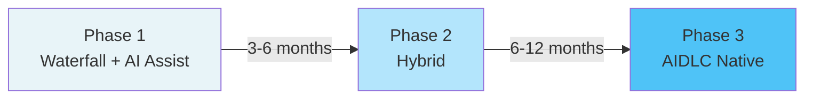
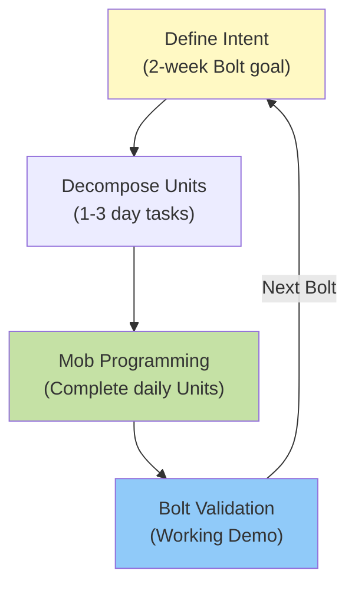
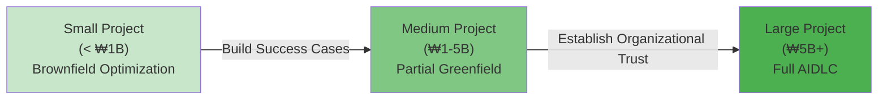
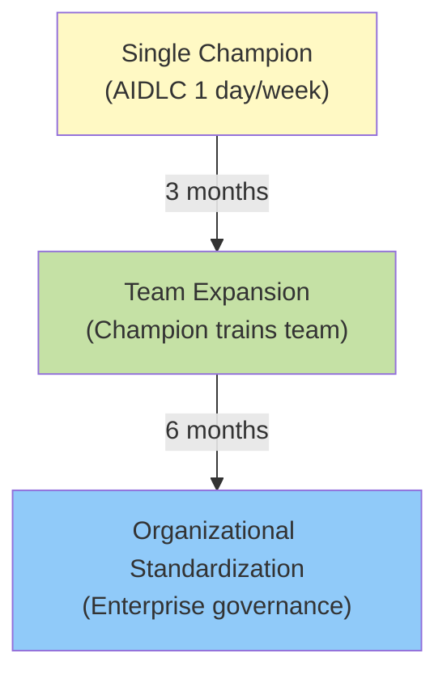

# Enterprise AIDLC Adoption Strategy

A practical adoption strategy for transitioning waterfall-centric development culture to AIDLC in enterprise SI environments.

---

## Reality of Enterprise AIDLC Adoption

### Structural Constraints of Waterfall SI Markets

Large SI projects face difficulty in direct AIDLC adoption for the following reasons:

| Constraint | Description | AIDLC Conflict Point |
|----------|------|---------------|
| **Fixed Process** | ISO 9001, CMMI certified processes | Intent/Bolt cycles misalign with document templates |
| **RFP Culture** | Requirements specification → Fixed-price contract | Adaptive Elaboration interpreted as scope change |
| **Role Rigidity** | Planner/Developer/QA separation | Mob Programming blurs role boundaries |
| **Deliverable-Centric** | Contracts, requirements specs, design docs, test plans | Working software over documentation conflict |
| **Acceptance Stage** | Bulk acceptance at completion | Conflicts with Continuous Validation rhythm |

#### VP Pressure vs Field Resistance Dilemma

- **Executives**: Declare quantitative goals like "80% AI utilization"
- **Field**: Stick to existing methods ("No time to learn during deadlines", "Customers don't require it")
- **Middle Management**: Caught between innovation pressure and project deadlines

→ **Without a gradual transition model, the entire organization remains superficial**

---

## 3-Phase Transition Model

Apply AIDLC gradually within the existing waterfall framework rather than all at once.

### Phase 1: Waterfall + AI Assist (3-6 months)

Maintain existing processes, but allow AI use as coding assistance in development stage only.

#### Scope

- Requirements Analysis: Maintain existing approach
- Design: Maintain existing approach
- **Development**: Allow coding assistance tools like Claude Code, GitHub Copilot
- Testing: Maintain existing QA process

#### Success Metrics

- Development speed improvement: 20-30%
- Bug density: Maintained or slightly improved
- Team satisfaction: Accumulate AI tool experience

#### Organizational Changes

- None (no changes to roles, processes, or deliverables)
- Run AI tool training programs (once weekly, 2 hours)

---

### Phase 2: Hybrid (6-12 months)

Maintain waterfall framework but introduce **Bolt cycles** and **Mob Programming** in the development stage.

#### Scope

- Requirements Analysis: Waterfall (maintain deliverable format)
- Design: Waterfall + **Mob Elaboration** (core modules only)
- **Development**: **Bolt cycles** (2-week cycles producing Working Software)
- Testing: **Continuous Validation** (demonstration per Bolt)

#### Bolt Cycle Structure

#### Success Metrics

- Development speed improvement: 40-60%
- Requirements change response time: 50% reduction
- Customer satisfaction: Increased visibility through Bolt demonstrations

#### Organizational Changes

- **Role Flexibility**: Developers participate in some design, QA participates in Bolt demos
- **Mob Sessions**: 2-3 times weekly, limited to core logic
- **Deliverable Simplification**: Bolt completion report = demo video + code

---

### Phase 3: AIDLC Native (12+ months)

Apply full Intent → Unit → Bolt cycle with comprehensive ontology/harness utilization.

#### Scope

- **Intent Driven**: Convert customer requirements directly to Intents
- **Mob Elaboration**: Entire design conducted through Mob
- **Bolt Cycles**: Complete Intents in 1-2 week cycles
- **Harness Automation**: Unit tests, integration tests, deployment automation
- **Ontology**: Explicit domain knowledge management

#### Organizational Structure

- **Role Redefinition**: See [Role Composition](./role-composition.md)
  - Facilitator: Intent refinement, Mob facilitation
  - Domain Expert: Ontology management
  - Infrastructure Engineer: Harness management
- **Project Structure**: Split 10-15 person teams into 5-7 person Mob units
- **Contract Method**: Fixed price → Time & Material or Bolt-based acceptance

#### Success Metrics

- Development speed improvement: 60-80%
- Requirements change cost: 80% reduction
- Deployment frequency: Weekly → Daily
- Quality: 50% reduction in production bugs

---

## Brownfield-First Strategy

Start with **existing system optimization** rather than new projects.

### Why Brownfield?

| Factor | Greenfield (New) | Brownfield (Existing) |
|------|------------------|------------------|
| **Risk** | High (entire failure has clear responsibility) | Low (partial improvement, can't be worse than current state) |
| **Learning Curve** | Steep (everything decided anew) | Gradual (requires understanding existing codebase) |
| **Visibility** | Low (no deliverables until completion) | High (before/after comparison possible) |
| **Customer Trust** | Uncertain (depends on final result) | High (rapid feedback) |

### 3-Stage Rollout Path

#### Stage 1: Small Projects (< ₩1B)

- **Target**: Legacy system maintenance, feature additions
- **Goal**: Accumulate AIDLC application experience
- **Duration**: 3-6 months
- **Outcome**: Validate Bolt cycles, Mob sessions, harness automation

#### Stage 2: Medium Projects (₩1-5B)

- **Target**: Partial rewrite of existing systems + new features
- **Goal**: Validate hybrid model
- **Duration**: 6-12 months
- **Outcome**: Apply ontology, redefine roles, experiment with contract models

#### Stage 3: Large Projects (₩5B+)

- **Target**: Full enterprise system reconstruction
- **Goal**: Apply AIDLC native
- **Duration**: 12+ months
- **Outcome**: Organization-wide process transition, customer expansion

---

## Champion Model

AIDLC adoption within an organization starts with **one champion**, then expands to **team** and **organization**.

### 3-Stage Expansion Structure

### Stage 1: Single Champion (0-3 months)

#### Champion Selection Criteria

- **Technical Capability**: Coding experience, tool learning ability
- **Soft Skills**: Team influence, teaching willingness
- **Time Availability**: Allow 1 day/week (Fridays) for AIDLC application

#### Champion Activities

- Apply AIDLC 1 day/week (personal project or small tasks)
- Study [10 Principles](../methodology/principles-and-model.md)
- Lead Mob sessions (invite team members)
- Document success cases (steering files, Bolt reports)

#### Organizational Support

- Allow failure (champion activities excluded from evaluation)
- Support external training (conferences, workshops)
- Weekly review meetings (with VP or department head)

---

### Stage 2: Team Expansion (3-6 months)

#### Expansion Mechanism

- Champion hosts **weekly Mob sessions**
- Team members progressively participate in Mob (observe → assist → lead)
- Set AIDLC application rate goals per project (20% → 50% → 80%)

#### Team-Level Deliverables

- **Steering File Standards**: Create project steering file templates
- **Bolt Report Format**: Demo video + code + retrospective summary
- **Ontology Draft**: Domain terminology definitions, core entity models

#### Success Metrics

- Team AIDLC application rate: 50%+
- Mob session participation: 80%+
- Project speed improvement: 30%+

---

### Stage 3: Organizational Standardization (6-12 months)

#### Governance Framework

- **Steering File Standards**: See [Governance](./governance-framework.md)
- **Bolt Cycle Policy**: Length (1-2 weeks), acceptance criteria, demonstration format
- **Mob Session Guide**: Roles, timing, tools, retrospective format
- **Ontology Management**: Domain ontology registry, version control

#### Organizational Structure Changes

- **AIDLC CoE** (Center of Excellence) establishment
  - Operate champion network
  - Develop training programs
  - Standardize tools (Claude Code, GitHub, Slack)
- **Project Evaluation Criteria** changes
  - Deliverable count → Working Software frequency
  - Plan adherence rate → Customer satisfaction

#### Success Metrics

- Organizational AIDLC application rate: 70%+
- Project success rate: 90%+
- Employee satisfaction: NPS 50+ (+20 vs baseline)

---

## Timeline Template

### 3-Month Goals

| Week | Activity | Deliverable | Responsible |
|------|------|--------|------|
| 1-2 | Select champions (1-2 people) | Champion list, activity plan | VP/Department Head |
| 3-4 | AIDLC training (8 hours) | Complete [10 Principles](../methodology/principles-and-model.md) study | Champion |
| 5-8 | Pilot Project 1 (Brownfield) | Complete 1-2 Bolts, demonstration | Champion + 2 team members |
| 9-12 | Pilot Project 2 (Small Greenfield) | Complete 3-4 Bolts, retrospective | Champion + Full team |

**Outcome**: 1-2 champions, 2 projects, 4-6 Bolts completed

---

### 6-Month Goals

| Month | Activity | Deliverable | Responsible |
|----|------|--------|------|
| 1-3 | Achieve 3-month goals | 1-2 champions | VP/Department Head |
| 4 | Team expansion (3-5 teams) | Steering files per team | Champion + Team Lead |
| 5 | Regularize Mob sessions | Weekly Mob, recorded videos | Champion + Team |
| 6 | Standardize steering files | Organizational standard template | AIDLC CoE |

**Outcome**: 3-5 teams, 3-5 champions, complete steering file standard

---

### 12-Month Goals

| Quarter | Activity | Deliverable | Responsible |
|------|------|--------|------|
| Q1-Q2 | Achieve 6-month goals | 3-5 teams | VP/Department Head |
| Q3 | Establish governance framework | [Governance](./governance-framework.md) | AIDLC CoE |
| Q4 | Apply organizational standards (all projects) | Ontology registry, Bolt policy | AIDLC CoE |

**Outcome**: 70% organizational AIDLC application rate, 90% project success rate

---

## Maturity Model

Evaluate organizational AIDLC application level in 4 stages.

### Level 0: Pilot

| Element | Status |
|------|------|
| **Champions** | 1-2 people |
| **Projects** | 1-2 (Brownfield) |
| **Bolt Cycles** | Informal (champion personal experiments) |
| **Mob Sessions** | None or irregular |
| **Ontology** | None |
| **Harness** | Manual testing |

---

### Level 1: Team

| Element | Status |
|------|------|
| **Champions** | 3-5 people |
| **Projects** | 3-5 (Brownfield + small Greenfield) |
| **Bolt Cycles** | Team standard (2 weeks) |
| **Mob Sessions** | Weekly regular |
| **Ontology** | Team draft |
| **Harness** | Some automated tests |

---

### Level 2: Division

| Element | Status |
|------|------|
| **Champions** | 10+ (1-2 per division) |
| **Projects** | 50% of all projects |
| **Bolt Cycles** | Division standard (1-2 weeks) |
| **Mob Sessions** | 2-3 times weekly, recorded sharing |
| **Ontology** | Division registry |
| **Harness** | CI/CD pipeline |

---

### Level 3: Enterprise

| Element | Status |
|------|------|
| **Champions** | Enterprise network (50+) |
| **Projects** | 80% of all projects |
| **Bolt Cycles** | Enterprise standard + [Governance](./governance-framework.md) |
| **Mob Sessions** | Daily Mob (core projects) |
| **Ontology** | Enterprise registry, version control |
| **Harness** | Full automation (including deployment) |

---

## Anti-Patterns

### 1. Big Bang Adoption

**Symptom**: "All AIDLC from the next project" declaration

**Risks**:
- Entire organization enters learning curve simultaneously → Initial productivity plummets
- Failure causes total AIDLC credibility loss
- Superficial application without champions → Misunderstand as "AI tools = AIDLC"

**Alternative**: Champion model + Brownfield-First

---

### 2. Tools Only, Methodology Ignored

**Symptom**: "Deployed Claude Code licenses enterprise-wide" → "AIDLC adoption complete"

**Risks**:
- Using tools without Mob Programming or Bolt cycles → Minimal productivity improvement
- Coding assistance only without Intent/Unit decomposition → Design quality degradation
- Ignoring ontology/harness → Maintainability deterioration

**Alternative**: [10 Principles](../methodology/principles-and-model.md) training first

---

### 3. Expansion Without Measurement

**Symptom**: "5 teams applying AIDLC" (actual application rate, performance unknown)

**Risks**:
- Formal application (doing Mob sessions but also maintaining code reviews → Double work)
- Failure to demonstrate performance → Executive support withdrawn
- Can't learn from failures → Repeat same mistakes

**Alternative**: Track [Cost Effectiveness](./cost-estimation.md) metrics

---

### 4. Bottom-Up Without Executive Support

**Symptom**: Field developers attempt AIDLC voluntarily, management opposes

**Risks**:
- Pressure to stop AIDLC under project schedule pressure
- Role boundary violations (planners/QA refuse Mob participation)
- Budget shortfall (tools licensing, training programs unsupported)

**Alternative**: VP/Department Head sponsorship essential

---

### 5. Customer Persuasion Failure

**Symptom**: SI team applies AIDLC, but customer demands waterfall deliverables

**Risks**:
- Double work (develop with AIDLC + write waterfall deliverables separately)
- Bolt acceptance refused → Revert to bulk acceptance at project end
- Customer distrust ("How do I track progress without deliverables?")

**Alternative**: Specify Bolt demonstrations in contract, negotiate deliverable simplification

---

## Execution Checklist

### Organizational Readiness Assessment

- [ ] Secure VP/Department Head sponsorship
- [ ] Select champion candidates (1-2 people)
- [ ] Select pilot project (Brownfield priority)
- [ ] Establish failure tolerance policy

### 3-Month Goals

- [ ] Complete champion training ([10 Principles](../methodology/principles-and-model.md))
- [ ] Complete 1-2 pilot projects
- [ ] Produce 4-6 Bolts, secure demonstration videos
- [ ] Draft team-level steering files

### 6-Month Goals

- [ ] Expand to 3-5 teams
- [ ] Standardize steering files
- [ ] Ontology draft (per domain)
- [ ] Measure [Cost Effectiveness](./cost-estimation.md) metrics

### 12-Month Goals

- [ ] 70% organizational AIDLC application rate
- [ ] Complete [Governance](./governance-framework.md) framework
- [ ] Operate ontology registry
- [ ] 90% project success rate

---

## Next Steps

- [Role Composition](./role-composition.md): AIDLC team structure and role changes
- [Cost Effectiveness](./cost-estimation.md): ROI measurement and executive reporting
- [Governance](./governance-framework.md): Establish enterprise standards
- [10 Principles](../methodology/principles-and-model.md): AIDLC methodology foundation

**Key Message**: Waterfall→AIDLC transition executes through 3-phase gradual transition (Waterfall+AI → Hybrid → Native) and Champion model (1 person → Team → Organization). Build trust with Brownfield-First and expand with measurable results.
