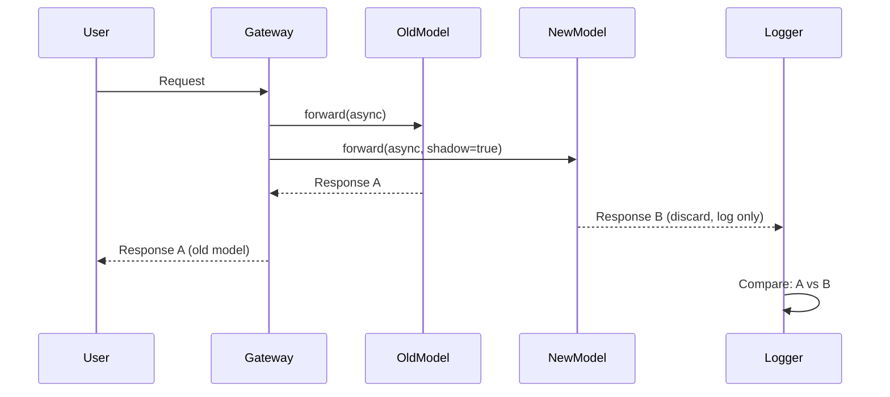
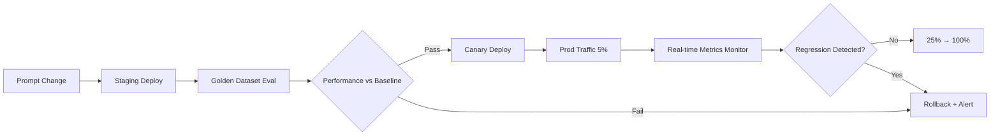

# Agent Change Management

## Why Agent Change Management?

### Differences from Traditional Software Change Management

In traditional software, change management targets code, configuration, and infrastructure changes. Agent systems add **probabilistic components**:

| Change Type | Traditional Systems | Agentic Systems |
|-------------|---------------------|-----------------|
| **Output Determinism** | Same input → Same output | Same input → Probability distribution |
| **Regression Detection** | Unit tests, integration tests | Statistical evaluation (BLEU, Exact Match, LLM-as-Judge) |
| **Rollback Criteria** | Functional failure, performance degradation | Accuracy drop, hallucination increase, latency P99 |
| **Change Unit** | Code commit, binary | Prompt version, model replacement, parameter adjustment |

### Why Manage Prompts and Models Like Code

1. **Prompts are the Core Logic**  
   Changing one line from "You are a financial analysis expert" to "You are a conservative investment advisor" changes the entire output pattern.

2. **Model Replacement is Runtime Replacement**  
   When switching GPT-4 → Claude 3.5 Sonnet, even with the same prompt, response style, token usage, and latency change.

3. **Cannot Rollback Without Change Tracking**  
   When you receive a report saying "It worked fine yesterday but is strange today," you can't recover if you don't know who changed which prompt when.

4. **Regulatory Requirements**  
   Finance, healthcare, and public sectors must maintain audit records of "which prompt version, which model version generated this response."

---

## Prompt Registry

### Langfuse Prompt

[Langfuse](https://langfuse.com/) is a self-hosted LLMOps platform. Prompt registry features:

- **Version Management**: Auto-increment version on each change (`v1`, `v2`, ...)
- **Labels**: Assign environment-specific labels like `production`, `staging`, `canary`
- **Rollout Management**: Applications reference only labels (`get_prompt("financial-analysis", label="production")`)
- **Diff View**: Visualize changes between versions
- **Access Log**: Track which session used which prompt version

```python
from langfuse import Langfuse

client = Langfuse()

# Query prompt version
prompt = client.get_prompt("financial-analysis", label="production")
print(prompt.version)  # e.g.: 5
print(prompt.prompt)   # actual text

# Deploy new version
client.create_prompt(
    name="financial-analysis",
    prompt="You are a conservative investment advisor...",
    labels=["staging"]  # Deploy to staging first
)
# After validation
client.update_prompt_label("financial-analysis", version=6, label="production")
```

**Pros**:
- Self-hosted, RBAC, S3+KMS backend capable
- Observability integration (auto-record prompt version in traces)

**Cons**:
- Python SDK-centric (TypeScript SDK exists but limited features)
- Simple UI (shows diff but no approval workflow)

### PromptLayer

[PromptLayer](https://promptlayer.com/) is a SaaS prompt registry.

- **Version Tagging**: Git-style tags (`v1.0`, `v1.1-alpha`)
- **Visual Diff**: Highlight word-level changes between versions
- **A/B Experiments**: Deploy two versions simultaneously and compare performance
- **Analytics**: Version-specific latency, token usage, error rate dashboard

**Pros**:
- Instant use without installation
- Team collaboration features (comments, approval workflow)

**Cons**:
- SaaS only (no on-premises)
- Data sovereignty issues (prompts stored on external servers)

### Braintrust Prompts

[Braintrust](https://www.braintrust.dev/) is an evaluation platform that also provides prompt management.

- **Playground**: Write prompt → immediately evaluate with test sets
- **Versioning**: Auto version increment + commit message
- **Datasets Integration**: Auto-trigger evaluation run on prompt changes
- **Experimentation**: Side-by-side comparison of two prompt versions

**Pros**:
- Evaluation and prompt management in one platform
- Auto quality regression check on every change

**Cons**:
- Strong in development/test stages rather than runtime deployment
- Weak production rollout features (requires manual implementation)

### AWS Bedrock Prompt Management

AWS Bedrock provides [Prompt Management](https://docs.aws.amazon.com/bedrock/latest/userguide/prompt-management.html) (GA November 2024).

- **Prompt Versions**: Create immutable versions via `CreatePromptVersion` API
- **Alias**: Connect aliases like `PROD`, `STAGING` to versions
- **IAM Integration**: Policy settings to allow use of specific versions only
- **CloudTrail**: Audit logs of who deployed which version when

```python
import boto3

bedrock = boto3.client('bedrock-agent')

# Create new version
response = bedrock.create_prompt_version(
    promptIdentifier='arn:aws:bedrock:us-east-1:123456789012:prompt/fin-analysis',
    description='Changed to conservative investment advisory style'
)
version_id = response['version']

# Update production alias
bedrock.update_prompt_alias(
    promptIdentifier='arn:aws:bedrock:us-east-1:123456789012:prompt/fin-analysis',
    aliasIdentifier='PROD',
    promptVersion=version_id
)
```

**Pros**:
- AWS native, IAM/CloudTrail/KMS integration
- Direct reference from Lambda, Step Functions

**Cons**:
- Requires Bedrock model usage (Claude, Llama, etc.)
- Separate configuration needed for self-hosted LLM (vLLM, llm-d)

### Comparison Table

| Feature | Langfuse | PromptLayer | Braintrust | Bedrock PM |
|---------|----------|-------------|------------|------------|
| **Deployment** | Self-hosted | SaaS | SaaS | AWS Managed |
| **Version Management** | ✅ | ✅ | ✅ | ✅ |
| **Label/Alias** | ✅ | ✅ | ❌ | ✅ |
| **Visual Diff** | Basic | ✅ | ✅ | ❌ |
| **Approval Workflow** | ❌ | ✅ | ❌ | ❌(implement with IAM) |
| **A/B Experiments** | Manual | ✅ | ✅ | Manual |
| **Auto Evaluation Integration** | Possible(trace-based) | ❌ | ✅ | Possible(Lambda) |
| **Data Sovereignty** | ✅ | ❌ | ❌ | ✅(in-region) |
| **AIDLC Suitability** | **⭐ High** | Medium(SaaS) | High(Eval-focused) | High(Bedrock only) |

**AIDLC Recommendation**: **Langfuse** (self-hosted requirement) or **AWS Bedrock PM** (if using Bedrock). PromptLayer/Braintrust if SaaS allowed.

---

## Model Replacement Strategies

### Shadow Testing

**Concept**: New model receives actual production traffic but responses aren't delivered to users. Only old model responses are returned; new model output is collected for logging/evaluation only.



**When to Use**:
- When you want to verify new model's latency, error rate, output quality **without risk**
- Can afford cost (2x cost per request)

**Implementation Example (Python, LiteLLM)**: LiteLLM doesn't have native shadow feature, implement directly:

```python
import asyncio
from litellm import acompletion

async def shadow_call(user_request):
    # Old model (production)
    old_task = acompletion(model="gpt-4", messages=user_request)
    # New model (shadow)
    new_task = acompletion(model="claude-3-5-sonnet-20241022", messages=user_request)
    
    old_resp, new_resp = await asyncio.gather(old_task, new_task, return_exceptions=True)
    
    # Logging: compare both responses
    log_to_langfuse(user_request, old_resp, new_resp, shadow=True)
    
    # Return only old model response to user
    return old_resp
```

**Pros**:
- No impact on user experience
- Test with real traffic patterns

**Cons**:
- 2x cost
- Cannot collect user feedback (users don't see shadow responses)

### Canary Rollout

**Concept**: Start with small traffic (5%) and gradually increase percentage in stages.

```
5% → Observe(24h) → If no issues 25% → 50% → 100%
```

**When to Use**:
- When new model is sufficiently validated but full production replacement is risky
- Need fast rollback on regression detection

**Implementation Example (LaunchDarkly)**: Control model selection via Feature Flag

```python
from ldclient import LDClient, Context

ld_client = LDClient(sdk_key="your-key")

def get_model_for_user(user_id: str):
    context = Context.builder(user_id).kind("user").build()
    model = ld_client.variation("llm-model-selection", context, default="gpt-4")
    return model

# In LaunchDarkly console: set "llm-model-selection" flag to 5% claude-3-5-sonnet, 95% gpt-4
```

**Monitoring Criteria**:
- Canary group vs Control group **success rate** (200 response ratio)
- **Latency P50/P99** difference
- **User feedback** (thumbs up/down) ratio
- **Cost** (token usage)

**Auto Rollback Trigger**:
```yaml
# Example: Prometheus AlertManager rule
- alert: CanaryRegressionDetected
  expr: |
    (rate(llm_success_total{model="claude-3-5-sonnet"}[5m]) 
     / rate(llm_requests_total{model="claude-3-5-sonnet"}[5m]))
    < 0.95
  for: 10m
  annotations:
    summary: "Canary success rate below 95%, rollback needed"
```

**Pros**:
- Gradual risk distribution
- Can collect actual user feedback

**Cons**:
- Extended deployment period (days to weeks)
- Monitoring infrastructure required

### A/B Testing

**Concept**: **Randomly split** traffic into two groups (A: old model, B: new model) and statistically compare business metrics (conversion rate, user satisfaction, etc.).

**When to Use**:
- When you need to prove "is the new model really better?" with **statistical significance**
- Marketing, UX optimization (prompt tone changes, etc.)

**Experimental Design**:
1. **Null Hypothesis**: "No performance difference between new and old models"
2. **Alternative Hypothesis**: "New model improves conversion rate by 5% or more"
3. **Sample Size Calculation**: [AB Test Calculator](https://www.evanmiller.org/ab-testing/sample-size.html)  
   e.g.: Baseline 10%, detect 5%p improvement, 80% power → Need 2,348 per group
4. **Experiment Duration**: Until sufficient samples collected (typically 1-4 weeks)

**Implementation Example (Unleash)**:

```typescript
import { UnleashClient } from 'unleash-client';

const unleash = new UnleashClient({
  url: 'https://unleash.example.com/api',
  appName: 'agent-service',
  customHeaders: { Authorization: 'your-token' }
});

function selectModel(userId: string): string {
  const context = { userId };
  // 'ab-test-claude-vs-gpt' variant: 50% 'A', 50% 'B'
  const variant = unleash.getVariant('ab-test-claude-vs-gpt', context);
  return variant.name === 'B' ? 'claude-3-5-sonnet-20241022' : 'gpt-4';
}
```

**Analysis**: After experiment ends, validate significance with chi-square test

```python
from scipy.stats import chi2_contingency

# A: gpt-4, B: claude-3-5-sonnet
# Success/failure contingency table
obs = [[2100, 300],   # A: 2100 success, 300 failure
       [2200, 200]]   # B: 2200 success, 200 failure

chi2, p, dof, ex = chi2_contingency(obs)
print(f"p-value: {p}")  # p < 0.05 → B statistically significantly better
```

**Pros**:
- Prove business impact with numbers
- Advantageous for marketing, executive persuasion

**Cons**:
- Long experiment period
- Requires statistical expertise
- Need sufficient traffic to ensure significance

### Blue-Green Deployment

**Concept**: Run old environment (Blue) and new environment (Green) simultaneously, then switch traffic **all at once** to Green. Immediately revert to Blue if issues occur.

**When to Use**:
- When replacing model serving infrastructure itself (vLLM 0.5 → 0.6)
- Runtime change rather than prompt change

**Implementation Example (Kubernetes Service + Ingress)**:

```yaml
# blue-deployment.yaml
apiVersion: apps/v1
kind: Deployment
metadata:
  name: llm-blue
spec:
  replicas: 3
  selector:
    matchLabels:
      app: llm
      version: blue
  template:
    metadata:
      labels:
        app: llm
        version: blue
    spec:
      containers:
      - name: vllm
        image: vllm/vllm-openai:v0.5.4
        args: ["--model", "meta-llama/Llama-3.1-8B-Instruct"]
---
# green-deployment.yaml (new version)
apiVersion: apps/v1
kind: Deployment
metadata:
  name: llm-green
spec:
  replicas: 3
  selector:
    matchLabels:
      app: llm
      version: green
  template:
    metadata:
      labels:
        app: llm
        version: green
    spec:
      containers:
      - name: vllm
        image: vllm/vllm-openai:v0.6.3
        args: ["--model", "meta-llama/Llama-3.1-8B-Instruct"]
---
# service.yaml (initially points to blue)
apiVersion: v1
kind: Service
metadata:
  name: llm-service
spec:
  selector:
    app: llm
    version: blue  # ← Change this to 'green' to switch
  ports:
  - port: 8000
```

**Switching Procedure**:
1. Complete Green deployment → Verify health check
2. `kubectl patch svc llm-service -p '{"spec":{"selector":{"version":"green"}}}'`
3. Monitor for 5 minutes → Delete Blue if no issues
4. If issues occur, revert to `version: blue` immediately

**Pros**:
- Fastest rollback speed (seconds)
- Simple switching process

**Cons**:
- 2x infrastructure cost (during switching period)
- No gradual validation (all-or-nothing)

---

## Feature Flag-based Prompt Rollout

### LaunchDarkly

[LaunchDarkly](https://launchdarkly.com/) is an enterprise-grade Feature Flag platform.

**Prompt Rollout Example**:

```python
from ldclient import LDClient, Context

ld_client = LDClient(sdk_key="sdk-key")

def get_prompt_version(user_id: str, org_id: str) -> int:
    context = Context.builder(user_id) \
        .kind("user") \
        .set("org_id", org_id) \
        .build()
    
    # flag 'prompt-version-financial': can target by organization
    # e.g.: org_id='acme-corp' → version=5, rest → version=4
    version = ld_client.variation("prompt-version-financial", context, default=4)
    return version
```

**Kill Switch**: Revert all users to safe version in emergency

```python
# In LaunchDarkly console, force 'prompt-version-financial' flag to 4
# Applied to all users immediately without code changes
```

**Targeting Rule Examples**:
- **Beta users**: `user.beta == true` → new version
- **Specific region**: `user.region == "us-east-1"` → canary version
- **Organization tier**: `user.tier == "enterprise"` → latest version priority

### Unleash

[Unleash](https://www.getunleash.io/) is an open-source Feature Flag platform.

**Pros**:
- Self-hosted capable
- Postgres backend, RBAC, audit log included by default

**Prompt Rollout**:

```typescript
import { Unleash } from 'unleash-client';

const unleash = new Unleash({
  url: 'https://unleash.internal.corp/api',
  appName: 'agent-gateway',
  customHeaders: { Authorization: 'token' }
});

function getPromptVariant(userId: string): string {
  const context = { userId, properties: { region: 'us-west-2' } };
  const variant = unleash.getVariant('prompt-experiment-2026-04', context);
  // variant.name: 'control', 'treatment-A', 'treatment-B'
  return variant.payload.value;  // Actual prompt text or version number
}
```

### AWS AppConfig

[AWS AppConfig](https://docs.aws.amazon.com/appconfig/latest/userguide/what-is-appconfig.html) supports Feature Flags and dynamic configuration.

**Pros**:
- AWS native, Lambda/ECS/EKS integration
- Deployment strategy: Linear, Canary, All-at-once
- Auto rollback based on CloudWatch alarms

**Example**:

```python
import boto3
import json

appconfig = boto3.client('appconfigdata')

session = appconfig.start_configuration_session(
    ApplicationIdentifier='agent-app',
    EnvironmentIdentifier='production',
    ConfigurationProfileIdentifier='prompt-config'
)
session_token = session['InitialConfigurationToken']

config = appconfig.get_latest_configuration(ConfigurationToken=session_token)
prompt_config = json.loads(config['Configuration'].read())

print(prompt_config['version'])  # e.g.: 5
print(prompt_config['text'])
```

**Deployment Strategy**:
```json
{
  "DeploymentStrategyId": "AppConfig.Canary10Percent20Minutes",
  "Description": "Deploy to 10% users for 20 minutes then expand"
}
```

Auto rollback when CloudWatch alarm (`LLMErrorRate > threshold`) triggers.

---

## Regression Detection Integration

### Evaluation Framework Integration

Use **Golden Dataset** defined in [AIDLC Evaluation Framework](../toolchain/evaluation-framework.md) to detect regression before deploying new version.

**Workflow**:



### Baseline vs New Statistical Comparison

**Metrics**:
- **Accuracy**: Exact Match, F1, BLEU (translation)
- **Quality**: LLM-as-Judge score (0-1)
- **Latency**: P50, P99
- **Cost**: Token usage

**Statistical Testing**:

```python
from scipy.stats import ttest_ind

# baseline: Old version 100 samples' Exact Match scores
baseline_scores = [...]  # e.g.: mean 0.82

# new: New version 100 samples
new_scores = [...]  # e.g.: mean 0.85

t_stat, p_value = ttest_ind(baseline_scores, new_scores)

if p_value < 0.05 and mean(new_scores) > mean(baseline_scores):
    print("New version statistically significantly better → Approve deployment")
elif mean(new_scores) < mean(baseline_scores) * 0.95:
    print("New version degraded by 5%+ → Rollback")
else:
    print("No significant difference → Additional validation needed")
```

### Auto Rollback Triggers

**Conditions**:
1. **Accuracy absolute drop**: `new_exact_match < baseline_exact_match - 0.05`
2. **Latency regression**: `new_p99_latency > baseline_p99_latency * 1.5`
3. **Error rate increase**: `new_error_rate > 5%`
4. **User feedback**: `thumbs_down_rate > 20%`

**Implementation**:

```yaml
# Prometheus Alert
- alert: PromptRegressionDetected
  expr: |
    langfuse_eval_exact_match{prompt_version="6"} 
    < langfuse_eval_exact_match{prompt_version="5"} - 0.05
  for: 30m
  annotations:
    summary: "Prompt v6 accuracy degraded → Auto rollback"
  # Webhook → Lambda → Langfuse API (revert production label to v5)
```

---

## Operational Governance

### Change Approval Workflow

**AIDLC Checkpoints** application:

| Stage | Checkpoint | Approver | Criteria |
|-------|-----------|----------|----------|
| 1. Prompt Change Proposal | `[Answer]:` | Domain Expert | Specify intent and risk assessment |
| 2. Staging Eval Results | Regression Detection Pass | Lead Engineer | Exact Match ≥ Baseline - 2% |
| 3. Canary 5% Deploy | Real-time Metrics Review | SRE | Error rate < 1%, P99 latency ≤ 1.2x |
| 4. Prod 100% Transition | Final Approval | Product Owner | Verify business metrics improvement |

**Approval Automation (GitHub Actions + Langfuse)**:

```yaml
# .github/workflows/prompt-approval.yml
name: Prompt Approval
on:
  pull_request:
    paths:
      - 'prompts/**'
jobs:
  evaluate:
    runs-on: ubuntu-latest
    steps:
      - uses: actions/checkout@v4
      - name: Run Golden Dataset Eval
        run: |
          python scripts/eval_prompt.py --new-version ${{ github.sha }}
      - name: Post Results
        uses: actions/github-script@v7
        with:
          script: |
            const results = require('./eval_results.json');
            if (results.exact_match < results.baseline - 0.02) {
              core.setFailed('Regression detected: Exact Match drop');
            }
            github.rest.issues.createComment({
              issue_number: context.issue.number,
              body: `### Evaluation Results\n- Baseline: ${results.baseline}\n- New: ${results.exact_match}\n- Verdict: ${results.pass ? '✅ Approved' : '❌ Rejected'}`
            });
```

### Change Records (Audit Log)

**Langfuse**: All prompt changes automatically recorded in version history. Additionally:

```python
# Record metadata on change
client.create_prompt(
    name="financial-analysis",
    prompt="...",
    labels=["production"],
    metadata={
        "changed_by": "jane@example.com",
        "jira_ticket": "AIDLC-1234",
        "approval": "approved_by_john_2026-04-17",
        "rollback_plan": "revert to v5 if error_rate > 5%"
    }
)
```

**AWS CloudTrail**: When using Bedrock Prompt Management

```json
{
  "eventName": "UpdatePromptAlias",
  "userIdentity": {
    "principalId": "AIDAI...",
    "arn": "arn:aws:iam::123456789012:user/jane"
  },
  "requestParameters": {
    "promptIdentifier": "fin-analysis",
    "aliasIdentifier": "PROD",
    "promptVersion": "6"
  },
  "eventTime": "2026-04-17T14:30:00Z"
}
```

### Rollback Plan Required

Attach **Rollback Plan** to all change requests:

```markdown
## Rollback Plan

**Trigger**: Error rate > 3% within 30 minutes of deployment

**Steps**:
1. Revert `production` label to v5 in Langfuse
2. Restart Gateway (no pod restart needed, Langfuse SDK polls every 30 sec)
3. Alert in Slack #incident channel
4. Write PostMortem (cause, prevention measures)

**Validation**:
- Verify error rate < 1% recovery
- Monitor for 5 minutes then close incident
```

### Audit Evidence

**Audit evidence** required by finance, healthcare, etc.:

| Item | Recording Location | Retention Period |
|------|-------------------|------------------|
| Prompt Version | Langfuse DB (S3+KMS) | 7 years |
| Model Version | Inference logs (trace) | 7 years |
| Approval Records | GitHub PR + JIRA | 7 years |
| Evaluation Results | Braintrust/Langfuse Eval | 3 years |
| User Sessions | Langfuse Trace | 1 year |
| Rollback Events | CloudTrail + PagerDuty | 7 years |

**Example Query (auditor request response)**:

```sql
-- "Who deployed prompt v6 at 14:00 on April 17, 2026?"
SELECT version, metadata->>'changed_by', metadata->>'jira_ticket', created_at
FROM langfuse_prompts
WHERE name = 'financial-analysis'
  AND created_at BETWEEN '2026-04-17 14:00:00' AND '2026-04-17 15:00:00';
```

---

## AIDLC Stage-specific Usage

### Construction Phase

**Prompt Code Review Along with Code**:

```
repo/
  src/
    agents/
      financial_analyst.py
  prompts/
    financial_analysis_v5.txt  # ← Prompts also version controlled
  tests/
    test_financial_analyst.py  # Golden Dataset evaluation
```

**PR Template**:

```markdown
## Changes
- Prompt v5 → v6: Strengthened "conservative investment advisory" tone

## Evaluation Results
- Exact Match: 0.82 → 0.85 (+3%p)
- LLM-as-Judge: 0.78 → 0.81 (+3%p)
- Latency P99: 1.2s → 1.3s (10% increase, within acceptable range)

## Rollback Plan
- Trigger: Error rate > 3%
- Action: Langfuse production label → v5 recovery

## Approval
- [x] Domain Expert (jane@) approved
- [x] Golden Dataset evaluation passed
- [ ] Awaiting SRE approval
```

### Operations Phase

**Gradual Rollout + Real-time Regression Detection**:

| Time | Deploy % | Monitoring |
|------|----------|------------|
| D+0 14:00 | Canary 5% start | CloudWatch dashboard real-time |
| D+0 16:00 | Error rate 0.8% ✅ | Expand to 25% |
| D+0 20:00 | Error rate 1.2% ✅ | Expand to 50% |
| D+1 10:00 | Error rate 0.9% ✅ | 100% transition |
| D+1 14:00 | **Error rate 5.2% ❌** | **Auto rollback trigger** |
| D+1 14:05 | Rollback complete, v5 recovered | Incident PostMortem |

**Real-time Dashboard (Grafana)**:

```promql
# Canary vs Control error rate
rate(llm_errors_total{prompt_version="6"}[5m]) 
/ rate(llm_requests_total{prompt_version="6"}[5m])

# Latency P99
histogram_quantile(0.99, 
  rate(llm_latency_bucket{prompt_version="6"}[5m])
)
```

---

## References

### Prompt Registry

- **Langfuse Prompts**: [langfuse.com/docs/prompts](https://langfuse.com/docs/prompts)
- **PromptLayer**: [promptlayer.com](https://promptlayer.com/)
- **Braintrust Prompts**: [braintrust.dev/docs/guides/prompts](https://www.braintrust.dev/docs/guides/prompts)
- **AWS Bedrock Prompt Management**: [AWS Docs](https://docs.aws.amazon.com/bedrock/latest/userguide/prompt-management.html)

### Feature Flag Platforms

- **LaunchDarkly**: [launchdarkly.com](https://launchdarkly.com/)
  - [AI/ML Blog Posts](https://launchdarkly.com/blog/category/ai/)
- **Unleash**: [getunleash.io](https://www.getunleash.io/)
- **AWS AppConfig**: [AWS Docs](https://docs.aws.amazon.com/appconfig/latest/userguide/what-is-appconfig.html)

### Deployment Strategies

- **Canary Deployment Pattern**: [martinfowler.com/bliki/CanaryRelease.html](https://martinfowler.com/bliki/CanaryRelease.html)
- **Blue-Green Deployment**: [martinfowler.com/bliki/BlueGreenDeployment.html](https://martinfowler.com/bliki/BlueGreenDeployment.html)
- **Shadow Testing**: [Google SRE Workbook - Canarying Releases](https://sre.google/workbook/canarying-releases/)

### Statistical Testing

- **A/B Test Calculator**: [evanmiller.org/ab-testing](https://www.evanmiller.org/ab-testing/sample-size.html)
- **scipy.stats**: [docs.scipy.org/doc/scipy/reference/stats.html](https://docs.scipy.org/doc/scipy/reference/stats.html)

### Related AIDLC Documents

- [Evaluation Framework](../toolchain/evaluation-framework.md)
- [CI/CD Strategy](../toolchain/cicd-strategy.md)
- [Agent Monitoring](../../agentic-ai-platform/operations-mlops/agent-monitoring.md)

---

## Next Steps

After establishing change management processes:

1. **[Agent Monitoring](../../agentic-ai-platform/operations-mlops/agent-monitoring.md)** — Build observability for real-time regression detection
2. **[Evaluation Framework](../toolchain/evaluation-framework.md)** — Design Golden Dataset and automated evaluation pipelines
3. **[CI/CD Strategy](../toolchain/cicd-strategy.md)** — Integrate prompt/model changes into automated pipelines
