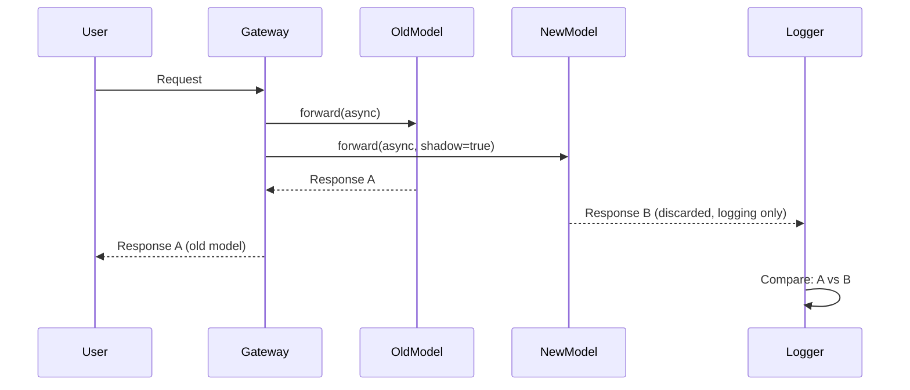

# Deployment Strategies

## Model Replacement Strategies

### Shadow Testing

**Concept**: The new model receives actual production traffic, but responses are not delivered to users. Only the old model's responses are returned, and new model outputs are collected only for logging/evaluation.



**When to Use**:
- When you want to validate new model's latency, error rate, and output quality **without risk**
- When cost burden is acceptable (2x cost per request)

**Implementation Example (Python, LiteLLM)**: LiteLLM has no native shadow feature, so implement directly:

```python
import asyncio
from litellm import acompletion

async def shadow_call(user_request):
    # Old model (production)
    old_task = acompletion(model="gpt-4", messages=user_request)
    # New model (shadow)
    new_task = acompletion(model="claude-3-5-sonnet-20241022", messages=user_request)
    
    old_resp, new_resp = await asyncio.gather(old_task, new_task, return_exceptions=True)
    
    # Logging: compare both responses
    log_to_langfuse(user_request, old_resp, new_resp, shadow=True)
    
    # Return only old model response to user
    return old_resp
```

**Advantages**:
- No impact on user experience
- Testing with actual traffic patterns

**Disadvantages**:
- 2x cost
- Cannot collect user feedback (users don't see shadow responses)

---

### Canary Rollout

**Concept**: Start with a small percentage of traffic (5%) and gradually increase the ratio.

```
5% → Observe (24h) → If no issues 25% → 50% → 100%
```

**When to Use**:
- When the new model is sufficiently validated, but full production replacement is high risk
- When fast rollback is needed upon regression detection

**Implementation Example (LaunchDarkly)**: Control model selection with Feature Flag

```python
from ldclient import LDClient, Context

ld_client = LDClient(sdk_key="your-key")

def get_model_for_user(user_id: str):
    context = Context.builder(user_id).kind("user").build()
    model = ld_client.variation("llm-model-selection", context, default="gpt-4")
    return model

# Set "llm-model-selection" flag in LaunchDarkly console to 5% claude-3-5-sonnet, 95% gpt-4
```

**Monitoring Criteria**:
- Canary group vs Control group **success rate** (200 response ratio)
- **Latency P50/P99** difference
- **User feedback** (thumbs up/down) ratio
- **Cost** (token usage)

**Automatic Rollback Trigger**:
```yaml
# Example: Prometheus AlertManager rule
- alert: CanaryRegressionDetected
  expr: |
    (rate(llm_success_total{model="claude-3-5-sonnet"}[5m]) 
     / rate(llm_requests_total{model="claude-3-5-sonnet"}[5m]))
    < 0.95
  for: 10m
  annotations:
    summary: "Canary success rate below 95%, rollback needed"
```

**Advantages**:
- Progressive risk distribution
- Can collect real user feedback

**Disadvantages**:
- Longer deployment period (days to weeks)
- Monitoring infrastructure required

---

### A/B Testing

**Concept**: **Randomly split** traffic into two groups (A: old model, B: new model) and statistically compare business metrics (conversion rate, user satisfaction, etc.).

**When to Use**:
- When you need to prove "Is the new model really better?" with **statistical significance**
- Marketing, UX optimization (prompt tone changes, etc.)

**Experiment Design**:
1. **Null Hypothesis**: "No performance difference between new and old models"
2. **Alternative Hypothesis**: "New model improves conversion rate by 5% or more"
3. **Sample Size Calculation**: [AB Test Calculator](https://www.evanmiller.org/ab-testing/sample-size.html)  
   Example: Baseline 10%, detect 5%p improvement, 80% power → 2,348 per group needed
4. **Experiment Duration**: Until sufficient samples are collected (typically 1-4 weeks)

**Implementation Example (Unleash)**:

```typescript
import { UnleashClient } from 'unleash-client';

const unleash = new UnleashClient({
  url: 'https://unleash.example.com/api',
  appName: 'agent-service',
  customHeaders: { Authorization: 'your-token' }
});

function selectModel(userId: string): string {
  const context = { userId };
  // 'ab-test-claude-vs-gpt' variant: 50% 'A', 50% 'B'
  const variant = unleash.getVariant('ab-test-claude-vs-gpt', context);
  return variant.name === 'B' ? 'claude-3-5-sonnet-20241022' : 'gpt-4';
}
```

**Analysis**: Validate significance with chi-square test after experiment completion

```python
from scipy.stats import chi2_contingency

# A: gpt-4, B: claude-3-5-sonnet
# Success/failure contingency table
obs = [[2100, 300],   # A: 2100 success, 300 failure
       [2200, 200]]   # B: 2200 success, 200 failure

chi2, p, dof, ex = chi2_contingency(obs)
print(f"p-value: {p}")  # p < 0.05 → B is statistically significantly superior
```

**Advantages**:
- Prove business impact with numbers
- Favorable for marketing, executive persuasion

**Disadvantages**:
- Long experiment period
- Statistical expertise required
- Sufficient traffic needed to ensure significance

---

### Blue-Green Deployment

**Concept**: Operate old environment (Blue) and new environment (Green) simultaneously, then switch traffic to Green **all at once**. Immediately revert to Blue if issues occur.

**When to Use**:
- When replacing the model serving infrastructure itself (vLLM 0.5 → 0.6)
- Runtime changes rather than prompt changes

**Implementation Example (Kubernetes Service + Ingress)**:

```yaml
# blue-deployment.yaml
apiVersion: apps/v1
kind: Deployment
metadata:
  name: llm-blue
spec:
  replicas: 3
  selector:
    matchLabels:
      app: llm
      version: blue
  template:
    metadata:
      labels:
        app: llm
        version: blue
    spec:
      containers:
      - name: vllm
        image: vllm/vllm-openai:v0.5.4
        args: ["--model", "meta-llama/Llama-3.1-8B-Instruct"]
---
# green-deployment.yaml (new version)
apiVersion: apps/v1
kind: Deployment
metadata:
  name: llm-green
spec:
  replicas: 3
  selector:
    matchLabels:
      app: llm
      version: green
  template:
    metadata:
      labels:
        app: llm
        version: green
    spec:
      containers:
      - name: vllm
        image: vllm/vllm-openai:v0.6.3
        args: ["--model", "meta-llama/Llama-3.1-8B-Instruct"]
---
# service.yaml (initially points to blue)
apiVersion: v1
kind: Service
metadata:
  name: llm-service
spec:
  selector:
    app: llm
    version: blue  # ← Change this to 'green' to switch
  ports:
  - port: 8000
```

**Switch Procedure**:
1. Complete Green deployment → Check health check
2. `kubectl patch svc llm-service -p '{"spec":{"selector":{"version":"green"}}}'`
3. Monitor for 5 minutes → Delete Blue if no issues
4. If issues occur, immediately rollback with `version: blue`

**Advantages**:
- Fastest rollback speed (seconds)
- Simple switch process

**Disadvantages**:
- 2x infrastructure cost (during switch period)
- No progressive validation (all-or-nothing)

---

## Feature Flag-Based Prompt Rollout

### LaunchDarkly

[LaunchDarkly](https://launchdarkly.com/) is an enterprise-grade Feature Flag platform.

**Prompt Rollout Example**:

```python
from ldclient import LDClient, Context

ld_client = LDClient(sdk_key="sdk-key")

def get_prompt_version(user_id: str, org_id: str) -> int:
    context = Context.builder(user_id) \
        .kind("user") \
        .set("org_id", org_id) \
        .build()
    
    # flag 'prompt-version-financial': organization-level targeting
    # Example: org_id='acme-corp' → version=5, others → version=4
    version = ld_client.variation("prompt-version-financial", context, default=4)
    return version
```

**Kill Switch**: Revert all users to safe version in emergency situations

```python
# Force 'prompt-version-financial' flag to 4 in LaunchDarkly console
# Applied immediately to all users without code changes
```

**Targeting Rule Examples**:
- **Beta users**: `user.beta == true` → new version
- **Specific region**: `user.region == "us-east-1"` → canary version
- **Organization tier**: `user.tier == "enterprise"` → latest version priority

---

### Unleash

[Unleash](https://www.getunleash.io/) is an open-source Feature Flag platform.

**Advantages**:
- Self-hosted capable
- Postgres backend, RBAC, audit log provided by default

**Prompt Rollout**:

```typescript
import { Unleash } from 'unleash-client';

const unleash = new Unleash({
  url: 'https://unleash.internal.corp/api',
  appName: 'agent-gateway',
  customHeaders: { Authorization: 'token' }
});

function getPromptVariant(userId: string): string {
  const context = { userId, properties: { region: 'us-west-2' } };
  const variant = unleash.getVariant('prompt-experiment-2026-04', context);
  // variant.name: 'control', 'treatment-A', 'treatment-B'
  return variant.payload.value;  // Actual prompt text or version number
}
```

---

### AWS AppConfig

[AWS AppConfig](https://docs.aws.amazon.com/appconfig/latest/userguide/what-is-appconfig.html) supports Feature Flags and dynamic configuration.

**Advantages**:
- AWS native, integrates with Lambda/ECS/EKS
- Deployment strategy: Linear, Canary, All-at-once
- CloudWatch alarm-based automatic rollback

**Example**:

```python
import boto3
import json

appconfig = boto3.client('appconfigdata')

session = appconfig.start_configuration_session(
    ApplicationIdentifier='agent-app',
    EnvironmentIdentifier='production',
    ConfigurationProfileIdentifier='prompt-config'
)
session_token = session['InitialConfigurationToken']

config = appconfig.get_latest_configuration(ConfigurationToken=session_token)
prompt_config = json.loads(config['Configuration'].read())

print(prompt_config['version'])  # Example: 5
print(prompt_config['text'])
```

**Deployment Strategy**:
```json
{
  "DeploymentStrategyId": "AppConfig.Canary10Percent20Minutes",
  "Description": "Deploy to 10% users for 20 minutes then expand"
}
```

Automatic rollback when CloudWatch alarm (`LLMErrorRate > threshold`) fires.

---

## Deployment Strategy Comparison

| Strategy | Risk | Validation Speed | Cost | User Feedback | Rollback Speed |
|----------|------|------------------|------|---------------|----------------|
| **Shadow** | None | Fast | 2x | Not possible | N/A |
| **Canary** | Low | Medium | 1x | Possible | Fast (minutes) |
| **A/B** | Medium | Slow | 1x | Possible | Medium (hours) |
| **Blue-Green** | High | Fast | 2x (during switch) | Possible | Very fast (seconds) |

**Selection Guide**:
- **Initial validation**: Shadow → Canary 5%
- **Business impact measurement**: A/B Testing
- **Infrastructure replacement**: Blue-Green
- **Emergency rollback needed**: Blue-Green + Canary combination

---

## References

### Feature Flag Platforms
- **LaunchDarkly**: [launchdarkly.com](https://launchdarkly.com/)
  - [AI/ML related posts](https://launchdarkly.com/blog/category/ai/)
- **Unleash**: [getunleash.io](https://www.getunleash.io/)
- **AWS AppConfig**: [AWS Documentation](https://docs.aws.amazon.com/appconfig/latest/userguide/what-is-appconfig.html)

### Deployment Strategies
- **Canary Deployment Pattern**: [martinfowler.com/bliki/CanaryRelease.html](https://martinfowler.com/bliki/CanaryRelease.html)
- **Blue-Green Deployment**: [martinfowler.com/bliki/BlueGreenDeployment.html](https://martinfowler.com/bliki/BlueGreenDeployment.html)
- **Shadow Testing**: [Google SRE Workbook - Canarying Releases](https://sre.google/workbook/canarying-releases/)

### Statistical Testing
- **A/B Test Calculator**: [evanmiller.org/ab-testing](https://www.evanmiller.org/ab-testing/sample-size.html)
- **scipy.stats**: [docs.scipy.org/doc/scipy/reference/stats.html](https://docs.scipy.org/doc/scipy/reference/stats.html)

---

## Next Steps

Once you've selected a deployment strategy:

1. **[Governance & Automation](./governance-automation.md)** — Build automatic regression detection and rollback system
2. **[Prompt & Model Registry](./prompt-model-registry.md)** — Build version control system
3. **[Agent Monitoring](../../../agentic-ai-platform/operations-mlops/agent-monitoring.md)** — Build real-time observability
