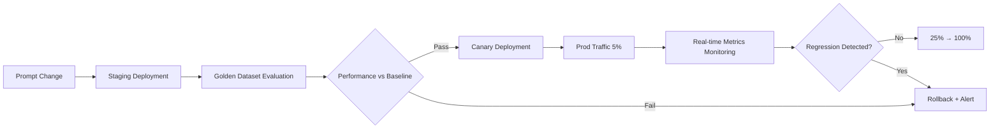

# Governance & Automation

## Regression Detection Integration

### Integration with Evaluation Framework

Use the **Golden Dataset** defined in [AIDLC Evaluation Framework](../../toolchain/evaluation-framework.md) to detect regression before deploying new versions.

**Workflow**:



---

### Baseline vs New Statistical Comparison

**Metrics**:
- **Accuracy**: Exact Match, F1, BLEU (translation)
- **Quality**: LLM-as-Judge score (0-1)
- **Latency**: P50, P99
- **Cost**: Token usage

**Statistical Testing**:

```python
from scipy.stats import ttest_ind

# baseline: Exact Match scores of 100 old version samples
baseline_scores = [...]  # Example: average 0.82

# new: 100 new version samples
new_scores = [...]  # Example: average 0.85

t_stat, p_value = ttest_ind(baseline_scores, new_scores)

if p_value < 0.05 and mean(new_scores) > mean(baseline_scores):
    print("New version statistically significantly superior → Approve deployment")
elif mean(new_scores) < mean(baseline_scores) * 0.95:
    print("New version degraded by 5% or more → Rollback")
else:
    print("No significant difference → Additional validation needed")
```

---

### Automatic Rollback Triggers

**Conditions**:
1. **Absolute accuracy drop**: `new_exact_match < baseline_exact_match - 0.05`
2. **Latency regression**: `new_p99_latency > baseline_p99_latency * 1.5`
3. **Error rate increase**: `new_error_rate > 5%`
4. **User feedback**: `thumbs_down_rate > 20%`

**Implementation**:

```yaml
# Prometheus Alert
- alert: PromptRegressionDetected
  expr: |
    langfuse_eval_exact_match{prompt_version="6"} 
    < langfuse_eval_exact_match{prompt_version="5"} - 0.05
  for: 30m
  annotations:
    summary: "Prompt v6 accuracy degradation → Automatic rollback"
  # Webhook → Lambda → Langfuse API (revert production label to v5)
```

---

## Operational Governance

### Change Approval Workflow

**AIDLC Checkpoints** Application:

| Stage | Checkpoint | Approver | Criteria |
|-------|-----------|----------|----------|
| 1. Prompt Change Proposal | `[Answer]:` | Domain Expert | Specify intent and risk assessment |
| 2. Staging Evaluation Result | Pass Regression Detection | Lead Engineer | Exact Match ≥ baseline - 2% |
| 3. Canary 5% Deployment | Real-time Metrics Review | SRE | Error rate < 1%, P99 latency ≤ 1.2x |
| 4. Prod 100% Switch | Final Approval | Product Owner | Verify business metric improvement |

**Approval Automation (GitHub Actions + Langfuse)**:

```yaml
# .github/workflows/prompt-approval.yml
name: Prompt Approval
on:
  pull_request:
    paths:
      - 'prompts/**'
jobs:
  evaluate:
    runs-on: ubuntu-latest
    steps:
      - uses: actions/checkout@v4
      - name: Run Golden Dataset Eval
        run: |
          python scripts/eval_prompt.py --new-version ${{ github.sha }}
      - name: Post Results
        uses: actions/github-script@v7
        with:
          script: |
            const results = require('./eval_results.json');
            if (results.exact_match < results.baseline - 0.02) {
              core.setFailed('Regression detected: Exact Match degradation');
            }
            github.rest.issues.createComment({
              issue_number: context.issue.number,
              body: `### Evaluation Results\n- Baseline: ${results.baseline}\n- New: ${results.exact_match}\n- Decision: ${results.pass ? '✅ Approved' : '❌ Rejected'}`
            });
```

---

### Change Records (Audit Log)

**Langfuse**: All prompt changes are automatically recorded in version history. Additionally:

```python
# Record metadata on change
client.create_prompt(
    name="financial-analysis",
    prompt="...",
    labels=["production"],
    metadata={
        "changed_by": "jane@example.com",
        "jira_ticket": "AIDLC-1234",
        "approval": "approved_by_john_2026-04-17",
        "rollback_plan": "revert to v5 if error_rate > 5%"
    }
)
```

**AWS CloudTrail**: When using Bedrock Prompt Management

```json
{
  "eventName": "UpdatePromptAlias",
  "userIdentity": {
    "principalId": "AIDAI...",
    "arn": "arn:aws:iam::123456789012:user/jane"
  },
  "requestParameters": {
    "promptIdentifier": "fin-analysis",
    "aliasIdentifier": "PROD",
    "promptVersion": "6"
  },
  "eventTime": "2026-04-17T14:30:00Z"
}
```

---

### Rollback Plan Required

Attach **Rollback Plan** to all change requests:

```markdown
## Rollback Plan

**Trigger**: Error rate > 3% within 30 minutes after deployment

**Steps**:
1. Revert `production` label to v5 in Langfuse
2. Restart Gateway (pod restart unnecessary, Langfuse SDK polls every 30 seconds)
3. Alert to Slack #incident channel
4. Write PostMortem (root cause, prevention measures)

**Validation**:
- Verify error rate < 1% recovery
- Monitor for 5 minutes then close incident
```

---

### Audit Evidence

**Audit evidence** required in financial, medical, etc. sectors:

| Item | Record Location | Retention Period |
|------|----------------|------------------|
| Prompt Version | Langfuse DB (S3+KMS) | 7 years |
| Model Version | Inference Log (trace) | 7 years |
| Approval Record | GitHub PR + JIRA | 7 years |
| Evaluation Result | Braintrust/Langfuse Eval | 3 years |
| User Session | Langfuse Trace | 1 year |
| Rollback Event | CloudTrail + PagerDuty | 7 years |

**Example Query (Auditor Request Response)**:

```sql
-- "Who deployed prompt v6 on April 17, 2026 at 2pm?"
SELECT version, metadata->>'changed_by', metadata->>'jira_ticket', created_at
FROM langfuse_prompts
WHERE name = 'financial-analysis'
  AND created_at BETWEEN '2026-04-17 14:00:00' AND '2026-04-17 15:00:00';
```

---

## AIDLC Stage-Specific Application

### Construction Phase

**Code Review Prompts Together with Code**:

```
repo/
  src/
    agents/
      financial_analyst.py
  prompts/
    financial_analysis_v5.txt  # ← Version control prompts too
  tests/
    test_financial_analyst.py  # Golden Dataset evaluation
```

**PR Template**:

```markdown
## Changes
- Prompt v5 → v6: Strengthened "conservative investment advisor" tone

## Evaluation Results
- Exact Match: 0.82 → 0.85 (+3%p)
- LLM-as-Judge: 0.78 → 0.81 (+3%p)
- Latency P99: 1.2s → 1.3s (10% increase, within acceptable range)

## Rollback Plan
- Trigger: Error rate > 3%
- Action: Langfuse production label → v5 recovery

## Approval
- [x] Domain Expert (jane@) approved
- [x] Golden Dataset evaluation passed
- [ ] Awaiting SRE approval
```

---

### Operations Phase

**Progressive Rollout + Real-time Regression Detection**:

| Time | Deployment Ratio | Monitoring |
|------|-----------------|------------|
| D+0 14:00 | Start Canary 5% | CloudWatch dashboard real-time |
| D+0 16:00 | Error rate 0.8% ✅ | Expand to 25% |
| D+0 20:00 | Error rate 1.2% ✅ | Expand to 50% |
| D+1 10:00 | Error rate 0.9% ✅ | Switch to 100% |
| D+1 14:00 | **Error rate 5.2% ❌** | **Automatic rollback triggered** |
| D+1 14:05 | Rollback complete, v5 recovered | Write Incident PostMortem |

**Real-time Dashboard (Grafana)**:

```promql
# Canary vs Control error rate
rate(llm_errors_total{prompt_version="6"}[5m]) 
/ rate(llm_requests_total{prompt_version="6"}[5m])

# Latency P99
histogram_quantile(0.99, 
  rate(llm_latency_bucket{prompt_version="6"}[5m])
)
```

---

## Automation Tool Integration

### Langfuse + Prometheus + Alertmanager

```yaml
# prometheus-rules.yaml
groups:
  - name: langfuse_regression
    interval: 1m
    rules:
      - alert: PromptVersionRegressionDetected
        expr: |
          langfuse_exact_match{prompt_version=~"v6"} 
          < on(prompt_name) langfuse_exact_match{prompt_version="v5"} - 0.05
        for: 30m
        labels:
          severity: critical
        annotations:
          summary: "Prompt v6 regression detected"
          description: "{{ $labels.prompt_name }} v6 Exact Match dropped 5%p or more compared to v5"
          
      - alert: LatencyRegressionDetected
        expr: |
          histogram_quantile(0.99, 
            rate(llm_latency_bucket{prompt_version="v6"}[10m])
          ) > 
          histogram_quantile(0.99, 
            rate(llm_latency_bucket{prompt_version="v5"}[10m])
          ) * 1.5
        for: 15m
        labels:
          severity: warning
        annotations:
          summary: "P99 Latency exceeds 1.5x"
```

### Lambda Automatic Rollback

```python
# lambda_rollback.py
import boto3
from langfuse import Langfuse

def lambda_handler(event, context):
    """
    Alertmanager Webhook → Lambda → Langfuse rollback
    """
    alert = event['alerts'][0]
    prompt_name = alert['labels']['prompt_name']
    current_version = alert['labels']['prompt_version']
    
    # Query previous version from Langfuse
    client = Langfuse()
    versions = client.list_prompt_versions(prompt_name)
    previous_version = int(current_version.replace('v', '')) - 1
    
    # Rollback production label to previous version
    client.update_prompt_label(
        prompt_name, 
        version=previous_version, 
        label="production"
    )
    
    # Slack notification
    slack_webhook(
        f"🔴 Automatic rollback executed: {prompt_name} recovered to v{previous_version}"
    )
    
    return {"status": "rolled_back", "version": previous_version}
```

---

## References

### AIDLC Related Documents
- [Evaluation Framework](../../toolchain/evaluation-framework.md) — Golden Dataset-based regression detection
- [Agent Monitoring](../../../agentic-ai-platform/operations-mlops/agent-monitoring.md) — Real-time observability

### Monitoring & Alerting
- **Prometheus**: [prometheus.io](https://prometheus.io/)
- **Grafana**: [grafana.com](https://grafana.com/)
- **Alertmanager**: [prometheus.io/docs/alerting](https://prometheus.io/docs/alerting/latest/alertmanager/)

### Statistical Testing
- **scipy.stats**: [docs.scipy.org/doc/scipy/reference/stats.html](https://docs.scipy.org/doc/scipy/reference/stats.html)
- **Statsmodels**: [statsmodels.org](https://www.statsmodels.org/)

---

## Next Steps

Once you've built the governance system:

1. **[Prompt & Model Registry](./prompt-model-registry.md)** — Build version control system
2. **[Deployment Strategies](./deployment-strategies.md)** — Implement Canary/Shadow strategies
3. **[Agent Monitoring](../../../agentic-ai-platform/operations-mlops/agent-monitoring.md)** — Build Langfuse + Prometheus integrated observability
