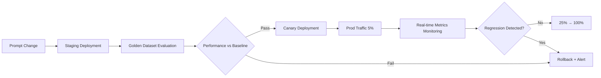

## Regression Detection Integration

### Integration with Evaluation Framework

Use the **Golden Dataset** in [AIDLC Evaluation Framework](../../toolchain/evaluation-framework.md) to compare the existing and candidate versions. Check accuracy, latency and cost on the same cases before deciding whether to deploy.

**Workflow**:


```mermaid
graph LR
    A[Prompt Change] --> B[Staging Deployment]
    B --> C[Golden Dataset Evaluation]
    C --> D{Performance vs Baseline}
    D -->|Pass| E[Canary Deployment]
    D -->|Fail| F[Rollback + Alert]
    E --> G[Prod Traffic 5%]
    G --> H[Real-time Metrics Monitoring]
    H --> I{Regression Detected?}
    I -->|No| J[25% → 100%]
    I -->|Yes| F
```

---

### Baseline vs New Statistical Comparison

**Metrics**:
- **Accuracy**: Exact Match, F1, BLEU (translation)
- **Quality**: LLM-as-Judge score (0-1)
- **Latency**: P50, P99
- **Cost**: Token usage

**Statistical Testing**:

When both versions solve the same cases in the same dataset revision, compare each pair of results. This is a paired design. The **exact McNemar test** below applies to one correct/incorrect (1/0) result per case, assuming the cases are independent.

Repeated runs of one case or related task families can be correlated; do not count them as independent samples. Predefine an analysis that groups those observations appropriately. For continuous paired scores, consider `ttest_rel` when its assumptions hold; for independent samples, consider an appropriate test such as `ttest_ind(..., equal_var=False)`.

```python
# paired-exact-match.py — independent cases, paired by stable case ID
from math import comb
from statistics import mean

def compare_exact_match(baseline, candidate):
    # Inputs: nonempty {case_id: 0 or 1} mappings from the same dataset revision.
    if (not isinstance(baseline, dict) or not isinstance(candidate, dict)
            or not baseline or baseline.keys() != candidate.keys()):
        raise ValueError("Both versions must contain the same nonempty case IDs")
    for results in (baseline, candidate):
        for case_id, score in results.items():
            if (not isinstance(case_id, str) or not case_id
                    or type(score) not in (int, float) or score not in (0, 1)):
                raise ValueError("Exact Match requires a case ID and a binary score")
    lost = sum(baseline[k] == 1 and candidate[k] == 0 for k in baseline)
    gained = sum(baseline[k] == 0 and candidate[k] == 1 for k in baseline)
    discordant = lost + gained
    # Exact two-sided McNemar test: conditional binomial test of discordant pairs.
    p_value = (1.0 if discordant == 0 else min(
        1.0, 2 * sum(comb(discordant, k)
                     for k in range(min(lost, gained) + 1)) / (1 << discordant)))
    old_mean, new_mean = mean(baseline.values()), mean(candidate.values())
    return {"baseline": old_mean, "exact_match": new_mean,
            "delta_percentage_points": 100 * (new_mean - old_mean),
            "paired_p_value": p_value, "sample_count": len(baseline)}
```

`paired_p_value` is supporting evidence about equal success probabilities, not deployment approval. Review effect size, uncertainty, safety/cost checks and human approval together. The proposed policy permits a staging degradation of at most **0.02 absolute (two percentage points)**; the operational regression alert uses a degradation **greater than 0.05 absolute (five percentage points)**. These gates have different purposes.

---

### Automatic Rollback Triggers

**Conditions**:
1. **Absolute accuracy drop**: `new_exact_match < baseline_exact_match - 0.05`
2. **Latency regression**: `new_p99_latency > baseline_p99_latency * 1.5`
3. **Error rate increase**: `new_error_rate > 5%`
4. **User feedback**: `thumbs_down_rate > 20%`

**Implementation**:

These metrics use a proposed exporter contract: `langfuse_eval_exact_match` exposes a completed 0–1 score for each `(project, prompt_name, dataset_id, prompt_version)` from the same evaluation revision. Version labels consistently use numeric strings such as `"6"` and `"5"`. Duplicate scrape replicas must expose the same logical score; `max by` only deduplicates those replicas, rather than pooling different runs or sample populations.

```yaml
# Proposed rule fragment; use inside a Prometheus rule group's rules list.
- alert: PromptRegressionDetected
  # 1e-12 is a numerical boundary tolerance for finite scores in [0, 1].
  expr: |
    max by (project, prompt_name, dataset_id) (
      langfuse_eval_exact_match{prompt_version="5"}
    )
    - on (project, prompt_name, dataset_id)
    max by (project, prompt_name, dataset_id) (
      langfuse_eval_exact_match{prompt_version="6"}
    ) > (0.05 + 1e-12)
  for: 30m
  labels:
    prompt_version: "6"
  annotations:
    summary: "Candidate Exact Match is more than five percentage points below baseline"
  # Alertmanager routes a request to the authenticated rollback controller.
```

An absent alert or empty comparison vector is not a pass. Separate health checks must verify both versions for every expected cohort, minimum sample counts, evaluation freshness, finite scores and replica agreement; missing or conflicting evidence holds promotion. `for: 30m` is continuous alert-condition persistence, not rollback execution time or a success guarantee.

---

## Operational Governance

### Change Approval Workflow

The following roles and thresholds are a **proposed organizational policy**, not official AI-DLC stage definitions. Retain the official approval checkpoints and separately configure reviewer authority and exception approval. The inspected [v0.1.7 Operations rules](https://raw.githubusercontent.com/awslabs/aidlc-workflows/v0.1.7/aidlc-rules/aws-aidlc-rule-details/operations/operations.md) are a placeholder for future operational stages.

| Stage | Checkpoint | Approver | Criteria |
|-------|-----------|----------|----------|
| 1. Prompt Change Proposal | `[Answer]:` | Domain Expert | Specify intent and risk assessment |
| 2. Staging Evaluation Result | Pass Regression Detection | Lead Engineer | Exact Match ≥ baseline - 0.02 (two percentage points) |
| 3. Canary 5% Deployment | Real-time Metrics Review | SRE | Error rate < 1%, P99 latency ≤ 1.2x |
| 4. Prod 100% Switch | Final Approval | Product Owner | Verify business metric improvement |

**Approval Automation (GitHub Actions + Langfuse)**:

The project supplies `eval_prompt.py` and its dependencies. Its result contract contains `schema_version: 1`, `evaluated_sha` for the evaluated PR head, `complete: true`, finite 0–1 `baseline`/`exact_match`, and integer `sample_count`. Checkout, `--new-version` and `EXPECTED_SHA` all use the same PR head SHA. The evaluator must verify that the actual checked-out commit matches the argument, and record the executed dataset manifest's immutable identity/hash, case count and completeness in the result. Mismatches or missing evidence must fail; copying the requested SHA into the result is insufficient. The reporting step does not recompute the dataset manifest. The 100-case minimum and 0.02 margin are example policies. Artifact assertions alone are not independent evaluation evidence.

```yaml
# .github/workflows/prompt-approval.yml — project integration scaffold
name: Prompt Approval
on:
  pull_request:
    paths:
      - 'prompts/**'
permissions:
  contents: read
jobs:
  evaluate:
    runs-on: ubuntu-latest
    steps:
      - uses: actions/checkout@v4
        with:
          ref: ${{ github.event.pull_request.head.sha }}
      - name: Run Golden Dataset Eval
        run: python scripts/eval_prompt.py --new-version "${{ github.event.pull_request.head.sha }}"
      - uses: actions/upload-artifact@v4
        if: ${{ always() }}
        with:
          name: prompt-evaluation
          path: eval_results.json
          if-no-files-found: error
  report:
    needs: evaluate
    if: ${{ !cancelled() }}
    runs-on: ubuntu-latest
    permissions:
      contents: read
      issues: write
    steps:
      - uses: actions/download-artifact@v4
        continue-on-error: true
        with:
          name: prompt-evaluation
          path: eval-artifact
      - name: Validate and report
        id: gate
        uses: actions/github-script@v7
        env:
          EXPECTED_SHA: ${{ github.event.pull_request.head.sha }}
          EVALUATION_JOB_RESULT: ${{ needs.evaluate.result }}
        with:
          script: |
            // approval-gate.js — trusted reporting code; parse artifacts as data only
            const fs = require('node:fs');
            let decision = 'REJECTED';
            let reason = 'Evaluation results are unavailable or invalid';
            let summary = '';
            try {
              const file = 'eval-artifact/eval_results.json';
              const stat = fs.statSync(file);
              if (!stat.isFile() || stat.size > 65536) throw new Error('Invalid artifact size');
              const r = JSON.parse(fs.readFileSync(file, 'utf8'));
              const score = value => typeof value === 'number'
                && Number.isFinite(value) && value >= 0 && value <= 1;
              if (!/^[0-9a-f]{40}$/.test(process.env.EXPECTED_SHA || '')
                  || !r || Array.isArray(r) || r.schema_version !== 1
                  || r.complete !== true || !score(r.baseline) || !score(r.exact_match)
                  || !Number.isSafeInteger(r.sample_count) || r.sample_count < 100
                  || r.evaluated_sha !== process.env.EXPECTED_SHA
                  || process.env.EVALUATION_JOB_RESULT !== 'success') {
                throw new Error('Invalid, incomplete, stale, or failed evaluation');
              }
              // One local policy: at most a two-percentage-point staging degradation.
              const drop = r.baseline - r.exact_match;
              const passes = drop <= 0.02 + 4 * Number.EPSILON;
              decision = passes ? 'METRIC_GATE_PASSED' : 'REJECTED';
              reason = passes ? 'Staging metric policy met; human approval remains required'
                              : 'Exact Match degradation exceeds two percentage points';
              summary = `\n- Baseline: ${r.baseline}\n- New: ${r.exact_match}`;
            } catch (error) {
              // Do not echo untrusted artifact contents or treat parsing errors as a pass.
              reason = 'Missing, malformed, incomplete, or failed evaluation; inspect artifacts';
            }
            if (decision !== 'METRIC_GATE_PASSED') core.setFailed(reason);
            core.setOutput('decision', decision);
            try {
              await github.rest.issues.createComment({
                owner: context.repo.owner,
                repo: context.repo.repo,
                issue_number: context.issue.number,
                body: `### Evaluation Results\n- Decision: ${decision}\n- ${reason}${summary}`
              });
            } catch (error) {
              core.setFailed('Evaluation report could not be posted; promotion remains blocked');
            }
```

The evaluation job has read permissions only; the reporting job reads JSON without checking out or executing PR code. Protect the reporting logic through a trusted base/required workflow. Runs without write permission, such as fork PRs, need an authorized reporting path; do not hide comment failures as passes. Actual promotion must require a successful `report` job, the same decision, matching SHA and designated reviewer approval in a protected environment. Repository branch/environment protections must be configured and verified separately; neither YAML nor a comment supplies them. This example does not deploy.

---

### Change Records (Audit Log)

**Langfuse**: This candidate-creation example uses the [`create_prompt` contract in the Python SDK source](https://raw.githubusercontent.com/langfuse/langfuse-python/main/langfuse/_client/client.py) read on 2026-09-19. Use supported `config` and `commit_message` fields instead of `metadata`, and pin an installed SDK version after checking this signature. Prompt-version history and authorization to promote a version are distinct records.

```python
# prompt-candidate.py — supply an authenticated, project-scoped client
candidate = client.create_prompt(
    name="financial-analysis",
    type="text",
    prompt="...",
    labels=["staging"],
    config={
        "change_request": "AIDLC-1234",
        "approval_record_ref": "pending",
        "rollback_policy_ref": "financial-analysis-policy-v1"
    },
    commit_message="AIDLC-1234: candidate for evaluation"
)
candidate_version = candidate.version  # Persist the returned version; do not guess it.
```

A string such as `approval_record_ref` is not authorization. Verify a separate approval record bound to the authenticated actor, project and change SHA before moving the production label.

**AWS CloudTrail**: Bedrock Prompt Management's [CreatePromptVersion](https://docs.aws.amazon.com/bedrock/latest/APIReference/API_agent_CreatePromptVersion.html) creates a static prompt-version snapshot. The inspected `bedrock-agent` service model has no `UpdatePromptAlias` operation. This JSON is an **illustrative CloudTrail event excerpt** using a documented operation and input identifier; it is not a collected log or verification of the complete CloudTrail event schema.

```json
{
  "eventSource": "bedrock.amazonaws.com",
  "eventName": "CreatePromptVersion",
  "userIdentity": {
    "principalId": "EXAMPLE-PRINCIPAL",
    "arn": "arn:aws:iam::123456789012:role/example-prompt-publisher"
  },
  "requestParameters": {
    "promptIdentifier": "ABCDEFGHIJ",
    "description": "Candidate snapshot for AIDLC-1234"
  },
  "eventTime": "2026-04-17T14:30:00Z"
}
```

Retain the version ARN returned by the operation. Change the application's production-to-version-ARN mapping in its actual configuration store and audit that store's change event separately. Creating a version does not switch traffic.

---

### Rollback Plan Required

Attach **Rollback Plan** to all change requests:

```markdown
## Rollback Plan

**Trigger**: Error rate > 3% within 30 minutes after deployment

**Steps**:
1. Revert `production` label to v5 in Langfuse
2. Propagate the version using the deployed SDK's cache TTL, refresh and fallback policy; verify the prompt version actually used by each client
3. Alert to Slack #incident channel
4. Write PostMortem (root cause, prevention measures)

**Validation**:
- Verify error rate < 1% recovery
- Five minutes is an example observation minimum; the incident owner checks sufficient traffic, all client versions, in-flight work/fallbacks and error/latency recovery before closure
```

The inspected [Langfuse caching documentation](https://langfuse.com/docs/prompt-management/features/caching) gives a default TTL of 60 seconds. After expiry, a request can receive a stale value while background revalidation runs; this is not unconditional 30-second polling or a guarantee that every client refreshes within a fixed time. A supported `cache_ttl_seconds=0` read can verify the registry but does not clear other processes' caches.

---

### Audit Evidence

**Proposed audit-evidence policy:** the seven-, three- and one-year periods below are examples for review, not verified statutory duties. Determine the actual jurisdiction, record class and approved organizational policy, including authority, access/deletion, legal holds and cost. This document makes no new legal determination.

| Item | Record Location | Retention Period |
|------|----------------|------------------|
| Prompt Version | Langfuse DB + separately configured archive | 7 years |
| Model Version | Inference Log (trace) | 7 years |
| Approval Record | GitHub PR + JIRA | 7 years |
| Evaluation Result | Braintrust/Langfuse Eval | 3 years |
| User Session | Langfuse Trace | 1 year |
| Rollback Event | CloudTrail + PagerDuty | 7 years |

**Example Query (Auditor Request Response)**:

This is a minimal schema for an **application-owned event store**, not an assumption about Langfuse's internal tables. The server records the authenticated actor and approval reference when the label change is verified, using UTC. Prompt creation time does not substitute for promotion time, and registry-label verification is distinct from traffic recovery.

```sql
-- Application-owned append-only event schema, NOT Langfuse's internal schema.
CREATE TABLE prompt_deployment_events (
    event_id text PRIMARY KEY,
    project_id text NOT NULL,
    prompt_name text NOT NULL,
    to_version integer NOT NULL,
    label text NOT NULL,
    event_type text NOT NULL,
    actor_subject text NOT NULL,
    approval_record_ref text NOT NULL,
    occurred_at timestamptz NOT NULL
);

SELECT to_version, actor_subject, approval_record_ref, occurred_at
FROM prompt_deployment_events
WHERE project_id = 'financial-demo'
  AND prompt_name = 'financial-analysis'
  AND to_version = 6 AND label = 'production'
  AND event_type = 'label_promotion_verified'
  AND occurred_at >= TIMESTAMPTZ '2026-04-17 14:00:00+00'
  AND occurred_at <  TIMESTAMPTZ '2026-04-17 15:00:00+00'
ORDER BY occurred_at, event_id;
```

---

## AIDLC Stage-Specific Application

### Construction Phase

**Code Review Prompts Together with Code**:

```
repo/
  src/
    agents/
      financial_analyst.py
  prompts/
    financial_analysis_v5.txt  # ← Version control prompts too
  tests/
    test_financial_analyst.py  # Golden Dataset evaluation
```

**PR template (illustrative measurements and checkbox states)**:

```markdown
## Changes
- Prompt v5 → v6: Strengthened "conservative investment advisor" tone

## Evaluation Results
- Exact Match: 0.82 → 0.85 (+3%p)
- LLM-as-Judge: 0.78 → 0.81 (+0.03 on a 0–1 score scale)
- Latency P99: 1.2s → 1.3s (approximately 8.33% increase, within the example 1.2x limit)

## Rollback Plan
- Trigger: Error rate > 3%
- Action: Langfuse production label → v5 recovery

## Approval
- [x] Domain Expert (jane@) approved
- [x] Golden Dataset evaluation passed
- [ ] Awaiting SRE approval
```

---

### Operations Phase

**Progressive rollout and regression detection (hypothetical scenario):** promotion depends on traffic volume, P99, error rate and human approval, not the clock alone. The 3%/5% error thresholds and 15-/30-minute persistence windows are different policies; the error-rate detector and routing need their own implementation.

| Time | Deployment Ratio | Monitoring |
|------|-----------------|------------|
| D+0 14:00 | Start Canary 5% | CloudWatch dashboard real-time |
| D+0 16:00 | Error rate 0.8% ✅ | Expand to 25% |
| D+0 20:00 | Error rate 1.2% — gate failed | Hold at 25%; investigate |
| D+1 10:00 | Error rate 0.9% — error gate only | Verify other gates/approval before 50%, then consider 100% |
| D+1 14:00 | **Error rate 5.2% — recovery action needed** | Request rollback after configured detector/policy authorization |
| D+1 14:05 | Example check time — recovery unconfirmed | Verify label, client propagation and traffic; keep incident open |

**Real-time Dashboard (Grafana)**:

```promql
# Candidate error rate: aggregate matching counters across instances.
(
  sum by (project, prompt_name) (rate(llm_errors_total{prompt_version="6"}[5m]))
  / sum by (project, prompt_name) (rate(llm_requests_total{prompt_version="6"}[5m]))
) and on (project, prompt_name)
(
  sum by (project, prompt_name) (rate(llm_requests_total{prompt_version="6"}[5m])) > 0
)

# Service-wide P99: preserve le until histogram_quantile.
histogram_quantile(0.99,
  sum by (le, project, prompt_name) (
    rate(llm_latency_bucket{prompt_version="6"}[5m])
  )
)
```

---

## Automation Tool Integration

### Langfuse + Prometheus + Alertmanager

```yaml
# prometheus-rules.yaml — apply the exporter/cardinality contract in the text
groups:
  - name: langfuse_regression
    interval: 1m
    rules:
      - alert: PromptVersionRegressionDetected
        # 1e-12 is a numerical boundary tolerance for finite scores in [0, 1].
        expr: |
          max by (project, prompt_name, dataset_id) (
            langfuse_eval_exact_match{prompt_version="5"}
          )
          - on (project, prompt_name, dataset_id)
          max by (project, prompt_name, dataset_id) (
            langfuse_eval_exact_match{prompt_version="6"}
          ) > (0.05 + 1e-12)
        for: 30m
        labels:
          severity: critical
          prompt_version: "6"
        annotations:
          summary: "Candidate Exact Match regression"
          description: "{{ $labels.prompt_name }}: decrease exceeds five percentage points"

      - alert: LatencyRegressionDetected
        expr: |
          histogram_quantile(0.99,
            sum by (le, project, prompt_name) (
              rate(llm_latency_bucket{prompt_version="6"}[10m])
            )
          ) > on (project, prompt_name)
          histogram_quantile(0.99,
            sum by (le, project, prompt_name) (
              rate(llm_latency_bucket{prompt_version="5"}[10m])
            )
          ) * 1.5
        for: 15m
        labels:
          severity: warning
          prompt_version: "6"
        annotations:
          summary: "Candidate P99 exceeds 1.5 times baseline"
```

### Lambda Automatic Rollback

This is a **controller scaffold for one alert**. An authenticated receiver must validate and dispatch each alert in a batch rather than acting only on the first. `control.claim()` is a mandatory project implementation: webhook authentication, project authorization, active-alert freshness/deployment revision checks, serialization/leases shared by every promotion writer, durable event deduplication, an approved last-known-good target and failure reconciliation. Without those controls this example is not executable.

```python
# rollback-controller.py — project control-plane hooks are mandatory
def rollback_prompt(alert, *, client, control):
    if (not isinstance(alert, dict) or alert.get("status") != "firing"
            or not isinstance(alert.get("labels"), dict)):
        return {"status": "ignored"}
    labels = alert["labels"]
    if not all(isinstance(labels.get(k), str) and labels[k]
               for k in ("project", "prompt_name", "prompt_version")):
        raise ValueError("Missing rollback identity")
    version_text = labels["prompt_version"]
    if not version_text.isascii() or not version_text.isdecimal():
        raise ValueError("Expected a numeric prompt version")
    expected = int(version_text)
    if expected < 1:
        raise ValueError("Invalid prompt version")

    # claim() authenticates the event, checks tenant/active-alert freshness,
    # and serializes ALL production-label writers for this project/prompt.
    # It durably deduplicates events and loads the approved recovery plan.
    with control.claim(alert) as attempt:
        if attempt.completed_result is not None:
            return attempt.completed_result
        if (attempt.project != labels["project"]
                or attempt.prompt_name != labels["prompt_name"]
                or attempt.expected_version != expected
                or type(attempt.target_version) is not int
                or attempt.target_version < 1
                or attempt.target_version == expected
                or not attempt.approval_record_ref):
            raise ValueError("Recovery plan does not match the authorized event")
        current = client.get_prompt(
            labels["prompt_name"], label="production", cache_ttl_seconds=0)
        if current.version != expected:
            return attempt.record({"status": "stale_event"})
        target = client.get_prompt(
            labels["prompt_name"], version=attempt.target_version,
            cache_ttl_seconds=0)
        if target.version != attempt.target_version:
            raise ValueError("Approved recovery target is unavailable")
        attempt.record_intent()  # Durable before the external write.
        try:
            client.update_prompt(
                name=labels["prompt_name"], version=attempt.target_version,
                new_labels=["production"])
            observed = client.get_prompt(
                labels["prompt_name"], label="production", cache_ttl_seconds=0)
            if observed.version != attempt.target_version:
                raise RuntimeError("Registry label verification failed")
        except Exception:
            # Timeouts can occur after a successful write: reconcile the intent.
            attempt.mark_uncertain()
            raise
        return attempt.record({
            "status": "registry_label_verified",
            "version": attempt.target_version,
            "traffic_recovery": "pending"})
```

SDK calls are limited to the inspected [`get_prompt`/`update_prompt` contracts](https://raw.githubusercontent.com/langfuse/langfuse-python/main/langfuse/_client/client.py). Bind the client to the authorized project credentials and the approved target to immutable artifacts/policy. The label API is not a repository-wide compare-and-swap; concurrency safety requires all writers to use the same control boundary. Reconcile the intent and actual label after a timeout before deciding whether to retry. The return value confirms only the registry label; client propagation, recovered error rates and notification delivery are separate evidence.

---

## References

### AIDLC Related Documents
- [Evaluation Framework](../../toolchain/evaluation-framework.md) — Golden Dataset-based regression detection
- [Agent Monitoring](../../../agentic-ai-platform/operations-mlops/observability/agent-monitoring.md) — Real-time observability

### Monitoring & Alerting
- **Prometheus**: [prometheus.io](https://prometheus.io/)
- **Grafana**: [grafana.com](https://grafana.com/)
- **Alertmanager**: [prometheus.io/docs/alerting](https://prometheus.io/docs/alerting/latest/alertmanager/)

### Statistical Testing
- **scipy.stats**: [docs.scipy.org/doc/scipy/reference/stats.html](https://docs.scipy.org/doc/scipy/reference/stats.html)
- **Statsmodels**: [statsmodels.org](https://www.statsmodels.org/)

---

## Next Steps

Once you've built the governance system:

1. **[Prompt & Model Registry](./prompt-model-registry.md)** — Build version control system
2. **[Deployment Strategies](./deployment-strategies.md)** — Implement Canary/Shadow strategies
3. **[Agent Monitoring](../../../agentic-ai-platform/operations-mlops/observability/agent-monitoring.md)** — Build Langfuse + Prometheus integrated observability
