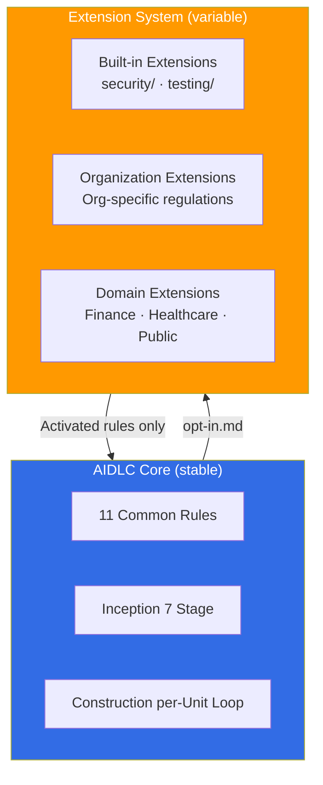
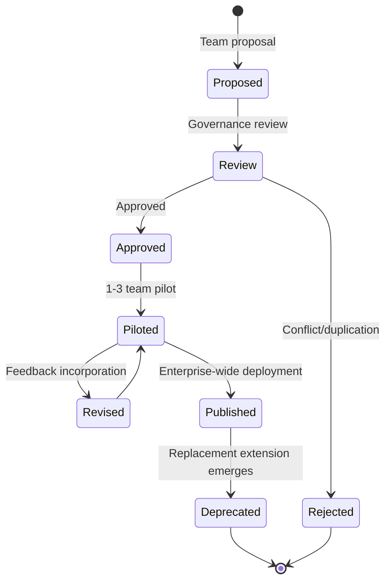

# Extension System

> 📅 **Written**: 2026-04-18 | ⏱️ **Reading Time**: ~15 minutes

AWS Labs [AIDLC Workflows](https://github.com/awslabs/aidlc-workflows) provides an **Extension System** that allows organizations to add **regulatory and domain-specific rules** beyond the official 5 principles and 11 Common Rules. This document covers Extension architecture, Built-in extensions, opt-in activation mechanism, and Korean enterprise (ISMS-P · financial regulations) application examples.

---

## 1. Overview: Why Extensions?

### 1.1 Core vs Extension Separation

AIDLC clearly separates the **stable methodology core** from **variable organizational rules**.



**Core Principles:**
- Core contains **minimum rules common to all organizations and industries**
- Extensions are **selectively applied by organization, industry, or project**
- **Presence and content of `opt-in.md` file determines activation**

### 1.2 Extension Benefits

| Benefit | Description | Example |
|---------|-------------|---------|
| **Regulatory Compliance** | Embed industry-specific laws/regulations into AIDLC workflows | Financial sector electronic financial supervision regulations |
| **Organization Standardization** | Separate team standards, templates, checklists into reusable modules | Architecture Decision Records (ADR) templates |
| **Gradual Adoption** | Adopt core methodology first, extend with organization-specific features later | Add compliance after MVP launch |
| **Tool Independence** | Extensions expressed in Markdown + YAML work across all AIDLC platforms | Kiro · Claude Code · Cursor |

---

## 2. Built-in Extensions

AWS Labs repository provides two **Built-in Extensions** by default: `security/` and `testing/`.

### 2.1 security/ Extension

**Purpose**: Integrate security requirement extraction, verification, and enforcement into AIDLC workflows.

**Key Rules:**
```yaml
# extensions/security/rules.yaml
security_extension:
  version: 0.1.0
  applies_to_stages:
    - requirements_analysis
    - application_design
    - construction.code_generation
    - construction.build_and_test

  rules:
    - id: SEC-001
      name: "Threat Modeling Required"
      stage: application_design
      action: "STRIDE-based threat modeling document mandatory"

    - id: SEC-002
      name: "Secrets Scanning"
      stage: construction.build_and_test
      action: "Automatically run git-secrets + truffleHog, block hardcoded credentials"

    - id: SEC-003
      name: "SAST Integration"
      stage: construction.build_and_test
      action: "Run at least one of Semgrep / Snyk / Checkov"

    - id: SEC-004
      name: "Dependency Vulnerability Check"
      stage: construction.build_and_test
      action: "Run OSV-Scanner or Trivy, block merge for Critical vulnerabilities"

    - id: SEC-005
      name: "Least Privilege IAM"
      stage: construction.infrastructure_design
      action: "IAM Policy must not use wildcard Resource (justification required for special cases)"
```

### 2.2 testing/ Extension

**Purpose**: Automatic test generation, coverage management, quality gate enforcement.

**Key Rules:**
```yaml
# extensions/testing/rules.yaml
testing_extension:
  version: 0.1.0
  applies_to_stages:
    - construction.functional_design
    - construction.code_generation
    - construction.build_and_test

  rules:
    - id: TEST-001
      name: "TDD First"
      stage: construction.code_generation
      action: "Generate test code before production code"

    - id: TEST-002
      name: "Minimum Coverage"
      stage: construction.build_and_test
      action: "Unit test coverage ≥ 80%, block Checkpoint Approval on failure"

    - id: TEST-003
      name: "Integration Test Required"
      stage: construction.build_and_test
      action: "Integration tests mandatory for external dependencies (DB, API)"

    - id: TEST-004
      name: "Acceptance Test Linkage"
      stage: construction.functional_design
      action: "Map Acceptance Tests to each Functional Requirement"
```

---

## 3. Opt-in Mechanism

### 3.1 opt-in.md File Structure

Extension activation is controlled by the **`opt-in.md`** file at the project root.

**Location**: `<project-root>/.aidlc/opt-in.md`

**File Structure:**
```markdown
# AIDLC Opt-in Extensions

**Project**: payment-service
**Updated**: 2026-04-18

## Enabled Extensions

### Built-in
- [x] security (version 0.1.0)
- [x] testing (version 0.1.0)

### Organization
- [x] org-lg-security (version 1.2.0) — LG CNS internal security standards
- [x] org-compliance-ismsp (version 2.1.0) — ISMS-P (Korean Personal Information & Information Security Management System) certification standards

### Domain
- [x] finance-korea (version 1.0.0) — Korean Electronic Financial Supervision Regulations

## Disabled Extensions (explicit rejection)

- [ ] healthcare-hipaa — N/A (financial service)
- [ ] public-sector-korea — N/A
```

### 3.2 Requirements Analysis Stage opt-in Questions

The AIDLC Requirements Analysis stage reads the `opt-in.md` file to check activated extensions. **If the file doesn't exist or no extensions are specified**, Common Rules rule 1 (Question Format) asks the user:

```markdown
Q. Select Extensions to apply to this project (multiple choice):

A. security only (default, recommended for all projects)
B. security + testing (standard, general production projects)
C. security + testing + organization regulations (enterprise)
D. C + industry regulations (finance/healthcare/public)
E. None (demo/PoC only, prohibited for production)

[Answer]:
```

**Auto-generation after response:**
- `[Answer]: C` → AIDLC adds security, testing, and organization extensions to `opt-in.md`

### 3.3 Extension Priority

When **conflicting rules** exist across multiple extensions, priority order:

```
1. Common Rules (highest priority, official specification)
2. Domain Extensions (industry regulations)
3. Organization Extensions (organization standards)
4. Built-in Extensions (security, testing)
5. Project-local overrides (lowest priority)
```

**Conflict Resolution Example:**
```
Common Rules 11: Reproducible — Recommends Temperature = 0
Organization Extension (finance): Allows Temperature = 0.1 (some creativity allowed)

→ Common Rules take priority → Force Temperature = 0
→ If organization truly needs this, must execute Common Rules waiver process
```

---

## 4. Organization Compliance Extension Examples

### 4.1 Korea ISMS-P Extension

**Background**: ISMS-P (Korean Personal Information & Information Security Management System) is a private certification requiring compliance with Korea information security laws. Virtually mandatory for public contracts and financial services entry.

**Extension Directory Structure:**
```
extensions/org-compliance-ismsp/
  rules.yaml
  templates/
    pia-template.md           # Privacy Impact Assessment (PIA)
    access-control-matrix.md
    incident-response-plan.md
  audit-mappings/
    ismsp-2.1.yaml           # ISMS-P 2.1 administrative controls
    ismsp-2.8.yaml           # Personal information processing stage requirements
```

**rules.yaml Example:**
```yaml
extension:
  name: org-compliance-ismsp
  version: 2.1.0
  description: ISMS-P 2.1 certification standards AIDLC integration
  applies_to:
    industries: [finance, public, healthcare]
    regions: [KR]

  rules:
    - id: ISMSP-2.5.1
      name: "User Account Management"
      stage: application_design
      common_rules_mapping: [checkpoint_approval, audit_logging]
      action: |
        Authentication/authorization design obligations:
        - Password policy (9+ characters, 3+ types)
        - Session timeout (auto logout after 10+ min inactivity)
        - Account lockout after 5 consecutive failed login attempts

    - id: ISMSP-2.8.2
      name: "Personal Information Processing Stage Requirements"
      stage: requirements_analysis
      action: |
        Specify requirements for all stages of personal information collection/use/provision/disposal:
        - Minimize collection items
        - Prohibit use beyond purpose
        - Encrypted storage (AES-256 or higher)
        - Automatic disposal after retention period

    - id: ISMSP-2.9.1
      name: "Incident Response"
      stage: operations.observability
      action: |
        Establish reporting system within 24 hours of security incident detection:
        - KISA reporting integration
        - Stakeholder notification
        - Forensic evidence preservation
```

### 4.2 Korea Financial Supervision Extension

**Background**: Electronic Financial Supervision Regulations (Financial Supervisory Service) and mandatory network separation/ISMS-P.

**rules.yaml Excerpt:**
```yaml
extension:
  name: finance-korea
  version: 1.0.0
  description: Korean Electronic Financial Supervision Regulations AIDLC integration
  applies_to:
    industries: [finance]
    regions: [KR]

  rules:
    - id: EFSR-8
      name: "Network Separation Obligation"
      stage: application_design
      action: |
        Development/business/operation network logical/physical separation design mandatory:
        - Separate VPC per EKS cluster
        - Prohibit direct internet access (via Egress proxy)
        - Allow access only via Bastion Host

    - id: EFSR-13
      name: "Sensitive Information Encryption"
      stage: construction.infrastructure_design
      action: |
        Card info/resident registration number/account number compliance standards:
        - Storage: AES-256 + KMS key separation
        - Transmission: TLS 1.3 or higher
        - Logs: Masking mandatory (6+ digits)

    - id: EFSR-DR
      name: "Disaster Recovery Obligation"
      stage: application_design
      action: |
        Disaster recovery center establishment mandatory (RTO ≤ 3 hours, RPO ≤ 24 hours):
        - Multi-AZ deployment
        - Cross-Region backup
        - DR drill at least once annually
```

---

## 5. Custom Extension Creation Guide

### 5.1 Directory Structure

```
extensions/<extension-name>/
  metadata.yaml          # Extension metadata (required)
  rules.yaml             # Rules to apply (required)
  templates/             # Artifact templates (optional)
    <template-name>.md
  audit-mappings/        # Audit/regulation mapping (optional)
    <regulation>.yaml
  scripts/               # Automation scripts (optional)
    validate.sh
  README.md              # Usage guide (required)
```

### 5.2 metadata.yaml Specification

```yaml
extension:
  name: org-lg-security
  version: 1.2.0
  description: "LG CNS internal security standards AIDLC integration"
  author: security-team@lgcns.com
  license: Proprietary
  created: 2026-02-15
  updated: 2026-04-10

  dependencies:
    - name: security        # Depends on Built-in security extension
      version: ">=0.1.0"

  conflicts: []             # List of conflicting extensions

  applies_to:
    stages: [requirements_analysis, application_design, construction, operations]
    industries: []          # Empty array = all industries
    regions: [KR]

  checksum: sha256:abc123... # Tampering prevention
```

### 5.3 rules.yaml Specification

```yaml
rules:
  - id: <UNIQUE-ID>
    name: "<Human-readable name>"
    description: "<Detailed rule description>"
    severity: [low | medium | high | critical]
    stage: <target stage>
    common_rules_mapping:
      - <common rule name>  # e.g.: checkpoint_approval
    action: |
      <Specific execution instructions, multi-line allowed>
    validation:
      command: <Automatic verification command>
      expected_exit_code: 0
    references:
      - url: https://example.com/regulation
        title: "Related regulation document"
```

### 5.4 Extension Testing

The following tests are mandatory before deploying new Extensions:

```bash
# 1. Syntax validation
aidlc extension validate extensions/<extension-name>/

# 2. Conflict checking
aidlc extension check-conflicts --existing opt-in.md --new <extension-name>

# 3. Pilot execution
aidlc run --pilot --extensions <extension-name> --input sample-request.md

# 4. Result comparison (diff against execution without extension)
diff .aidlc/baseline/ .aidlc/pilot/
```

---

## 6. Extension Governance

### 6.1 Extension Lifecycle



### 6.2 Extension Registry

Organizations operate internal Extension Registry to manage extensions:

```yaml
# internal-registry.yaml
registry:
  url: https://extensions.lgcns.internal/aidlc/
  extensions:
    - name: org-lg-security
      version: 1.2.0
      status: published
      owner: security-team
      reviewed_at: 2026-04-10

    - name: org-compliance-ismsp
      version: 2.1.0
      status: published
      owner: compliance-team
      reviewed_at: 2026-03-20

    - name: domain-banking-kr
      version: 0.5.0-beta
      status: piloted
      owner: banking-domain-team
      reviewed_at: 2026-04-05
```

### 6.3 Extension Monitoring Metrics

Measure whether Extensions actually provide value:

| Metric | Measurement Method | Target |
|--------|-------------------|---------|
| Adoption Rate | Projects with Extension enabled / Total projects | >80% |
| Rule Trigger Frequency | Monthly warning/error count per rule | Team vs organization average comparison |
| Regulatory Success Rate | Audit pass rate of Extension-applied projects | 100% |
| Development Speed Impact | Lead time before/after Extension application | ≤ 15% degradation allowed |

---

## 7. References

### Official Repositories
- [AWS Labs AIDLC Extensions](https://github.com/awslabs/aidlc-workflows/tree/main/aws-aidlc-rule-details/extensions) — Built-in extension sources
- [AWS Labs AIDLC Common Rules](https://github.com/awslabs/aidlc-workflows/tree/main/aws-aidlc-rule-details/common) — Common rules interacting with Extensions

### Related Documents
- [Common Rules](../methodology/common-rules.md) — 11 common rules applied with Extensions
- [Governance Framework](./governance-framework.md) — Governance integration of organization extensions
- [Adoption Strategy](./adoption-strategy.md) — Extension adoption sequence (Phase 1-4)
- [Audit & Governance Logging](../operations/audit-governance.md) — Extension rule trigger history auditing

### Regulatory References
- [KISA ISMS-P Certification Standards](https://isms.kisa.or.kr/) — ISMS-P 2.1/2.8/2.9 administrative controls
- [Electronic Financial Supervision Regulations (Financial Supervisory Service)](https://fss.or.kr/) — Network separation/encryption/disaster recovery obligations
- [Personal Information Protection Act Enforcement Decree](https://law.go.kr/) — Personal information processing obligations
