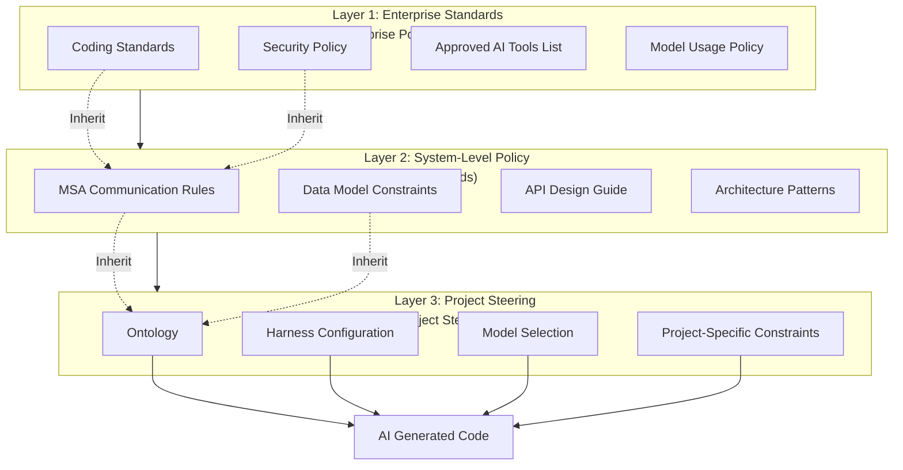
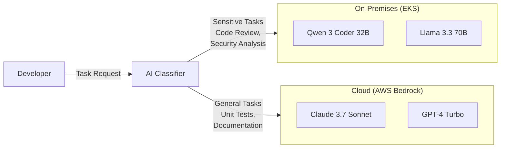

# Governance Framework

This document presents a governance framework for systematic management of AI-generated code quality, security, and compliance as AIDLC expands enterprise-wide.

## Need for Governance

### Challenges of AI Coding Agent Proliferation

As AI coding agents become core tools in development workflows, organizations face new governance challenges:

**Quality Consistency Issues**
- Different prompts and quality standards applied per project
- Generated code quality depends on prompt author capability
- Lack of means to automatically verify enterprise coding standard compliance

**Increased Security Risks**
- Need for automatic detection of AI-generated code security vulnerabilities
- Risk of sensitive code/data leaking to external AI services
- Indiscriminate use of unapproved AI tools

**Compliance Requirements**
- Need to respond to regulations like AI Act (Korea, 2026), EU AI Act
- Ensure traceability of AI-generated code
- Submit AI usage history during audits

**Scalability Limits**
- Duplicate investment when adopting independent AI tools per project
- Learning outcomes don't expand organization-wide
- Need balance between enterprise standards and project characteristics

### Role of Governance Framework

Systematic governance framework enables:

1. **Automated Policy Application**: Auto-inject enterprise standards through steering files
2. **Risk Minimization**: Protect sensitive information with data sovereignty policies
3. **Regulatory Compliance**: Systematic response to legal requirements like AI Act
4. **Continuous Improvement**: Policy refinement based on audit trail data

## 3-Layer Governance Model

AIDLC adopts a 3-layer governance model: Enterprise-System-Project.



### Layer 1: Enterprise Standards (Enterprise Policy)

Top-level policies applied commonly to all projects.

**Coding Standards**
- Style guides by language (e.g., Google Java Style Guide)
- Naming conventions, comment policies
- Code complexity ceiling (Cyclomatic Complexity ≤ 15)

**Security Policy**
- Prohibit OWASP Top 10 vulnerabilities (SQL Injection, XSS, etc.)
- Mandatory patterns for authentication/authorization implementation
- Prohibit logging sensitive information
- Prohibit hardcoded credentials

**Approved AI Tools List**
- Usable coding agents (Aider, Continue, Cursor, etc.)
- Approved LLM providers (AWS Bedrock, Azure OpenAI, etc.)
- Data classification vs usable model matrix

**Model Usage Policy**
- Code generation: GPT-4 Turbo / Claude 3.7 Sonnet / Qwen 3 Coder
- Security review: On-premises open weight models
- Documentation: Lightweight models like GPT-4o-mini

### Layer 2: System-Level Policy (System Architecture Standards)

Define architecture patterns for specific systems or domains.

**MSA Communication Rules**
```yaml
# Example: Microservices architecture standard
communication:
  sync: gRPC (internal), REST (external)
  async: Kafka (event-driven), SNS/SQS (cloud-native)
  circuit-breaker: Istio default enabled
  timeout: 3s (default), 30s (batch)
```

**Data Model Constraints**
- Entity definitions by domain (order, payment, shipping, etc.)
- Required attributes (created_at, updated_at, tenant_id)
- Foreign key naming rules

**API Design Guide**
- RESTful resource naming (`/orders/{orderId}/items`)
- HTTP method usage (GET: query, POST: create, PUT/PATCH: update, DELETE: delete)
- Pagination parameters (page, size, sort)
- Error response format (RFC 9457 Problem Details)

**Architecture Patterns**
- Repository pattern (data access layer)
- CQRS (read/write separation)
- Saga pattern (distributed transactions)

### Layer 3: Project-Level Steering (Project Steering Files)

Steering files containing project-specific AI directives.

**Ontology**
- Project domain terminology dictionary
- Relationships between entities (e.g., Order → OrderItem → Product)
- Prohibited terms (e.g., use "replica" instead of "slave")

See [Ontology](../methodology/ontology-engineering.md) for details.

**Harness Configuration**
- Quality Gate thresholds (code coverage ≥ 80%, code duplication ≤ 3%)
- Mandatory reviewers (1+ senior developer)
- Deployment approval policy (staged staging → production deployment)

See [Harness](../methodology/harness-engineering.md) for details.

**Model Selection**
```yaml
# Example: Project-level model routing
models:
  code_generation: Claude Sonnet 4.6  # Complex business logic
  code_review: qwen3-coder-32b-instruct         # On-premises security review
  test_generation: gpt-4o-mini                  # Unit test generation
  documentation: Claude Haiku 4.5      # Auto API documentation
```

**Project-Specific Constraints**
```yaml
# Example: Legacy integration constraints
legacy_integration:
  - Prohibited: JPA N+1 queries (must use fetch join)
  - Required: Transaction timeout within 5s
  - Prohibited: Synchronous HTTP calls (use async messaging)
```

## Steering File-Based Governance Automation

### What are Steering Files

Steering Files are project-specific constraint files injected into AI coding agents.

**Structure**
```
project-root/
  .aidlc/
    steering.yaml          # Project steering (Layer 3)
    system-standards.yaml  # Inherit system standards (Layer 2)
    enterprise-policy.yaml # Inherit enterprise standards (Layer 1)
  .aider/
    AIDLC-context.md       # Aider-specific context
  .continue/
    config.json            # Continue-specific configuration
  CLAUDE.md                # Claude Code-specific instructions
```

**steering.yaml Example**
```yaml
project: order-management-service
version: 2.1.0

# Layer 1: Inherit enterprise standards
inherits:
  - /enterprise/coding-standards/java-style-guide.yaml
  - /enterprise/security/owasp-top10-prevention.yaml

# Layer 2: Inherit system standards
system_standards:
  - /systems/msa-communication-rules.yaml
  - /systems/data-model-constraints.yaml

# Layer 3: Project-specific configuration
ontology:
  domain: e-commerce
  entities:
    - Order: Order entity (ID, customer, items, total, status)
    - OrderItem: Order item (ID, product, quantity, price)
  forbidden_terms:
    - master/slave → leader/follower
    - blacklist/whitelist → denylist/allowlist

harness:
  quality_gate:
    code_coverage: 80
    duplication: 3
    cognitive_complexity: 15
  mandatory_reviewers:
    - team: senior-backend
      min_approvals: 1

model_routing:
  code_generation: Claude Sonnet 4.6
  code_review: qwen3-coder-32b-instruct  # on-premises
  test_generation: gpt-4o-mini

constraints:
  - no_jpa_n_plus_1_query
  - transaction_timeout_5s
  - async_messaging_only
```

### Multi-LLM Steering

Optimize steering format for different LLM providers.

**Claude Code (CLAUDE.md)**
```markdown
# Project Instructions

## Domain Model
- Order: Order entity
- OrderItem: Order item

## Constraints
- Prohibit JPA N+1 queries (must use fetch join)
- Transaction timeout within 5 seconds
```

**Aider (.aider/AIDLC-context.md)**
```markdown
# AIDLC Context

You are working on an e-commerce order management service.

## Key Entities
- Order, OrderItem, Product

## Rules
- Always use fetch join to prevent N+1 queries
- Transaction timeout: 5 seconds
```

**Continue (.continue/config.json)**
```json
{
  "systemMessage": "You are an AI assistant for order-management-service. Follow JPA N+1 prevention rules and 5-second transaction timeout.",
  "models": [
    {
      "title": "Claude 3.7 Sonnet",
      "provider": "anthropic",
      "model": "Claude Sonnet 4.6"
    }
  ]
}
```

### Governance as Code

Manage steering files in Git repository to track change history and apply PR review.

**Git Workflow**
```bash
# Modify steering file
git checkout -b update-steering-file
vim .aidlc/steering.yaml

# Commit changes
git add .aidlc/steering.yaml
git commit -m "feat: add async messaging constraint"

# Create PR → Senior developer review → Merge after approval
gh pr create --title "Update steering file with async messaging rule"
```

**Automated Validation CI/CD**
```yaml
# .github/workflows/steering-validation.yml
name: Validate Steering File
on: [pull_request]
jobs:
  validate:
    runs-on: ubuntu-latest
    steps:
      - uses: actions/checkout@v4
      - name: Validate steering.yaml schema
        run: |
          yamllint .aidlc/steering.yaml
          python scripts/validate-steering-schema.py
      - name: Check policy inheritance
        run: |
          python scripts/check-policy-inheritance.py
```

**Version Management**
- Specify `version` field in steering file
- Increment major version for incompatible changes
- AI coding agents use compatible versions only

## Data Sovereignty & Residency

### Sensitive Code/Data Protection Requirements

In enterprise environments, the following data cannot be transmitted to external AI services:

- **Source Code**: Core business logic, algorithms
- **Database Schema**: Customer information, financial transaction structure
- **API Keys/Credentials**: Cloud resource access tokens
- **Personal Information**: Data subject to GDPR, PIPA

### Hybrid Model Architecture

Handle sensitive tasks with on-premises open weight models, general tasks with cloud APIs.



**Sensitive Tasks (On-Premises)**
- Code security review (SAST result analysis)
- Log analysis potentially containing personal information
- Database migration script generation

**General Tasks (Cloud)**
- Unit test generation
- Auto API documentation
- Refactoring suggestions (after removing sensitive info)

### Data Classification System

Restrict AI tool usage according to organizational data classification policy.

| Data Classification | Definition | Allowed AI Tools | Example |
|------------|------|-------------|------|
| **Public** | Can be publicly disclosed | All cloud AI | Open source library code |
| **Internal** | Can be disclosed to employees | Cloud AI (vendors with data processing agreement) | Internal utility functions |
| **Confidential** | Specific team access only | On-premises open weight models | Business logic, DB schema |
| **Top Secret** | Executives/security team only | No AI use (manual development) | Encryption keys, authentication logic |

**Steering File Application**
```yaml
data_classification:
  level: confidential  # Confidential
  allowed_models:
    - qwen3-coder-32b-instruct  # On-premises
    - llama-3-3-70b-instruct    # On-premises
  forbidden_models:
    - claude-*   # Prohibit cloud AI
    - gpt-*      # Prohibit cloud AI
```

### Residency Policy

Ensure data doesn't leave region in countries with data residency regulations (e.g., EU, China).

**Regional Model Routing**
```yaml
# Example: EU project
region: eu-west-1
residency_policy:
  - All AI inference executes in EU region
  - Usable models: AWS Bedrock eu-west-1, Azure OpenAI Europe
  - Unusable models: US-based APIs (OpenAI, Anthropic Direct)
```

## AI Act Compliance (Korea)

### 2026 AI Act Core Requirements

Korea's AI Act (effective 2026) requires:

**Transparency**
- Indicate content generated by AI
- Disclose model used and training data sources

**Explainability**
- Track AI decision-making process
- Provide explanation on user request

**Safety**
- AI system malfunction prevention mechanisms
- Continuous quality monitoring

**Accountability**
- Clarify AI system operator
- Define liability when damage occurs

### AIDLC Response

**Transparency: Mark AI-Generated Code**
```python
# Auto-insert comment at top of code
# AI-GENERATED: Claude 3.7 Sonnet (2026-04-07)
# PROMPT: "Implement order creation API endpoint"
# REVIEW: @senior-developer (2026-04-07)

@app.post("/orders")
def create_order(order: OrderCreate):
    # Generated code...
```

**Explainability: Decision Tracking**
```yaml
# .aidlc/audit-log.yaml
- timestamp: 2026-04-07T10:30:00Z
  action: code_generation
  model: Claude Sonnet 4.6
  prompt: "Implement order creation API endpoint"
  input_files:
    - src/models/order.py
    - src/schemas/order.py
  output_file: src/api/orders.py
  reviewer: @senior-developer
  approved: true
```

**Safety: Harness-Based Verification**
- Auto-verify AI-generated code at Quality Gate
- Run security vulnerability scanners (Bandit, Semgrep)
- Block deployment if code coverage below threshold

See [Harness](../methodology/harness-engineering.md) for details.

**Accountability: Enforce Review Process**
- AI-generated code requires mandatory senior developer review
- Code without review cannot auto-merge
- Record review history in audit log

### EU AI Act Response

EU AI Act applies strict regulations to high-risk AI systems. Code generation AI is classified as medium risk.

**Requirements**
- Write risk assessment documentation
- Maintain technical documentation (model cards, training data, evaluation results)
- CE marking (high-risk systems)

**AIDLC Response**
```yaml
# .aidlc/compliance/eu-ai-act.yaml
risk_assessment:
  category: limited-risk  # Medium risk
  transparency_required: true
  documentation:
    - model-card-claude-3-7.pdf
    - risk-assessment-report.pdf
    - audit-log-2026-Q1.csv
```

## Audit Trail & Reporting

### AI-Generated Code Audit Trail System

Log all AI operations for traceability.

**Audit Log Structure**
```json
{
  "timestamp": "2026-04-07T10:30:00Z",
  "user": "devfloor9",
  "action": "code_generation",
  "model": "Claude Sonnet 4.6",
  "prompt": "Implement order creation API endpoint",
  "input_files": ["src/models/order.py", "src/schemas/order.py"],
  "output_file": "src/api/orders.py",
  "lines_generated": 87,
  "reviewer": "@senior-developer",
  "review_status": "approved",
  "quality_gate": {
    "passed": true,
    "code_coverage": 85.3,
    "duplication": 2.1,
    "vulnerabilities": 0
  }
}
```

**Log Storage**
- Local: `.aidlc/audit-log.jsonl` (committed to Git)
- Central: Elasticsearch / CloudWatch Logs
- Retention: Minimum 3 years (regulatory requirement)

### Quality Metrics Dashboard

Monitor AI-generated code quality in real-time with Grafana/Kibana.

**Core Metrics**
- **Quality Gate Pass Rate**: Ratio of AI-generated code passing quality standards
- **Security Vulnerability Detection Rate**: Number of vulnerabilities detected by SAST scanner
- **Review Time**: Average time for AI-generated code review
- **Rework Rate**: Ratio requiring fixes after review
- **Model Performance**: Compare code quality by model

**Dashboard Example**
```yaml
# Grafana dashboard
panels:
  - title: Quality Gate Pass Rate
    query: |
      SELECT 
        COUNT(CASE WHEN quality_gate.passed = true THEN 1 END) * 100.0 / COUNT(*) AS pass_rate
      FROM audit_log
      WHERE timestamp > now() - interval '30 days'
    target: 95%
  
  - title: Security Vulnerability Trend
    query: |
      SELECT 
        date_trunc('day', timestamp) AS day,
        SUM(quality_gate.vulnerabilities) AS total_vulns
      FROM audit_log
      GROUP BY day
      ORDER BY day
  
  - title: Code Quality by Model
    query: |
      SELECT 
        model,
        AVG(quality_gate.code_coverage) AS avg_coverage,
        AVG(quality_gate.duplication) AS avg_duplication
      FROM audit_log
      GROUP BY model
```

### Periodic Reporting

Auto-generate reports for submission to executives/regulatory agencies.

**Monthly Governance Report**
- AI code generation count
- Quality Gate pass rate
- Security vulnerability detection and remediation status
- Model usage statistics
- Compliance issue summary

**Auto-Generation Script**
```python
# scripts/generate-governance-report.py
import json
from datetime import datetime, timedelta

def generate_monthly_report():
    logs = load_audit_logs(last_30_days=True)
    
    report = {
        "period": f"{datetime.now().strftime('%Y-%m')}",
        "total_generations": len(logs),
        "quality_gate_pass_rate": calculate_pass_rate(logs),
        "vulnerabilities_detected": sum(log["quality_gate"]["vulnerabilities"] for log in logs),
        "models_used": count_by_model(logs),
        "compliance_status": "COMPLIANT"
    }
    
    with open(f"reports/governance-{datetime.now().strftime('%Y-%m')}.json", "w") as f:
        json.dump(report, f, indent=2)

if __name__ == "__main__":
    generate_monthly_report()
```

## Governance Adoption Checklist

Checklist for phased governance adoption in organization.

### Phase 1: Policy Establishment (2 weeks)

- [ ] Document enterprise coding standards (coding-standards.yaml)
- [ ] Define security policy (security-policy.yaml)
- [ ] Create approved AI tools list (approved-tools.yaml)
- [ ] Establish data classification system (public/internal/confidential/top secret)
- [ ] Design steering file schema (steering.yaml template)

### Phase 2: Infrastructure Setup (4 weeks)

- [ ] Deploy on-premises open weight models (Qwen 3 Coder, Llama 3.3)
  - See [Open Weight](../toolchain/open-weight-models.md)
- [ ] Build AI Classifier (auto-classify sensitive/general tasks)
- [ ] Build audit log storage (Elasticsearch / S3)
- [ ] Build quality metrics dashboard (Grafana)
- [ ] Integrate Quality Gate into CI/CD pipeline

### Phase 3: Pilot Project (4 weeks)

- [ ] Select 1 project (medium importance, team size 5-10)
- [ ] Write project-level steering file (steering.yaml)
- [ ] Configure ontology and harness
- [ ] Train developers (steering file writing, AI tool usage)
- [ ] Execute for 4 weeks and collect feedback

### Phase 4: Enterprise Rollout (12 weeks)

- [ ] Analyze pilot results and improve policies
- [ ] Deploy steering file templates
- [ ] Conduct enterprise-wide developer training program
- [ ] Document system-level standards (Layer 2)
- [ ] Form governance committee (policy maintenance)

### Phase 5: Continuous Improvement (Ongoing)

- [ ] Auto-generate monthly governance reports
- [ ] Policy refinement based on quality metrics
- [ ] New AI tool evaluation and approval process
- [ ] Monitor regulatory changes (AI Act, EU AI Act)
- [ ] Model performance benchmarks (quarterly)

## References

- [Harness](../methodology/harness-engineering.md): Automated quality verification pipeline
- [Ontology](../methodology/ontology-engineering.md): Domain knowledge structuring
- [Open Weight](../toolchain/open-weight-models.md): On-premises LLM deployment
- [Adoption Strategy](./adoption-strategy.md): Organizational AIDLC adoption roadmap
