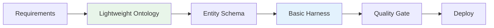
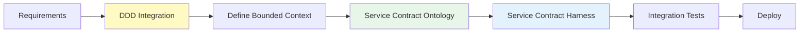
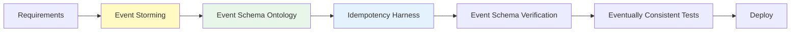
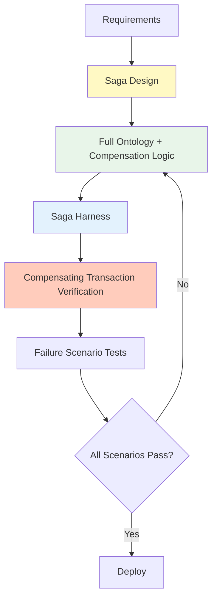
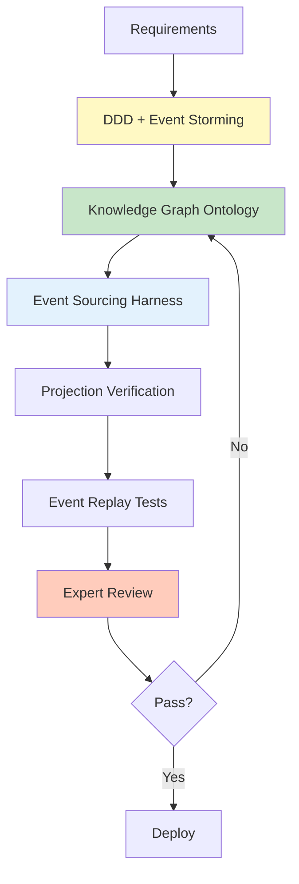
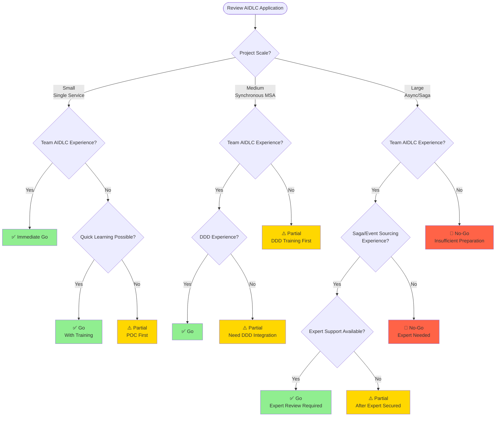

# MSA Complexity Assessment

Guide for assessing AIDLC (AI-Driven Development Life Cycle) project suitability and determining ontology/harness strategies based on MSA difficulty.

## Why MSA Complexity Matters

### Simple CRUD vs Complex MSA

AIDLC doesn't apply uniformly to all projects. Application methods must vary based on project technical complexity and organizational readiness.

**Simple CRUD Project Characteristics:**
- Single service, single database
- Synchronous request-response pattern
- Clear transaction boundaries
- Simple rollback (DB transaction sufficient)

**Complex MSA Project Characteristics:**
- Multiple independent services, distributed data
- Asynchronous event-based communication
- Distributed transactions (Saga, compensating transactions)
- Eventually Consistent data model
- Complex service interdependencies

### AIDLC Application Differences

| Complexity | AIDLC Application Method | Ontology Level | Harness Level |
|--------|----------------|--------------|------------|
| **Simple CRUD** | Immediate full application possible | Lightweight schema | Basic Quality Gate |
| **Synchronous MSA** | DDD integration required | Standard ontology | Service contract verification |
| **Asynchronous Event** | Event schema ontology required | Full ontology | Event schema + idempotency |
| **Saga/CQRS** | Full AIDLC + experts needed | Knowledge Graph | Compensating transaction verification |

**Core Principle:**
- Higher complexity requires more sophisticated ontology and harness
- Low organizational readiness requires phased adoption
- Imbalance between technical complexity and organizational readiness creates project failure risk

## AIDLC Difficulty Matrix

Evaluate project **technical complexity** and **organizational readiness** on 2 axes to determine AIDLC application strategy.

### Axis 1: Technical Complexity

| Level | Description | Characteristics | Example |
|-------|------|------|------|
| **L1** | Single Service CRUD | - Single DB<br/>- Synchronous API<br/>- Simple transactions | User management service |
| **L2** | Synchronous MSA | - Multiple services<br/>- REST/gRPC orchestration<br/>- Distributed DB | Order-Inventory-Payment MSA |
| **L3** | Asynchronous Event-Based | - Event bus<br/>- Eventually Consistent<br/>- Domain events | Event sourcing order system |
| **L4** | Saga + Compensating Transactions | - Distributed transactions<br/>- Compensation logic<br/>- Orchestration/choreography | Travel booking Saga |
| **L5** | Distributed Transaction + CQRS + Event Sourcing | - Read/write separation<br/>- Event store<br/>- Complex projections | Financial transaction platform |

### Axis 2: Organizational Readiness

| Level | Description | Characteristics | Checklist |
|-------|------|------|-----------|
| **A** | No Champions | - No AIDLC experience<br/>- No DDD experience<br/>- No ontology understanding | ☐ AIDLC training needed<br/>☐ POC project needed |
| **B** | 1 Champion | - 1 AIDLC expert<br/>- Team training needed<br/>- Dependent on guides | ☐ Verify champion capability<br/>☐ Team onboarding plan |
| **C** | Team Experience | - Multiple AIDLC experienced members<br/>- Practical DDD experience<br/>- Can design ontology | ☐ Team review process<br/>☐ Best practice sharing |
| **D** | Organizational Standard | - Enterprise-wide AIDLC standard<br/>- Ontology reuse library<br/>- Harness templates | ☐ Organizational standard docs<br/>☐ Reusable assets |

### Difficulty Matrix (Recommended Application Strategy)

```mermaid
graph TB
    subgraph "Difficulty Matrix"
        style L1A fill:#90EE90
        style L1B fill:#90EE90
        style L1C fill:#90EE90
        style L1D fill:#90EE90
        
        style L2A fill:#FFD700
        style L2B fill:#90EE90
        style L2C fill:#90EE90
        style L2D fill:#90EE90
        
        style L3A fill:#FF6347
        style L3B fill:#FFD700
        style L3C fill:#90EE90
        style L3D fill:#90EE90
        
        style L4A fill:#FF0000
        style L4B fill:#FF6347
        style L4C fill:#FFD700
        style L4D fill:#90EE90
        
        style L5A fill:#FF0000
        style L5B fill:#FF0000
        style L5C fill:#FF6347
        style L5D fill:#FFD700
        
        L1A["L1-A<br/>🟢 Immediately Possible"]
        L1B["L1-B<br/>🟢 Immediately Possible"]
        L1C["L1-C<br/>🟢 Immediately Possible"]
        L1D["L1-D<br/>🟢 Immediately Possible"]
        
        L2A["L2-A<br/>🟡 POC Needed"]
        L2B["L2-B<br/>🟢 After Training"]
        L2C["L2-C<br/>🟢 Immediately Possible"]
        L2D["L2-D<br/>🟢 Immediately Possible"]
        
        L3A["L3-A<br/>🔴 High Risk"]
        L3B["L3-B<br/>🟡 Expert Needed"]
        L3C["L3-C<br/>🟢 Team Review"]
        L3D["L3-D<br/>🟢 Immediately Possible"]
        
        L4A["L4-A<br/>⛔ Not Recommended"]
        L4B["L4-B<br/>🔴 High Risk"]
        L4C["L4-C<br/>🟡 Proceed Carefully"]
        L4D["L4-D<br/>🟢 Possible"]
        
        L5A["L5-A<br/>⛔ Not Recommended"]
        L5B["L5-B<br/>⛔ Not Recommended"]
        L5C["L5-C<br/>🔴 Expert Required"]
        L5D["L5-D<br/>🟡 Proceed Carefully"]
    end
```



**Color Interpretation:**
- 🟢 **Green (Immediately Possible):** Full AIDLC application recommended
- 🟡 **Yellow (Caution):** Phased adoption or expert support needed
- 🔴 **Red (High Risk):** High risk, proceed after sufficient preparation
- ⛔ **Red (Not Recommended):** Retry after improving organizational readiness

## Pattern-Specific AIDLC Application Guide

### Level 1: Simple Service CRUD

**Characteristics:**
- Single service, single database
- REST API (CRUD endpoints)
- Clear transaction boundaries
- Simple rollback (DB transaction)

**AIDLC Application Method:**



**Ontology Level:**
- **Lightweight Schema:** Entity definitions, attributes, basic relationships only
- YAML/JSON schema files
- Complex domain modeling unnecessary

**Harness Checklist:**
- ✅ API contract verification
- ✅ Data validation (input/output)
- ✅ Basic unit tests
- ✅ Integration tests (including DB)
- ⬜ Distributed transaction verification (unnecessary)

**Example Ontology (Lightweight):**

```yaml
# ontology/user-service.yaml
entities:
  User:
    attributes:
      - id: string (UUID)
      - name: string
      - email: string (unique)
      - createdAt: timestamp
    invariants:
      - email must be valid format
      - name length 2-50 characters

  Role:
    attributes:
      - id: string
      - name: string
      - permissions: list<string>

relationships:
  - User hasMany Role
```

**Application Strategy:**
- Full AIDLC immediately applicable
- Utilize agent-based code generation
- Ontology sufficient at schema definition level
- Start harness with basic Quality Gate

### Level 2: Synchronous MSA Orchestration

**Characteristics:**
- Multiple independent services
- Synchronous REST/gRPC calls
- Orchestrator pattern (order service calls inventory/payment)
- Distributed DB, but synchronous transactions

**AIDLC Application Method:**



**Ontology Level:**
- **Standard Ontology:** Entities + relationships + invariants
- Separate ontology per Bounded Context
- Specify inter-service contracts (API specs)

**Harness Checklist:**
- ✅ Service contract verification (OpenAPI/gRPC)
- ✅ Inter-service integration tests
- ✅ Timeout + retry policies
- ✅ Circuit breaker verification
- ⬜ Compensating transactions (not yet needed)

**Example Ontology (Service Contract):**

```yaml
# ontology/order-service.yaml
boundedContext: OrderManagement

entities:
  Order:
    attributes:
      - orderId: string
      - userId: string
      - items: list<OrderItem>
      - status: OrderStatus (PENDING, CONFIRMED, CANCELLED)
    invariants:
      - total amount must match sum of item prices
      - order must have at least 1 item

serviceContracts:
  - name: CreateOrder
    input: CreateOrderRequest
    output: OrderResponse
    dependencies:
      - InventoryService.checkStock
      - PaymentService.processPayment
    timeout: 5s
    retryPolicy: exponentialBackoff(3)
```

**Application Strategy:**
- DDD integration required (define Bounded Context)
- Specify service contract ontology
- Add timeout/retry/circuit breaker to harness
- Adopt Contract Testing (Pact, Spring Cloud Contract)

### Level 3: Asynchronous Event-Based MSA

**Characteristics:**
- Event bus (Kafka, RabbitMQ, EventBridge)
- Eventually Consistent data model
- Domain event publish/subscribe
- Asynchronous communication, loose coupling

**AIDLC Application Method:**



**Ontology Level:**
- **Full Ontology:** Entities + relationships + event schemas + invariants
- Specify event contracts (schema registry)
- Define event ordering/dependencies

**Harness Checklist:**
- ✅ Event schema verification (Avro, Protobuf)
- ✅ Idempotency harness (duplicate event handling)
- ✅ Event ordering verification
- ✅ Eventually Consistent tests (verify eventual state)
- ✅ Dead Letter Queue handling

**Example Ontology (Event Schema):**

```yaml
# ontology/order-events.yaml
events:
  OrderCreated:
    schema:
      orderId: string
      userId: string
      items: list<OrderItem>
      createdAt: timestamp
    producers:
      - OrderService
    consumers:
      - InventoryService (reduce inventory)
      - NotificationService (send notification)
    idempotencyKey: orderId
    ordering: strict (orderId basis)

  OrderConfirmed:
    schema:
      orderId: string
      confirmedAt: timestamp
    producers:
      - PaymentService
    consumers:
      - ShippingService
    idempotencyKey: orderId

invariants:
  - OrderCreated must precede OrderConfirmed
  - OrderCancelled cannot follow OrderShipped
```

**Application Strategy:**
- Define events with Event Storming
- Event schema ontology required
- Idempotency harness (handle duplicate events)
- Integrate event schema registry (Schema Registry)
- Automate Eventual Consistency tests

### Level 4: Saga + Compensating Transactions

**Characteristics:**
- Distributed transactions (Saga pattern)
- Compensating transactions
- Orchestration Saga or Choreography Saga
- Complex failure scenarios

**AIDLC Application Method:**



**Ontology Level:**
- **Full Ontology + Saga Spec:** Entities + events + Saga steps + compensation logic
- Define Saga step-by-step state transitions
- Specify compensation logic (rollback scenarios)

**Harness Checklist:**
- ✅ Saga step-by-step verification
- ✅ Compensating transaction verification (rollback scenarios)
- ✅ Timeout harness (prevent infinite wait)
- ✅ Retry policy verification
- ✅ Circuit breaker
- ✅ Distributed tracing (OpenTelemetry)

**Example Ontology (Saga):**

```yaml
# ontology/travel-booking-saga.yaml
saga:
  name: TravelBookingSaga
  type: orchestration
  orchestrator: BookingService

  steps:
    - name: ReserveFlight
      service: FlightService
      action: reserveFlight
      compensation: cancelFlightReservation
      timeout: 10s
      retryPolicy: exponentialBackoff(3)

    - name: ReserveHotel
      service: HotelService
      action: reserveHotel
      compensation: cancelHotelReservation
      timeout: 10s
      retryPolicy: exponentialBackoff(3)

    - name: ChargePayment
      service: PaymentService
      action: chargeCard
      compensation: refundPayment
      timeout: 5s
      retryPolicy: none

  failureScenarios:
    - scenario: FlightReservationFailed
      compensations:
        - (none, first step failure)
    
    - scenario: HotelReservationFailed
      compensations:
        - cancelFlightReservation
    
    - scenario: PaymentFailed
      compensations:
        - cancelHotelReservation
        - cancelFlightReservation

  invariants:
    - All compensations must be idempotent
    - Compensation order is reverse of execution order
    - Saga timeout = sum of step timeouts + buffer
```

**Application Strategy:**
- Saga design required (orchestration vs choreography)
- Specify compensation logic ontology
- Add compensating transaction verification to harness
- Test all failure scenarios (Chaos Engineering)
- Expert review required

### Level 5: Distributed Transaction + CQRS + Event Sourcing

**Characteristics:**
- Read/write separation (CQRS)
- Event store
- Complex projections (Read Model)
- Event replay

**AIDLC Application Method:**



**Ontology Level:**
- **Knowledge Graph:** SemanticForge pattern
- Event store schema
- Specify projection logic
- Event version management

**Harness Checklist:**
- ✅ Event schema verification (version management)
- ✅ Projection verification (Read Model consistency)
- ✅ Event replay tests
- ✅ Snapshot strategy verification
- ✅ Event migration harness
- ✅ Idempotency harness
- ✅ Distributed tracing

**Example Ontology (Event Sourcing):**

```yaml
# ontology/banking-account.yaml
aggregateRoot: BankAccount

events:
  AccountOpened:
    version: v1
    schema:
      accountId: string
      customerId: string
      initialBalance: decimal
      openedAt: timestamp
  
  MoneyDeposited:
    version: v1
    schema:
      accountId: string
      amount: decimal
      transactionId: string
      depositedAt: timestamp
  
  MoneyWithdrawn:
    version: v1
    schema:
      accountId: string
      amount: decimal
      transactionId: string
      withdrawnAt: timestamp

eventStore:
  partitionKey: accountId
  snapshotStrategy: every 100 events
  retentionPolicy: 7 years

projections:
  AccountBalanceView:
    source: [AccountOpened, MoneyDeposited, MoneyWithdrawn]
    target: read_db.account_balance
    updateStrategy: eventually_consistent
  
  TransactionHistoryView:
    source: [MoneyDeposited, MoneyWithdrawn]
    target: read_db.transaction_history
    updateStrategy: eventually_consistent

invariants:
  - Balance cannot be negative
  - Events must be ordered by timestamp
  - TransactionId must be unique (idempotency)
```

**Application Strategy:**
- DDD + Event Storming required
- Knowledge Graph level ontology
- Event version management strategy
- Automate projection logic verification
- Event replay testing required
- Recommended expert team composition

## Ontology Depth Guide

Summarize recommended ontology levels by complexity.

### Ontology Level by Level

| Complexity | Ontology Level | Included Elements | Example File |
|--------|--------------|-----------|----------|
| **L1** | Lightweight Schema | - Entity definitions<br/>- Attributes<br/>- Basic invariants | `ontology/user-schema.yaml` |
| **L2** | Standard Ontology | - Entities + relationships<br/>- Service contracts<br/>- Bounded Context | `ontology/order-service.yaml` |
| **L3** | Full Ontology | - Event schemas<br/>- Event ordering<br/>- Idempotency keys | `ontology/order-events.yaml` |
| **L4** | Full Ontology + Saga | - Saga steps<br/>- Compensation logic<br/>- Failure scenarios | `ontology/booking-saga.yaml` |
| **L5** | Knowledge Graph | - Event store<br/>- Projections<br/>- Event version management | `ontology/banking-kg.yaml` |

### Ontology Writing Guidelines

#### Level 1-2: Lightweight~Standard Ontology

**Focus:** Define entities and relationships

```yaml
# Entity definition
entities:
  Order:
    attributes:
      - orderId: string
      - customerId: string
      - items: list<OrderItem>
    invariants:
      - orderId must be unique
      - items must not be empty

# Relationship definition
relationships:
  - Customer hasMany Order
  - Order hasMany OrderItem
```

**Writing Principles:**
- Clear entity boundaries
- Specify required attributes
- Define basic invariants

#### Level 3-4: Full Ontology + Saga

**Focus:** Event schemas + compensation logic

```yaml
# Event contracts
events:
  OrderCreated:
    schema: {...}
    producers: [OrderService]
    consumers: [InventoryService, NotificationService]
    idempotencyKey: orderId

# Saga definition
saga:
  steps:
    - action: reserveInventory
      compensation: releaseInventory
      timeout: 5s
```

**Writing Principles:**
- Specify event contracts
- Define compensation logic
- Timeout/retry policies

#### Level 5: Knowledge Graph

**Focus:** Event sourcing + projections

```yaml
# Event store
eventStore:
  aggregateRoot: BankAccount
  snapshotStrategy: every 100 events

# Projections
projections:
  AccountBalanceView:
    source: [AccountOpened, MoneyDeposited]
    target: read_db.account_balance
```

**Writing Principles:**
- Event version management
- Specify projection logic
- Event replay strategy

### SemanticForge Pattern (L5 Only)

Level 5 projects apply the SemanticForge pattern from [Ontology Engineering](../methodology/ontology-engineering.md).

**Core Features:**
- Events = atomic units of domain knowledge
- Express relationships between events with Knowledge Graph
- Projections = Knowledge Graph queries

**Reference:** Check detailed guide in [Ontology Engineering](../methodology/ontology-engineering.md)

## Harness Checklist

Summarize required and optional harnesses by pattern.

### Required Harnesses by Pattern

| Pattern | Required Harness | Optional Harness | Priority |
|------|-----------|-----------|---------|
| **L1: CRUD** | - API contract verification<br/>- Basic unit tests<br/>- Integration tests | - Performance tests<br/>- Security scans | P0 |
| **L2: Synchronous MSA** | - Service contract verification<br/>- Timeout/retry<br/>- Circuit breaker<br/>- Contract Testing | - Chaos engineering<br/>- Load tests | P1 |
| **L3: Asynchronous Event** | - Event schema verification<br/>- Idempotency harness<br/>- Event ordering verification<br/>- Eventually Consistent tests | - Event replay<br/>- Dead Letter Queue | P1 |
| **L4: Saga** | - Saga step verification<br/>- Compensating transaction verification<br/>- Failure scenario tests<br/>- Timeout harness | - Distributed tracing<br/>- Chaos engineering | P0 |
| **L5: Event Sourcing** | - Event schema verification<br/>- Projection verification<br/>- Event replay<br/>- Event migration | - Snapshot strategy<br/>- Performance tests | P0 |

### Harness Implementation Examples

#### Idempotency Harness (L3+)

```python
# harness/idempotency_test.py
def test_duplicate_event_handling():
    """Verify same result even when receiving duplicate events"""
    event = OrderCreatedEvent(orderId="123", ...)
    
    # First processing
    result1 = event_handler.handle(event)
    state1 = get_order_state("123")
    
    # Second processing (duplicate)
    result2 = event_handler.handle(event)
    state2 = get_order_state("123")
    
    # Results must be identical
    assert result1 == result2
    assert state1 == state2
```

#### Compensating Transaction Harness (L4+)

```python
# harness/saga_compensation_test.py
def test_saga_compensation():
    """Verify compensation logic executes correctly on Saga failure"""
    saga = TravelBookingSaga()
    
    # 1. Flight reservation success
    saga.execute_step("ReserveFlight")
    assert flight_service.is_reserved("flight123")
    
    # 2. Hotel reservation success
    saga.execute_step("ReserveHotel")
    assert hotel_service.is_reserved("hotel456")
    
    # 3. Payment failure simulation
    with pytest.raises(PaymentFailedException):
        saga.execute_step("ChargePayment")
    
    # 4. Verify compensating transactions
    saga.compensate()
    assert not hotel_service.is_reserved("hotel456")  # Cancelled
    assert not flight_service.is_reserved("flight123")  # Cancelled
```

#### Projection Verification Harness (L5)

```python
# harness/projection_test.py
def test_projection_consistency():
    """Verify event sourcing projection is accurate"""
    # 1. Create events
    events = [
        AccountOpenedEvent(accountId="A1", balance=1000),
        MoneyDepositedEvent(accountId="A1", amount=500),
        MoneyWithdrawnEvent(accountId="A1", amount=200),
    ]
    
    # 2. Store events
    for event in events:
        event_store.append(event)
    
    # 3. Update projection
    projection_service.rebuild("AccountBalanceView")
    
    # 4. Verify Read Model
    balance_view = read_db.get_account_balance("A1")
    assert balance_view.balance == 1300  # 1000 + 500 - 200
    assert balance_view.version == 3
```

### Harness Priority Guide

**P0 (Required):**
- Data loss or serious business impact on project failure
- Example: Compensating transaction verification, event schema verification

**P1 (Strongly Recommended):**
- Service failures or user experience degradation on project failure
- Example: Timeout/retry, idempotency verification

**P2 (Optional):**
- Quality improvement or operational convenience
- Example: Performance tests, chaos engineering

## Go/No-Go Decision Tree

Flowchart for deciding whether to apply AIDLC to project.



### Decision Criteria

#### ✅ Go (Proceed Immediately)

**Conditions:**
- Technical complexity ≤ L3 AND Organizational readiness ≥ B
- Or Technical complexity = L4-5 AND Organizational readiness ≥ C AND Expert support available

**Action:**
- Apply full AIDLC
- Write ontology/harness
- Agent-based code generation

#### ⚠️ Partial (Proceed Gradually)

**Conditions:**
- Technical complexity ≤ L2 AND Organizational readiness = A
- Or Technical complexity = L3 AND Organizational readiness ≤ B
- Or Technical complexity ≥ L4 AND No experts

**Action:**
- Proceed with POC project first
- Complete training program
- Secure expert support
- Phased AIDLC adoption

#### 🛑 No-Go (Cannot Proceed)

**Conditions:**
- Technical complexity ≥ L4 AND Organizational readiness ≤ A
- Or Technical complexity = L5 AND Organizational readiness ≤ B

**Action:**
- Improve organizational readiness (training, POC)
- Hire experts or consulting
- Re-evaluate after preparation complete

### Risk Assessment Matrix

| Risk Factor | High 🔴 | Medium 🟡 | Low 🟢 |
|-----------|---------|---------|---------|
| **Technical Complexity** | L4-5 | L2-3 | L1 |
| **Organizational Readiness** | A (No experience) | B-C (Some experience) | D (Organizational standard) |
| **Data Sensitivity** | Finance, healthcare | Personal information | Non-sensitive |
| **Project Scale** | 20+ services | 5-20 services | 1-5 services |
| **Schedule Pressure** | Within 3 months | 3-6 months | 6+ months |

**Total Risk Judgment:**
- 🔴 3+: No-Go
- 🔴 1-2: Partial (proceed gradually)
- 🔴 0: Go

## Verification Methodology

Methods to ensure quality when applying AIDLC in complex MSA.

### Verification Checklist

#### Ontology Verification

- [ ] **Completeness:** Are all entities/events defined in ontology?
- [ ] **Consistency:** Is ontology consistent across Bounded Contexts?
- [ ] **Accuracy:** Do invariants match business rules?
- [ ] **Traceability:** Are ontology and code synchronized?

#### Harness Verification

- [ ] **Coverage:** Are all required harnesses implemented?
- [ ] **Automation:** Is harness integrated into CI/CD?
- [ ] **Failure Scenarios:** Do tests cover all failure scenarios?
- [ ] **Performance:** Is harness execution time reasonable?

#### Deployment Verification

- [ ] **Canary Deployment:** Is gradual rollout strategy available?
- [ ] **Rollback Plan:** Can rollback on issues?
- [ ] **Monitoring:** Can monitor in real-time post-deployment?
- [ ] **Alerts:** Are anomaly detection alerts configured?

### Verification Automation

**CI/CD Pipeline:**

```yaml
# .github/workflows/aidlc-validation.yml
name: AIDLC Validation

on: [push, pull_request]

jobs:
  validate-ontology:
    runs-on: ubuntu-latest
    steps:
      - uses: actions/checkout@v2
      - name: Validate Ontology
        run: |
          aidlc-cli validate-ontology --path ontology/
  
  run-harness:
    runs-on: ubuntu-latest
    steps:
      - uses: actions/checkout@v2
      - name: Run Harness Tests
        run: |
          aidlc-cli run-harness --suite saga
          aidlc-cli run-harness --suite idempotency
  
  quality-gate:
    runs-on: ubuntu-latest
    needs: [validate-ontology, run-harness]
    steps:
      - name: Check Quality Gate
        run: |
          aidlc-cli quality-gate --threshold 80
```

### Expert Review

**Complexity L4-5 requires expert review:**

**Review Checklist:**
- [ ] Is Saga design appropriate?
- [ ] Does compensation logic cover all failure scenarios?
- [ ] Is event schema version management strategy available?
- [ ] Is projection logic accurate?
- [ ] Are performance/scalability considerations reflected?

## Next Steps

- [DDD Integration](../methodology/ddd-integration.md): Domain-Driven Design and AIDLC integration methods
- [Ontology Engineering](../methodology/ontology-engineering.md): Detailed ontology design guide
- [Harness Engineering](../methodology/harness-engineering.md): Harness implementation best practices
- [Adoption Strategy](./adoption-strategy.md): Organization-wide AIDLC adoption roadmap

## References

- [MSA Pattern Catalog](https://microservices.io/patterns/)
- [Saga Pattern Guide](https://microservices.io/patterns/data/saga.html)
- [Event Sourcing Pattern](https://martinfowler.com/eaaDev/EventSourcing.html)
- [CQRS Pattern](https://martinfowler.com/bliki/CQRS.html)
