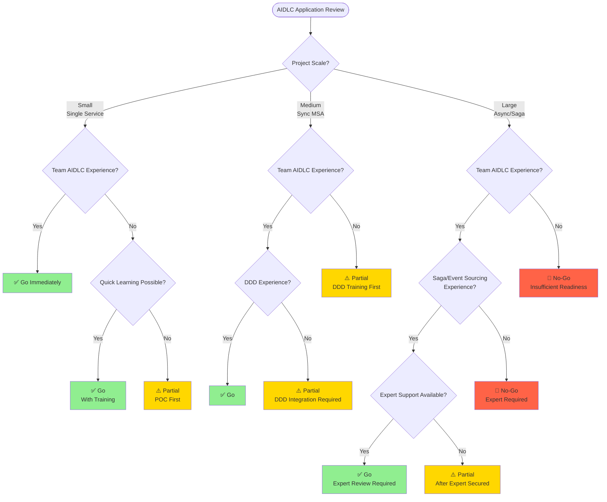

# MSA Complexity Guide

A guide to evaluate project suitability for AIDLC (AI-Driven Development Life Cycle) and determine ontology and harness strategies based on MSA difficulty levels.

## Why MSA Complexity Matters

### Simple CRUD vs Complex MSA

AIDLC is not uniformly applicable to all projects. The application approach must vary based on technical complexity and organizational readiness.

**Simple CRUD Project Characteristics:**
- Single service, single database
- Synchronous request-response patterns
- Clear transaction boundaries
- Simple rollback (DB transactions sufficient)

**Complex MSA Project Characteristics:**
- Multiple independent services, distributed data
- Asynchronous event-driven communication
- Distributed transactions (Saga, compensating transactions)
- Eventually Consistent data models
- Complex inter-service dependencies

### AIDLC Application Differences

| Complexity | AIDLC Application | Ontology Level | Harness Level |
|--------|----------------|--------------|------------|
| **Simple CRUD** | Full immediate adoption | Lightweight schema | Basic Quality Gate |
| **Synchronous MSA** | DDD integration required | Standard ontology | Service contract verification |
| **Async Events** | Event schema ontology required | Full ontology | Event schema + idempotency |
| **Saga/CQRS** | Full AIDLC + expert required | Knowledge Graph | Compensating transaction verification |

**Core Principles:**
- Higher complexity requires more sophisticated ontology and harnesses
- Lower organizational readiness requires phased adoption
- Imbalance between technical complexity and organizational readiness risks project failure

## AIDLC Difficulty Matrix

Evaluate **Technical Complexity** and **Organizational Readiness** on two axes to determine AIDLC application strategy.

### Axis 1: Technical Complexity

| Level | Description | Characteristics | Examples |
|-------|------|------|------|
| **L1** | Single Service CRUD | - Single DB - Synchronous API - Simple transactions | User management service |
| **L2** | Synchronous MSA | - Multiple services - REST/gRPC orchestration - Distributed DB | Order-Inventory-Payment MSA |
| **L3** | Async Event-Driven | - Event bus - Eventually Consistent - Domain events | Event-sourced order system |
| **L4** | Saga + Compensating Transactions | - Distributed transactions - Compensation logic - Orchestration/Choreography | Travel booking Saga |
| **L5** | Distributed Tx + CQRS + Event Sourcing | - Read/Write separation - Event store - Complex projections | Financial trading platform |

### Axis 2: Organizational Readiness

| Level | Description | Characteristics | Checklist |
|-------|------|------|-----------|
| **A** | No Champion | - No AIDLC experience - No DDD experience - No ontology understanding | ☐ AIDLC training required ☐ POC project needed |
| **B** | Single Champion | - 1 AIDLC expert - Team training required - Guide-dependent | ☐ Verify champion capability ☐ Team onboarding plan |
| **C** | Team Experience | - Multiple AIDLC practitioners - Practical DDD experience - Ontology design capable | ☐ Team review process ☐ Best practice sharing |
| **D** | Org Standard | - Organization-wide AIDLC standard - Ontology reuse library - Harness templates | ☐ Org standard docs ☐ Reusable assets |

### Difficulty Matrix (Recommended Application Strategy)

```mermaid
graph TB
    subgraph "Difficulty Matrix"
        style L1A fill:#90EE90
        style L1B fill:#90EE90
        style L1C fill:#90EE90
        style L1D fill:#90EE90
        
        style L2A fill:#FFD700
        style L2B fill:#90EE90
        style L2C fill:#90EE90
        style L2D fill:#90EE90
        
        style L3A fill:#FF6347
        style L3B fill:#FFD700
        style L3C fill:#90EE90
        style L3D fill:#90EE90
        
        style L4A fill:#FF0000
        style L4B fill:#FF6347
        style L4C fill:#FFD700
        style L4D fill:#90EE90
        
        style L5A fill:#FF0000
        style L5B fill:#FF0000
        style L5C fill:#FF6347
        style L5D fill:#FFD700
        
        L1A["L1-A<br/>🟢 Ready"]
        L1B["L1-B<br/>🟢 Ready"]
        L1C["L1-C<br/>🟢 Ready"]
        L1D["L1-D<br/>🟢 Ready"]
        
        L2A["L2-A<br/>🟡 POC Required"]
        L2B["L2-B<br/>🟢 After Training"]
        L2C["L2-C<br/>🟢 Ready"]
        L2D["L2-D<br/>🟢 Ready"]
        
        L3A["L3-A<br/>🔴 High Risk"]
        L3B["L3-B<br/>🟡 Expert Needed"]
        L3C["L3-C<br/>🟢 Team Review"]
        L3D["L3-D<br/>🟢 Ready"]
        
        L4A["L4-A<br/>⛔ Not Recommended"]
        L4B["L4-B<br/>🔴 High Risk"]
        L4C["L4-C<br/>🟡 Proceed Carefully"]
        L4D["L4-D<br/>🟢 Feasible"]
        
        L5A["L5-A<br/>⛔ Not Recommended"]
        L5B["L5-B<br/>⛔ Not Recommended"]
        L5C["L5-C<br/>🔴 Expert Required"]
        L5D["L5-D<br/>🟡 Proceed Carefully"]
    end
```

**Color Legend:**
- 🟢 **Green (Ready):** Full AIDLC application recommended
- 🟡 **Yellow (Caution):** Phased adoption or expert support required
- 🔴 **Red (High Risk):** High risk, proceed after sufficient preparation
- ⛔ **Red (Not Recommended):** Improve organizational readiness first

## Go/No-Go Decision Tree

Flowchart for deciding whether to apply AIDLC to a project.

### Decision Criteria

#### ✅ Go (Proceed Immediately)

**Conditions:**
- Technical Complexity ≤ L3 AND Organizational Readiness ≥ B
- OR Technical Complexity = L4-5 AND Organizational Readiness ≥ C AND Expert support available

**Actions:**
- Apply full AIDLC
- Write ontology/harness
- Agent-based code generation

#### ⚠️ Partial (Phased Approach)

**Conditions:**
- Technical Complexity ≤ L2 AND Organizational Readiness = A
- OR Technical Complexity = L3 AND Organizational Readiness ≤ B
- OR Technical Complexity ≥ L4 AND No expert available

**Actions:**
- Run POC project first
- Complete training program
- Secure expert support
- Phased AIDLC adoption

#### 🛑 No-Go (Do Not Proceed)

**Conditions:**
- Technical Complexity ≥ L4 AND Organizational Readiness ≤ A
- OR Technical Complexity = L5 AND Organizational Readiness ≤ B

**Actions:**
- Improve organizational readiness (training, POC)
- Hire expert or engage consulting
- Re-evaluate after preparation complete

### Risk Assessment Matrix

| Risk Factor | High 🔴 | Medium 🟡 | Low 🟢 |
|-----------|---------|---------|---------|
| **Technical Complexity** | L4-5 | L2-3 | L1 |
| **Organizational Readiness** | A (No experience) | B-C (Some experience) | D (Org standard) |
| **Data Sensitivity** | Financial, Healthcare | Personal data | Non-sensitive |
| **Project Scale** | 20+ services | 5-20 services | 1-5 services |
| **Timeline Pressure** | < 3 months | 3-6 months | 6+ months |

**Overall Risk Assessment:**
- 3+ 🔴: No-Go
- 1-2 🔴: Partial (phased approach)
- 0 🔴: Go

## Detailed Guides

import DocCardList from '@theme/DocCardList';

<DocCardList />

## Next Steps

- [DDD Integration](../../methodology/ddd-integration.md): Integrating Domain-Driven Design with AIDLC
- [Ontology Engineering](../../methodology/ontology-engineering.md): Detailed ontology design guide
- [Harness Engineering](../../methodology/harness-engineering.md): Harness implementation best practices
- [Adoption Strategy](../adoption-strategy.md): Organization-wide AIDLC adoption roadmap

## References

- [MSA Pattern Catalog](https://microservices.io/patterns/)
- [Saga Pattern Guide](https://microservices.io/patterns/data/saga.html)
- [Event Sourcing Pattern](https://martinfowler.com/eaaDev/EventSourcing.html)
- [CQRS Pattern](https://martinfowler.com/bliki/CQRS.html)
