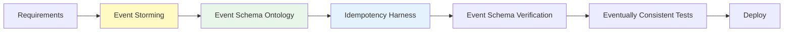
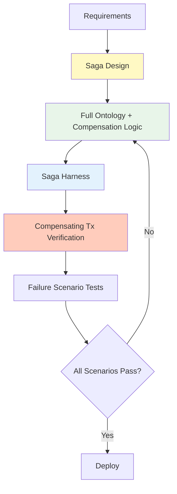

# Level 3-4: Async Events & Saga

Intermediate to advanced complexity patterns covering event-driven architecture and distributed transactions.

## Level 3: Async Event-Driven MSA

**Characteristics:**
- Event bus (Kafka, RabbitMQ, EventBridge)
- Eventually Consistent data model
- Domain event publish/subscribe
- Asynchronous communication, loose coupling

**AIDLC Application:**



### Ontology Level

**Full Ontology:** Entities + relationships + event schemas + invariants
- Explicit event contracts (schema registry)
- Define event ordering/dependencies

**Example Ontology (Event Schema):**

```yaml
# ontology/order-events.yaml
events:
  OrderCreated:
    schema:
      orderId: string
      userId: string
      items: list<OrderItem>
      createdAt: timestamp
    producers:
      - OrderService
    consumers:
      - InventoryService (deduct stock)
      - NotificationService (send notification)
    idempotencyKey: orderId
    ordering: strict (by orderId)

  OrderConfirmed:
    schema:
      orderId: string
      confirmedAt: timestamp
    producers:
      - PaymentService
    consumers:
      - ShippingService
    idempotencyKey: orderId

invariants:
  - OrderCreated must precede OrderConfirmed
  - OrderCancelled cannot follow OrderShipped
```

### Harness Checklist

- ✅ Event schema verification (Avro, Protobuf)
- ✅ Idempotency harness (duplicate event handling)
- ✅ Event ordering verification
- ✅ Eventually Consistent tests (eventual state verification)
- ✅ Dead Letter Queue handling

### Application Strategy

- Define events through Event Storming
- Event schema ontology required
- Idempotency harness (handle duplicate events)
- Integrate with Schema Registry
- Automate Eventually Consistency testing

## Level 4: Saga + Compensating Transactions

**Characteristics:**
- Distributed transactions (Saga pattern)
- Compensating transactions
- Orchestration Saga or Choreography Saga
- Complex failure scenarios

**AIDLC Application:**



### Ontology Level

**Full Ontology + Saga Spec:** Entities + events + Saga steps + compensation logic
- Define Saga state transitions per step
- Explicit compensation logic (rollback scenarios)

**Example Ontology (Saga):**

```yaml
# ontology/travel-booking-saga.yaml
saga:
  name: TravelBookingSaga
  type: orchestration
  orchestrator: BookingService

  steps:
    - name: ReserveFlight
      service: FlightService
      action: reserveFlight
      compensation: cancelFlightReservation
      timeout: 10s
      retryPolicy: exponentialBackoff(3)

    - name: ReserveHotel
      service: HotelService
      action: reserveHotel
      compensation: cancelHotelReservation
      timeout: 10s
      retryPolicy: exponentialBackoff(3)

    - name: ChargePayment
      service: PaymentService
      action: chargeCard
      compensation: refundPayment
      timeout: 5s
      retryPolicy: none

  failureScenarios:
    - scenario: FlightReservationFailed
      compensations:
        - (none, first step failure)
    
    - scenario: HotelReservationFailed
      compensations:
        - cancelFlightReservation
    
    - scenario: PaymentFailed
      compensations:
        - cancelHotelReservation
        - cancelFlightReservation

  invariants:
    - All compensations must be idempotent
    - Compensation order is reverse of execution order
    - Saga timeout = sum of step timeouts + buffer
```

### Harness Checklist

- ✅ Saga step-by-step verification
- ✅ Compensating transaction verification (rollback scenarios)
- ✅ Timeout harness (prevent infinite wait)
- ✅ Retry policy verification
- ✅ Circuit breaker
- ✅ Distributed tracing (OpenTelemetry)

### Harness Implementation Example

#### Compensating Transaction Harness

```python
# harness/saga_compensation_test.py
def test_saga_compensation():
    """Verify that compensation logic works correctly on Saga failure"""
    saga = TravelBookingSaga()
    
    # 1. Flight reservation success
    saga.execute_step("ReserveFlight")
    assert flight_service.is_reserved("flight123")
    
    # 2. Hotel reservation success
    saga.execute_step("ReserveHotel")
    assert hotel_service.is_reserved("hotel456")
    
    # 3. Payment failure simulation
    with pytest.raises(PaymentFailedException):
        saga.execute_step("ChargePayment")
    
    # 4. Compensating transaction verification
    saga.compensate()
    assert not hotel_service.is_reserved("hotel456")  # cancelled
    assert not flight_service.is_reserved("flight123")  # cancelled
```

### Application Strategy

- Saga design required (orchestration vs choreography)
- Explicit compensation logic in ontology
- Add compensating transaction verification to harness
- Test all failure scenarios (Chaos Engineering)
- Expert review required

## Next Steps

Highest complexity Event Sourcing pattern:

- [Level 5: Event Sourcing](./l5-event-sourcing.md)
- [Ontology Writing Guide](../implementation/ontology-guide.md)
- [Harness Checklist](../implementation/harness-checklist.md)
