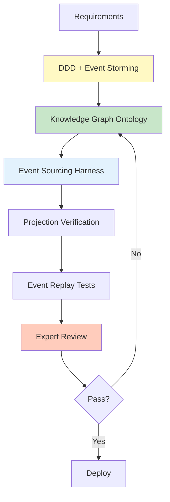

# Level 5: Event Sourcing & CQRS

The highest complexity architectural pattern requiring expert support and sophisticated ontology.

## Characteristics

- Read/Write separation (CQRS)
- Event Store
- Complex projections (Read Model)
- Event replay

## AIDLC Application



## Ontology Level

**Knowledge Graph:** SemanticForge pattern
- Event store schema
- Explicit projection logic
- Event version management

**Example Ontology (Event Sourcing):**

```yaml
# ontology/banking-account.yaml
aggregateRoot: BankAccount

events:
  AccountOpened:
    version: v1
    schema:
      accountId: string
      customerId: string
      initialBalance: decimal
      openedAt: timestamp
  
  MoneyDeposited:
    version: v1
    schema:
      accountId: string
      amount: decimal
      transactionId: string
      depositedAt: timestamp
  
  MoneyWithdrawn:
    version: v1
    schema:
      accountId: string
      amount: decimal
      transactionId: string
      withdrawnAt: timestamp

eventStore:
  partitionKey: accountId
  snapshotStrategy: every 100 events
  retentionPolicy: 7 years

projections:
  AccountBalanceView:
    source: [AccountOpened, MoneyDeposited, MoneyWithdrawn]
    target: read_db.account_balance
    updateStrategy: eventually_consistent
  
  TransactionHistoryView:
    source: [MoneyDeposited, MoneyWithdrawn]
    target: read_db.transaction_history
    updateStrategy: eventually_consistent

invariants:
  - Balance cannot be negative
  - Events must be ordered by timestamp
  - TransactionId must be unique (idempotency)
```

## Harness Checklist

- ✅ Event schema verification (version management)
- ✅ Projection verification (Read Model consistency)
- ✅ Event replay tests
- ✅ Snapshot strategy verification
- ✅ Event migration harness
- ✅ Idempotency harness
- ✅ Distributed tracing

## Harness Implementation Examples

### Projection Verification Harness

```python
# harness/projection_test.py
def test_projection_consistency():
    """Verify event sourcing projection accuracy"""
    # 1. Create events
    events = [
        AccountOpenedEvent(accountId="A1", balance=1000),
        MoneyDepositedEvent(accountId="A1", amount=500),
        MoneyWithdrawnEvent(accountId="A1", amount=200),
    ]
    
    # 2. Store events
    for event in events:
        event_store.append(event)
    
    # 3. Update projection
    projection_service.rebuild("AccountBalanceView")
    
    # 4. Verify Read Model
    balance_view = read_db.get_account_balance("A1")
    assert balance_view.balance == 1300  # 1000 + 500 - 200
    assert balance_view.version == 3
```

### Idempotency Harness

```python
# harness/idempotency_test.py
def test_duplicate_event_handling():
    """Verify identical results when receiving same event multiple times"""
    event = OrderCreatedEvent(orderId="123", ...)
    
    # First processing
    result1 = event_handler.handle(event)
    state1 = get_order_state("123")
    
    # Second processing (duplicate)
    result2 = event_handler.handle(event)
    state2 = get_order_state("123")
    
    # Results must be identical
    assert result1 == result2
    assert state1 == state2
```

## Application Strategy

- DDD + Event Storming required
- Knowledge Graph level ontology
- Event version management strategy
- Automate projection logic verification
- Event replay tests required
- Expert team recommended

## SemanticForge Pattern

Level 5 projects apply the SemanticForge pattern from [Ontology Engineering](../../../methodology/ontology-engineering.md).

**Key Features:**
- Event = atomic unit of domain knowledge
- Express event relationships as Knowledge Graph
- Projection = Knowledge Graph query

**Reference:** See [Ontology Engineering](../../../methodology/ontology-engineering.md) for detailed guide

## Next Steps

- [Ontology Writing Guide](../implementation/ontology-guide.md)
- [Harness Checklist](../implementation/harness-checklist.md)
- [Verification Methodology](../implementation/verification.md)
