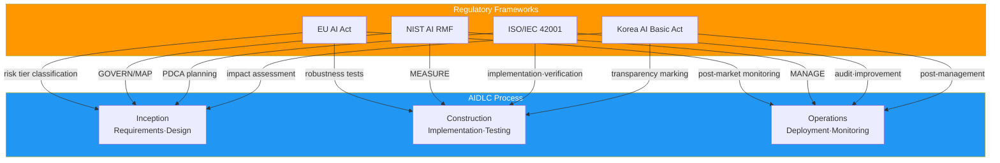
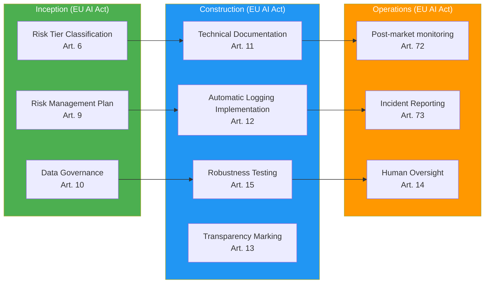
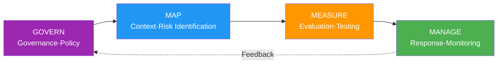
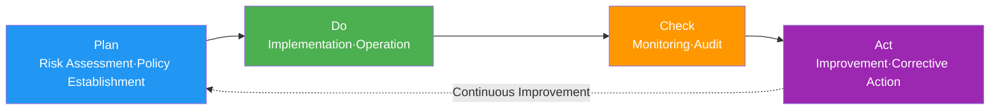

# AI Regulatory Framework Mapping

> 📅 **Written**: 2026-04-18 | ⏱️ **Reading Time**: ~25 minutes

---

## 1. Why AI Regulation Mapping?

### Multi-jurisdictional Regulatory Environment

As of 2026, global enterprises face a complex environment requiring **simultaneous compliance with AI regulations across multiple regions**:

- **EU**: AI Act (adopted 2024, phased implementation starting 2026-2027)
- **US**: NIST AI RMF 1.1 (federal procurement requirement), state-level regulations
- **Korea**: AI Basic Act (planned implementation 2026)
- **International Standard**: ISO/IEC 42001:2023 (AI Management System certification)

**Challenges Faced:**
- Each regulation's requirements defined in **different terminology**
- **Individual implementation** of overlapping control elements wastes cost
- Must **prepare separate reports** for audits
- Increasing **update costs** to respond to regulatory changes

### Benefits of AIDLC Workflow Integration

**Directly mapping** regulatory requirements to **AIDLC process stages** enables:

1. **Automatic Compliance**: Auto-execute required controls at each stage
2. **Unified Audit Log**: Single audit trail system addresses all regulations
3. **Efficient Updates**: Only modify AIDLC stage definitions when regulations change
4. **Evidence Auto-collection**: Auto-generate compliance reports



---

## 2. EU AI Act (2024-2027)

### Overview

**EU AI Act** is the world's first comprehensive AI regulation, adopted in May 2024 with **phased implementation starting in 2026**.

**Implementation Timeline:**
- February 2025: Prohibited AI systems enforcement
- August 2026: General Purpose AI (GPAI) provider obligations
- August 2027: High-risk AI system obligations full enforcement

### Risk Tier Classification

EU AI Act classifies AI systems into **4 risk tiers**:

| Risk Tier | Definition | Examples | Regulatory Level |
|-----------|------------|----------|------------------|
| **Prohibited** | Unacceptable risk | Social credit scoring, real-time remote biometric identification (except law enforcement) | **Banned** |
| **High-risk** | High risk | Recruitment tools, credit scoring, critical infrastructure management | **Strict obligations** |
| **Limited risk** | Limited risk | Chatbots, emotion recognition | **Transparency obligations** |
| **Minimal risk** | Minimal risk | Spam filters, AI games | **Self-regulation** |

**Code-generating AI (AIDLC target) Classification:**
- **Limited risk**: Developer awareness of AI-generated code → Transparency obligation
- **High-risk** (conditional): Automatic code generation for critical infrastructure (healthcare, finance, power)

### High-risk AI Obligations

**Articles 9-15 Key Requirements:**

1. **Risk Management System** (Art. 9)
   - Full lifecycle risk assessment
   - Identification, analysis, mitigation, monitoring

2. **Data Governance** (Art. 10)
   - Training data quality assurance
   - Bias minimization

3. **Technical Documentation** (Art. 11)
   - Document system design, development, testing
   - Must be submittable to audit authorities

4. **Automatic Logging** (Art. 12)
   - All decisions must be traceable
   - Log retention: minimum 6 months

5. **Transparency** (Art. 13)
   - Notify users of AI usage
   - Explainable outputs

6. **Human Oversight (HITL)** (Art. 14)
   - Critical decisions require human final approval
   - Guarantee override authority

7. **Accuracy, Robustness, Cybersecurity** (Art. 15)
   - Define performance metrics
   - Adversarial attack defense

### GPAI (General Purpose AI) Provider Obligations

**Articles 52-53**: Obligations for general-purpose model providers like Claude, GPT-4

- **Transparency Reports**: Disclose training data, energy consumption
- **Copyright Compliance**: Specify training data sources
- **Systemic risk** (Advanced GPAI, >10^25 FLOP): Risk assessment and mitigation obligations

### Violation Penalties

| Violation Type | Penalty |
|----------------|---------|
| Prohibited AI use | **€35M** or **7% of worldwide revenue** (whichever greater) |
| High-risk AI obligation violation | **€15M** or **3% of revenue** |
| Inaccurate information provision | **€7.5M** or **1.5% of revenue** |

### AIDLC Mapping



**Inception Stage Checklist:**
- [ ] Risk Tier classification (Limited/High-risk determination)
- [ ] Risk management plan establishment (risk identification, mitigation strategy)
- [ ] Data governance policy definition (training data sources, bias mitigation)

**Construction Stage Checklist:**
- [ ] Technical documentation auto-generation (design, development, testing docs)
- [ ] Audit log implementation (record all AI decisions)
- [ ] Robustness testing (adversarial attack, edge cases)
- [ ] AI-generated code transparency marking (`# AI-GENERATED: Claude 3.7 Sonnet`)

**Operations Stage Checklist:**
- [ ] Post-market monitoring (continuous production performance tracking)
- [ ] Report within 15 days of serious incidents (Art. 73)
- [ ] Human oversight process operation (critical decision approval)

---

## 3. NIST AI RMF 1.1 (Risk Management Framework)

### Overview

**NIST AI RMF (Risk Management Framework)** is the AI risk management framework published by the U.S. National Institute of Standards and Technology (NIST) in 2023.

**Characteristics:**
- **Voluntary compliance** — No legal enforcement
- **Federal procurement requirement**: NIST AI RMF compliance mandatory for US government contracts (EO 14110)
- **International compatibility**: Cross-mappable with ISO/IEC 42001

**Version History:**
- v1.0 (2023.01): Initial release
- v1.1 (2024.12): Generative AI section added, transparency enhanced

### 4 Functions — GOVERN, MAP, MEASURE, MANAGE



#### 1. GOVERN

**Purpose**: Establish AI system governance policy, culture, accountability

**Key Subcategories:**
- **GOVERN-1.1**: Establish AI risk management strategy
- **GOVERN-1.2**: Clarify accountability (AI system owner)
- **GOVERN-1.3**: Integrate legal, regulatory, ethical considerations
- **GOVERN-1.4**: Foster organization-wide AI risk culture

**AIDLC Mapping**: [Governance Framework](./governance-framework.md) — 3-tier governance model

#### 2. MAP

**Purpose**: Understand AI system context, identify risks

**Key Subcategories:**
- **MAP-1.1**: Understand business context (use cases, stakeholders)
- **MAP-1.2**: Define AI system scope (inputs, outputs, dependencies)
- **MAP-2.1**: Data quality assessment
- **MAP-3.1**: Risk identification (bias, privacy, security)
- **MAP-5.1**: Impact assessment

**AIDLC Mapping**: Inception → Requirements Analysis, Reverse Engineering

#### 3. MEASURE

**Purpose**: Measure AI system performance, reliability, fairness

**Key Subcategories:**
- **MEASURE-1.1**: Define performance metrics (accuracy, F1, AUC)
- **MEASURE-2.1**: Explainability evaluation
- **MEASURE-2.2**: Bias testing (demographic parity, equalized odds)
- **MEASURE-2.3**: Robustness testing (adversarial robustness)
- **MEASURE-3.1**: Privacy impact assessment

**AIDLC Mapping**: Construction → Build & Test, [Harness Engineering](../methodology/harness-engineering.md) Quality Gates

#### 4. MANAGE

**Purpose**: AI risk response, monitoring, continuous improvement

**Key Subcategories:**
- **MANAGE-1.1**: Execute risk mitigation strategies
- **MANAGE-2.1**: Incident response plan
- **MANAGE-3.1**: Continuous monitoring
- **MANAGE-4.1**: Feedback loop (risk reassessment)

**AIDLC Mapping**: Operations → Post-market monitoring, incident response

### NIST AI RMF 1.0 → 1.1 Major Changes

| Item | v1.0 (2023.01) | v1.1 (2024.12) |
|------|---------------|---------------|
| **Generative AI** | Brief mention | Dedicated section added (Appendix B) |
| **Transparency** | MEASURE-2.1 | Enhanced (Model Card, Data Sheet examples) |
| **Red Teaming** | - | MEASURE-2.3 added (adversarial testing) |
| **Supply Chain** | GOVERN-1.5 | Expanded (open-source model risks) |

### US Federal Procurement Requirements (EO 14110)

**Executive Order 14110 (2023.10.30)**: "Safe, Secure, and Trustworthy AI"

**Key Content:**
- Federal agencies must **comply with NIST AI RMF** when adopting AI
- **Report to government** mandatory for model development exceeding 10^26 FLOP
- Include **AI risk management clauses** in federal procurement contracts

**AIDLC Response**: NIST AI RMF mapping mandatory for US federal contract projects

---

## 4. ISO/IEC 42001:2023 (AI Management System)

### Overview

**ISO/IEC 42001:2023** is the **AI Management System (AIMS) international standard** published in December 2023.

**Characteristics:**
- **Certifiable**: Same structure as ISO 9001 (quality), ISO 27001 (information security)
- **PDCA-based**: Plan-Do-Check-Act cycle
- **Integrable**: Can integrate with ISMS (ISO 27001), QMS (ISO 9001)

### PDCA Structure



### Annex A Controls (9 Categories)

| Category | Control Count | Key Content |
|----------|---------------|-------------|
| **A.5 Policy** | 3 | AI policy documentation, executive approval |
| **A.6 Organization** | 7 | Roles/responsibilities, resource allocation |
| **A.7 Data** | 12 | Data quality, sources, bias mitigation |
| **A.8 Information** | 8 | Transparency, explainability, documentation |
| **A.9 Human Resources** | 6 | AI competency, ethics training |
| **A.10 Operations** | 15 | AI lifecycle management, monitoring |
| **A.11 Performance** | 5 | Performance metrics, continuous improvement |
| **A.12 Security** | 10 | Adversarial attack defense, privacy |
| **A.13 Third Party** | 6 | Supply chain management, open-source models |

**AIDLC Mapping:**
- **A.7 Data**: Inception → Data governance policy
- **A.10 Operations**: Construction → Harness Quality Gates
- **A.11 Performance**: Operations → Continuous monitoring

### Certification Process

**ISO/IEC 42001 Certification 3 Stages:**

1. **Gap Analysis**: Analyze current state vs ISO 42001 requirements gaps
2. **Stage 1 Audit**: Document review (policies, procedures, technical docs)
3. **Stage 2 Audit**: On-site audit (verify actual implementation)
4. **Certification Issuance**: Valid for 3 years (annual surveillance audit)

**AIDLC Response**: [Governance Framework](./governance-framework.md) steering files → ISO 42001 Controls auto-mapping

### ISMS/QMS Integration

**ISO 42001 + ISO 27001 Integration Synergy:**
- **A.12 Security** (ISO 42001) ↔ **A.8 Asset Management** (ISO 27001)
- **A.10 Operations** (ISO 42001) ↔ **A.12 Operations Security** (ISO 27001)
- Single audit can renew both certifications simultaneously

---

## 5. Korea AI Basic Act (Planned 2026 Implementation)

### Overview

**AI Basic Act** is Korea's first comprehensive AI regulation law, **planned for implementation in first half of 2026**.

**Legislative Background:**
- Led by Ministry of Science and ICT
- National Assembly passage (scheduled) 2025
- Referenced EU AI Act but adjusted for Korean context

### Key Provisions

#### 1. High-Impact AI System Designation

**Definition**: AI with significant impact on human life, safety, rights

**Examples:**
- Recruitment/promotion decision support systems
- Credit assessment, loan screening
- Medical diagnosis assistance
- Crime prediction, sentencing support

**Obligations:**
- Conduct preliminary impact assessment
- Notify users of AI usage
- Obligation to explain decision-making process

#### 2. Generative AI Marking Obligation

**Target**: Text, image, video, code-generating AI

**Obligation Content:**
- **Clearly mark** AI-generated content
- Recommend watermark or metadata insertion

**AIDLC Response:**
```python
# AI-GENERATED: Claude 3.7 Sonnet (2026-04-18)
# PROMPT: "Implement user authentication API endpoint"
# REVIEW: @senior-developer (2026-04-18)

@app.post("/auth/login")
def login(credentials: LoginRequest):
    # Generated code...
```

#### 3. Impact Assessment

**Target**: Before introducing high-impact AI systems

**Assessment Items:**
- Risk factors (bias, privacy infringement)
- Mitigation measures
- Alternative means review
- Post-monitoring plan

**AIDLC Mapping**: Inception → Requirements Analysis (NFR compliance verification)

#### 4. Post-Management

**Obligation Content:**
- **Continuous monitoring** after deployment
- **Immediate correction** upon detecting malfunction or bias
- **Report to Ministry of Science and ICT** in case of serious incidents

**AIDLC Mapping**: Operations → Post-market monitoring

### Intersection with Personal Information Protection Act (PIPA)

**PIPA (Personal Information Protection Act)** and AI Basic Act are **mutually complementary**:

| Item | PIPA | AI Basic Act |
|------|------|--------------|
| **Scope** | Overall personal information processing | AI system specific |
| **Profiling** | Consent required (Art. 15) | Additional impact assessment for high-impact AI |
| **Automated Decisions** | Guarantee right to refuse (Art. 37-2) | Explanation obligation (AI Basic Act) |
| **Liability** | Information subject rights-focused | AI system safety-focused |

**AIDLC Response**: **Simultaneous compliance** with PIPA + AI Basic Act required for personal information processing

### Connection with ISMS-P

**ISMS-P (Information Security Management System - Personal Information)** certified organizations:
- Can **integrate AI Basic Act requirements into ISMS-P management system**
- AI system management items to be added during certification audit (post-2026)

---

## 6. Cross-mapping Table (Comparative Matrix)

### Regulation Mapping by Control Element

| Control Element | EU AI Act | NIST AI RMF | ISO/IEC 42001 | Korea AI Basic Act |
|-----------------|-----------|-------------|---------------|-------------------|
| **Risk Assessment** | Art. 6, 9 (risk management) | MAP-3.1 | A.5.1 (policy), A.10.2 (risk management) | Impact assessment (high-impact AI) |
| **Data Governance** | Art. 10 (data quality) | MAP-2.1 | A.7.* (12 data controls) | PIPA compliance |
| **Transparency·Explainability** | Art. 13 (transparency) | MEASURE-2.1 | A.8.2 (transparency), A.8.3 (explanation) | Generative AI marking obligation |
| **Human Oversight (HITL)** | Art. 14 (human oversight) | MANAGE-3.1 | A.10.5 (human intervention) | - |
| **Technical Documentation** | Art. 11 (documentation) | GOVERN-1.4 | A.8.1 (documentation), A.10.6 (records) | - |
| **Performance Monitoring** | Art. 15 (accuracy) | MEASURE-1.1 | A.11.1 (performance metrics) | - |
| **Post-monitoring** | Art. 72 (post-market) | MANAGE-3.1 | A.10.10 (continuous monitoring) | Post-management obligation |
| **Incident Reporting** | Art. 73 (within 15 days) | MANAGE-2.1 | A.10.11 (incident response) | Serious incident reporting |
| **Security** | Art. 15 (cybersecurity) | MEASURE-2.3 | A.12.* (10 security controls) | ISMS-P connection |
| **Supply Chain Management** | - | GOVERN-1.5 | A.13.* (6 third-party controls) | - |

### AIDLC Stage-specific Regulatory Requirements Summary


---

## 7. AIDLC Process Integration Example

### Inception Stage Checklist (Risk Classification)

**Purpose**: Meet all regulations' risk assessment requirements in integrated manner

```yaml
# .aidlc/compliance/risk-assessment.yaml
project: payment-service-v2
assessment_date: 2026-04-18
assessed_by: devfloor9

# EU AI Act: Risk Tier
eu_ai_act:
  risk_tier: limited-risk  # AI-generated code is Limited risk
  rationale: "Code generation AI usage, risk mitigated by mandatory developer review"
  transparency_required: true

# NIST AI RMF: MAP
nist_ai_rmf:
  map_1_1_business_context: "Payment service new feature development"
  map_3_1_identified_risks:
    - "SQL Injection vulnerability"
    - "PII exposure risk"
    - "Incorrect business logic"
  map_5_1_impact: "Medium (affects financial transactions)"

# ISO/IEC 42001: A.10.2 Risk Management
iso_42001:
  risk_id: RISK-2026-04-001
  controls:
    - A.7.3: "Data quality verification"
    - A.12.5: "Security code review"

# Korea AI Basic Act: Impact Assessment
korea_ai_law:
  high_impact: false  # Not high-impact AI
  privacy_impact: "PIPA compliance (personal information encryption)"
```

### Construction Stage Control Implementation (Guardrails Stack)

**Purpose**: Architecturally enforce all regulations' safety requirements

```yaml
# .aidlc/harness/quality-gates.yaml
quality_gates:
  # EU AI Act: Art. 15 (Accuracy·Robustness)
  - gate: code_quality
    enabled: true
    thresholds:
      code_coverage: 80  # 80% or higher
      duplication: 3     # 3% or lower
      cognitive_complexity: 15
    failure_action: block_merge
  
  # NIST AI RMF: MEASURE-2.3 (Security)
  - gate: security_scan
    enabled: true
    tools:
      - bandit  # Python SAST
      - semgrep  # Multi-language
    severity_threshold: medium
    failure_action: block_merge
  
  # ISO/IEC 42001: A.12.5 (Security Code Review)
  - gate: independent_review
    enabled: true
    reviewers:
      - @senior-developer
    min_approvals: 1
    failure_action: block_merge
  
  # Korea AI Basic Act: Generation Marking Obligation
  - gate: ai_generated_marker
    enabled: true
    marker_format: |
      # AI-GENERATED: {model} ({date})
      # PROMPT: {prompt_summary}
      # REVIEW: {reviewer} ({review_date})
    failure_action: warning
```

**Harness Pattern Implementation:**

```python
# src/harness/circuit_breaker.py
from typing import Callable
import time

class CircuitBreaker:
    """Compliant with EU AI Act Art. 15 + NIST MANAGE-1.1"""
    
    def __init__(self, failure_threshold: int = 5, timeout: int = 60):
        self.failure_threshold = failure_threshold
        self.timeout = timeout
        self.failures = 0
        self.last_failure_time = None
        self.state = "CLOSED"  # CLOSED, OPEN, HALF_OPEN
    
    def call(self, func: Callable, *args, **kwargs):
        if self.state == "OPEN":
            if time.time() - self.last_failure_time > self.timeout:
                self.state = "HALF_OPEN"
            else:
                raise Exception("Circuit breaker is OPEN")
        
        try:
            result = func(*args, **kwargs)
            if self.state == "HALF_OPEN":
                self.state = "CLOSED"
                self.failures = 0
            return result
        except Exception as e:
            self.failures += 1
            self.last_failure_time = time.time()
            if self.failures >= self.failure_threshold:
                self.state = "OPEN"
            raise e
```

### Operations Stage Requirements (Post-market Monitoring)

**Purpose**: Continuous monitoring and incident response after deployment

```yaml
# .aidlc/monitoring/post-market.yaml
post_market_monitoring:
  # EU AI Act: Art. 72
  eu_ai_act:
    monitoring_frequency: daily
    performance_metrics:
      - accuracy: "> 95%"
      - latency_p99: "< 500ms"
    alert_threshold: 0.90  # Alert when below 90%
    incident_report_sla: 15d  # Report within 15 days (Art. 73)
  
  # NIST AI RMF: MANAGE-3.1
  nist_ai_rmf:
    continuous_monitoring:
      - metric: "error_rate"
        target: "< 1%"
      - metric: "bias_score"
        target: "< 0.05 (demographic parity)"
    feedback_loop: monthly  # Monthly risk reassessment
  
  # ISO/IEC 42001: A.10.10
  iso_42001:
    kpis:
      - "AI-generated code quality metrics"
      - "Security vulnerability detection rate"
    audit_frequency: quarterly
  
  # Korea AI Basic Act: Post-management
  korea_ai_law:
    monitoring_responsible: "AI Governance Team"
    corrective_action_sla: 7d  # Correct within 7 days of detecting malfunction
    reporting_authority: "Ministry of Science and ICT"
```

**Grafana Dashboard Example:**

```yaml
# grafana/dashboards/compliance-dashboard.json
panels:
  - title: "EU AI Act: Post-market Performance"
    metrics:
      - accuracy: query: "ai_model_accuracy{model='claude-3-7-sonnet'}"
      - latency: query: "http_request_duration_seconds{quantile='0.99'}"
    alert_rule: "accuracy < 0.95"
  
  - title: "NIST AI RMF: Bias Monitoring"
    metrics:
      - demographic_parity: query: "ai_bias_score{metric='demographic_parity'}"
    alert_rule: "demographic_parity > 0.05"
  
  - title: "ISO 42001: Audit Trail"
    logs:
      - source: "elasticsearch"
        query: "action:code_generation AND quality_gate.passed:false"
  
  - title: "Korea AI Basic Act: Incident Log"
    logs:
      - source: "cloudwatch"
        query: "severity:CRITICAL AND ai_incident:true"
```

---

## 8. Practical Adoption Roadmap

Phased roadmap for introducing regulatory compliance system in organizations:

### Tier-1: Core Compliance (3-6 months)

**Goal**: Meet minimum legal obligations

**Target Regulations:**
- EU AI Act (organizations entering EU market)
- Korea AI Basic Act (Korean operations)

**Implementation Items:**
- [ ] Risk Tier classification automation (Inception stage)
- [ ] AI-generated code transparency marking (Construction stage)
- [ ] Audit log auto-collection (all stages)
- [ ] Post-market monitoring dashboard (Operations stage)

**Estimated Cost**: 2 engineers × 3 months = 6 man-months

### Tier-2: Expansion (6-12 months)

**Goal**: Secure competitive advantage

**Target Regulations:**
- NIST AI RMF (US federal contract response)
- PIPA/ISMS-P (Korea personal information protection integration)

**Implementation Items:**
- [ ] NIST AI RMF 4 Functions mapping (GOVERN/MAP/MEASURE/MANAGE)
- [ ] PIPA + AI Basic Act integrated audit log
- [ ] Bias testing automation (MEASURE-2.2)
- [ ] Adversarial robustness testing (MEASURE-2.3)

**Estimated Cost**: 3 engineers × 6 months = 18 man-months

### Tier-3: Certification (12-24 months)

**Goal**: Secure global market trust

**Target Certification:**
- ISO/IEC 42001:2023 (AI Management System)

**Implementation Items:**
- [ ] Gap Analysis (current state vs ISO 42001)
- [ ] Annex A Controls implementation (9 categories, 72 controls)
- [ ] PDCA cycle operation (Plan-Do-Check-Act)
- [ ] Stage 1/2 Audit response
- [ ] Certification acquisition and maintenance

**Estimated Cost**: 2 engineers + consultant + certification fees = 30 man-months + $50k

---

## 9. References

### Official Documents

**EU AI Act:**
- [Regulation (EU) 2024/1689 (Official Text)](https://eur-lex.europa.eu/legal-content/EN/TXT/?uri=CELEX:32024R1689)
- [EU AI Act Timeline (European Commission)](https://digital-strategy.ec.europa.eu/en/policies/regulatory-framework-ai)

**NIST AI RMF:**
- [NIST AI RMF 1.1 (2024.12)](https://www.nist.gov/itl/ai-risk-management-framework)
- [Executive Order 14110 (White House)](https://www.whitehouse.gov/briefing-room/presidential-actions/2023/10/30/executive-order-on-the-safe-secure-and-trustworthy-development-and-use-of-artificial-intelligence/)

**ISO/IEC 42001:**
- [ISO/IEC 42001:2023 (ISO Store)](https://www.iso.org/standard/81230.html)
- [ISO 42001 Implementation Guide (BSI)](https://www.bsigroup.com/en-GB/iso-42001-artificial-intelligence-management-system/)

**Korea AI Basic Act:**
- [Ministry of Science and ICT AI Policy](https://www.msit.go.kr/bbs/list.do?sCode=user&mId=113&mPid=112) (update when officially announced)
- [Personal Information Protection Act (PIPA)](https://www.pipc.go.kr/np/default/page.do?mCode=D030010000)

### AWS-related Materials

- [AWS Artifact (Compliance Reports)](https://aws.amazon.com/artifact/) — EU AI Act, ISO 42001 response reports
- [AWS Compliance Center](https://aws.amazon.com/compliance/programs/) — Regional regulation mapping
- [Amazon Bedrock Guardrails](https://docs.aws.amazon.com/bedrock/latest/userguide/guardrails.html) — Runtime guardrail implementation

### Related AIDLC Documents

- [Governance Framework](./governance-framework.md) — 3-tier governance model, steering files
- [Harness Engineering](../methodology/harness-engineering.md) — Quality Gates, independent verification principles
- [Adaptive Execution](../methodology/adaptive-execution.md) — AIDLC stage-specific execution conditions
- [Adoption Strategy](./adoption-strategy.md) — Organization-specific AIDLC adoption roadmap
