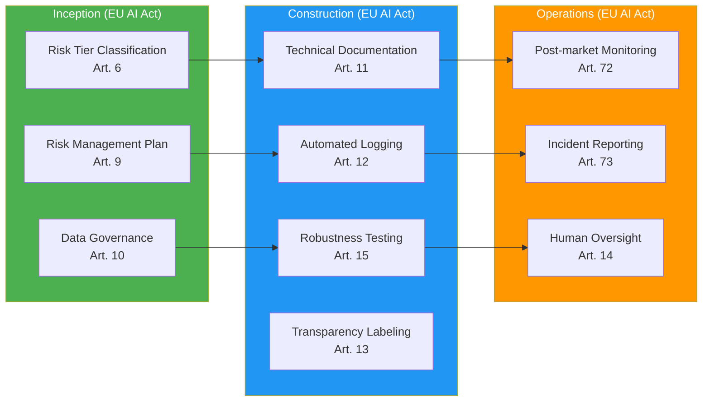

# EU AI Act (2024-2027)

> 📅 **Published**: 2026-04-18 | ⏱️ **Reading Time**: ~6 minutes

---

## Overview

**EU AI Act** is the world's first comprehensive AI regulation, adopted in May 2024 and **enforced in phases starting from 2026**.

**Enforcement Timeline:**
- **February 2025**: Prohibited AI systems enforcement begins
- **August 2026**: General Purpose AI (GPAI) provider obligations apply
- **August 2027**: High-risk AI system obligations fully enforced

---

## Risk Tier Classification

EU AI Act classifies AI systems into **4 risk tiers**:

| Risk Tier | Definition | Examples | Regulatory Level |
|-----------|------|------|----------|
| **Prohibited** | Unacceptable risk | Social credit scoring, real-time remote biometric identification (except law enforcement) | **Banned** |
| **High-risk** | High risk | Recruitment tools, credit scoring, critical infrastructure management | **Strict obligations** |
| **Limited risk** | Limited risk | Chatbots, emotion recognition | **Transparency obligations** |
| **Minimal risk** | Minimal risk | Spam filters, AI games | **Self-regulation** |

**Code Generation AI (AIDLC target) Classification:**
- **Limited risk**: Developers aware of AI-generated code → transparency obligations
- **High-risk** (conditional): Automatic code generation for critical infrastructure (healthcare, finance, power)

---

## High-risk AI Obligations

**Articles 9-15 Core Requirements:**

### 1. Risk Management System (Art. 9)
- Full lifecycle risk assessment
- Identification, analysis, mitigation, monitoring

### 2. Data Governance (Art. 10)
- Training data quality assurance
- Bias minimization

### 3. Technical Documentation (Art. 11)
- Documentation of system design, development, testing
- Must be submittable to auditing authorities

### 4. Automated Logging (Art. 12)
- Traceability of all decisions
- Log retention period: minimum 6 months

### 5. Transparency (Art. 13)
- Inform users of AI usage
- Explainable outputs

### 6. Human Oversight (HITL) (Art. 14)
- Critical decisions require human final approval
- Override authority guaranteed

### 7. Accuracy, Robustness, Cybersecurity (Art. 15)
- Define performance metrics
- Defense against adversarial attacks

---

## GPAI (General Purpose AI) Provider Obligations

**Articles 52-53**: Obligations for general-purpose model providers like Claude, GPT-4

- **Transparency Reports**: Disclose training data, energy consumption
- **Copyright Compliance**: Specify training data sources
- **Systemic Risk** (advanced GPAI, exceeding 10^25 FLOP): Risk assessment and mitigation obligations

---

## Violation Penalties

| Violation Type | Penalty |
|----------|--------|
| Use of prohibited AI | **35M€** or **7% of global annual turnover** (whichever is higher) |
| High-risk AI obligation violation | **15M€** or **3% of turnover** |
| Providing inaccurate information | **7.5M€** or **1.5% of turnover** |

---

## AIDLC Mapping

### Inception Stage Checklist

- [ ] Risk Tier classification (Limited/High-risk determination)
- [ ] Risk management plan establishment (risk identification & mitigation strategy)
- [ ] Data governance policy definition (training data sources, bias mitigation)

### Construction Stage Checklist

- [ ] Auto-generation of technical documentation (design, development, testing docs)
- [ ] Audit log implementation (record all AI decisions)
- [ ] Robustness testing (adversarial attacks, boundary cases)
- [ ] Transparency labeling on AI-generated code (`# AI-GENERATED: Claude 3.7 Sonnet`)

### Operations Stage Checklist

- [ ] Post-market monitoring (continuous production performance tracking)
- [ ] Report serious incidents within 15 days (Art. 73)
- [ ] Human oversight process operation (critical decision approval)

---

## References

**Official Documents:**
- [Regulation (EU) 2024/1689 (Official Text)](https://eur-lex.europa.eu/legal-content/EN/TXT/?uri=CELEX:32024R1689)
- [EU AI Act Timeline (European Commission)](https://digital-strategy.ec.europa.eu/en/policies/regulatory-framework-ai)

**Related Documentation:**
- [Regulatory Compliance Overview](../index.md)
- [Governance Framework](../../governance-framework.md)
- [Harness Engineering](../../../methodology/harness-engineering.md)
