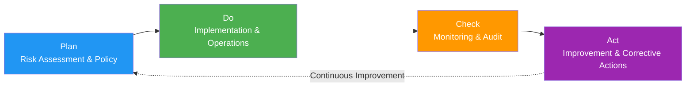

# ISO/IEC 42001:2023 (AI Management System)

> 📅 **Published**: 2026-04-18 | ⏱️ **Reading Time**: ~5 minutes

---

## Overview

**ISO/IEC 42001:2023** is the **AI Management System (AIMS) international standard** published in December 2023.

**Key Features:**
- **Certifiable**: Same structure as ISO 9001 (quality), ISO 27001 (information security)
- **PDCA-based**: Plan-Do-Check-Act cycle
- **Integrable**: Can be integrated with ISMS (ISO 27001), QMS (ISO 9001)

---

## PDCA Structure



### Plan
- Define AI management system scope
- Assess risks and opportunities
- Establish AI policies
- Set objectives

### Do
- Develop and deploy AI systems
- Implement operational controls
- Training and awareness building
- Documentation

### Check
- Performance monitoring
- Internal audit
- Management review
- Compliance assessment

### Act
- Correct nonconformities
- Continuous improvement
- Feedback loop
- Lessons learned

---

## Annex A Controls (9 Categories)

| Category | # of Controls | Key Content |
|----------|-------------|----------|
| **A.5 Policy** | 3 | AI policy documentation, executive approval |
| **A.6 Organization** | 7 | Roles & responsibilities, resource allocation |
| **A.7 Data** | 12 | Data quality, provenance, bias mitigation |
| **A.8 Information** | 8 | Transparency, explainability, documentation |
| **A.9 Human Resources** | 6 | AI competency, ethics training |
| **A.10 Operations** | 15 | AI lifecycle management, monitoring |
| **A.11 Performance** | 5 | Performance metrics, continuous improvement |
| **A.12 Security** | 10 | Adversarial attack defense, privacy |
| **A.13 Third-party** | 6 | Supply chain management, open-source models |

**AIDLC Mapping:**
- **A.7 Data**: Inception → Data governance policy
- **A.10 Operations**: Construction → Harness Quality Gates
- **A.11 Performance**: Operations → Continuous monitoring

---

## Certification Process

**ISO/IEC 42001 Certification 4 Stages:**

### 1. Gap Analysis
- Analyze current state vs ISO 42001 requirements
- Identify missing Controls
- Establish implementation roadmap

### 2. Stage 1 Audit (Documentation Review)
- Review policies, procedures, technical documentation
- Assess AI management system design adequacy
- Verify Stage 2 Audit readiness

### 3. Stage 2 Audit (On-site Assessment)
- Verify actual implementation
- Review operational evidence
- Interviews and observations
- Identify nonconformities

### 4. Certification Issuance and Maintenance
- Validity: 3 years
- Annual surveillance audit
- Recertification audit every 3 years

**AIDLC Response**: [Governance Framework](../../governance-framework.md) steering files → Automated ISO 42001 Controls mapping

---

## ISMS/QMS Integration

**ISO 42001 + ISO 27001 Integration Synergy:**
- **A.12 Security** (ISO 42001) ↔ **A.8 Asset Management** (ISO 27001)
- **A.10 Operations** (ISO 42001) ↔ **A.12 Operations Security** (ISO 27001)
- Single audit for simultaneous renewal of both certifications

**ISO 42001 + ISO 9001 Integration:**
- **A.11 Performance** (ISO 42001) ↔ **8. Operations** (ISO 9001)
- **A.5 Policy** (ISO 42001) ↔ **5. Leadership** (ISO 9001)
- Integrated operation of quality management system and AI management system

---

## AIDLC Integration Examples

### Inception Stage: A.7 Data Governance

```yaml
# .aidlc/compliance/iso-42001-data-governance.yaml
data_governance:
  # A.7.1: Data Collection
  collection:
    sources:
      - "GitHub public repositories"
      - "Stack Overflow"
    licensing: "MIT, Apache 2.0"
    
  # A.7.3: Data Quality
  quality:
    validation_rules:
      - "syntax correctness"
      - "no PII/credentials"
    rejection_criteria:
      - "license violation"
      - "malicious code"
  
  # A.7.5: Bias Mitigation
  bias_mitigation:
    strategy: "Balance across diverse languages/frameworks"
    monitoring: "Track language distribution in generated code"
```

### Construction Stage: A.10 Operational Controls

```yaml
# .aidlc/harness/iso-42001-controls.yaml
operational_controls:
  # A.10.2: Risk Management
  - control_id: A.10.2
    name: "AI System Risk Management"
    implementation: "Quality Gates (SAST, independent review)"
    
  # A.10.5: Human Intervention
  - control_id: A.10.5
    name: "Human Oversight"
    implementation: "Mandatory Senior Developer code review"
    
  # A.10.10: Continuous Monitoring
  - control_id: A.10.10
    name: "Continuous Monitoring"
    implementation: "Grafana dashboard (performance metrics)"
```

### Operations Stage: A.11 Performance Measurement

```yaml
# .aidlc/monitoring/iso-42001-performance.yaml
performance_kpis:
  # A.11.1: Performance Metrics
  - metric: "code_quality"
    target: "Code coverage >= 80%"
    measurement: "SonarQube"
    
  - metric: "security_compliance"
    target: "0 critical vulnerabilities"
    measurement: "Bandit, Semgrep"
    
  # A.11.3: Continuous Improvement
  improvement_process:
    frequency: "quarterly"
    review: "Management review meeting"
    actions:
      - "Process improvement when metrics fall short"
      - "Best practice updates"
```

---

## References

**Official Documents:**
- [ISO/IEC 42001:2023 (ISO Store)](https://www.iso.org/standard/81230.html)
- [ISO 42001 Implementation Guide (BSI)](https://www.bsigroup.com/en-GB/iso-42001-artificial-intelligence-management-system/)

**Certification Bodies:**
- [BSI (British Standards Institution)](https://www.bsigroup.com/)
- [DNV (Det Norske Veritas)](https://www.dnv.com/)
- [TÜV SÜD](https://www.tuvsud.com/)

**Related Documentation:**
- [Regulatory Compliance Overview](../index.md)
- [Governance Framework](../../governance-framework.md)
- [Harness Engineering](../../../methodology/harness-engineering.md)
