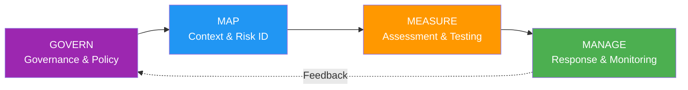

# NIST AI RMF 1.1 (Risk Management Framework)

> 📅 **Published**: 2026-04-18 | ⏱️ **Reading Time**: ~5 minutes

---

## Overview

**NIST AI RMF (Risk Management Framework)** is the AI risk management framework published by the U.S. National Institute of Standards and Technology (NIST) in 2023.

**Key Features:**
- **Voluntary Compliance** — No legal enforcement
- **Federal Procurement Requirement**: NIST AI RMF compliance mandatory for U.S. government contracts (EO 14110)
- **International Compatibility**: Interoperable with ISO/IEC 42001

**Version History:**
- v1.0 (Jan 2023): Initial release
- v1.1 (Dec 2024): Added Generative AI section, enhanced transparency

---

## 4 Functions — GOVERN, MAP, MEASURE, MANAGE



### 1. GOVERN

**Purpose**: Establish AI system governance policies, culture, and accountability

**Core Subcategories:**
- **GOVERN-1.1**: Establish AI risk management strategy
- **GOVERN-1.2**: Clarify accountability (AI system owners)
- **GOVERN-1.3**: Integrate legal, regulatory, and ethical considerations
- **GOVERN-1.4**: Foster organization-wide AI risk culture

**AIDLC Mapping**: [Governance Framework](../../governance-framework.md) — 3-layer governance model

### 2. MAP

**Purpose**: Understand AI system context, identify risks

**Core Subcategories:**
- **MAP-1.1**: Understand business context (use cases, stakeholders)
- **MAP-1.2**: Define AI system scope (inputs, outputs, dependencies)
- **MAP-2.1**: Assess data quality
- **MAP-3.1**: Identify risks (bias, privacy, security)
- **MAP-5.1**: Impact assessment

**AIDLC Mapping**: Inception → Requirements Analysis, Reverse Engineering

### 3. MEASURE

**Purpose**: Measure AI system performance, trustworthiness, fairness

**Core Subcategories:**
- **MEASURE-1.1**: Define performance metrics (accuracy, F1, AUC)
- **MEASURE-2.1**: Assess explainability
- **MEASURE-2.2**: Bias testing (demographic parity, equalized odds)
- **MEASURE-2.3**: Robustness testing (adversarial robustness)
- **MEASURE-3.1**: Privacy impact assessment

**AIDLC Mapping**: Construction → Build & Test, [Harness Engineering](../../../methodology/harness-engineering.md) Quality Gates

### 4. MANAGE

**Purpose**: AI risk response, monitoring, continuous improvement

**Core Subcategories:**
- **MANAGE-1.1**: Execute risk mitigation strategies
- **MANAGE-2.1**: Incident response planning
- **MANAGE-3.1**: Continuous monitoring
- **MANAGE-4.1**: Feedback loop (risk reassessment)

**AIDLC Mapping**: Operations → Post-market monitoring, incident response

---

## NIST AI RMF 1.0 → 1.1 Major Changes

| Item | v1.0 (Jan 2023) | v1.1 (Dec 2024) |
|------|---------------|---------------|
| **Generative AI** | Brief mention | Dedicated section added (Appendix B) |
| **Transparency** | MEASURE-2.1 | Enhanced (Model Card, Data Sheet examples) |
| **Red Teaming** | - | Added MEASURE-2.3 (adversarial testing) |
| **Supply Chain** | GOVERN-1.5 | Expanded (open-source model risks) |

---

## U.S. Federal Procurement Requirements (EO 14110)

**Executive Order 14110 (Oct 30, 2023)**: "Safe, Secure, and Trustworthy AI"

**Key Points:**
- Federal agencies **must comply with NIST AI RMF** when deploying AI
- Models exceeding 10^26 FLOP **must report to government**
- Federal procurement contracts **must include AI risk management clauses**

**AIDLC Response**: NIST AI RMF mapping mandatory for U.S. federal contract projects

---

## AIDLC Integration Examples

### Inception Stage: GOVERN + MAP

```yaml
# .aidlc/compliance/nist-map.yaml
project: federal-contract-ai-tool
assessment_date: 2026-04-18

# GOVERN-1.1: AI Risk Management Strategy
governance:
  strategy: "Federal contract-compliant AI code generation tool"
  responsible_party: "AI Governance Team"
  
# MAP-1.1: Business Context
business_context:
  use_case: "Federal agency backend service code generation"
  stakeholders:
    - "Federal procurement officers"
    - "Development team"
    - "Security team"

# MAP-3.1: Risk Identification
identified_risks:
  - risk_id: RISK-001
    category: "Security"
    description: "Vulnerabilities in generated code"
    mitigation: "Automated SAST scanning"
  - risk_id: RISK-002
    category: "Privacy"
    description: "PII exposure"
    mitigation: "Guardrails filtering"
```

### Construction Stage: MEASURE

```yaml
# .aidlc/harness/nist-measure-gates.yaml
quality_gates:
  # MEASURE-1.1: Performance Metrics
  - gate: performance_metrics
    enabled: true
    metrics:
      code_coverage: ">= 80%"
      duplication: "<= 3%"
      
  # MEASURE-2.2: Bias Testing
  - gate: bias_test
    enabled: true
    tests:
      - "demographic_parity_check"
      - "equalized_odds_check"
    
  # MEASURE-2.3: Robustness Testing
  - gate: adversarial_robustness
    enabled: true
    tools:
      - "bandit"  # SAST
      - "semgrep"
```

### Operations Stage: MANAGE

```yaml
# .aidlc/monitoring/nist-manage.yaml
continuous_monitoring:
  # MANAGE-3.1: Continuous Monitoring
  metrics:
    - name: "error_rate"
      target: "< 1%"
      alert_threshold: 0.95
    - name: "bias_score"
      target: "< 0.05"
      alert_threshold: 0.04
  
  # MANAGE-4.1: Feedback Loop
  feedback_loop:
    frequency: "monthly"
    action: "Risk reassessment and mitigation strategy update"
```

---

## References

**Official Documents:**
- [NIST AI RMF 1.1 (Dec 2024)](https://www.nist.gov/itl/ai-risk-management-framework)
- [Executive Order 14110 (White House)](https://www.whitehouse.gov/briefing-room/presidential-actions/2023/10/30/executive-order-on-the-safe-secure-and-trustworthy-development-and-use-of-artificial-intelligence/)

**Related Documentation:**
- [Regulatory Compliance Overview](../index.md)
- [Governance Framework](../../governance-framework.md)
- [Harness Engineering](../../../methodology/harness-engineering.md)
