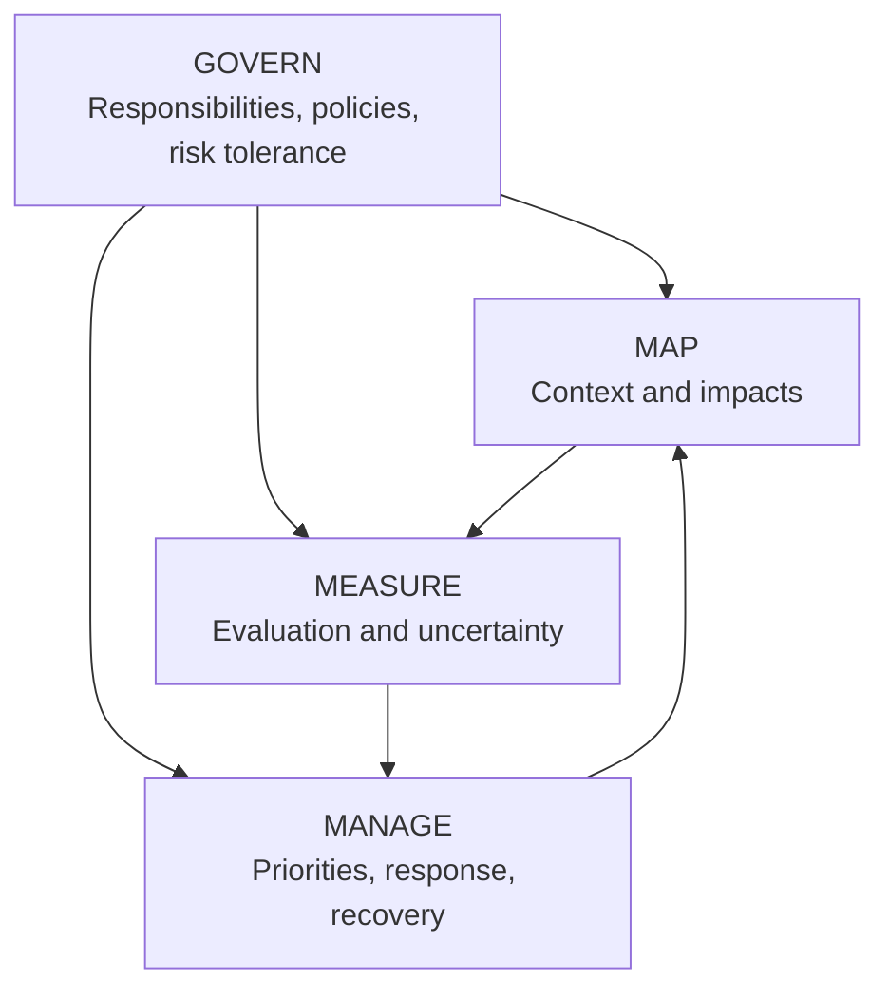

## Overview

The **NIST AI Risk Management Framework (AI RMF)** is a voluntary framework for managing risks throughout the design, development, deployment, and use of AI systems. This guide maps AIDLC activities to **AI RMF 1.0 (NIST AI 100-1, January 2023)** and the **Generative AI Profile (NIST AI 600-1, July 2024)**.

- **Scope:** The framework is not limited to a particular industry or federal procurement. Select activities according to the system's context, risk tolerance, and organizational responsibilities.
- **Legal requirements:** Distinguish the voluntary framework from obligations in applicable laws, agency policies, and contracts. An AI RMF mapping alone does not establish compliance.
- **Evidence:** Connect each risk to an owner, evaluation method, decision record, and residual risk.

## 4 Functions — GOVERN, MAP, MEASURE, MANAGE

GOVERN applies across the other three functions. MAP, MEASURE, and MANAGE are activities repeated throughout the system lifecycle, rather than a fixed certification sequence.


```mermaid
flowchart TB
    accTitle: The four NIST AI RMF functions
    accDescr: GOVERN supports MAP, MEASURE, and MANAGE as they repeat context identification, measurement, and risk response.
    GOV["GOVERN<br/>Responsibilities, policies, risk tolerance"]
    MAP["MAP<br/>Context and impacts"]
    MEASURE["MEASURE<br/>Evaluation and uncertainty"]
    MANAGE["MANAGE<br/>Priorities, response, recovery"]
    GOV --> MAP
    GOV --> MEASURE
    GOV --> MANAGE
    MAP --> MEASURE --> MANAGE --> MAP
```

The identifiers below are selected [official AI RMF Core subcategories](https://airc.nist.gov/airmf-resources/airmf/5-sec-core/). Their descriptions are summaries; the AIDLC mappings are this guide's implementation examples.

### 1. GOVERN

**Purpose:** Establish the policies, responsibilities, and organizational basis for risk management.

- **GOVERN 1.1:** Understand, manage, and document applicable legal and regulatory requirements.
- **GOVERN 1.2:** Incorporate trustworthy AI characteristics into organizational policies, processes, and practices.
- **GOVERN 1.3:** Determine the level of risk management needed according to organizational risk tolerance.
- **GOVERN 2.1:** Document clear roles, responsibilities, and communication paths.

**AIDLC mapping:** Connect these activities to owners, review criteria, and exception records in the [governance framework](../../governance-framework.md).

### 2. MAP

**Purpose:** Understand the system's context and potential impacts.

- **MAP 1.1:** Document intended uses, users, deployment contexts, expectations, and limitations.
- **MAP 1.6:** Elicit and understand system requirements with relevant stakeholders.
- **MAP 2.1:** Define the tasks and implementation methods the system will support.
- **MAP 4.1:** Identify technical and legal risks in components, including third-party data and software.
- **MAP 5.1:** Document the likelihood and magnitude of identified impacts.

**AIDLC mapping:** Specify context, dependencies, and failure impacts during Inception's Requirements Analysis and Reverse Engineering.

### 3. MEASURE

**Purpose:** Evaluate identified risks and trustworthiness characteristics, including measurement limitations.

- **MEASURE 1.1:** Select methods for priority risks and document risks that cannot be measured.
- **MEASURE 2.1:** Document evaluation conditions, including test data, metrics, and tools.
- **MEASURE 2.3:** Evaluate performance or assurance criteria under conditions similar to deployment.
- **MEASURE 2.7:** Evaluate security and resilience.
- **MEASURE 2.9 / 2.10 / 2.11:** Evaluate explanation and interpretation, privacy risk, and fairness and bias, respectively.

**AIDLC mapping:** Connect these activities to Construction's Build & Test and [harness engineering](../../../methodology/harness-engineering.md) quality gates. Code coverage and successful SAST scans do not substitute for evaluating AI fairness or reliability.

### 4. MANAGE

**Purpose:** Allocate risk-response resources according to evaluation results and improve operations.

- **MANAGE 1.1:** Decide whether the system meets its objectives and whether development or deployment should proceed.
- **MANAGE 1.2:** Prioritize risk treatment by impact, likelihood, and available resources.
- **MANAGE 2.3 / 2.4:** Respond to and recover from new risks; disengage or replace the system when needed.
- **MANAGE 3.1:** Monitor risks and benefits of third-party resources.
- **MANAGE 4.1 / 4.3:** Implement monitoring, change, and recovery plans and communicate incidents to relevant parties.

**AIDLC mapping:** Connect these activities to monitoring, incident response, rollback, and risk reassessment during Operations.

## AI RMF 1.0 and the Generative AI Profile {#nist-ai-rmf-10--11-major-changes}

| Resource | Role | Use |
|---|---|---|
| AI RMF 1.0, January 2023 | Defines the four functions, categories, and subcategories | Design system-specific risk activities and evidence records |
| NIST AI 600-1, July 2024 | A cross-sectoral generative AI profile of AI RMF 1.0 | Select generative AI risk actions for the intended context |
| AI RMF Playbook | Companion implementation resources | Consult suggested activities and review questions |

The Generative AI Profile is **not a separate AI RMF 1.1 revision**. This guide uses the publications identified above; check NIST's publication history when adopting the framework.

## U.S. Federal Procurement and Policy History {#us-federal-procurement-requirements-eo-14110}

EO 14110 was issued on October 30, 2023, but **EO 14148 revoked it on January 20, 2025**. It should therefore not be cited as a current blanket requirement for all federal contractors to comply with AI RMF, or as a current model-training reporting obligation. The status of individual regulations and agency actions after revocation must be checked separately.

OMB M-25-21 and M-25-22, issued in April 2025, address federal AI use and acquisition. This guide does not determine their applicability to a particular contract. Review the OMB guidance, agency policy, solicitation, and contract clauses applicable at the time, then map the required controls to AI RMF activities.

**Record:** The applicable document and version, agency and contract scope, requirement identifier, control owner, evidence location, and review date.

## AIDLC Integration Examples

The YAML below illustrates **project-owned records**. It is neither a NIST standard schema nor configuration automatically executed by AIDLC tooling. Validate and choose thresholds and tests for the specific use case.

### Inception Stage: GOVERN + MAP

```yaml
project: federal-contract-ai-tool
assessment_date: "2026-09-18"
framework: "NIST AI RMF 1.0"
governance:
  references: ["GOVERN 1.1", "GOVERN 2.1"]
  responsible_team: "AI Governance Team"
  applicable_requirements: [] # Populate from the applicable contract and policy review.
context:
  references: ["MAP 1.1", "MAP 2.1", "MAP 4.1"]
  intended_use: "Generate draft backend code for human review"
  autonomous_deployment: false
  dependencies: ["model-provider", "code-repository"]
risks:
  - id: RISK-001
    description: "Generated code introduces vulnerabilities"
    planned_controls: ["security testing", "human review"]
  - id: RISK-002
    description: "Prompts disclose restricted information"
    planned_controls: ["data minimization", "access controls"]
```

### Construction Stage: MEASURE

```yaml
evaluation_plan:
  references: ["MEASURE 1.1", "MEASURE 2.1", "MEASURE 2.3"]
  dataset_revision: "replace-with-reviewed-revision"
  model_revision: "replace-with-pinned-revision"
  task_success:
    minimum_rate: 0.95 # Illustrative project threshold, not a NIST requirement.
    uncertainty: "Record sample size and a confidence interval"
  security:
    reference: "MEASURE 2.7"
    checks: ["SAST", "dependency review", "prompt injection tests"]
  privacy:
    reference: "MEASURE 2.10"
    checks: ["prompt data review", "output disclosure tests"]
  fairness:
    reference: "MEASURE 2.11"
    decision: "Define relevant groups and metrics, or document non-applicability"
  unmeasured_risks: [] # Record limitations before a release decision.
```

### Operations Stage: MANAGE

```yaml
operations_plan:
  references: ["MANAGE 2.4", "MANAGE 4.1", "MANAGE 4.3"]
  task_failure_rate:
    unit: "fraction of evaluated tasks"
    observation_window: "1h"
    warning_threshold: 0.008 # 0.8%; illustrative.
    release_limit: 0.01 # 1%; illustrative.
    minimum_evaluated_tasks: 1000 # Choose using a workload-specific sample plan.
    missing_evaluations: "Track coverage separately; do not treat as success"
  incident_response:
    owner: "on-call platform team"
    actions: ["pause automated actions", "review impact", "restore approved revision"]
    communication: "Follow the applicable incident notification plan"
  risk_review:
    triggers: ["model change", "material incident", "new use case", "scheduled review"]
```

## References

**Official framework:**

- [NIST AI RMF 1.0](https://nvlpubs.nist.gov/nistpubs/ai/NIST.AI.100-1.pdf)
- [AI RMF Core — functions, categories, and subcategories](https://airc.nist.gov/airmf-resources/airmf/5-sec-core/)
- [Generative AI Profile, NIST AI 600-1](https://nvlpubs.nist.gov/nistpubs/ai/NIST.AI.600-1.pdf)
- [NIST AI RMF publications](https://www.nist.gov/itl/ai-risk-management-framework)

**Policy history and procurement:**

- [EO 14148 — revocation of EO 14110](https://www.whitehouse.gov/presidential-actions/2025/01/initial-rescissions-of-harmful-executive-orders-and-actions/)
- [OMB M-25-21 and M-25-22 publication announcement](https://www.whitehouse.gov/fact-sheets/2025/04/fact-sheet-eliminating-barriers-for-federal-artificial-intelligence-use-and-procurement/)

**Related documents:**

- [Regulatory compliance overview](../index.md)
- [Governance framework](../../governance-framework.md)
- [Harness engineering](../../../methodology/harness-engineering.md)
