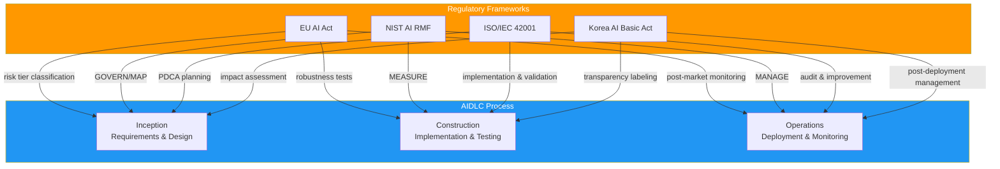

# AI Regulatory Framework Mapping

> 📅 **Published**: 2026-04-18 | ⏱️ **Reading Time**: ~8 minutes

---

## Overview

As of 2026, global enterprises face a complex environment requiring **simultaneous compliance with AI regulations across multiple jurisdictions**:

- **EU**: AI Act (adopted 2024, phased enforcement begins 2026-2027)
- **United States**: NIST AI RMF 1.1 (federal procurement requirement), state-level regulations
- **Korea**: AI Basic Act (AI 기본법, enforcement expected 2026)
- **International Standard**: ISO/IEC 42001:2023 (AI Management System certification)

### Why AIDLC Integration is Essential

**Direct mapping** of regulatory requirements to **AIDLC process stages** enables:

1. **Automatic Compliance**: Auto-execution of required controls at each stage
2. **Unified Audit Trail**: Single audit tracking system for all regulations
3. **Efficient Updates**: Only modify AIDLC stage definitions when regulations change
4. **Evidence Auto-Collection**: Automatic generation of compliance reports

---

## Four Framework Summary

### EU AI Act (2024-2027)

**Key Features:**
- World's first comprehensive AI regulation (legally binding)
- 4-tier risk classification (Prohibited/High-risk/Limited/Minimal)
- Strict obligations for High-risk AI systems (risk management, data governance, technical documentation, automated logging, transparency, human oversight, robustness)
- Penalties: Up to 35M€ or 7% of global annual turnover

**AIDLC Application:**
- **Inception**: Risk Tier classification, risk management plan
- **Construction**: Auto-generation of technical documentation, audit logs, robustness testing
- **Operations**: Post-market monitoring, incident reporting (within 15 days)

[Detailed Guide →](./frameworks/eu-ai-act.md)

### NIST AI RMF 1.1

**Key Features:**
- Published by U.S. NIST (voluntary compliance, mandatory for federal procurement)
- 4 Functions: GOVERN, MAP, MEASURE, MANAGE
- Dedicated Generative AI section (v1.1, Dec 2024)
- International compatibility (interoperable with ISO/IEC 42001)

**AIDLC Application:**
- **Inception**: GOVERN + MAP (governance & risk identification)
- **Construction**: MEASURE (performance, bias, robustness evaluation)
- **Operations**: MANAGE (risk response & continuous monitoring)

[Detailed Guide →](./frameworks/nist-ai-rmf.md)

### ISO/IEC 42001:2023

**Key Features:**
- International AI Management System standard (certifiable)
- PDCA-based (Plan-Do-Check-Act cycle)
- 72 Controls across 9 categories (Annex A)
- Integrable with ISMS (ISO 27001), QMS (ISO 9001)

**AIDLC Application:**
- **Inception**: Plan (risk assessment & policy establishment)
- **Construction**: Do + Check (implementation, validation, monitoring)
- **Operations**: Act (improvement & corrective actions)

[Detailed Guide →](./frameworks/iso-42001.md)

### Korea AI Basic Act (AI 기본법, 2026)

**Key Features:**
- Expected enforcement in H1 2026
- Mandatory impact assessment for high-impact AI systems
- Labeling obligation for generative AI (watermark/metadata recommended)
- Cross-compliance with PIPA/ISMS-P

**AIDLC Application:**
- **Inception**: Impact assessment (high-impact AI determination)
- **Construction**: Transparency labeling for AI-generated code
- **Operations**: Post-deployment management (malfunction correction, major incident reporting)

[Detailed Guide →](./frameworks/korea-ai-law.md)

---

## Comparative Matrix

### Control-Level Regulatory Mapping

| Control Element | EU AI Act | NIST AI RMF | ISO/IEC 42001 | Korea AI Basic Act |
|----------|-----------|-------------|---------------|---------------|
| **Risk Assessment** | Art. 6, 9 (risk mgmt) | MAP-3.1 | A.5.1 (policy), A.10.2 (risk mgmt) | Impact assessment (high-impact AI) |
| **Data Governance** | Art. 10 (data quality) | MAP-2.1 | A.7.* (12 data controls) | PIPA compliance |
| **Transparency & Explainability** | Art. 13 (transparency) | MEASURE-2.1 | A.8.2 (transparency), A.8.3 (explanation) | Generative AI labeling obligation |
| **Human Oversight (HITL)** | Art. 14 (human oversight) | MANAGE-3.1 | A.10.5 (human intervention) | - |
| **Technical Documentation** | Art. 11 (documentation) | GOVERN-1.4 | A.8.1 (docs), A.10.6 (records) | - |
| **Performance Monitoring** | Art. 15 (accuracy) | MEASURE-1.1 | A.11.1 (performance metrics) | - |
| **Post-Market Monitoring** | Art. 72 (post-market) | MANAGE-3.1 | A.10.10 (continuous monitoring) | Post-deployment mgmt obligation |
| **Incident Reporting** | Art. 73 (within 15 days) | MANAGE-2.1 | A.10.11 (incident response) | Major incident reporting |
| **Security** | Art. 15 (cybersecurity) | MEASURE-2.3 | A.12.* (10 security controls) | ISMS-P integration |
| **Supply Chain Management** | - | GOVERN-1.5 | A.13.* (6 third-party controls) | - |

### Regulatory Requirements by AIDLC Stage

```mermaid
graph TB
    subgraph Inception["Inception Stage"]
        I1["EU AI Act: Risk Tier classification (Art. 6)"]
        I2["NIST: GOVERN + MAP"]
        I3["ISO 42001: Plan (PDCA)"]
        I4["Korea: Impact assessment"]
    end
    
    subgraph Construction["Construction Stage"]
        C1["EU AI Act: Documentation (Art. 11), Logging (Art. 12)"]
        C2["NIST: MEASURE"]
        C3["ISO 42001: Do + Check (PDCA)"]
        C4["Korea: Generation labeling obligation"]
    end
    
    subgraph Operations["Operations Stage"]
        O1["EU AI Act: Post-market monitoring (Art. 72)"]
        O2["NIST: MANAGE"]
        O3["ISO 42001: Act (PDCA)"]
        O4["Korea: Post-deployment management"]
    end
    
    I1 -.Common goal: Risk identification.-> I2
    I2 -.Common goal: Risk identification.-> I3
    I3 -.Common goal: Risk identification.-> I4
    
    C1 -.Common goal: Safety validation.-> C2
    C2 -.Common goal: Safety validation.-> C3
    C3 -.Common goal: Safety validation.-> C4
    
    O1 -.Common goal: Continuous monitoring.-> O2
    O2 -.Common goal: Continuous monitoring.-> O3
    O3 -.Common goal: Continuous monitoring.-> O4
    
    style Inception fill:#4caf50,color:#fff
    style Construction fill:#2196f3,color:#fff
    style Operations fill:#ff9800,color:#fff
```

---

## Next Steps

import DocCardList from '@theme/DocCardList';

<DocCardList />

---

## References

### Official Documents

**EU AI Act:**
- [Regulation (EU) 2024/1689 (Official Text)](https://eur-lex.europa.eu/legal-content/EN/TXT/?uri=CELEX:32024R1689)
- [EU AI Act Timeline (European Commission)](https://digital-strategy.ec.europa.eu/en/policies/regulatory-framework-ai)

**NIST AI RMF:**
- [NIST AI RMF 1.1 (2024.12)](https://www.nist.gov/itl/ai-risk-management-framework)
- [Executive Order 14110 (White House)](https://www.whitehouse.gov/briefing-room/presidential-actions/2023/10/30/executive-order-on-the-safe-secure-and-trustworthy-development-and-use-of-artificial-intelligence/)

**ISO/IEC 42001:**
- [ISO/IEC 42001:2023 (ISO Store)](https://www.iso.org/standard/81230.html)
- [ISO 42001 Implementation Guide (BSI)](https://www.bsigroup.com/en-GB/iso-42001-artificial-intelligence-management-system/)

**Korea AI Basic Act:**
- [Ministry of Science and ICT AI Policy](https://www.msit.go.kr/bbs/list.do?sCode=user&mId=113&mPid=112)
- [Personal Information Protection Act (PIPA)](https://www.pipc.go.kr/np/default/page.do?mCode=D030010000)

### AWS Resources

- [AWS Artifact (Compliance Reports)](https://aws.amazon.com/artifact/) — EU AI Act, ISO 42001 compliance reports
- [AWS Compliance Center](https://aws.amazon.com/compliance/programs/) — Regional regulatory mapping
- [Amazon Bedrock Guardrails](https://docs.aws.amazon.com/bedrock/latest/userguide/guardrails.html) — Runtime guardrails implementation

### Related AIDLC Documentation

- [Governance Framework](../governance-framework.md) — 3-layer governance model, steering files
- [Harness Engineering](../../methodology/harness-engineering.md) — Quality Gates, independent verification principles
- [Adaptive Execution](../../methodology/adaptive-execution.md) — AIDLC stage-wise execution conditions
- [Adoption Strategy](../adoption-strategy.md) — Organization-specific AIDLC adoption roadmap
