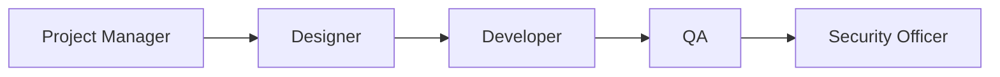
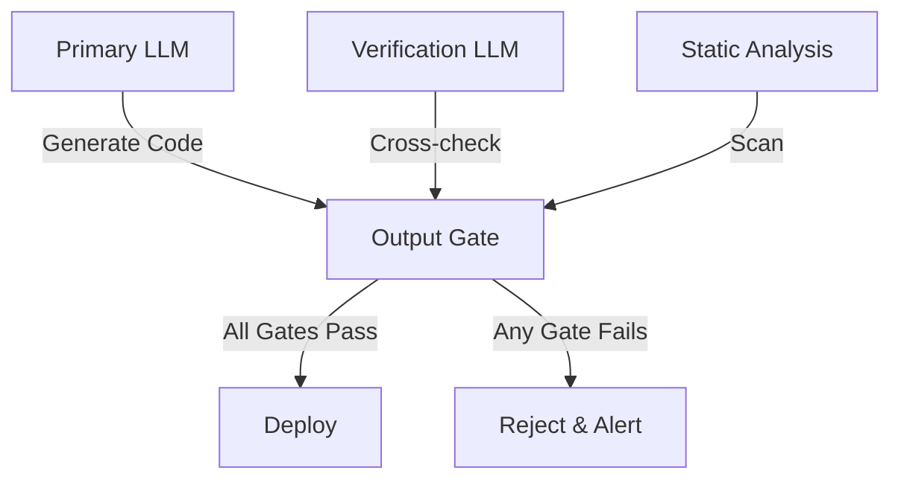
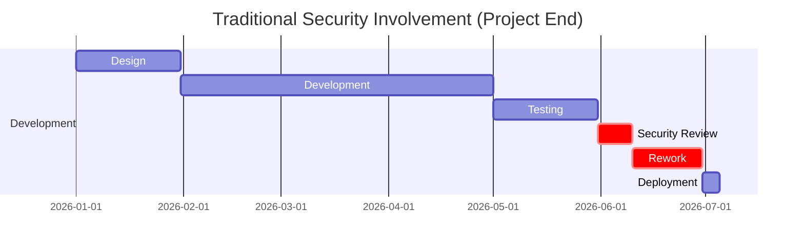
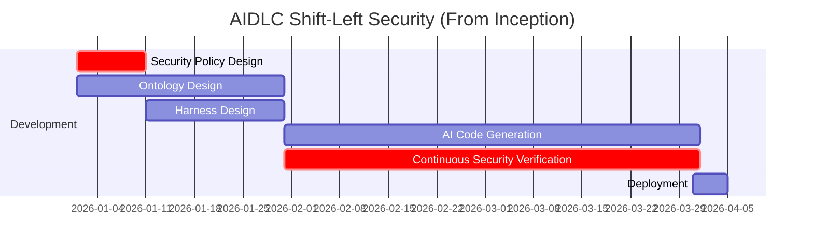
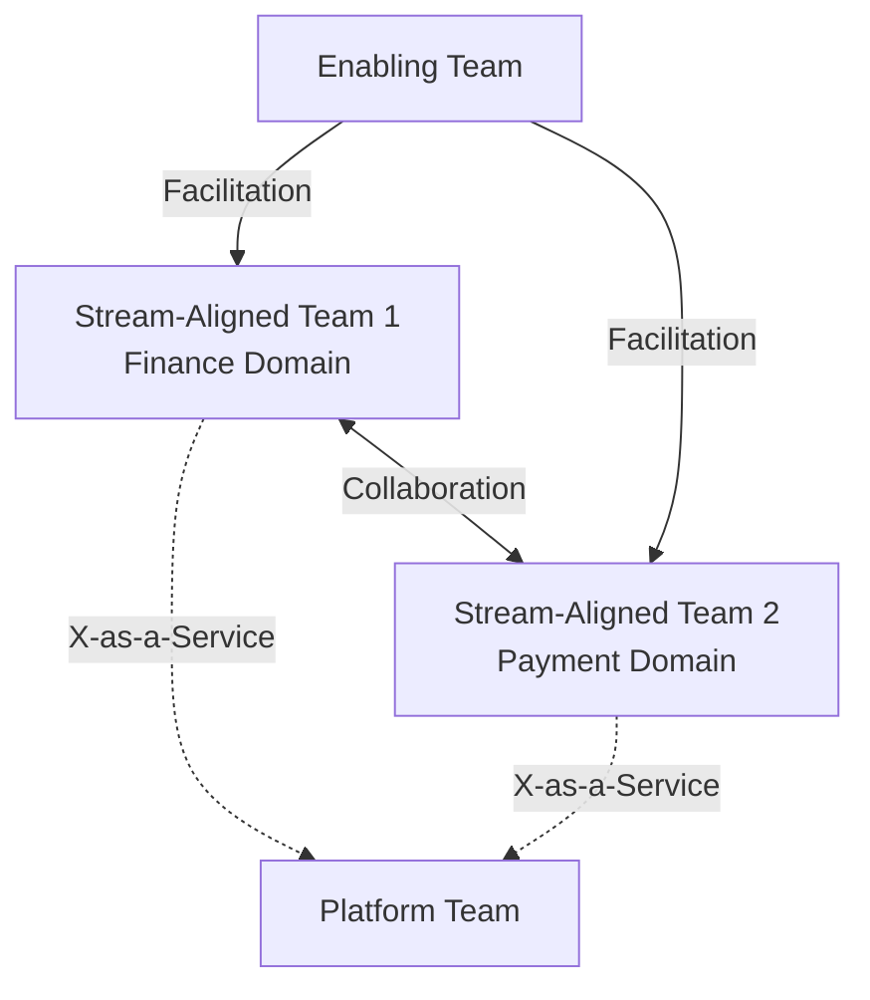

# Role Composition

AIDLC fundamentally transforms traditional SI team structures through code generation automation. The core insight: **When AI handles code generation, humans transition to harness design, ontology management, and AI output verification**.

## Traditional SI Role Model

Traditional SI projects operate with sequential handoff structure:



### Responsibilities by Role

- **Project Manager**: Scope definition, schedule management, customer communication
- **Designer**: Architecture design, technology stack selection, interface definition
- **Developer**: Code writing, unit testing, integration development (60-70% of team)
- **QA**: Test case writing, manual testing, defect tracking (15-20% of team)
- **Security Officer**: Vulnerability scanning, security review at project end (1-2 per project)

### Problems

1. **Sequential Handoff**: Context loss at each stage
2. **Late Security Involvement**: Discovering vulnerabilities at project end causes exponential rework costs
3. **Developer Bottleneck**: Most of team dedicated to code writing, but productivity depends on individual capability
4. **Testing Delay**: QA starts after development completion, lengthening feedback cycle

## AIDLC Role Transformation

In AIDLC methodology, roles are fundamentally redefined:

| Traditional Role | AIDLC Role | Change Content |
|------------|-----------|---------|
| Project Manager | Intent Architect | Define business intent as structured specifications AI can understand |
| Designer | Ontology Steward | Design and evolve domain ontology, curate knowledge graphs |
| Developer | Harness Engineer | Transition from code writing → Harness design (circuit breakers, quality gates) |
| QA | AI Verifier | Manual testing → Verify quality of AI-generated tests, measure harness effectiveness |
| Security Officer | Shift-Left Security | Project end → Move to Inception phase, design harness security policies |

### Intent Architect

**Traditional PM** managed scope and schedule, but **Intent Architect** transforms business intent into AI-executable structures.

#### Core Competencies
- Map customer requirements to domain ontology entities
- Write intent specifications (structured intent specification)
- Verify AI-generated results align with business intent
- Express change requests as ontology patches

#### Tools
- Ontology visualization tools (Neo4j Bloom, GraphXR)
- Intent specification templates (YAML/JSON schema)
- Business rule engines (Drools, DMN)

### Ontology Steward

**Traditional Designer** designed technical architecture, but **Ontology Steward** designs and evolves domain knowledge structure.

#### Core Competencies
- Domain ontology design (entities, relationships, constraints)
- Ontology version management and migration
- Multi-domain ontology integration (finance+payment, healthcare+insurance)
- Ontology quality verification (consistency, completeness, ambiguity removal)

#### Tools
- Ontology editors (Protégé, WebVOWL)
- Graph databases (Neo4j, Amazon Neptune)
- RDF/OWL conversion tools

#### Differences from Traditional Designer

| Aspect | Traditional Designer | Ontology Steward |
|-----|------------|----------------|
| Deliverable | API specs, ERD | Ontology schema, knowledge graph |
| Tools | UML, Swagger | Protégé, Neo4j |
| Verification Method | Technical review | Reasoning engine verification |
| Change Management | Version control (Git) | Ontology patches (semantic diff) |

See [Ontology Engineering](../methodology/ontology-engineering.md) for details.

## Harness Engineer Role Details

### Paradigm Shift: "AI Generates Code, Humans Design Harness"

In the OpenAI Codex case, over 1 million lines of code were generated by AI, but **human engineers focused on harness design** to ensure quality and stability.

> "We don't write code anymore. We design guardrails and circuit breakers that keep AI-generated code safe and aligned with business intent."  
> — Production Engineering Team, OpenAI (2024)

### Core Competencies

#### 1. Circuit Breaker Design

Design mechanisms to automatically halt AI-generated code when unexpected behavior occurs:

```yaml
# Example: API call circuit breaker
circuit_breaker:
  failure_threshold: 5
  timeout_seconds: 30
  fallback_strategy: cached_response
  monitoring:
    - metric: error_rate
      threshold: 0.05
      window: 5m
```

#### 2. Retry Budget Management

Limit AI agent retry attempts and costs:

```yaml
# Example: LLM call retry budget
retry_budget:
  max_attempts: 3
  backoff_strategy: exponential
  cost_limit_usd: 0.50
  circuit_breaker:
    - condition: token_count > 8000
      action: switch_to_smaller_model
```

#### 3. Output Gate Definition

Verification gates AI-generated results must pass before production deployment:

```yaml
# Example: Code generation output gate
output_gates:
  - name: security_scan
    tools: [semgrep, bandit]
    blocking: true
  - name: unit_test_coverage
    threshold: 0.85
    blocking: true
  - name: performance_regression
    baseline: p95_latency_100ms
    blocking: false
    alert: slack_channel
```

#### 4. Independent Verification Structure

Cross-verify AI-generated results with other AI models or independent tools:



### Differences from Traditional Developer

| Aspect | Traditional Developer | Harness Engineer |
|-----|------------|--------------|
| Primary Activity | Code writing (80%) | Harness design (70%), Verification (30%) |
| Productivity Metric | Commit count, LOC | Harness hit rate, Defect prevention rate |
| Technology Stack | Programming languages | YAML/JSON DSL, Monitoring tools |
| Debugging Method | Code reading | Harness log analysis, AI decision tracking |
| Collaboration Method | Code review | Harness review, Ontology sync |

See [Harness Engineering](../methodology/harness-engineering.md) for details.

## AI Verifier

**Traditional QA** executed manual tests, but **AI Verifier** validates quality of AI-generated tests and measures whether harness actually prevents defects.

### Core Competencies

#### 1. AI-Generated Test Quality Verification
- Test case coverage analysis (identify missing edge cases)
- Test data diversity verification (boundary, negative, fuzzing)
- Flaky test identification and removal

#### 2. Harness Effectiveness Measurement
- Circuit breaker hit rate (false positive/negative ratio)
- Output gate block rate (which gates prevent most defects)
- Retry budget exhaustion patterns (which scenarios retry frequently)

#### 3. Independent Verification Design
- Cross-verify with different model than Primary LLM
- Measure agreement between static analysis tools and AI judgment
- Compare distribution between production data and generated data

### Differences from Traditional QA

| Aspect | Traditional QA | AI Verifier |
|-----|---------|---------|
| Test Writing | Manual writing (80%) | AI generation verification (90%) |
| Defect Discovery Method | Manual execution | Harness log analysis |
| Coverage Goal | Line coverage | Intent coverage |
| Regression Testing | Execute all | Harness auto-selects |

## Team Composition Ratio Changes

AIDLC adoption fundamentally changes team composition ratios.

### Small Project (5 people)

| Traditional Ratio | AIDLC Ratio |
|-----------|----------|
| PM 1 (20%) | Intent Architect 1 (20%) |
| Developer 3 (60%) | Harness Engineer 2 (40%) |
| QA 1 (20%) | AI Verifier 1 (20%) |
| - | Ontology Steward 1 (20%) |

**Change Interpretation**: 3 developers → 2 harness engineers reduction possible. One harness engineer using AI produces output equivalent to 1.5 traditional developers.

### Medium Project (15 people)

| Traditional Ratio | AIDLC Ratio |
|-----------|----------|
| PM 2 (13%) | Intent Architect 2 (13%) |
| Designer 2 (13%) | Ontology Steward 2 (13%) |
| Developer 8 (53%) | Harness Engineer 6 (40%) |
| QA 2 (13%) | AI Verifier 3 (20%) |
| Security 1 (7%) | Shift-Left Security 2 (13%) |

**Change Interpretation**:
- 8 developers → 6 harness engineers: AI handles code generation, humans design harness
- 2 QA → 3 AI verifiers: Manual testing decreases, harness verification increases
- 1 security → 2: Shift-Left from Inception phase onward

### Large Project (50 people)

| Traditional Ratio | AIDLC Ratio |
|-----------|----------|
| PM 5 (10%) | Intent Architect 5 (10%) |
| Designer 5 (10%) | Ontology Steward 6 (12%) |
| Developer 30 (60%) | Harness Engineer 20 (40%) |
| QA 7 (14%) | AI Verifier 10 (20%) |
| Security 3 (6%) | Shift-Left Security 9 (18%) |

**Change Interpretation**:
- 30 developers → 20 harness engineers: **33% workforce reduction** or **50% more features with same workforce**
- 3 security → 9: Shift-Left triples personnel, but reduces project-end rework cost by 90%
- 6 ontology stewards: Manage complex domain ontology (finance, healthcare, logistics integration)

### Cost Effectiveness

| Project Scale | Traditional Cost | AIDLC Cost | Savings |
|------------|----------|-----------|---------|
| Small (5 people) | 100% | 85% | 15% savings |
| Medium (15 people) | 100% | 75% | 25% savings |
| Large (50 people) | 100% | 67% | 33% savings |

See [Cost Effectiveness](./cost-estimation.md) for detailed cost analysis.

## Security Shift-Left

Traditionally, security officers were deployed **at project end** to perform vulnerability scans. When issues were found, massive rework occurred, causing schedule delays and cost increases.

### Traditional Security Involvement Timing



**Problems**:
- Discovering security vulnerabilities after development completion → Rework cost increases 10x
- Security review acts as deployment blocker → Schedule delays
- Context mismatch between security officer and developers

### AIDLC Shift-Left Security



**Effects**:
- Security policies embedded in harness → Apply security rules from code generation point
- Continuous security verification → Immediately detect and auto-fix vulnerabilities
- Rework cost **90% reduction** (NIST research: Shift-Left effect)

### Shift-Left Security Roles

#### Inception Phase
- Define security constraints in domain ontology
- Write security policies as harness YAML
- Threat modeling (STRIDE, DREAD)

#### Development Phase
- Harness verifies AI-generated code in real-time
- Automatic alerts and fix suggestions on vulnerability detection
- Security gate monitoring (SAST, DAST, SCA)

#### Deployment Phase
- Final verification of production harness policies
- Runtime security monitoring setup (RASP, WAF)

### Security Harness Example

```yaml
# Example: SQL Injection defense harness
security_harness:
  - name: sql_injection_guard
    trigger: ai_generates_sql_query
    checks:
      - type: static_analysis
        tools: [semgrep, sqlmap]
      - type: parameterized_query_validation
        enforce: true
      - type: input_sanitization
        allowed_patterns: [alphanumeric, underscore]
    action_on_failure: block_and_alert
    fallback: use_orm_instead
```

## Team Topology Patterns

AIDLC organizations follow Team Topologies (Matthew Skelton, Manuel Pais) patterns:

### Stream-Aligned Team

**Purpose**: Implement end-to-end value stream for specific business domain

**Composition**:
- Intent Architect 1
- Ontology Steward 1
- Harness Engineer 3-5
- AI Verifier 1-2
- Shift-Left Security 1 (can be dual role)

**Responsibilities**:
- Own domain ontology
- Design and implement harness
- Verify and deploy AI-generated code

### Platform Team

**Purpose**: Operate harness infrastructure, AI model serving, ontology repositories

**Composition**:
- Platform Engineer 3-5
- MLOps Engineer 2-3
- Ontology Architect 1-2

**Responsibilities**:
- Develop and maintain harness framework
- Manage AI model deployment pipeline
- Operate ontology repositories (Neo4j, Amazon Neptune)
- Provide common harness libraries

### Enabling Team

**Purpose**: Enhance Stream-Aligned Team AIDLC capabilities

**Composition**:
- AIDLC Coach 2-3
- Ontology Trainer 1-2
- Harness Best Practice Curator 1

**Responsibilities**:
- AIDLC methodology training
- Run ontology design workshops
- Curate harness pattern library
- Facilitate knowledge sharing across teams

### Team Interaction Modes



- **X-as-a-Service**: Platform Team provides harness infrastructure as service
- **Facilitation**: Enabling Team temporarily supports Stream-Aligned Team
- **Collaboration**: Stream-Aligned Teams collaborate when integrating ontologies

## Adoption Strategy

Role transition proceeds gradually. See [Adoption Strategy](./adoption-strategy.md) for detailed roadmap.

### Phase 1: Pilot (1 team, 3 months)
- Select volunteers from traditional developers → Train as harness engineers
- Apply AIDLC to small project
- Build initial harness pattern library

### Phase 2: Expansion (3-5 teams, 6 months)
- Form Platform Team → Standardize harness infrastructure
- Form Enabling Team → Start organization-wide training
- Establish ontology steward role (per domain)

### Phase 3: Enterprise Adoption (Entire organization, 12 months)
- Reorganize Stream-Aligned Teams (per domain)
- Expand Shift-Left Security organization
- Operate AIDLC CoE (Center of Excellence)

## Success Metrics

Metrics to measure role transformation success:

### Team Level
- **Harness Hit Rate**: Ratio of defects actually prevented by harness (Target: 80%+)
- **AI Code Generation Ratio**: Ratio of code generated by AI out of total (Target: 70%+)
- **Ontology Reuse Rate**: Ratio of existing ontology entity reuse (Target: 60%+)

### Organization Level
- **Development Personnel Efficiency**: Number of implementable features with same personnel (Target: 50% increase)
- **Security Rework Ratio**: Time spent fixing security vulnerabilities as ratio (Target: under 5%)
- **Project Schedule Adherence Rate**: Schedule adherence ratio vs plan (Target: 90%+)

## References

- [Harness Engineering](../methodology/harness-engineering.md) — Harness design guide
- [Ontology Engineering](../methodology/ontology-engineering.md) — Ontology steward role details
- [Adoption Strategy](./adoption-strategy.md) — Gradual role transformation roadmap
- [Cost Effectiveness](./cost-estimation.md) — Cost impact of team composition ratio changes
- Team Topologies (Matthew Skelton, Manuel Pais, 2019)
- "The Cost of Fixing Bugs: Shift-Left vs Shift-Right" (NIST, 2023)
