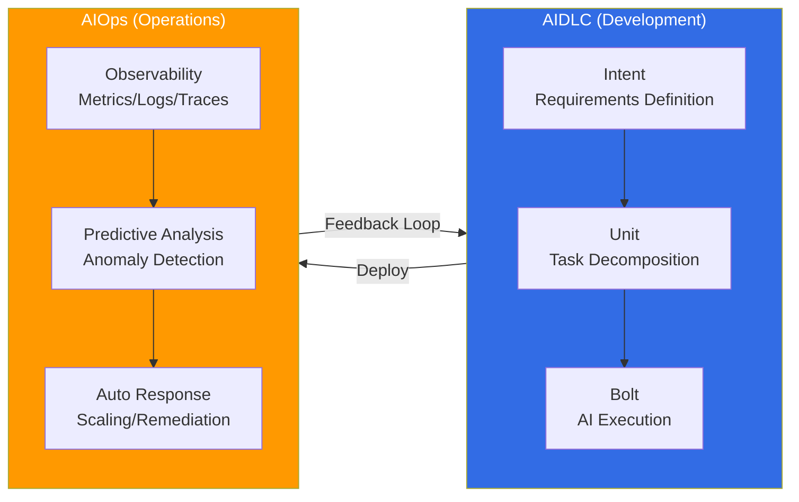

# AIDLC: AI-Driven Development Lifecycle

> **Reading time**: ~3 min

AIDLC (AI-Driven Development Lifecycle) is a new development methodology where AI drives the entire software development process. While traditional SDLC (Software Development Lifecycle) was a human-centric process, AIDLC accelerates the entire development cycle — from requirements analysis to design, implementation, and testing — through the **Intent → Unit → Bolt** model.

## Core Concepts

AIDLC consists of three core pillars:

- **Intent**: Humans define requirements and business intent in natural language. Kiro's Spec-driven development (requirements → design → tasks → code) supports this phase.
- **Unit**: AI decomposes intent into executable work units. Quality is ensured by combining DDD (Domain-Driven Design) with BDD/TDD.
- **Bolt**: AI automatically executes code generation, test writing, and deployment pipeline configuration.

## Reliability Dual Axis: Ontology × Harness

To systematically ensure the reliability of AI-generated code, AIDLC introduces a dual-axis reliability framework:

- **Ontology (WHAT + WHEN)**: A typed world model that formalizes domain knowledge. A living model that continuously evolves through self-feedback loops (Inner/Middle/Outer), preventing AI hallucination.
- **Harness Engineering (HOW)**: A structure that architecturally verifies and enforces the constraints defined by the ontology.

## AIDLC 10 Principles

The AIDLC framework defines 10 principles that systematize AI-driven development. See [AIDLC Framework](./aidlc-framework.md) for details.

## Post-Development: Operations and Feedback Loops

After developing software with AIDLC, **continuous improvement and feedback loops** are needed in the actual production environment. Refer to [AIOps](/docs/aidlc/agentic-ops) for this approach. AIOps is a methodology that systematically builds feedback loops for operational efficiency — including operational observability, predictive scaling, and auto-remediation — leveraging AI.

:::info Learning Path
1. [AIDLC Framework](./aidlc-framework.md) — 10 Principles, Intent→Unit→Bolt Model, DDD Integration, EKS Capability Mapping
2. [AIOps](/docs/aidlc/agentic-ops) — Building Post-Development Operational Feedback Loops
:::

## References

- [AWS AI-Driven Development Life Cycle](https://aws.amazon.com/blogs/devops/ai-driven-development-life-cycle/)
- [AWS Labs AIDLC Workflows (GitHub)](https://github.com/awslabs/aidlc-workflows)
