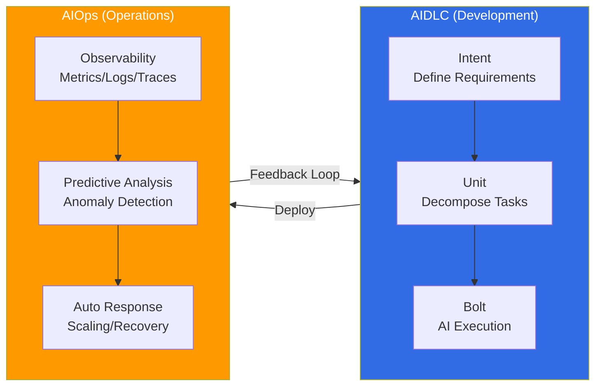

# AIDLC: AI-Driven Development Lifecycle

> **Reading time**: ~3 minutes

AIDLC (AI-Driven Development Lifecycle) is a new development methodology where AI drives the entire software development process. While traditional SDLC (Software Development Lifecycle) was a human-centric process, AIDLC accelerates the entire development cycle through the **Intent → Unit → Bolt** model, where AI leads from requirements analysis to design, implementation, and testing.

## Core Concepts

AIDLC is built on three pillars:

- **Intent**: Humans define requirements and business intent in natural language. Kiro's Spec-driven development (requirements → design → tasks → code) supports this stage.
- **Unit**: AI decomposes intent into actionable unit tasks. Quality is ensured by combining DDD (Domain-Driven Design) with BDD/TDD.
- **Bolt**: AI automatically executes code generation, test writing, and deployment pipeline configuration.

## 10 AIDLC Principles

The AIDLC framework defines 10 principles for systematizing AI-driven development. See [AIDLC Framework](./aidlc-framework.md) for details.

## After Development: Operations and Feedback Loops

After developing software with AIDLC, **continuous improvement and feedback loops** in the production environment are essential. See [AIOps](/docs/aiops) for an approach to this. AIOps is a methodology for systematically building feedback loops for operational efficiency including observability, predictive scaling, and auto-remediation using AI.

:::info Learning Path
1. [AIDLC Framework](./aidlc-framework.md) — 10 principles, Intent→Unit→Bolt model, DDD integration, EKS capabilities mapping
2. [AIOps](/docs/aiops) — Building operational feedback loops after development
:::

## References

- [AWS AI-Driven Development Life Cycle](https://aws.amazon.com/blogs/devops/ai-driven-development-life-cycle/)
- [AWS Labs AIDLC Workflows (GitHub)](https://github.com/awslabs/aidlc-workflows)
