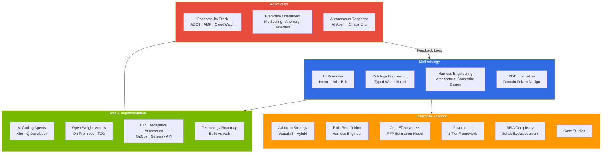

# AIDLC: AI-Driven Development Lifecycle

> **Reading time**: Approximately 3 minutes

AIDLC (AI-Driven Development Lifecycle) is a new development methodology where AI drives the entire software development process. While traditional SDLC was a human-centric process, AIDLC accelerates the entire development cycle from requirements analysis to design, implementation, and testing through the **Intent → Unit → Bolt** model.

## 4 Tracks

The AIDLC guide is organized into 4 tracks based on the reader's role and interests.

## Learning Path by Role

| Role | Recommended Path |
|------|----------|
| **Executives · PM** | [Enterprise Adoption](/docs/aidlc/enterprise) → [Cost Effectiveness](/docs/aidlc/enterprise/cost-estimation) → [Case Studies](/docs/aidlc/enterprise/case-studies) |
| **Architects** | [Methodology](/docs/aidlc/methodology) → [Ontology](/docs/aidlc/methodology/ontology-engineering) → [Harness](/docs/aidlc/methodology/harness-engineering) → [MSA Complexity](/docs/aidlc/enterprise/msa-complexity) |
| **Developers** | [10 Principles](/docs/aidlc/methodology/principles-and-model) → [DDD Integration](/docs/aidlc/methodology/ddd-integration) → [AI Coding Agents](/docs/aidlc/toolchain/ai-coding-agents) |
| **Operations · SRE** | [AgenticOps](/docs/aidlc/operations) → [Observability](/docs/aidlc/operations/observability-stack) → [Autonomous Response](/docs/aidlc/operations/autonomous-response) |
| **Security · Compliance** | [Governance](/docs/aidlc/enterprise/governance-framework) → [Harness Engineering](/docs/aidlc/methodology/harness-engineering) → [Open Weight Models](/docs/aidlc/toolchain/open-weight-models) |

## Core Concepts

### Dual Axes of Reliability: Ontology × Harness

To systematically ensure the reliability of AI-generated code, AIDLC introduces a framework with two axes:

- **[Ontology](/docs/aidlc/methodology/ontology-engineering) (WHAT + WHEN)**: A typed world model that formalizes domain knowledge. It continuously evolves through Inner/Middle/Outer feedback loops and prevents AI hallucination.
- **[Harness Engineering](/docs/aidlc/methodology/harness-engineering) (HOW)**: A structure that architecturally validates and enforces the constraints defined by the ontology. It ensures the safety of AI execution through circuit breakers, retry budgets, output gates, and more.

## References

- [AWS AI-Driven Development Life Cycle](https://aws.amazon.com/blogs/devops/ai-driven-development-life-cycle/)
- [AWS Labs AIDLC Workflows (GitHub)](https://github.com/awslabs/aidlc-workflows)
